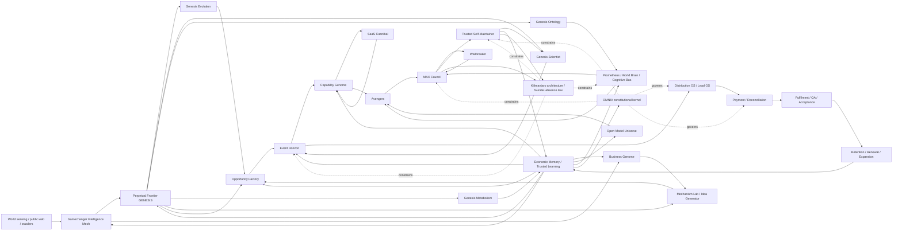

# UberBond Cognitive Map

Status: **DRAFT_BRANCH executable integration map**

This map does not replace `docs/UBERBOND_TOTAL_BRAIN.md`. The Total Brain remains the anti-amputation superset memory. This document shows how the living organs and historical donor lineages connect into one cognitive/economic nervous system.

The machine-readable sources are:

- `src/uberbond-cognitive-graph.mjs` — living-organ graph and typed edges;
- `src/uberbond-cognitive-bus.mjs` — typed cognitive events and activation routing;
- `src/uberbond-cognitive-adapters.mjs` — adapters from current artifacts into brain events;
- `config/uberbond-cognitive-lineage.json` — historical/named donor lineage to living-organ mapping;
- `scripts/uberbond-cognitive-cycle.mjs` — graph integrity + artifact ingestion + activation receipt.

## The brain



## What flows through the synapses

The Cognitive Bus carries **information and attention**, not authority. Canonical event families include:

- world signals;
- Gamechanger candidates;
- GENESIS hypotheses;
- mechanism atoms;
- idea candidates;
- opportunity candidates;
- capability gaps/candidates;
- model candidates;
- experiment results;
- contradictions;
- blockers;
- code defects/change candidates;
- verification results;
- distribution/payment/delivery/retention results;
- commercial outcomes;
- economic learning;
- revocations.

Every activation inherits evidence references and truth class. Every activation explicitly carries `businessEffectAuthority: NONE` and `consequenceAuthority: NONE`.

## Human-brain analogy

The analogy is functional, not biological:

| UberBond organ | Brain-like function |
|---|---|
| World Sensing | sensory input |
| Gamechanger | novelty/salience detector |
| GENESIS | imagination and counterfactual generation |
| Business Genome | mechanism memory |
| Idea Generator | associative recombination |
| Opportunity Factory | hypothesis formation |
| Event Horizon | attention/capital allocation |
| Capability Genome + SaaS Cannibal | tool acquisition and motor-skill selection |
| Open Model Universe | replaceable cognitive suppliers |
| Prometheus / World Brain | integrative working context |
| Avengers | specialist cortical modules |
| MAX Council | adversarial executive reasoning |
| Wallbreaker | alternative-strategy search when stuck |
| Self-Maintainer | bounded motor output for software improvement |
| OMNIA | consequence/authority inhibition and admission |
| Kilimanjaro | whole-organism durability/founder-absence criterion |
| Payment / delivery / retention | reality feedback from the environment |
| Economic Memory | long-term reinforcement and correction |

## Donor-lineage wiring

Historical names remain searchable and are not discarded. They map into living organs through `config/uberbond-cognitive-lineage.json`.

Examples:

- **Everest → SUMMIT 100 → BLACK SKY → Reality Activation** feeds Kilimanjaro, MAX, OMNIA and economic-memory closure discipline.
- **Night Shift / Nightfall / Trinity** feeds World Brain, Avengers, MAX, self-maintenance, distribution and capability acquisition.
- **OMNIA V1 → X10 → X100 → X1M → X8M → X64M → X512M HELIOS → V9** collapses into the current constitutional/admission organ rather than eight fake runtimes.
- **Project Prometheus / Cognitive Bus / Business Genome / Total Commercial Genome / AI Money Hunt / Invisible Money Plumbing / Opportunity Factory / Event Horizon** maps into the opportunity-intelligence and allocation cortex.
- **World Capability Genome / SaaS Cannibal / Frontier Operator / Open Model Foundry / AEGIS / JARVIS / Fable / Elite Duo / Mutation War / reachability war** maps into capability, model, orchestration, adversarial verification and self-maintenance organs.
- **Postal / free-first provider mesh / Lead OS / Proposal Acceptance / Agency Revenue Watchtower / partner white-label distribution** maps into the distribution and commercial-learning organs.
- **Offline Revenue Factory / Demand Recovery Assurance / QA/acceptance factories** maps into fulfilment, retention and reusable learning.

Donor mapping preserves mechanisms and goals. It does **not** claim those historical branches/programs are live today.

## Closed learning loop

The intended company loop is now represented as one graph:

```text
WORLD
  -> SIGNALS
  -> GAMECHANGER
  -> GENESIS / BUSINESS GENOME / IDEA GENERATOR
  -> OPPORTUNITY FACTORY
  -> EVENT HORIZON
  -> CAPABILITY + MODEL SELECTION
  -> AVENGERS + MAX COUNCIL
  -> BOUNDED EXECUTION / SELF-MAINTENANCE
  -> DISTRIBUTION / PAYMENT / DELIVERY / RETENTION
  -> VERIFIED OUTCOMES
  -> ECONOMIC MEMORY
  -> reshape GAMECHANGER, GENESIS, GENOMES, MODELS, ALLOCATION and WORLD BRAIN
  -> repeat
```

## Permanent laws

1. **No amputation.** A newer implementation does not erase donated goals/mechanisms.
2. **No orphan organs.** Every core organ must be connected to the graph.
3. **World-to-action reachability.** World sensing must be able to reach every living organ through typed edges.
4. **Learning return path.** Every living organ must have a path back to trusted economic memory.
5. **Evidence travels; authority does not.** Cognitive routing never grants external consequence authority.
6. **OMNIA remains between intelligence and consequence.** Better cognition does not weaken rights/consent/delegation/admission law.
7. **Kilimanjaro remains whole-organism proof.** Local tests are not founder-absence proof.
8. **MAX Council remains adversarial evidence, not sovereignty.** Agreement cannot mint write/merge/deploy/customer/payment authority.
9. **Self-improvement cannot widen its own cage.** Sovereignty/build/protected paths remain outside autonomous modification.
10. **Commercial reality trains the brain.** Cleared payment, accepted delivery, retention and measured founder minutes outrank architectural confidence.

## Runtime status

On this branch, Gamechanger's existing hourly workflow now runs the cognitive graph tests after Gamechanger/GENESIS contract tests, executes `scripts/uberbond-cognitive-cycle.mjs` after the GENESIS tick, and uploads `artifacts/uberbond-cognitive-cycle-latest.json` beside the existing frontier artifacts.

That makes Gamechanger + GENESIS the first live artifact producers wired onto the shared bus. Capability Genome, self-maintainer and commercial outcome adapters are already defined and can be supplied to the cognitive-cycle script as their receipts become available in the same runtime.

Truth boundary: this wiring is source-level work on PR #400 until exact-head execution proves it. Vercel build-rate limiting can block hosted verification and must not be misrepresented as a software pass or failure.
