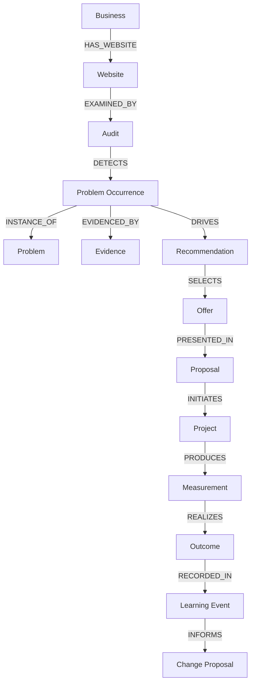
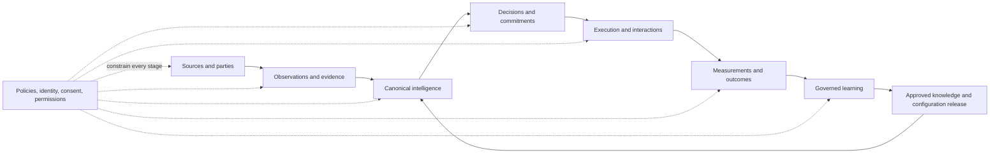

# UBERBOND Core Data Model

> Canonical information architecture — Version 1.0.0  
> Status: Structurally validated baseline; domain and regulatory approval pending  
> Effective date: 2026-07-14  
> Companion specifications: UBERBOND Knowledge Graph v1.0.0, Decision Engine v1.0.0, and Learning Engine v1.0.0  
> Scope: Canonical entities, relationships, metadata, identity, lifecycle, AI readiness, analytics, security, and product projections

## Document contract

This document is the canonical human-readable information architecture for UBERBOND. It is not application code, SQL, a JSON schema, or an ORM definition. It defines stable meaning and governance; physical databases, APIs, indexes, queues, caches, warehouses, vector stores, and product views are projections of this model.

The terms **MUST**, **MUST NOT**, **SHOULD**, **SHOULD NOT**, and **MAY** are normative:

- **MUST/MUST NOT:** required for a conforming data product.
- **SHOULD/SHOULD NOT:** expected unless a documented exception is approved.
- **MAY:** optional inside the defined semantic and governance boundary.

### Compatibility contract

This model preserves:

- Knowledge Graph IDs `IND-###`, `ARC-##`, `PRB-CCC-###`, `SRV-CCC-###`, `OFR-###`, `OUT-###`, and evidence source types `EV-##`;
- Decision Engine artifacts including `DEC-YYYY-NNNNNN`, `SCR-CCC`, `EST-CCC`, `REV-YYYY-NNNNNN`, `PRA-YYYY-NNNNNN`, `OUTR-YYYY-NNNNNN`, `PROP-YYYY-NNNNNN`, and `MOD-YYYY-NNNNNN`;
- Learning Engine artifacts including `LRN-YYYY-NNNNNN`, `LET-CCC-NNN`, `LCS-YYYY-NNNNNN`, `HYP-YYYY-NNNNNN`, `EXP-YYYY-NNNNNN`, `RFL-YYYY-NNNNNN`, `KCP-YYYY-NNNNNN`, `DCP-YYYY-NNNNNN`, `CAL-CCC-NNN`, and `LRE-YYYY-NNNNNN`;
- evidence confidence, decision confidence, attribution grades A–E, review levels R0–R4, bitemporal history, append-only correction, hard gates, and champion–challenger promotion;
- the distinction between a canonical Problem and a company-specific Problem Occurrence, expected Outcome and measured realization, logical Decision and immutable Decision Record, raw Event and eligible Learning Event.

Existing published IDs retain their meaning. This model may add a durable parent, role, revision, or projection around them; it does not repurpose them.

### Canonical entity universe

Version 1 defines 100 operational/intelligence entities in Section 2 and eight specialized analytical entities in Section 7. The universe is extensible, not ungoverned: a future entity type requires a semantic definition, non-duplication proof, identity strategy, lifecycle, ownership, security, retention, relationship contract, migrations, and approval.

No product, API, agent, or database may create a competing local meaning for a canonical entity. Product-specific fields live in an approved extension namespace or a related entity until promoted.

### Semantic layers

| Layer | Meaning | Examples |
|---|---|---|
| Canonical definition | Reusable concept independent of one company or event | Industry, Problem, Service, Metric, Policy |
| Resolved real-world entity | Durable identity of a party, asset, place, or system | Business, Person, Website, Technology, Market |
| Role/relationship state | Time-bounded role around a resolved entity | Customer, Lead, Partner, Vendor, Competitor, Contact |
| Observation/evidence | What was observed, from where, when, and under what authority | Observation, Evidence, Attachment, Provenance Record |
| Inference/decision | Versioned interpretation or choice based on a frozen snapshot | Problem Occurrence, Opportunity, Recommendation, Decision Record |
| Transaction/commitment | Commercial or operational obligation and settlement | Proposal, Contract, Subscription, Invoice, Payment, Booking |
| Execution | Planned or actual work and system activity | Project, Workflow Run, Task, Agent Run, Event, Log |
| Outcome/learning | Measured result and governed change evidence | Measurement, Outcome, Experiment, Learning Event, Reflection |
| Projection | Search, graph, analytics, or product view derived from canonical records | Knowledge Node/Edge, Dashboard, Time Series, Aggregation |

### Profile shorthand used by entity specifications

Each entity explicitly names profiles defined here and expanded in Sections 5 and 8.

#### Lifecycle profiles

| Code | Profile | Typical states |
|---|---|---|
| `L1` | Canonical reference | Proposed → Provisional → Active → Contested/Deprecated → Retired/Superseded |
| `L2` | Resolved identity/asset | Discovered → Candidate → Verified → Active → Inactive/Merged/Split → Archived |
| `L3` | Role/relationship | Proposed → Active → Suspended → Ended → Archived |
| `L4` | Immutable observation/event | Recorded → Validated/Quarantined/Rejected → Corrected/Superseded → Archived |
| `L5` | Analytical/inference | Draft → Calculated → Validated/Reviewed → Active → Expired/Superseded → Archived |
| `L6` | Commercial transaction | Draft → Issued/Pending → Accepted/Settled/Declined/Cancelled → Closed/Archived |
| `L7` | Work/execution | Draft/Queued → Active/In progress → Blocked/Paused → Completed/Failed/Cancelled → Archived |
| `L8` | Security/access | Pending/Invited → Active → Locked/Suspended → Revoked/Expired → Deleted/Archived |
| `L9` | Versioned configuration/model | Draft → Testing/Shadow → Approved/Active → Restricted/Rolled back → Retired |
| `L10` | Publication/communication | Draft → Reviewed/Scheduled → Published/Sent → Corrected/Withdrawn/Expired → Archived |

#### Ownership profiles

| Code | Ownership rule |
|---|---|
| `O1` | UBERBOND-owned canonical definition with named steward |
| `O2` | Tenant-owned operational/customer record; UBERBOND is processor/custodian as contracted |
| `O3` | Shared-governed record requiring both platform and tenant accountability |
| `O4` | Data-subject-controlled personal/contact/consent state within legal and contractual rules |
| `O5` | Externally authoritative reference mirrored with source provenance and no false ownership claim |

#### Confidence profiles

| Code | Confidence rule |
|---|---|
| `C0` | Authoritative/declared state; confidence is applicability or identity assurance, not probability of truth |
| `C1` | Observed evidence confidence using source quality, agreement, coverage, freshness, match, and contradiction |
| `C2` | Derived/inferred confidence with frozen inputs, method, calibration, sensitivity, and uncertainty |
| `C3` | Predictive confidence/probability requiring calibration, horizon, context, and OOD handling |
| `C4` | Composite/path confidence constrained by mandatory upstream records and independent provenance |
| `C5` | Confidence not semantically applicable; use integrity/validation state instead |

#### History profiles

| Code | History rule |
|---|---|
| `H1` | Immutable append-only record; correction creates a superseding record |
| `H2` | Stable entity identity with mutable current head and immutable revisions |
| `H3` | Bitemporal fact/relationship with effective time and system knowledge time |
| `H4` | Transaction ledger; reversal/credit/cancellation rather than destructive rewrite |
| `H5` | Versioned definition/configuration; active pointer changes while prior versions remain addressable |

#### Security profiles

| Code | Default classification |
|---|---|
| `S0` | Public/reference; integrity and provenance still protected |
| `S1` | UBERBOND internal; role-limited and encrypted |
| `S2` | Tenant confidential; tenant isolation, purpose limitation, encryption, and audit |
| `S3` | Restricted personal/financial; field-level access, minimization, rights, strong encryption |
| `S4` | Highly restricted/security-sensitive; need-to-know, strongest isolation, short access, specialist review |

#### Retention profiles

| Code | Default retention principle |
|---|---|
| `R1` | Canonical/reference: durable while semantically required; retired versions preserved for resolution |
| `R2` | Customer/contract: contract, legal, dispute, and approved audit period; then delete or minimize |
| `R3` | Purpose-limited personal: shortest authorized purpose and rights window |
| `R4` | Event/evidence: source volatility, decision replay, claim, incident, and lawful audit need |
| `R5` | Financial/legal: statutory, tax, accounting, contractual, and dispute schedule |
| `R6` | Operational transient: active work plus bounded diagnostic/recovery period |
| `R7` | Model/analytics: reproducibility and validity period using minimized snapshots/sufficient statistics |
| `R8` | Security secret/session: shortest technical necessity; revoke/rotate/delete aggressively |

---

# 1. Philosophy

## 1.1 Core principles

1. **Meaning before storage:** define the real-world concept, identity, grain, owner, time, and evidence before choosing a physical representation.
2. **One canonical identity:** a real entity receives one durable canonical ID; source IDs and aliases resolve to it.
3. **Definitions differ from occurrences:** reusable Problem, Service, Metric, and Outcome definitions never absorb company-specific state.
4. **Roles differ from parties:** Customer, Lead, Partner, Vendor, Contact, and Competitor are contextual roles around resolved parties.
5. **Facts differ from inferences:** observations, evidence, scores, recommendations, and decisions remain independently inspectable.
6. **Events differ from current state:** immutable events explain how a materialized current view was reached.
7. **Temporal by default:** material facts and relationships record when they were true and when UBERBOND knew them.
8. **Provenance is data:** every consequential value resolves to source, method, actor, authority, transformations, and versions.
9. **No silent deletion or mutation:** corrections, merges, splits, reversals, deprecations, and retirements preserve lineage.
10. **Least privilege and purpose:** tenancy, ownership, consent, data class, residency, and retention travel with data.
11. **AI is a consumer and contributor, not an authority:** models produce versioned contributions; deterministic policy governs use.
12. **Scale through partitionable semantics:** identity, time, tenancy, region, event, and relationship boundaries support hundreds of millions of businesses and thousands of concurrent agents.

## 1.2 Single source of truth

“Single source of truth” means one authoritative semantic owner and canonical record lineage per fact—not one physical database.

- The canonical layer owns IDs, definitions, states, relationship meanings, and version lineage.
- Operational stores may materialize purpose-specific views but must retain canonical IDs and source versions.
- Search indexes, vector stores, warehouses, caches, graph projections, CRM views, and agent memory are derived and rebuildable.
- A field has a named system of record, data steward, validation rule, freshness policy, and conflict policy.
- When two sources legitimately disagree, the source of truth is a governed conflict record—not an arbitrary winner.
- Authoritative external references such as regulation, currency, or country codes remain externally owned and locally mirrored with provenance.

## 1.3 Entity identity

- IDs are globally unique, opaque, immutable, non-recycled, and free of mutable names or personal data.
- Canonical IDs are distinct from source-system IDs, slugs, domains, emails, tax numbers, or usernames.
- Identity resolution stores candidates, match evidence, confidence, reviewer, effective dates, and merge/split lineage.
- Aliases and source identifiers are time-bounded and namespaced by issuer/source.
- A merge selects a surviving canonical ID while preserving redirects and all source history.
- A split creates new IDs and an allocation map; it never rewrites historical facts without review.
- A Business, Organization, Brand, Website, Location, Person, Contact, Authentication Identity, and Customer role have separate identities even when a small company has one of each.
- Entity keys are never inferred solely from mutable contact fields.

## 1.4 Relationship philosophy

- Relationships are first-class, typed, directed or explicitly symmetric, versioned, temporal, scoped, and provenance-bearing.
- Cardinality and uniqueness belong to relationship semantics, not application convention.
- Role, membership, ownership, classification, evidence, causal, eligibility, dependency, commercial, execution, and measurement relationships use distinct predicates.
- A relationship may be observed, declared, inferred, predicted, or governed; that epistemic status is explicit.
- Many-to-many relationships use a relationship record when they carry role, weight, scope, dates, permissions, confidence, or history.
- Derived graph paths never create new facts recursively.
- Deleting an endpoint does not silently erase lawful relationship history; privacy/security policy determines minimization and tombstones.

## 1.5 Data ownership

- UBERBOND owns its canonical ontology, internal policies, delivery methods, aggregate intellectual property, and platform-generated records subject to contracts and law.
- Tenants own or control customer-provided business, operational, project, and outcome data as contracted.
- Individuals retain applicable rights over personal data, consent, preferences, and communications.
- External authorities and vendors remain the source owners of mirrored reference/market data.
- Derived insights record both custodial owner and intellectual-property/use rights; derivation does not erase source rights.
- Ownership never implies unrestricted processing. Purpose, permission, confidentiality, residency, and retention remain separate controls.

## 1.6 Data evolution

Evolution is additive and versioned:

1. propose semantic change;
2. prove non-duplication and business need;
3. define identity, attributes, relationships, lifecycle, ownership, security, retention, and migrations;
4. test historical and current projections;
5. approve by data/knowledge/security/domain owners;
6. release with compatibility window and rollback;
7. deprecate before retirement;
8. preserve aliases, redirects, and old versions.

New optional fields are normally backward-compatible. Changed meaning, grain, identity, requiredness, unit, enum semantics, or relationship cardinality requires a new version and migration.

## 1.7 Backward compatibility

- Published entity IDs, event meanings, metric definitions, decision records, and version references never change meaning.
- Renames add aliases; they do not replace IDs.
- Consumers declare supported semantic versions and receive a compatibility contract.
- Additive optional attributes and relationships use minor versions; incompatible changes use a major version.
- Deprecation includes successor, reason, migration, start/end dates, affected products, and review.
- Historical reads resolve the version valid at that effective/system time.
- API or storage convenience cannot justify a semantic break.

## 1.8 Explainability

Any material entity, value, relationship, score, decision, or AI output must answer:

- What is it, at what grain, and which canonical ID identifies it?
- Who/what does it concern, and in what tenant/context/time?
- Is it declared, observed, derived, inferred, predicted, approved, or disputed?
- Which sources and transformations produced it?
- What confidence, quality, integrity, missingness, and contradiction apply?
- Which version, policy, model, prompt, agent, human, and review influenced it?
- What alternatives or conflicting records exist?
- Who owns it, who may access it, and when does it expire?
- What superseded it or would change it?

## 1.9 Traceability

Traceability is bidirectional:

- **Forward:** source → observation → feature/evidence → inference → decision → action/project → outcome → learning.
- **Backward:** dashboard, recommendation, proposal, model output, or agent answer → exact input records and versions.

Every consequential record carries correlation and causation links sufficient to reconstruct its lineage. A natural-language explanation is not a substitute for structured traceability.

## 1.10 Provenance

Provenance records:

- source identity and authority;
- collector/actor/agent and method;
- source identifier, location, checksum, and retrieval/observation time;
- tenant, purpose, consent/permission, terms, and data class;
- raw value/artifact and normalized value with units;
- transformations, joins, exclusions, and definition versions;
- model/prompt/tool contribution and human review;
- confidence, quality, integrity, contradictions, and corrections;
- effective/expiry times and retention/deletion state.

Provenance itself is access-controlled: an explanation may reveal the nature of a source without exposing restricted content or credentials.

---

# 2. Canonical Entities

## 2.1 Entity specification contract

Every entity below defines the ten required facets. “Core attributes” are semantically mandatory when applicable; a physical projection may defer them only while the record is in a pre-validation state. “Optional” means context-dependent, not ungoverned.

Entity relationships list principal links; Section 3 is authoritative for predicate direction and cardinality. Universal metadata from Section 4 applies in addition to every listed attribute.

## 2.2 Parties, identity, tenancy, and access

### 2.2.1 Organization — `ORG-...`

| Facet | Canonical specification |
|---|---|
| Purpose | Durable party and administrative boundary for UBERBOND, a client, agency, enterprise, partner, vendor, public body, or other organized group |
| Lifecycle | `L2`; candidate → verified → active → inactive/merged/split → archived |
| Core attributes | canonical name, organization type, legal/operating status, parent organization, primary country, tenant eligibility, verified identifiers |
| Optional attributes | legal names, registration/tax identifiers, trading names, domains, locations, industry mix, hierarchy metadata |
| Relationships | parent/child Organization; owns Workspace/Business/Brand; has Customer/Partner/Vendor roles; employs/associates Person; assigned Team/Policy |
| Ownership | `O3`; party facts may be tenant-controlled, while canonical identity and merge lineage are data-steward governed |
| Confidence | `C1` for identity/classification; authoritative registrations marked separately from inferred attributes |
| History | `H2` plus `H3` for names, hierarchy, status, and identifiers |
| Security considerations | `S2`; registration and hierarchy may be confidential; tax/legal identifiers are restricted fields |
| Retention policy | `R2`; retain identity/contract lineage as required, minimize inactive confidential fields after relationship ends |

### 2.2.2 Workspace — `WSP-...`

| Facet | Canonical specification |
|---|---|
| Purpose | Tenant-scoped collaboration, data, policy, billing, region, and product boundary within an Organization |
| Lifecycle | `L3`; provisioned → active → suspended → closed → archived/deleted |
| Core attributes | owning organization, workspace type, tenant boundary, region, default language/currency/time zone, status, policy profile |
| Optional attributes | brand, business-unit, client, environment, billing account, data-residency, feature entitlements, quotas |
| Relationships | belongs to Organization; contains Teams, Projects, Data Sets, Integrations, Agents; governed by Access Policies and Subscriptions |
| Ownership | `O2`; owning organization controls workspace data within platform and contract policy |
| Confidence | `C0`; provisioned state is authoritative, while inferred configuration quality is separate |
| History | `H2` with immutable provisioning, suspension, transfer, and closure events |
| Security considerations | `S2`; primary tenant-isolation boundary; cross-workspace access requires explicit grant and audit |
| Retention policy | `R2`; closure initiates export, legal hold, minimization, and deletion schedule |

### 2.2.3 Business — `BUS-...`

| Facet | Canonical specification |
|---|---|
| Purpose | Resolved commercial/operating entity that UBERBOND analyzes, recommends to, compares, or serves |
| Lifecycle | `L2`; discovered → candidate → verified → active → inactive/acquired/merged/split → archived |
| Core attributes | canonical business name, organization link or unresolved-party state, operating status, industry mix, company size, revenue model, primary markets, verified domains/locations |
| Optional attributes | employee/revenue bands, founding date, ownership, maturity, goals, decision-makers, public profiles, identifiers, brand portfolio |
| Relationships | belongs to/represents Organization; operates Brand/Location/Website; classified as Industry/Archetype; has Problems, Audits, Opportunities, Competitors and role records |
| Ownership | `O3`; public identity is stewarded, tenant-provided private economics remain tenant-owned |
| Confidence | `C4`; publish component confidence for identity, classification, size, market, and private/public attributes |
| History | `H2` and `H3`; mergers, name changes, classifications, ownership, and operating status are temporal |
| Security considerations | `S1` for public profile, `S2` for private business data; do not infer sensitive owner/employee traits |
| Retention policy | `R1` for public canonical identity; `R2/R3` for tenant/private/contact-linked data |

### 2.2.4 Brand — `BRD-...`

| Facet | Canonical specification |
|---|---|
| Purpose | Distinct market-facing identity, promise, name, or portfolio unit operated by an Organization/Business |
| Lifecycle | `L2`; discovered → verified → active → rebranded/inactive → archived |
| Core attributes | canonical brand name, owning/operating party, brand type, primary market, status, effective dates |
| Optional attributes | aliases, trademarks, positioning, visual identity references, languages, domains, social profiles, parent/sub-brand |
| Relationships | owned/operated by Organization/Business; represented by Websites/Products/Campaigns; competes in Market; has Brand-specific Problems/Outcomes |
| Ownership | `O3`; owner-supplied brand facts and external observations retain separate provenance |
| Confidence | `C1`; ownership, current name, and entity match carry independent confidence |
| History | `H2/H3`; preserve rebrands, ownership transfer, alias, and market validity |
| Security considerations | `S1` public; unreleased positioning, campaigns, or product plans are `S2` |
| Retention policy | `R1` identity/history; confidential brand strategy follows `R2` |

### 2.2.5 Customer — `CUS-...`

| Facet | Canonical specification |
|---|---|
| Purpose | Time-bound commercial/service relationship between UBERBOND or an agency tenant and an Organization/Business |
| Lifecycle | `L3`; prospect-converted → onboarding → active → at risk/suspended → churned/ended → archived |
| Core attributes | provider workspace, customer organization/business, relationship start/status, owner team, contract/account references, service state |
| Optional attributes | segment, health, success plan, preferences, billing contact, renewal, satisfaction, support tier, acquisition source |
| Relationships | role of Organization/Business; has Contacts, Contracts, Subscriptions, Projects, Invoices, Conversations, Outcomes and Support Cases |
| Ownership | `O2/O3`; tenant owns relationship data, subject organization controls supplied data and rights |
| Confidence | `C0` for contracted status; `C2/C3` for health, churn, CLV, or intent predictions |
| History | `H3`; preserve lifecycle state, ownership, segment, renewal, and relationship periods |
| Security considerations | `S2`; personal/contact, financial, support, and outcome fields inherit stricter classes |
| Retention policy | `R2/R5`; retain contractual/audit history, minimize operational and personal data after required periods |

### 2.2.6 Lead — `LEA-...`

| Facet | Canonical specification |
|---|---|
| Purpose | Qualified commercial-interest state connecting a Business and optionally Contacts to a defined opportunity or campaign |
| Lifecycle | `L3`; identified → enriched → qualified/unqualified → engaged → converted/lost/expired → archived |
| Core attributes | target business, provider workspace, source, qualification status, owner, eligibility, created/expiry dates |
| Optional attributes | contact set, score references, buying intent, need, budget/timing, campaign, loss reason, suppression state |
| Relationships | references Business, Contacts, Campaign, Opportunity, Conversations, Decision Records, Proposal; converts to Customer role |
| Ownership | `O2`; tenant commercial record, with personal fields governed by subjects and source permissions |
| Confidence | `C4`; separate entity match, fit, intent, reachability, and eligibility confidence |
| History | `H3`; stage/owner/score changes are events, not destructive current-field edits |
| Security considerations | `S2/S3`; no protected-trait or vulnerability scoring; permission and suppression gate outreach |
| Retention policy | `R3`; expire unengaged or ineligible leads by source/jurisdiction policy; preserve minimal suppression/audit state |

### 2.2.7 Person — `PER-...`

| Facet | Canonical specification |
|---|---|
| Purpose | Resolved natural person distinct from their accounts, contact points, employment roles, and authentication identities |
| Lifecycle | `L2`; candidate → verified/declared → active → inactive/merged/split → restricted/deleted |
| Core attributes | canonical internal identifier, identity assurance level, permitted names, status, data-subject jurisdiction |
| Optional attributes | preferred name, pronouns when volunteered/needed, organization affiliations, titles, languages, time zone |
| Relationships | has Contacts and Authentication Identities; affiliated with Organizations/Businesses through Role Assignments; participates in Conversations, Reviews, Bookings and Teams |
| Ownership | `O4`; UBERBOND/tenant are custodians under applicable purpose and rights |
| Confidence | `C1`; identity match confidence separate from self-declared attributes |
| History | `H2/H3`; merge/split and affiliations preserve time; corrections retain restricted lineage |
| Security considerations | `S3`; strict minimization, subject rights, no sensitive inference, field-level access and redaction |
| Retention policy | `R3`; retain only while purpose/relationship/obligation exists; preserve permitted suppression and audit tombstones |

### 2.2.8 Contact — `CNT-...`

| Facet | Canonical specification |
|---|---|
| Purpose | A specific person-to-organization/business relationship and reachable business context, not a duplicate Person |
| Lifecycle | `L3`; discovered/declared → verified → active → stale/invalid/suppressed → ended/archived |
| Core attributes | person, organization/business, role/title, relationship type, source, verification and validity dates, contact status |
| Optional attributes | department, seniority, decision role, preferred channel/time/language, contact points, assistant, territory |
| Relationships | links Person to Organization/Business; has Consent/Preferences; participates in Lead, Conversation, Campaign, Booking, Proposal and Outreach decisions |
| Ownership | `O4/O2`; relationship context is tenant-custodied, personal preferences remain subject-controlled |
| Confidence | `C4`; identity, affiliation, role, reachability, freshness, and decision relevance remain separate |
| History | `H3`; employment/role/contact points and verification expire; wrong-recipient corrections supersede |
| Security considerations | `S3`; outreach requires verified role, lawful purpose, permission, suppression and frequency controls |
| Retention policy | `R3`; stale/disconnected contact data expires; retain minimal suppression and dispute evidence as allowed |

### 2.2.9 Authentication Identity — `AID-...`

| Facet | Canonical specification |
|---|---|
| Purpose | Login/federated/service identity used to authenticate a Person, Agent, service, or Organization context |
| Lifecycle | `L8`; provisioned/invited → verified/active → locked/suspended → revoked/expired → deleted |
| Core attributes | subject type/ID, identity provider, provider subject ID, assurance method/level, workspace scope, status, last verification |
| Optional attributes | MFA methods, recovery methods, device trust, federation tenant, credential rotation, risk signals |
| Relationships | authenticates Person/Agent/service; belongs to Workspace/Organization; creates Sessions; receives Role Assignments |
| Ownership | `O3/O4`; platform controls authentication record, subject/organization controls identity-provider relationship |
| Confidence | `C0` for provider assertion plus assurance/risk levels; never infer person identity from email alone |
| History | `H1/H3`; login, verification, linking, lock and revoke events are immutable |
| Security considerations | `S4`; secrets stored separately; provider IDs tokenized; phishing, takeover, recovery and federation risks monitored |
| Retention policy | `R8`; revoke promptly, retain minimal security/audit history per policy |

### 2.2.10 Session — `SES-...`

| Facet | Canonical specification |
|---|---|
| Purpose | Bounded authenticated or agent interaction context with explicit subject, workspace, purpose, time, and capabilities |
| Lifecycle | `L8`; initiated → active → idle/reauth-required → ended/revoked/expired |
| Core attributes | authentication identity or agent, workspace, start/expiry, assurance, purpose, client/tool context, status |
| Optional attributes | device/network risk, delegated actor, conversation, agent run, locale, feature flags, step-up events |
| Relationships | created by Authentication Identity; scopes Conversations, Agent Runs, Events, Logs and API activity; governed by Access Policy |
| Ownership | `O3`; platform security record within tenant and subject rights |
| Confidence | `C0/C1`; authentication assertion plus continuously evaluated risk, not identity truth beyond assurance |
| History | `H1`; renewals and privilege changes create linked session events |
| Security considerations | `S4`; short-lived tokens, revocation, fixation/replay prevention, device/risk controls, no secret logging |
| Retention policy | `R8`; session material expires quickly; retain minimized security/audit metadata as required |

### 2.2.11 Team — `TEM-...`

| Facet | Canonical specification |
|---|---|
| Purpose | Named group of people/agents responsible for work, data, products, customers, reviews, or policies within a Workspace |
| Lifecycle | `L2`; proposed → active → reorganized/inactive → archived |
| Core attributes | workspace, name, team type, owner, status, scope |
| Optional attributes | parent team, cost center, service/domain responsibilities, on-call schedule, default roles |
| Relationships | belongs to Workspace; has Team Memberships; owns entities; assigned Projects, Tasks, Customers, Policies and Reviews |
| Ownership | `O2`; tenant organizational record |
| Confidence | `C0` for declared structure; external inferred teams use `C1` and separate provenance |
| History | `H3`; membership and responsibility intervals preserved |
| Security considerations | `S2`; team visibility and access do not automatically follow organizational hierarchy |
| Retention policy | `R2`; archive dissolved teams while preserving work, approval, and access lineage |

### 2.2.12 Team Membership — `TMB-...`

| Facet | Canonical specification |
|---|---|
| Purpose | Time-bounded membership of a Person or Agent in a Team with capacity and responsibility context |
| Lifecycle | `L3`; proposed → active → suspended/ended → archived |
| Core attributes | team, member subject, membership type, start/end, status, source/approver |
| Optional attributes | allocation, manager, primary flag, location, schedule, responsibility, delegation |
| Relationships | links Team to Person/Agent; may grant Role Assignments and ownership responsibilities |
| Ownership | `O2`; tenant-declared, with platform audit |
| Confidence | `C0` when administratively assigned; inferred external memberships use separate records |
| History | `H3`; changes append effective intervals; never overwrite who held responsibility |
| Security considerations | `S2/S3`; membership is not permission by itself; exposure limited by workspace policy |
| Retention policy | `R2`; retain responsibility/access history for audit, minimize after required period |

### 2.2.13 Role — `ROL-...`

| Facet | Canonical specification |
|---|---|
| Purpose | Reusable named bundle of responsibilities and eligible permissions, separate from a person’s business title |
| Lifecycle | `L1/L9`; draft → approved/active → deprecated → retired |
| Core attributes | canonical name, role type, scope class, permission set, owner, status, version |
| Optional attributes | inheritance, constraints, review level, jurisdiction, separation-of-duty conflicts |
| Relationships | contains Permissions; assigned through Role Assignment to Person/Agent/Team/Identity; governed by Policy |
| Ownership | `O1` for platform roles, `O2` for tenant roles |
| Confidence | `C5`; validity and approval replace probabilistic confidence |
| History | `H5`; permission changes create new role version and affected-assignment review |
| Security considerations | `S1/S2`; least privilege, no implicit broad inheritance, separation-of-duty testing |
| Retention policy | `R1/R2`; preserve retired versions referenced by historical access decisions |

### 2.2.14 Role Assignment — `RAS-...`

| Facet | Canonical specification |
|---|---|
| Purpose | Scoped, time-bounded grant of a Role to a subject within an organization/workspace/resource context |
| Lifecycle | `L8`; requested → approved/active → suspended → revoked/expired |
| Core attributes | subject, role/version, scope, grantor/approver, start/expiry, status |
| Optional attributes | conditions, delegation chain, justification, ticket/review, emergency flag, recertification |
| Relationships | links Person/Agent/Team/Authentication Identity to Role; constrained by Access Policy and separation rules |
| Ownership | `O3`; tenant grants, platform enforces and audits |
| Confidence | `C0`; authoritative authorization state |
| History | `H1/H3`; grants, changes, use and revocations remain immutable |
| Security considerations | `S4`; default deny, bounded scope/time, step-up, dual control for high privilege |
| Retention policy | `R8/R2`; active state short and recertified; audit history retained per risk/obligation |

### 2.2.15 Permission — `PERM-...`

| Facet | Canonical specification |
|---|---|
| Purpose | Atomic, stable authorization verb over a resource/action class, used to construct roles and policy decisions |
| Lifecycle | `L1/L9`; proposed → approved/active → deprecated → retired |
| Core attributes | canonical action, resource type, effect, risk class, owner, version, status |
| Optional attributes | field/action constraints, required assurance, review, jurisdiction, purpose, rate/budget ceiling |
| Relationships | included in Role; evaluated by Access Policy/Policy Gate; exercised by Session/Agent Run/API action |
| Ownership | `O1`; security/data owner jointly govern |
| Confidence | `C5`; semantic validity and test coverage apply |
| History | `H5`; changes create version; historical authorization resolves old meaning |
| Security considerations | `S1`; deny-by-default, no wildcard without explicit risk approval, sensitive fields/actions separated |
| Retention policy | `R1`; retain retired meanings for audit and historical access replay |

### 2.2.16 Access Policy — `ACP-...`

| Facet | Canonical specification |
|---|---|
| Purpose | Deterministic rule governing who may perform which action on which resource for which purpose/context |
| Lifecycle | `L9`; draft → tested → approved/active → restricted/rolled back → retired |
| Core attributes | subject/resource/action conditions, effect, priority, owner, jurisdiction, version, status |
| Optional attributes | field filters, row/tenant scope, time/location/device, purpose, consent, review, rate/budget, exception policy |
| Relationships | evaluates Roles, Permissions, Sessions, Workspaces, data classifications, Consent, Policy Gates and resources |
| Ownership | `O1/O2`; platform baseline plus tenant restrictions; tenant cannot weaken non-waivable platform policy |
| Confidence | `C5`; policy correctness determined by tests/approval, not learned probability |
| History | `H5`; every decision pins policy version and result |
| Security considerations | `S4`; policy-as-data integrity, change approval, conflict resolution, default deny, simulation/replay |
| Retention policy | `R1/R2`; preserve versions used by access decisions and incidents |

### 2.2.17 Consent and Preference — `CNP-...`

| Facet | Canonical specification |
|---|---|
| Purpose | Authoritative, scoped statement of a subject’s or organization’s permission, objection, communication preference, suppression, or withdrawal |
| Lifecycle | `L8`; requested/unknown → granted/denied → modified/withdrawn/expired → archived |
| Core attributes | subject, controller/workspace, purpose, channel/data scope, status, source, effective/expiry time, proof |
| Optional attributes | jurisdiction/legal basis, frequency, preferred time/language, method, notice version, parent/guardian authority |
| Relationships | governs Contact, Campaign, Conversation, Integration, Data Set, Learning Event, Model use and Notification |
| Ownership | `O4`; subject/authorized organization controls choice; platform enforces and proves state |
| Confidence | `C0` for verified state; identity/proof assurance recorded separately |
| History | `H1/H3`; never overwrite prior grant/withdrawal; latest applicable state computed deterministically |
| Security considerations | `S3`; highly integrity-sensitive; denial/withdrawal fail closed and propagate promptly |
| Retention policy | `R3`; retain minimal proof/suppression as legally necessary after other personal data deletion |

### 2.2.18 Partner — `PTR-...`

| Facet | Canonical specification |
|---|---|
| Purpose | Time-bound partner role of an Organization/Business in referral, delivery, data, technology, distribution, or strategic activity |
| Lifecycle | `L3`; identified → vetted → active → suspended/ended → archived |
| Core attributes | party, workspace, partner type, scope, owner, start/status, agreement reference |
| Optional attributes | territories, capabilities, certifications, referral terms, conflicts, performance, risk tier |
| Relationships | role of Organization/Business; linked to Contracts, Services, Projects, Leads, Integrations, Payments and Reviews |
| Ownership | `O3`; relationship jointly governed; canonical party identity remains separate |
| Confidence | `C0` for contracted status; `C2` for capability/performance assessment |
| History | `H3`; terms, scope, capability and status intervals preserved |
| Security considerations | `S2`; access/data sharing only through explicit contract, role and purpose; conflict review |
| Retention policy | `R2/R5`; retain agreement/audit history, remove unnecessary shared data after termination |

### 2.2.19 Vendor — `VND-...`

| Facet | Canonical specification |
|---|---|
| Purpose | Time-bound supplier role of an Organization/Business providing software, data, infrastructure, services, or other inputs |
| Lifecycle | `L3`; discovered → assessed/approved → active → restricted/terminated → archived |
| Core attributes | party, vendor category, provided capability, owner, risk tier, status, contract and review dates |
| Optional attributes | subprocessors, regions, certifications, SLA, data classes, spend, alternatives, exit plan |
| Relationships | role of Organization/Business; supplies Technology/Service/Data Source/Integration; linked to Contract, Invoice, Payment, Incident and Review |
| Ownership | `O3`; procurement/security steward relationship, external party owns its authoritative claims |
| Confidence | `C4`; declared, verified and observed risk/capability evidence kept separate |
| History | `H3`; reviews, scope, subprocessor and risk changes are temporal |
| Security considerations | `S2/S4`; due diligence, least data, contractual controls, supply-chain monitoring, revocation/exit |
| Retention policy | `R2/R5`; retain procurement, financial, security and incident history as required |

## 2.3 Classification, geography, and market context

### 2.3.1 Industry — `IND-###`

| Facet | Canonical specification |
|---|---|
| Purpose | Stable commercial/operating classification with reusable buying, revenue, website, problem, maturity, and recurring-opportunity priors |
| Lifecycle | `L1`; proposed → provisional → active → contested/deprecated → retired/superseded |
| Core attributes | canonical name, definition, inclusions/exclusions, parent/adjacent industries, archetypes, status, steward, version |
| Optional attributes | aliases/codes, size/revenue distributions, goals, urgency, decision roles, maturity/WTP priors, regulatory notes |
| Relationships | classifies Business; instance of Archetype; susceptible to Problems; eligible for Offers; applies in Markets/Countries; benchmarked by Industry Statistics |
| Ownership | `O1`; Knowledge Architect and domain steward |
| Confidence | `C2`; prior confidence depends on samples/context and never creates a company finding |
| History | `H5/H3`; split, merge, alias, classification and prior validity preserved |
| Security considerations | `S0`; avoid protected/proxy categories and unsupported company classification |
| Retention policy | `R1`; preserve retired IDs/aliases and historical priors indefinitely for resolution |

### 2.3.2 Archetype — `ARC-##`

| Facet | Canonical specification |
|---|---|
| Purpose | Reusable operating-model pattern shared across industries to reduce duplicate priors and support sparse contexts |
| Lifecycle | `L1`; proposed → provisional → active → deprecated/retired |
| Core attributes | canonical name, operating/revenue model, definition, inclusions/exclusions, status, owner, version |
| Optional attributes | typical journeys, channels, maturity, problems, services, outcomes, decision structures, examples |
| Relationships | parent profile for Industries/Businesses; linked to Problem priors, Services, Offers, Metrics and Benchmarks |
| Ownership | `O1`; knowledge architecture with domain review |
| Confidence | `C2`; support/diversity and transport confidence published separately |
| History | `H5`; semantic changes versioned; old industry inheritance remains replayable |
| Security considerations | `S0`; no stereotyped protected-trait or wealth inference |
| Retention policy | `R1`; durable semantic history |

### 2.3.3 Market — `MKT-...`

| Facet | Canonical specification |
|---|---|
| Purpose | Decision-scoped arena defined by customer need, category, geography, channel, time, and competitive alternatives |
| Lifecycle | `L2/L5`; proposed → validated/active → changed/contested → inactive/archived |
| Core attributes | canonical definition, category/need, geographic scope, customer scope, time regime, owner, status |
| Optional attributes | size/range, growth, channels, prices, regulations, competitors, demand signals, saturation, attractiveness |
| Relationships | contains/overlaps Regions/Countries/Segments; has Businesses/Competitors/Products/Offers; measured by Metrics/Statistics/Forecasts |
| Ownership | `O1/O5`; internal definition with externally sourced observations |
| Confidence | `C4`; definition confidence separate from estimated market size/growth/attractiveness |
| History | `H2/H3`; boundary and regime changes versioned; observations remain time-stamped |
| Security considerations | `S1`; confidential market strategy and licensed data restricted by rights |
| Retention policy | `R1` definition; volatile/licensed observations follow `R4/R7` and source terms |

### 2.3.4 Country — `CTR-...`

| Facet | Canonical specification |
|---|---|
| Purpose | Authoritative sovereign/territorial reference for jurisdiction, localization, residency, currency, and market applicability |
| Lifecycle | `L1`; active → changed/superseded/historical according to authoritative source |
| Core attributes | stable code, canonical name, effective dates, authoritative source, status |
| Optional attributes | currencies, languages, regions, time zones, data-residency/legal profiles, aliases |
| Relationships | contains Regions/Locations; uses Currencies/Languages; scopes Markets, Policies, Businesses, Prices and Data Sets |
| Ownership | `O5`; mirrored from approved international/national authority, stewarded locally |
| Confidence | `C0`; source authority/applicability and freshness recorded |
| History | `H3/H5`; geopolitical/code changes preserve historical mapping |
| Security considerations | `S0`; country may not proxy nationality, ethnicity, religion or individual worth |
| Retention policy | `R1`; authoritative historical codes retained |

### 2.3.5 Region — `RGN-...`

| Facet | Canonical specification |
|---|---|
| Purpose | Hierarchical geographic, economic, administrative, sales, support, or data-residency area with explicit region type |
| Lifecycle | `L1/L2`; proposed/imported → active → changed/retired |
| Core attributes | region type, canonical name, parent region/country, boundary definition, effective dates, source |
| Optional attributes | codes, geometry reference, languages, currencies, time zones, policies, market attributes |
| Relationships | belongs to Country/Region; contains Locations; scopes Market, Business, Campaign, Team, Policy and Analytics |
| Ownership | `O5` for administrative regions; `O2/O1` for tenant/internal territories |
| Confidence | `C0` authoritative or `C1` derived/custom boundary, explicitly labeled |
| History | `H3`; boundary/parent/effective changes preserved |
| Security considerations | `S0/S1`; fine-grained location analytics may create re-identification risk |
| Retention policy | `R1`; custom territory history follows tenant relationship `R2` |

### 2.3.6 Location — `LOC-...`

| Facet | Canonical specification |
|---|---|
| Purpose | Resolved physical, service, mailing, billing, legal, or virtual operating location |
| Lifecycle | `L2`; candidate → verified → active → moved/closed/merged → archived |
| Core attributes | location type, owning/operating party, normalized address/area, country/region, status, effective dates |
| Optional attributes | coordinates/precision, service area, hours, time zone, accessibility, phone, external place IDs, verification |
| Relationships | belongs to Business/Organization; represented on Website/Pages; participates in Audits, Problems, Bookings, Markets and Campaigns |
| Ownership | `O3/O5`; party-declared and authoritative geocoding evidence retained separately |
| Confidence | `C4`; address, coordinates, ownership, operating status and hours have independent confidence/freshness |
| History | `H2/H3`; moves, closures, address aliases and source identifiers preserved |
| Security considerations | `S1`; private/home or employee locations are `S3/S4` and minimized |
| Retention policy | `R1` for public business location; private/tenant details `R2/R3` |

### 2.3.7 Language — `LNG-...`

| Facet | Canonical specification |
|---|---|
| Purpose | Authoritative language/locale reference for content, communication, search, models, accessibility, and localization |
| Lifecycle | `L1`; active → deprecated/superseded according to standard |
| Core attributes | stable language/locale code, canonical name, script, direction, source, status |
| Optional attributes | regional variants, fallback chain, pluralization/formatting, supported products/models |
| Relationships | used by Country/Region/Person/Contact/Page/Conversation/Template/Prompt/Product/Notification |
| Ownership | `O5`; standards-based with internal support metadata |
| Confidence | `C0` for code; inferred content/person language uses separate `C1/C2` evidence |
| History | `H5`; code/fallback changes versioned |
| Security considerations | `S0`; language must not be used as a protected-trait proxy or to infer ethnicity |
| Retention policy | `R1`; inferred individual preferences follow `R3` |

### 2.3.8 Currency — `CUR-...`

| Facet | Canonical specification |
|---|---|
| Purpose | Authoritative monetary unit and precision reference for prices, forecasts, invoices, payments, and analytics |
| Lifecycle | `L1`; active → redenominated/historical/retired by authority |
| Core attributes | stable currency code, canonical name, minor-unit precision, issuing scope, effective dates, status |
| Optional attributes | symbol/format, conversion source policy, volatility/risk profile, settlement availability |
| Relationships | used by Country/Market/Pricing Model/Price Scenario/Proposal/Contract/Subscription/Invoice/Payment/Forecast |
| Ownership | `O5`; monetary authority/standard mirrored; conversion sources separately governed |
| Confidence | `C0` for identity; exchange rates are time-stamped Observations with `C1` |
| History | `H3/H5`; redenomination and rate sources preserve time |
| Security considerations | `S0`; transaction amounts inherit `S2/S3`; never silently convert or round |
| Retention policy | `R1`; exchange observations follow `R4/R5` |

### 2.3.9 Competitor — `CMP-...`

| Facet | Canonical specification |
|---|---|
| Purpose | Time- and market-scoped competitive/substitute role of a Business, Product, Service, or Offer relative to another subject |
| Lifecycle | `L3`; candidate → verified/active → changed/inactive → archived |
| Core attributes | subject, competitor/substitute entity, market, competitive type, basis, effective dates, source, status |
| Optional attributes | overlap, positioning, capability, price evidence, customer alternatives, threat/opportunity assessment |
| Relationships | role linking Businesses/Products/Services/Offers in Market; supported by Evidence; affects Opportunities and Decisions |
| Ownership | `O1/O5`; UBERBOND analysis based on lawful sources, not ownership of competitor facts |
| Confidence | `C4`; identity, market overlap, alternative status and assessed risk separate |
| History | `H3`; preserve market/regime changes and prior assessments |
| Security considerations | `S1`; no trade-secret acquisition, defamatory claims or unverified private information |
| Retention policy | `R4/R7`; expire volatile competitive claims; retain decision snapshots/audit provenance |

### 2.3.10 Segment — `SEG-...`

| Facet | Canonical specification |
|---|---|
| Purpose | Governed, reusable definition of a population slice for decisions, campaigns, analytics, personalization, or policy |
| Lifecycle | `L1/L9`; draft → validated/active → deprecated/retired |
| Core attributes | subject entity type, inclusion/exclusion logic in conceptual terms, purpose, owner, version, status |
| Optional attributes | market/industry/country scope, refresh cadence, minimum size, fairness constraints, label/description |
| Relationships | classifies Businesses/Customers/Contacts/Events; scopes Metrics, Campaigns, Experiments, Decisions and Policies |
| Ownership | `O1/O2`; tenant definitions cannot weaken platform privacy/fairness policy |
| Confidence | `C2`; membership confidence and definition validity separate; deterministic declared membership may use `C0` |
| History | `H5/H3`; definition versions and point-in-time membership preserved |
| Security considerations | `S2/S3`; prohibited sensitive/proxy segments, minimum cohort size and purpose limitation |
| Retention policy | `R2/R7`; definitions durable while used, membership expires/recomputes with source rights |

### 2.3.11 Cohort — `COH-...`

| Facet | Canonical specification |
|---|---|
| Purpose | Frozen or dynamically versioned set of entities sharing eligibility/exposure/time criteria for analysis or learning |
| Lifecycle | `L5`; draft → frozen/validated → active/observed → closed/archived |
| Core attributes | cohort definition/version, entity grain, eligibility window, index date, purpose, owner, status |
| Optional attributes | exposure, control, stratification, sample support, censoring, refresh policy, privacy threshold |
| Relationships | contains entity memberships; used by Experiment, Metric, Benchmark, Forecast, Learning Case and Data Set |
| Ownership | `O2/O3`; governed by data owner, metric/outcome owner and privacy policy |
| Confidence | `C2`; eligibility completeness, identity, selection and representativeness reported |
| History | `H1` for frozen cohorts; `H5/H3` for dynamic definitions and membership snapshots |
| Security considerations | `S2/S3`; small cohorts and cross-tenant aggregates require reconstruction/fairness controls |
| Retention policy | `R7/R3`; retain minimized membership only for valid study/replay period |

## 2.4 Digital assets, technology, sources, and evidence

### 2.4.1 Digital Asset — `AST-...`

| Facet | Canonical specification |
|---|---|
| Purpose | Generic resolved digital property or account—website, app, profile, feed, store, inbox, campaign account, repository or data system |
| Lifecycle | `L2`; discovered → candidate → verified/authorized → active → inaccessible/inactive → archived |
| Core attributes | asset type, owner/operator, canonical locator, platform, environment, authority/access status, sensitivity, status |
| Optional attributes | external ID, region, language, parent asset, credentials reference, collection policy, verification method |
| Relationships | owned by Business/Organization; parent of Websites/Pages/APIs; observed by Audit; connected through Integration; has Problems/Evidence |
| Ownership | `O3`; underlying party owns/controls asset, UBERBOND stewards canonical resolution |
| Confidence | `C4`; entity match, control/authority, locator and activity separate |
| History | `H2/H3`; locators, ownership, access, platform and environment changes preserved |
| Security considerations | `S2/S4`; access authority and credentials separated; no unauthorized testing or collection |
| Retention policy | `R2/R4`; public identity may persist, access/private configuration removed when authority ends |

### 2.4.2 Website — `WEB-...`

| Facet | Canonical specification |
|---|---|
| Purpose | Canonical web property comprising one or more domains/hosts and serving a defined business/brand purpose |
| Lifecycle | `L2`; discovered → verified → active → redirected/replatformed/inactive → archived |
| Core attributes | owning Business/Brand, canonical origin, purpose/type, primary language/market, environment, status, verification |
| Optional attributes | alternate domains, subdomains, analytics/property references, platform, launch/retire dates, accessibility/security profile |
| Relationships | subtype/child of Digital Asset; contains Pages; uses Tech Stack; audited by Audit; affected by Problems; measured by Metrics |
| Ownership | `O3`; business controls website, public observations externally sourced, private analytics tenant-owned |
| Confidence | `C4`; ownership, canonicality, environment and activity confidence separate |
| History | `H2/H3`; domain, redirect, platform, owner and version changes preserved |
| Security considerations | `S1` public surface; private/staging/configuration/access data `S2/S4`; safe collection policy |
| Retention policy | `R1/R4` for public identity/observations; private analytics/config `R2` |

### 2.4.3 Page — `PAG-...`

| Facet | Canonical specification |
|---|---|
| Purpose | Canonical logical web document/template/state independent of individual crawl observation |
| Lifecycle | `L2`; discovered → canonicalized/active → changed/redirected/removed → archived |
| Core attributes | website, canonical locator, page type/template, purpose, canonical status, first/last observed, status |
| Optional attributes | title, language, content fingerprint, target intents, product/location links, accessibility/search metadata |
| Relationships | belongs to Website; represents Product/Service/Location; uses Technologies; has Observations/Evidence/Problems/Metrics |
| Ownership | `O3`; business content ownership, UBERBOND canonicalization/provenance |
| Confidence | `C4`; canonical URL, page type, content equivalence and current availability separate |
| History | `H2/H3`; logical identity persists across observed revisions when equivalence is supported |
| Security considerations | `S0/S1`; unpublished/private/authenticated pages require authority and stricter handling |
| Retention policy | `R4`; retain fingerprints/revisions by audit need and rights; respect source deletion/restrictions |

### 2.4.4 Technology — `TEC-...`

| Facet | Canonical specification |
|---|---|
| Purpose | Canonical product/protocol/library/platform/tool definition detected, integrated, procured, or recommended |
| Lifecycle | `L1`; proposed/imported → verified/active → deprecated/end-of-life → retired |
| Core attributes | canonical name, vendor/maintainer, category, definition, status, versioning scheme, source |
| Optional attributes | capabilities, licensing, deployment models, risks, compatibility, official identifiers, end-of-life dates |
| Relationships | supplied by Vendor; appears in Tech Stack; powers Digital Asset/API/Integration/Product; has Versions/Incidents/Reviews |
| Ownership | `O5/O1`; external authoritative facts mirrored, internal classifications stewarded |
| Confidence | `C1` for detection/claims; official lifecycle uses `C0` with authoritative source |
| History | `H5/H3`; product and lifecycle changes versioned; detected installation separately temporal |
| Security considerations | `S0` definition; vulnerability, licensing, configuration and dependency detail `S2/S4` |
| Retention policy | `R1`; volatile risk/version observations `R4` |

### 2.4.5 Tech Stack — `TST-...`

| Facet | Canonical specification |
|---|---|
| Purpose | Time-bounded, scoped composition of Technologies used by a Business, Digital Asset, Product, Project, or environment |
| Lifecycle | `L5`; detected/declared → validated/active → changed/drifting → superseded/archived |
| Core attributes | subject asset/entity, environment, effective time, component set/version refs, source, confidence, status |
| Optional attributes | roles, dependencies, data flows, ownership, cost, configuration class, risk, planned migration |
| Relationships | belongs to subject; includes Technologies; supports/blocks Integrations, Workflows, Services, Projects and Decisions |
| Ownership | `O2/O3`; tenant private stack plus public observations with separate provenance |
| Confidence | `C4`; component presence/version/role/coverage and source confidence explicit |
| History | `H3`; each snapshot/version preserves additions/removals and source time |
| Security considerations | `S2/S4`; detailed topology and versions can enable attack; redact external explanations |
| Retention policy | `R2/R4`; public observations expire; private inventories follow contract/security audit needs |

### 2.4.6 API — `API-...`

| Facet | Canonical specification |
|---|---|
| Purpose | Governed interface contract through which a Product, Technology, or Organization exposes capabilities/data |
| Lifecycle | `L9`; draft → published/active → deprecated → sunset/retired |
| Core attributes | provider, API name/type, purpose, semantic version, base/environment scope, authentication class, status |
| Optional attributes | documentation, data classes, rate limits, regions, capabilities, service level, deprecation/sunset dates |
| Relationships | provided by Product/Technology/Organization; consumed by Integration/Agent/Workflow; emits Webhooks/Events; governed by Policy |
| Ownership | `O1/O5`; provider owns contract, UBERBOND mirrors/integrates under terms |
| Confidence | `C0` for declared contract; observed availability/behavior `C1` |
| History | `H5`; versions and deprecation preserved; calls live in Events/Logs, not API entity |
| Security considerations | `S1/S4`; authentication, scopes, rate, schema, tenant isolation, SSRF/replay and secret controls |
| Retention policy | `R1` contract history; operational call data `R6/R4` |

### 2.4.7 Integration — `INT-...`

| Facet | Canonical specification |
|---|---|
| Purpose | Configured, authorized connection between systems/tenants for data or actions under a defined purpose |
| Lifecycle | `L8/L9`; requested → configured/testing → active → degraded/suspended → revoked/removed |
| Core attributes | workspace, provider/consumer, integration type, purpose, environments, scopes/data classes, owner, status |
| Optional attributes | API, mappings, schedules, webhook, region, service account, rate/budget, health, last sync, fallback |
| Relationships | connects Digital Assets/APIs/Products/Vendors; has Credentials, Webhooks, Workflows, Events, Logs and Incidents |
| Ownership | `O3`; tenant authorizes, platform enforces, external provider retains system authority |
| Confidence | `C0` config plus `C1` health/completeness; no successful-sync inference from enabled status |
| History | `H2/H3`; scope, credential, mapping, status and owner changes immutable/auditable |
| Security considerations | `S4`; least scopes, secret separation/rotation, data minimization, signed requests, isolation, kill switch |
| Retention policy | `R8/R2`; revoke/delete secrets promptly, retain minimized configuration/audit as required |

### 2.4.8 Webhook — `WHK-...`

| Facet | Canonical specification |
|---|---|
| Purpose | Event delivery subscription/endpoint binding between a producer and authorized consumer |
| Lifecycle | `L8/L9`; configured → verified/active → failing/paused → revoked/expired |
| Core attributes | producer, consumer/integration, event types, endpoint reference, signing policy, workspace, status |
| Optional attributes | filters, retry/dead-letter policy, rate, schema version, last delivery, rotation/expiry |
| Relationships | belongs to Integration/API; delivers Events; creates Logs/Tasks; governed by Access Policy |
| Ownership | `O3`; consumer/provider shared configuration, platform delivery audit |
| Confidence | `C0` config and `C1` delivery health/integrity |
| History | `H1/H3`; configuration versions and every delivery state are traceable |
| Security considerations | `S4`; signed payloads, replay protection, endpoint allowlist, secret rotation, idempotency, no sensitive URL data |
| Retention policy | `R8` secrets; configuration `R2`; delivery logs `R6/R4` |

### 2.4.9 Data Source — `SRC-...`

| Facet | Canonical specification |
|---|---|
| Purpose | Canonical origin/system/publication/authority from which observations, evidence, metrics, or reference data are obtained |
| Lifecycle | `L1/L2`; proposed/discovered → approved/active → degraded/restricted → retired |
| Core attributes | source name/type, owner/publisher, authority, access method, terms, data classes, freshness, status |
| Optional attributes | jurisdiction, coverage, known biases, reliability profile, licensing, rate limits, contact, replacement |
| Relationships | produces Observations/Attachments/Data Sets; supplied by Vendor; collected via Integration/API; assessed by Reviews |
| Ownership | `O5/O1`; external source ownership honored, source registry internally governed |
| Confidence | `C1`; quality/reliability is context- and claim-specific, not one global reputation score |
| History | `H5/H3`; terms, access, coverage, reliability and validity changes preserved |
| Security considerations | `S1/S2`; license/terms, unauthorized access, poisoning, personal data, rate and credential controls |
| Retention policy | `R1` registry; sourced content follows terms, purpose and `R4/R3` |

### 2.4.10 Observation — `OBS-...`

| Facet | Canonical specification |
|---|---|
| Purpose | Immutable source-grounded statement of what was directly observed or reported at a time and scope |
| Lifecycle | `L4`; recorded → validated/quarantined/rejected → corrected/superseded → archived |
| Core attributes | subject, predicate/measurement, value and unit, source, method/collector, observed/effective/recorded times, authority |
| Optional attributes | sample/grain, raw reference, location/device/channel, uncertainty, missingness, independence cluster, expiry |
| Relationships | produced by Data Source/Integration/Audit/Event; supports/contradicts Evidence, Problem Occurrence, Measurement and Feature |
| Ownership | `O2/O3/O5`; source/tenant rights retained, canonical record stewarded by evidence owner |
| Confidence | `C1`; raw value never overwritten by confidence; direct/reported/derived classification explicit |
| History | `H1/H3`; correction creates superseding observation, original retained subject to rights |
| Security considerations | classification follows content/source; raw personal/security material may be `S3/S4` and redacted |
| Retention policy | `R4/R3`; by source volatility, purpose, claim/audit need and rights; minimize raw content when possible |

### 2.4.11 Evidence — `EVD-...`

| Facet | Canonical specification |
|---|---|
| Purpose | Governed claim-support or claim-contradiction record linking one proposition to qualified observations/artifacts |
| Lifecycle | `L5`; assembled → validated/active → contested/expired → superseded/archived |
| Core attributes | proposition/claim, evidence role, observation/artifact refs, source quality, independence, coverage, freshness, entity match |
| Optional attributes | benchmark, alternative explanations, contradiction penalty, reviewer, claim scope, audience redaction |
| Relationships | supports/contradicts Problem Occurrence, Recommendation, Opportunity, Decision, Proposal claim, Hypothesis or Knowledge Edge |
| Ownership | `O3`; claim owner and evidence/data steward jointly accountable |
| Confidence | `C4`; uses inherited evidence formula and exposes every component/cap/penalty |
| History | `H1/H3`; evidence set/version frozen for each consuming decision; late evidence creates new version |
| Security considerations | `S2/S4`; may reveal restricted sources or vulnerabilities; audience-specific redaction without loss of audit linkage |
| Retention policy | `R4`; at least through dependent claim/decision/dispute period, then minimize under source/rights policy |

### 2.4.12 Attachment — `ATT-...`

| Facet | Canonical specification |
|---|---|
| Purpose | Managed binary/text artifact associated with an entity while content, metadata, access, integrity, and retention remain explicit |
| Lifecycle | `L4`; uploaded/ingested → scanned/validated → active/quarantined → superseded/deleted/archived |
| Core attributes | owner/tenant, media type, size, checksum, storage region, classification, source, status, created time |
| Optional attributes | filename, extracted text, thumbnails, encryption key reference, malware scan, OCR, language, expiry |
| Relationships | attached to Conversation, Evidence, Audit, Proposal, Deliverable, Report, Review, Event or Support Case; has Provenance |
| Ownership | `O2/O4/O5`; rights/licensing and uploader authority recorded |
| Confidence | `C5` for file identity/integrity; extracted content has separate Observation confidence |
| History | `H1`; replacement creates new attachment/version; checksum/scan/access events immutable |
| Security considerations | `S2–S4`; malware, active content, PII/secrets, encryption, content-disposition and access controls |
| Retention policy | inherits parent and source rights; shortest applicable `R2/R3/R4`, with legal hold exceptions |

### 2.4.13 Data Set — `DST-...`

| Facet | Canonical specification |
|---|---|
| Purpose | Versioned collection/snapshot of eligible records for analytics, validation, training, export, or operational processing |
| Lifecycle | `L9`; proposed → built/validated → approved/active → restricted/expired → archived/deleted |
| Core attributes | purpose, entity grain, population/window, source versions, schema/feature versions, owner, rights, status |
| Optional attributes | cohort, labels, splits, sampling, de-identification, region, quality, biases, checksum, lineage, expiry |
| Relationships | contains references to Events/Observations/Measurements/Features; used by Experiment/Model/Metric/Forecast; governed by Consent/Policy |
| Ownership | `O2/O3`; source ownership preserved, dataset steward accountable for eligibility and use |
| Confidence | `C4`; coverage, representativeness, label quality, time integrity and rights confidence explicit |
| History | `H1/H5`; immutable snapshot; correction creates new version and invalidates dependents as required |
| Security considerations | `S2–S4`; tenant isolation, purpose, minimization, de-identification, leakage/reconstruction and export controls |
| Retention policy | `R7/R3`; expire when purpose/model/replay need ends or source rights change; deletion propagates |

### 2.4.14 Provenance Record — `PRV-...`

| Facet | Canonical specification |
|---|---|
| Purpose | Normalized lineage node describing origin, authority, transformations, actors, versions, and rights for a value/entity/artifact |
| Lifecycle | `L4`; recorded → validated → corrected/superseded → archived |
| Core attributes | subject record/field, source, source identifier, actor/method, times, authority/purpose, transformation/version, integrity reference |
| Optional attributes | joins, exclusions, model/prompt/tool, review, license, consent, region, deletion/tombstone, parent provenance |
| Relationships | belongs to any Entity/Relationship/field; references Data Source, Observation, Event, Agent/Model/Prompt, Review and Policy |
| Ownership | `O3`; data governance owner, with source/tenant rights retained |
| Confidence | `C1/C5`; provenance completeness/integrity scored separately from truth of the sourced claim |
| History | `H1`; provenance never rewritten to conceal source; corrections append |
| Security considerations | `S2/S4`; classification may exceed subject because it exposes credentials, people, URLs or internal methods; redact carefully |
| Retention policy | `R4/R3`; follows subject plus audit/lineage need; retain minimized non-sensitive lineage when raw source must be deleted |

## 2.5 Intelligence, decisions, knowledge, and learning

### 2.5.1 Audit — `AUD-...`

| Facet | Canonical specification |
|---|---|
| Purpose | Authorized, scoped examination of one or more entities/assets against governed evidence, problem, policy, or quality criteria |
| Lifecycle | `L7/L5`; planned → collecting → validating/reviewing → completed/failed/cancelled → archived |
| Core attributes | tenant, subject/scope, audit type/version, authority, owner, start/end, coverage, status, review requirement |
| Optional attributes | assets, source plan, benchmarks, findings, unknowns, exclusions, costs, schedule, report/deliverable |
| Relationships | audits Business/Digital Assets/Projects; collects Observations/Evidence; detects Problem Occurrences; produces Report/Recommendation; reviewed by Review |
| Ownership | `O2/O3`; tenant owns private scope/data, UBERBOND owns governed method and generated audit record as contracted |
| Confidence | `C4`; scope, entity, collection coverage, evidence and finding confidence remain separate |
| History | `H1/H3`; audit snapshot and result immutable; reopening/correction creates linked version |
| Security considerations | `S2/S4`; collection authority, safe testing, restricted findings, source terms and audience redaction |
| Retention policy | `R2/R4`; retain through claim, project, dispute and audit requirements; minimize raw evidence thereafter |

### 2.5.2 Problem — `PRB-CCC-###`

| Facet | Canonical specification |
|---|---|
| Purpose | Canonical reusable definition of a business constraint, risk, defect, unmet need, or opportunity-limiting condition |
| Lifecycle | `L1`; proposed → provisional → active → contested/deprecated → retired/superseded |
| Core attributes | canonical name, category, definition, inclusions/exclusions, detectable status, evidence requirements, default severity, impact scope, owner |
| Optional attributes | aliases, indicators, benchmarks, alternative explanations, affected journeys/metrics, common industries, jurisdictions |
| Relationships | instantiated by Problem Occurrence; susceptible from Industry/Archetype; remediated by Service; affects Outcome/Metric; related to other Problems |
| Ownership | `O1`; Knowledge Architect, evidence owner and domain steward |
| Confidence | `C2` for prevalence/relationships; canonical meaning uses validation/status, not company-existence confidence |
| History | `H5`; semantic split/merge/rename preserves IDs, aliases and occurrence references |
| Security considerations | `S0/S1`; sensitive security/compliance/health claims require controlled detail and no accusatory inference |
| Retention policy | `R1`; retired definitions preserved for historical decision resolution |

### 2.5.3 Problem Occurrence — `POC-...`

| Facet | Canonical specification |
|---|---|
| Purpose | Company/asset/context-specific assertion that a canonical Problem exists at a scope and time |
| Lifecycle | `L5`; detected/hypothesis → supported/confirmed → monitoring/remediating → resolved/disproven/expired → archived |
| Core attributes | subject, canonical problem, affected scope, evidence refs, existence confidence, severity, status, observed/valid/expiry times |
| Optional attributes | cause hypotheses, alternatives, affected value pool, dependencies, contradictions, owner, remediation, recurrence |
| Relationships | instance of Problem; affects Asset/Journey/Metric/Outcome; evidenced/contradicted by Evidence; drives Opportunity/Recommendation; resolved by Project/Service |
| Ownership | `O3`; tenant subject and UBERBOND evidence/decision owners share accountability |
| Confidence | `C4`; existence confidence separate from severity, impact, urgency and priority |
| History | `H1/H3`; status/evidence corrections supersede; original external claims and decisions remain traceable |
| Security considerations | `S2/S4`; security, compliance, reputation and regulated findings are restricted and reviewed |
| Retention policy | `R2/R4`; retain through remediation, claim/dispute and learning need; expire current applicability |

### 2.5.4 Recommendation — `REC-...`

| Facet | Canonical specification |
|---|---|
| Purpose | Versioned candidate advice selecting a class, service/offer/sequence, evidence request, monitoring, or do-nothing path for a subject |
| Lifecycle | `L5`; generated → reviewed/approved/rejected → presented/active → accepted/deferred/declined/expired/superseded |
| Core attributes | subject, decision record, recommendation class, selected candidates/sequence, reasons, evidence, expected outcomes, confidence, status, expiry |
| Optional attributes | price scenario, alternatives, prerequisites, risks, guardrails, customer responsibilities, reviewer, explanation |
| Relationships | addresses Problem Occurrences/Opportunities; recommends Services/Offers; produced by Decision Record; may create Proposal/Project; measured by Outcomes |
| Ownership | `O3`; decision owner and tenant/customer context owner |
| Confidence | `C4`; fit, evidence, outcome, capability and decision confidence exposed, not collapsed |
| History | `H1`; recalculation or human change creates superseding Recommendation/Decision Record |
| Security considerations | `S2`; claims limited to evidence; pricing/outreach/regulated/safety recommendations require review |
| Retention policy | `R2/R4`; retain through decision, project/outcome and audit window; expired recommendations remain historical |

### 2.5.5 Opportunity — `OPP-...`

| Facet | Canonical specification |
|---|---|
| Purpose | Time-bounded hypothesis that a defined action could create/protect material customer value or reduce risk |
| Lifecycle | `L5`; detected → validated → prioritized → acted/deferred/expired/rejected → realized/closed/archived |
| Core attributes | subject, type, trigger, affected value pool, value range, urgency/half-life, intervention fit, confidence, status, expiry |
| Optional attributes | probability, reachability, effort, risk, dependencies, conflicts, owner, next action, market context |
| Relationships | triggered by Problem/Observation/Market signal; ranked by Decision; addressed by Recommendation/Service/Offer; results in Outcome |
| Ownership | `O3`; customer-value/decision owner; commercial ownership does not change customer-value semantics |
| Confidence | `C4/C3`; evidence, value, timing, intervention and probability confidence separate |
| History | `H1/H3`; snapshots preserve forecast and later outcome/expiry; no future-information rewrite |
| Security considerations | `S2`; private economics and contacts restricted; no exploitative opportunity based on vulnerability |
| Retention policy | `R2/R4/R7`; current state expires at half-life, historical forecast retained for calibration |

### 2.5.6 Decision — `DCS-...`

| Facet | Canonical specification |
|---|---|
| Purpose | Durable decision case/question linking a subject, objective, authority, constraints, candidate actions, and successive immutable evaluations |
| Lifecycle | `L5`; opened → evidence gathering → deciding/review → decided/held → reopened/closed/archived |
| Core attributes | decision type, subject, authorized purpose, objective, owner, materiality, open/close status, current effective record |
| Optional attributes | deadline, participants, constraints, dependencies, related decisions, review policy, reopen triggers |
| Relationships | has Decision Records; concerns Problems/Opportunities/Prices/Outreach/Actions; owned by Team/Person/Agent; governed by Policy Gates |
| Ownership | `O2/O3`; accountable business/tenant owner with Decision Engine stewardship |
| Confidence | `C5` at case level; each Decision Record contains confidence |
| History | `H2/H3`; case state changes preserved; records never replaced in place |
| Security considerations | `S2/S4`; decision context may include financial, strategic, legal, personal or security data |
| Retention policy | `R2/R4`; through obligation/outcome/audit; case may close while records remain retained |

### 2.5.7 Decision Record — `DEC-YYYY-NNNNNN`

| Facet | Canonical specification |
|---|---|
| Purpose | Immutable deterministic evaluation snapshot explaining one Decision result under pinned inputs and versions |
| Lifecycle | `L4/L5`; calculated → validated/reviewed → approved/rejected/held/expired → superseded/archived |
| Core attributes | decision case, input snapshot, graph/score/policy/config versions, candidates, gates, scores/confidence, result, reason codes, creator, time |
| Optional attributes | model contributions, alternatives, counterfactual, price/proposal/outreach/action refs, reviewers, explanation, expiry |
| Relationships | evaluates Decision; consumes Evidence/Confidence/Knowledge/Policy; produces Recommendation/Price/Proposal/Task; supersedes prior Decision Record |
| Ownership | `O3`; Decision Engine owner and tenant decision owner |
| Confidence | `C4`; raw values, confidence, conservative values, caps, penalties and weakest links retained |
| History | `H1`; absolute immutability; recalculation creates new `DEC-*` and `SUPERSEDES` link |
| Security considerations | `S2/S4`; field-level redaction; model/prompt/source detail exposed only to authorized reviewers |
| Retention policy | `R2/R4/R7`; preserve for replay, outcome learning, dispute, compliance and model audit |

### 2.5.8 Confidence Record — `CFR-...`

| Facet | Canonical specification |
|---|---|
| Purpose | Typed, decomposable confidence assessment for an entity, field, claim, relationship, score, prediction, path, or decision |
| Lifecycle | `L5`; calculated → validated → active → decayed/expired/superseded → archived |
| Core attributes | subject/field, confidence type, raw components, formula/profile version, result/band, context, calculated/expiry times |
| Optional attributes | priors, calibration, sample support, contradictions, caps/penalties, sensitivity, OOD, reviewer |
| Relationships | qualifies any entity/relationship; consumes Evidence/Measurements/Calibration; used by Decisions/Knowledge/Models |
| Ownership | `O1/O3`; score/evidence/model owner and subject data owner |
| Confidence | `C5`; this is the confidence object; its calculation integrity/quality are separately scored |
| History | `H1/H3`; every calculation immutable and tied to inputs; decay creates new current record |
| Security considerations | `S2/S4`; inherits subject/source classification; explanations may require redaction of restricted evidence |
| Retention policy | follows subject plus `R7` for calibration/replay; expire current use without deleting history |

### 2.5.9 Knowledge Node — `KND-...`

| Facet | Canonical specification |
|---|---|
| Purpose | Graph projection binding a canonical entity/version to graph labels, semantic text, search features, and active validity |
| Lifecycle | `L5/L9`; follows referenced entity plus projection build/validation/retirement |
| Core attributes | canonical entity ID/type/version, labels, display name, status, effective interval, graph release, provenance pointer |
| Optional attributes | semantic summary, aliases, embedding refs, domain, jurisdiction, search facets |
| Relationships | endpoint of Knowledge Edges; projects any approved canonical entity; belongs to graph Release |
| Ownership | `O1/O3`; canonical owner governs meaning, graph steward governs projection |
| Confidence | inherited from entity/active relationship; node projection integrity uses `C5` |
| History | `H1/H5`; projection rebuilds create release/version; canonical entity remains source of truth |
| Security considerations | `S0–S4`; classification/visibility cannot be broader than source entity; graph traversal enforces tenant/field policy |
| Retention policy | rebuildable projection; historical releases `R1/R7`, sensitive cached content removed with source rights |

### 2.5.10 Knowledge Edge — `KED-...`

| Facet | Canonical specification |
|---|---|
| Purpose | First-class typed, directed/symmetric, scoped, temporal, provenance-bearing relationship between canonical entities |
| Lifecycle | `L1/L5`; proposed → provisional/active → contested/deprecated → retired/superseded |
| Core attributes | subject, predicate/version, object, epistemic type, scope, effective interval, status, provenance, graph release |
| Optional attributes | weight, confidence, conditions, contraindications, jurisdiction, source method, reviewer, expiry |
| Relationships | connects Knowledge Nodes/canonical entities; supported/contradicted by Evidence; used by Decisions; supersedes prior edge |
| Ownership | `O1/O3`; predicate/data owners and graph steward |
| Confidence | `C4`; source/edge/context confidence and path propagation rules explicit |
| History | `H1/H3/H5`; no in-place semantic edit; corrections and retirement preserve edge lineage |
| Security considerations | `S0–S4`; visibility is intersection of endpoints/evidence; relationship existence may itself be sensitive |
| Retention policy | `R1/R7`; historical semantic edges retained, private instance edges follow endpoint/tenant policy |

### 2.5.11 Metric — `MET-...`

| Facet | Canonical specification |
|---|---|
| Purpose | Governed measurement definition specifying meaning, grain, unit, direction, population, formula concept, and source of truth |
| Lifecycle | `L1/L9`; draft → validated/active → deprecated → retired/superseded |
| Core attributes | canonical name, definition, entity grain, unit/currency, aggregation behavior, direction, owner, version, status |
| Optional attributes | numerator/denominator, eligibility/exclusions, window, source priority, freshness, targets, guardrails, segments |
| Relationships | measures Outcome/Entity/Process; instantiated by Measurement/Time Series; used by KPI/Experiment/Decision/Dashboard |
| Ownership | `O1/O2`; metric owner and data steward; tenant extension cannot silently redefine canonical metric |
| Confidence | `C5` for definition validity; each Measurement has `C1/C2` confidence |
| History | `H5`; any semantic/unit/grain change creates new version; historical reports pin old version |
| Security considerations | definition usually `S0/S1`; underlying measurements inherit data classifications and aggregation thresholds |
| Retention policy | `R1`; historical definitions retained indefinitely for report/decision resolution |

### 2.5.12 Measurement — `MSR-...`

| Facet | Canonical specification |
|---|---|
| Purpose | Observed or derived value of a Metric for a subject, grain, period, population, and source snapshot |
| Lifecycle | `L4/L5`; recorded/calculated → validated → active → corrected/expired/superseded → archived |
| Core attributes | metric/version, subject, value/unit, period/effective time, grain, source/provenance, calculation time, quality/status |
| Optional attributes | segment/cohort, numerator/denominator, baseline/target, interval, missingness, censoring, attribution, currency conversion |
| Relationships | instance of Metric; measures Entity/Outcome/Experiment/Project; derived from Observations/Events/Data Set; feeds Decisions/Analytics |
| Ownership | `O2/O3`; underlying data owner and metric owner |
| Confidence | `C1/C2`; measurement integrity, coverage, sampling and derivation confidence explicit |
| History | `H1/H3`; late/corrected data creates superseding measurement, no silent report rewrite |
| Security considerations | inherits subject/source; small cohorts and financial/personal values may be `S3` |
| Retention policy | `R4/R7/R3`; according to source, analytical replay, rights and aggregation safety |

### 2.5.13 Outcome — `OUT-###`

| Facet | Canonical specification |
|---|---|
| Purpose | Canonical desired or guardrail result definition connecting interventions to measurable customer/business change |
| Lifecycle | `L1`; proposed → provisional/active → deprecated/retired |
| Core attributes | canonical name, definition, direction, measurement window, owner, status, version |
| Optional attributes | primary/guardrail Metrics, target logic, affected stakeholders, attribution limits, industry/context qualifiers |
| Relationships | expected from Service/Offer; measured by Metrics/Measurements; targeted by Project/Recommendation; observed in Learning Case |
| Ownership | `O1`; outcome-science and domain owners |
| Confidence | `C2` applies to service–outcome relationships, not the semantic definition itself |
| History | `H5`; semantic/window/direction change versions; prior decisions resolve historical version |
| Security considerations | `S0/S1`; outcome measurements may be financial, personal, regulated or commercially sensitive |
| Retention policy | `R1`; realized measurements follow their own policy |

### 2.5.14 Hypothesis — `HYP-YYYY-NNNNNN`

| Facet | Canonical specification |
|---|---|
| Purpose | Falsifiable proposition about a relationship, mechanism, opportunity, failure, or improvement with explicit alternatives and test |
| Lifecycle | `L5`; proposed → approved/testing → supported/refuted/inconclusive → promoted/rejected/expired/archived |
| Core attributes | proposition, target context/population, expected direction, null/alternatives, evidence basis, decision relevance, owner, expiry |
| Optional attributes | magnitude, mechanism, validation plan, guardrails, stop rules, conflicts, discovery class, related hypotheses |
| Relationships | generated from Events/Patterns/Reflection/Expert feedback; tested by Experiment/Analysis; may create Change Proposal |
| Ownership | `O1/O3`; scientific/domain owner plus tenant rights over source cases |
| Confidence | `C4`; evidence, outcome, attribution, generalization and safety dimensions retained |
| History | `H1`; material proposition changes create a new Hypothesis; results append |
| Security considerations | `S1/S2`; speculative sensitive claims restricted; no public/customer assertion as fact |
| Retention policy | `R7`; expire untested hypotheses, archive results and lessons, honor source rights |

### 2.5.15 Experiment — `EXP-YYYY-NNNNNN`

| Facet | Canonical specification |
|---|---|
| Purpose | Authorized prospective validation with defined population, allocation, intervention, comparator, outcomes, guardrails, and stops |
| Lifecycle | `L7/L5`; designed → reviewed/approved → enrolling/running → stopped/completed → analyzed/archived |
| Core attributes | hypothesis, protocol/version, eligibility, assignment, intervention/control, metrics/outcomes, owner, authority, status |
| Optional attributes | sample/precision, strata, consent, exposure budget, stop/rollback, analysis plan, deviations, result |
| Relationships | tests Hypothesis; uses Cohorts/Data Sets; creates Events/Measurements/Learning Cases; reviewed by Review/Approval |
| Ownership | `O3`; scientific owner, tenant/customer authority and data subjects where applicable |
| Confidence | `C2`; design/execution integrity and result uncertainty separate |
| History | `H1/H5`; protocol frozen before exposure; amendments/version/deviations immutable |
| Security considerations | `S2/S3`; ethical authority, consent, data minimization, fairness, safety monitoring, customer support |
| Retention policy | `R7/R3`; retain protocol/results for reproducibility/obligation, minimize participant data |

### 2.5.16 Learning Event — `LRN-YYYY-NNNNNN`

| Facet | Canonical specification |
|---|---|
| Purpose | Immutable normalized occurrence eligible for learning evaluation under a registered Learning Event Type |
| Lifecycle | `L4`; observed → validated/quarantined/ineligible → linked to Learning Case → archived |
| Core attributes | event type/version, subject/context, occurrence/record times, source Event, purpose/reuse scope, eligibility, status |
| Optional attributes | exposure, baseline, outcome, fidelity, attribution, confidence, weight, censoring, correction, model/review refs |
| Relationships | derived from Event; belongs to Learning Case; concerns Decisions/Projects/Proposals/Subscriptions; governed by Learning Release/Policy |
| Ownership | `O2/O3`; source tenant rights and Learning Engine stewardship |
| Confidence | `C4`; event, identity, exposure, outcome, context and integrity components |
| History | `H1/H3`; immutable; label/correction creates superseding event and recalculation |
| Security considerations | `S2/S3/S4`; inherits source and may aggregate sensitive context; reuse scope and tenant isolation mandatory |
| Retention policy | Learning Engine memory tier and source rights, generally `R4/R7/R3` |

### 2.5.17 Learning Case — `LCS-YYYY-NNNNNN`

| Facet | Canonical specification |
|---|---|
| Purpose | Evaluable joined unit connecting decision/action exposure, baseline, outcome, context, fidelity, attribution, and guardrails |
| Lifecycle | `L5`; assembling → eligible/ineligible → observed/censored → validated → closed/archived |
| Core attributes | subject, originating decision, exposure, outcome/window, baseline/comparator, event refs, eligibility, attribution, status |
| Optional attributes | context profile, confounders, fidelity, cost/margin, satisfaction, guardrails, learning weight, reviewers |
| Relationships | aggregates Learning Events/Measurements; evaluates Recommendation/Project/Model; supports Hypothesis/Confidence/Change Proposal |
| Ownership | `O3`; outcome-science/data owner and tenant rights |
| Confidence | `C4`; exact Learning Engine dimensions and effective sample contribution |
| History | `H1`; outcome maturation/correction creates a new version, preserving censored snapshots |
| Security considerations | `S2/S3`; joins amplify re-identification risk; purpose, minimization and approved aggregation |
| Retention policy | `R7/R3`; retain minimized reproducible sufficient evidence for approved learning period |

### 2.5.18 Reflection — `RFL-YYYY-NNNNNN`

| Facet | Canonical specification |
|---|---|
| Purpose | Structured post-decision/project review comparing frozen expectations with actual delivery, outcomes, guardrails and lessons |
| Lifecycle | `L7/L5`; triggered → gathering → reviewed → actions assigned → closed/archived |
| Core attributes | trigger, linked decision/project, expected/actual summary, participants, lesson classifications, owner, status |
| Optional attributes | dissent, counterfactuals, corrections, incidents, hypotheses, KCP/DCP refs, actions, due dates |
| Relationships | reflects on Decision/Recommendation/Project/Outcome; creates Tasks/Hypotheses/Change Proposals; includes Reviews |
| Ownership | `O3`; delivery/outcome owners and customer perspective as applicable |
| Confidence | `C4`; facts, reports, inferences and causal claims separately labeled |
| History | `H1`; later durability reflection links rather than rewrites prior reflection |
| Security considerations | `S2`; candid personnel/customer/incident content role-limited; avoid ungoverned employment inference |
| Retention policy | `R2/R7`; retain lessons/audit, minimize personal narrative and confidential content |

### 2.5.19 Review — `REV-YYYY-NNNNNN`

| Facet | Canonical specification |
|---|---|
| Purpose | Human verification, approval, rejection, adjudication, correction, or override of a named artifact and version |
| Lifecycle | `L4/L7`; requested → assigned/in review → approved/rejected/changes requested/expired → archived |
| Core attributes | subject artifact/version, review type/level, reviewer/authority, evidence inspected, decision, reason, time, expiry |
| Optional attributes | changed fields, dissent, conflict disclosure, conditions, follow-up, override scope, appeal |
| Relationships | reviews any high-impact entity/change; produces Approval/Task; linked to Person/Team/Role/Policy and Decision Record |
| Ownership | `O3`; accountable review function and tenant/artifact owner |
| Confidence | `C0` for decision; reviewer confidence/calibration recorded separately, not treated as truth |
| History | `H1`; immutable; reconsideration creates new Review and supersession/adjudication link |
| Security considerations | `S2/S4`; separation of duties, conflicts, reviewer identity protection, restricted evidence access |
| Retention policy | `R2/R4/R5`; through artifact, dispute, audit and regulatory period |

### 2.5.20 Policy — `POL-...`

| Facet | Canonical specification |
|---|---|
| Purpose | Governed normative rule defining obligations, prohibitions, requirements, thresholds, responsibilities, or interpretations |
| Lifecycle | `L1/L9`; draft → reviewed/approved → active → amended/superseded → retired |
| Core attributes | canonical name, domain, statement, applicability, authority/source, owner, effective dates, version, status |
| Optional attributes | jurisdiction, exceptions, controls, evidence, review cadence, affected entities/actions, external citations |
| Relationships | governs Access Policies, Policy Gates, Workflows, Decisions, Data Sets, Experiments, Agents, Integrations and Retention |
| Ownership | `O1/O5`; authorized internal owner or external authority with local interpretation review |
| Confidence | `C0` applicability/authority; empirical effectiveness evaluated separately |
| History | `H5/H3`; every version/effective interval preserved, no popularity-based overwrite |
| Security considerations | `S1`; integrity and approval protected; some security/legal procedures restricted `S4` |
| Retention policy | `R1/R5`; permanent version history for historical compliance/replay |

### 2.5.21 Policy Gate — `GATE-CCC-###`

| Facet | Canonical specification |
|---|---|
| Purpose | Deterministic evaluation of a Policy requirement for a specific decision/action context, yielding pass/block/review/unknown |
| Lifecycle | `L9` definition; each evaluation is immutable within a Decision Record/Event |
| Core attributes | policy/version, gate type, input requirements, result semantics, waivability, reviewer, owner, version, status |
| Optional attributes | thresholds, jurisdiction, action class, reason codes, evidence, expiry, fallback |
| Relationships | implements Policy; evaluated by Decision Record/Workflow/Agent Run; may require Review/Approval |
| Ownership | `O1`; policy owner and Decision/Security architecture |
| Confidence | `C5`; unknown evidence produces Unknown/block per rule, never probabilistic waiver |
| History | `H5`; changes versioned; every evaluation pins gate version/result |
| Security considerations | `S1/S4`; integrity, default-deny, no model override, sensitive rule detail appropriately restricted |
| Retention policy | `R1`; evaluation history follows containing record `R4/R5` |

### 2.5.22 Approval — `APR-...`

| Facet | Canonical specification |
|---|---|
| Purpose | Explicit authorization by a qualified subject for a specific artifact/action/scope/time after required review |
| Lifecycle | `L8/L4`; requested → granted/denied/conditioned → expired/revoked/superseded |
| Core attributes | artifact/action, approver/authority, scope, decision, conditions, granted/expiry time, policy/review refs |
| Optional attributes | separation-of-duty group, budget, volume, jurisdiction, evidence, delegation, revocation reason |
| Relationships | follows Review; authorizes Proposal/Price/Experiment/Release/Agent Run/Integration/Action; tied to Role/Policy |
| Ownership | `O3`; approving organization and platform audit |
| Confidence | `C0`; authoritative state only within exact scope and valid conditions |
| History | `H1/H3`; immutable grant/deny/revoke events; no approval mutation |
| Security considerations | `S4`; strong authentication, anti-replay, separation of duties, expiry and scope enforcement |
| Retention policy | `R2/R4/R5`; through authorized artifact/action and audit/dispute obligation |

### 2.5.23 Change Proposal — `CHG-...`

| Facet | Canonical specification |
|---|---|
| Purpose | Governed request to change data semantics, graph knowledge, decision rules, models, policies, metrics, or operational configuration |
| Lifecycle | `L9`; drafted → validated/testing → reviewed → approved/rejected → released/withdrawn/archived |
| Core attributes | change ID/type (`CHG-*`; compatible specialized `KCP-*` knowledge and `DCP-*` decision forms), target/version, before/after semantic diff, rationale, evidence, owner, impact, status |
| Optional attributes | migration, replay, tests, risks, affected products/segments, rollout, monitor, rollback, reviewers, dissent |
| Relationships | changes canonical entities/edges/config; supported by Hypothesis/Experiment/Reflection; reviewed/approved; included in Release |
| Ownership | `O1/O3`; target owner, data/knowledge/decision/model/security stakeholders |
| Confidence | `C4`; evidence, validation, safety and compatibility confidence; approval remains separate |
| History | `H1`; proposal immutable after review boundary; amendments create versions or successor |
| Security considerations | `S1/S4`; change supply chain, unauthorized config, malicious semantic diff and separation-of-duty controls |
| Retention policy | `R1/R7`; preserve approved/rejected changes and release lineage; minimize attached restricted data |

### 2.5.24 Release — `RLS-...`

| Facet | Canonical specification |
|---|---|
| Purpose | Immutable manifest activating a compatible set of entity, graph, decision, event, metric, policy, model, prompt, or product versions |
| Lifecycle | `L9`; assembled → validated/candidate → approved → canary/active → restricted/rolled back → retired |
| Core attributes | release ID/type (`RLS-*`; compatible `LRE-*` learning release form), manifest/version set, scope, owner, approval, effective date, status, rollback target |
| Optional attributes | migrations, checksums, canary, monitors, thresholds, exclusions, regions/tenants, release notes, incidents |
| Relationships | contains Change Proposals/Versions; approved by Approval; affects Products/Agents/Decisions/Graph; supersedes Release |
| Ownership | `O1/O3`; platform/product/domain owners with independent approval for high impact |
| Confidence | `C5` for manifest integrity; release quality/evidence stored in Reviews/Tests/Confidence Records |
| History | `H1`; immutable manifest; rollback creates event/state and new active pointer, not mutation |
| Security considerations | `S4`; signed/integrity-protected, least deployment authority, supply-chain, canary, rollback and kill switch |
| Retention policy | `R1/R7`; retain manifests, approvals and rollback history for reproducibility |

## 2.6 Commercial, sales, finance, and product entities

### 2.6.1 Service — `SRV-CCC-###`

| Facet | Canonical specification |
|---|---|
| Purpose | Atomic accountable intervention UBERBOND or an approved provider can recommend and deliver |
| Lifecycle | `L1`; candidate → provisional/pilot → active → restricted/deprecated → retired |
| Core attributes | canonical name, category, scope/non-scope, deliverable definition, prerequisites, owner/capability, status, version |
| Optional attributes | difficulty, effort distribution, automation, AI suitability, margin/subscription potential, risks, QA, jurisdictions, outcomes |
| Relationships | remediates Problems; included in Offers; expected to produce Outcomes; delivered by Projects/Partners; uses Technologies; priced by Pricing Models |
| Ownership | `O1`; service/delivery and knowledge owners; external provider capability separately identified |
| Confidence | `C4`; problem fit, delivery capability, effort and service–outcome evidence separate |
| History | `H5`; scope/meaning changes version; delivery observations never rewrite definition |
| Security considerations | `S0/S1`; sensitive execution details, credentials and regulated capabilities restricted |
| Retention policy | `R1`; delivery/project evidence follows `R2/R7` |

### 2.6.2 Offer — `OFR-###`

| Facet | Canonical specification |
|---|---|
| Purpose | Sellable, explainable package of atomic Services, outcomes, terms, eligibility, and commercial form |
| Lifecycle | `L1/L9`; draft → approved/active → paused/deprecated → retired |
| Core attributes | canonical name, included/optional services, target problems/outcomes, commercial form, eligibility, owner, status, version |
| Optional attributes | tiers, prerequisites, exclusions, industries/archetypes, channels, evidence, sample terms, capacity, locales |
| Relationships | bundles Services; targets Problems; expected to produce Outcomes; eligible for Businesses; selected in Recommendation/Proposal/Subscription |
| Ownership | `O1`; commercial and delivery owners jointly accountable |
| Confidence | `C4`; coverage, excess scope, commercial fit, delivery and outcome evidence separate |
| History | `H5`; bundle/scope/form changes create versions; proposals pin exact version |
| Security considerations | `S0/S1`; internal cost/margin/capacity and restricted eligibility rules protected |
| Retention policy | `R1`; retired versions retained for contracts/proposals/outcomes |

### 2.6.3 Pricing Model — `PGM-...`

| Facet | Canonical specification |
|---|---|
| Purpose | Governed commercial logic for constructing price corridors from scope, cost, market, value, complexity, urgency, risk, industry, country, and terms |
| Lifecycle | `L9`; draft → validated/shadow → approved/active → restricted/rolled back → retired |
| Core attributes | model type, applicable services/offers/markets, input definitions, floor/margin policy refs, owner, version, status |
| Optional attributes | adjustment rules, value-share bounds, usage/tier logic, currency/tax policy, confidence requirements, review thresholds |
| Relationships | prices Service/Offer/Product/Subscription; instantiated by Price Scenario; governed by Policy/Approval; calibrated by Payments/Outcomes |
| Ownership | `O1`; commercial, finance, delivery, fairness and decision owners |
| Confidence | `C4`; cost, market, value, country and risk confidence; model validity separate from approval |
| History | `H5`; no silent parameter change; quotes pin model/version and inputs |
| Security considerations | `S2`; costs/margins and strategy restricted; prohibit protected/exploitative pricing inputs |
| Retention policy | `R1/R5/R7`; retain versions through financial/audit/calibration need |

### 2.6.4 Price Scenario — `PRA-YYYY-NNNNNN`

| Facet | Canonical specification |
|---|---|
| Purpose | Versioned, scoped commercial range for a specific subject and frozen service/product configuration; never a timeless fixed price |
| Lifecycle | `L5/L6`; calculated → reviewed/approved → quoted/active → accepted/declined/expired/superseded |
| Core attributes | subject, scope/units, pricing model/version, currency/country/date, cost floor, corridor/ranges, confidence, status, expiry |
| Optional attributes | comparables, value envelope, adjustments, packages, terms, discounts, taxes, approvers, assumptions, alternatives |
| Relationships | prices Recommendation/Offer/Proposal/Contract/Subscription; consumes Estimates/Metrics/Market/Currency; approved by Review/Approval |
| Ownership | `O3`; commercial/finance owner and tenant/customer scope owner |
| Confidence | `C4`; scope, cost, market, value, currency and risk confidence explicitly decomposed |
| History | `H1`; recalculation/negotiation creates superseding scenario; quoted history immutable |
| Security considerations | `S2/S3`; private economics, comparables and customer-specific terms field-restricted; fairness audit |
| Retention policy | `R5/R2/R7`; through quote, contract, tax, dispute and calibration periods |

### 2.6.5 Proposal — `PROP-YYYY-NNNNNN`

| Facet | Canonical specification |
|---|---|
| Purpose | Versioned customer-facing decision document joining recommendation, evidence, scope, outcomes, price, terms, responsibilities and alternatives |
| Lifecycle | `L10/L6`; draft → reviewed/approved → presented → negotiating/accepted/rejected/expired/withdrawn → archived |
| Core attributes | customer/business, recipient/buying center, recommendation, offer/services, scope, price scenario/quote, validity, status, version |
| Optional attributes | evidence/claims, alternatives, outcomes, timeline, assumptions, terms, signatures, objections, attachments, reviewer |
| Relationships | presented to Customer/Contacts; derived from Recommendation/Decision/Price; may create Contract/Project/Subscription; has Conversations/Reviews |
| Ownership | `O3`; tenant/provider owns document, customer controls supplied confidential data and acceptance |
| Confidence | `C4`; claim grounding, fit, clarity, commercial consistency and recipient confidence |
| History | `H1/H5`; every presented version immutable; negotiation creates version; withdrawal/expiry retained |
| Security considerations | `S2/S3`; recipient verification, confidential prices/terms, signatures, claim support and secure delivery |
| Retention policy | `R2/R5`; through negotiation, contract/dispute and legal period; minimize personal data |

### 2.6.6 Contract — `CTRCT-...`

| Facet | Canonical specification |
|---|---|
| Purpose | Binding or formally approved agreement defining parties, scope, obligations, rights, terms, controls, and effective period |
| Lifecycle | `L6`; draft → reviewed/approved → executed/active → amended/suspended/terminated/expired → archived |
| Core attributes | parties, contract type, effective/term dates, scope, governing law, status, executed version, owner |
| Optional attributes | pricing/payment, SLA, privacy/data, IP, liability, renewal, cancellation, security, attachments, signatures |
| Relationships | binds Organizations/Customers/Vendors/Partners; governs Subscription/Project/Integration/Data/Invoice; derives from Proposal |
| Ownership | `O3`; parties share authority; legal owner/steward controls record |
| Confidence | `C0`; executed status/terms authoritative; extraction confidence separate |
| History | `H4/H5`; amendments and termination append; signed versions immutable |
| Security considerations | `S3`; legal, financial, signature, personal and security terms need-to-know and encrypted |
| Retention policy | `R5`; statutory/contract/dispute/legal-hold schedule; delete/minimize attachments afterward |

### 2.6.7 Subscription — `SUB-...`

| Facet | Canonical specification |
|---|---|
| Purpose | Recurring commercial/service entitlement with scope, cadence, usage, continuing outcomes, pricing, service levels, renewal and exit |
| Lifecycle | `L6/L3`; pending/setup → active → past due/paused/at risk → renewed/resized/cancelled/expired → archived |
| Core attributes | customer, offer/product/services, contract, start/term, billing cadence, price/usage basis, status, renewal/cancellation |
| Optional attributes | setup, SLA, entitlements, volumes, usage, outcomes, health, overages, support, data return, transition |
| Relationships | belongs to Customer; governed by Contract/Pricing Model; creates Invoices/Projects/Tasks; measured by Metrics/Outcomes; may upsell/cross-sell |
| Ownership | `O3`; provider/customer commercial relationship |
| Confidence | `C0` for contractual state; `C2/C3` for health, renewal, value and churn |
| History | `H4/H3`; renewals, plan/quantity/price/status and cancellations are temporal events |
| Security considerations | `S2/S3`; payment/billing separated, fair cancellation, entitlement enforcement, no dark patterns |
| Retention policy | `R5/R2`; contract/financial schedule, minimize usage/personal data after purpose |

### 2.6.8 Invoice — `INV-...`

| Facet | Canonical specification |
|---|---|
| Purpose | Formal accounts-receivable/payable claim for specified goods/services, taxes, currency, amounts and due terms |
| Lifecycle | `L6`; draft → issued → due/partially paid → paid/void/credited/written off/disputed → archived |
| Core attributes | issuer/customer/vendor, invoice number, currency, issue/due dates, line items, totals/tax, status |
| Optional attributes | purchase order, contract/subscription/project, billing address, payment terms, credits, attachments, collection state |
| Relationships | billed under Contract/Subscription/Project; paid by Payments; corrected by credit/reversal; belongs to Customer/Vendor |
| Ownership | `O3`; finance/legal record of issuing/receiving parties |
| Confidence | `C0/C5`; issued ledger state authoritative, extracted/imported fields have validation confidence |
| History | `H4`; never edit settled financial truth; void/credit/reissue with lineage |
| Security considerations | `S3`; financial/tax/address/bank references encrypted and role-limited; fraud controls |
| Retention policy | `R5`; statutory tax/accounting/audit schedule |

### 2.6.9 Payment — `PAY-...`

| Facet | Canonical specification |
|---|---|
| Purpose | Immutable financial transfer attempt/settlement/refund/chargeback state linked to obligations and external processor evidence |
| Lifecycle | `L6/L4`; initiated → authorized/pending → settled/failed/cancelled/refunded/disputed/charged back |
| Core attributes | payer/payee, amount/currency, payment type, processor/reference token, initiated/effective time, status, invoice allocation |
| Optional attributes | fees, exchange, failure reason, refund/chargeback, settlement batch, risk review, reconciliation |
| Relationships | settles Invoice/Subscription/Contract; processed by Vendor/Integration; creates Events/Logs; linked to Customer |
| Ownership | `O3/O5`; parties and processor, with UBERBOND financial custody as applicable |
| Confidence | `C0` from authoritative processor/ledger; reconciliation status explicit |
| History | `H4/H1`; append-only ledger; reversals/refunds link to original |
| Security considerations | `S3/S4`; tokenize payment data, no raw credentials, least access, fraud/AML obligations as applicable |
| Retention policy | `R5`; processor/legal/tax schedule, minimize payment method details |

### 2.6.10 Campaign — `CAM-...`

| Facet | Canonical specification |
|---|---|
| Purpose | Coordinated, time-bounded set of communications/actions for a stated audience, objective, channel, budget and measurement plan |
| Lifecycle | `L7/L10`; draft → reviewed/scheduled → active/paused → completed/cancelled → measured/archived |
| Core attributes | workspace, objective, owner, eligible audience/segment, channels, start/end, budget/capacity, status |
| Optional attributes | offer/content/templates, experiments, cadence, suppression, markets/languages, metrics, attribution, vendor/platform |
| Relationships | targets Segments/Leads/Customers; uses Templates/Offers/Channels; creates Conversations/Notifications/Events; measured by Metrics/Outcomes |
| Ownership | `O2`; tenant commercial/marketing record |
| Confidence | `C2/C3`; audience eligibility, delivery, response and outcome confidence separate |
| History | `H2/H3`; audience/rules/content/budget versions and exposure events preserved |
| Security considerations | `S2/S3`; lawful audience, consent, suppression, frequency, fairness, budget and platform policy |
| Retention policy | `R2/R3/R4`; retain performance/audit, minimize recipient-level data after purpose |

### 2.6.11 Conversation — `CNV-...`

| Facet | Canonical specification |
|---|---|
| Purpose | Ordered communication thread among verified participants across one or more channels and business contexts |
| Lifecycle | `L10`; opened → active → waiting/resolved/closed → reopened/archived/restricted |
| Core attributes | workspace, participants, channel/context, subject, start/latest time, owner, status, permission state |
| Optional attributes | Lead/Customer/Project/Support links, messages/attachments, sentiment/intent hypotheses, language, SLA, resolution |
| Relationships | involves Contacts/Persons/Agents; linked to Campaign/Proposal/Project/Support/Booking; contains Events/Attachments; produces Tasks |
| Ownership | `O2/O4`; tenant record with participant rights and channel terms |
| Confidence | `C0` for delivery/thread state; inferred intent/sentiment uses separate `C2/C3` |
| History | `H1` for messages/events, `H2` for thread summary/current state; edits/corrections auditable |
| Security considerations | `S3`; content minimization, participant verification, legal hold, redaction, no secret/prompt leakage |
| Retention policy | `R3/R2`; channel/contract/legal purpose; minimize/archive content while retaining required outcome/suppression state |

### 2.6.12 Booking — `BKG-...`

| Facet | Canonical specification |
|---|---|
| Purpose | Reserved time/resource commitment among participants for a defined purpose, channel/location and status |
| Lifecycle | `L6`; requested/held → confirmed → rescheduled/cancelled/no-show/completed → archived |
| Core attributes | organizer, participants/resources, purpose/type, start/end/time zone, location/channel, status, source |
| Optional attributes | availability search, reminders, agenda, related Lead/Customer/Project, recurrence, notes, attendance |
| Relationships | involves Persons/Contacts/Teams/Resources; linked to Conversation/Lead/Proposal/Project; creates Notifications/Events/Tasks |
| Ownership | `O2/O4`; organizer/tenant, participant calendar rights respected |
| Confidence | `C0` booking status; attendance/identity/inferred intent separate |
| History | `H4/H3`; reschedule/cancellation/no-show events preserve prior commitments |
| Security considerations | `S3`; participant/location/time privacy, invite authority, calendar access, meeting-link protection |
| Retention policy | `R3/R2`; active plus follow-up/audit purpose, then minimize participant metadata |

### 2.6.13 Notification — `NTF-...`

| Facet | Canonical specification |
|---|---|
| Purpose | Specific system- or human-initiated informational/transactional alert prepared for a recipient/channel under policy |
| Lifecycle | `L10/L4`; generated → approved/scheduled → sent/delivered/failed/read → expired/archived |
| Core attributes | recipient/target, notification type, purpose, channel, content/template version, trigger, status, created/sent time |
| Optional attributes | priority, locale, deduplication, expiry, action link, delivery provider, retries, acknowledgement |
| Relationships | generated by Event/Workflow/Task/Incident; sent to Person/Contact/Team; uses Template; creates Logs/Conversation |
| Ownership | `O2/O3`; triggering tenant/system and recipient preferences |
| Confidence | `C0` state; delivery/identity confidence separate, no read/intent inference without valid evidence |
| History | `H1`; attempts and delivery states immutable; corrected content creates new notification |
| Security considerations | `S2/S3`; consent/preferences, sensitive-content minimization, secure links, rate/frequency, recipient verification |
| Retention policy | `R6/R3`; short operational period; retain minimal delivery/audit/suppression evidence |

### 2.6.14 Product — `PDT-...`

| Facet | Canonical specification |
|---|---|
| Purpose | Managed reusable software, data, content, intelligence, or packaged capability made available to users/customers |
| Lifecycle | `L1`; concept → discovery/validated → active → maintenance/deprecated → retired |
| Core attributes | canonical name, product type, purpose/value, owner, audience, status, active version policy |
| Optional attributes | markets, pricing/offers, features, dependencies, compliance, support, roadmap themes, service levels |
| Relationships | has Product Versions/Features/APIs/Models/Templates; sold via Offer/Subscription; used by Customers/Agents; measured by Outcomes |
| Ownership | `O1`; product/business owner with security/data/domain stewardship |
| Confidence | `C5` for identity; discovery/value hypotheses linked separately |
| History | `H2/H5`; product identity stable, versions/releases/roadmap decisions preserved |
| Security considerations | `S1`; unreleased roadmap/internal architecture restricted; customer entitlements enforced |
| Retention policy | `R1`; retired product/version and customer entitlement history retained as required |

### 2.6.15 Product Version — `PDV-...`

| Facet | Canonical specification |
|---|---|
| Purpose | Immutable released/candidate configuration of a Product’s features, dependencies, behavior, policies and compatibility |
| Lifecycle | `L9`; draft → testing/candidate → approved/canary/active → restricted/rolled back → deprecated/retired |
| Core attributes | product, semantic/release version, feature/dependency set, release manifest, status, effective date, owner |
| Optional attributes | environments, regions, migrations, compatibility, notes, incidents, support end, rollback target |
| Relationships | version of Product; contains Features/Models/Prompts/APIs; included in Release; used by Sessions/Customers/Agents |
| Ownership | `O1`; product/release owner |
| Confidence | `C5`; quality/reliability evidence in Tests/Metrics/Reviews |
| History | `H1/H5`; immutable; active pointer and rollbacks are events |
| Security considerations | `S1/S4`; signed artifacts/manifest, supply chain, access, vulnerabilities and rollback |
| Retention policy | `R1/R7`; retain supported and historical versions needed for audit/replay |

### 2.6.16 Feature — `FTR-...`

| Facet | Canonical specification |
|---|---|
| Purpose | Governed reusable capability or analytical input definition, typed as product, data, model, policy, or experience feature |
| Lifecycle | `L1/L9`; proposed → validated/active → deprecated → retired |
| Core attributes | feature type, canonical name, definition, owner, applicable entity/grain, version, status |
| Optional attributes | product versions, source dependencies, transformation concept, entitlements, experiment flag, sensitivity, monotonicity, constraints |
| Relationships | included in Product Version/Model/Data Set; derived from Observations/Metrics; controlled by Policy/Access; measured by Outcome |
| Ownership | `O1/O2`; product/data/model owner depending type |
| Confidence | `C5` definition; computed feature value has `C2` with provenance and point-in-time availability |
| History | `H5`; semantic/transformation change creates version; materialized values remain tied to version |
| Security considerations | `S1–S4`; feature allowlist, protected/proxy review, leakage, tenant isolation and purpose |
| Retention policy | definition `R1`; materialized values `R7/R3` based on source and model need |

## 2.7 Delivery, workflow, automation, agents, and operations

### 2.7.1 Project — `PRJ-...`

| Facet | Canonical specification |
|---|---|
| Purpose | Governed delivery engagement organizing approved scope, services, people/agents, schedule, budget, risks, deliverables and outcomes |
| Lifecycle | `L7`; proposed/planned → approved/active → blocked/paused → completed/cancelled/failed → closed/archived |
| Core attributes | customer/workspace, contract/proposal, owner/team, scope/services, start/target end, status, outcome plan |
| Optional attributes | budget, milestones, dependencies, risks, capacity, price, tasks, stakeholders, metrics, support/warranty |
| Relationships | delivers Recommendation/Services; arises from Proposal/Contract; has Tasks/Deliverables/Reports/Conversations; produces Measurements/Outcomes/Reflection |
| Ownership | `O2/O3`; provider and customer responsibilities explicitly separated |
| Confidence | `C4`; plan completeness, effort/schedule/risk and outcome confidence separate |
| History | `H2/H3`; scope, status, owner, schedule and responsibility changes evented; baseline frozen |
| Security considerations | `S2/S4`; customer data, credentials, restricted deliverables and access scoped to project |
| Retention policy | `R2/R5`; through contract, warranty, outcome, dispute and audit; minimize operational data thereafter |

### 2.7.2 Deliverable — `DLV-...`

| Facet | Canonical specification |
|---|---|
| Purpose | Contractually or operationally defined output with acceptance criteria, owner, version, due state and evidence |
| Lifecycle | `L7/L10`; planned → in progress → submitted/review → accepted/rejected/revised → archived |
| Core attributes | project/service, deliverable type, description/scope, owner, due date, acceptance criteria, status, version |
| Optional attributes | attachments, dependencies, reviewer, quality checks, customer sign-off, warranty, publication |
| Relationships | belongs to Project/Service/Task; derives from Templates; reviewed by Review; may be Report/Product artifact; supports Invoice milestone |
| Ownership | `O3`; contract defines IP/custody, delivery owner accountable |
| Confidence | `C5` for acceptance state; quality/completeness/effectiveness have separate Metrics/Reviews |
| History | `H1/H5`; submitted versions immutable; revision/acceptance lineage preserved |
| Security considerations | `S2/S4`; content classification, secure sharing, malware scan, export and customer audience controls |
| Retention policy | `R2/R5`; contract/IP/warranty schedule; remove drafts/raw customer data when no longer needed |

### 2.7.3 Report — `RPT-...`

| Facet | Canonical specification |
|---|---|
| Purpose | Versioned human-consumable publication of governed findings, metrics, decisions, outcomes, explanations or operational status |
| Lifecycle | `L10`; draft → generated/reviewed → approved/published → corrected/withdrawn/expired → archived |
| Core attributes | report type, subject/scope, audience, period, source snapshot, owner, version, status, published time |
| Optional attributes | sections, visualizations, attachments, language, template, schedule, certification, redactions, expiry |
| Relationships | generated from Audit/Decision/Metrics/Dashboard/Project; uses Template; attached to Deliverable/Conversation; approved by Review |
| Ownership | `O2/O3`; report owner plus source-data owners and audience rights |
| Confidence | `C4`; each claim/value retains source confidence; report generation integrity separate |
| History | `H1/H5`; published report immutable; corrections issue new version and notice |
| Security considerations | `S1–S4`; audience-specific redaction, no cross-tenant leakage, export/watermark/share controls |
| Retention policy | inherits subject/contract plus `R2/R4/R7`; published regulated reports may use `R5` |

### 2.7.4 Workflow — `WFL-...`

| Facet | Canonical specification |
|---|---|
| Purpose | Versioned directed process definition of triggers, states, tasks, decisions, reviews, actors, timeouts, errors and outcomes |
| Lifecycle | `L9`; draft → validated/testing → approved/active → restricted/deprecated → retired |
| Core attributes | canonical name, purpose, owner, input/output entity types, stages/transitions, version, status |
| Optional attributes | triggers, roles/agents, policies, SLAs, retry/rollback, budgets, templates, jurisdictions, concurrency |
| Relationships | instantiated by Workflow Run; contains Task definitions/Decision gates; invoked by Automation/Event; uses Agents/Integrations |
| Ownership | `O1/O2`; platform or tenant workflow owner within policy |
| Confidence | `C5`; definition validation/test coverage; run outcomes separately measured |
| History | `H5`; active runs pin version; changes never mutate in-flight history |
| Security considerations | `S1/S4`; least privileges, bounded actions, injection-safe inputs, review, idempotency, rollback |
| Retention policy | `R1/R2`; retired versions retained for run/decision replay |

### 2.7.5 Workflow Run — `WFR-...`

| Facet | Canonical specification |
|---|---|
| Purpose | One immutable-trace execution instance of a Workflow against specific inputs, tenant, purpose and version |
| Lifecycle | `L7`; queued → running/waiting/review → completed/failed/cancelled/timed out → archived |
| Core attributes | workflow/version, workspace, trigger/event, input snapshot, status/current stage, initiator, start/end, correlation ID |
| Optional attributes | tasks, decisions, outputs, retries, errors, budgets, approvals, agent runs, compensation/rollback |
| Relationships | instance of Workflow; contains Tasks/Agent Runs/Decision Records; triggered by Event/Automation; produces entities/Events/Logs |
| Ownership | `O2/O3`; initiating tenant and workflow/platform owner |
| Confidence | `C5` execution state/integrity; outputs carry own confidence |
| History | `H1`; every transition/attempt immutable; current status materialized from Events |
| Security considerations | `S2/S4`; tenant/purpose pinning, capability limits, idempotency, secret isolation, cancellation/rollback |
| Retention policy | `R6/R4`; retain material decision/action runs longer per subject policy |

### 2.7.6 Automation — `ATM-...`

| Facet | Canonical specification |
|---|---|
| Purpose | Governed binding that automatically triggers a Workflow/action under explicit event, schedule, eligibility, authority, budget and safety conditions |
| Lifecycle | `L9/L8`; draft → shadow/testing → approved/active → paused/restricted/rolled back → retired |
| Core attributes | workspace, trigger/schedule, workflow/version, action class, owner, authority, scope, status |
| Optional attributes | filters, rate/budget, concurrency, review, canary, monitor, kill switch, expiry, fallback |
| Relationships | listens to Events/Webhooks; starts Workflow Runs/Tasks/Agent Runs; governed by Policy/Approval; emits Logs/Notifications |
| Ownership | `O2/O3`; tenant/product owner under platform action governance |
| Confidence | `C5` config; eligibility/model inputs carry confidence and may force abstention |
| History | `H5/H3`; config/approval versions and every trigger/action preserved |
| Security considerations | `S4`; least authority, rate/budget, exact target, idempotency, monitor, rollback and kill switch |
| Retention policy | `R1/R2` config; execution `R6/R4`; approvals/actions per risk |

### 2.7.7 Task — `TSK-...`

| Facet | Canonical specification |
|---|---|
| Purpose | Smallest assignable unit of human/agent work with inputs, expected output, owner, state, due conditions and acceptance |
| Lifecycle | `L7`; created/queued → assigned/in progress → blocked/review → completed/failed/cancelled → archived |
| Core attributes | task type, workspace, subject, assignee, purpose, inputs, expected output/criteria, priority, status |
| Optional attributes | due date, dependencies, parent task/project/run, effort, approval, retries, result, reason codes |
| Relationships | belongs to Project/Workflow Run/Reflection/Support Case; assigned to Person/Team/Agent; produces Deliverable/Event/Decision |
| Ownership | `O2`; task owner/tenant, platform execution custody |
| Confidence | `C5` state; task result/AI output has separate confidence/evidence |
| History | `H1/H3`; assignment/state/result transitions immutable; reopened task linked |
| Security considerations | `S2/S4`; inputs/assignee capabilities minimized, external mutations require approvals and exact scope |
| Retention policy | `R6/R2`; material decision/delivery task lineage retained with parent |

### 2.7.8 Agent — `AGT-...`

| Facet | Canonical specification |
|---|---|
| Purpose | Governed logical AI/software agent definition with mission, capabilities, tools, model/prompt, memory, policies and owner |
| Lifecycle | `L9`; draft → evaluated/shadow → approved/active → restricted/rolled back → retired |
| Core attributes | canonical name, agent type/purpose, owner, model/prompt versions, capability/tool allowlist, action class, status |
| Optional attributes | memory policy, workflows, budgets, locales, fallback, evaluation profile, monitor, kill switch, tenant eligibility |
| Relationships | uses Model/Prompt/Tools/APIs; acts through Agent Runs/Sessions; assigned Roles/Permissions; governed by Policies/Releases |
| Ownership | `O1/O2`; platform or tenant owner within non-waivable platform policy |
| Confidence | `C5` definition; per-run outputs use Confidence Records/Model Contributions |
| History | `H5`; any model/prompt/tool/policy/capability change creates version/release |
| Security considerations | `S4`; least privilege, prompt injection defense, tenant isolation, no secret memory, approval/action boundaries |
| Retention policy | `R1/R7`; versions/evaluations retained, transient memory/run context follows `R6/R3` |

### 2.7.9 Agent Run — `AGR-...`

| Facet | Canonical specification |
|---|---|
| Purpose | One bounded execution of an Agent under pinned identity, tenant, purpose, inputs, tools, model/prompt and policy versions |
| Lifecycle | `L7`; queued → running/waiting/review → completed/failed/cancelled/timed out → archived |
| Core attributes | agent/version, session/workspace, initiator, purpose, input snapshot, model/prompt/policy, status, start/end/correlation |
| Optional attributes | tool calls, retrieved entities, tokens/cost, outputs, confidence, decisions, approvals, errors, rollback |
| Relationships | instance of Agent; belongs to Workflow Run/Task/Session; uses Integrations/APIs; creates Events/Logs/Decisions/Artifacts |
| Ownership | `O2/O3`; tenant context and agent/platform owner |
| Confidence | outputs carry `C2/C3/C4`; run completion is not output correctness |
| History | `H1`; tool calls, versions, decisions and outputs immutable/auditable |
| Security considerations | `S4`; untrusted inputs, capability sandbox, secret isolation, budget/rate, approval, no cross-tenant memory |
| Retention policy | `R6/R7/R3`; retain material decision/action lineage, minimize prompts/content and transient context |

### 2.7.10 Event — `EVT-...`

| Facet | Canonical specification |
|---|---|
| Purpose | Immutable domain or system occurrence describing who/what changed state, when, why, and with which correlation/causation |
| Lifecycle | `L4`; recorded → validated/quarantined/rejected → archived; events do not become mutable current state |
| Core attributes | event type/version, subject/actor, occurred/recorded time, tenant, payload reference, source, correlation/causation, integrity |
| Optional attributes | prior/new state, request/trace, idempotency, region, error, sensitivity, learning eligibility, expiry |
| Relationships | emitted by any entity/workflow/integration; drives materialized state, Automation, Logs, Notifications; may project to Learning Event |
| Ownership | `O2/O3`; domain owner and platform event steward |
| Confidence | `C1/C0`; source authenticity/meaning/identity confidence, authoritative system events marked |
| History | `H1`; immutable, ordered per aggregate where required, corrected by compensating/superseding event |
| Security considerations | `S2–S4`; schema validation, injection isolation, signatures, replay/idempotency, payload minimization |
| Retention policy | `R4/R6/R5`; by materiality, replay, incident, finance and source rights; archive/aggregate at scale |

### 2.7.11 Log — `LOG-...`

| Facet | Canonical specification |
|---|---|
| Purpose | Time-ordered operational, security, access, audit, diagnostic, or model-execution record used for observability and accountability |
| Lifecycle | `L4`; emitted → indexed/monitored → aged/archived → deleted under policy |
| Core attributes | log type, timestamp, service/actor, tenant, correlation/trace, severity, message/code, result, integrity |
| Optional attributes | entity/event refs, duration, region, redacted fields, error stack class, metric values, sampling policy |
| Relationships | records activity for Sessions/APIs/Integrations/Agents/Workflows/Access/Models/Incidents; references Events/Entities |
| Ownership | `O1/O3`; platform/security owner, tenant visibility by contract |
| Confidence | `C5/C1`; integrity/completeness and clock/source assurance; log statement is not business truth automatically |
| History | `H1`; append-only, integrity-protected; no post-hoc editing |
| Security considerations | `S2/S4`; no credentials/secrets/raw sensitive content, tamper protection, restricted access/export |
| Retention policy | tiered `R6/R4/R5`; shortest operational need, longer security/audit only where justified |

### 2.7.12 Incident — `INC-...`

| Facet | Canonical specification |
|---|---|
| Purpose | Governed record of security, privacy, safety, fairness, reliability, data, model, customer, or policy harm/near miss |
| Lifecycle | `L7`; detected → triaged/contained → investigating/remediating → recovered/closed → monitored/archived |
| Core attributes | incident type/severity, detected time/source, affected subjects/tenants/systems, owner, status, containment |
| Optional attributes | timeline, root cause, exposure, obligations, notifications, remedies, artifacts, rollback, lessons, recurrence |
| Relationships | triggered by Events/Problems/Models/Projects; affects Customers/Data/Products/Releases; creates Tasks/Reviews/Change Proposals/Notifications |
| Ownership | `O3`; incident commander and security/privacy/safety/domain owners |
| Confidence | `C4`; preliminary facts labeled; severity and evidence confidence remain separate |
| History | `H1`; timeline immutable; corrections/addenda append; closure does not erase harm |
| Security considerations | `S4`; strict need-to-know, evidence preservation, legal privilege where applicable, controlled disclosure |
| Retention policy | `R5/R4`; regulatory/legal/security schedule, minimize personal/security detail when no longer required |

### 2.7.13 Support Case — `SUP-...`

| Facet | Canonical specification |
|---|---|
| Purpose | Customer/user request, question, defect, complaint, service recovery, or assistance case with ownership and service level |
| Lifecycle | `L7`; opened → triaged/assigned → in progress/waiting → resolved/closed → reopened/archived |
| Core attributes | customer/requester, subject/product/service, category/severity, owner, channel, opened/status, SLA target |
| Optional attributes | conversation, attachments, defect/incident, resolution, satisfaction, effort, recurrence, escalation |
| Relationships | belongs to Customer/Product/Subscription/Project; has Conversation/Tasks; may create Problem/Incident/Reflection/Outcome |
| Ownership | `O2/O4`; tenant/provider case, requester rights over personal content |
| Confidence | `C1/C4`; classification/root cause/sentiment inferred separately from reported request |
| History | `H1/H3`; state, assignment, response and resolution events retained |
| Security considerations | `S2/S3`; authentication, sensitive attachments, least access, no secret exposure in transcripts |
| Retention policy | `R2/R3`; through SLA/warranty/dispute and learning purpose, then minimize content |

### 2.7.14 Template — `TPL-...`

| Facet | Canonical specification |
|---|---|
| Purpose | Versioned reusable structure for reports, proposals, messages, tasks, workflows, documents or notifications with governed variables |
| Lifecycle | `L9/L10`; draft → reviewed/approved → active → deprecated/retired |
| Core attributes | template type, purpose, owner, content/structure version, allowed variables, audience, status |
| Optional attributes | language, brand, channel, accessibility, claims, conditional sections, renderer, test/evaluation, expiry |
| Relationships | used by Report/Proposal/Campaign/Notification/Workflow/Deliverable; may contain Prompt refs; governed by Policy/Review |
| Ownership | `O1/O2`; platform or tenant content owner |
| Confidence | `C5`; validity, grounding coverage and evaluation separate |
| History | `H5`; rendered artifacts pin exact version; published template changes create version |
| Security considerations | `S1/S2`; injection-safe variables, no embedded secrets, claim/accessibility review, tenant branding isolation |
| Retention policy | `R1/R2`; retired versions retained for rendered-artifact explanation |

### 2.7.15 Prompt — `PMT-...`

| Facet | Canonical specification |
|---|---|
| Purpose | Versioned governed instruction/context contract for a Model/Agent task, including input/output bounds and safety behavior |
| Lifecycle | `L9`; draft → evaluated/shadow → approved/active → restricted/rolled back → retired |
| Core attributes | purpose/task, owner, instruction version, input/output contract, model applicability, safety/policy refs, status |
| Optional attributes | examples, retrieval policy, tool instructions, language, evaluation set, refusal/fallback, token/cost limits |
| Relationships | used by Agent/Agent Run/Model Contribution/Template; included in Product Version/Release; reviewed by Review |
| Ownership | `O1/O2`; prompt owner within model/security/data governance |
| Confidence | `C5`; evaluation/grounding/reliability metrics separate, model self-confidence invalid |
| History | `H5`; immutable published versions; runs pin version; emergency restriction evented |
| Security considerations | `S2/S4`; system instruction confidentiality, injection defense, no secrets/customer data, tool/permission isolation |
| Retention policy | `R1/R7`; versions/evaluations retained; run-expanded context follows `R6/R3` |

### 2.7.16 Model — `MODL-...`

| Facet | Canonical specification |
|---|---|
| Purpose | Immutable governed statistical, ML, rules-plus-ML, embedding, or generative model definition/version used for an approved task |
| Lifecycle | `L9`; research → candidate/testing → shadow/advisory → approved/active → restricted/rolled back → retired |
| Core attributes | model family/task, immutable version, owner/provider, input/output definitions, approved uses/contexts, status, release |
| Optional attributes | training data snapshot, hyperparameters summary, calibration, limitations, OOD, fairness, security, cost/latency, fallback |
| Relationships | trained/evaluated on Data Sets; uses Features; contributes through Model Contribution; used by Agent/Product/Decision; governed by Release/Policy |
| Ownership | `O1/O5`; UBERBOND/provider rights and model-risk owner; training-source rights preserved |
| Confidence | `C3/C5`; per-output probability/uncertainty separate from model validation and admission status |
| History | `H1/H5`; weights/config/data define immutable version; retraining creates new Model version |
| Security considerations | `S4`; supply chain, poisoning, inversion/memorization, extraction, tenant leakage, feature legality, rollback |
| Retention policy | `R7/R1`; retain model cards/evaluation/lineage; weights/data by rights/security and reproducibility need |

# 3. Relationships

## 3.1 Relationship principles

Every important relationship is a first-class record when it has role, scope, dates, confidence, provenance, permissions, order, weight, conditions, or history. A join hidden inside one product cannot become canonical truth.

Relationships declare:

- allowed subject and object entity types;
- predicate meaning, direction, inverse, and whether symmetry is legitimate;
- minimum/maximum cardinality and uniqueness scope;
- observed, declared, inferred, predicted, governed, or transactional epistemic class;
- effective and system time, status, expiry, and supersession;
- tenant/market/jurisdiction/asset/segment scope;
- confidence, evidence, provenance, quality, and integrity;
- permission/visibility and endpoint security intersection;
- deletion, merge, split, and dangling-reference behavior.

Generic “related to” is not valid for a material decision path. When the precise predicate is unknown, the relationship remains a candidate hypothesis rather than an active edge.

## 3.2 Core intelligence chain

This path is not automatic promotion. Each transition requires the evidence, decision, approval, contract, delivery, measurement, and learning gates defined by the companion engines.

## 3.3 Relationship record contract

Every material relationship contains:

- stable edge ID, predicate and predicate version;
- subject ID/type/version and object ID/type/version;
- relationship role and epistemic class;
- tenant, context, jurisdiction, market, asset, segment and purpose scope;
- effective-from/to and recorded-from/to times;
- ordinal/weight where semantically valid;
- confidence record, supporting/contradicting Evidence and provenance;
- status, conditions, prerequisites, contraindications and expiry;
- created/modified actors, reviewer/approval and graph/release version;
- visibility, permissions, quality, integrity, audit and superseded-edge ID.

The relationship’s visibility is never broader than the most restrictive endpoint, evidence, purpose, consent, tenant, and policy constraint.

## 3.4 Party, identity, access, and geography predicates

| Predicate | Subject → Object | Cardinality | Meaning |
|---|---|---|---|
| `PARENT_OF` | Organization/Team/Region/Brand → same type | One-to-many, acyclic per hierarchy | Direct hierarchy valid for a period; corporate, team, geographic and brand hierarchies never share an untyped edge |
| `OPERATES` | Organization → Business/Brand/Location | Many-to-many temporal | Party operates the subject, which may differ from legal ownership |
| `OWNS` | Organization/Business → Brand/Digital Asset/Product | Many-to-many temporal | Verified legal/contractual ownership with scope and evidence |
| `HAS_WORKSPACE` | Organization → Workspace | One-to-many | Administrative tenant boundary owned by the organization |
| `HAS_CUSTOMER_ROLE` | Organization/Business → Customer | One-to-many temporal | Party participates as customer of a named provider/workspace |
| `HAS_LEAD_ROLE` | Business → Lead | One-to-many temporal | Business is being evaluated as a commercial lead in a workspace |
| `HAS_PARTNER_ROLE` | Organization/Business → Partner | One-to-many temporal | Party acts as a partner under stated scope/agreement |
| `HAS_VENDOR_ROLE` | Organization/Business → Vendor | One-to-many temporal | Party acts as supplier under stated capability/agreement |
| `HAS_COMPETITOR_ROLE` | Business/Product/Service/Offer → Competitor | One-to-many scoped | Subject is compared to an alternative in a named Market/time |
| `AFFILIATED_WITH` | Person → Organization/Business | Many-to-many temporal | Employment, board, contractor or other declared relationship; exact role required |
| `HAS_CONTACT` | Person/Organization/Business → Contact | One-to-many temporal | Reachable contextual relationship; Contact does not replace Person |
| `HAS_AUTHENTICATION_IDENTITY` | Person/Agent/service → Authentication Identity | One-to-many | Login/federated identity for authentication only |
| `CREATES_SESSION` | Authentication Identity/Agent → Session | One-to-many immutable | Authenticated session creation under assurance and policy |
| `MEMBER_OF_TEAM` | Person/Agent → Team Membership → Team | Many-to-many temporal | Membership carries dates, allocation and responsibility |
| `ASSIGNED_ROLE` | subject → Role Assignment → Role | Many-to-many temporal | Approved role grant at exact scope/time |
| `INCLUDES_PERMISSION` | Role → Permission | Many-to-many versioned | Permission bundle in a Role version |
| `GOVERNED_BY_ACCESS_POLICY` | resource/action/subject → Access Policy | Many-to-many | Access decision uses named policy/version |
| `HAS_CONSENT_STATE` | Person/Contact/Organization → Consent and Preference | One-to-many scoped | Permission, preference, denial or withdrawal for a named purpose/channel |
| `LOCATED_IN` | Business/Organization/Location/Market → Region/Country | Many-to-many scoped | Physical, legal, service, market or residency location type required |
| `CONTAINS_REGION` | Country/Region → Region | One-to-many, acyclic | Authoritative/custom geographic containment with effective dates |
| `USES_LANGUAGE` | entity → Language | Many-to-many with role | Primary, supported, preferred, authored or detected language explicitly typed |
| `USES_CURRENCY` | entity → Currency | Many-to-many with role | Billing, settlement, display, reporting or market currency explicitly typed |

## 3.5 Classification, market, and audience predicates

| Predicate | Subject → Object | Cardinality | Meaning |
|---|---|---|---|
| `CLASSIFIED_AS` | Business → Industry | Many-to-many temporal | Actual industry classification with share/context and confidence |
| `INSTANCE_OF_ARCHETYPE` | Industry/Business → Archetype | Many-to-many | Operating-model inheritance; never a company finding |
| `OPERATES_IN_MARKET` | Business/Product/Offer → Market | Many-to-many temporal | Actual participation/availability in a defined market |
| `TARGETS_MARKET` | Product/Offer/Campaign/Strategy → Market | Many-to-many | Intended market, distinct from observed operation |
| `COMPETES_WITH` | Business/Product/Service/Offer ↔ peer | Many-to-many symmetric and market-scoped | Verified competitive overlap; symmetry applies only within same scoped relationship |
| `SUBSTITUTES_FOR` | Product/Service/Offer → alternative | Many-to-many directed | Buyer/user may choose object instead of subject; direction and context explicit |
| `MEMBER_OF_SEGMENT` | eligible entity → Segment | Many-to-many point-in-time | Membership computed/declared under a versioned segment definition |
| `MEMBER_OF_COHORT` | eligible entity → Cohort | Many-to-many frozen/temporal | Study/analysis membership with index date and exposure role |
| `BENCHMARKED_AGAINST` | entity/Metric/Measurement → Cohort/Benchmark | Many-to-many scoped | Comparison cohort/benchmark with period, grain and applicability |
| `APPLIES_IN` | entity/relationship/Policy → Country/Region/Market | Many-to-many temporal | Geographic/legal/commercial applicability, not universal inference |

## 3.6 Asset, technology, source, and provenance predicates

| Predicate | Subject → Object | Cardinality | Meaning |
|---|---|---|---|
| `HAS_DIGITAL_ASSET` | Organization/Business/Brand → Digital Asset | One-to-many temporal | Party controls/operates a resolved digital property under evidence |
| `HAS_WEBSITE` | Business/Brand → Website | One-to-many temporal | Website represents/serves the subject in a defined role |
| `CONTAINS_PAGE` | Website → Page | One-to-many temporal | Logical page belongs to website; canonical/redirect states explicit |
| `REPRESENTS` | Page/Website/Digital Asset → Business/Brand/Product/Service/Location | Many-to-many | Digital surface represents the object for a purpose/market |
| `REDIRECTS_TO` | Page/Website → Page/Website | Many-to-one temporal | Observed canonical redirect; acyclic active chain required |
| `USES_TECHNOLOGY` | Digital Asset/Product/Integration → Technology | Many-to-many temporal | Observed/declared technology use with version/role confidence |
| `HAS_TECH_STACK` | entity/asset/environment → Tech Stack | One-to-many snapshots | Subject’s stack at an effective time/environment |
| `INCLUDES_TECHNOLOGY` | Tech Stack → Technology | Many-to-many temporal | Component/version/role in a stack snapshot |
| `PROVIDES_API` | Organization/Product/Technology → API | One-to-many versioned | Provider exposes API contract |
| `CONNECTED_BY` | systems/assets/workspaces → Integration | Many-to-many | Authorized integration connects endpoints under purpose/scope |
| `HAS_WEBHOOK` | Integration/API → Webhook | One-to-many | Configured event delivery binding |
| `SUPPLIED_BY` | Technology/Data Source/Service → Vendor/Partner | Many-to-many temporal | External supplier/capability relationship |
| `PRODUCES_OBSERVATION` | Data Source/Integration/Audit/Event → Observation | One-to-many immutable | Source/method produces a raw observation |
| `SOURCED_FROM` | Observation/Data Set/Attachment → Data Source | Many-to-one or many-to-many | Origin/source chain with rights and method |
| `ATTACHED_TO` | Attachment → any allowed parent | Many-to-one per attachment role | Artifact association; same bytes may be referenced, not duplicated |
| `DERIVED_FROM` | derived entity/value → Observation/Event/Measurement/Data Set/entity version | Many-to-many directed, acyclic | Explicit transformation lineage; cannot cycle into its own source |
| `HAS_PROVENANCE` | entity/relationship/field → Provenance Record | One-to-many | Detailed origin, method, rights and transformations |

## 3.7 Intelligence, decision, knowledge, and learning predicates

| Predicate | Subject → Object | Cardinality | Meaning |
|---|---|---|---|
| `EXAMINED_BY` | Business/Asset/Project → Audit | One-to-many | Audit examines exact subject/scope under authority |
| `DETECTS` | Audit/Observation/rule/model → Problem Occurrence | One-to-many | Detection event/source; confirmation remains separate |
| `INSTANCE_OF_PROBLEM` | Problem Occurrence → Problem | Many-to-one | Occurrence instantiates one canonical definition/version |
| `SUSCEPTIBLE_TO` | Industry/Archetype → Problem | Many-to-many | Inspection prior only; never a company assertion |
| `HAS_PROBLEM` | Business/Asset/Journey → Problem Occurrence | One-to-many temporal | Evidence-supported scoped condition |
| `EVIDENCED_BY` | claim/occurrence/decision → Evidence | One-to-many | Supporting evidence with claim scope |
| `CONTRADICTED_BY` | claim/occurrence/hypothesis → Evidence | One-to-many | Material opposing/falsifying evidence |
| `AFFECTS` | Problem Occurrence/Action/Incident → Asset/Segment/Metric/Outcome/value pool | Many-to-many | Names exact affected scope, preventing total-company extrapolation |
| `CAUSED_BY` | Problem Occurrence → Problem Occurrence/Event | Many-to-many directed | Causal hypothesis/evidence level and alternatives required |
| `CO_OCCURS_WITH` | Problem ↔ Problem | Many-to-many symmetric | Calibrated association, explicitly not causation |
| `REMEDIATED_BY` | Problem → Service | Many-to-many | Plausible atomic intervention with prerequisites/contraindications |
| `DRIVES_OPPORTUNITY` | Problem Occurrence/Market signal → Opportunity | One-to-many | Time-bounded potential value attributable to trigger |
| `ADDRESSED_BY` | Problem Occurrence/Opportunity → Recommendation | One-to-many | Recommendation targets validated condition/value |
| `SELECTS_SERVICE` | Recommendation → Service | Many-to-many ordered | Chosen service sequence with fit/rejection alternatives |
| `SELECTS_OFFER` | Recommendation → Offer | Zero/one-to-many ordered | Chosen sellable package where justified |
| `HAS_DECISION` | subject/case owner → Decision | One-to-many | Durable decision question for the subject |
| `HAS_DECISION_RECORD` | Decision → Decision Record | One-to-many ordered | Immutable evaluations; one current effective record per context |
| `USES_CONFIDENCE` | entity/relationship/decision → Confidence Record | One-to-many typed | Decomposed confidence assessment, never unexplained scalar only |
| `PROJECTED_AS` | canonical entity → Knowledge Node | One-to-many by graph release | Graph projection, not duplicate source of truth |
| `CONNECTED_BY_EDGE` | canonical endpoints → Knowledge Edge | Many-to-many | Graph relationship projection/reference |
| `MEASURED_BY` | Outcome/entity/process → Metric | Many-to-many | Governed metric definition for result/state |
| `HAS_MEASUREMENT` | subject/outcome/experiment → Measurement | One-to-many | Actual metric value at grain/time |
| `REALIZES_OUTCOME` | Measurement/Project/Experiment → Outcome | Many-to-many | Observed result mapped to canonical outcome with attribution |
| `TESTS` | Experiment → Hypothesis | Many-to-many | Prospective validation under protocol |
| `GENERATES_LEARNING_EVENT` | Event/Outcome/Decision/Project → Learning Event | One-to-many | Event normalized for a permitted learning purpose |
| `GROUPED_IN_LEARNING_CASE` | Learning Event/Measurement → Learning Case | Many-to-many | Evidence/exposure/outcome join for evaluation |
| `REFLECTS_ON` | Reflection → Decision/Project/Outcome/Incident | Many-to-many | Structured post-event analysis |
| `REVIEWED_BY` | artifact/version → Review | One-to-many | Named human review decision and evidence |
| `APPROVED_BY` | artifact/action/version → Approval | One-to-many | Scoped authorization; approval does not change underlying truth |
| `GOVERNED_BY_POLICY` | entity/relationship/action → Policy | Many-to-many versioned | Applicable normative rule |
| `EVALUATES_GATE` | Decision Record/Workflow Run/Agent Run → Policy Gate | One-to-many | Deterministic gate evaluation result pinned to version |
| `PROPOSES_CHANGE_TO` | Change Proposal → entity/relationship/model/policy/metric/version | Many-to-many | Structured before/after change target |
| `INCLUDED_IN_RELEASE` | version/Change Proposal → Release | Many-to-many | Compatible manifest membership |
| `SUPERSEDES` | entity/relationship/version → prior same-semantic artifact | Many-to-one directed, acyclic | Replaces current use while preserving prior identity/history |

## 3.8 Commercial and customer predicates

| Predicate | Subject → Object | Cardinality | Meaning |
|---|---|---|---|
| `BUNDLED_IN` | Service → Offer | Many-to-many versioned | Atomic service included in a sellable package |
| `TARGETS_PROBLEM` | Offer/Service/Product → Problem | Many-to-many | Intended canonical problem, not company diagnosis |
| `EXPECTED_TO_PRODUCE` | Service/Offer/Product → Outcome | Many-to-many | Testable directional expectation, not guarantee |
| `ELIGIBLE_FOR` | Business/Industry/Archetype/Customer → Offer/Product | Many-to-many | Eligibility prior/rule, not recommendation |
| `PRICED_BY` | Service/Offer/Product/Subscription → Pricing Model | Many-to-many versioned | Applicable price-construction logic |
| `HAS_PRICE_SCENARIO` | Recommendation/Proposal/Contract/Subscription → Price Scenario | One-to-many | Scoped price range/quote calculation |
| `PRESENTED_IN` | Recommendation/Offer/Price Scenario → Proposal | Many-to-many | Exact commercial presentation version |
| `PRESENTED_TO` | Proposal/Campaign/Notification → Customer/Contact | Many-to-many with recipient role | Verified recipient/audience and delivery context |
| `CONVERTS_TO_CONTRACT` | accepted Proposal → Contract | Zero/one-to-many | Formal agreement derived from accepted proposal, with differences recorded |
| `SUBSCRIBES_TO` | Customer → Subscription | One-to-many temporal | Customer recurring entitlement/obligation |
| `BILLS` | Contract/Subscription/Project/Vendor → Invoice | One-to-many | Financial obligation generated under scope/period |
| `SETTLES` | Payment → Invoice | Many-to-many | Allocation of settlement/refund/chargeback to obligation |
| `TARGETS_AUDIENCE` | Campaign → Segment/Cohort/Lead/Customer | Many-to-many versioned | Eligible intended audience; exposure recorded separately |
| `PARTICIPATES_IN` | Person/Contact/Agent → Conversation | Many-to-many temporal | Participant role and visibility in thread |
| `BOOKED_WITH` | Booking → Person/Contact/Team/resource | Many-to-many | Reservation participant/resource role |
| `NOTIFIES` | Notification → Person/Contact/Team | Many-to-many | Specific recipient delivery attempt under preference/policy |
| `HAS_PRODUCT_VERSION` | Product → Product Version | One-to-many ordered | Immutable product configuration versions |
| `INCLUDES_FEATURE` | Product Version/Model/Data Set → Feature | Many-to-many versioned | Feature included/used under exact meaning/version |

## 3.9 Delivery, workflow, agent, and operational predicates

| Predicate | Subject → Object | Cardinality | Meaning |
|---|---|---|---|
| `INITIATES_PROJECT` | Proposal/Contract/Recommendation → Project | One-to-many | Approved commercial/decision source for delivery |
| `DELIVERS_SERVICE` | Project/Partner/Team → Service | Many-to-many | Actual delivery responsibility/implementation |
| `HAS_DELIVERABLE` | Project/Service/Task → Deliverable | One-to-many | Required output with acceptance criteria |
| `PRODUCES_REPORT` | Audit/Project/Dashboard/Workflow → Report | One-to-many | Versioned publication from frozen sources |
| `INSTANTIATES_WORKFLOW` | Workflow Run → Workflow | Many-to-one | Run pins workflow version |
| `TRIGGERED_BY` | Automation/Workflow Run/Task/Notification → Event/Webhook/schedule | Many-to-one/many | Exact trigger and idempotency context |
| `STARTS_RUN` | Automation/Event/Task → Workflow Run/Agent Run | One-to-many | Authorized execution initiation |
| `HAS_TASK` | Project/Workflow Run/Reflection/Support Case → Task | One-to-many | Work decomposition |
| `ASSIGNED_TO` | Task/Project/Review/Customer → Person/Team/Agent | Many-to-many temporal | Accountable owner/assignee role |
| `USES_AGENT` | Workflow/Task/Product → Agent | Many-to-many versioned | Approved logical agent definition |
| `INSTANCE_OF_AGENT` | Agent Run → Agent | Many-to-one | Run pins exact agent version |
| `USES_MODEL` | Agent/Agent Run/Product Version → Model | Many-to-many versioned | Approved model and task use |
| `USES_PROMPT` | Agent/Agent Run/Model task → Prompt | Many-to-many versioned | Exact prompt version used |
| `USES_TEMPLATE` | Proposal/Report/Notification/Deliverable/Workflow → Template | Many-to-one/many versioned | Reusable structure used to render artifact |
| `EMITS_EVENT` | any actor/system/run/entity → Event | One-to-many | Immutable domain/system occurrence |
| `WRITES_LOG` | service/run/session/integration → Log | One-to-many | Operational/audit record; logs do not replace domain events |
| `CAUSES_INCIDENT` | Event/Model/Integration/Project/Action → Incident | Many-to-many | Material contribution to incident, evidence/causal status explicit |
| `HAS_SUPPORT_CASE` | Customer/Product/Subscription/Project → Support Case | One-to-many | Request/problem/recovery context |

## 3.10 Cardinality, ordering, and conflict rules

- Cardinality is enforced at the semantic scope and effective time. “One current” allows historical prior relationships.
- Ordered relationships store stable ordinal and sequence version; order changes do not rewrite prior plans.
- Symmetric predicates are explicitly symmetric; storing both directions must not double-count evidence.
- Hierarchies and derivation/supersession chains must be acyclic.
- A relationship ending is represented by validity end/status, not endpoint deletion.
- Merge redirects all allowed future resolution to the survivor while historical edges retain original endpoint and merge map.
- Split requires allocation/uncertainty for affected edges; automated reassignment is prohibited when ambiguous.
- Conflicting relationships may coexist in `CONTESTED` state with evidence; current decision use follows conservative policy.
- Relationship confidence never exceeds the weakest mandatory identity, evidence, scope and applicability link without independent direct support.

---

# 4. Universal Metadata

## 4.1 Required inherited metadata

Every canonical entity and material relationship inherits the following metadata. Physical systems may organize it differently, but semantics and traceability are mandatory.

| Metadata | Canonical meaning |
|---|---|
| Unique ID | Globally unique, opaque, immutable, non-recycled canonical identifier with entity-type namespace |
| Created At | System time when the canonical record was first committed; never backdated to business effective time |
| Updated At | System time of the latest current-head revision or material metadata update; immutable records use correction/supersession time elsewhere |
| Created By | Human, Agent, service, integration or migration actor that created the record, including delegated authority |
| Modified By | Actor responsible for the latest revision/status/metadata change; immutable entities retain null/no-change and use superseding actor |
| Confidence | Summary plus pointer to applicable Confidence Record(s); `Unknown` is valid and distinct from zero |
| Status | Entity-type-controlled lifecycle state and effective status; no free-form status |
| Source | Primary source classification/reference; multiple origins live in Provenance Records |
| Version | Semantic/record version and schema-definition version; business versions such as Product Version remain separate entities |
| Tags | Governed, namespaced labels for retrieval/operations; tags cannot replace canonical classifications or permissions |
| Permissions | Access-policy references and resource-specific grants/restrictions; never an unstructured user list |
| Visibility | Public, internal, tenant, restricted, subject-only or named-policy audience; effective result is most restrictive applicable rule |
| Audit Trail | References to immutable Events, Logs, Reviews, Approvals and changes explaining lifecycle and access |
| Provenance | References to source, method, authority, transformations, actors, versions, rights and corrections |
| Quality Score | Decomposed fitness-for-purpose assessment—completeness, validity, timeliness, consistency, uniqueness and usability |
| Integrity Score | Assurance that identity, content, ordering, lineage and protection have not been corrupted or tampered with |

## 4.2 Additional universal context

At scale, every record also carries or can resolve:

- tenant/workspace and owning organization;
- entity type and definition version;
- effective-from/to business time and recorded-from/to system time where temporal;
- region/residency and applicable jurisdiction/policy profile;
- data classification and sensitive-field map;
- retention policy, expiry, legal hold and deletion/restriction state;
- correlation, causation and originating request/run/event when operationally created;
- supersedes/superseded-by, merge/split and archive references;
- canonical language and units/currency where applicable.

## 4.3 ID policy

- Type prefixes improve diagnosis but carry no business meaning beyond entity class.
- IDs never embed customer names, emails, domains, countries, dates of birth, mutable status, sequence visible to unauthorized users, or other sensitive semantics.
- External/source IDs are stored as issuer-namespaced identifiers with effective dates and confidence.
- Human-friendly slugs are mutable aliases, never keys.
- Bulk ingestion may assign candidate IDs; canonical publication requires entity-resolution validation.
- Deleted IDs are tombstoned and never reused.

## 4.4 Status policy

Each entity uses its lifecycle-controlled vocabulary. Universal umbrella states support cross-system filtering:

| Umbrella status | Meaning |
|---|---|
| Candidate | Not validated for normal use |
| Active | Current and eligible within scope |
| Restricted | Current but limited by risk, rights, conflict or review |
| Inactive | Valid historical entity not currently operating/used |
| Expired | Validity/freshness window ended |
| Superseded | Replaced by named successor/version |
| Retired | Intentionally removed from current default use |
| Quarantined | Isolated for integrity/security/quality investigation |
| Deleted/Tombstoned | Content removed or inaccessible; minimal non-reusable lineage remains where lawful |

## 4.5 Quality and integrity

Quality and integrity are not confidence:

- **Quality** asks whether data is fit for a declared use.
- **Integrity** asks whether identity/content/lineage are authentic and uncorrupted.
- **Confidence** asks how strongly evidence supports a proposition or estimate.
- **Status** asks whether the record is currently eligible.

A complete, untampered record may still support a false claim; a true claim with missing provenance may be unusable. Every decision sees all four dimensions.

## 4.6 Field-level metadata

Material fields may have their own source, effective dates, confidence, quality, classification, permission, retention, and correction lineage. Entity-level metadata must not obscure conflicting field origins—for example, a verified Business identity with an uncertain employee count.

---

# 5. Entity Lifecycles

## 5.1 Universal lifecycle invariants

- Creation requires identity, tenant/purpose, owner, source/provenance, initial status and minimum security/retention metadata.
- Validation is entity-type specific; successful storage is not validation.
- Modification never changes published identity or past meaning; revisions/events preserve before/after and authority.
- Versioning occurs when semantics, behavior, contract, configuration, evidence snapshot or publication changes materially.
- Archiving removes current operational eligibility while preserving controlled retrieval and lineage.
- Deletion is policy-driven erasure/restriction, not a routine history mechanism.
- Recovery restores from an approved prior version/backup or creates a superseding correction; it never fabricates lost provenance.

## 5.2 Lifecycle profile phases

| Profile | Creation | Validation | Modification | Versioning | Archiving | Deletion | Recovery |
|---|---|---|---|---|---|---|---|
| `L1` Canonical reference | Steward proposes unique semantic concept | Duplicate, definition, domain, evidence and governance review | Additive properties/aliases; meaning change prohibited in place | Semantic version and successor for incompatible meaning | Deprecate then retire with replacement | Normally tombstone only; remove prohibited content while preserving ID | Reactivate only through new review/version |
| `L2` Resolved identity/asset | Candidate from source/owner/import | Entity match, authority, identifiers, conflicts and reviewer threshold | Current head may change through effective-dated revisions | Revision for material identity/profile change; merge/split maps | Mark inactive/archived after operating/use end | Erase restricted attributes where required; ID not reused | Restore archived head from evidence; undo bad merge through governed split |
| `L3` Role/relationship | Create around existing canonical parties/context | Verify endpoints, role, authority, scope and dates | Effective-dated status/scope changes | New relationship version when meaning/terms change | End role and archive after obligations | Minimize personal/context data; preserve permitted audit/suppression | Reopen/new role period rather than rewrite old period |
| `L4` Immutable observation/event | Append from authenticated/qualified source | Schema, identity, timing, provenance, authority and integrity | No in-place material modification | Correction/superseding record references original | Tiered archive after active use | Delete/restrict content by rights; retain allowed tombstone/hash/lineage | Replay/reingest from verified source, preserving gap and new ID |
| `L5` Analytical/inference | Calculate from frozen inputs and definitions | Reproduce, validate evidence/method/confidence and review | Recalculate into new record/version | New version for input snapshot/method/meaning change | Expire/archive when inputs, regime or decision window end | Delete dependents when source rights require; no fabricated replacement | Recompute from valid sources/version; preserve prior result |
| `L6` Commercial transaction | Authorized draft/issuance/commitment | Party, authority, scope, price, terms, currency and policy validation | Amend before binding; after binding use amendment/reversal/correction | Presented/executed versions immutable | Close/archive after settlement/termination | Follow financial/legal obligations; redact excess personal data | Restore ledger from authoritative backups; reconcile rather than guess |
| `L7` Work/execution | Authorized plan/trigger with owner and acceptance/outcome | Inputs, capability, dependencies, policy, capacity and authority | State/assignment/scope via events and approved changes | Definition/version pinned; material replanning creates revision | Close after completion/cancellation and handoff | Remove transient/raw content after parent retention; preserve outcome/audit | Resume/reopen via new state event; replay safe idempotent work only |
| `L8` Security/access | Verified subject and approved need | Identity assurance, least privilege, policy, scope, expiry and separation | Narrow/renew through approval; privilege escalation never implicit | Policy/role/credential versions pinned | Revoke/expire and archive audit | Delete secrets/tokens aggressively; retain minimum access evidence | Re-provision with new credential/session/grant, never restore revoked secret |
| `L9` Versioned config/model | Draft by authorized owner with purpose and schema | Test, replay, security/privacy/fairness, compatibility and review | New candidate version; no live silent mutation | Immutable approved versions and release manifest | Restrict/deprecate/retire after successor or risk | Remove artifacts/data per rights while preserving permitted card/lineage | Roll back active pointer to approved champion; issue corrected version |
| `L10` Publication/communication | Draft for exact audience, purpose and sources | Claims, recipient, language, accessibility, privacy, terms and approval | Unsent draft mutable; sent/published content corrected by new version/notice | Every external version/delivery pinned | Withdraw/expire/archive with audience record | Remove content where required; preserve lawful delivery/correction evidence | Republish corrected version with explicit lineage |

## 5.3 Validation tiers

| Tier | Permitted use |
|---|---|
| Unvalidated | Quarantine, enrichment or human inspection only |
| Structurally valid | Internal processing where semantic truth is not assumed |
| Source validated | Source/provenance/identity verified for scoped use |
| Domain validated | Meaning and applicability reviewed by owner/steward |
| Decision eligible | Confidence, freshness, permissions and policy satisfy named decision class |
| Publication/action eligible | Recipient/audience, claims, approvals, security and rollback requirements pass |

## 5.4 Merge, split, correction, and deletion

### Merge

- preserve all IDs and designate one survivor;
- record reason, evidence, reviewer, effective time and source-system mappings;
- redirect future resolution, not historical references;
- recompute affected confidence, relationships and open decisions;
- prohibit automatic merge when tenant, legal entity, person, brand or location ambiguity is material.

### Split

- create new canonical IDs and allocation map;
- assign attributes/relationships only with evidence;
- mark ambiguous historical records rather than forcing allocation;
- replay affected permissions, decisions, analytics and learning;
- notify owners when customer/action records may be wrong.

### Correction

- preserve original value and provenance subject to rights;
- create corrected revision/event with reason and authority;
- invalidate/recompute dependent projections;
- communicate/retract material external errors.

### Deletion

- evaluate subject rights, contract, legal hold, audit, security and financial obligations;
- delete or irreversibly minimize raw content from canonical and derived stores;
- propagate to caches, indexes, vector stores, datasets, model eligibility, backups under policy;
- retain only lawful non-reconstructive tombstone, deletion proof and version lineage;
- never convert deletion into an “inactive” record that remains usable.

## 5.5 Recovery

Recovery uses signed backups, immutable events, source revalidation and release manifests. Recovery exercises verify:

- tenant isolation and residency;
- deletion/restriction preservation;
- canonical ID and relationship integrity;
- bitemporal ordering;
- current-versus-historical version pointers;
- financial and access reconciliation;
- graph/search/vector/analytics projection rebuild;
- incomplete recovery marked explicitly rather than silently filled.

---

# 6. AI Readiness

## 6.1 AI-ready entity contract

Every canonical entity exposes a governed AI projection derived from an exact entity/version and authorized audience. The projection contains:

- canonical ID, entity type, version, status and effective time;
- short semantic name and definition/summary;
- normalized aliases and language;
- safe search facets and relationship neighborhood;
- epistemic class: declared, observed, derived, inferred, predicted, approved or disputed;
- confidence, quality, integrity, freshness and missingness;
- provenance/evidence references permitted for the requester;
- security classification, tenant, purpose, visibility and retention;
- supersession/expiry and current-versus-historical indicator.

The AI projection is rebuildable and cannot become a competing source of truth.

## 6.2 Semantic search

Semantic search operates over entity meaning, not raw storage layout.

- Canonical definitions prioritize exact identity and governed aliases.
- Instance search uses entity resolution, tenant, time, status and permission filters before semantic rank.
- Search results return canonical IDs, entity types, matched fields, confidence, provenance, version and why the result matched.
- Ambiguous results preserve candidates; the search layer never silently merges entities.
- Historical, retired, contested and restricted records are explicit filters, not hidden matches.
- Structured predicates and exact identifiers outrank embedding similarity for identity, policy, finance and permission questions.
- Query text is treated as untrusted input and cannot change access policy.

## 6.3 Knowledge Graph support

Canonical entities project to Knowledge Nodes; approved relationship records project to Knowledge Edges.

- The graph stores references and graph-specific search properties, not duplicate authoritative entity bodies.
- Each graph release pins source entity/relationship versions.
- Traversals are allowlisted by predicate path, tenant, purpose, depth, fan-out and cost.
- Confidence propagates only through registered paths and independent evidence.
- Sensitive relationship existence is protected even if endpoint names are public.
- Cycles do not create evidence or confidence recursively.
- Graph deletion/retirement follows canonical source and rights propagation.

## 6.4 Embeddings

An embedding is a derived projection with:

- source entity/attachment/chunk IDs and versions;
- exact permitted text/media fields and redaction policy;
- embedding model/version, dimensions and generation time;
- language/modality and chunking definition;
- tenant, purpose, region, classification and retention;
- checksum, quality, freshness and supersession;
- deletion/restriction propagation state.

Rules:

- Never embed credentials, secrets, raw payment data, unnecessary personal data, or unapproved customer content.
- A new source revision or embedding model creates a new projection; old vectors do not silently represent new meaning.
- Similarity is not identity, causality, relevance, permission, confidence or truth.
- Cross-tenant vector indexes are prohibited unless the exact aggregate/public content and reuse rights are approved.
- Embedding access is filtered before retrieval; post-retrieval redaction alone is insufficient.
- Model providers may not retain or train on inputs beyond approved contracts/purpose.

## 6.5 Vector search

Vector search uses a two-stage contract:

1. **Eligibility filtering:** tenant, purpose, entity type, version, status, effective time, visibility, classification, consent, jurisdiction and policy.
2. **Semantic ranking:** similarity plus approved structured relevance, confidence, freshness, source quality and diversity.

Results include similarity as a retrieval signal only. The reasoning layer verifies canonical identity, source evidence and relationship path before making claims or decisions.

## 6.6 Reasoning

Reasoning consumes immutable snapshots of entities/relationships with:

- explicit question and authorized purpose;
- target entity, context, time and versions;
- allowed relationship paths and inference rules;
- evidence and contradiction sets;
- confidence and missing critical inputs;
- policy gates and human review;
- alternatives, counterfactual and abstention path.

Reasoning outputs are Decision Records, Recommendations, Hypotheses, Tasks or Model Contributions—not silent field mutation. Every conclusion labels direct observations, deterministic derivations, statistical inferences, predictions and normative decisions separately.

## 6.7 Decision Engine support

The data model provides the Decision Engine with:

- resolved subject and authoritative context;
- frozen observations/evidence and feature versions;
- active canonical Problems, Services, Offers, Outcomes, Metrics and Policies;
- company-specific Problem Occurrences, Opportunities, constraints and capabilities;
- current confidence and source freshness;
- candidate sets and typed relationship paths;
- price, proposal, outreach, review and action state;
- exact graph, score, policy, model and configuration releases.

The resulting `DEC-*` references inputs; it does not copy mutable current views without version pins.

## 6.8 Learning Engine support

The model preserves:

- eligibility, exposure, decision and action events;
- baselines, outcomes, guardrails, denominators, windows and censoring;
- implementation fidelity, costs, effort, margin, customer feedback and incidents;
- event type/version, tenant/purpose/reuse and independence clusters;
- point-in-time context/features and outcome labels;
- hypotheses, experiments, learning cases, confidence updates, reflections and releases.

Learning may propose new versions through Change Proposals. It never updates canonical entities, graph edges, decision rules or models online.

## 6.9 Agent memory

Agent memory is a purpose-scoped retrieval view, not a hidden permanent transcript.

| Memory class | Canonical sources | Rules |
|---|---|---|
| Turn/session working memory | Session, Conversation, Task, Agent Run, authorized retrieved entities | Short-lived, tenant/purpose scoped, no secret persistence |
| Workflow memory | Workflow Run, Tasks, Decisions, Events, approvals, outputs | Lives through workflow plus bounded recovery/audit period |
| Customer/project memory | Customer, Project, Conversation summaries, Deliverables, Outcomes | Tenant-owned, contract/purpose/role controlled |
| Organizational memory | Policies, Products, Services, Templates, approved Reports | Versioned and audience-filtered |
| Knowledge memory | Canonical definitions, active graph release, evidence-qualified relationships | Current/historical version explicit |
| Learning memory | Learning Events/Cases, Hypotheses, Reflections, approved releases | Follows Learning Engine tiers and reuse rights |

An Agent writes only through approved entity APIs/workflows and permissions. Memory summaries reference source IDs, indicate omissions, expire with source rights, and cannot increase source confidence.

## 6.10 Model and prompt contributions

Every AI-generated extraction, classification, score, summary, recommendation or action proposal records:

- Agent Run, Model/version, Prompt/version and Product/Release;
- input entity/version references and retrieved chunks;
- output type, confidence/uncertainty, OOD and limitations;
- deterministic validation, policy and review result;
- provenance and whether output was accepted, corrected, rejected or unused.

Generated text is never source evidence for its own correctness. Synthetic data may test systems but cannot count as external business/outcome evidence.

## 6.11 Concurrency for thousands of agents

- Agents read immutable snapshots or versioned current heads with explicit consistency requirements.
- Writes use idempotent commands/events and optimistic version checks; conflicts never resolve by last writer silently.
- Work is partitioned by tenant, entity, region, purpose and queue; per-entity ordering applies where necessary.
- Leases/assignments are time-bounded and recoverable; ownership is not inferred from a running process.
- Rate, budget, tool, data, recipient and action-class limits are enforced centrally.
- Duplicate tasks/actions reconcile against canonical idempotency and actual external state.
- Agent failures cannot corrupt canonical identity or leave unaudited partial actions.
- Human and agent changes share the same provenance, review and supersession semantics.

## 6.12 AI read/write authority matrix

| Entity class | Default AI read | Default AI write |
|---|---|---|
| Public canonical definitions | Allowed within active release | Draft candidate only; steward approval required |
| Tenant business/project data | Purpose/role/tenant filtered | Create proposed/operational records within workflow authority |
| Personal/contact/communication | Minimum necessary, field-filtered | No identity/consent mutation; draft/support state only under policy |
| Financial/legal/security | Need-to-know and task-specific | No binding/settlement/access change without deterministic authority and approval |
| Observation/evidence | Authorized retrieval and extraction | Append observation candidate with provenance; validation required |
| Decision/recommendation | Read pinned history/current scope | Create candidate Decision Record/Recommendation; action remains separate |
| Knowledge/learning | Read approved scope/version | Create Hypothesis/KCP/DCP candidate; never direct production mutation |
| External action | Read action state | Only certified action class with exact target, approval, idempotency, monitoring and rollback |

---

# 7. Analytics Layer

## 7.1 Analytical principles

- Analytical entities reference canonical entity IDs and point-in-time versions.
- Every measure has a Metric definition, grain, population, unit, period, source, freshness and quality.
- Operational state, events and measurements remain distinct; analytical projections are rebuildable.
- Booked, contracted, invoiced, paid, attributed, incremental, retained and forecast value are never conflated.
- Late data creates a new analytical snapshot and explains changed reports; it does not rewrite prior publication silently.
- Aggregates retain denominator, exclusions, missingness, cohort, confidence and privacy thresholds.
- Tenant analytics remain isolated; approved cross-tenant statistics use de-identification, minimum support and reconstruction tests.
- Dashboards and reports do not become systems of record.

## 7.2 Analytical grain and time

Every analytical record declares:

- entity/event grain and uniqueness;
- event time, effective time, processing time and reporting period;
- time zone/calendar/fiscal policy;
- dimensions and slowly changing version references;
- numerator, denominator, aggregation behavior and unit;
- correction/restatement policy;
- freshness/service level and completeness;
- privacy/fairness minimum cohort controls.

## 7.3 Analytical entities

### 7.3.1 KPI — `KPI-...`

| Facet | Canonical specification |
|---|---|
| Purpose | Time-bound designation of a Metric as a key objective/guardrail with target, owner, population, decision use and thresholds |
| Lifecycle | `L1/L5`; proposed → approved/active → achieved/missed/changed → expired/retired |
| Core attributes | metric/version, objective, owner, subject/population, target and direction, period, status |
| Optional attributes | warning/stop bands, baseline, segments, guardrails, weighting, review cadence, incentives, explanation |
| Relationships | designates Metric; measured by Measurements/Time Series; shown in Dashboard/Report; governs Project/Product/Team/Decision |
| Ownership | `O1/O2`; accountable business owner and metric/data steward |
| Confidence | `C5` target validity; current result confidence inherited from Measurement |
| History | `H5/H3`; target/period/definition changes versioned; prior performance preserved |
| Security considerations | `S1/S2`; incentives/gaming/fairness review; underlying data classification enforced |
| Retention policy | `R1/R7`; historical KPI definitions/results retained for governance and trend |

### 7.3.2 Dashboard — `DSH-...`

| Facet | Canonical specification |
|---|---|
| Purpose | Governed interactive analytical view of Metrics/KPIs, explanations, filters and alerts for a defined audience/decision |
| Lifecycle | `L9/L10`; draft → validated/approved → active → deprecated/retired |
| Core attributes | name, purpose, audience, owner, metric/visual definitions, default period, source snapshot policy, version, status |
| Optional attributes | filters, drill paths, alerts, annotations, locales, refresh SLA, exports, accessibility, certification |
| Relationships | displays KPIs/Metrics/Time Series/Aggregations/Forecasts; produces Reports/Notifications; governed by Access Policy |
| Ownership | `O1/O2`; analytics owner, metric owners and tenant audience owner |
| Confidence | `C5` definition; displayed values retain Measurement/Aggregation confidence |
| History | `H5`; layout/metric/logic changes versioned; viewed/exported reports pin snapshot |
| Security considerations | `S2/S3`; row/field/tenant filters before query, small-cohort suppression, secure export, no cached leakage |
| Retention policy | definition `R1/R2`; cached snapshots/exports follow source and `R7/R3` |

### 7.3.3 Time Series — `TSR-...`

| Facet | Canonical specification |
|---|---|
| Purpose | Ordered sequence of Metric values for a subject/cohort at a defined frequency, calendar and versioned methodology |
| Lifecycle | `L5`; building → validated/active → restated/expired → archived |
| Core attributes | metric/version, subject/cohort, frequency/calendar, period range, unit, source set, status |
| Optional attributes | missing periods, adjustments, seasonality, confidence intervals, annotations, baselines, normalization |
| Relationships | composed of Measurements/Aggregations; used by Trend/Forecast/Benchmark/Dashboard/Experiment |
| Ownership | `O2/O3`; metric/data owner and tenant rights |
| Confidence | `C4`; point confidence plus series coverage, continuity, comparability and regime integrity |
| History | `H1/H5`; series snapshots/restatements versioned; original published series preserved |
| Security considerations | `S1/S2/S3`; inherits measurements; time patterns may re-identify small subjects and require aggregation |
| Retention policy | `R7/R3`; retain sufficient statistics/snapshots for valid trend and replay |

### 7.3.4 Aggregation — `AGG-...`

| Facet | Canonical specification |
|---|---|
| Purpose | Versioned summarized measure over a defined population, dimensions, period, eligibility and aggregation function |
| Lifecycle | `L5`; calculated → validated/published → restated/expired → archived |
| Core attributes | metric/version, grain, dimensions, population/cohort, period, aggregate value/unit, count/denominator, status |
| Optional attributes | distribution/quantiles, missingness, confidence interval, privacy noise/suppression, weights, source snapshot |
| Relationships | derived from Measurements/Events/Data Set; feeds Benchmark/Statistic/Dashboard/Forecast/Report |
| Ownership | `O2/O3`; metric/data owner; aggregate reuse owner where cross-tenant |
| Confidence | `C2/C4`; source quality, sample, concentration, privacy transformation and uncertainty explicit |
| History | `H1`; restatement creates version with cause/late data and prior publication retained |
| Security considerations | `S1–S3`; minimum group, differencing/reconstruction and cross-tenant authorization controls |
| Retention policy | `R7`; may outlive raw data only when irreversibly non-identifying and purpose-approved |

### 7.3.5 Benchmark — `BMK-...`

| Facet | Canonical specification |
|---|---|
| Purpose | Governed comparison distribution/reference for a Metric in a matched cohort, market, period, method and context |
| Lifecycle | `L1/L5`; proposed → validated/active → stale/contested → superseded/retired |
| Core attributes | metric/version, cohort/context, period, distribution/reference, sample support, owner, validity, status |
| Optional attributes | quantiles, adjustments, countries/industries, source mix, confidence, exclusions, refresh cadence |
| Relationships | benchmarks Business/Measurement/KPI; derived from Aggregations/Cohorts; used by Audit/Decision/Forecast |
| Ownership | `O1/O3/O5`; benchmark steward and source rights |
| Confidence | `C4`; comparability, sample diversity, recency, source quality and privacy transformation |
| History | `H1/H5`; each period/method version immutable; stale benchmarks excluded from current claims |
| Security considerations | `S1/S2`; licensed data, cohort reconstruction, competitive confidentiality and unfair comparison controls |
| Retention policy | `R7/R1`; versions retained for historical decision replay, subject to source license |

### 7.3.6 Industry Statistic — `IST-...`

| Facet | Canonical specification |
|---|---|
| Purpose | Validated aggregate measure describing an Industry/context with explicit population, period, geography and source support |
| Lifecycle | `L5`; calculated/imported → validated/published → stale/restated → archived/retired |
| Core attributes | industry/version, metric/version, country/market, period, value/distribution, sample, source, status |
| Optional attributes | company-size/maturity segments, methodology, confidence, seasonality, revisions, comparable industries |
| Relationships | describes Industry/Market; derived from Aggregations/Data Sources; used by Benchmark/Forecast/Decision |
| Ownership | `O1/O5`; market/industry data steward and external source rights |
| Confidence | `C4`; source, coverage, representativeness, sample and current applicability |
| History | `H1/H3`; period/methodology/restatements preserved |
| Security considerations | `S0/S1`; small/competitive/licensed cohorts restricted and non-reconstructive |
| Retention policy | `R7/R1` subject to licensing; historical trend value preserved |

### 7.3.7 Historical Trend — `HTR-...`

| Facet | Canonical specification |
|---|---|
| Purpose | Interpreted, evidence-backed past directional/regime pattern in a Time Series, distinct from raw series and future Forecast |
| Lifecycle | `L5`; detected → validated/active → contested/superseded → archived |
| Core attributes | series/metric, subject/context, period, direction/regime, magnitude, method, confidence, status |
| Optional attributes | breakpoints, seasonality, drivers/hypotheses, comparisons, anomalies, limitations |
| Relationships | derived from Time Series; describes Business/Industry/Market/Product; informs Hypothesis/Forecast/Decision |
| Ownership | `O1/O3`; analytics/domain owner and source-data rights |
| Confidence | `C2`; trend evidence, stability and interpretation; causal drivers separate hypotheses |
| History | `H1`; new data creates new trend version/period; historical interpretation retained |
| Security considerations | `S1/S2`; inherits series; avoid causal or competitive claims beyond evidence |
| Retention policy | `R7`; through analytical/historical use and source rights |

### 7.3.8 Forecast — `FCT-...`

| Facet | Canonical specification |
|---|---|
| Purpose | Versioned prediction distribution for a Metric/outcome over a stated horizon, scenario and context |
| Lifecycle | `L5`; generated → validated/reviewed → active → expired/scored → superseded/archived |
| Core attributes | target metric/subject, issue time, horizon, scenario, model/method version, P10/P50/P90 or distribution, status |
| Optional attributes | drivers, assumptions, confidence, OOD, calibration, alternatives, intervention, reviewer, error after realization |
| Relationships | predicts Measurements/Outcomes; derived from Time Series/Data Set/Model; used by Decision/Opportunity/Pricing/Dashboard |
| Ownership | `O1/O3`; forecast/model owner and subject data owner |
| Confidence | `C3`; calibrated probability/interval, context support, horizon and OOD explicit |
| History | `H1`; forecast never rewritten after outcome; actuals and scoring link later |
| Security considerations | `S1/S2`; strategic/financial predictions restricted, no guaranteed claims or protected proxy use |
| Retention policy | `R7/R5` when financial/contractual; retain forecast-versus-actual for calibration |

## 7.4 Report integration

The Section 2 Report entity is the governed publication layer for analytics. A Dashboard is interactive configuration; a Report is a frozen audience-specific snapshot. Both reference the same Metric/KPI/Aggregation/Forecast definitions and never own the underlying truth.

## 7.5 Analytical correction and restatement

- Late/corrected source data creates a new Measurement/Aggregation/reporting snapshot.
- Material published changes carry reason, magnitude, affected decisions/reports and reviewer.
- Forecasts retain original issue-time values and are scored against later actuals.
- Benchmarks/industry statistics expire when cohort/method/period no longer compares.
- Metric-definition changes never splice incompatible series without explicit bridge methodology.

---

# 8. Security Layer

## 8.1 Security principles

1. Default deny and least privilege.
2. Authenticate subject and verify session assurance before authorization.
3. Authorize by tenant, purpose, action, resource, field, time, region and policy—not role name alone.
4. Separate ownership, custody, permission, visibility and consent.
5. Encrypt and minimize data throughout collection, processing, storage, transport, backup, search, model and deletion.
6. Treat prompts, retrieved content, files, webhooks and model output as untrusted.
7. Preserve complete material access/change/action audit without logging secrets.
8. Restrict external mutation by action class, exact target, approval, idempotency, budget, monitor and rollback.
9. Test tenant isolation and rights propagation continuously.
10. Incident containment overrides availability and commercial priority.

## 8.2 Ownership and control

Every entity resolves:

- legal/data owner or data subject where applicable;
- tenant/workspace custodian;
- canonical semantic owner;
- operational system owner;
- security/privacy/retention owner;
- field-level source owner;
- accountable approver for high-impact access/change;
- downstream processors/vendors and transfer regions.

Ownership does not grant universal access. The requesting actor must still pass purpose, permission, consent, policy and field controls.

## 8.3 Access levels

| Level | Typical data | Minimum controls |
|---|---|---|
| `A0 Public` | Approved public canonical definitions/content | Integrity, provenance, rate/abuse control |
| `A1 Internal` | UBERBOND methods, product configuration, aggregate operations | Authenticated workforce/agent, role/purpose, encryption, audit |
| `A2 Tenant confidential` | Business, customer, project, analytics, proposal, operational data | Tenant isolation, least role, purpose, encryption, export control |
| `A3 Restricted` | PII, communications, contracts, invoices, payments, sensitive forecasts | Field-level access, step-up, minimization, rights, enhanced logs |
| `A4 Highly restricted` | Credentials, secrets, vulnerabilities, incidents, health/regulated records, encryption keys | Need-to-know, dual control where appropriate, strongest isolation, short access, specialist review |

The effective level is the maximum restriction from entity, field, relationship, source, tenant, purpose, jurisdiction and current incident state.

## 8.4 Permission evaluation order

1. Authenticate identity and session assurance.
2. Resolve tenant/workspace and delegated actor.
3. Verify resource ownership/custody and relationship.
4. Confirm requested purpose and allowed action class.
5. Apply consent, preference, suppression and subject rights.
6. Apply non-waivable platform/legal/security policy.
7. Apply tenant policy and Role/Permission grants.
8. Apply field, relationship, region, time, device, budget, rate and review conditions.
9. Deny on conflict, unknown critical state or expired approval.
10. Log decision and minimize returned fields.

Permission caching must bind to policy, role, consent, resource and session versions and expire promptly.

## 8.5 PII and sensitivity classification

| Class | Examples | Rules |
|---|---|---|
| Direct identifiers | Name, email, phone, address, account ID | Purpose, minimization, field access, rights, encryption, retention |
| Indirect/quasi-identifiers | Role, location, employer, device, behavior, timestamps | Combination/re-identification analysis and cohort thresholds |
| Communications/content | Conversation, support, attachments, recordings, prompts | Participant authority, content redaction, no broad training by default |
| Financial | Contract price, invoice, payment, bank/tax data, private economics | Restricted finance roles, tokenization, statutory retention, fraud controls |
| Credentials/secrets | Password/token/key, webhook secret, private endpoint | Never exposed in canonical text/log/prompt; secret manager reference only |
| Security-sensitive | Vulnerability, topology, incident, exploit evidence | Need-to-know, disclosure policy, secure channel, incident handling |
| Regulated/highly sensitive | Health, minors, employment decisions, protected traits, legal records | Explicit legal authority, specialist review, strict isolation, often prohibited from general learning |
| Confidential business | Strategy, source code, roadmap, analytics, customer lists, pricing | Tenant/contract purpose, export and cross-tenant restrictions |

Protected/sensitive traits are not inferred merely because a model can predict them.

## 8.6 Sensitive-field registry

Every sensitive field definition records:

- data class and reason;
- source and lawful/contractual purpose;
- allowed entity types and consumers;
- permitted transformations/aggregations/models;
- masking/tokenization/redaction behavior;
- residency and transfer restrictions;
- retention/deletion propagation;
- explanation/export behavior;
- prohibited joins/proxies;
- security/privacy owner and review cadence.

Unknown new fields default to restricted until classified.

## 8.7 Encryption requirements

- Encryption in transit for all service, integration, backup and administrative paths.
- Encryption at rest for canonical stores, event streams, search/vector indexes, warehouses, caches, attachments and backups.
- Field-level encryption/tokenization for credentials, payment references, high-risk identifiers and selected contractual/regulatory data.
- Keys separated by environment/tenant/risk where policy requires, centrally governed, rotated and access-audited.
- Secrets stored outside entity records and prompts; records hold only secret references and rotation metadata.
- Backups preserve encryption, residency and deletion restrictions.
- Export/download packages use approved encryption, expiry, recipient verification and watermark/audit controls.

## 8.8 Audit logs

Audit records cover:

- authentication, session, role/permission and access-policy evaluation;
- reads/exports of restricted/high-volume data;
- entity create/update/merge/split/archive/delete/recover;
- consent, suppression and data-rights changes;
- decision, review, approval, override and policy-gate evaluation;
- agent/model/prompt/tool execution and retrieved entity references;
- integration/API/webhook configuration and external actions;
- financial/contract state changes;
- dataset/model/release/change promotion and rollback;
- incident, legal hold, retention and deletion propagation.

Logs are append-only, integrity-protected, time-synchronized, tenant/purpose scoped and monitored. Sensitive values are redacted/tokenized; access to audit logs is itself audited.

## 8.9 Compliance considerations

The model supports, without assuming one universal jurisdiction:

- purpose limitation, data minimization, access/correction/deletion/restriction and objection;
- consent and preference proof;
- records of processing, data-flow/vendor/subprocessor lineage and transfer/residency;
- retention schedules, legal holds and deletion proof;
- security/access/change/incident evidence;
- explainability and human review for material automated decisions;
- financial/tax/contract record integrity;
- accessibility, communications, marketing and platform/channel obligations;
- protected-trait/fairness assessment and appeal;
- customer/tenant export and portability where contracted/required.

Legal applicability is represented by Policy and `APPLIES_IN` relationships and reviewed by authorized owners; it is not inferred from model output.

## 8.10 AI and agent security

- Agents receive capability-scoped credentials, not user secrets.
- Retrieved content cannot alter system policy, permissions or tools.
- Models/agents cannot grant consent, change roles, approve themselves, settle money or mutate production knowledge.
- Tool calls validate exact target, schema, tenant, purpose, budget, rate and idempotency.
- Prompt/model/version and sources are logged for material outputs.
- Cross-tenant memory, vector retrieval and training are denied by default.
- Output is scanned for secret, personal, unsupported claim and policy leakage.
- High-impact actions require review, canary/monitor, rollback and kill switch.

## 8.11 Security incident and recovery

Incidents preserve affected entity IDs, versions, access paths, data classes, tenants, decisions/actions, containment, notifications, deletion/revocation, rollback and recovery validation. Restoration never reintroduces deleted/restricted data or revoked credentials.

---

# 9. Expansion

## 9.1 Shared expansion contract

Every UBERBOND product is a governed projection over the same canonical identities, facts, relationships, decisions, events, and outcomes. A product MAY introduce a view, workflow, policy, metric, or approved extension attribute; it MUST NOT create a competing definition of Business, Problem, Evidence, Recommendation, Opportunity, Service, Offer, Customer, Decision, Outcome, or any other canonical entity.

All product projections must:

1. resolve source records to canonical IDs and semantic versions;
2. declare tenant, purpose, jurisdiction, effective time, system time, and grain;
3. preserve provenance, confidence, quality, integrity, permissions, visibility, and retention;
4. separate observation, inference, decision, execution, and outcome;
5. pin Policy, Model, Prompt, Workflow, Metric, and Template versions used;
6. emit immutable Events and material Decision Records for consequential actions;
7. support replay from a frozen authorized snapshot without requiring mutable current state;
8. write learning only through eligible Learning Events and governed change promotion;
9. deny cross-tenant reuse of identifiable or confidential records unless a valid agreement and policy explicitly authorize it;
10. remain rebuildable from canonical records or declare itself an authoritative system of record for named fields.

The arrows represent traceable information flow, not permission to mutate an upstream fact.

## 9.2 Audit Engine

**Canonical role:** convert an authorized examination of a Business or Digital Asset into reproducible observations, evidence, findings, and reports.

**Primary entities:** Business, Website, Page, Digital Asset, Technology, Tech Stack, Data Source, Audit, Observation, Evidence, Problem, Problem Occurrence, Confidence Record, Recommendation, Report, Policy, Agent Run, Model, Prompt, Event, Log.

**Canonical flow:** `Business → Website/Digital Asset → Audit → Observation → Evidence → Problem Occurrence → Recommendation → Report`. Each Audit freezes scope, authority, collection window, method versions, exclusions, and asset identities. Re-audits create new observations and finding states; they do not overwrite prior evidence.

**Guardrails:** collection authority, crawl/rate limits, robots/terms/legal policy, secret and PII minimization, evidence freshness, contradiction handling, reproducible calculations, no recommendation without an eligible occurrence, and human review for restricted data or material claims.

## 9.3 Knowledge Graph

**Canonical role:** project reusable definitions and resolved facts into a temporally and epistemically explicit graph for traversal, retrieval, explanation, and reasoning.

**Primary entities:** Knowledge Node, Knowledge Edge, Industry, Archetype, Problem, Service, Offer, Outcome, Business, Market, Evidence, Provenance Record, Confidence Record, Policy, Release.

**Canonical flow:** canonical entity/relationship version → validation → graph release → Knowledge Node/Edge projection → path query → source entity resolution. Graph IDs never replace canonical entity IDs. Public prior edges such as `SUSCEPTIBLE_TO` and `REMEDIATED_BY` remain distinct from company findings such as `HAS_PROBLEM` and decisions such as `SELECTS_SERVICE`.

**Guardrails:** typed predicates, acyclic rules, bitemporal validity, versioned releases, path-level confidence, visibility intersection, no inference recursively treated as observation, and immediate withdrawal of restricted or superseded projections.

## 9.4 Decision Engine

**Canonical role:** transform an eligible evidence snapshot into deterministic, explainable, policy-constrained decisions.

**Primary entities:** Decision, Decision Record, Evidence, Problem Occurrence, Opportunity, Recommendation, Service, Offer, Price Scenario, Confidence Record, Policy, Policy Gate, Approval, Review, Model, Prompt, Outcome.

**Canonical flow:** validated evidence snapshot → scores/estimates → hard gates → alternatives → Decision Record → approved Recommendation/Offer/Price Scenario. The durable Decision represents the question; every evaluation is an immutable Decision Record that pins rules, inputs, versions, scores, alternatives, reasons, confidence, and review status.

**Guardrails:** deterministic policy has final authority, missingness is explicit, disqualifying gates cannot be averaged away, AI contributions remain advisory, reason codes resolve to evidence, stale/contradictory inputs trigger abstention or review, and historical decisions remain replayable.

## 9.5 Learning Engine

**Canonical role:** convert permitted outcomes and feedback into calibrated evidence for proposed knowledge or decision changes without self-modifying production behavior.

**Primary entities:** Event, Learning Event, Learning Case, Outcome, Measurement, Hypothesis, Experiment, Reflection, Review, Confidence Record, Change Proposal, Release, Data Set, Feature, Model, Decision Record.

**Canonical flow:** Event → eligible Learning Event → Learning Case → pattern/hypothesis → prospective or retrospective validation → Reflection → Change Proposal → Review/Approval → Release. Raw interaction volume alone cannot update confidence; exposure, eligibility, label definition, attribution, sample, segment, time, and data rights must be valid.

**Guardrails:** temporal leakage prevention, outcome maturity, counterfactual/selection-bias controls, outlier and contradiction preservation, cohort isolation, confidence caps, champion–challenger evaluation, human approval for semantic/policy changes, rollback, and deletion propagation into learning assets.

## 9.6 Opportunity Engine

**Canonical role:** identify and rank time-bounded, evidence-supported value pools for a specific subject without confusing possibility with a sale.

**Primary entities:** Business, Market, Industry, Segment, Problem Occurrence, Opportunity, Metric, Measurement, Benchmark, Forecast, Recommendation, Service, Confidence Record, Decision Record.

**Canonical flow:** business/market evidence → affected scope and baseline → value mechanism → Opportunity range and horizon → implementation/risk estimate → prioritized Recommendation. Each Opportunity names the value pool, beneficiary, baseline, counterfactual, range, currency, horizon, attribution assumptions, confidence, expiry, and overlap group.

**Guardrails:** overlapping opportunities are de-duplicated, totals cannot exceed constrained value pools, ranges replace false precision, market priors never become company facts, negative/downside cases are retained, and “do nothing” remains an eligible decision.

## 9.7 CRM

**Canonical role:** manage party identities, commercial roles, contacts, consent, interactions, pipeline state, commitments, and customer history without duplicating the Business.

**Primary entities:** Organization, Business, Person, Contact, Customer, Lead, Partner, Vendor, Team, Conversation, Campaign, Booking, Task, Proposal, Contract, Subscription, Support Case, Consent and Preference.

**Canonical flow:** resolved party → contextual Lead/Customer role → authorized Contact → Conversation/Campaign exposure → Proposal/Contract/Subscription → Project/Support Case → Outcome. Pipeline stages belong to Lead/Opportunity/Proposal lifecycles, not to Business identity.

**Guardrails:** identity merge/split review, field-level PII controls, lawful purpose and channel preference, recipient verification, suppression enforcement, interaction provenance, territory/team scope, no silent contact enrichment, and portable tenant history.

## 9.8 Agency Platform

**Canonical role:** let multiple client workspaces plan, deliver, approve, measure, and report services using a shared ontology with strict tenant isolation.

**Primary entities:** Organization, Workspace, Customer, Team, Role Assignment, Service, Offer, Pricing Model, Proposal, Contract, Project, Task, Workflow, Deliverable, Report, Invoice, Payment, Partner, Vendor.

**Canonical flow:** agency Organization → client Workspace/Customer → governed Offer/Proposal → Contract/Project → Task/Deliverable → acceptance/Invoice/Payment → Measurement/Outcome/Report. Shared templates and service definitions are versioned; client data remains tenant scoped.

**Guardrails:** delegated administration, client/agency visibility boundaries, approval and acceptance separation, conflict-of-interest controls, subcontractor purpose scope, white-label provenance retained internally, financial segregation, and no cross-client agent memory.

## 9.9 Enterprise Platform

**Canonical role:** support complex organizational hierarchies, regions, brands, policies, data residency, integrations, approvals, and portfolio analytics.

**Primary entities:** Organization, Workspace, Business, Brand, Location, Region, Team, Team Membership, Role, Access Policy, Policy, Approval, Data Source, Integration, API, Webhook, KPI, Dashboard, Incident.

**Canonical flow:** enterprise hierarchy → workspace/data-domain boundaries → federated identities/roles → source integrations → governed canonical records → regional/business-unit workflows → portfolio analytics. Local variations use Policy applicability and extensions rather than semantic forks.

**Guardrails:** hierarchical and attribute-based access, separation of duties, customer-managed key/residency options, data contract monitoring, legal hold, administrative audit, policy precedence, approval delegation limits, bulk export control, disaster recovery, and tenant-specific model/data-use restrictions.

## 9.10 Marketplace

**Canonical role:** enable governed discovery, comparison, purchase, delivery, and evaluation of Services, Offers, Products, partners, vendors, integrations, templates, models, or data products.

**Primary entities:** Partner, Vendor, Service, Offer, Product, Product Version, Feature, Pricing Model, Proposal, Contract, Subscription, Invoice, Payment, Review, Outcome, Integration, Data Set, Policy.

**Canonical flow:** verified provider role → approved listing/version → eligibility and market applicability → recommendation/search → commercial commitment → fulfillment → measured Outcome → verified Review → settlement. A marketplace listing is a presentation of canonical products/offers, not a new service definition.

**Guardrails:** provider identity and entitlement verification, listing/version review, claims evidence, ranking explainability, sponsored-result disclosure, conflicts and self-preferencing control, review authenticity, refund/dispute handling, prohibited-content policy, tax/currency responsibility, data/product licensing, malware/supply-chain review, and no outcome guarantee inferred from averages.

## 9.11 Autonomous Sales

**Canonical role:** plan and execute permitted commercial interactions while preserving recipient rights, brand control, human authority, and complete traceability.

**Primary entities:** Lead, Contact, Consent and Preference, Segment, Campaign, Conversation, Notification, Agent, Agent Run, Workflow, Task, Recommendation, Offer, Price Scenario, Proposal, Booking, Decision Record, Learning Event.

**Canonical flow:** eligible Lead/Contact → outreach Decision Record → approved Campaign/message → delivery Event → Conversation state → follow-up Decision Record → Booking/Proposal or suppression → Outcome/Learning Event. Each send is a distinct authorized action; prior consent or campaign approval does not authorize every future message.

**Guardrails:** identity and recipient verification, jurisdiction/channel policy, consent and suppression, frequency caps, quiet hours, truth and evidence of claims, price authority, manual gates for sensitive/high-value outreach, prompt-injection resistance, unsubscribe immediately authoritative, bounded retries, and global/tenant kill switches.

## 9.12 Market Intelligence

**Canonical role:** describe industries, markets, competitors, technologies, trends, benchmarks, saturation, demand, and uncertainty from lawful multi-source evidence.

**Primary entities:** Industry, Archetype, Market, Country, Region, Competitor, Business, Technology, Data Source, Data Set, Metric, Measurement, Aggregation, Benchmark, Industry Statistic, Historical Trend, Forecast, Report.

**Canonical flow:** authorized sources → resolved observations/entities → normalized Measurements → privacy-safe Aggregations → Benchmark/Industry Statistic/Historical Trend → Forecast → Report/Decision input. Aggregate insights preserve definition, population, sampling, coverage, currency, geography, and time.

**Guardrails:** source rights and terms, coverage and survivorship bias, entity-resolution uncertainty, minimum cohort/privacy thresholds, no customer re-identification, comparable definitions/units, restatements, forecast intervals and horizon, competitor claim evidence, and market priors clearly separated from company facts.

## 9.13 Future products

The model supports future product families through composition rather than new parallel cores:

| Future product family | Canonical composition | New canonical entity justified only when |
|---|---|---|
| Autonomous consulting | Audit + Decision + Project + Reflection + Learning | A durable concept has a distinct identity, lifecycle and relationships not representable by these entities |
| Portfolio value management | Organization hierarchy + Opportunity + Project + KPI + Forecast | A new financial/value instrument has independent legal or analytical grain |
| Partner ecosystems | Partner/Vendor roles + Marketplace + Contract + delivery/outcome graph | A network commitment cannot be expressed as role, relationship, contract or workflow |
| Vertical intelligence products | Industry/Archetype extensions + domain Policies/Metrics/Templates | The vertical introduces a stable cross-product concept, not merely extra attributes |
| Data and model products | Data Set + Feature + Model + Product Version + Subscription | A governed asset has distinct ownership, version, entitlement and lifecycle |
| Embedded/white-label platform | Workspace + Integration/API + Policy + Product Version | A platform surface creates a durable semantic concept shared across products |
| Simulation and planning | Hypothesis + Experiment + Forecast + Price Scenario + Decision Record | A scenario type has materially different identity or validation semantics |
| Compliance intelligence | Policy + Policy Gate + Evidence + Review + Approval + Report | A formal obligation/control is not adequately represented by Policy relationships |

An extension enters an approved namespace first. Promotion to the canonical model requires observed reuse across products or domains, a non-duplication proof, named owner/steward, complete ten-facet specification, predicate contract, privacy/security and retention assessment, compatibility plan, tests, documentation, release approval, and rollback path.

---

# Appendix A. Governance and Evolution

## A.1 Decision rights

| Governance role | Accountable decisions | Cannot do alone |
|---|---|---|
| Data Architecture Council | Canonical entities, identity, grain, predicates, semantic versions, compatibility | Approve legal basis, security exception or domain truth without relevant owner |
| Entity steward | Definition quality, validation, aliases, lifecycle, issue resolution for assigned types | Change identity or meaning outside approved release |
| Domain owner | Business meaning, required evidence, acceptable states, domain validation | Weaken security, retention, provenance or compatibility controls |
| Knowledge owner | Ontology, graph predicates, confidence propagation, release coherence | Promote learned relationships without validation/review |
| Decision owner | Decision purpose, rules, thresholds, hard gates, explanations | Self-approve material automated decisions or ungoverned ML changes |
| Learning owner | Event eligibility, labels, experiments, calibration, change proposals | Modify production knowledge or policy directly |
| Security and privacy owner | Classification, access, purpose, retention, incident and rights controls | Redefine domain semantics unilaterally |
| Model risk owner | Model admission, evaluation, OOD, monitoring, restriction and rollback | Override deterministic policy or approve prohibited uses |
| Product owner | Product projections, workflows, UX meanings and adoption | Create local canonical entities or weaken source-of-truth rules |
| Release authority | Compatibility evidence, migration, deployment window, rollback and deprecation | Approve a release missing mandatory specialist sign-off |

Conflicts are recorded as Review or Change Proposal records with positions, evidence, decision authority, resolution, effective date, and appeal/revisit conditions. Informal agreement never replaces the release record.

## A.2 Semantic change classes

| Change class | Examples | Version/release rule | Minimum approval |
|---|---|---|---|
| Editorial | Clarification with no behavioral or meaning change | Patch; prove interpretations unchanged | Entity steward |
| Additive compatible | Optional attribute, predicate for new valid relationship, new alias/status transition with safe default | Minor; consumer compatibility and projection tests | Steward + data architect + affected domain owner |
| Behavioral compatible | New validation, policy gate, confidence factor or derived view that may alter results | Minor release plus shadow/backtest, impact report and rollback | Above + decision/knowledge owner as applicable |
| Breaking semantic | Meaning, identity, grain, unit, cardinality, requiredness, status semantics or removal changes | New major version, explicit migration and dual-read/compatibility window | Council + all affected owners + release authority |
| Emergency restriction | Access revocation, unsafe model/prompt, compromised source, prohibited processing | Immediate restrictive Release/Policy action; no expansion of access | Security/privacy or model-risk authority; retrospective review required |
| Retirement | Entity/predicate/version no longer current | Deprecation period, successor/redirect, archival resolution and impact proof | Original approving authorities or delegated successors |

## A.3 Extension admission

A proposed entity or predicate is rejected when it is:

- a UI page, table, API payload, report column, workflow step, or vendor term rather than a durable concept;
- a status or role that belongs to an existing entity or relationship;
- a company-specific occurrence of a canonical definition;
- a derived metric/view that fits Measurement, Aggregation, Forecast, Report, or Dashboard;
- an attachment or unstructured blob without independent lifecycle;
- semantically equivalent to an existing entity under a new product name;
- missing an identity, grain, authoritative owner, lifecycle, security/retention rule, or relationship reason.

Admission evidence includes concrete use cases, counterexamples, entity-versus-attribute and entity-versus-relationship analysis, identity collision analysis, data volume/cardinality estimate, tenancy/residency impact, history/migration design, AI/analytics implications, and conformance tests.

## A.4 Scale and partitioning principles

Scale is achieved without changing meaning:

- canonical IDs route by entity family and logical shard while remaining location-independent;
- Workspace/Organization and data-residency domain bound operational access; global reference definitions are separately distributed;
- immutable Events, Logs, Observations, Measurements, Agent Runs, and Learning Events partition by tenant, time and entity hash;
- high-degree graph relationships are typed, paginated and release/time scoped; fan-out is never assumed bounded;
- current heads and historical revisions are separate projections over one lineage;
- large Attachments/Data Sets store content-addressed artifacts outside transactional records while preserving checksum, encryption and provenance;
- analytical computations use frozen Data Sets/Aggregations rather than scanning mutable operational heads;
- work is idempotent by operation key and source version; leases and compare-and-set protect concurrent updates;
- hot identities may be cached, but correctness comes from authoritative version and integrity checks;
- regional processing may be physically isolated while canonical semantics and approved reference releases remain consistent;
- no global lock, sequential business number, mutable natural key, or cross-tenant scan is required for ordinary writes.

## A.5 Documentation obligations

Each canonical release publishes:

1. entity and predicate dictionary with IDs, definitions, grain, examples and counterexamples;
2. lifecycle/status transition catalog and terminal-state rules;
3. source-of-truth and ownership matrix down to material fields;
4. confidence, quality, integrity and validation definitions;
5. security classification, access purpose, retention and deletion schedule;
6. event, metric and reason-code catalogs;
7. change log, deprecations, successor mappings and migration guide;
8. product/API/analytics/graph projection mappings;
9. conformance results, known limitations and approved exceptions;
10. release manifest, effective date, approvals and rollback reference.

Documentation is versioned with the model. Examples are illustrative and cannot override normative definitions.

---

# Appendix B. Conformance, Testing, Errors, and Observability

## B.1 Conformance levels

| Level | A conforming implementation must demonstrate |
|---|---|
| Semantic | Canonical definitions, identity/grain, predicates, direction, cardinality, time and versions match this specification |
| Record | Required entity attributes and universal metadata exist or have an explicit valid pre-validation state |
| Historical | Material changes are replayable through revisions/events; bitemporal and supersession semantics are preserved |
| Provenance | Consequential values and relationships resolve to source, method, transformations, authority and versions |
| Decision | Frozen inputs, gates, alternatives, reasons, confidence, approval and outcomes reconstruct each material decision |
| Security | Tenant, purpose, consent, classification, permissions, encryption, audit and retention controls deny unauthorized access/use |
| Analytical | Grain, population, metric version, units, period, corrections and uncertainty make outputs reproducible |
| AI | Model/prompt/agent contributions remain attributable, scoped, non-authoritative, policy-gated and replayable |
| Operational | Idempotency, concurrency, failure atomicity, monitoring, recovery and deletion propagation behave as declared |

Conformance is claimed per semantic version, product projection, tenant mode, region and capability. Passing one projection does not certify another.

## B.2 Normative validation suite

| Test ID | Test family | Required assertion |
|---|---|---|
| `CDM-001` | Catalog completeness | Every released entity has purpose, lifecycle, core/optional attributes, relationships, ownership, confidence, history, security and retention |
| `CDM-002` | Unique identity | Canonical IDs are unique, immutable, non-recycled, type-valid and contain no mutable or personal natural key |
| `CDM-003` | Alias resolution | Source IDs/aliases resolve within issuer/time scope; ambiguity is represented, not silently collapsed |
| `CDM-004` | Merge/split | Merge redirects and split allocation preserve all historical references, conflicts and reviewer evidence |
| `CDM-005` | Definition/occurrence | Canonical definitions cannot store company-specific findings; occurrences require subject, scope, time and evidence |
| `CDM-006` | Party/role | Lead, Customer, Contact, Partner, Vendor and Competitor roles resolve to parties without duplicating party identity |
| `CDM-007` | Predicate validity | Subject/object types, direction, inverse, cardinality, uniqueness scope and epistemic class conform to the predicate release |
| `CDM-008` | Graph invariants | Hierarchy, redirect, derivation and supersession cycles are rejected; symmetric edges are not double-counted |
| `CDM-009` | Temporal validity | Effective and system-time intervals are valid, queryable and do not create prohibited overlapping current records |
| `CDM-010` | Universal metadata | All entities and material relationships carry the required 16 universal metadata fields or documented immutable equivalents |
| `CDM-011` | Lifecycle transitions | Only entity-profile-approved transitions occur; actor, reason, time and prior/new versions are traceable |
| `CDM-012` | Immutable correction | Observation, event, decision and ledger corrections supersede/reverse; original records remain intact |
| `CDM-013` | Provenance closure | Every material claim/value resolves to authorized source(s), method, transformation, actor and semantic version |
| `CDM-014` | Confidence decomposition | Confidence states inputs, missingness, contradiction, freshness, sample/coverage and method; `Unknown` is not coerced to zero |
| `CDM-015` | Confidence propagation | Composite/path confidence respects mandatory weakest-link caps and does not multiply correlated evidence as independent |
| `CDM-016` | Quality/integrity separation | Completeness/plausibility quality, structural integrity, epistemic confidence and lifecycle status remain independent |
| `CDM-017` | Tenant isolation | Every read, write, search, graph traversal, embedding retrieval, cache and export enforces tenant/purpose scope |
| `CDM-018` | Authorization | Default deny, role/attribute/purpose/consent/policy checks and field/row constraints precede data release or action |
| `CDM-019` | PII and secrets | Classification, minimization, masking, encryption and redaction prevent unauthorized personal, financial and secret exposure |
| `CDM-020` | Retention/deletion | Expiry, hold, deletion, minimization and derived-copy propagation execute and generate verifiable completion/exception evidence |
| `CDM-021` | Decision replay | Frozen inputs and versions reproduce scores, gates, selected/rejected alternatives, reasons and approval state |
| `CDM-022` | AI authority | Model/agent output cannot bypass Policy Gate, grant itself access/approval, or mutate canonical knowledge without change control |
| `CDM-023` | Prompt/model lineage | Material AI output identifies agent run, model, prompt, tools, authorized context, sources, policy results and reviewer |
| `CDM-024` | Analytics reproducibility | KPI, time series, aggregation, benchmark, statistic, trend and forecast reproduce from pinned definitions/populations/snapshots |
| `CDM-025` | Restatement | Late/corrected data creates a traceable analytical restatement without silently rewriting consumed publications |
| `CDM-026` | Idempotency/concurrency | Repeated operation keys do not duplicate effects; stale version writes fail; concurrent valid work preserves invariants |
| `CDM-027` | Event/log distinction | Domain events are immutable facts; operational logs are diagnostic; neither is substituted for the other |
| `CDM-028` | Failure atomicity | Failed multi-entity actions leave no unauthorized partial commitment; compensations are explicit and replayable |
| `CDM-029` | Recovery | Backup/restore/rebuild preserves IDs, history, permissions, deletion/holds, provenance, integrity and current version pointers |
| `CDM-030` | Compatibility | Supported consumers pass old/new projection tests; deprecated IDs resolve; breaking changes use a major version and migration |
| `CDM-031` | Learning eligibility | Only policy-eligible, mature, attributable, non-leaky Learning Events enter evaluation or calibration |
| `CDM-032` | Promotion/rollback | Knowledge, rule, model, prompt and metric changes pass shadow/backtest/review/release gates and have a tested rollback |
| `CDM-033` | Marketplace claims | Provider/listing identity, entitlement, claims, ranking disclosure, review authenticity and settlement links are valid |
| `CDM-034` | Outreach safety | Recipient identity, consent, suppression, channel/jurisdiction, frequency and approval are validated for every send/follow-up |
| `CDM-035` | Scale boundary | Shard/region/cache/index/vector/warehouse projections preserve canonical semantics under rebalance and partial unavailability |
| `CDM-036` | Documentation | Dictionary, lifecycle, ownership, security, reason/metric/event catalog, changes, mappings, limitations and approvals match release |

Tests operate on valid, invalid, boundary, contradictory, stale, out-of-order, duplicated, cross-tenant, high-cardinality, recovery and adversarial fixtures. A pass records fixture version, environment, semantic release, result, evidence, reviewer and expiry; a waived failure requires a time-bounded Approval and risk owner.

## B.3 Data validation order

Validation proceeds in a fixed order so failures are deterministic and explanations are stable:

1. parse and type validity;
2. actor/session authenticity and capability;
3. tenant, ownership, purpose, consent and jurisdiction authority;
4. entity identity, source namespace and expected version;
5. lifecycle state and transition authority;
6. required attributes, enums, units, ranges and temporal intervals;
7. relationship endpoint, predicate, cardinality, uniqueness and cycle rules;
8. provenance, source rights, freshness and integrity;
9. confidence/quality completeness and contradiction state;
10. domain policy gates and approvals;
11. cross-record invariants and transactional atomicity;
12. retention, residency and publication constraints.

Later checks do not conceal earlier failures. Security-sensitive diagnostics reveal only the minimum safe detail.

## B.4 Canonical error taxonomy

| Error class | Meaning | Required behavior |
|---|---|---|
| `IDENTITY_NOT_RESOLVED` | Subject/source identity is absent or too ambiguous | Quarantine or request resolution; never create an unreviewed duplicate when collision risk is material |
| `IDENTITY_CONFLICT` | Candidate records assert incompatible identity | Preserve candidates/evidence, block sensitive consolidation, route to merge/split review |
| `VERSION_CONFLICT` | Caller based a mutation on a stale current version | Reject without partial write; return safe current-version reference and retry guidance |
| `SEMANTIC_VERSION_UNSUPPORTED` | Consumer or payload uses an unsupported model/predicate version | Reject or use an explicitly approved compatibility projection; never reinterpret silently |
| `INVALID_STATE_TRANSITION` | Requested lifecycle movement is disallowed | Preserve current state; identify allowed transition family and required authority |
| `INVARIANT_VIOLATION` | Identity, temporal, cardinality, acyclic, ledger or cross-record rule would break | Reject atomically; record invariant and correlation ID |
| `PROVENANCE_INCOMPLETE` | Required origin, authority, transformation or version is missing | Keep provisional/quarantined; prohibit material decision use |
| `EVIDENCE_INSUFFICIENT` | Evidence does not meet claim/decision threshold | Abstain, lower status/confidence, state missing evidence and review path |
| `EVIDENCE_CONTRADICTORY` | Material sources disagree beyond policy tolerance | Preserve contradiction; block or review according to consequence and reversibility |
| `DATA_QUALITY_BELOW_GATE` | Completeness, freshness, coverage or plausibility fails minimum | Exclude/quarantine with dimension-level result; do not present as zero/negative finding |
| `INTEGRITY_FAILURE` | Checksum, signature, linkage, sequence or structural validation fails | Isolate artifact/stream, stop dependent material actions and raise security/operations review |
| `ACCESS_DENIED` | Authenticated actor lacks capability, scope or field access | Deny by default, disclose no protected existence, audit attempt |
| `PURPOSE_OR_CONSENT_DENIED` | Access/action conflicts with purpose, consent, preference or suppression | Deny and honor authoritative restriction immediately |
| `RESIDENCY_OR_TRANSFER_DENIED` | Processing/storage route violates location policy | Prevent transfer and route through approved region/process if available |
| `RETENTION_EXPIRED` | Record or derivative exceeded authorized retention | Delete/minimize or hold only under documented legal exception; propagate |
| `POLICY_GATE_FAILED` | Deterministic rule prohibits proposed decision/action | Deny or abstain; record gate version and safe reason code |
| `APPROVAL_REQUIRED` | Action is eligible only after named human authority | Pause with immutable pending request; expiration and no self-approval |
| `RATE_OR_BUDGET_LIMIT` | Authorized resource, cost, frequency or recipient limit reached | Stop/defer deterministically; avoid duplicate retries and escalation loops |
| `DEPENDENCY_UNAVAILABLE` | Required source/system cannot provide trustworthy result | Retry only under bounded policy; otherwise fail safely and mark incompleteness |
| `IDEMPOTENCY_CONFLICT` | Same operation key carries different intent/payload | Reject and alert; never guess which intent should win |
| `MODEL_OUT_OF_SCOPE` | AI model/task/context is unapproved, OOD or below admission threshold | Fall back, abstain or require review; never broaden model authority |
| `UNSAFE_CONTENT_OR_ACTION` | Input/output/tool action violates safety/security policy | Block or sanitize only where policy permits; preserve restricted audit evidence |
| `PARTIAL_COMMIT_PREVENTED` | One component of an atomic action failed before commitment | Commit nothing; record attempted scope and safe retry/compensation state |
| `RECOVERY_VALIDATION_FAILED` | Restored/rebuilt state does not meet integrity/security checks | Keep recovery isolated; do not promote to current service |

Every failure produces a stable error class, safe human explanation, correlation ID, operation/entity references where disclosure is permitted, failed rule/policy version, timestamp, retryability, remediation owner, review requirement, and terminal/recovered state. Raw secrets, credentials, restricted PII and cross-tenant identifiers never appear in error text.

## B.5 Logging and observability

### Required operational record

For every consequential read, mutation, decision, agent/tool action, external delivery, financial transition, permission change, export, deletion, model/prompt release, and recovery, observability records include as applicable:

- event/log ID, timestamp, environment, service/region and semantic release;
- correlation, trace, causation, idempotency and parent-run IDs;
- actor type/ID, Authentication Identity, Session assurance and delegated authority;
- tenant/workspace, purpose, policy decision, permission scope and data classes touched;
- entity type/ID/version and operation/result, without embedding restricted payload values;
- source/integration/model/prompt/agent/workflow versions;
- latency, retries, resource/cost budget, records affected and downstream acknowledgment;
- error class, severity, safe reason, retryability, compensation/recovery and reviewer;
- immutable audit reference/checksum for security- or decision-relevant actions.

### Operational signals

| Signal family | Examples | Alert intent |
|---|---|---|
| Identity | duplicate rate, unresolved candidates, merge reversals, source-ID collision | Prevent entity corruption and biased counts |
| Freshness/quality | stale-source rate, missing required fields, quarantine volume, contradiction age | Detect degraded evidence before decisions consume it |
| Integrity | checksum/link failures, sequence gaps, illegal transitions, graph cycles | Stop structural corruption and dependent actions |
| Security/privacy | denied access, unusual export/search, cross-tenant attempt, secret detection, deletion backlog | Contain misuse and prove rights execution |
| Decision | abstention/review rates, gate failures, replay drift, reason-code gaps | Preserve deterministic and explainable behavior |
| AI | OOD, grounding gaps, unsafe output, tool denial, model/prompt drift, cost/latency | Constrain model risk and regressions |
| Learning | label maturity, leakage flags, calibration drift, promotion/rollback, cohort coverage | Prevent unsafe or biased self-improvement |
| Commercial | proposal state inconsistency, invoice/payment mismatch, refund/chargeback | Protect financial and contractual integrity |
| Delivery | stuck tasks/runs, duplicate execution, SLA/SLO breach, failed compensation | Maintain reliable operations |
| Projection | index/graph/vector/warehouse lag and version mismatch | Identify stale derived views without redefining canonical truth |

Alerts are deduplicated by correlation/root cause, severity and affected scope. They identify an accountable owner and response objective. Sampling may apply to diagnostic success logs; audit, financial, permission, deletion, material decision and high-severity failure records are never sampled away.

## B.6 Security and adversarial testing

Before release and after material control changes, test:

- horizontal/vertical privilege escalation and indirect object reference;
- tenant, workspace, region, purpose and field-level isolation across primary stores, caches, logs, backups, analytics, graph and vectors;
- role/permission revocation during active Session, Workflow Run and Agent Run;
- consent withdrawal, suppression, data-subject restriction and legal hold races;
- prompt injection, retrieved-instruction attacks, tool argument manipulation, secret exfiltration and model output data leakage;
- poisoned source/evidence, forged provenance, checksum/signature failure and malicious Attachment/Integration content;
- mass enumeration, scraping, export, notification and spend/rate abuse;
- replay, duplicate webhook, out-of-order event and idempotency conflict;
- key/token compromise, rotation, revocation and recovery;
- backup/restore and disaster recovery without resurrecting deleted data or revoked rights;
- marketplace provider/review fraud and outreach consent/suppression bypass;
- malicious insiders, administrator override, break-glass access and separation-of-duties violations.

High-severity findings block release unless an authorized risk owner records a time-bounded exception, compensating controls, monitoring, remediation deadline and acceptance rationale.

## B.7 Recovery and continuity tests

Recovery exercises verify point-in-time restore, event replay, graph/index/vector/warehouse rebuild, region failover, integration replay, key recovery/rotation and current-head reconstruction. Acceptance requires:

- recovery point and time objectives met for the declared service tier;
- no ID reuse, history loss, double settlement, duplicate send, duplicate learning exposure or skipped policy gate;
- all restored artifacts pass checksum, lineage, permission, residency and semantic-version checks;
- revoked credentials, permissions, consent and deleted/restricted records remain revoked/deleted/restricted;
- incomplete downstream side effects are reconciled through explicit compensation or human review;
- a signed recovery report links evidence, deviations, owners and remediation.

---

# Appendix C. Canonical Coverage and Release Acceptance

## C.1 Entity inventory

| Catalog family | Count | Section |
|---|---:|---|
| Parties, identity, tenancy and access | 19 | 2.2 |
| Classification, geography and market context | 11 | 2.3 |
| Digital assets, technology, evidence and provenance | 14 | 2.4 |
| Audits, intelligence, decisions, knowledge and learning | 24 | 2.5 |
| Commercial, customer and product | 16 | 2.6 |
| Delivery, workflow, agents and operations | 16 | 2.7 |
| Specialized analytical entities | 8 | 7.3 |
| **Total canonical entities in v1** | **108** | **2 and 7** |

The 100 Section 2 entities are the operational/intelligence core. The eight Section 7 entities are canonical analytical products with the same ten-facet contract and universal metadata.

## C.2 Requirement traceability

| Required concern | Authoritative location |
|---|---|
| Philosophy, source of truth, identity, ownership, evolution, compatibility, explanation, traceability and provenance | Section 1 |
| Required canonical entities and ten-facet specifications | Sections 2.2–2.7 |
| Conceptual graph, relationship contract, predicates and cardinality/conflict rules | Section 3 |
| Unique ID and 15 additional universal metadata fields | Section 4 |
| Creation, validation, modification, versioning, archiving, deletion and recovery | Section 5 |
| Semantic search, graph, embeddings, vector search, reasoning, decisions, learning and agent memory | Section 6 |
| KPI, Dashboard, Report integration, Time Series, Aggregation, Benchmark, Industry Statistic, Historical Trend and Forecast | Section 7 |
| Ownership, permissions/access, PII, sensitive fields, encryption, audit and compliance | Section 8 |
| Audit, graph, decision, learning, opportunity, CRM, agency, enterprise, marketplace, sales, market intelligence and future products | Section 9 |
| Governance, extension and scale rules | Appendix A |
| Tests, validation, errors, logging, security and recovery | Appendix B |

## C.3 Release acceptance gates

A Core Data Model release is accepted only when all applicable gates are evidenced:

- [ ] Every entity and predicate has an approved semantic owner and steward.
- [ ] Entity identity, grain, lifecycle and source-of-truth boundaries have domain approval.
- [ ] Security, privacy, retention, residency and compliance applicability have specialist approval.
- [x] Every entity contains all ten required facets and inherits the universal metadata contract.
- [x] Every predicate defines valid endpoint types, direction, cardinality, time, confidence and conflict behavior.
- [x] Compatibility, migration, deprecation and rollback requirements are defined for the v1 baseline.
- [x] Decision and learning mappings remain compatible with their companion specifications.
- [x] Product, API, graph, analytics and AI projection rules prohibit competing canonical meanings.
- [ ] The normative validation suite passes, or every exception has an unexpired Approval.
- [x] Baseline documentation, release manifest, initial change log, known limitations and recovery requirements are included.

The first three gates require named owner approvals and therefore remain pending in this architecture baseline. The full normative suite remains pending until a physical implementation/projection exists; the document-level structural gates are verified in Section C.4.

## C.4 Structural validation record

This subsection is completed only from repeatable document validation; it does not imply domain, legal, security or production certification.

| Validation item | Result | Evidence |
|---|---|---|
| Validation run | Pass | `CDM-VAL-20260714-001`; performed 2026-07-14 against this Markdown baseline |
| Required top-level structure | Pass | Sections 1 through 9 occur once and in order |
| Canonical entity count | Pass | 100 operational/intelligence entities plus eight analytical entities; 108 total |
| Minimum entity coverage | Pass | All 69 explicitly mandated entity names are present |
| Entity specification contract | Pass | All 108 entities contain the exact ten required facets; 1,080 facet cells checked |
| Entity uniqueness | Pass | 108 unique canonical entity names and 108 unique primary ID patterns |
| Relationship catalog | Pass | 119 unique conceptual predicates plus direction, cardinality and conflict rules |
| Universal metadata | Pass | Unique ID and all 15 additional mandated fields; 16 total |
| Lifecycle architecture | Pass | Ten profiles cover all entities and define all seven mandated lifecycle operations |
| Profile validity | Pass | Every entity declares valid lifecycle, ownership, confidence, history, security and retention profile references |
| Conformance catalog | Pass | Test identifiers `CDM-001` through `CDM-036` are complete and unique |
| Markdown structural integrity | Pass | Table column arity is consistent and fenced conceptual diagrams are balanced |
| Unfinished-content scan | Pass | No unfinished markers or common draft/filler tokens |
| External approvals | Not claimed | Domain, data-owner, security, privacy, legal/regulatory and production certification remain owner actions |

The validation checks document structure and internal contract coverage. It does not validate a database, API, model, policy deployment, jurisdictional interpretation, control operation or migration because none is implemented by this conceptual specification.

---

# Appendix D. Version 1 Release Manifest

## D.1 Manifest

| Item | Version 1 state |
|---|---|
| Release ID | `CDM-REL-20260714-001` |
| Semantic version | `1.0.0` |
| Effective date | 2026-07-14 |
| Release class | Initial canonical architecture baseline |
| Included scope | Sections 1–9 and Appendices A–D of this document |
| Entity manifest | 108 canonical entities: 100 core and eight analytical |
| Predicate manifest | 119 conceptual relationship predicates |
| Companion compatibility | Knowledge Graph v1.0.0, Decision Engine v1.0.0 and Learning Engine v1.0.0 identifiers and distinctions preserved |
| Migration state | No prior Core Data Model release exists; future migrations follow Sections 1.6–1.7 and Appendix A |
| Rollback state | Document release may be withdrawn as current, but its version and IDs remain resolvable; a correction requires a superseding release |
| Approval state | Structural baseline validated; domain, security/privacy/legal and production approvals pending |

## D.2 Initial change log

Version 1.0.0 establishes the first canonical definitions for identity, ownership, time, provenance, confidence, history, security, retention, parties, assets, intelligence, commercial activity, operations, analytics and AI projections. It introduces no migration from an earlier Core Data Model. Compatibility aliases and specialized IDs from the three companion specifications are preserved rather than renamed.

## D.3 Known limitations and bounded follow-on work

These are deliberate boundaries of a conceptual v1, not missing definitions:

- Physical data stores, schemas, indexes, APIs, event envelopes, queues, caches and ORM mappings are outside scope and must prove conformance later.
- Jurisdiction-specific lawful bases, statutory retention periods, tax/accounting rules, industry regulations, data residency and protected-data requirements require counsel and specialist approval per applicable market.
- Named UBERBOND stewards, data owners, security owners, decision owners and release authorities must be assigned before production adoption.
- Source-specific identity resolution thresholds, quality gates, confidence formulas and benchmark eligibility are defined by governed policies and companion engines, then calibrated with evidence.
- Physical scale targets, shard topology, service levels, recovery point/time objectives, key management and regional failover must be selected during platform architecture without changing canonical semantics.
- Product/API field mappings, legacy migrations and external-vendor contracts do not yet exist; each must publish a projection map and pass Appendix B.
- Multilingual labels, controlled vocabulary translations and accessibility review require language/domain owners; canonical IDs and meanings remain language-neutral.
- This release does not assert production compliance, model safety certification, market-data licensing, or customer consent.

## D.4 Supersession policy

The next release must reference `CDM-REL-20260714-001`, classify every change under Appendix A.2, provide semantic diffs, identify affected entities/predicates/products, include compatibility and replay evidence, name deprecations/successors, record approvals, and define rollback. A newer current release does not invalidate historical records pinned to v1.0.0.

---

**End of UBERBOND Core Data Model v1.0.0**
