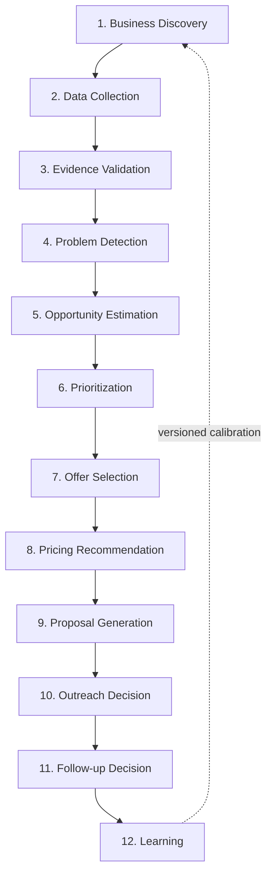
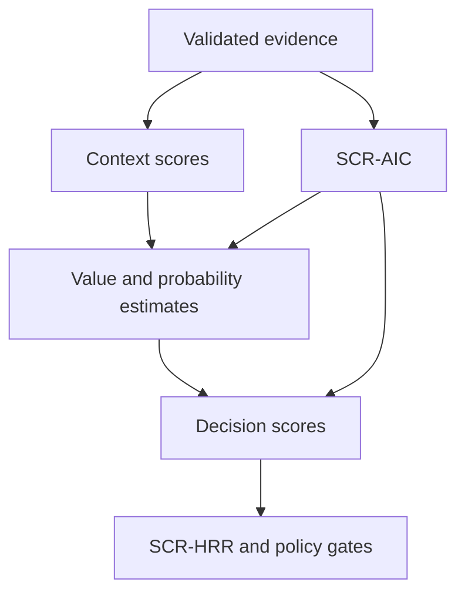
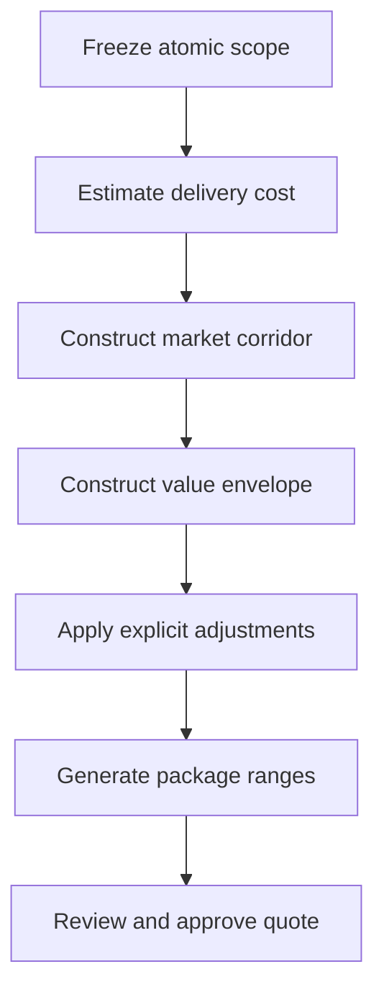
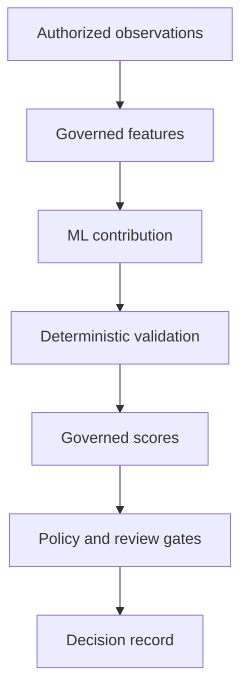
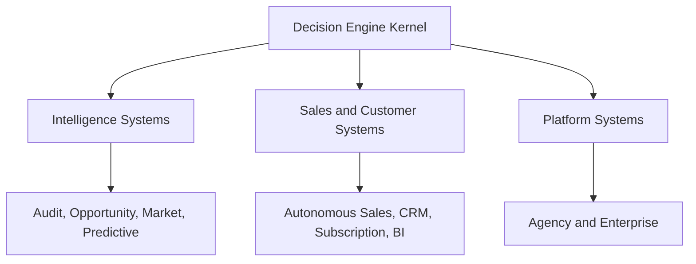

# UBERBOND Decision Engine

> Formal decision framework — Version 1.0.0  
> Status: Structurally validated baseline; empirical calibration pending  
> Effective date: 2026-07-14  
> Companion specification: UBERBOND Knowledge Graph v1.0.0  
> Scope: Audits, recommendations, offers, pricing, proposals, outreach, follow-up, automation, and learning

## Document contract

This is the canonical human-readable decision policy for UBERBOND. It is not application code. It defines how future systems reach, explain, review, execute, and learn from decisions.

The terms **MUST**, **MUST NOT**, **SHOULD**, **SHOULD NOT**, and **MAY** are normative:

- **MUST/MUST NOT:** required for a conforming decision.
- **SHOULD/SHOULD NOT:** expected unless a documented exception is approved.
- **MAY:** optional within policy.

### Compatibility with the Knowledge Graph

This engine consumes, but does not redefine:

- `IND-###` Industries, `ARC-##` Archetypes, and company classifications;
- `PRB-CCC-###` Problems and company-specific Problem Occurrences;
- `SRV-CCC-###` Services, `OFR-###` Offers, and `OUT-###` Outcomes;
- evidence sources `EV-01` through `EV-18`;
- severity `S1–S5`, revenue-impact bands `RI0–RI5/RIV`, marketing maturity `MM1–MM5/MMV`, willingness-to-pay `W1–W5/WV`, and service difficulty/automation/margin/subscription/AI/effort codes;
- relationship semantics including `HAS_PROBLEM`, `EVIDENCED_BY`, `REMEDIATED_BY`, `BUNDLED_IN`, `EXPECTED_TO_PRODUCE`, `REQUIRES_REVIEW`, and `SUPERSEDES`;
- the Knowledge Graph evidence-confidence model.

A graph prior such as `SUSCEPTIBLE_TO` can determine what to inspect. It can never, by itself, create a finding, recommendation, outreach claim, or price.

### Decision artifacts introduced here

| Entity | ID pattern | Purpose |
|---|---|---|
| Decision | `DEC-YYYY-NNNNNN` | Immutable snapshot of a decision and its rationale |
| Score | `SCR-CCC` | Governed score definition and calculated result |
| Estimate | `EST-CCC` | Range or distribution expressed in business units |
| Policy gate | `GATE-CCC-###` | Non-negotiable or reviewable decision constraint |
| Review | `REV-YYYY-NNNNNN` | Human verification, approval, rejection, or override |
| Learning event | `LRN-YYYY-NNNNNN` | Outcome evidence eligible for calibration |
| Price scenario | `PRA-YYYY-NNNNNN` | Versioned commercial range, assumptions, and approval |
| Outreach candidate | `OUTR-YYYY-NNNNNN` | Person, company, relevance, permission, and message decision |
| Proposal candidate | `PROP-YYYY-NNNNNN` | Versioned offer, scope, evidence, price, and terms |
| Model contribution | `MOD-YYYY-NNNNNN` | Versioned ML prediction admitted as one decision input |

### Decision statuses

| Status | Meaning |
|---|---|
| APPROVE | Decision passes all gates for its authorized action class |
| APPROVE_WITH_REVIEW | Candidate is valid but requires named human approval before use |
| REQUEST_EVIDENCE | The decision is blocked until specified evidence is collected |
| HOLD | Evidence is adequate, but timing, capacity, dependency, or policy prevents action |
| REJECT | Candidate fails fit, value, safety, authority, or policy requirements |
| DO_NOTHING | Deliberate recommendation that intervention is not presently justified |
| ESCALATE | A specialist, senior approver, or incident process must decide |
| EXPIRED | Input snapshot or decision is no longer fresh enough to use |
| SUPERSEDED | A newer approved decision replaces this one |

### Deterministic decision record

Every decision MUST freeze:

- decision ID, type, status, tenant, company, asset, market, and authorized purpose;
- input observation IDs and graph/entity versions;
- feature values, normalizations, missingness, timestamps, and expiry;
- raw scores, score confidence, conservative decision values, weights, penalties, caps, and rule versions;
- policy gates evaluated, results, exceptions, and reviewer requirements;
- candidates generated, candidates rejected, and exact reason codes;
- selected action or explicit abstention;
- alternatives, counterfactual, expected outcomes, guardrails, and measurement plan;
- model contributions, model versions, calibration state, and out-of-distribution flags;
- price, proposal, outreach, or automation artifact IDs where applicable;
- creator, reviewer, override, timestamps, and `SUPERSEDES` lineage.

Given the same normalized input snapshot, graph version, score version, policy version, and configuration, the engine MUST return the same structured decision. Natural-language presentation may vary; the structured decision may not.

---

# 1. Core Philosophy

## 1.1 Primary objective

Maximize **expected durable customer value** from the smallest safe, truthful, economically viable intervention, subject to hard constraints for authority, law, safety, security, privacy, accessibility, fairness, evidence quality, and customer capacity.

“Customer value” means measured improvement in an `OUT-###` outcome or defensible avoided loss. “Durable” excludes gains that predictably damage trust, margin, customer experience, compliance, reputation, data quality, or future optionality.

## 1.2 Secondary objectives

In descending importance after the primary objective and hard constraints:

1. Protect customers, end users, UBERBOND, and third parties from preventable harm.
2. Minimize decision regret, irreversible exposure, and unsupported certainty.
3. Reduce time to first verified value.
4. Preserve truth, trust, consent, customer agency, and transparent commercial terms.
5. Improve the quality and reuse of evidence across the intelligence system.
6. Maintain delivery quality, healthy gross margin, and operational scalability.
7. Generate calibrated learning that improves future decisions.
8. Prefer reusable systems and compounding assets over isolated activity.
9. Preserve backwards compatibility and historical reproducibility.
10. Abstain when acting would be less rational than waiting, learning, or doing nothing.

## 1.3 Optimization priorities

Optimization is **lexicographic**, not a single weighted maximization. A lower layer cannot compensate for failure at a higher layer.

| Priority | Layer | Rule |
|---:|---|---|
| 1 | Authority and hard policy | No action without permission; prohibited actions remain prohibited regardless of value |
| 2 | Safety, legality, security, privacy, accessibility, and fairness | A commercial score cannot buy down material harm |
| 3 | Truth and evidence | Claims and findings must not exceed their evidence |
| 4 | Customer outcome value | Rank defensible value to the customer before UBERBOND revenue |
| 5 | Downside, reversibility, and option value | Prefer contained tests and reversible steps when outcomes are uncertain |
| 6 | Time sensitivity | Act faster when value decays, risk compounds, or a genuine deadline exists |
| 7 | Customer and delivery capability | Recommend only what both parties can implement and sustain |
| 8 | UBERBOND economics | Meet cost, margin, cash, and capacity constraints transparently |
| 9 | Learning and scalability | Among otherwise comparable actions, prefer higher reusable learning and automation value |

## 1.4 Tradeoffs

| Tradeoff | Governing decision rule |
|---|---|
| Speed versus evidence | Accelerate collection and review; never relabel weak evidence as strong |
| Revenue versus customer value | Customer value and fit win; reject profitable but unnecessary work |
| Automation versus control | Autonomy increases by action class only after measured reliability and rollback readiness |
| Personalization versus privacy | Use the minimum authorized data required for material relevance |
| Impact versus complexity | Prefer higher expected value per constrained unit only after prerequisites and risk are satisfied |
| Urgency versus exploitation | Charge only for real incremental delivery cost or reserved capacity; never exploit distress |
| Standardization versus context | Reuse canonical logic, then apply explicit industry, country, maturity, and company modifiers |
| Confidence versus magnitude | Report separately; a large uncertain opportunity is not a high-confidence opportunity |
| Short-term lift versus durable value | Reject tactics whose expected guardrail damage exceeds near-term benefit |
| Exploration versus consistency | Experiments require a hypothesis, budget, guardrails, attribution grade, and stop rule |
| Model performance versus explainability | An opaque model may contribute only within a deterministic wrapper and review policy |
| More services versus smaller intervention | Recommend the minimum sufficient service set; additional scope requires independent value |

## 1.5 Human override philosophy

Human review is a control, not a substitute for evidence.

- Humans MAY approve, reject, narrow, defer, or request evidence.
- A review MUST identify the exact decision, changed field or gate, reason, evidence, owner, scope, and expiry.
- An override MUST NOT silently change historical records; it creates a new review and, if necessary, a superseding decision.
- Humans MUST NOT waive non-waivable prohibitions, absent authority, unlawful processing, deceptive claims, recipient opt-out, or uncontained critical risk.
- Disagreement between expert judgment and the engine becomes learning evidence only after the real outcome is observed.
- Repeated overrides of the same rule trigger a policy review; they do not normalize bypass behavior.
- High-impact overrides require an independent approver and separation of duties.

## 1.6 Explainability principles

Every decision explanation MUST be:

1. **Traceable:** connected to observation, graph, score, policy, and model versions.
2. **Decomposable:** raw score, components, weights, confidence, penalties, and gates are visible.
3. **Comparative:** alternatives and the do-nothing case are evaluated by the same rules.
4. **Counterfactual:** it states what evidence or condition would change the decision.
5. **Audience-appropriate:** plain-language summaries never replace the technical record.
6. **Scoped:** evidence and impact name the exact company, asset, segment, journey, and revenue pool.
7. **Uncertainty-aware:** unknown, weak, stale, and contradictory inputs are explicit.
8. **Non-circular:** a model’s generated rationale is not evidence that its prediction is correct.
9. **Reproducible:** a reviewer can replay the structured decision from the frozen snapshot.
10. **Honest about causality:** expected, attributed, incremental, and causal outcomes are distinguished.

## 1.7 Confidence philosophy

Confidence answers “how strongly does the evidence support this statement or score?” It does not answer “how important is it?”

The inherited evidence confidence is:

`EC = clamp(100 × Q × A × C × F × M − X, 0, 100)`

Where `Q` is source quality, `A` signal agreement, `C` coverage, `F` freshness, `M` entity match, and `X` the contradiction/missing-evidence penalty.

Decision confidence adds task-specific sufficiency:

`DC = clamp(GMᵥ(ECᵢ) × R × B × K − P, 0, 100)`

- `GMᵥ(ECᵢ)`: weighted geometric mean of the required evidence confidences;
- `R`: required-input completeness from 0.00–1.00;
- `B`: baseline or benchmark relevance from 0.00–1.00;
- `K`: calibration quality for the exact score/context from 0.00–1.00;
- `P`: unresolved contradiction, out-of-distribution, or policy-applicability penalty from 0–30 points.

A missing critical input fails the calculation rather than receiving a neutral value. A missing optional input receives its declared neutral value and reduces `R`; weights are never silently redistributed.

| Confidence | Interpretation | Permitted use |
|---:|---|---|
| 90–100 | Very strong | May support bounded automatic internal decisions if all policy gates pass |
| 80–89 | Strong | May support standard recommendations and drafts; action class still governs review |
| 60–79 | Moderate | Human verification required before material or external use |
| 40–59 | Weak | Investigative hypothesis only |
| 1–39 | Exploratory | May determine what to inspect, not what to claim or sell |
| 0 / Unknown | Insufficient | Abstain or request evidence |

Confidence MUST decay when evidence expires. Human confirmation can resolve ambiguity or validate applicability; it cannot convert poor underlying evidence into high-quality evidence.

## 1.8 Continuous learning philosophy

- The live engine never rewrites its own rules, weights, thresholds, or graph semantics.
- Learning produces a candidate calibration or policy change evaluated offline, replayed against historical decisions, compared with a champion, and approved through governance.
- Positive, negative, neutral, failed, cancelled, and “do nothing” outcomes are retained to reduce survivorship bias.
- Proposal success teaches proposal, price, relevance, and timing models; it does not prove service effectiveness.
- Project outcome teaches service-to-outcome relationships only in proportion to attribution quality.
- Sparse contexts inherit broader calibrated priors with shrinkage rather than unstable local estimates.
- Recent evidence may receive more weight, but temporal decay and segment pooling are explicit and versioned.
- A new model or rule begins in shadow mode, then advisory mode, then an authorized action class only after safety, calibration, fairness, reliability, and rollback gates pass.
- Every learning promotion is reversible and preserves the prior champion.

---

# 2. Decision Pipeline

## 2.1 Pipeline topology

Stages may loop backward to request evidence or resolve contradictions. They may not skip a required upstream gate. Learning changes a future version; it never mutates the active decision in place.

## 2.2 Universal stage contract

Every stage emits:

- stage ID and version;
- frozen input references and collection authority;
- required-input coverage and expired-input list;
- stage output and status;
- raw confidence components, final stage confidence, caps, and penalties;
- policy gates evaluated and human-review level;
- failure, abstention, or escalation reason codes;
- next permitted stages;
- expiry and replay information.

A stage MUST fail closed when a critical input, authority, identity, policy, or calculation is unresolved. “Fail closed” means no external action and no stronger downstream claim; it does not require hiding useful partial analysis.

## 2.3 Stage 1 — Business Discovery

**Purpose:** establish the exact business, operating context, authorized objective, and boundaries before collecting or interpreting evidence.

| Required element | Specification |
|---|---|
| Inputs | Legal and brand identifiers; verified domains, locations, and accounts; stated goals; industry mix; archetypes; geography; company size; revenue model; decision maker; marketing maturity; operating capacity; known constraints; authorized purpose |
| Outputs | Resolved Company and Asset records; industry/archetype classification with confidence; business objective hierarchy; jurisdiction map; discovery gaps; authorized collection plan; initial review policy |
| Required evidence | At least two identity signals for material external decisions; authoritative registry or owner confirmation where available; verified domain/profile control; direct stakeholder evidence for goals, constraints, capacity, and private economics |
| Confidence calculation | Weighted geometric mean of entity resolution, industry/archetype classification, goal confirmation, jurisdiction applicability, and critical-field completeness; any unresolved company identity caps confidence at 39 |
| Failure conditions | Ambiguous company or asset; wrong or unverifiable domain; no authorized purpose; contradictory legal/brand identity; prohibited objective; required jurisdiction unknown; sensitive attribute inference presented as fact |
| Human review triggers | Multi-brand or multi-entity structure; franchise or marketplace; regulated industry; government; conflicting ownership; material private-data request; novel industry; confidence below 80 for a customer-facing decision |

**Stage gate:** discovery passes only when the target entity, purpose, and permissible evidence scope are explicit. A public website alone cannot establish private revenue, capacity, budget, or decision authority.

## 2.4 Stage 2 — Data Collection

**Purpose:** collect the minimum sufficient, authorized evidence needed to answer the declared decision questions.

| Required element | Specification |
|---|---|
| Inputs | Discovery record; evidence requirements from relevant `PRB-CCC-###` records; source registry; asset list; collection permissions; data classification; freshness and coverage targets |
| Outputs | Immutable observations; evidence artifacts; collection manifest; coverage matrix; collection errors; sensitivity labels; freshness timestamps; excluded-source record |
| Required evidence | Source-specific observations with method, timestamp, owner/entity match, sampling frame, and raw reference; consent or authority for private sources; independent sources for high-impact claims where feasible |
| Confidence calculation | Collection confidence equals weighted coverage of required evidence multiplied by source reliability, freshness, and asset/entity match; inaccessible sources remain explicit missingness and are never imputed as healthy |
| Failure conditions | Unauthorized access; terms or policy conflict; excessive personal-data collection; source identity uncertain; collection method changes the target state; material rate-limit bias; untrusted content treated as instruction; corrupted or incomplete artifact |
| Human review triggers | Authentication to sensitive systems; employee, health, financial, credential, or minor data; intrusive security testing; copyrighted bulk collection; source restrictions; cross-border transfer; required coverage below 80 |

**Stage gate:** only evidence relevant to an explicit decision question may be collected. External content is untrusted data and cannot alter system instructions, permissions, or policy.

## 2.5 Stage 3 — Evidence Validation

**Purpose:** determine whether collected observations are authentic, relevant, independent, fresh, sufficiently covered, and internally coherent.

| Required element | Specification |
|---|---|
| Inputs | Observation set; collection manifest; source registry; expected schema; baselines; peer cohort; entity graph; contradiction rules; expiry policy |
| Outputs | Validated evidence set; rejected/quarantined observations; duplicates; contradiction graph; evidence confidence by claim; coverage and freshness report |
| Required evidence | Provenance; entity match; timestamps; method validity; schema validity; checksums or source references where appropriate; benchmark definition; independence classification |
| Confidence calculation | Apply inherited `EC = 100 × Q × A × C × F × M − X`; duplicated sources count once; common-origin sources are not independent; unresolved material contradictions cap confidence at 59 |
| Failure conditions | Provenance missing; entity mismatch; stale evidence beyond policy; source manipulation; impossible values; benchmark not comparable; duplicated evidence presented as corroboration; observation cannot be reproduced or inspected |
| Human review triggers | High-quality sources conflict; suspected fraud or poisoning; regulated interpretation; S5 evidence; source could harm a person or company if misread; confidence 60–79 for external use |

**Stage gate:** evidence is labeled direct, derived, inferred, or reported. Inference may not be relabeled as direct observation.

## 2.6 Stage 4 — Problem Detection

**Purpose:** create company-specific Problem Occurrences from validated evidence without confusing industry priors with findings.

| Required element | Specification |
|---|---|
| Inputs | Validated observations; relevant `PRB-CCC-###` definitions; industry/archetype priors; baselines; affected asset, segment, journey, and revenue pool; contradiction evidence |
| Outputs | Problem Occurrences; existence confidence; severity; scope; status; causal hypotheses; alternative explanations; expiry; further-evidence requests |
| Required evidence | The evidence fields specified by the canonical problem; direct evidence of the condition; valid baseline when “poor,” “low,” “slow,” or “excessive” is claimed; affected scope |
| Confidence calculation | Problem confidence uses the inherited EC formula and problem-specific inputs. Status bands: 80–100 confirmed; 60–79 supported but review-required; 40–59 hypothesis; below 40 exploratory |
| Failure conditions | Only an industry prior exists; no affected asset or scope; benchmark is arbitrary; condition is temporary test data; cause is asserted from correlation; severity inflated by commercial value; evidence expired |
| Human review triggers | S4–S5 problem; security, privacy, compliance, accessibility, health, finance, employment, legal, or reputation finding; causal assertion; confidence below 80; material public claim |

**Stage gate:** severity and confidence remain separate. An S5 low-confidence signal triggers urgent verification, not a confident accusation.

## 2.7 Stage 5 — Opportunity Estimation

**Purpose:** estimate the defensible value of resolving, exploiting, or monitoring a validated condition.

| Required element | Specification |
|---|---|
| Inputs | Problem Occurrences; affected revenue/cost/risk pool; baseline funnel or operating model; customer unit economics; urgency; service-outcome evidence; market window; implementation feasibility |
| Outputs | Opportunity type; affected-value range; estimated incremental gross-profit or avoided-loss range; opportunity half-life; probability; assumptions; counterfactual; confidence; expiry |
| Required evidence | Named affected pool; baseline and time horizon; unit economics or explicitly marked proxy; plausible intervention path; source for demand, loss, conversion, churn, cost, or risk assumptions |
| Confidence calculation | Minimum of problem confidence, affected-pool confidence, unit-economics confidence, intervention-evidence confidence, and counterfactual quality; estimates publish P10/P50/P90 only when supported |
| Failure conditions | Total company revenue used without causal scope; unrelated impacts added; revenue and gross profit confused; no credible counterfactual; value double-counted across problems; assumed recovery rate presented as certain |
| Human review triggers | P50 value exceeds the configured materiality threshold; P90/P10 spread exceeds 4×; avoided legal/security loss; private financial data; causal grade below B; opportunity confidence below 70 |

**Stage gate:** if value cannot be estimated, the engine may retain a risk or evidence opportunity with `RIV`; it must not fabricate currency precision.

## 2.8 Stage 6 — Prioritization

**Purpose:** rank valid opportunities under customer goals, dependencies, capacity, risk, timing, and delivery constraints.

| Required element | Specification |
|---|---|
| Inputs | Opportunity records; Business Impact, Urgency, Complexity, Expected ROI, AI Confidence, strategic fit, dependencies, conflicts, capacity, reversibility, and policy gates |
| Outputs | Ordered opportunity portfolio; raw and conservative scores; rank stability; prerequisite sequence; deferred, rejected, and do-nothing candidates; rationale |
| Required evidence | Valid upstream scores; explicit goal weights; capacity constraints; dependency/conflict graph; intervention evidence; expiration and opportunity-decay data |
| Confidence calculation | Weighted geometric mean of upstream score confidences multiplied by rank stability. Rank stability is the share of the fixed sensitivity grid in which the ordering remains unchanged |
| Failure conditions | Candidate set incomplete; score dependency is circular; weights do not sum to 100; critical missing input replaced silently; hard gate treated as a penalty; double-counted component; rank changes under trivial perturbation without disclosure |
| Human review triggers | Top candidates differ by fewer than 5 points; rank stability below 80; capacity conflict; mutually exclusive strategies; S4–S5 item; novel service/industry; portfolio value above delegated authority |

**Stage gate:** the engine publishes raw scores and conservative decision values. It cannot hide a high-impact low-confidence opportunity beneath a single blended number.

## 2.9 Stage 7 — Offer Selection

**Purpose:** select the minimum sufficient service set and the most appropriate sellable offer without bundling unnecessary work.

| Required element | Specification |
|---|---|
| Inputs | Prioritized problems/opportunities; `REMEDIATED_BY` edges; service prerequisites, difficulty, effort, automation, subscription potential, risk, and capacity; `BUNDLED_IN` edges; customer constraints |
| Outputs | Atomic service set; prerequisite sequence; candidate offers; coverage ratio; excluded services; first-offer recommendation; one-time/subscription/enterprise/do-nothing classification |
| Required evidence | Problem-service fit; service-outcome evidence; prerequisite and conflict status; customer capability; offer scope; delivery capability; outcome measurement plan |
| Confidence calculation | Geometric mean of problem-service fit, prerequisite coverage, offer coverage, delivery capability, outcome evidence, and customer capability; any unmet critical prerequisite blocks selection |
| Failure conditions | Offer chosen for price rather than fit; service does not address a validated problem; unnecessary service included; subscription lacks continuing value; delivery capability unavailable; duplicate services; incompatible services bundled |
| Human review triggers | Custom or enterprise scope; D5/E6 service; regulated work; more than three service families; coverage below 80; new service; external specialist; data residency or SLA requirement |

**Stage gate:** offer selection optimizes customer value and decision simplicity. Highest contract value is not a selection input.

## 2.10 Stage 8 — Pricing Recommendation

**Purpose:** create a transparent commercial corridor and package structure rather than a fixed price.

| Required element | Specification |
|---|---|
| Inputs | Selected atomic scope; delivery-cost distribution; effort and complexity; service levels; risk; urgency; country; industry; comparable-market evidence; value range; payment terms; target margin; capacity |
| Outputs | Price scenarios and ranges; cost floor; market corridor; value context; confidence; billing model; subscription/onboarding split; assumptions; exclusions; discount eligibility; approval level; expiry |
| Required evidence | Fully loaded delivery-cost model; scope units; credible comparables or explicit absence; named value pool; current currency/tax/payment assumptions; capacity and specialist requirements |
| Confidence calculation | Weighted geometric mean of cost confidence, scope confidence, market-comparable relevance, value-estimate confidence, country/currency confidence, and risk completeness; no value evidence means no value-based anchor |
| Failure conditions | Price below approved cost floor; double-counted complexity/risk; hidden pass-through; distress exploitation; protected-trait or unlawful proxy; fake discount anchor; fixed price without scope; unsupported value claim |
| Human review triggers | Manual-pricing rules in Section 7; enterprise/custom scope; confidence below 80; high urgency; regulated/high-risk work; nonstandard currency/terms; any discount outside pre-approved rules |

**Stage gate:** the output is a range with assumptions and alternatives. A single number may appear only later as a human-approved quote tied to frozen scope.

## 2.11 Stage 9 — Proposal Generation

**Purpose:** convert an approved recommendation and price scenario into an accurate, scoped, decision-ready proposal.

| Required element | Specification |
|---|---|
| Inputs | Decision record; evidence; selected problems, services, offer, outcomes; approved price scenario; scope; assumptions; exclusions; timeline; responsibilities; terms; proof assets |
| Outputs | Proposal candidate; executive summary; evidence-backed diagnosis; service scope; outcomes and measurement; options; price range or approved quote; risks; dependencies; next decision |
| Required evidence | Every factual or performance claim mapped to evidence; permissioned case proof; current service capability; approved commercial terms; recipient/company identity |
| Confidence calculation | Minimum of recommendation confidence, pricing confidence, claim-verification coverage, scope coherence, delivery capability, and terms completeness |
| Failure conditions | Unsupported claim; guarantee presented as expectation; stale evidence; false personalization; invented case result; scope-price mismatch; missing exclusion; proposal sent to wrong entity; unapproved legal term |
| Human review triggers | All customer-facing proposals in v1; regulated claim; custom scope; enterprise terms; material price; new offer; confidence below 90; case study or testimonial; security/compliance representation |

**Stage gate:** generated language cannot introduce new facts, outcomes, prices, or promises absent from the structured decision.

## 2.12 Stage 10 — Outreach Decision

**Purpose:** decide whether contacting a verified recipient is relevant, permissible, proportionate, timely, and beneficial.

| Required element | Specification |
|---|---|
| Inputs | Company opportunity; verified recipient and role; channel eligibility; lawful basis/consent where required; suppression and prior-contact history; message claim set; response probability; capacity; jurisdiction |
| Outputs | APPROVE_WITH_REVIEW, HOLD, REJECT, or future policy-bounded APPROVE; channel; recipient; timing window; message objective; permitted claims; frequency cap; expiry |
| Required evidence | Recipient identity and role relevance; current contact source; company-recipient relationship; channel policy; suppression/opt-out check; validated business evidence; capacity to honor the offer |
| Confidence calculation | Minimum of company-entity confidence, recipient-resolution confidence, role relevance, permission confidence, evidence confidence, contact freshness, and message-claim coverage |
| Failure conditions | Ambiguous recipient; opt-out/suppression; prohibited channel or jurisdiction; sensitive inference; unverified accusation; deceptive subject or identity; excessive frequency; no capacity; value to customer not established |
| Human review triggers | All outbound sends in v1; first contact; regulated or sensitive industry; new jurisdiction/channel; confidence below 90; security/compliance/reputation topic; multiple recipients at one company; custom claim |

**Stage gate:** outreach priority never creates permission. Relevance, identity, legality, suppression, capacity, and truth are hard gates.

## 2.13 Stage 11 — Follow-up Decision

**Purpose:** decide whether another contact adds legitimate value after an outreach, proposal, meeting, or customer event.

| Required element | Specification |
|---|---|
| Inputs | Prior contact and delivery status; replies; engagement; explicit instructions; cadence policy; opportunity expiry; new evidence; proposal state; channel eligibility; recipient timezone |
| Outputs | Follow up now; wait until a defined event/date; switch approved channel; close sequence; suppress; escalate to human; updated message objective and permitted content |
| Required evidence | Confirmed prior delivery; recipient state; current suppression; elapsed time; sequence count; opportunity still valid; new value or decision reason for contact |
| Confidence calculation | Minimum of event-state confidence, recipient identity, permission, opportunity freshness, cadence compliance, and response-state interpretation |
| Failure conditions | Opt-out or complaint; ambiguous reply sentiment; bounce or wrong recipient; maximum cadence reached; no new value; opportunity expired; message would pressure a vulnerable or bereaved person; unapproved channel switch |
| Human review triggers | Any substantive reply; objection, complaint, negotiation, legal/security question, bereavement/health/distress context; channel change; proposal revision; final-contact decision in a material account |

**Stage gate:** silence alone is not buying intent. Follow-up stops when value, permission, or relevance stops.

## 2.14 Stage 12 — Learning

**Purpose:** transform completed decisions and observed outcomes into governed evidence for future calibration.

| Required element | Specification |
|---|---|
| Inputs | Frozen decision snapshot; execution record; baseline; outcome and guardrail measurements; attribution design; proposal/outreach results; delivery variance; reviews; overrides; failures; costs and margins |
| Outputs | Learning Event; attribution grade; eligible score/model/edge updates; confidence weight; anomaly or incident; proposed calibration; no-learning reason when evidence is insufficient |
| Required evidence | Complete decision lineage; outcome source; measurement window; comparison or counterfactual; implementation fidelity; exposure; missing-data report; customer/operational guardrails |
| Confidence calculation | Minimum of outcome integrity, baseline quality, attribution grade, implementation fidelity, coverage, entity match, and absence of material confounding |
| Failure conditions | Outcome missing; success label inferred from proposal acceptance; cherry-picked window; survivorship bias; intervention not delivered; baseline changed without adjustment; privacy prohibits reuse; duplicate learning event |
| Human review triggers | Policy or graph change; new industry/service; false positive causing harm; material incorrect recommendation; fairness disparity; model drift; S4–S5 outcome; proposed promotion of autonomous authority |

**Stage gate:** learning is append-only evidence. It proposes a new version; it does not retroactively alter the decision that generated it.

## 2.15 Pipeline failure propagation

| Upstream condition | Downstream effect |
|---|---|
| Identity unresolved | No company-specific finding, recipient decision, proposal, price, or action |
| Collection unauthorized | Evidence excluded; dependent decisions invalidated |
| Evidence stale or contradictory | Confidence decays; external claims block; refresh or review requested |
| Problem unconfirmed | May create an inspection opportunity only; no remedial sales claim |
| Value unknown | Risk/evidence recommendation allowed; currency ROI and value pricing prohibited |
| Priority unstable | Present scenarios; human chooses; no false rank certainty |
| Offer has unmet prerequisite | Offer held or replaced by prerequisite service |
| Price confidence weak | Discovery phase or manual price; no automated quote |
| Proposal claim ungrounded | Proposal rejected until claim is removed or evidenced |
| Recipient or permission uncertain | Outreach rejected or held |
| Follow-up state uncertain | No send; human review |
| Outcome attribution weak | Learning weight reduced or zero |

---

# 3. Scoring Engines

## 3.1 Universal scoring contract

### Score types

| Type | Meaning | Examples |
|---|---|---|
| Descriptive score | Current state normalized to 0–100 | Website Quality, Trust, Digital Maturity |
| Risk score | Higher means greater downside or control need | Competition Risk, Complexity, Human Review Requirement |
| Priority score | Higher means earlier consideration after hard gates | Opportunity, Outreach Priority |
| Predictive score | Calibrated probability from 0–100 when validation permits | Response, Subscription, Upsell, Cross-sell |
| Estimate | P10/P50/P90 in business units plus confidence | Revenue Impact, ROI, CLV |

### Universal calculation rules

1. Every component is normalized to 0–100 using a versioned rubric or benchmark.
2. Initial component weights sum to 100 and are versioned. They are priors pending calibration.
3. Weighted arithmetic means are used when components are substitutable. Weighted geometric means are used when weak performance in one necessary component should constrain the whole.
4. Hard gates are evaluated separately and cannot be averaged away.
5. Required missing inputs produce `Unknown`. Optional missing inputs receive the declared neutral value of 50 and reduce completeness; weights are never silently redistributed.
6. Penalties and caps are shown after the base calculation. The engine publishes base, penalty, cap, final raw score, and confidence.
7. A derived score may consume another governed score. It may not also reuse that score’s raw features unless the registry explicitly prevents double counting.
8. Scores are computed from point-in-time data. Comparisons state benchmark cohort, period, geography, device/channel, and sample.
9. A score is not a probability unless calibration error, sample coverage, and validity meet the prediction policy.
10. Any manual input records its source, approver, timestamp, and expiry.

For every weighted score below, its **Component** table is the authoritative input declaration: each row names an input, its initial weight, and its governed meaning. Estimates use an explicit **Inputs** list because their variables retain business units and are combined as scenarios rather than as weighted opinion scores.

### Confidence-adjusted decision values

The raw score and confidence are always retained separately.

For benefit, quality, and priority scores, the conservative decision value is:

`CDV = RawScore × ScoreConfidence / 100`

For risk and complexity scores, uncertainty moves the decision value upward:

`CRV = RawRisk + (100 − RawRisk) × (100 − ScoreConfidence) / 100`

These are ranking controls, not replacements for raw values.

### Common 0–100 interpretation

| Range | Benefit/quality/priority | Risk/complexity |
|---:|---|---|
| 0–19 | Very low | Minimal |
| 20–39 | Low | Low |
| 40–59 | Moderate | Material |
| 60–79 | High | High |
| 80–100 | Very high | Critical or exceptional |

### Score dependency order

The acyclic order is:

1. Validated evidence and normalized features.
2. `SCR-AIC`, `SCR-WQS`, `SCR-TRU`, `SCR-DMT`, `SCR-LDQ`, `SCR-BIN`, `SCR-ICX`, `SCR-CPR`, and `SCR-SAT`.
3. `SCR-MAT`, `SCR-BIM`, `SCR-URG`, `EST-REV`, `EST-CLV`, `SCR-SUB`, `SCR-UPS`, and `SCR-CRS`.
4. `EST-ROI`, `SCR-PRS`, and `SCR-RSP`.
5. `SCR-OPP`, `SCR-ORP`, and `SCR-HRR`.

## 3.2 AI Confidence — `SCR-AIC`

**Purpose:** quantify whether the complete evidence-and-decision process is reliable enough for the requested use. It is a meta-confidence score, not model self-reported certainty.

| Component | Weight | Definition |
|---|---:|---|
| Validated evidence confidence | 35% | Weighted confidence of direct observations and derived facts |
| Required-input coverage | 20% | Coverage of mandatory data at the correct entity and grain |
| Calibration validity | 15% | Evidence that rules/models are calibrated for this task and context |
| Rule/model agreement | 10% | Agreement among independent valid methods without common-origin inflation |
| In-distribution proximity | 10% | Similarity to validated industries, company profiles, data conditions, and actions |
| Reproducibility and stability | 10% | Same snapshot reproduces output and fixed perturbations do not cause unstable results |

**Weighting philosophy:** evidence dominates. Model agreement and stability can increase confidence only when evidence, coverage, and calibration are adequate.

**Output scale:** 0–100 using the universal confidence bands. `Unknown` if provenance or critical evidence coverage is unavailable.

**Confidence modifiers:** no validated calibration caps the score at 69; high out-of-distribution risk caps it at 49; unresolved material contradiction caps it at 59; entity ambiguity caps it at 39; verified prompt/evidence poisoning sets `ESCALATE`.

**Relationships:** modifies every other score and estimate. It never increases Business Impact, Revenue Impact, Urgency, or permission. `SCR-HRR` rises as `SCR-AIC` falls.

## 3.3 Website Quality Score — `SCR-WQS`

**Purpose:** summarize the current quality of an owned web experience without hiding domain-level defects.

| Component | Weight | Definition |
|---|---:|---|
| Performance | 20% | Field and representative lab speed, responsiveness, and stability |
| Reliability and technical integrity | 15% | Availability, errors, compatibility, transport security, and dependency health |
| Mobile usability | 15% | Task success across supported mobile devices and interaction modes |
| Accessibility | 15% | Automated and manual conformance evidence and assistive-technology task success |
| Content clarity and accuracy | 10% | Comprehension, freshness, usefulness, claim support, and readability |
| Search discoverability | 10% | Crawlability, indexability, metadata, structured data, and intent alignment |
| Conversion readiness | 10% | Value clarity, trust, CTAs, forms, booking, checkout, and objection support |
| Measurement and observability | 5% | Event integrity, errors, performance, uptime, and change monitoring |

**Weighting philosophy:** user ability to access and complete a task outweighs cosmetic polish. Component scores remain visible by template, device, segment, and journey.

**Output scale:** 0–100, higher is better; also publish the lowest component and count of S4–S5 defects.

**Confidence modifiers:** field data outranks a single lab run; critical-journey coverage below 80 caps score confidence at 69; an active critical outage caps raw quality at 19; an uncontained S5 security or accessibility barrier caps it at 39.

**Relationships:** contributes to Trust, Business Impact, Revenue Impact, Proposal evidence, and service selection. It must not be used alone to recommend a rebuild.

## 3.4 Trust Score — `SCR-TRU`

**Purpose:** measure whether a reasonable target customer has sufficient evidence to believe the entity is legitimate, competent, transparent, safe, and likely to honor its promise.

| Component | Weight | Definition |
|---|---:|---|
| Identity and legitimacy | 15% | Verifiable entity, ownership, location, contact, licenses, and official presence |
| Reputation and customer proof | 20% | Authentic, recent, relevant reviews, cases, referrals, and sentiment |
| Claim substantiation | 15% | Promises and comparisons mapped to credible evidence |
| Security and privacy assurance | 15% | Appropriate controls, disclosures, secure interactions, and incident posture |
| Commercial transparency | 10% | Price context, scope, terms, refunds, delivery, cancellation, and conflicts |
| Expertise and credentials | 10% | Relevant, current, verifiable qualifications and accountable authorship |
| Cross-channel consistency | 10% | Brand, facts, policies, experience, and promises agree across touchpoints |
| Responsiveness and recovery | 5% | Timely answers, complaint handling, and visible service recovery |

**Weighting philosophy:** verified external and customer evidence outweighs self-description. Review volume never compensates for fake reviews, deception, or serious unresolved harm.

**Output scale:** 0–100, higher is stronger trust; publish trust strengths, trust blockers, and confidence.

**Confidence modifiers:** suspected manipulation sets affected proof to zero and requires review; insufficient review sample reduces confidence rather than automatically reducing raw quality; regulated credentials require authoritative verification; public controversy is scoped and time-bounded.

**Relationships:** affects conversion, Lead Quality interpretation, Proposal Strength, Response Probability, Buying Intent conversion, and Recommendation sequencing. Trust is not inferred from protected traits, prestige aesthetics, or wealth signals.

## 3.5 Digital Maturity Score — `SCR-DMT`

**Purpose:** estimate the organization’s ability to operate, measure, govern, and improve digital growth systems.

| Component | Weight | Definition |
|---|---:|---|
| Strategy and ownership | 10% | Goals, accountable owners, portfolio decisions, and governance |
| Data and measurement | 15% | Source-of-truth metrics, instrumentation, data quality, and decision use |
| Process repeatability | 15% | Documented workflows, SLAs, QA, exception handling, and learning |
| Technology and integration | 15% | Fit-for-purpose stack, interoperability, reliability, and maintainability |
| Acquisition and content operations | 10% | Repeatable audience, campaign, creative, content, and search systems |
| CRM and lifecycle | 10% | Identity, segmentation, automation, customer-state, and retention operations |
| Experimentation and optimization | 10% | Hypotheses, tests, guardrails, measurement, and learning registry |
| Security, privacy, and compliance | 10% | Proportionate controls, records, access, and review |
| Talent and capability | 5% | Skills, capacity, specialist access, and continuity |

**Weighting philosophy:** maturity means dependable capability, not tool count or spend. A sophisticated stack with weak governance does not score highly.

**Output scale:** 0–100 mapped to `MM1: 0–19`, `MM2: 20–39`, `MM3: 40–59`, `MM4: 60–79`, and `MM5: 80–100`.

**Confidence modifiers:** private operational claims require owner/system evidence; public-only assessment caps confidence at 59; maturity varies by function, so publish component dispersion.

**Relationships:** constrains service complexity, implementation sequence, enterprise readiness, automation level, subscription suitability, and customer capability. It must not be used as a proxy for budget.

## 3.6 Lead Quality Score — `SCR-LDQ`

**Purpose:** measure whether a company or account is a legitimate, valuable, relevant, and serviceable fit independently of immediate buying behavior.

| Component | Weight | Definition |
|---|---:|---|
| Ideal-customer-profile fit | 25% | Industry, size, operating model, geography, and problem profile |
| Validated need fit | 20% | High-confidence problems UBERBOND can genuinely address |
| Economic value potential | 15% | Defensible affected value and viable customer economics |
| Decision access and role fit | 10% | Reachable, relevant stakeholder structure without guessing identity |
| Serviceability | 10% | Jurisdiction, language, delivery model, capacity, and technical feasibility |
| Entity and data legitimacy | 10% | Verified company, contact sources, and non-fraudulent signals |
| Strategic relationship fit | 10% | Ethical portfolio fit, learning value, referenceability, and concentration controls |

**Weighting philosophy:** fit and real need dominate. Wealth, prestige, vulnerability, or contactability cannot manufacture quality.

**Output scale:** 0–100, higher means stronger account fit; not a probability.

**Confidence modifiers:** public-only economics use conservative priors and cap confidence; recipient ambiguity does not reduce company fit but blocks outreach; regulated or unsupported jurisdictions can hard-reject serviceability.

**Relationships:** contributes to Response Probability, Outreach Priority, CLV, and enterprise qualification. It does not include Buying Intent to avoid double counting.

## 3.7 Buying Intent Score — `SCR-BIN`

**Purpose:** measure current evidence that a verified organization or stakeholder is actively progressing toward a relevant purchase decision.

| Component | Weight | Definition |
|---|---:|---|
| Explicit request or declared initiative | 30% | Direct request, active brief, tender, meeting purpose, or stated project |
| High-intent behavior | 20% | Relevant demo, pricing, proposal, audit, application, or procurement action |
| Recency | 15% | Time since the strongest valid intent signal relative to its decay policy |
| Specificity | 15% | Clear problem, scope, outcome, market, service, or decision question |
| Resource and timing evidence | 10% | Credible budget process, timeline, team, or allocated capacity |
| Stakeholder progression | 10% | Movement among relevant decision roles or formal stages |

**Weighting philosophy:** direct, specific, recent actions dominate weak engagement proxies. Opens, pageviews, follows, and silence are not strong intent alone.

**Output scale:** 0–100 propensity index until calibrated; may become a probability only after context-specific validation.

**Confidence modifiers:** anonymous behavior caps confidence at 39; a verified direct request may support high confidence; bot activity, forwarded email, or shared-device ambiguity is excluded; intent decays by signal type.

**Relationships:** contributes to Response Probability, Outreach Priority, proposal timing, and follow-up. It does not change Lead Quality or create permission.

## 3.8 Implementation Complexity — `SCR-ICX`

**Purpose:** estimate the difficulty, coordination, uncertainty, and change burden of delivering the selected intervention successfully.

| Component | Weight | Definition |
|---|---:|---|
| Scope breadth | 20% | Number and heterogeneity of assets, journeys, markets, and service families |
| Integration and data burden | 20% | Systems, identity, migration, data quality, and interoperability |
| Specialist and regulatory burden | 15% | Required expertise, assurance, approvals, and jurisdictional complexity |
| Organizational change | 15% | Teams, owners, process changes, training, and adoption |
| Uncertainty and exception rate | 10% | Unknowns, custom cases, legacy state, and rework probability |
| Scale and volume | 10% | Locations, users, records, SKUs, campaigns, traffic, and transactions |
| Timeline and resource constraints | 10% | Schedule compression, dependencies, access windows, and client capacity |

**Weighting philosophy:** complexity reflects work and coordination, not customer wealth or perceived willingness to pay.

**Output scale:** 0–100, higher is harder; map `0–19 D1`, `20–39 D2`, `40–59 D3`, `60–79 D4`, `80–100 D5`. Effort `E1–E6` remains a separate time distribution.

**Confidence modifiers:** unknown legacy/integration state increases conservative risk using `CRV`; discovery can reduce confidence uncertainty; compressed timeline raises complexity only where it creates real coordination or quality burden.

**Relationships:** affects feasibility, Expected ROI, price scope, review requirement, enterprise classification, delivery sequencing, and risk contingency. It cannot be applied twice through both effort and an unexplained multiplier.

## 3.9 Competition Risk — `SCR-CPR`

**Purpose:** estimate the downside that competitors or substitutes will constrain acquisition, pricing, differentiation, retention, or market entry.

| Component | Weight | Definition |
|---|---:|---|
| Competitor intensity | 20% | Number, strength, growth, funding, distribution, and customer attention |
| Differentiation deficit | 20% | Similarity of offer, proof, message, capability, and outcomes |
| Switching and incumbent barriers | 15% | Contracts, integrations, habits, networks, data, and procurement |
| Visibility and share gap | 15% | Relative search, media, reputation, distribution, and category ownership |
| Price and margin pressure | 10% | Discounting, commoditization, and comparable price pressure |
| Channel capture | 10% | Competitor control of partners, platforms, creators, supply, or placement |
| Rate of competitive change | 10% | Speed of launches, entry, consolidation, regulation, and innovation |

**Weighting philosophy:** risk is relative to the target segment and route to market. A large competitor outside the actual decision set receives little weight.

**Output scale:** 0–100, higher means greater competitive risk.

**Confidence modifiers:** unverifiable competitor claims are excluded; private-company opacity lowers confidence; fast-changing markets use shorter expiry; peer-set ambiguity caps confidence.

**Relationships:** feeds Market Attractiveness, Urgency, positioning recommendations, pricing context, and market-entry review. It does not directly reduce Lead Quality.

## 3.10 Industry Saturation — `SCR-SAT`

**Purpose:** measure how crowded and structurally difficult a defined industry-segment-geography is for additional supply or undifferentiated entry.

| Component | Weight | Definition |
|---|---:|---|
| Supplier density relative to demand | 25% | Active supply compared with addressable demand in the exact market |
| Demand growth versus capacity growth | 20% | Whether demand is outpacing or lagging new supply |
| Search and paid-media crowding | 15% | Auction, query, placement, and content competition |
| Offer substitutability | 15% | Ease of comparing or replacing providers and products |
| Channel crowding | 15% | Competition for distribution, partnerships, shelf, creators, or sales access |
| Entrenchment and concentration | 10% | Incumbent share, network effects, regulation, and customer lock-in |

**Weighting philosophy:** saturation is not the number of companies alone. A crowded but rapidly growing niche can remain attractive.

**Output scale:** 0–100, higher means more saturated.

**Confidence modifiers:** geographic and segment definition is mandatory; broad global counts cap confidence at 39; old directory counts decay quickly; informal-market estimates publish wide uncertainty.

**Relationships:** feeds Market Attractiveness, Competition Risk interpretation, market-entry recommendations, and channel strategy. It does not by itself justify “do not enter.”

## 3.11 Market Attractiveness — `SCR-MAT`

**Purpose:** rank defined markets by durable opportunity and the company’s ability to enter or expand successfully.

| Component | Weight | Definition |
|---|---:|---|
| Addressable demand | 20% | Current qualified demand for the defined offer and segment |
| Demand growth and durability | 15% | Growth rate, persistence, cyclicality, and structural drivers |
| Unit economics potential | 15% | Price, margin, acquisition, service, retention, and capital intensity |
| Reachability | 10% | Feasible channels, partners, localization, sales access, and customer concentration |
| Inverse Competition Risk | 15% | `100 − SCR-CPR` at matched scope |
| Inverse Industry Saturation | 10% | `100 − SCR-SAT` at matched scope |
| Regulatory and operational fit | 10% | Ability to comply, deliver, support, collect, and transact |
| Strategic adjacency | 5% | Reuse of capability, brand, customers, data, partners, and learning |

**Weighting philosophy:** demand and economics dominate; low competition cannot make a market attractive if demand or serviceability is weak.

**Output scale:** 0–100, higher is more attractive; publish component score, confidence, assumptions, and disqualifying gates.

**Confidence modifiers:** missing unit economics caps confidence at 59; unresolved regulation can hard-block entry; sparse markets use broader priors with lower confidence; forecasts include scenario ranges.

**Relationships:** feeds Opportunity Score, geographic recommendations, country pricing context, partnership strategy, and Market Intelligence. It cannot override company-specific capability or policy gates.

## 3.12 Business Impact Score — `SCR-BIM`

**Purpose:** measure the total material consequence of a problem or opportunity across financial and nonfinancial dimensions.

| Component | Weight | Definition |
|---|---:|---|
| Economic magnitude | 30% | Share and amount of the affected revenue, gross profit, cost, cash, or asset pool |
| Customer/end-user breadth | 15% | Number and importance of affected users, customers, segments, or locations |
| Strategic criticality | 15% | Effect on core proposition, defensibility, market access, or stated goals |
| Operational continuity | 10% | Effect on throughput, capacity, dependencies, service, and business continuity |
| Trust and reputation | 10% | Credible effect on customer, partner, employee, regulator, or public trust |
| Safety, security, privacy, and compliance | 10% | Severity and applicability of protected obligations and downside |
| Persistence and compounding | 10% | Duration, recurrence, network effects, and cost of accumulated delay |

**Weighting philosophy:** economic impact is largest but cannot erase high-stakes nonfinancial harm. Each component uses the exact affected scope; the same loss cannot appear in more than one component without an explicit de-duplication rule.

**Output scale:** 0–100, higher is more material; publish component scores, affected scopes, and whether impact is realized, expected, or avoided.

**Confidence modifiers:** unknown economics reduce confidence rather than defaulting to zero; S4–S5 safety/security/compliance evidence requires human review; qualitative strategic ratings require named owner and rubric.

**Relationships:** feeds Opportunity Score, prioritization, Human Review Requirement, and do-nothing analysis. Estimated Revenue Impact is one input to economic magnitude, not the entire score.

## 3.13 Urgency Score — `SCR-URG`

**Purpose:** measure the cost of waiting and the speed at which value, risk, or an opportunity window changes.

| Component | Weight | Definition |
|---|---:|---|
| Value decay | 25% | Recoverable value lost per unit of delay |
| Risk compounding | 20% | Expected growth of downside, exposure, backlog, or customer harm |
| Hard deadline | 20% | Genuine regulatory, contractual, launch, renewal, seasonal, or operational date |
| Dependency blockage | 15% | Degree to which the issue prevents other high-value work |
| Opportunity-window scarcity | 10% | Time-limited demand, inventory, capacity, partnership, or competitive window |
| Recovery lead time | 10% | Time required to prevent or recover from the consequence |

**Weighting philosophy:** urgency must come from external reality or a documented business dependency, never manufactured scarcity.

**Output scale:** 0–100; also publish opportunity half-life, next material deadline, and value-at-delay where estimable.

**Confidence modifiers:** an unverified deadline receives zero deadline contribution; seasonal claims require history or authoritative market evidence; distress raises review requirements and never automatically raises price.

**Relationships:** feeds Opportunity Score, sequencing, follow-up timing, and allowed expedite options. It does not bypass evidence, permission, or capacity.

## 3.14 Estimated Revenue Impact — `EST-REV`

**Purpose:** estimate the plausible change in revenue and contribution gross profit attributable to the problem or intervention.

**Inputs:**

- named affected revenue pool and eligible volume;
- baseline funnel, retention, order, contract, or capacity rates;
- plausible absolute change, not merely a broad benchmark;
- contribution value per outcome and gross-margin treatment;
- adoption, ramp, persistence, cannibalization, displacement, and capacity;
- attribution factor and counterfactual grade;
- horizon, currency, taxes, refunds, churn, and uncertainty.

**Weighting philosophy:** this is a scenario model, not a weighted opinion score.

For a conversion opportunity:

`Incremental contribution = Eligible volume × Absolute conversion change × Contribution per outcome × Adoption × Attribution`

For a retention opportunity:

`Protected contribution = At-risk base × Absolute churn reduction × Remaining contribution value × Attribution`

For capacity recovery:

`Recoverable contribution = Usable recovered capacity × Realistic fill rate × Contribution per unit`

Effects with overlapping eligible populations are de-duplicated before portfolio aggregation. Avoided cost and expected risk loss are reported separately from revenue.

**Output scale:** P10/P50/P90 revenue and contribution-gross-profit ranges, annualized and total over the stated horizon; percentage of the affected pool; corresponding `RI0–RI5/RIV`; and confidence. A normalized 0–100 materiality index MAY be produced relative to company gross profit, but the currency range remains primary.

**Confidence modifiers:** missing private economics require explicit proxies and cap confidence at 59; causal grade C or lower materially widens the range; capacity constraints cap upside; benchmark transfer across country, segment, device, or maturity reduces confidence.

**Relationships:** feeds Business Impact, Expected ROI, value-based pricing context, Opportunity Score, and proposal explanation. It is never presented as guaranteed recoverable revenue.

## 3.15 Expected ROI — `EST-ROI`

**Purpose:** compare the attributable economic benefit of an intervention with its complete incremental cost and timing.

**Inputs:**

- `EST-REV` contribution range;
- defensible avoided operating cost or expected loss;
- implementation, subscription, media, software, specialist, client labor, financing, and opportunity costs;
- time-to-value, ramp, persistence, useful life, and discount rate;
- attribution grade, cannibalization, capacity, and guardrail costs.

**Weighting philosophy:** calculate scenarios rather than averaging subjective components.

`ROI = (Attributable incremental contribution + avoided cost − total incremental cost) / total incremental cost`

Also calculate payback period and, for multi-period decisions, net present value. Benefits and costs use the same horizon and currency basis.

**Output scale:** P10/P50/P90 ROI ratio or percentage, P10/P50/P90 net value, payback range, and a 0–100 decision index normalized to the approved hurdle rate for that capital class. The index is not comparable across capital classes unless their hurdle definitions match.

**Confidence modifiers:** ROI confidence cannot exceed the lower of benefit confidence and cost confidence; attribution below grade B prevents a causal ROI claim; unknown ongoing costs block a final ROI; very wide distributions trigger scenarios rather than a single midpoint.

**Relationships:** feeds Opportunity Score, offer sequencing, do-nothing decisions, and price affordability context. Price is a cost input; Expected ROI does not set price by itself.

## 3.16 Subscription Probability — `SCR-SUB`

**Purpose:** estimate whether a customer is likely to choose and retain a recurring commercial model that produces genuine continuing value.

| Component | Weight | Definition |
|---|---:|---|
| Problem persistence or recurrence | 20% | Condition changes, recurs, or requires ongoing control |
| Continuing outcome value | 20% | Monitoring, operation, optimization, assurance, or support remains useful |
| Change and monitoring frequency | 15% | Assets, markets, campaigns, data, risk, or customer state change often enough |
| Service subscription potential | 15% | Knowledge Graph `T0–T4` supported by actual scope |
| Customer maturity and operating fit | 10% | Ability to use, govern, and collaborate with recurring service |
| Budget and procurement fit | 5% | Evidence of recurring budget or permissible term |
| Relevant purchase and retention evidence | 15% | Comparable customer history, stated preference, or existing recurring behavior |

**Weighting philosophy:** continuing customer value dominates commercial preference. A subscription cannot be recommended merely because it benefits UBERBOND revenue.

**Output scale:** calibrated 0–100 probability when validation permits; otherwise a clearly labeled subscription propensity score.

**Confidence modifiers:** no outcome persistence caps raw score at 39; T0 service caps it at 19; no comparable retention data caps probability confidence at 59; a customer’s explicit one-time requirement constrains recommendation regardless of score.

**Relationships:** informs offer form, pricing cadence, CLV scenarios, and subscription recommendations. It does not establish affordability or permission.

## 3.17 Upsell Probability — `SCR-UPS`

**Purpose:** estimate the likelihood that an existing customer will rationally expand the depth, tier, capacity, or scope of a service already delivering value.

| Component | Weight | Definition |
|---|---:|---|
| Verified success of current service | 25% | Measured outcome, adoption, quality, and implementation fidelity |
| Adjacent unmet value | 20% | Additional scale, tier, location, segment, feature, or depth creates value |
| Sequencing and dependency fit | 15% | Current service is a valid prerequisite or foundation |
| Customer capacity | 10% | Team, systems, attention, and delivery can absorb expansion |
| Satisfaction and trust | 10% | Relationship health, service quality, and issue status |
| Economic fit | 10% | Incremental value and budget process are plausible |
| Timing and decision readiness | 10% | Renewal, growth, usage, capacity, or stated initiative supports timing |

**Weighting philosophy:** measured current value is the strongest factor. Selling more before value is realized is not a positive signal.

**Output scale:** calibrated 0–100 probability or uncalibrated propensity index.

**Confidence modifiers:** no completed baseline service caps score at 39; unresolved S4–S5 service issue caps it at 19; missing outcome measurement caps confidence; account-manager opinion requires corroboration.

**Relationships:** informs expansion sequencing, CLV scenarios, renewal planning, and proposal timing. It cannot override customer capacity or unresolved dissatisfaction.

## 3.18 Cross-sell Probability — `SCR-CRS`

**Purpose:** estimate the likelihood that an existing customer will rationally buy a different service family for a separately validated problem.

| Component | Weight | Definition |
|---|---:|---|
| Independent problem confidence | 25% | Separate validated problem with material customer value |
| Service complementarity | 20% | New service works with, but is not duplicated by, current scope |
| Outcome adjacency | 15% | Combined outcomes reinforce the customer’s stated objective |
| Decision-maker relevance | 15% | Appropriate stakeholder and buying center are identified |
| Delivery and customer capability | 10% | Both sides can execute without harming current work |
| Relationship trust | 10% | Service quality, transparency, and issue status support expansion |
| Timing | 5% | New problem and customer planning window justify action |

**Weighting philosophy:** independent customer need dominates relationship leverage. Existing access does not create relevance.

**Output scale:** calibrated 0–100 probability or uncalibrated propensity index.

**Confidence modifiers:** an unconfirmed problem caps score at 39; duplicate scope sets score to zero; unresolved service failure caps score at 19; new buying center lowers confidence until verified.

**Relationships:** informs offer sequencing, account planning, CLV scenarios, and proposal selection. It remains separate from Upsell Probability.

## 3.19 Customer Lifetime Value Estimate — `EST-CLV`

**Purpose:** estimate the present value of gross contribution from a customer relationship after direct acquisition, onboarding, delivery, support, retention, and risk costs.

**Inputs:**

- contracted and expected recurring revenue by period;
- service-specific delivery, support, software, specialist, and account costs;
- retention and expansion distributions from matched cohorts;
- payment timing, bad debt, refunds, credits, discounting, and change orders;
- onboarding/acquisition cost and capacity consumption;
- concentration, compliance, service, and country risk;
- approved horizon and discount rate.

**Weighting philosophy:** use a cohort survival and contribution model, not revenue multiplied by an arbitrary lifetime.

`CLV = Σₜ [P(active at t) × net contribution at t / (1 + discount rate)ᵗ] − acquisition and onboarding cost`

Base CLV excludes speculative upsell and cross-sell. Expansion scenarios are shown separately and weighted only by calibrated probabilities.

**Output scale:** P10/P50/P90 CLV in currency, expected payback, contribution-margin profile, retention assumptions, and confidence. A relative 0–100 account-value index MAY be used inside a matched portfolio.

**Confidence modifiers:** sparse cohorts use broader pooled priors and lower confidence; one successful customer does not define a segment; long horizons widen uncertainty; concentration or payment risk lowers value rather than merely confidence.

**Relationships:** informs account capacity allocation, retention investment, pricing viability, and portfolio concentration. It must not determine service quality, human worth, or support fairness.

## 3.20 Proposal Strength — `SCR-PRS`

**Purpose:** measure whether a proposal is evidence-grounded, relevant, clear, credible, commercially transparent, and easy for the buyer to evaluate.

| Component | Weight | Definition |
|---|---:|---|
| Evidence relevance and integrity | 15% | Claims map to current, company-specific, permissible evidence |
| Problem and objective clarity | 10% | Buyer can understand the condition, scope, consequence, and goal |
| Solution fit | 15% | Services directly address prioritized problems with prerequisites satisfied |
| Outcomes and measurement | 10% | Expected outcomes, baseline, window, guardrails, and success criteria are explicit |
| Scope completeness | 10% | Deliverables, responsibilities, exclusions, dependencies, and change control |
| Proof and delivery credibility | 10% | Permissioned relevant proof and available delivery capability |
| Price transparency | 10% | Range/quote, basis, assumptions, payment, pass-through, and option differences |
| Risk and assumption honesty | 10% | Uncertainty, constraints, failure modes, and alternatives are visible |
| Clarity and decision design | 5% | Structure, language, comparison, and next decision reduce cognitive load |
| Terms and governance | 5% | Correct entity, validity, approvals, data, IP, service levels, and review terms |

**Weighting philosophy:** relevance and fit outweigh polish. Beautiful presentation cannot compensate for unsupported claims or wrong scope.

**Output scale:** 0–100, higher is stronger; customer-facing use requires the applicable review threshold regardless of score.

**Confidence modifiers:** claim-verification coverage below 100 caps confidence; unapproved proof sets the proof component to zero; custom legal terms require manual approval; generated text cannot raise confidence beyond its structured sources.

**Relationships:** feeds Response Probability, proposal review, and learning from proposal outcomes. Proposal acceptance does not retrospectively validate the problem or expected outcome.

## 3.21 Response Probability — `SCR-RSP`

**Purpose:** estimate the probability that a verified recipient will provide a meaningful response to a specific permitted message or proposal within a defined window.

| Component | Weight | Definition |
|---|---:|---|
| Recipient role relevance | 20% | Verified responsibility and plausible authority for the decision |
| Buying Intent | 20% | `SCR-BIN` at the same company, person, topic, and time |
| Lead Quality | 15% | `SCR-LDQ` without intent double counting |
| Message or Proposal Strength | 15% | Grounded relevance, clarity, value, and decision request |
| Relationship context | 10% | Prior permissioned interaction, referral, customer state, and trust |
| Channel fit | 10% | Recipient preference, channel norms, deliverability, and policy eligibility |
| Timing | 10% | Local time, planning window, opportunity freshness, and contact cadence |

**Weighting philosophy:** role and observed intent dominate. Personalization volume, surveillance-like details, and weak engagement proxies do not improve probability.

**Output scale:** calibrated probability from 0–100 for a specified response definition and time window; otherwise a response propensity index.

**Confidence modifiers:** cold outreach without matched historical calibration caps probability confidence at 59; ambiguous recipient sets result to `Unknown`; deliverability uncertainty lowers confidence; model drift or channel-policy change expires the prediction.

**Relationships:** feeds Outreach Priority and follow-up timing. It never creates permission, relevance, or capacity.

## 3.22 Opportunity Score — `SCR-OPP`

**Purpose:** rank a validated, time-bounded customer-value opportunity against other eligible opportunities.

| Component | Weight | Definition |
|---|---:|---|
| Business Impact | 25% | `SCR-BIM` for the exact affected scope |
| Urgency | 15% | `SCR-URG` and opportunity decay |
| Expected ROI | 15% | Conservative decision index from `EST-ROI` |
| Intervention fit | 15% | Strength of problem-service-outcome evidence and prerequisites |
| Strategic fit | 10% | Alignment to stated goals, market, portfolio, and outcome priorities |
| Feasibility | 10% | `100 − SCR-ICX`, adjusted for capability and dependencies |
| Reversibility and downside containment | 5% | Ability to test, stop, recover, and preserve options |
| Learning value | 5% | Reusable evidence gained without exposing customer value or safety |

**Weighting philosophy:** customer impact leads, followed by urgency, economics, and actual intervention fit. Opportunity type profiles MAY change weights only through a versioned registry; they may not be changed per customer to force an outcome.

**Output scale:** raw 0–100 plus `CDV`, score confidence, rank, rank stability, half-life, and hard-gate state.

**Confidence modifiers:** score confidence is the geometric mean of upstream score confidences and `SCR-AIC`; unknown ROI may use a documented risk-only profile but cannot receive ROI points; unstable rank triggers review.

**Relationships:** drives prioritization, Recommendation Engine order, offer selection, and Outreach Priority. It does not select a price or recipient.

## 3.23 Outreach Priority — `SCR-ORP`

**Purpose:** rank already-eligible outreach candidates by expected customer value, relevance, timing, and efficient use of limited outreach and delivery capacity.

| Component | Weight | Definition |
|---|---:|---|
| Conservative Opportunity value | 25% | `SCR-OPP CDV` after evidence confidence |
| Lead Quality | 20% | `SCR-LDQ` for the company/account |
| Buying Intent | 15% | `SCR-BIN` at matched topic and time |
| Urgency | 15% | Legitimate timing and value decay, not manufactured pressure |
| Response Probability | 10% | Calibrated `SCR-RSP` for message, recipient, channel, and window |
| Strategic fit | 10% | Ethical portfolio, concentration, capability, and customer-value fit |
| Delivery capacity | 5% | Ability to respond and fulfill if outreach succeeds |

**Weighting philosophy:** opportunity value and account fit dominate response likelihood. The engine must not prioritize easy-to-persuade but low-value or inappropriate recipients.

**Output scale:** 0–100 rank among candidates that already pass identity, permission, suppression, evidence, jurisdiction, and capacity gates.

**Confidence modifiers:** confidence cannot exceed recipient-resolution or permission confidence; weak response calibration lowers confidence; an expiring opportunity raises Urgency but not evidence confidence.

**Relationships:** orders manual outreach review and future policy-bounded queues. It never bypasses `GATE-OUTREACH`, creates a contact, or decides message frequency alone.

## 3.24 Human Review Requirement — `SCR-HRR`

**Purpose:** determine the minimum review level required for a decision or action after hard policy gates are evaluated.

| Component | Weight | Definition |
|---|---:|---|
| Severity and materiality | 20% | Consequence, affected value, users, assets, and concentration |
| Regulated or sensitive context | 20% | Health, finance, legal, employment, minors, accessibility, privacy, security, or protected data |
| Irreversibility and blast radius | 15% | Difficulty of rollback and external reach |
| Uncertainty and evidence weakness | 15% | Inverse of `SCR-AIC`, contradictions, missing critical context |
| Novelty and out-of-distribution state | 10% | New industry, service, market, model, action, or unusual company |
| External exposure | 10% | Messages, publication, spend, pricing, contracts, permissions, or customer data |
| Financial and contractual authority | 5% | Price, discount, term, liability, spend, or commitment |
| Conflict, exception, or override | 5% | Policy conflict, close ranking, reviewer disagreement, or requested exception |

**Weighting philosophy:** material harm, sensitive context, and irreversibility dominate. Low confidence increases review; it never makes a risky action look safer.

**Output scale:**

| Score | Level | Minimum disposition |
|---:|---|---|
| 0–24 | R0 | Automatic internal approval within an already authorized low-risk action class |
| 25–49 | R1 | Human verification or quality sampling before external use |
| 50–69 | R2 | Named functional owner approval |
| 70–84 | R3 | Senior specialist approval; material actions may require two reviewers |
| 85–100 | R4 | Dual approval including accountable executive/specialist; incident path where applicable |

**Confidence modifiers:** missing permission, recipient opt-out, prohibited action, or unlawful processing is not “high review”; it is a hard block. S5 regulated/security/safety findings set a minimum R3. External action in an uncertified class sets a minimum R2.

**Relationships:** final input to review routing in Section 7. It cannot waive a hard gate, and human approval cannot erase the score or its reasons.

## 3.25 Score output contract

Every score or estimate MUST publish:

- ID, definition version, subject, scope, time, and benchmark;
- raw components, normalized values, weights, missingness, and sources;
- base value, penalties, caps, raw final, confidence, and conservative decision value;
- output type and whether it is calibrated probability, propensity, index, or estimate;
- sensitivity result and major drivers;
- dependency score IDs and duplicate-feature check;
- policy applicability, review level, expiry, and supersession lineage;
- plain-language interpretation and explicit non-interpretations.

---

# 4. Recommendation Engine

## 4.1 Recommendation objective

Select the smallest feasible intervention set that maximizes conservative expected customer value while satisfying all prerequisites, constraints, review policies, and outcome-measurement requirements.

The engine produces one of five recommendation classes:

| Class | Meaning |
|---|---|
| INVESTIGATE | Collect discriminating evidence before choosing an intervention |
| REMEDIATE | Correct a validated problem or risk |
| GROW | Capture a validated expansion, demand, conversion, retention, pricing, or market opportunity |
| MONITOR | Maintain continuing evidence, assurance, optimization, or response capacity |
| DO_NOTHING | Deliberately avoid intervention until a named condition changes |

## 4.2 Problem prioritization

For every active Problem Occurrence:

1. Confirm that it is an instance of a canonical `PRB-CCC-###`.
2. Separate existence confidence, severity, and affected scope.
3. Calculate Business Impact, Urgency, and opportunity half-life.
4. Identify dependencies, conflicts, root-cause hypotheses, and duplicate affected pools.
5. Estimate value when evidence permits.
6. Produce a raw problem-priority index:

| Component | Weight |
|---|---:|
| Business Impact | 30% |
| Urgency | 20% |
| Strategic/outcome fit | 15% |
| Dependency blockage | 15% |
| Persistence/recurrence | 10% |
| Reversibility of early action | 10% |

The conservative priority is the raw index multiplied by Problem Confidence. S5 security, safety, privacy, compliance, accessibility, or continuity problems bypass commercial rank and enter the applicable review/incident queue.

**Priority rules:**

- Root causes rank before symptoms when causal evidence is adequate.
- A prerequisite may rank before a larger downstream opportunity.
- Problems sharing the same affected pool are de-duplicated before value aggregation.
- A low-impact high-confidence defect may be automatically queued for routine maintenance; it must not displace a material opportunity solely because it is easy.
- A high-impact weak-confidence problem becomes an INVESTIGATE recommendation.
- Rank ties are resolved by higher urgency, then higher confidence, then lower reversible complexity, then stable canonical ID.

## 4.3 Service candidate generation

Candidate services are generated only through valid graph paths:

`Problem Occurrence → INSTANCE_OF Problem → REMEDIATED_BY Service → EXPECTED_TO_PRODUCE Outcome`

For each candidate service, evaluate:

| Service-fit dimension | Weight |
|---|---:|
| Problem-service evidence | 25% |
| Outcome and objective fit | 20% |
| Prerequisite satisfaction | 15% |
| Customer capability | 10% |
| UBERBOND delivery capability | 10% |
| Time to first value | 10% |
| Reversibility and downside containment | 5% |
| Recurrence/commercial-form fit | 5% |

This Service Fit Index is an internal matching calculation, not a substitute for `SCR-OPP`. A missing critical prerequisite rejects the candidate regardless of fit. Conflict, jurisdiction, authority, data, capacity, capability, and policy gates are evaluated before ranking.

### Candidate rejection reasons

A service is rejected when any of the following is true:

- it does not address a validated problem or objective;
- a safer or smaller service produces equivalent expected value;
- its prerequisite cannot be satisfied in the decision window;
- it duplicates current or candidate scope;
- it conflicts with another necessary service or customer constraint;
- the customer cannot implement or sustain the change;
- UBERBOND lacks current delivery capability or required specialist approval;
- lower-bound value is insufficient relative to cost, risk, and complexity;
- the service would worsen a guardrail outcome;
- the evidence, jurisdiction, or permission is insufficient;
- the problem is already being adequately resolved;
- continuing work would create no continuing customer value.

## 4.4 Minimum sufficient service set

After candidate generation:

1. Construct feasible sets within the authorized decision scope using deterministic constraint search, dominance pruning, and a configured candidate bound. Exhaustive enumeration is permitted only below that bound; above it, the engine retains the best set found under a recorded search budget and raises review if the optimality gap is material or unknown.
2. Calculate weighted problem coverage using conservative opportunity value.
3. Subtract redundancy, complexity, dependency, risk, customer-capacity, and delivery-capacity burdens.
4. Reject sets that fail any hard gate or omit an essential prerequisite.
5. Select the set with the highest conservative net customer utility.
6. If two sets are within 3 points, select the set with fewer atomic services.
7. If still tied, select lower reversible complexity, then shorter time to first value, then stable service-ID order.

The engine may recommend a prerequisite-only phase when the complete set is not yet viable. It must disclose which downstream outcomes remain unavailable.

## 4.5 First-offer selection

Candidate offers come from `BUNDLED_IN` and archetype eligibility rules, but eligibility is not recommendation.

| First-offer dimension | Weight |
|---|---:|
| Conservative customer-value fit | 30% |
| Weighted priority-problem coverage | 25% |
| Scope economy with low excess work | 15% |
| Decision simplicity and clarity | 10% |
| Time to first verified value | 10% |
| Commercial-form and procurement fit | 5% |
| Reversibility | 5% |

**Offer coverage** is the share of conservative prioritized value addressed by included services. **Excess scope** is included service effort not justified by a current problem, prerequisite, or measurement need.

The first offer MUST:

- cover the highest-priority feasible value without avoidable extras;
- show excluded problems and why they are deferred;
- preserve atomic service, effort, outcome, and price traceability;
- include a lower-scope alternative where one is viable;
- include the do-nothing or evidence-first alternative;
- never be chosen because it has the highest price or recurring revenue.

Tie-breaking follows higher coverage, lower excess scope, lower complexity, shorter time to value, then stable offer ID.

## 4.6 Subscription recommendation

Recommend a subscription only when all mandatory conditions pass:

1. The problem, asset, market, customer state, or control changes often enough to create continuing work.
2. Continuing monitoring, operation, optimization, assurance, support, or response capability produces a named recurring outcome.
3. The service has `T3` or `T4`, or a documented exception proves recurring value.
4. `SCR-SUB` is at least 70 with confidence at least 70, or the customer explicitly requests a recurring model.
5. Customer maturity and capacity can sustain the collaboration.
6. Recurring scope, cadence, service levels, usage, exclusions, and exit conditions are measurable.
7. The subscription price remains viable without hiding a one-time implementation burden.
8. Cancellation and data-return terms are clear and fair.

Recommend a **hybrid** when an initial foundation, migration, setup, or remediation project is required before recurring operations. Subscription success is measured by recurring outcome value, not activity volume.

Do not recommend a subscription when the outcome is complete, the state is stable, evidence refresh is unnecessary, or an annual check is sufficient. Use a one-time project or periodic review instead.

## 4.7 One-time project recommendation

Recommend a one-time project when:

- the problem and acceptance criteria are bounded;
- the service is primarily `T0–T2`;
- dependencies, scope, ownership, and completion can be defined;
- continuing operation is not required for the expected outcome;
- evidence, build, remediation, migration, research, or enablement has a natural finish;
- the customer can own the resulting system or capability;
- lower-bound value justifies the project;
- any post-project warranty or monitoring is separated transparently.

A one-time recommendation may include an optional future monitoring decision. It must not pre-sell recurrence before the project outcome and ongoing need are observed.

## 4.8 Enterprise recommendation

Enterprise classification is triggered by control and delivery requirements, not prestige.

A solution enters enterprise review when any mandatory enterprise condition exists:

- multi-entity, multi-brand, multi-region, or large multi-location governance;
- material integration with identity, data warehouse, ERP, CRM, payments, or regulated systems;
- SSO, SCIM, role hierarchy, audit export, data residency, custom retention, or private networking;
- formal procurement, security review, vendor-risk review, legal negotiation, or complex insurance;
- committed SLA, high availability, incident, recovery, or support obligations;
- D5/E6 delivery, material subcontractor dependence, or long migration;
- high-volume actions with material blast radius;
- regulated or public-sector accountability requiring named specialists;
- custom model calibration, tenant isolation, or governance reporting.

Enterprise recommendations require a phased architecture/discovery decision, accountable technical and commercial owners, manual pricing, manual proposal approval, and at least R3 review. Company size alone does not force enterprise scope.

## 4.9 “Do nothing” recommendation

`DO_NOTHING` is a first-class, time-bounded decision when one or more conditions apply:

- no problem is confirmed and further evidence is not worth collecting;
- Business Impact and Urgency are low;
- P10 and P50 Expected ROI are below the approved hurdle;
- intervention cost, complexity, or downside exceeds conservative value;
- the problem is self-correcting or already addressed by a competent owner;
- customer capacity is unavailable and action would fail;
- timing is wrong but no value materially decays;
- the proposed service conflicts with strategy, policy, or a higher-value dependency;
- expected guardrail harm exceeds benefit;
- the market or channel is not attractive for this company;
- legal authority, recipient permission, or delivery capability is absent;
- a recommended tactic would be manipulative, deceptive, inaccessible, unsafe, or unfair.

Every `DO_NOTHING` record specifies:

- evidence and scope;
- rejected actions and reasons;
- expected consequence of inaction;
- monitoring requirement, if any;
- trigger that would reopen the decision;
- expiry or review date.

`REQUEST_EVIDENCE` is used when information can reasonably change the decision. `HOLD` is used when the recommendation is valid but timing, dependency, capacity, or approval blocks action.

## 4.10 Recommendation output

Every recommendation includes:

- selected class, service IDs, offer ID if any, and sequence;
- problems addressed, problems deferred, and weighted coverage;
- evidence and Problem Confidence;
- Opportunity, Impact, Urgency, Complexity, ROI, and AI Confidence;
- expected outcomes, range, window, baseline, and guardrails;
- prerequisites, risks, conflicts, customer responsibilities, and delivery capability;
- alternatives considered and exact rejection reasons;
- one-time, recurring, hybrid, enterprise, or do-nothing rationale;
- review level, approver, expiry, and evidence that would change the decision.

---

# 5. Pricing Engine

## 5.1 Pricing objective and invariants

Produce a defensible **price corridor** for frozen scope that:

- remains above the approved delivery cost floor;
- is proportionate to customer value and market context;
- reflects real effort, complexity, risk, urgency, and commercial terms exactly once;
- supports sustainable delivery quality and margin;
- is fair, transparent, and reproducible;
- includes lower-scope and do-nothing alternatives when the full scope is not viable.

The engine never publishes a permanent fixed price for a service category. Every price is a versioned scenario range tied to scope, assumptions, date, country, currency, and evidence.

## 5.2 Pricing sequence

1. **Freeze scope:** service IDs, units, assets, volumes, deliverables, outcomes, responsibilities, prerequisites, service levels, exclusions, and change rules.
2. **Build cost distribution:** P50/P75/P90 delivery cost using role mix, effort, QA, management, exception rate, support, and pass-through.
3. **Build market corridor:** relevance-weighted comparable distribution with date, market, scope, capability, and terms.
4. **Build value envelope:** conservative customer contribution or avoided-cost range and approved value-share corridor.
5. **Create adjustment ledger:** complexity, urgency, risk, industry, country, currency, payment, and capacity effects with evidence and no double counting.
6. **Generate viable ranges:** evidence phase, core, enhanced, managed, or enterprise options where genuinely different.
7. **Check floor, margin, value, affordability, fairness, capacity, and approval gates.**
8. **Issue a time-bounded range:** a human-approved quote may later choose a number within it for the exact frozen scope.

## 5.3 Implementation effort and cost floor

### Fully loaded delivery cost

Include:

- delivery-role time distributions;
- discovery, project management, communication, QA, review, documentation, training, and handoff;
- integration, migration, content/data preparation, and testing;
- expected exception, rework, warranty, and support effort;
- approved specialist, subcontractor, software, data, media, travel, tax, processing, financing, and insurance costs;
- customer-caused delay or missing-input assumptions only when contractually explicit.

`Cost floor = P75 fully loaded delivery cost / (1 − approved target gross-margin rate) + explicit pass-through`

Use P90 rather than P75 when uncertainty, warranty, or service-level policy requires it. Target margin varies by service and risk class through a governed policy; it is not improvised by salesperson or customer.

### Effort rules

- Effort is a distribution, not a single hour estimate.
- Reusable automation reduces expected delivery cost only after observed reliability.
- Customer work is not free: dependencies and required client capacity are shown separately.
- A compressed schedule changes cost only through real additional staffing, coordination, opportunity cost, or quality controls.
- Scope growth creates a new Price Scenario; it does not silently consume margin.

## 5.4 Value-based pricing

Value-based context begins with `EST-REV`, avoided cost, or expected loss and converts revenue to customer contribution.

The **value envelope** contains:

- P10/P50/P90 attributable customer value;
- realization horizon and ramp;
- attribution grade;
- implementation/adoption probability;
- customer capacity and constraints;
- downside and guardrail effects;
- value of viable alternatives and do-nothing.

The **value-share corridor** is learned and policy-bounded by:

- attribution confidence;
- risk allocation and guarantees;
- reversibility;
- time to value;
- uniqueness and differentiation;
- customer implementation burden;
- duration of benefit;
- availability and cost of alternatives.

No universal percentage is applied. When value confidence is below 70, the value anchor is advisory. Below 50, it is omitted from price construction and shown only as an unresolved hypothesis.

Value-based logic MUST NOT:

- charge against total company revenue when only a small pool is affected;
- use P90 upside as the principal anchor;
- price avoided legal, health, security, grief, or existential harm exploitatively;
- present estimated value as guaranteed;
- claim a share of value UBERBOND cannot plausibly influence or measure.

## 5.5 Market pricing

Create a relevance-weighted comparable set using:

- atomic service and deliverable similarity;
- scope units and volume;
- complexity and specialist requirements;
- service level, warranty, and support;
- company size only where it changes scope or procurement;
- country, currency, tax, payment terms, and date;
- provider capability and evidence, not brand prestige alone;
- one-time, subscription, usage, and pass-through treatment.

Publish the comparable count, similarity distribution, age, source quality, P25/P50/P75 range, and exclusions. One competitor quote never defines the market. List prices without equivalent scope receive low weight.

When market evidence conflicts with cost or value:

- if the cost floor exceeds conservative value, reduce scope, redesign delivery, or recommend do nothing;
- if market price is below the cost floor, identify capability/scope differences or decline;
- if differentiated value supports a price above the market corridor, require evidence, alternatives, and manual approval;
- if credible market evidence is absent, use cost and value ranges with lower pricing confidence.

## 5.6 Complexity pricing

Complexity affects price only through traceable consequences:

- additional role mix or senior specialist time;
- integration, migration, testing, governance, and exception effort;
- added coordination and customer enablement;
- warranty, support, reliability, or documentation burden;
- higher variance requiring discovery, contingency, or phased scope.

`SCR-ICX` cannot be multiplied onto a cost estimate that already contains the same effort and risk. The adjustment ledger identifies which complexity components are already priced.

High uncertainty SHOULD produce a paid evidence/discovery phase or narrower milestone before a large hidden contingency.

## 5.7 Urgency pricing

Urgency pricing is permitted only when an expedited option creates real incremental cost or displaced capacity:

- overtime or additional parallel team;
- reserved capacity or rescheduled committed work;
- expedited specialist, vendor, data, or review cost;
- accelerated QA, incident, or release controls;
- increased failure or coordination burden that remains ethically acceptable.

The engine MUST show:

- the normal delivery range and price corridor;
- the expedited range and price corridor;
- exact time saved;
- incremental resources/cost;
- quality and scope tradeoffs;
- expiry of the expedited option.

A crisis, bereavement, health concern, security exposure, compliance fear, or customer desperation never authorizes opportunistic markup. If safe acceleration is impossible, the engine says so.

## 5.8 Risk adjustment

Risk is separated into:

| Risk type | Pricing treatment |
|---|---|
| Delivery uncertainty | Discovery phase, milestone, range width, contingency, or scope reduction |
| Warranty/SLA exposure | Explicit support, redundancy, response, reserve, and insurance cost |
| Data/security/compliance burden | Specialist review, controls, testing, records, and assurance scope |
| Payment/credit risk | Deposit, milestones, shorter terms, or financing cost |
| Currency risk | Quote validity, approved currency, hedge or adjustment clause |
| Dependency risk | Customer obligations, schedule assumptions, stop conditions, or optional phase |
| Outcome uncertainty | Lower value-share reliance; never a larger promise |
| Reputation or safety risk | Review, exclusion, insurance, or refusal where unacceptable |

Risk does not justify a hidden arbitrary multiplier. Every adjustment maps to cost, commercial term, range width, phase structure, or decision to decline.

## 5.9 Industry adjustment

Industry affects pricing only through evidenced differences such as:

- specialist or licensed review;
- claims, accessibility, privacy, security, records, and regulatory controls;
- required insurance, procurement, audit, documentation, or service levels;
- integration and data sensitivity;
- market comparables and normal buying structure;
- customer support, content, language, or operational complexity;
- measurable delivery risk and capability scarcity.

Do not increase price because an industry is perceived as wealthy, prestigious, desperate, or easy to pressure. Industry willingness-to-pay codes `W1–W5/WV` are priors used to shape research and package feasibility, not automatic multipliers.

## 5.10 Country adjustment

Country and market adjustments may include:

- local market comparables and purchasing context;
- currency, volatility, settlement, payment processing, and collection cost;
- tax, withholding, invoicing, entity, and contractual requirements;
- local regulation, data residency, language, localization, and specialist access;
- timezone, travel, support window, and delivery cost;
- procurement norms and approved affordability strategy.

Country adjustment MUST NOT use nationality, ethnicity, religion, protected traits, individual perceived wealth, or unlawful proxies. Comparable scopes should produce explainable differences. Local affordability initiatives are explicit commercial policies, not covert discrimination.

## 5.11 Price corridor construction

For each scope scenario, preserve three anchors:

1. **Cost anchor:** mandatory approved cost floor and sustainable margin range.
2. **Market anchor:** confidence-weighted comparable corridor.
3. **Value anchor:** conservative approved value-share corridor.

The pricing engine constructs a distribution from available anchors weighted by their evidence confidence. It then applies:

- lower hard bound at the cost floor;
- upper advisory bound from conservative customer value and fairness policy;
- market deviation review outside the comparable corridor;
- capacity, payment, currency, and service-level terms;
- package-specific scope and outcome differences.

The final output is a range, not a point. If no viable overlap exists:

- reduce scope;
- change sequence;
- use a discovery phase;
- change delivery method;
- renegotiate responsibilities or terms;
- or return `DO_NOTHING/REJECT`.

## 5.12 Discount rules

A discount is an explicit exchange, not a rescue for weak fit.

### Allowed reason codes

- verified reduction in scope, volume cost, or delivery effort;
- longer term that reduces selling/onboarding cost;
- advance payment that creates measurable cash/credit benefit;
- flexible schedule or lower service level;
- controlled pilot with defined learning value;
- permissioned case/reference rights with real, non-coerced value;
- nonprofit/public-interest policy approved in advance;
- multi-service efficiency that does not double-count work;
- documented competitive exception within policy.

### Approval bands

| Effective reduction from approved corridor | Minimum approval |
|---:|---|
| 0–5% | Delegated commercial owner if margin and policy pass |
| Above 5–10% | Commercial manager and delivery owner |
| Above 10–20% | Senior commercial and finance/delivery approval |
| Above 20% | Executive exception with written strategic rationale |

All discounts MUST:

- show the undiscounted valid scope/range;
- record the give-get, owner, expiry, and reason;
- preserve the approved cost floor unless an executive-funded strategic investment is recorded separately;
- avoid fake anchors, perpetual “limited time” pressure, or inconsistent treatment;
- remain visible in realized-margin and future-pricing learning.

Reducing scope is not a discount. A country-specific corridor is not a discount. Correcting an inflated price is not a discount.

## 5.13 Upsell and cross-sell sequencing

1. Complete or stabilize the prerequisite service.
2. Verify delivery quality and current outcome.
3. Detect a separate expansion or adjacent Problem Occurrence.
4. Calculate `SCR-UPS` or `SCR-CRS`, customer capacity, and incremental ROI.
5. Recommend the smallest next scope.
6. Price incremental scope from its own cost, market, value, and risk evidence.
7. Show combined-service efficiencies and new dependencies explicitly.
8. Do not make continuation of an existing promised outcome conditional on unrelated expansion.
9. If the current service is underperforming or a material issue is unresolved, fix it before selling more.

## 5.14 Subscription pricing logic

Separate:

- one-time discovery, migration, implementation, setup, and onboarding;
- recurring operation, monitoring, optimization, support, assurance, reporting, and improvement;
- usage or volume charges;
- third-party pass-through.

The recurring cost floor includes expected recurring role effort, platform/data costs, QA, account/service management, support load, incident reserve, service levels, and ongoing improvement. The price corridor also considers continuing customer value, matched subscription comparables, volume, term, and `SCR-SUB`.

Subscription scenarios MAY use:

- base recurring range plus transparent usage bands;
- tiered outcome/service-level ranges;
- minimum commitment justified by real setup or reserved capacity;
- annual or advance-payment benefit equal to measurable efficiency/cash value;
- periodic scope and utilization review.

They MUST include fair cancellation, data return, transition, overage, renewal notice, and price-change rules. Renewal increases require changed scope, cost, service level, usage, market evidence, or demonstrated continuing value; customer inertia is not a reason.

## 5.15 Price Scenario output

Each `PRA-###` includes:

- company, country, currency, date, expiry, and authorized purpose;
- exact service IDs, units, deliverables, outcomes, volumes, assumptions, exclusions, and responsibilities;
- P50/P75/P90 delivery cost and cost-floor method;
- target margin policy and expected realized margin range;
- market comparable set and corridor;
- value envelope, attribution grade, and permitted value-share context;
- complexity, urgency, risk, industry, country, currency, payment, and capacity ledger;
- core, reduced, enhanced, recurring, or enterprise ranges as applicable;
- discount eligibility and approval;
- pricing confidence, Human Review Requirement, and approvers;
- lower-cost alternative and do-nothing condition;
- change-control and supersession rules.

---

# 6. Learning Rules

## 6.1 Learning unit

Every completed or terminated decision creates a candidate `LRN-###` event. A learning event is eligible only when it includes:

- frozen originating decision and score versions;
- action actually taken and exposure;
- implementation fidelity and deviations;
- baseline, comparison method, observation window, and outcome;
- guardrail outcomes and unintended effects;
- cost, realized margin, time, rework, and support;
- customer decision, satisfaction, retention, and reason codes;
- missingness, confounders, confidence, and attribution grade;
- tenant/privacy eligibility and approved aggregation scope.

A completed project without reliable outcome evidence teaches delivery effort and process facts, but it may teach nothing about customer outcome effectiveness.

## 6.2 Attribution grades and learning weight

| Grade | Evidence | Maximum learning use |
|---|---|---|
| A | Valid randomized holdout, credible natural experiment, or equivalent causal design | Service-outcome calibration and causal estimates |
| B | Strong matched comparison, interrupted time series, or well-controlled quasi-experiment | Service-outcome relationship and expected-value calibration |
| C | Before/after with measured baseline and material unresolved confounding | Directional service-outcome evidence with shrinkage |
| D | Stakeholder report, anecdote, correlation, or weak comparison | Qualitative hypothesis and inspection priority |
| E | No reliable outcome, no exposure, or invalid measurement | No effectiveness update |

`Learning weight = Attribution factor × Outcome confidence × Implementation fidelity × Context match`

Initial attribution factors are A = 1.00, B = 0.75, C = 0.40, D = 0.15, and E = 0.00. These factors are versioned calibration priors.

## 6.3 How a completed project changes future decisions

A project can update different knowledge domains independently:

| Observed fact | Eligible future update |
|---|---|
| Actual role time, cycle time, rework, exceptions | Effort and cost distributions for matched service/context |
| Realized gross margin and pass-through | Pricing floor and delivery-model calibration |
| Scope changes and dependency failures | Complexity, prerequisite, risk, and proposal assumptions |
| Measured customer outcome | Service-to-outcome edge and Expected ROI, subject to attribution grade |
| Adoption and time to first value | Customer capability, sequencing, onboarding, and time-to-value priors |
| Renewal, churn, usage, expansion | Subscription, CLV, Upsell, and Cross-sell calibration |
| Customer satisfaction and complaints | Trust, delivery quality, review, and service-risk evidence |
| Guardrail harm or incident | Policy gate, Human Review Requirement, service contraindication, or suspension |
| Decision override and result | Challenger evidence for the overridden rule, never automatic proof |
| Do-nothing result | Natural-history and opportunity-decay evidence |

Updates are pooled by service, problem, archetype, industry, company size, maturity, country, channel, and evidence class only when privacy, sample, and fairness rules allow. Sparse segments shrink toward broader valid priors.

## 6.4 Successful proposal rules

A successful proposal means the defined commercial decision occurred: approval, signature, purchase, or other explicit commitment. Opens, clicks, compliments, or meetings are not proposal success.

A successful proposal may increase confidence in:

- problem and offer relevance to the buying context;
- Proposal Strength components;
- Response Probability;
- price-corridor fit and package structure;
- decision-maker and timing patterns;
- procurement and commercial-form assumptions.

It does **not** prove:

- the detected problem was correctly diagnosed;
- the service produced the expected outcome;
- the price maximized customer value;
- the customer will retain;
- causal revenue impact.

Proposal learning is segmented by cold/warm/customer context, recipient role, company, offer, price position, country, channel, and decision window. One accepted proposal receives shrinkage and cannot materially move a production rule alone.

## 6.5 Failed proposal rules

Proposal outcomes use controlled reason codes:

- no decision yet or censored;
- wrong recipient or buying center;
- problem not accepted;
- problem accepted but not prioritized;
- timing or capacity;
- scope mismatch;
- price or commercial terms;
- trust or proof deficit;
- competitor or internal alternative;
- procurement, security, legal, or compliance;
- delivery-capability concern;
- customer no longer eligible;
- UBERBOND withdrew;
- unknown.

Rules:

1. Non-response is censored until the defined observation window closes; it is not automatically rejection.
2. A price objection updates pricing only when scope, value, decision authority, and alternative are understood.
3. A timing rejection affects intent and urgency, not Lead Quality or service effectiveness.
4. A wrong-recipient result updates resolution and outreach rules, not market demand.
5. A competitor loss updates competitive and offer evidence only when the alternative is verified.
6. Unknown outcomes receive low or zero learning weight.
7. Failed proposals remain in evaluation sets to prevent survivorship bias.

## 6.6 False-positive handling

A false positive is a Problem Occurrence or opportunity asserted beyond what later evidence supports.

Required response:

1. Mark the occurrence `DISPROVEN` or `UNSUPPORTED`; never delete it.
2. Freeze dependent recommendations, proposals, outreach claims, and automated actions.
3. Identify affected customers, recipients, assets, and decisions.
4. Preserve contradicting evidence and classify the root cause: entity mismatch, collection error, stale data, benchmark error, rule error, model error, adversarial evidence, or reviewer error.
5. Correct or retract external claims proportionately and notify accountable owners.
6. Recalculate detector precision and confidence calibration by affected segment.
7. Lower source/rule/model weight or add a gate in a challenger version.
8. Replay historical affected decisions before promotion.
9. Treat material customer harm, security, compliance, or reputation impact as an incident.

False positives reduce detector confidence. They do not automatically reduce the true severity of the canonical problem.

## 6.7 Incorrect recommendation correction

An unsuccessful project is not automatically an incorrect recommendation. Classify the failure:

| Failure class | Meaning | Primary correction |
|---|---|---|
| Diagnosis error | Problem did not exist or scope was wrong | Detector, evidence, entity, and confidence rules |
| Selection error | Correct problem, wrong service/offer | Problem-service fit, prerequisites, contraindications |
| Sequencing error | Right services in wrong order | Dependency and minimum-sufficient-set rules |
| Pricing/commercial error | Valid work, unviable structure or terms | Price corridor, scope, and package rules |
| Delivery failure | Recommendation valid, implementation inadequate | Capability, effort, QA, and service operations |
| Adoption failure | Customer could not or did not implement required change | Maturity, capacity, onboarding, responsibility rules |
| External shock | Market, regulation, platform, competitor, or incident changed | Freshness, market signal, expiry, scenario rules |
| Measurement failure | Outcome cannot be determined reliably | Instrumentation, baseline, attribution, and learning rules |
| Guardrail harm | Benefit accompanied by unacceptable downside | Policy, contraindication, outcome guardrails, review |

A confirmed incorrect recommendation creates a superseding graph edge or rule, replays active dependent decisions, notifies affected owners, and triggers customer remediation where appropriate. Historical explanations remain unchanged and point to the correction.

## 6.8 Learning a new industry

A new canonical Industry is justified only when the operating model cannot be represented adequately by an existing industry plus archetypes and modifiers.

### Admission process

1. Resolve at least three distinct verified companies showing the same material revenue, buying, website, problem, and decision pattern.
2. Demonstrate that existing industries would create systematic semantic or decision error.
3. Map the candidate to one or more existing Archetypes.
4. Define company size, revenue model, goals, common problem priors, urgency, decision maker, maturity, WTP prior, recurring opportunities, jurisdiction, aliases, and exclusions.
5. Run semantic duplicate and overlap review.
6. Assign a domain steward and provisional status.
7. Validate on at least 30 distinct companies before industry-specific score calibration can replace archetype priors.

Until validation, the industry inherits archetype priors, carries a confidence cap of 69 for industry-specific claims, and requires R2 review for customer-facing automation.

## 6.9 Discovering a new service

A service candidate may be created when:

- at least five high-confidence Problem Occurrences across at least three companies remain inadequately addressed by existing services; or
- one material S5, enterprise, or regulated need requires a distinct accountable capability;
- the intervention has a definable deliverable, prerequisite, risk, effort, outcome, and owner;
- it is not merely a renamed bundle or delivery tactic.

### Admission process

1. Define the canonical problem-service-outcome path.
2. Search for semantic overlap with existing services and offers.
3. Specify scope, non-scope, prerequisites, contraindications, difficulty, automation, margin, subscription, AI suitability, effort, review policy, QA, security, and failure handling.
4. Confirm UBERBOND delivery capability or specialist access.
5. Run a controlled pilot with baseline, outcome, guardrails, and explicit customer consent.
6. Require at least three completed pilots with acceptable delivery quality before standard active status.
7. Calibrate effort and price ranges separately from outcome effectiveness.
8. Create offer eligibility only after the atomic service is stable.

A new service remains `PROVISIONAL`, requires manual recommendation and pricing, and cannot receive policy-bounded autonomous execution.

## 6.10 Model and rule promotion

A candidate calibration, rule, or model must:

- identify the exact decisions and segments affected;
- use a time-safe training/evaluation split;
- include positive, negative, censored, do-nothing, and incident cases;
- compare calibration, discrimination, abstention, fairness, stability, and downstream value against the champion;
- replay historical high-impact and edge cases;
- pass security, privacy, prompt-injection, poisoning, and tenant-isolation tests;
- run in shadow mode without influencing decisions;
- receive accountable owner approval;
- define rollback, expiry, drift thresholds, and monitoring.

Promotion changes a version. Existing decisions retain the version that created them.

## 6.11 Learning safeguards at scale

- Never train on customer data beyond the authorized purpose and retention policy.
- Prefer aggregated, de-identified features; prevent tenant reconstruction.
- Do not learn protected traits or unlawful proxies for pricing, outreach, service, or support.
- Separate data collected for customer delivery from data approved for cross-customer calibration.
- Weight customer outcomes by measurement quality, not account value or brand prestige.
- Detect feedback loops such as prioritizing segments that were historically contacted more.
- Use exploration budgets and holdouts only when ethical, authorized, and guardrailed.
- Monitor drift by source, industry, country, channel, service, and action class.
- Maintain rollback to the prior champion and reprocess affected open decisions after material correction.

---

# 7. Human Review Framework

## 7.1 Hard blocks versus review

A hard block is not a high review score. It prevents the decision or action until the underlying condition changes.

| Hard block | Required status |
|---|---|
| Missing authority or unlawful purpose | REJECT |
| Recipient opted out or is suppressed | REJECT |
| Company, asset, or recipient identity materially ambiguous | REQUEST_EVIDENCE or HOLD |
| Required critical evidence missing or expired | REQUEST_EVIDENCE |
| Unsupported, deceptive, or fabricated claim | REJECT |
| Price below approved cost floor without funded executive exception | REJECT |
| Protected-trait or unlawful proxy influences price, outreach, service, employment, credit, health, or support | REJECT and ESCALATE |
| Destructive/irreversible action lacks explicit authority, backup, or safe recovery | REJECT |
| Security testing exceeds authorization | REJECT and incident review if attempted |
| Customer capacity or UBERBOND delivery capability is unavailable | HOLD or REJECT |
| Action would violate a recipient instruction, contract, platform rule, or policy | REJECT |
| Model output is out of distribution and no safe deterministic fallback exists | ESCALATE |

## 7.2 Review levels

| Level | Reviewer | Typical use |
|---|---|---|
| R0 | Deterministic policy engine; risk-based human sampling | Internal, read-only, known, reversible, low-impact decision |
| R1 | Trained analyst or QA reviewer | Evidence verification, close thresholds, standard external draft |
| R2 | Named functional owner | Material recommendation, price, proposal, outreach, or operational change |
| R3 | Senior domain specialist plus accountable owner where material | Regulated, enterprise, S4–S5, high-value, security, privacy, accessibility |
| R4 | Two-person approval including executive/accountable specialist | Critical incident, irreversible/high-blast-radius action, exceptional terms or policy |

The highest level triggered by `SCR-HRR`, action class, hard policy, confidence, materiality, or domain applies.

## 7.3 Automatic approval

R0 automatic approval is permitted only when all conditions pass:

- action is internal and read-only, or belongs to a separately certified low-risk action class;
- `SCR-AIC ≥ 90`;
- `SCR-HRR ≤ 24`;
- no S4–S5 finding, regulated interpretation, sensitive personal data, material external claim, or policy exception;
- identity, evidence, score, graph, and policy versions are valid and fresh;
- result is in distribution and rank stability is at least 90;
- decision is reversible or creates no external state;
- outcome and error monitoring exist;
- the decision class remains inside its approved error budget.

Examples include routine internal score refresh, standard evidence classification, expiration of stale findings, and generation of an internal draft recommendation. In v1, automatic approval does not authorize sending outreach, issuing a final proposal/quote, changing spend, publishing, changing permissions, deleting data, or executing regulated actions.

R0 decisions receive risk-based sampling sized to detect a breach of the action class’s approved error limit with the required statistical power. A breached limit suspends automatic approval for that class.

## 7.4 Human verification

At least R1 verification is required when any condition applies:

- `SCR-AIC` is 60–89;
- score is within 5 points of a decision threshold;
- rank stability is below 90;
- one optional evidence family materially influences the outcome;
- public-only evidence supports a company-specific commercial claim;
- a new source, collector, benchmark, rule, or model version contributes;
- entity resolution is below 95 but above the block threshold;
- explanation includes a causal inference, forecast, or value proxy;
- the decision will appear in a customer-facing draft;
- quality sampling selects the decision.

The reviewer verifies evidence, entity, scope, normalization, score, gates, alternatives, and explanation. “Looks reasonable” is not sufficient.

## 7.5 Manual pricing

The engine MAY automatically generate an internal price corridor when:

- selected scope uses active standard services;
- `SCR-AIC ≥ 90`, Pricing Confidence ≥ 90, and `SCR-HRR ≤ 24`;
- `SCR-ICX < 40`;
- cost, market, country/currency, and scope inputs are current;
- no custom terms, urgency, unusual risk, enterprise control, or discount exists.

A final customer quote requires at least R2 approval in v1.

Manual pricing is required when any condition applies:

- Pricing Confidence below 80;
- `SCR-ICX ≥ 60` or D5/E6 scope;
- enterprise, regulated, government, security, privacy, accessibility, or incident work;
- value-based anchor materially exceeds the comparable corridor;
- cost floor and conservative value do not overlap;
- country, tax, currency, collection, or data-residency treatment is nonstandard;
- expedited delivery;
- third-party dependency or subcontractor is material;
- discount exceeds 5%;
- custom warranty, SLA, liability, IP, termination, or payment term;
- concentration or capacity risk;
- price scenario exceeds the approver’s delegated authority.

R3 is required for enterprise/custom commercial terms. R4 is required for below-floor strategic investment, exceptional liability, or policy exception.

## 7.6 Manual outreach approval

All external outreach sends require human approval in v1.

Minimum R2 approval applies when:

- recipient identity and role relevance are verified;
- company opportunity, evidence, and customer value are explicit;
- channel, jurisdiction, permission/lawful basis, suppression, and frequency rules pass;
- `SCR-ORP ≥ 60`, `SCR-AIC ≥ 80`, and `SCR-HRR < 70`;
- claims are drawn only from approved evidence;
- delivery capacity exists.

R3 approval is required for:

- security, privacy, compliance, accessibility, health, finance, legal, employment, minors, reputation, crisis, or other sensitive topics;
- `SCR-AIC < 80`;
- custom claim or unusual evidence;
- multiple recipients at one organization;
- executive/key-person outreach;
- new country, channel, or policy interpretation;
- prior objection, complaint, or substantive reply.

Outreach is rejected—not escalated for persuasion—when permission, suppression, identity, truth, relevance, or capacity gates fail.

Future policy-bounded automatic outreach requires a separately certified action class, `SCR-ORP ≥ 80`, `SCR-AIC ≥ 90`, `SCR-HRR ≤ 24`, recipient confidence ≥ 95, approved claim template, calibrated response model, active monitoring, strict rate/frequency limits, and kill switch.

## 7.7 Manual proposal approval

All customer-facing proposals require at least R2 approval in v1.

The reviewer verifies:

- correct legal entity and recipient;
- evidence-backed problem and opportunity;
- service/offer fit and minimum sufficient scope;
- outcome language and non-guarantee;
- current capability, timeline, dependencies, and responsibilities;
- approved Price Scenario and terms;
- proof rights and claim substantiation;
- alternatives, exclusions, risk, and next decision;
- proposal version and expiry.

R3 is required for enterprise, regulated, D5/E6, material security/privacy/accessibility work, custom scope, new service/offer, custom legal term, or `SCR-PRS < 90`. R4 applies to exceptional liability, material guarantee, novel high-stakes commitment, or executive policy exception.

No reviewer may approve language that adds unsupported facts or contradicts the structured decision.

## 7.8 Manual recommendation approval

An internal standard recommendation may remain R0/R1 when:

- problems are S1–S3;
- Problem Confidence and `SCR-AIC ≥ 90`;
- service and offer are active, standard, and in distribution;
- `SCR-ICX < 40`;
- no regulated/sensitive context or custom dependency exists;
- recommendation is not yet customer-facing or executable.

At least R2 approval is required for:

- customer-facing recommendation;
- Problem Confidence below 80;
- S4 finding;
- `SCR-ICX ≥ 60`;
- custom/enterprise service set;
- new industry, market, service, offer, model, or policy;
- service set spanning more than three families;
- do-nothing decision with material consequence;
- close alternatives or unstable ranking.

R3 is required for S5, regulated, security, privacy, accessibility, safety, health, finance, legal, public-sector, or high-reputation-impact recommendations. R4 applies when a recommendation could create irreversible or enterprise-wide material harm.

## 7.9 Follow-up and automation review

- Every substantive recipient reply routes to a human in v1.
- Objections, complaints, opt-outs, negotiation, legal/security questions, distress, bereavement, or health context stop automation.
- Spend, publishing, account permission, deletion, customer-data mutation, and high-volume automation use action-specific review independent of outreach/proposal approval.
- A prior approval does not authorize a changed recipient, channel, claim, price, scope, or action.

## 7.10 Review record and override

Every `REV-###` records:

- decision and version reviewed;
- reviewer identity, role, authority, and conflict declaration;
- evidence and score fields inspected;
- approval, rejection, narrowing, request, or override;
- exact reason code and explanatory note;
- changed field, gate, threshold, or candidate;
- supporting evidence;
- scope and expiry;
- second approver where required;
- downstream artifacts permitted;
- later outcome for reviewer-calibration analysis.

A review expires when its evidence, scope, price, recipient, policy, or decision expires. Approval is not transferable to a materially changed artifact.

---

# 8. Explainability

## 8.1 Explanation layers

Every decision has three consistent views generated from the same structured record:

| Layer | Audience | Content |
|---|---|---|
| Decision card | Executive, operator, customer | Decision, why, evidence, confidence, value range, next step, review |
| Technical trace | Analyst, architect, auditor | Inputs, normalizations, score decomposition, gates, alternatives, sensitivity, versions |
| Audit record | Authorized governance, security, compliance | Full provenance, access, policy, model, review, override, and lineage |

Customer-facing explanations exclude private internal notes, other-customer data, security-sensitive details, credentials, and protected personal data. Redaction changes visibility, not the underlying decision.

## 8.2 Mandatory explanation format

Every recommendation, price, proposal, outreach, follow-up, or do-nothing decision uses this order:

1. **Decision**
   - status, action, subject, scope, and expiry.
2. **Business objective**
   - named `OUT-###` outcome and stated company goal.
3. **Evidence**
   - observation IDs, source class, date, direct/derived status, coverage, and contradictions.
4. **Detected problem or opportunity**
   - canonical ID, occurrence scope, severity, and confidence.
5. **Score decomposition**
   - raw components, weights, penalties, caps, confidence, conservative value, and review score.
6. **Recommendation**
   - service IDs, offer if any, sequence, prerequisite, and minimum-sufficient rationale.
7. **Expected impact**
   - affected pool, P10/P50/P90 range, horizon, attribution grade, baseline, and guardrails.
8. **Commercial form**
   - one-time, recurring, hybrid, enterprise, or do-nothing reasoning; approved Price Scenario where applicable.
9. **Alternatives considered**
   - same decision criteria, scores, and exact rejection/defer reasons.
10. **Risks and uncertainty**
    - unknowns, sensitivity, failure modes, and what would change the decision.
11. **Human review**
    - `SCR-HRR`, required role, approval status, and non-waivable gates.
12. **Audit**
    - decision, graph, score, policy, model, and explanation versions.

## 8.3 Claim labels

Every material sentence in an explanation is classified:

| Label | Meaning |
|---|---|
| OBSERVED | Directly supported by validated evidence |
| DERIVED | Deterministically calculated from observations |
| INFERRED | Best-supported interpretation with alternatives |
| PREDICTED | Calibrated or explicitly uncalibrated future estimate |
| RECOMMENDED | Normative action selected by the decision framework |
| APPROVED | Human or policy authorization for a defined use |
| UNKNOWN | Required fact or estimate is unavailable |
| REJECTED | Candidate failed a named rule or gate |

Generated prose cannot change a label. An explanation that lacks an evidence reference for an OBSERVED claim fails validation.

## 8.4 Score explanation

For every material score, show:

- score name and version;
- raw score and category;
- confidence and confidence caps;
- conservative decision value or risk value;
- top positive drivers;
- top negative drivers;
- missing or neutral inputs;
- benchmark and time period;
- sensitivity to plausible input changes;
- relationship to the final decision;
- what the score does **not** mean.

Example:

> Opportunity Score: 73/100. Confidence: 82/100. Conservative decision value: 59.9. The largest drivers were material local-intent impact and strong problem-service fit. Complexity was low. The score does not authorize outreach and does not guarantee revenue.

## 8.5 Alternative explanation rules

- Evaluate the selected action, lower-scope action, evidence-first action, alternative service/offer, and do-nothing case.
- Use the same score and evidence versions for every alternative.
- State whether each alternative was rejected, deferred, held, or remains viable.
- Do not create straw-man alternatives.
- When alternatives are close, disclose rank instability and route to review.
- If a lower-cost alternative produces substantially equivalent conservative value, it becomes the default.

## 8.6 Counterfactual explanation

Every decision states the minimum realistic condition that would change it.

Examples:

- “If Problem Confidence falls below 60 after direct analytics access, replace remediation with monitoring.”
- “If expected recurring value is not observed during the first 90 days, do not renew the subscription.”
- “If cost-floor evidence exceeds the conservative value envelope, reduce scope or recommend do nothing.”
- “If the recipient is not responsible for this area, suppress further contact and resolve the correct role.”
- “If the accessibility barrier is confirmed by manual testing, increase review to R3 and prioritize remediation regardless of commercial rank.”

## 8.7 Synthetic worked example

The following example demonstrates the format; it does not describe a real business.

### Decision

**APPROVE_WITH_REVIEW:** Recommend `SRV-LOC-003 — Local review acquisition and response system` as a one-time foundation followed by a 90-day measurement period for a single-location dental clinic classified as `IND-002 / ARC-02`.

Decision expiry: 30 days from the evidence snapshot. Minimum review: R2 before customer-facing use.

### Business objective

Increase `OUT-005 — Greater local discovery and action` and `OUT-018 — Stronger reputation and trust` without manipulating reviews or increasing appointment demand beyond clinic capacity.

### Evidence

- **OBSERVED — EV-09:** the verified business profile contains 18 reviews; the newest is 11 months old.
- **OBSERVED — EV-09/EV-14:** the five matched local competitors have a median of 126 reviews and a median of 9 new reviews in the previous 90 days.
- **OBSERVED — EV-17:** call, directions, website, and booking links function correctly.
- **OBSERVED — EV-01:** name, address, phone, opening hours, and primary category agree across the website and profile.
- **UNKNOWN:** direct profile-action-to-booked-appointment attribution is unavailable.

Coverage includes the primary profile, website, five matched competitors, and current link paths. No material contradiction was found.

### Detected problem

`PRB-LOC-003 — Insufficient review volume or recency`

- Severity: S4 for the local-intent journey.
- Problem Confidence: 86/100.
- Affected scope: the clinic’s local discovery and trust stage.
- This finding does not assert poor clinical quality.

### Score decomposition

| Score | Raw | Confidence | Decision value |
|---|---:|---:|---:|
| Business Impact | 68 | 76 | 51.7 |
| Urgency | 57 | 82 | 46.7 |
| Trust | 52 | 80 | 41.6 |
| Implementation Complexity | 31 | 84 | Conservative risk 42.6 |
| Expected ROI index | 71 | 58 | 41.2 |
| Opportunity Score | 73 | 82 | 59.9 |
| Human Review Requirement | 48 | 88 | R1 by score; elevated to R2 because recommendation is customer-facing |

The lower ROI confidence comes from missing appointment attribution and private contribution economics.

### Recommendation

Recommend `SRV-LOC-003` because:

- it directly remedies the confirmed problem;
- it supports the named outcomes;
- implementation is low complexity and reversible;
- the website and profile links already work, so a broader rebuild is unnecessary;
- a bounded foundation is sufficient before recurring monitoring is considered.

The system must request reviews ethically after genuine customer experiences, give every eligible customer an equal opportunity, preserve consent, prohibit incentives tied to sentiment, and monitor response quality.

### Expected impact

Using the clinic’s stated scenario of 2–5 additional attended appointments per month and an assumed contribution range of $280–$420 per attended appointment:

- P10 annual incremental contribution: $6,700;
- P50: $18,400;
- P90: $33,600.

Attribution grade is C until profile actions, calls, bookings, and attendance are joined. These figures are scenario estimates, not guaranteed recoverable revenue.

Guardrails: appointment capacity, review authenticity, rating distribution, complaint rate, staff workload, and patient privacy.

### Alternative services considered

| Alternative | Decision | Reason |
|---|---|---|
| `SRV-LOC-002 — Citation cleanup and entity consistency` | REJECTED | Current core entity information is consistent; expected incremental value is low |
| `SRV-ADS-001 — Paid-search strategy and management` | DEFERRED | Additional demand before trust measurement and capacity validation could create waste |
| `SRV-WEB-009 — Website rebuild, migration or replatforming` | REJECTED | Critical mobile, link, and booking tasks pass; it is not the minimum sufficient intervention |
| `OFR-003 — Local Demand Capture System` | HELD | Full bundle may add excess scope; reconsider only if rank, listing, or landing-page problems are later confirmed |
| Do nothing | REJECTED | The review-recency gap is large, persistent, and addressable with low reversible complexity |
| Collect attribution first | VIABLE ALTERNATIVE | Best choice if the clinic will not accept the lower-confidence revenue scenario |

### Commercial form

Recommend a one-time foundation. Do not recommend a subscription until the 90-day period confirms continuing monitoring or response value and `SCR-SUB ≥ 70` with adequate confidence. Pricing remains `REQUEST_EVIDENCE` until country, currency, exact message volume, staff responsibility, and delivery cost are confirmed.

### What would change the decision

- Evidence that customers are already receiving systematic, policy-compliant review requests would remove or narrow the recommendation.
- No appointment capacity would change the decision to HOLD.
- Direct attribution showing no association between profile trust/actions and appointments would reduce expected value and could produce DO_NOTHING.
- Discovery of review gating, fake reviews, or patient-data exposure would escalate to R3 and shift priority to compliance/reputation remediation.

### Audit

Knowledge Graph v1.0.0; Decision Engine v1.0.0; synthetic evidence snapshot; no ML model contribution; explanation generated from the structured decision.

---

# 9. Future AI Integration

## 9.1 Deterministic kernel and model boundary

The deterministic kernel owns:

- entity and graph semantics;
- evidence admissibility and confidence;
- feature definitions and normalization;
- score dependency order, weights, caps, penalties, and thresholds;
- policy, permission, suppression, safety, fairness, and review gates;
- candidate filtering, tie-breaking, status, expiry, and audit;
- final authorization and action-class limits.

ML models may estimate, classify, rank candidates, detect anomalies, extract structured facts, or draft language. They do not own the final decision.

## 9.2 Permitted AI contributions

| Contribution | Example | Maximum authority without further policy |
|---|---|---|
| Extraction | Identify hours, services, prices, claims, reviews, or events in authorized content | Candidate observation requiring provenance validation |
| Entity resolution | Rank possible company, domain, location, or recipient matches | Candidate match; ambiguity remains explicit |
| Classification | Map evidence to problem, service, industry, intent, sentiment, or reason code | Feature with model confidence and deterministic caps |
| Anomaly detection | Detect performance, review, spend, churn, data, or security anomalies | Inspection opportunity, not accusation |
| Prediction | Response, churn, subscription, outcome, price acceptance, or effort distribution | Calibrated model contribution to a governed score |
| Retrieval | Select relevant graph entities, policies, evidence, cases, or comparables | Candidate set with access and provenance enforcement |
| Optimization | Suggest portfolio, budget, schedule, experiment, or sequence | Candidate plan evaluated by deterministic constraints |
| Generation | Draft audit language, proposal, outreach, follow-up, documentation, or explanation | Draft whose claims and permissions are locked to the decision record |
| Summarization | Compress evidence, outcomes, reviews, or decision history | Audience-specific view; source record remains authoritative |

## 9.3 Prohibited model authority

A model MUST NOT independently:

- create authority, consent, lawful basis, or recipient permission;
- convert a prior into a finding or an inference into an observation;
- waive a policy gate or lower required review;
- invent a fact, testimonial, result, source, recipient, price, deadline, or guarantee;
- alter a canonical entity, relationship, rule, threshold, or weight in production;
- set a final customer price, send outreach, publish, spend, delete, or change permissions outside an approved action class;
- infer or optimize on protected or highly sensitive traits without a separately lawful, necessary, approved purpose;
- make medical, legal, financial, employment, credit, safety, or other high-stakes decisions for a person;
- treat its generated rationale as evidence;
- conceal uncertainty, model disagreement, or out-of-distribution state.

## 9.4 Model contribution contract

Every `MOD-###` includes:

- model name, family, version, owner, approved use, and lifecycle state;
- input feature IDs, observation references, tenant, time, and data classifications;
- prediction target, unit, horizon, entity, and scope;
- raw output, calibrated output, confidence interval, and calibration cohort;
- out-of-distribution score and nearest valid cohort;
- top governed feature contributions or approved explanation method;
- missing features, exclusions, and known limitations;
- training-data window, evaluation date, and leakage checks;
- fairness and segment evaluation;
- latency, cost, failure status, and reproducibility information;
- model-card and approval references;
- expiry and rollback model.

Free-form model text is never admitted as a numeric feature without a registered extraction definition.

## 9.5 Model admission gate

A model contribution enters a score only when:

1. The model is approved for the exact task, entity, data class, jurisdiction, and decision stage.
2. Input features are authorized, fresh, schema-valid, and point-in-time correct.
3. The output matches the registered type, unit, range, and horizon.
4. Calibration and error are acceptable for the target cohort.
5. Out-of-distribution risk is below the approved threshold.
6. The model is not using a prohibited feature or proxy.
7. Independent evidence and deterministic constraints are available where required.
8. The contribution’s uncertainty, cap, and review effect are applied.
9. A fallback or abstention path exists.
10. The full contribution is auditable and replayable.

Failure produces `MODEL_CONTRIBUTION_REJECTED`; it does not fail the whole system when a safe deterministic fallback exists.

## 9.6 Model disagreement

- Correlated models trained on similar data count as one evidence family unless independence is demonstrated.
- Agreement cannot raise confidence above evidence and calibration caps.
- Material disagreement reduces `SCR-AIC`, records competing outputs, and uses the fixed conflict rule for that score.
- If the decision changes across valid model choices, rank stability falls and human review is required.
- For high-impact contexts, the engine prefers a conservative bound or abstention over majority vote.
- Human review resolves the immediate decision but does not determine which model is statistically correct; later outcomes do.

## 9.7 LLM-specific controls

LLMs may draft explanations, proposals, and outreach only from a structured claim set.

Required controls:

- separate system policy from untrusted retrieved content;
- treat website, email, document, and tool content as data, not instructions;
- allowlist source fields and claims;
- lock service IDs, outcomes, prices, recipients, dates, terms, and confidence to approved records;
- verify every factual sentence against a source or approved derived value;
- prohibit unsupported superlatives, guarantees, fabricated personalization, and invented urgency;
- run privacy, security, compliance, accessibility, tone, and recipient checks;
- compare the draft with the structured decision for contradiction;
- preserve a clean rejection path if grounding coverage is incomplete.

The explanation exposes structured reasons and evidence, not hidden free-form deliberation.

## 9.8 Model lifecycle

| State | Model influence |
|---|---|
| Research | Offline exploration only |
| Evaluation | Fixed test sets and adversarial assessment |
| Shadow | Runs on live snapshots but cannot affect decisions |
| Challenger | Compared with champion and reviewed |
| Advisory | Contributes visibly; human or deterministic system remains primary |
| Certified | May contribute within named scores and contexts |
| Action-qualified | May support a specific approved autonomous action class |
| Restricted | Use narrowed due to drift, incident, policy, or cohort weakness |
| Retired | No new decisions; historical replay remains possible |

Promotion requires calibration, utility, stability, privacy, security, fairness, latency, cost, abstention, explanation, and rollback gates. A model can be certified for one score and prohibited for another.

## 9.9 Monitoring and rollback

Monitor by model, task, industry, country, channel, service, company size, maturity, evidence class, and action class:

- input and concept drift;
- calibration error and confidence distribution;
- false positives, false negatives, and abstentions;
- rank and decision disagreement with champion;
- segment disparity and proxy leakage;
- outcome value and guardrail harm;
- prompt injection, evidence poisoning, and abuse;
- latency, cost, availability, and fallback rate;
- human override and reviewer disagreement;
- autonomous error, rollback, and incident rates.

Threshold breach restricts or disables the contribution, falls back to the prior champion or deterministic rule, expires dependent open decisions where material, and initiates replay.

## 9.10 Scaling to millions of businesses

The logical design supports scale through:

- immutable observations and append-only decision events;
- point-in-time governed feature definitions reused across scores;
- incremental recomputation only when a dependency changes;
- deterministic snapshot IDs and cached score components;
- tenant, region, source, and entity partitioning;
- bounded graph traversals through registered relationship paths;
- source-specific collection budgets, rate limits, and freshness tiers;
- batch scoring separated from real-time action authorization;
- compact reason codes plus detailed evidence references;
- segment calibration with hierarchical pooling;
- priority queues based on conservative value and expiry;
- explanation generation after structured decisions, not during raw scoring;
- complete audit sampling and replay without re-collecting all sources.

Scale never lowers the evidence, permission, review, or isolation standard. When capacity is insufficient, the engine delays or narrows work rather than silently reducing quality.

---

# 10. Expansion

## 10.1 Shared decision kernel

All future products consume the same:

- entity, evidence, problem, service, offer, outcome, and policy graph;
- score registry and dependency order;
- confidence, missingness, expiry, and conservative-value rules;
- recommendation, pricing, proposal, outreach, and learning contracts;
- Human Review Requirement and action-class policies;
- reason codes, decision records, audit logs, and model registry.

A product may add authorized inputs, views, workflows, or domain policies. It may not fork score meaning or silently change a threshold. Product-specific profiles are versioned and traceable to the shared kernel.

## 10.2 Audit Engine

**Role:** execute Business Discovery through Problem Detection and produce evidence-grounded audit findings.

**Inputs:**

- authorized company and asset scope;
- canonical problem evidence requirements;
- source registry, collection policy, benchmarks, and expiry;
- website, search, profiles, analytics, ads, CRM, commerce, customer, security, compliance, and market observations.

**Decision responsibilities:**

- resolve company/assets;
- plan minimum sufficient collection;
- validate evidence;
- create, reject, or expire Problem Occurrences;
- calculate Website Quality, Trust, Digital Maturity, AI Confidence, severity, and affected scope;
- distinguish observation, inference, and prior;
- route S4–S5 and regulated findings to review.

**Outputs:**

- audit record and evidence coverage;
- verified findings, hypotheses, contradictions, and unknowns;
- priority inspection gaps;
- customer-facing explanation only after review;
- no recommendation claim until the Recommendation Engine accepts the finding.

**Learning:** detector precision/recall, source quality, benchmark validity, collection coverage, false positives, review disagreement, and audit-to-outcome usefulness.

## 10.3 Opportunity Engine

**Role:** transform validated findings and market signals into time-bounded customer-value opportunities.

**Inputs:**

- Problem Occurrences;
- customer goals, unit economics, capacity, and constraints;
- market demand, competition, saturation, price, and timing;
- service-outcome evidence and do-nothing baseline.

**Decision responsibilities:**

- estimate affected value and opportunity half-life;
- calculate Business Impact, Urgency, Revenue Impact, ROI, Market Attractiveness, and Opportunity Score;
- de-duplicate affected pools;
- distinguish growth, protection, evidence, operational, retention, pricing, partner, and risk opportunities;
- produce priority portfolios and expiry.

**Outputs:** ranked opportunities with value ranges, confidence, dependencies, counterfactuals, and next permitted decision.

**Learning:** realized opportunity value, missed-opportunity cost where observable, rank stability, false-positive opportunity rate, decay assumptions, and intervention attribution.

## 10.4 Market Intelligence Engine

**Role:** maintain current decision-grade knowledge about demand, competition, price, regulation, technology, channels, and customer language.

**Inputs:**

- authorized public and private market observations;
- source authority, terms, geography, date, entity resolution, and comparability;
- company performance and customer feedback where approved.

**Decision responsibilities:**

- calculate Competition Risk, Industry Saturation, and Market Attractiveness;
- detect material changes and early warnings;
- maintain competitor, partner, price, regulation, demand, and feature graphs;
- define valid peer cohorts and comparables;
- expire stale market facts;
- distinguish signal, trend, forecast, and causal explanation.

**Outputs:** market scorecards, change alerts, competitive paths, geographic scenarios, regulatory review tasks, pricing comparables, and opportunity triggers.

**Learning:** alert precision, decision usefulness, time advantage, source reliability, forecast calibration, missed changes, and alert fatigue.

## 10.5 Autonomous Sales Engine

**Role:** select eligible accounts, offers, recipients, messages, timing, and follow-up within the Human Review and action-class framework.

**Inputs:**

- approved opportunities and recommendations;
- Lead Quality, Buying Intent, Proposal Strength, Response Probability, Outreach Priority, and Human Review Requirement;
- verified recipient resolution, channel permissions, suppression, cadence, capacity, proposal, and price state.

**Decision responsibilities:**

- separate customer value from likelihood to respond;
- resolve the buying center without guessing;
- decide outreach eligibility before priority;
- generate permitted claim sets and drafts;
- route every send to manual approval in v1;
- interpret delivery, reply, objection, and follow-up state;
- stop on opt-out, complaint, ambiguity, sensitive context, or expired value;
- enforce frequency, rate, capacity, and jurisdiction policies.

**Outputs:** reviewed outreach queue, message/proposal drafts, follow-up decisions, suppression updates, reason codes, and complete contact audit.

**Learning:** verified response, meeting, proposal, win/loss, recipient accuracy, channel fit, cadence, complaint, opt-out, delivery, capacity, and downstream customer outcome—not volume alone.

## 10.6 CRM

**Role:** maintain the authoritative commercial relationship state used by decisions and record the results of approved actions.

**Inputs:**

- company, account, person, role, consent, channel, source, opportunity, activity, proposal, contract, service, outcome, and support records;
- Decision Engine outputs and action results.

**Decision responsibilities:**

- identity and duplicate control;
- source and consent lineage;
- ownership, stage, SLA, next decision, and suppression state;
- point-in-time features for Lead Quality, Intent, Response, CLV, expansion, and renewal;
- data-quality gates before a record influences scoring;
- prevent action when state is stale, conflicting, or unowned.

**Outputs:** trusted relationship state, decision context, task routing, action history, and outcome joins.

**Learning:** stage conversion, field quality, response latency, attribution, duplicate/error rate, ownership, proposal outcome, service outcome, retention, and contact policy. CRM activity volume is not treated as value.

## 10.7 Subscription Monitoring

**Role:** continuously verify that recurring services produce continuing value and remain safe, used, and commercially viable.

**Inputs:**

- contracted scope, service levels, usage, customer health, outcome baselines, incidents, tickets, delivery cost, margin, renewal date, price, and cancellation state.

**Decision responsibilities:**

- monitor recurring outcome and guardrail metrics;
- detect drift, underuse, overuse, scope change, churn risk, SLA breach, and missing value;
- calculate Subscription Probability, CLV, Upsell, Cross-sell, ROI, and review need;
- recommend continue, correct, resize, pause, renew, expand, or cancel;
- separate service recovery from expansion;
- provide fair cancellation and data-transition decisions.

**Outputs:** subscription health decision, renewal evidence, value report, remediation action, expansion eligibility, price-review trigger, and cancellation/transition plan.

**Learning:** retention, value realization, support cost, incident rate, service-level performance, expansion, cancellation reason, and realized margin by service/context.

## 10.8 Business Intelligence

**Role:** provide governed operational, commercial, customer, outcome, and risk decisions across UBERBOND and authorized customers.

**Inputs:**

- metric registry;
- decision, action, project, customer, finance, capacity, quality, incident, and outcome events;
- point-in-time dimensions and approved aggregates.

**Decision responsibilities:**

- preserve metric definitions and source-of-truth ownership;
- distinguish booked, billed, collected, attributed, incremental, and retained value;
- report score distributions, confidence, review, abstention, and drift;
- prioritize capacity and portfolio using conservative value;
- expose margin, concentration, delivery quality, customer value, and guardrails together;
- prevent cross-tenant or post-outcome leakage.

**Outputs:** decision dashboards, exception queues, portfolio scenarios, capacity plans, quality reports, governance evidence, and executive explanations.

**Learning:** whether decisions are timely, used, accurate, profitable, safe, and outcome-producing; dashboard usage alone is not success.

## 10.9 Predictive Analytics

**Role:** provide calibrated future estimates inside the model-contribution contract without replacing deterministic decisions.

**Inputs:**

- authorized point-in-time features;
- outcome labels with censoring and attribution;
- segment definitions, policy restrictions, and model registry.

**Decision responsibilities:**

- predict response, churn, retention, effort, outcome, demand, risk, price acceptance, and timing where valid;
- quantify uncertainty and out-of-distribution state;
- provide scenario and sensitivity estimates;
- abstain or fall back when invalid;
- enter scores only through model admission gates.

**Outputs:** `MOD-###` contributions, intervals, calibration, explanations, expiry, and monitoring signals.

**Learning:** champion-challenger evaluation, drift, calibration, utility, fairness, false-positive harm, abstention quality, and cost. Predictive accuracy is evaluated with downstream decision value and guardrails.

## 10.10 Agency Platform

**Role:** let authorized agencies operate the same decision system across multiple clients while preserving client ownership, isolation, explainability, and configurable approval workflows.

**Inputs:**

- agency/client hierarchy;
- per-client brand, data, source, jurisdiction, service, price, and action policies;
- agency capabilities, staff roles, delegation, and white-label presentation.

**Decision responsibilities:**

- isolate every client’s data, evidence, models, prices, contacts, and actions;
- prevent cross-client learning absent explicit approved aggregation;
- enforce client-specific approvals and claims;
- compare performance through privacy-safe cohorts;
- manage reusable playbooks without copying unverified facts;
- record agency override, delivery, margin, and client approval separately.

**Outputs:** client workspaces, reviewed audits, recommendations, offers, proposals, action queues, outcome reports, and agency portfolio intelligence.

**Learning:** agency/service delivery quality, client outcomes, effort, review accuracy, playbook portability, and policy compliance. One client’s willingness to pay or data cannot silently influence another’s quote.

## 10.11 Enterprise Platform

**Role:** operate the Decision Engine across complex organizations with enterprise identity, policy, data, audit, reliability, and governance requirements.

**Inputs:**

- organization, subsidiary, brand, region, business-unit, asset, role, policy, and data-residency graphs;
- enterprise systems, contracts, controls, risk, procurement, and service levels.

**Decision responsibilities:**

- hierarchical policy inheritance with explicit local overrides;
- SSO/SCIM, least privilege, separation of duties, and approval routing;
- data residency, retention, encryption, audit export, and legal hold;
- multi-entity scoring without mixing incompatible business units;
- enterprise price, proposal, SLA, and risk review;
- controlled model calibration and action autonomy by region/action class;
- incident response, rollback, continuity, and regulator/auditor evidence.

**Outputs:** enterprise decision ledger, policy-compliant recommendations, approvals, portfolio intelligence, integrations, action controls, and audit packages.

**Learning:** region/business-unit outcomes, policy exceptions, review latency, model drift, service reliability, security, privacy, fairness, and portfolio value under enterprise governance.

## 10.12 Expansion sequencing

| Phase | Decision capability | Required exit evidence |
|---|---|---|
| 1 | Audit and evidence foundation | Entity accuracy, source compliance, finding precision, false-positive control |
| 2 | Recommendation and opportunity support | Human agreement, abstention quality, outcome linkage, rank stability |
| 3 | Price, proposal, CRM, and reviewed sales | Margin, quote quality, recipient accuracy, proposal integrity, complaint limits |
| 4 | Subscription, BI, and predictive analytics | Longitudinal outcomes, calibration, churn/value accuracy, metric governance |
| 5 | Agency and enterprise platform | Tenant isolation, policy inheritance, delegated review, audit, reliability |
| 6 | Policy-bounded autonomous actions | Per-action reliability, rollback, kill switch, error budget, guardrail adherence |

No phase is unlocked by feature completion alone. It is unlocked by measured decision quality and control effectiveness.

---

# Appendix A. Decision Governance

## A.1 Governance roles

| Role | Accountability |
|---|---|
| Chief AI Architect | Decision invariants, score dependency architecture, policy boundary, release approval |
| Chief Knowledge Architect | Entity and relationship semantics, compatibility, ontology stewardship |
| Score owner | Definition, inputs, weights, normalization, thresholds, evaluation, expiry |
| Evidence and data-quality owner | Source registry, provenance, entity resolution, freshness, benchmark and coverage |
| Model-risk owner | Model admission, calibration, OOD, drift, fairness, champion-challenger, rollback |
| Security owner | Threat model, credentials, integrations, testing authority, incidents, audit integrity |
| Privacy owner | Purpose, minimization, consent, rights, retention, residency, approved aggregation |
| Compliance/accessibility owner | Jurisdiction, claims, regulated review, accessibility, records, policy change |
| Commercial owner | Offer, pricing, discount, proposal, outreach, margin, and capacity rules |
| Delivery owner | Capability, effort, prerequisites, QA, service levels, failure and outcome evidence |
| Outcome-science owner | Metrics, baselines, counterfactuals, attribution grades, causal claims |
| Independent reviewer | High-impact release, exception, incident, fairness, and conflict review |

No one person may both propose and solely approve an R4 policy exception.

## A.2 Versioning

| Artifact | Version change |
|---|---|
| Decision Engine | Major for incompatible semantics; minor for additive stage/score/policy capability; patch for non-semantic correction |
| Score definition | New version for input, normalization, weight, cap, penalty, threshold, or output change |
| Policy gate | New version for applicability, prohibition, threshold, reviewer, or action-class change |
| Model | Immutable version per weights, training data, features, calibration, and approved use |
| Explanation | New version for meaning, claim label, required field, or audience-redaction change |
| Price policy | New version for floor, margin, adjustment, discount, country, currency, or approval rule |
| Action class | New version for tool, permission, budget, rate, rollback, monitor, or autonomy change |

Historical decisions retain exact versions. Recalculation creates a superseding decision; it does not rewrite history.

## A.3 Change approval

Every change proposal contains:

- problem and intended decision improvement;
- affected stages, scores, gates, entities, products, and segments;
- before/after semantics and dependency graph;
- data and evidence basis;
- compatibility and migration impact;
- test, replay, calibration, fairness, security, privacy, and performance results;
- expected false-positive, false-negative, abstention, and human-review effects;
- monitoring, expiry, rollback, owner, and reviewers;
- release notes and customer/auditor communication where required.

Changes to hard gates, confidence, pricing, outreach, regulated decisions, Human Review Requirement, autonomous action, or cross-tenant learning require specialist and independent approval.

## A.4 Configuration policy

Configuration may select:

- approved country/jurisdiction profile;
- industry/archetype profile;
- customer goals and materiality;
- authorized sources and data classes;
- delivery capabilities and capacity;
- action classes and delegated authority;
- review roles and service levels;
- score profile versions approved for the decision type.

Configuration may not:

- redefine score meaning;
- bypass evidence requirements;
- turn a hard gate into a penalty;
- use protected traits or unlawful proxies;
- change a weight ad hoc for a desired customer outcome;
- lower review because capacity is constrained;
- copy another tenant’s private data, price, or decision.

## A.5 Decision retention and reproducibility

Retain decision records according to customer contract, legal obligation, data class, and audit need. Where raw evidence must be deleted, retain only the minimum lawful provenance, derived aggregate, decision version, and deletion evidence required to explain the decision.

A replay must reconstruct the same structured output from the preserved snapshot. If an external dependency cannot be preserved, the record states the dependency, returned value, time, and verification needed.

---

# Appendix B. Reason Code Registry

Reason codes are stable, composable, and audience-redactable. A decision may have multiple codes but one primary code.

| Code | Meaning |
|---|---|
| RSN-ID-AMBIGUOUS | Company, asset, location, account, or recipient identity is not sufficiently resolved |
| RSN-AUTH-MISSING | Required authority, consent, lawful basis, or customer permission is absent |
| RSN-SUPPRESSED | Recipient or entity is opted out, blocked, or suppressed |
| RSN-EVD-MISSING | Critical required evidence is unavailable |
| RSN-EVD-STALE | Evidence exceeded its freshness policy |
| RSN-EVD-CONFLICT | Material valid evidence remains contradictory |
| RSN-EVD-LOWQUALITY | Evidence quality, coverage, or benchmark relevance is insufficient |
| RSN-EVD-POISONED | Evidence manipulation, prompt injection, fraud, or poisoning is suspected |
| RSN-PRB-UNCONFIRMED | Problem remains a prior or low-confidence hypothesis |
| RSN-SCOPE-UNKNOWN | Affected asset, segment, journey, volume, or revenue pool is undefined |
| RSN-VALUE-UNKNOWN | Defensible value or unit economics cannot be estimated |
| RSN-VALUE-LOW | Conservative value is insufficient relative to burden |
| RSN-ROI-BELOWHURDLE | Expected ROI does not meet the approved hurdle |
| RSN-URG-LOW | Waiting creates little material decay or compounding risk |
| RSN-DEPENDENCY | A prerequisite or upstream decision is incomplete |
| RSN-CONFLICT | Candidate conflicts with another requirement, action, or policy |
| RSN-DUPLICATE | Candidate duplicates current or selected scope |
| RSN-CAPACITY-CUSTOMER | Customer lacks present implementation or operating capacity |
| RSN-CAPACITY-UBERBOND | UBERBOND lacks approved delivery capacity or capability |
| RSN-COMPLEXITY | Complexity or uncertainty requires discovery, phasing, or manual review |
| RSN-RISK-HIGH | Downside, blast radius, or irreversibility exceeds policy |
| RSN-JURISDICTION | Country, regulation, platform, or policy applicability is unresolved or prohibited |
| RSN-FAIRNESS | Decision uses or risks unjustified protected-trait or proxy effects |
| RSN-PRICE-BELOWFLOOR | Price scenario violates the approved delivery cost floor |
| RSN-PRICE-NOCORRIDOR | Cost, market, and conservative value do not create a viable price range |
| RSN-DISCOUNT-UNAPPROVED | Discount lacks authority, give-get, margin, or reason |
| RSN-OFFER-EXCESSSCOPE | Offer includes work not justified by current value or prerequisites |
| RSN-SUB-NORECURRINGVALUE | Subscription would not create continuing customer value |
| RSN-ENTERPRISE-REVIEW | Enterprise controls, scope, procurement, or risk require specialist review |
| RSN-CLAIM-UNSUPPORTED | Proposal or outreach claim exceeds approved evidence |
| RSN-RECIPIENT-WRONG | Recipient is not the correct person or role |
| RSN-CHANNEL-PROHIBITED | Channel, cadence, timing, jurisdiction, or platform rule fails |
| RSN-FREQUENCY-LIMIT | Contact or action frequency cap has been reached |
| RSN-OPPORTUNITY-EXPIRED | Opportunity or decision window is no longer current |
| RSN-MODEL-OOD | Model input is outside the approved distribution |
| RSN-MODEL-UNCALIBRATED | Prediction lacks valid calibration for the requested use |
| RSN-RANK-UNSTABLE | Candidate order is sensitive to plausible input/weight variation |
| RSN-REVIEW-REQUIRED | The action requires the named human review level |
| RSN-DO-NOTHING | Intervention is presently less rational than inaction |
| RSN-REQUEST-EVIDENCE | Specific additional evidence can materially change the decision |
| RSN-HOLD-TIMING | Recommendation is valid but timing, capacity, or dependency blocks action |
| RSN-POLICY-PROHIBITED | Non-waivable policy prohibits the decision or action |
| RSN-SUPERSEDED | A newer approved decision or artifact replaces this one |

---

# Appendix C. Validation and Test Framework

## C.1 Structural and semantic tests

| Test ID | Test | Pass condition |
|---|---|---|
| DE-001 | Required sections | Sections 1–10 and operational appendices exist in order |
| DE-002 | Pipeline coverage | All 12 stages include inputs, outputs, evidence, confidence, failure, and review |
| DE-003 | Score coverage | All 23 required scores/estimates include purpose, inputs, weighting, output, confidence, and relationships |
| DE-004 | Unique identifiers | Decision, score, estimate, policy, review, reason, and learning identifiers are unambiguous |
| DE-005 | Knowledge Graph compatibility | Every referenced Industry, Problem, Service, Offer, Outcome, Evidence, and controlled code exists in the pinned graph version |
| DE-006 | Required fields | No active stage, score, decision, price, review, or model record lacks a required field |
| DE-007 | Markdown integrity | Tables have consistent columns; diagrams parse; no unresolved authoring token remains |
| DE-008 | Semantic duplicates | Similar scores, reason codes, stages, and policies are reviewed for overlap and one source of truth retained |

## C.2 Determinism and score tests

| Test ID | Test | Pass condition |
|---|---|---|
| DE-009 | Replay determinism | Same normalized snapshot and versions produce identical structured output in 100% of replays |
| DE-010 | Version pinning | Historical output remains reproducible after new graph, score, model, or policy releases |
| DE-011 | Weight validity | Every weighted profile sums to 100 and uses only registered inputs |
| DE-012 | Dependency acyclicity | Score and decision dependency graph contains no unapproved cycle |
| DE-013 | Duplicate-feature protection | A source feature and its derived score are not counted twice in one calculation |
| DE-014 | Required missing input | Missing critical input produces Unknown, REQUEST_EVIDENCE, HOLD, or REJECT—not a fabricated score |
| DE-015 | Optional missing input | Neutral value and completeness reduction follow the declared rule; no silent reweighting |
| DE-016 | Bounds and units | Scores stay 0–100; estimates retain valid units, horizon, currency, and P10/P50/P90 order |
| DE-017 | Tie-breaking | Equal candidates resolve through the documented deterministic sequence |
| DE-018 | Sensitivity | Rank stability and threshold proximity are calculated on the fixed scenario grid |
| DE-019 | Confidence separation | Confidence changes conservative value and review, not raw impact or permission |
| DE-020 | Risk uncertainty | Lower confidence increases conservative risk/complexity rather than reducing it |
| DE-021 | Probability labeling | Uncalibrated predictions are labeled propensity, never probability |

## C.3 Evidence and recommendation tests

| Test ID | Test | Pass condition |
|---|---|---|
| DE-022 | Prior separation | `SUSCEPTIBLE_TO` never creates `HAS_PROBLEM` without evidence |
| DE-023 | Evidence independence | Common-origin or duplicate sources do not inflate agreement |
| DE-024 | Freshness | Expired evidence cannot support a current external claim or action |
| DE-025 | Contradiction | Material conflict lowers confidence, appears in explanation, and triggers review |
| DE-026 | Minimum sufficient set | Redundant or unnecessary services lose to an equivalent smaller valid set |
| DE-027 | Prerequisite enforcement | Unmet critical prerequisite blocks service/offer selection |
| DE-028 | Outcome linkage | Every recommended service connects to a measured outcome and guardrail |
| DE-029 | Subscription legitimacy | Recurring recommendation fails when continuing value, `T3/T4`, or policy conditions are absent |
| DE-030 | Enterprise routing | Enterprise control conditions route to manual architecture, price, and proposal review |
| DE-031 | Do-nothing path | Low-value, low-urgency, harmful, or nonviable cases can return DO_NOTHING |
| DE-032 | High-severity safety | S5 signals route to verification/review without becoming unverified accusations |

## C.4 Pricing, proposal, and outreach tests

| Test ID | Test | Pass condition |
|---|---|---|
| DE-033 | No fixed service price | Pricing output is a scoped range with date, currency, assumptions, and confidence |
| DE-034 | Cost floor | No approved quote falls below the governed floor without an explicit funded R4 exception |
| DE-035 | Adjustment de-duplication | Effort, complexity, urgency, risk, industry, and country effects appear once in the ledger |
| DE-036 | Value scope | Value anchor uses a named affected pool and conservative contribution, not total company revenue |
| DE-037 | Urgency ethics | Distress does not increase price; expedite difference maps to real incremental cost/capacity |
| DE-038 | Country fairness | Country difference has approved economic/operational evidence and no prohibited proxy |
| DE-039 | Discount governance | Give-get, floor, margin, reason, expiry, and approval all pass |
| DE-040 | Subscription price | Setup, recurring, usage, pass-through, cancellation, and renewal treatment are separated |
| DE-041 | Proposal grounding | 100% of factual claims resolve to approved evidence or derived values |
| DE-042 | Proposal consistency | Scope, service, outcome, price, terms, capability, and timeline match approved records |
| DE-043 | Recipient resolution | Ambiguous or wrong recipient blocks outreach |
| DE-044 | Suppression | Opt-out, complaint, or suppression blocks all prohibited future contact |
| DE-045 | Channel and frequency | Jurisdiction, channel, timing, cadence, and cap are enforced before priority |
| DE-046 | Follow-up value | Silence alone never creates intent; no-value or expired follow-up closes |

## C.5 Learning, model, and review tests

| Test ID | Test | Pass condition |
|---|---|---|
| DE-047 | Proposal/outcome separation | Proposal acceptance cannot update service effectiveness |
| DE-048 | Attribution weighting | Learning weight matches attribution grade, confidence, fidelity, and context |
| DE-049 | False-positive response | Dependent decisions freeze, correction propagates, and incident rules apply |
| DE-050 | Failure classification | Diagnosis, selection, sequencing, pricing, delivery, adoption, external, measurement, and guardrail failures update only eligible logic |
| DE-051 | New-industry admission | Evidence count, archetype map, overlap review, provisional cap, and steward pass |
| DE-052 | New-service admission | Unmet need, distinct scope, pilots, capability, risk, QA, and manual controls pass |
| DE-053 | Champion-challenger | Candidate cannot influence production before replay, shadow, and approval |
| DE-054 | Model admission | Task approval, schema, calibration, OOD, fairness, and fallback pass |
| DE-055 | Prompt/evidence injection | Untrusted content cannot change policy, tools, recipients, price, or action |
| DE-056 | Human hard-block behavior | Reviewer cannot approve missing permission, suppression, unlawful, deceptive, or prohibited action |
| DE-057 | Override lineage | Override creates scoped, expiring review and superseding decision without rewriting history |
| DE-058 | Review separation | R4 proposal and approval cannot be performed by one person |
| DE-059 | Review expiry | Changed evidence, scope, price, recipient, policy, or date invalidates old approval |
| DE-060 | Fairness | Matched decisions are tested for unjustified protected-trait or proxy disparity |
| DE-061 | Tenant isolation | No cross-tenant raw data, evidence, price, model context, or decision leaks |
| DE-062 | Action safety | External mutation requires permission, exact target, policy, budget, idempotency, monitoring, and rollback class |

## C.6 Quantitative release gates

| Gate | Initial v1 requirement |
|---|---|
| Structural/referential integrity | 100% pass |
| Deterministic replay | 100% exact structured match |
| Hard-policy enforcement test set | 100% pass; zero unauthorized action |
| Customer-facing factual claim grounding | 100% |
| Price-floor enforcement | 100% |
| Suppression/opt-out enforcement | 100% |
| Tenant-isolation security tests | 100%; zero cross-tenant disclosure |
| Predictive probability calibration | Overall expected calibration error ≤ 0.05 and no material cohort above 0.10; otherwise label propensity |
| Automatic internal decision quality | Precision ≥ 95% with lower 95% confidence bound ≥ 90% for the approved decision class |
| Critical harmful false positives in release set | 0 |
| Rollback for certified mutable action | 100% successful in pre-production fault tests |
| Explanation completeness | 100% of mandatory fields and alternatives |
| Score dependency and weight validity | 100% pass |

Statistical thresholds are evaluated on time-safe, entity-disjoint data. A small test set cannot pass by point estimate alone; confidence bounds and segment coverage apply.

## C.7 Evaluation metrics

Track:

- precision, recall, specificity, calibration, Brier score, and abstention quality;
- false-positive harm and false-negative opportunity cost;
- entity/recipient resolution accuracy;
- ranking stability and normalized discounted cumulative gain where appropriate;
- proposal, response, price, renewal, and churn calibration;
- Expected versus realized ROI, margin, effort, time, and outcome;
- review agreement, override rate, reviewer calibration, and review latency;
- fairness disparity, proxy leakage, and segment coverage;
- drift, OOD rate, fallback, model disagreement, and stale-decision rate;
- autonomous action success, duplicate prevention, rollback, incident, and kill-switch performance;
- customer value, satisfaction, complaints, opt-outs, trust, and guardrails.

---

# Appendix D. Logging, Error Handling, and Security

## D.1 Audit logging

Every event carries tenant, actor/service, authorized purpose, correlation ID, timestamp, region, data class, decision/action ID, version, result, error, and integrity metadata.

| Event family | Required detail |
|---|---|
| Discovery | Entity candidates, identity evidence, classification, goals, jurisdiction, authority, gaps |
| Collection | Source, permission, method, scope, coverage, rate, timestamp, sensitivity, artifact reference |
| Evidence validation | Quality, independence, duplicate, freshness, match, contradiction, rejection, confidence |
| Problem lifecycle | Canonical/occurrence ID, evidence, severity, scope, status, expiry, correction |
| Score | Inputs, normalization, weights, missingness, base, penalty, cap, confidence, output, dependency |
| Decision | Candidate set, filters, gates, rank, tie-break, status, alternatives, explanation, expiry |
| Recommendation | Problem coverage, service set, prerequisites, exclusions, outcomes, review |
| Pricing | Scope, cost distribution, margin, comparables, value, adjustment ledger, ranges, discount, approval |
| Proposal | Claim set, evidence mapping, scope, price, terms, versions, reviewer, delivery |
| Outreach/follow-up | Company, recipient, role, source, permission, suppression, channel, cadence, claim set, approval, result |
| Autonomous action | Exact target/change, credential scope, preview, approval, budget, idempotency, result, rollback |
| Model contribution | Model, features, output, calibration, OOD, explanation, admission, latency, fallback |
| Human review | Reviewer, authority, inspected fields, decision, override, reason, scope, expiry |
| Learning | Originating decision, exposure, baseline, outcome, attribution, fidelity, eligibility, proposed update |
| Access/export | Actor, purpose, tenant, resources/fields, decision, destination, volume |
| Security/privacy incident | Detection, scope, containment, evidence, owner, notification, recovery, lesson |
| Configuration/change | Before/after semantic diff, proposer, tests, approvals, release, rollback |

Logs are append-only, integrity-protected, time-synchronized, access-controlled, and retained by data class and jurisdiction. Sensitive values are minimized, tokenized, or redacted. Logging must not become an ungoverned replica of customer content, credentials, contact data, or model prompts.

## D.2 Error states and deterministic behavior

| Error condition | Required behavior |
|---|---|
| Invalid schema, enum, unit, range, or version | Reject artifact; identify exact field and expected contract |
| Unknown or dangling graph reference | Quarantine relationship; never guess a similar entity |
| Entity or recipient ambiguity | REQUEST_EVIDENCE/HOLD; preserve candidates and match evidence |
| Authority or permission failure | REJECT collection/action; record policy without attempting workaround |
| Source unavailable or rate-limited | Bounded retry when permitted; report partial coverage and last-known freshness |
| Evidence corrupted, poisoned, or manipulated | Quarantine; lower confidence; security/data-quality escalation |
| Evidence contradiction | Preserve both; cap confidence; request discriminating evidence/review |
| Evidence expired | Expire dependent score/decision; authorized refresh or abstention |
| Benchmark mismatch | Exclude benchmark; recalculate confidence; do not substitute arbitrary peer |
| Score missing critical input | Return Unknown and named evidence request |
| Score outside bounds or weights invalid | Fail the score and dependent decision; no clipping that conceals definition error |
| Circular score/graph dependency | Reject the release/configuration before production |
| No viable recommendation set | INVESTIGATE, HOLD, REJECT, or DO_NOTHING with reasons |
| No viable price corridor | Reduce scope, phase discovery, change terms, or decline; never breach floor |
| Proposal grounding failure | Reject draft and identify unsupported sentence/field |
| Model unavailable | Use approved deterministic/champion fallback or abstain |
| Model OOD or uncalibrated | Reject contribution; lower confidence/review if no fallback |
| Outreach delivery ambiguous | Reconcile provider state before any retry; protect against duplicate send |
| Opt-out or complaint | Suppress immediately within policy and route required human response |
| Partial external action | Stop dependencies, reconcile actual state, notify owner, roll back only when verified safe |
| Duplicate event/callback | Enforce idempotency; preserve one canonical outcome |
| Budget/rate/capacity breach | Block action; require new approved scope |
| Outcome data missing | Do not claim success or update effectiveness; log measurement failure |
| Tenant-boundary anomaly | Deny access, contain, preserve evidence, trigger security incident |
| Audit write failure | Stop material action when audit is required; no unaudited continuation |

Retries are classified by operation. Read-only transient failures may retry within a bounded policy. Sends, spend, publishing, permissions, deletion, and other non-idempotent changes require state reconciliation before retry.

## D.3 Data classification

| Class | Examples | Minimum handling |
|---|---|---|
| Public | Public website, listing, public market observation | Source/terms review, integrity, provenance, rate controls |
| Internal | UBERBOND policy, cost, capacity, model evaluation | Role access, encryption, audit |
| Customer confidential | Analytics, CRM, commerce, proposals, strategy, outcomes | Tenant isolation, purpose limitation, encryption, retention |
| Restricted personal | Contact identity, communications, employee/customer data | Minimization, lawful purpose, field access, rights, redaction |
| Highly restricted | Health, financial, credentials, secrets, minors, regulated records | Explicit authority, specialist policy, strongest access, isolation, audit, short retention |
| Security sensitive | Vulnerabilities, topology, incidents, exploit evidence | Need-to-know, secure channel, redacted explanation, incident handling |

The highest class in an input set governs processing unless fields are safely isolated.

## D.4 Threat model and controls

| Threat | Required controls |
|---|---|
| Cross-tenant disclosure | Tenant-scoped identity and access, isolated credentials, authorization at every retrieval, isolation tests |
| Prompt/content injection | Policy isolation, untrusted-content labeling, allowlisted tools/fields, no instruction execution from evidence |
| Evidence poisoning | Provenance, independent corroboration, anomaly detection, raw preservation, source reputation, review |
| Credential exposure | Managed secrets, short-lived scoped tokens, no credentials in prompts/logs/artifacts, rotation |
| Unauthorized browsing/testing | Source registry, terms/robots/authority review, allowlists, rate limits, safe methods |
| Unsafe URL or integration behavior | Endpoint allowlists, network policy, request signing, schema validation, replay protection |
| Sensitive-data overcollection | Purpose limitation, minimization, classification, masking, retention, deletion and access review |
| Model training leakage | Explicit reuse authority, de-identification, tenant-safe splits, no raw cross-client training by default |
| Model inversion or memorization | Restricted context, evaluation, output filtering, aggregation, contractual and technical controls |
| Protected-trait proxy bias | Feature review, matched fairness tests, proxy detection, explanation, appeal |
| Excessive autonomous authority | Action-class allowlist, least privilege, approval, budget, rate, canary, monitoring, kill switch |
| Duplicate or replayed action | Idempotency keys, signed events, state reconciliation, nonce/time controls |
| Audit tampering | Append-only integrity, separation of duties, access monitoring, protected retention |
| Insider misuse | Least privilege, purpose binding, dual control, anomaly detection, periodic access review |
| Supply-chain compromise | Inventory, trusted source, integrity verification, patch policy, isolated build/runtime |
| Denial of service or resource exhaustion | Quotas, bounded traversal, job isolation, circuit breakers, priority and backpressure |
| Reputation/harassment automation | Recipient resolution, relevance, suppression, frequency, review, complaint and kill-switch controls |
| Security-finding weaponization | Restricted detail, verified ownership, authorized disclosure, specialist review |
| Data-residency violation | Region mapping, transfer controls, approved vendors/mechanisms, policy enforcement |
| Decision manipulation by commercial pressure | Frozen inputs, visible score/gates, override record, independent high-impact approval |

## D.5 Action safety contract

Before any external mutation, the system requires:

- exact target and intended change;
- authorized actor, purpose, tool, credential, tenant, and environment;
- action-class policy and Human Review Requirement;
- dry run or preview where possible;
- budget, rate, frequency, volume, time, and geographic limits;
- idempotency or duplicate-prevention mechanism;
- dependency and conflict check;
- monitoring and success/failure definition;
- safe rollback or explicit irreversible classification;
- kill switch and accountable owner;
- post-action reconciliation and outcome observation.

A recommendation or proposal approval does not automatically approve execution.

## D.6 Incident response

Material decision, model, security, privacy, pricing, outreach, or autonomous-action incidents follow:

1. detect and classify;
2. stop or contain within authority;
3. protect people, customers, data, and systems;
4. preserve evidence and decision lineage;
5. disable affected action class/model/rule/source;
6. identify affected tenants, decisions, recipients, and actions;
7. notify accountable owners and fulfill obligations;
8. correct, retract, refund, restore, or remediate where required;
9. replay affected open decisions;
10. publish a governed lesson and candidate control change;
11. verify recovery before re-enablement.

---

# Appendix E. Documentation and Release Control

## E.1 Required documentation set

1. Decision Engine specification and semantic version history.
2. Knowledge Graph dictionary and compatibility matrix.
3. Pipeline stage handbook.
4. Score registry with normalization, weights, thresholds, evaluation, and owners.
5. Evidence and source handbook.
6. Policy-gate and Human Review catalog.
7. Recommendation and offer decision handbook.
8. Pricing, discount, country, currency, margin, and authority policy.
9. Proposal, outreach, follow-up, suppression, and channel policy.
10. Learning-event, attribution, correction, and calibration handbook.
11. Model cards, data cards, admission, monitoring, and rollback records.
12. Action-class registry, permission, budget, rate, idempotency, and kill-switch policy.
13. Metric and outcome registry.
14. Test sets, release results, adversarial cases, fairness, and replay reports.
15. Logging, access, retention, privacy, security, and incident runbooks.
16. Product integration contracts for Audit, Opportunity, Market, Sales, CRM, Subscription, BI, Agency, and Enterprise systems.

## E.2 Decision quality service levels

Every product reports:

- evidence freshness and coverage;
- score/decision availability and error;
- time from signal to decision;
- review queue age and SLA;
- expired decisions still referenced;
- calibration and abstention;
- claim-grounding coverage;
- false-positive and correction latency;
- customer complaint, suppression, and incident;
- outcome realization and guardrails;
- rollback and kill-switch readiness.

Speed metrics never excuse lower evidence, safety, or audit quality.

## E.3 Initial release inventory

| Component | Count |
|---|---:|
| Core philosophy objectives and invariants | 8 subsections |
| Decision-pipeline stages | 12 |
| Required scoring engines/estimates | 23 |
| Recommendation commercial forms | One-time, subscription, hybrid, enterprise, do-nothing |
| Expansion systems | 10 |
| Stable reason codes | 43 |
| Validation tests | 62 |
| Quantitative release gates | 13 |
| Human review levels | 5 |

## E.4 Release acceptance checklist

- [x] Sections 1–10 and appendices validate.
- [x] All 12 stages contain six required decision fields.
- [x] All 23 scores/estimates contain the required specification fields.
- [x] Initial weights sum to 100.
- [x] Score dependency graph is acyclic.
- [x] Confidence, impact, urgency, probability, and permission remain separate.
- [x] Recommendation paths preserve Knowledge Graph IDs and graph semantics.
- [x] Pricing always returns scoped ranges and enforces cost floors.
- [x] Subscription requires continuing customer value.
- [x] Do-nothing and request-evidence paths are testable.
- [x] Hard blocks cannot be overridden by aggregate scores.
- [x] Proposal claims map to evidence.
- [x] Outreach identity, permission, suppression, and frequency gates exist.
- [x] Learning separates proposal success from service effectiveness.
- [x] Model contributions cannot replace deterministic policy.
- [x] Human review and override records are complete.
- [x] Logging, error, security, privacy, fairness, and incident controls validate.
- [x] Markdown tables, diagrams, references, and identifiers validate.
- [ ] Domain, legal, security, privacy, accessibility, pricing, and model-risk owners approve calibration before production use.

## E.5 Structural validation record

Validation completed on 2026-07-14 against the UBERBOND Knowledge Graph v1 companion artifact.

| Validation item | Result |
|---|---|
| Required core sections | PASS — Sections 1–10 are present in order |
| Decision pipeline | PASS — 12/12 stages contain inputs, outputs, evidence, confidence, failure conditions, and review triggers |
| Scoring engines | PASS — 23/23 required scores and estimates contain purpose, inputs, weighting philosophy, output, confidence modifiers, and relationships |
| Weighted score profiles | PASS — 20/20 formal weighted profiles sum to 100; the three business-unit estimates use scenario models |
| Knowledge Graph compatibility | PASS — 15/15 concrete Industry, Archetype, Problem, Service, Offer, Outcome, and Evidence references resolve |
| Reason-code registry | PASS — 43/43 identifiers are unique |
| Test registry | PASS — 62/62 test identifiers are unique |
| Quantitative release gates | PASS — 13 defined |
| Markdown integrity | PASS — table arity, section order, identifier format, and fenced diagrams validate |
| Authoring residue | PASS — no unresolved authoring token or append sentinel remains |
| Production calibration | PENDING — owner approvals, empirical thresholds, market profiles, and model validation are intentionally outside structural v1 approval |
