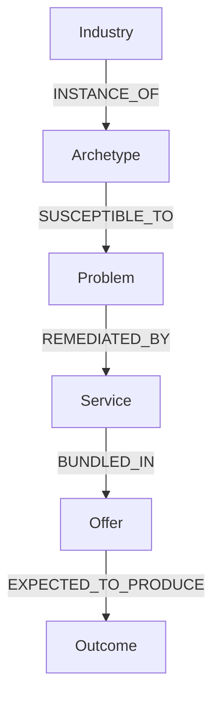

# UBERBOND Knowledge Graph

> Intelligence-layer specification — Version 1.0.0  
> Status: Structurally validated baseline; domain calibration pending  
> Effective date: 2026-07-14  
> Currency: USD unless stated otherwise  
> Scope: Audits, recommendations, offers, outreach, pricing, market selection, and autonomous growth decisions

## Document contract

This document is the canonical human-readable source for the first UBERBOND Knowledge Graph. It is not application code. Every entity has a stable identifier; every reusable concept is normalized; every estimate is a decision prior rather than a guarantee.

### Design principles

1. **Stable identity:** IDs never change after publication. Renamed entities retain aliases.
2. **Normalized meaning:** Reusable concepts live once and are referenced by ID.
3. **Typed relationships:** All graph edges have a defined direction, meaning, provenance, weight, and validity window.
4. **Evidence before inference:** Observations and source quality determine confidence; confidence does not determine severity.
5. **Ranges over false precision:** Commercial estimates use bands and must be calibrated by geography, company size, regulation, and observed economics.
6. **Temporal awareness:** Volatile facts carry an observation date and expiry policy.
7. **Human override:** High-risk, regulated, irreversible, or low-confidence recommendations require review.
8. **Outcome accountability:** Recommendations connect to measurable outcomes and explicit counter-metrics.
9. **Extensibility:** New industries, problems, services, offers, outcomes, and evidence sources can be added without altering existing IDs.
10. **No silent deletion:** Deprecation preserves lineage, aliases, replacement IDs, and effective dates.

### Entity types

| Entity | ID pattern | Purpose |
|---|---|---|
| Industry | `IND-###` | Commercial context and typical buying profile |
| Problem | `PRB-CCC-###` | Detectable or inferable business constraint |
| Service | `SRV-CCC-###` | Atomic intervention UBERBOND can recommend |
| Offer | `OFR-###` | Sellable bundle of services |
| Outcome | `OUT-###` | Measurable result with guardrails |
| Archetype | `ARC-##` | Reusable operating-model profile inherited by industries |
| Evidence type | `EV-##` | Standard observation source |
| Relationship | `REL-...` | Typed graph edge with provenance |

### Record metadata required in the machine representation

Every entity and relationship must eventually carry: `id`, `canonical_name`, `description`, `status`, `version_introduced`, `valid_from`, `valid_to`, `jurisdiction_scope`, `source_provenance`, `last_reviewed_at`, `owner`, `aliases`, and `notes`. Tables below omit repeated governance fields for readability.

## Controlled vocabularies

### Company size

| Code | Typical size |
|---|---|
| CS1 | Solo or micro: 1–9 employees; usually under $1M annual revenue |
| CS2 | Small: 10–49 employees; usually $1M–$10M |
| CS3 | Mid-market: 50–249 employees; usually $10M–$100M |
| CS4 | Large: 250–999 employees; usually $100M–$1B |
| CS5 | Enterprise: 1,000+ employees; often above $1B |
| CSV | Variable or fragmented market spanning CS1–CS5 |

### Buying urgency

| Code | Meaning |
|---|---|
| U1 | Low; discretionary, educational, or longer than 12-month horizon |
| U2 | Moderate-low; 6–12 month horizon |
| U3 | Moderate; 1–6 month horizon or visible opportunity cost |
| U4 | High; days to 8 weeks due to revenue, launch, competition, or compliance |
| U5 | Critical; immediate outage, incident, legal exposure, or acute revenue loss |

### Marketing maturity

| Code | Meaning |
|---|---|
| MM1 | Founder-led or ad hoc; little instrumentation |
| MM2 | Basic channels and tools; inconsistent process |
| MM3 | Dedicated generalists; repeatable campaigns; partial measurement |
| MM4 | Specialized team; integrated stack; experimentation |
| MM5 | Advanced data, lifecycle, incrementality, and governance |
| MMV | Wide variance by company size or geography |

### Estimated willingness to pay

This is the typical addressable digital-growth budget for a credible, outcome-linked engagement, not a quote.

| Code | Project range | Retainer range |
|---|---:|---:|
| W1 | $500–$3,000 | $250–$1,000/month |
| W2 | $3,000–$10,000 | $1,000–$3,000/month |
| W3 | $10,000–$35,000 | $3,000–$10,000/month |
| W4 | $35,000–$150,000 | $10,000–$40,000/month |
| W5 | $150,000–$1,000,000+ | $40,000–$250,000+/month |
| WV | Highly variable; calculate from economics and procurement context | Highly variable; calculate from economics and procurement context |

### Revenue models

| Code | Revenue model |
|---|---|
| RM01 | Fee-for-service or appointment |
| RM02 | Project or milestone fee |
| RM03 | Hourly or professional retainer |
| RM04 | Product margin; one-time commerce |
| RM05 | Subscription or membership |
| RM06 | Usage or consumption based |
| RM07 | Transaction commission or take rate |
| RM08 | Advertising or sponsorship |
| RM09 | Licensing, royalty, or IP |
| RM10 | Tuition or cohort fee |
| RM11 | Rent, lease, or occupancy |
| RM12 | Insurance premium or risk spread |
| RM13 | Interest, assets under management, or financial spread |
| RM14 | Contract, tender, or procurement |
| RM15 | Donation, grant, or membership dues |
| RM16 | Ticket, booking, or reservation |
| RM17 | Franchise fee or revenue share |
| RM18 | Mixed or multi-sided model |

### Website goals

| Code | Goal |
|---|---|
| WG01 | Establish credibility and trust |
| WG02 | Generate qualified leads |
| WG03 | Book appointments, demos, or consultations |
| WG04 | Sell products or subscriptions |
| WG05 | Educate prospects and reduce uncertainty |
| WG06 | Support customers or patients |
| WG07 | Capture local-intent demand |
| WG08 | Recruit talent, members, or partners |
| WG09 | Enable self-service transactions |
| WG10 | Demonstrate proof, portfolio, or outcomes |
| WG11 | Publish information, media, or thought leadership |
| WG12 | Meet compliance, accessibility, or disclosure duties |
| WG13 | Drive physical visits or attendance |
| WG14 | Serve investors, procurement, or enterprise buyers |
| WG15 | Build community, loyalty, or repeat use |

### Monthly recurring revenue opportunity families

| Code | Recurring opportunity |
|---|---|
| MR01 | Website care, uptime, performance, and security |
| MR02 | SEO, local visibility, and content operations |
| MR03 | Paid acquisition and creative testing |
| MR04 | CRM, email, SMS, and lifecycle operations |
| MR05 | Analytics, dashboards, attribution, and experimentation |
| MR06 | Reputation, reviews, and social listening |
| MR07 | Conversion optimization and merchandising |
| MR08 | Automation, integrations, AI agents, and RevOps |
| MR09 | Compliance, accessibility, privacy, and risk monitoring |
| MR10 | Market, competitor, pricing, and opportunity intelligence |
| MR11 | Social media, community, creator, and content production |
| MR12 | Customer success, retention, support, and loyalty |

### Archetypes

| ID | Archetype | Core economics |
|---|---|---|
| ARC-01 | Local appointment business | Local intent → trust → booking → attendance → repeat/referral |
| ARC-02 | Regulated care provider | Trust and compliance → appointment → treatment value → retention |
| ARC-03 | High-ticket professional service | Authority → qualified lead → consultation → proposal → close |
| ARC-04 | B2B contract seller | Account demand → qualification → sales cycle → contract → expansion |
| ARC-05 | Direct-to-consumer commerce | Traffic → product discovery → checkout → repeat purchase |
| ARC-06 | Retail and location network | Local discovery → store visit or order → loyalty |
| ARC-07 | Subscription software | Acquisition → activation → retained usage → expansion |
| ARC-08 | Transaction marketplace | Supply and demand liquidity → transaction → take rate |
| ARC-09 | Hospitality and booking | Discovery → availability → reservation → experience → review |
| ARC-10 | Education and enrollment | Awareness → inquiry → application → enrollment → completion |
| ARC-11 | Media and audience | Reach → engagement → subscription, ad, or sponsor monetization |
| ARC-12 | Membership and community | Recruitment → participation → dues/donation → retention |
| ARC-13 | Enterprise or infrastructure | Long-cycle trust → procurement → implementation → renewal |
| ARC-14 | Financial and risk service | Trust, eligibility, and compliance → account/policy → lifetime value |
| ARC-15 | Property and occupancy | Listing/discovery → inquiry → viewing → transaction → management |
| ARC-16 | Field and home service | Local urgent demand → quote/dispatch → job → review/maintenance |
| ARC-17 | Event and experience | Discovery → ticket/booking → attendance → ancillary spend |
| ARC-18 | Logistics and mobility | Quote/availability → booking/contract → fulfillment → repeat volume |
| ARC-19 | Industrial supply and manufacturing | Specification → RFQ → procurement → fulfillment → account growth |
| ARC-20 | Public-interest service | Information/access → eligibility/action → service completion → trust |

### Evidence sources

| ID | Evidence source |
|---|---|
| EV-01 | HTML, DOM, headers, structured data, and rendered-page crawl |
| EV-02 | Lighthouse, Core Web Vitals, browser, device, and network tests |
| EV-03 | Search-engine index, result page, keyword, backlink, and local-pack observations |
| EV-04 | Analytics, tag manager, consent, event, and attribution telemetry |
| EV-05 | Advertising accounts, pixels, feeds, policies, spend, and creative history |
| EV-06 | CRM, pipeline, call, calendar, proposal, and sales-stage records |
| EV-07 | Commerce platform, product feed, checkout, order, inventory, and refund data |
| EV-08 | Email, SMS, deliverability, lifecycle, and audience data |
| EV-09 | Reviews, listings, social profiles, mentions, and sentiment |
| EV-10 | User testing, session replay, heatmaps, surveys, and interviews |
| EV-11 | Customer support, success, churn, NPS, complaint, and SLA records |
| EV-12 | Security scan, dependency inventory, access logs, configuration, and incident records |
| EV-13 | Legal, policy, consent, license, claim, accessibility, and jurisdiction review |
| EV-14 | Competitor, market, pricing, demand, regulation, and macro observations |
| EV-15 | Financial model, unit economics, invoices, margins, cohorts, and revenue records |
| EV-16 | Manual expert review or stakeholder-confirmed evidence |
| EV-17 | Synthetic test, mystery shop, form submission, call, email, or transaction |
| EV-18 | Third-party authoritative registry, platform API, or verified data provider |

### Severity

| Code | Meaning |
|---|---|
| S1 | Cosmetic or marginal; no material near-term loss |
| S2 | Minor friction or efficiency loss |
| S3 | Material constraint affecting a segment, stage, or channel |
| S4 | Major revenue, trust, operational, or compliance exposure |
| S5 | Critical outage, security, legal, safety, or business-continuity risk |

### Estimated revenue-impact bands

Impact is the plausible share of the **affected revenue pool**, not automatically total company revenue. Use the lower bound until validated.

| Code | Plausible impact |
|---|---|
| RI0 | No defensible revenue estimate; track risk or cost only |
| RI1 | Under 1% or localized efficiency effect |
| RI2 | 1–3% |
| RI3 | 3–10% |
| RI4 | 10–25% |
| RI5 | Over 25% or existential exposure |
| RIV | Highly variable; requires business data |

### Problem confidence model

Each problem record specifies the inputs expected for confidence. The future machine score is:

`Confidence = 100 × EvidenceQuality × SignalAgreement × Coverage × Freshness × EntityMatch − ContradictionPenalty`

All multiplicative factors are bounded from `0.00–1.00`; contradiction penalty is `0–25` points. Confidence must be shown separately from severity and opportunity value.

| Input | Meaning |
|---|---|
| Q | Source quality and directness |
| A | Agreement across independent signals |
| C | Coverage across relevant pages, records, locations, campaigns, or users |
| F | Freshness relative to the entity’s expiry policy |
| M | Match between evidence and the exact business/entity |
| X | Contradictory or missing evidence penalty |
| B | Baseline or peer benchmark quality |
| N | Sample size or observation count |
| J | Jurisdiction and policy applicability |
| H | Human confirmation status |

### Service scoring vocabularies

| Dimension | Codes |
|---|---|
| Difficulty | D1 routine; D2 moderate; D3 specialized; D4 complex cross-functional; D5 enterprise/regulated transformation |
| Automation potential | A0 none; A1 low; A2 assisted; A3 high with review; A4 near-complete for standard cases |
| Gross-margin potential | G1 under 35%; G2 35–50%; G3 50–65%; G4 65–80%; G5 above 80% at scale |
| Subscription potential | T0 none; T1 weak; T2 periodic; T3 strong recurring; T4 continuous/usage-based |
| AI suitability | AI0 unsuitable; AI1 limited; AI2 copilot; AI3 strong with review; AI4 AI-native with controls |
| Implementation effort | E1 under 1 day; E2 1–3 days; E3 4–10 days; E4 2–6 weeks; E5 2–6 months; E6 6+ months |

---

# 1. Industries

Industry records reference canonical codes above. “Common problems” are prioritized hypotheses, not diagnoses; an audit must establish evidence.


## Healthcare and Life Sciences

| ID | Industry | Archetype | Typical company size | Main revenue model | Typical website goals | Common digital problems | Buying urgency | Decision maker | Typical marketing maturity | Estimated willingness to pay | Potential MRR opportunities |
|---|---|---|---|---|---|---|---|---|---|---|---|
| IND-001 | General medical practices | ARC-02 | CS1–CS3 | RM01 | WG01, WG03, WG05, WG07, WG12 | PRB-UX-011, PRB-CMP-004, PRB-CMP-008, PRB-LOC-003, PRB-LED-009 | U4 | Owner physician; practice manager; marketing director | MM1–MM3 | W2–W4 | MR01, MR02, MR04, MR06, MR09 |
| IND-002 | Dental clinics | ARC-02 | CS1–CS3 | RM01 | WG01, WG03, WG05, WG07, WG10 | PRB-UX-011, PRB-CMP-004, PRB-CMP-008, PRB-LOC-003, PRB-LED-009 | U4 | Owner dentist; practice manager | MM1–MM3 | W2–W4 | MR01, MR02, MR04, MR06, MR09 |
| IND-003 | Orthodontic clinics | ARC-02 | CS1–CS3 | RM01 | WG01, WG03, WG05, WG07, WG10 | PRB-UX-011, PRB-CMP-004, PRB-CMP-008, PRB-LOC-003, PRB-LED-009 | U4 | Owner orthodontist; clinic manager | MM2–MM3 | W2–W4 | MR01, MR02, MR04, MR06, MR09 |
| IND-004 | Oral and maxillofacial surgery clinics | ARC-02 | CS1–CS3 | RM01 | WG01, WG03, WG05, WG10, WG12 | PRB-UX-011, PRB-CMP-004, PRB-CMP-008, PRB-CNT-004, PRB-LED-009 | U4 | Lead surgeon; clinic director | MM1–MM3 | W3–W4 | MR01, MR02, MR04, MR06, MR09 |
| IND-005 | Physiotherapy and rehabilitation clinics | ARC-02 | CS1–CS3 | RM01, RM05 | WG01, WG03, WG05, WG07, WG10 | PRB-UX-011, PRB-CMP-004, PRB-CMP-008, PRB-LOC-003, PRB-LED-009 | U3 | Clinic owner; operations manager | MM1–MM3 | W2–W3 | MR01, MR02, MR04, MR06, MR09 |
| IND-006 | Mental health and psychiatry clinics | ARC-02 | CS1–CS3 | RM01, RM05 | WG01, WG03, WG05, WG06, WG12 | PRB-UX-011, PRB-CMP-004, PRB-SEC-013, PRB-LED-009, PRB-CXS-001 | U4 | Clinical director; owner psychiatrist | MM1–MM3 | W2–W4 | MR01, MR02, MR04, MR09, MR12 |
| IND-007 | Dermatology and aesthetic clinics | ARC-02 | CS1–CS4 | RM01, RM04, RM05 | WG01, WG03, WG04, WG07, WG10 | PRB-CMP-008, PRB-LOC-003, PRB-REP-003, PRB-SOC-005, PRB-LED-007 | U4 | Owner physician; clinic CEO; marketing head | MM2–MM4 | W3–W5 | MR02, MR03, MR04, MR06, MR11 |
| IND-008 | Ophthalmology and eye-care clinics | ARC-02 | CS1–CS4 | RM01, RM04 | WG01, WG03, WG05, WG07, WG10 | PRB-UX-011, PRB-CMP-004, PRB-CMP-008, PRB-LOC-003, PRB-LED-009 | U4 | Medical director; practice manager | MM2–MM4 | W3–W5 | MR01, MR02, MR04, MR06, MR09 |
| IND-009 | Fertility and IVF clinics | ARC-02 | CS2–CS4 | RM01 | WG01, WG03, WG05, WG10, WG12 | PRB-UX-011, PRB-CMP-008, PRB-CNT-006, PRB-REP-005, PRB-LED-007 | U4 | Clinic CEO; medical director; marketing director | MM2–MM4 | W3–W5 | MR02, MR04, MR06, MR09, MR12 |
| IND-010 | Diagnostic imaging centers | ARC-02 | CS2–CS4 | RM01, RM14 | WG01, WG03, WG05, WG06, WG12 | PRB-UX-011, PRB-CMP-004, PRB-CMP-008, PRB-LOC-003, PRB-LED-009 | U3 | General manager; medical director; operations head | MM2–MM3 | W3–W4 | MR01, MR02, MR04, MR08, MR09 |
| IND-011 | Clinical laboratories | ARC-02 | CS2–CS5 | RM01, RM14 | WG01, WG03, WG05, WG06, WG12 | PRB-CMP-004, PRB-SEC-013, PRB-OPS-004, PRB-CXS-002, PRB-ANA-006 | U4 | General manager; lab director; digital head | MM2–MM4 | W3–W5 | MR01, MR05, MR08, MR09, MR12 |
| IND-012 | Retail pharmacies | ARC-06 | CS1–CS5 | RM04, RM14 | WG04, WG05, WG07, WG09, WG13 | PRB-LOC-001, PRB-ECM-005, PRB-CMP-007, PRB-CXS-014, PRB-ANA-006 | U3 | Owner pharmacist; retail director; ecommerce head | MM1–MM4 | W2–W5 | MR02, MR04, MR05, MR07, MR09 |
| IND-013 | Telehealth platforms | ARC-08 | CS2–CS5 | RM01, RM05, RM07 | WG01, WG03, WG06, WG09, WG12 | PRB-CMP-004, PRB-SEC-013, PRB-CXS-001, PRB-OPS-004, PRB-ANA-006 | U5 | CEO; product head; growth head; compliance officer | MM3–MM5 | W4–W5 | MR01, MR04, MR05, MR08, MR09 |
| IND-014 | Home healthcare providers | ARC-02 | CS2–CS5 | RM01, RM14 | WG01, WG02, WG03, WG05, WG12 | PRB-LED-007, PRB-OPS-010, PRB-CXS-001, PRB-CMP-004, PRB-REP-003 | U4 | CEO; branch director; referral marketing head | MM2–MM4 | W3–W5 | MR02, MR04, MR06, MR08, MR12 |
| IND-015 | Senior living and assisted-care operators | ARC-02 | CS2–CS5 | RM05, RM11 | WG01, WG02, WG03, WG05, WG10 | PRB-UX-011, PRB-WEB-013, PRB-LED-007, PRB-REP-003, PRB-CXS-001 | U4 | Executive director; occupancy director; marketing VP | MM2–MM4 | W3–W5 | MR01, MR02, MR04, MR06, MR12 |
| IND-016 | Veterinary clinics and hospitals | ARC-01 | CS1–CS4 | RM01, RM04, RM05 | WG01, WG03, WG05, WG07, WG10 | PRB-LOC-002, PRB-LOC-003, PRB-UX-005, PRB-LED-007, PRB-ANA-004 | U4 | Owner veterinarian; hospital manager | MM1–MM3 | W2–W4 | MR01, MR02, MR04, MR05, MR06 |
| IND-017 | Medical-device manufacturers | ARC-19 | CS2–CS5 | RM04, RM09, RM14 | WG01, WG02, WG05, WG10, WG14 | PRB-CMP-007, PRB-CNT-005, PRB-SAL-007, PRB-SEO-015, PRB-MKT-012 | U4 | Commercial VP; marketing director; product leader | MM3–MM5 | W4–W5 | MR02, MR04, MR09, MR10, MR11 |
| IND-018 | Biotechnology companies | ARC-13 | CS2–CS5 | RM09, RM14, RM18 | WG01, WG02, WG08, WG11, WG14 | PRB-BRD-012, PRB-CNT-004, PRB-SEC-004, PRB-SAL-007, PRB-MKT-002 | U3 | CEO; business-development head; communications VP | MM2–MM5 | W4–W5 | MR01, MR02, MR09, MR10, MR11 |
| IND-019 | Pharmaceutical companies | ARC-13 | CS3–CS5 | RM04, RM09, RM14 | WG01, WG05, WG08, WG11, WG12 | PRB-CMP-007, PRB-CMP-008, PRB-BRD-012, PRB-MKT-012, PRB-SEC-013 | U5 | Brand director; digital VP; compliance officer | MM4–MM5 | W5 | MR05, MR09, MR10, MR11, MR12 |
| IND-020 | Health-insurance providers | ARC-14 | CS3–CS5 | RM12 | WG01, WG03, WG05, WG06, WG09 | PRB-UX-011, PRB-CMP-009, PRB-SEC-013, PRB-CXS-001, PRB-OPS-004 | U5 | Chief marketing officer; digital head; compliance officer | MM3–MM5 | W5 | MR01, MR04, MR05, MR09, MR12 |

## Professional, Financial and Property Services

| ID | Industry | Archetype | Typical company size | Main revenue model | Typical website goals | Common digital problems | Buying urgency | Decision maker | Typical marketing maturity | Estimated willingness to pay | Potential MRR opportunities |
|---|---|---|---|---|---|---|---|---|---|---|---|
| IND-021 | Law firms | ARC-03 | CS1–CS5 | RM03, RM14 | WG01, WG02, WG03, WG10, WG11 | PRB-UX-001, PRB-CNT-004, PRB-LED-003, PRB-SAL-003, PRB-ANA-008 | U3 | Managing partner; business-development director | MM1–MM4 | W2–W5 | MR02, MR04, MR05, MR08, MR10 |
| IND-022 | Accounting and audit firms | ARC-03 | CS1–CS5 | RM03, RM14 | WG01, WG02, WG03, WG10, WG14 | PRB-UX-001, PRB-CNT-004, PRB-LED-003, PRB-SAL-003, PRB-ANA-008 | U3 | Managing partner; growth director | MM1–MM4 | W2–W5 | MR02, MR04, MR05, MR08, MR10 |
| IND-023 | Bookkeeping services | ARC-03 | CS1–CS3 | RM03, RM05 | WG01, WG02, WG03, WG05 | PRB-UX-001, PRB-LED-003, PRB-PRI-003, PRB-CRM-005, PRB-CXS-003 | U3 | Founder; operations lead | MM1–MM3 | W1–W3 | MR02, MR04, MR05, MR08, MR12 |
| IND-024 | Tax advisory firms | ARC-03 | CS1–CS4 | RM03, RM14 | WG01, WG02, WG03, WG05, WG11 | PRB-UX-001, PRB-CNT-004, PRB-LED-003, PRB-SAL-003, PRB-ANA-008 | U4 | Managing partner; tax practice lead | MM1–MM4 | W2–W4 | MR02, MR04, MR05, MR08, MR10 |
| IND-025 | Management consultancies | ARC-03 | CS1–CS5 | RM02, RM03, RM14 | WG01, WG02, WG10, WG11, WG14 | PRB-UX-001, PRB-CNT-004, PRB-LED-003, PRB-SAL-003, PRB-ANA-008 | U3 | Managing director; marketing partner | MM2–MM5 | W3–W5 | MR02, MR04, MR05, MR08, MR10 |
| IND-026 | IT consultancies and managed-service providers | ARC-04 | CS1–CS5 | RM02, RM03, RM05 | WG01, WG02, WG05, WG10, WG14 | PRB-SEO-015, PRB-CNT-004, PRB-LED-003, PRB-SAL-007, PRB-MKT-002 | U4 | CEO; sales VP; marketing director | MM2–MM4 | W3–W5 | MR02, MR04, MR05, MR08, MR10 |
| IND-027 | Cybersecurity consultancies | ARC-04 | CS1–CS5 | RM02, RM03, RM05 | WG01, WG02, WG05, WG10, WG14 | PRB-UX-001, PRB-BRD-012, PRB-CNT-004, PRB-LED-003, PRB-SAL-007 | U4 | CEO; revenue leader; marketing director | MM2–MM5 | W3–W5 | MR02, MR04, MR05, MR10, MR11 |
| IND-028 | Recruitment and staffing agencies | ARC-08 | CS1–CS5 | RM07, RM14 | WG01, WG02, WG08, WG09, WG14 | PRB-UX-004, PRB-LED-003, PRB-CRM-001, PRB-OPS-004, PRB-ANA-008 | U4 | Agency owner; managing director; growth head | MM2–MM4 | W2–W5 | MR02, MR04, MR05, MR08, MR10 |
| IND-029 | Executive-search firms | ARC-03 | CS1–CS4 | RM07, RM14 | WG01, WG02, WG08, WG10, WG14 | PRB-UX-011, PRB-CNT-004, PRB-LED-003, PRB-SAL-003, PRB-REP-010 | U3 | Managing partner; practice leader | MM1–MM4 | W3–W5 | MR02, MR04, MR05, MR06, MR10 |
| IND-030 | HR outsourcing and PEO providers | ARC-04 | CS2–CS5 | RM05, RM14 | WG01, WG02, WG05, WG10, WG14 | PRB-SEO-015, PRB-CNT-004, PRB-LED-003, PRB-SAL-007, PRB-MKT-002 | U3 | Revenue VP; marketing VP; partnerships head | MM3–MM5 | W4–W5 | MR02, MR04, MR05, MR08, MR10 |
| IND-031 | Translation and localization agencies | ARC-04 | CS1–CS4 | RM02, RM03 | WG01, WG02, WG05, WG10, WG14 | PRB-UX-014, PRB-CNT-012, PRB-LED-003, PRB-SAL-007, PRB-PRI-008 | U3 | Founder; sales director; operations director | MM1–MM3 | W2–W4 | MR02, MR04, MR08, MR10, MR12 |
| IND-032 | Architecture firms | ARC-03 | CS1–CS5 | RM02, RM14 | WG01, WG02, WG08, WG10, WG14 | PRB-CNT-004, PRB-CNT-013, PRB-UX-011, PRB-LED-003, PRB-SAL-007 | U3 | Principal; business-development director | MM1–MM4 | W2–W5 | MR01, MR02, MR04, MR10, MR11 |
| IND-033 | Engineering consultancies | ARC-04 | CS1–CS5 | RM02, RM03, RM14 | WG01, WG02, WG05, WG10, WG14 | PRB-SEO-015, PRB-CNT-004, PRB-LED-003, PRB-SAL-007, PRB-MKT-002 | U3 | Managing director; bids director; marketing head | MM1–MM4 | W3–W5 | MR02, MR04, MR05, MR08, MR10 |
| IND-034 | Interior-design studios | ARC-03 | CS1–CS4 | RM02, RM04 | WG01, WG02, WG03, WG10, WG11 | PRB-BRD-001, PRB-CNT-013, PRB-SOC-005, PRB-LED-007, PRB-SAL-003 | U3 | Founder; studio director | MM1–MM4 | W2–W4 | MR02, MR04, MR06, MR10, MR11 |
| IND-035 | Residential real-estate brokerages | ARC-15 | CS1–CS5 | RM07 | WG01, WG02, WG07, WG09, WG10 | PRB-LOC-008, PRB-UX-004, PRB-LED-007, PRB-REP-003, PRB-ANA-008 | U4 | Broker-owner; marketing director; branch head | MM2–MM4 | W2–W5 | MR02, MR04, MR05, MR06, MR08 |
| IND-036 | Commercial real-estate brokerages | ARC-15 | CS1–CS5 | RM07, RM14 | WG01, WG02, WG09, WG10, WG14 | PRB-UX-004, PRB-LED-003, PRB-CNT-004, PRB-SAL-007, PRB-ANA-008 | U3 | Managing broker; marketing director | MM2–MM4 | W3–W5 | MR02, MR04, MR05, MR08, MR10 |
| IND-037 | Property-management companies | ARC-15 | CS1–CS5 | RM03, RM05, RM11 | WG01, WG02, WG06, WG09, WG14 | PRB-LED-007, PRB-CXS-001, PRB-OPS-004, PRB-REP-003, PRB-CRM-008 | U4 | Owner; operations director; leasing head | MM1–MM4 | W2–W5 | MR02, MR04, MR06, MR08, MR12 |
| IND-038 | Mortgage brokers | ARC-14 | CS1–CS4 | RM07 | WG01, WG02, WG03, WG05, WG12 | PRB-UX-011, PRB-CMP-009, PRB-SEC-013, PRB-LED-003, PRB-BRD-012 | U4 | Broker-owner; marketing director; compliance lead | MM2–MM4 | W3–W5 | MR01, MR04, MR05, MR09, MR10 |
| IND-039 | Insurance agencies and brokerages | ARC-14 | CS1–CS5 | RM07, RM12 | WG01, WG02, WG03, WG05, WG12 | PRB-UX-011, PRB-CMP-009, PRB-SEC-013, PRB-LED-003, PRB-BRD-012 | U4 | Agency principal; growth director; compliance lead | MM2–MM4 | W2–W5 | MR01, MR04, MR05, MR09, MR10 |
| IND-040 | Financial-advisory practices | ARC-14 | CS1–CS4 | RM03, RM13 | WG01, WG02, WG03, WG05, WG12 | PRB-UX-011, PRB-CMP-009, PRB-SEC-013, PRB-LED-003, PRB-BRD-012 | U4 | Managing advisor; chief compliance officer | MM2–MM4 | W3–W5 | MR01, MR04, MR05, MR09, MR10 |
| IND-041 | Wealth-management firms | ARC-14 | CS2–CS5 | RM13 | WG01, WG02, WG03, WG10, WG12 | PRB-UX-011, PRB-CMP-009, PRB-BRD-012, PRB-SEC-013, PRB-LED-003 | U4 | Chief marketing officer; partner; compliance officer | MM3–MM5 | W4–W5 | MR01, MR04, MR05, MR09, MR10 |
| IND-042 | Commercial and retail banks | ARC-14 | CS4–CS5 | RM13, RM18 | WG01, WG03, WG05, WG06, WG09 | PRB-SEC-013, PRB-CMP-009, PRB-CXS-001, PRB-OPS-004, PRB-ANA-006 | U5 | Chief digital officer; CMO; compliance officer | MM4–MM5 | W5 | MR01, MR05, MR08, MR09, MR12 |
| IND-043 | Fintech platforms | ARC-07 | CS2–CS5 | RM05, RM06, RM07 | WG01, WG03, WG04, WG06, WG09 | PRB-CMP-009, PRB-SEC-013, PRB-CXS-003, PRB-CXS-005, PRB-ANA-015 | U5 | Chief product officer; growth VP; compliance officer | MM3–MM5 | W4–W5 | MR01, MR04, MR05, MR09, MR12 |
| IND-044 | Payment processors and gateways | ARC-13 | CS3–CS5 | RM06, RM07 | WG01, WG02, WG05, WG06, WG14 | PRB-CMP-005, PRB-SEC-013, PRB-OPS-004, PRB-CXS-001, PRB-SAL-007 | U5 | Product VP; revenue VP; risk officer | MM4–MM5 | W5 | MR01, MR05, MR08, MR09, MR12 |
| IND-045 | Private-equity and venture-capital firms | ARC-03 | CS1–CS5 | RM13, RM18 | WG01, WG02, WG08, WG10, WG14 | PRB-UX-011, PRB-BRD-012, PRB-CNT-004, PRB-LED-003, PRB-REP-010 | U3 | Managing partner; investor relations; platform head | MM1–MM4 | W3–W5 | MR02, MR05, MR06, MR10, MR11 |

## Local, Home and Personal Services

| ID | Industry | Archetype | Typical company size | Main revenue model | Typical website goals | Common digital problems | Buying urgency | Decision maker | Typical marketing maturity | Estimated willingness to pay | Potential MRR opportunities |
|---|---|---|---|---|---|---|---|---|---|---|---|
| IND-046 | Plumbing contractors | ARC-16 | CS1–CS4 | RM01, RM02 | WG01, WG02, WG03, WG07, WG10 | PRB-LOC-002, PRB-LED-009, PRB-OPS-010, PRB-REP-003, PRB-CRM-008 | U5 | Owner; general manager; marketing manager | MM1–MM3 | W1–W4 | MR01, MR02, MR04, MR06, MR08 |
| IND-047 | Electrical contractors | ARC-16 | CS1–CS4 | RM01, RM02, RM14 | WG01, WG02, WG03, WG07, WG10 | PRB-LOC-002, PRB-LED-009, PRB-OPS-010, PRB-REP-003, PRB-CRM-008 | U4 | Owner; general manager | MM1–MM3 | W1–W4 | MR01, MR02, MR04, MR06, MR08 |
| IND-048 | HVAC contractors | ARC-16 | CS1–CS4 | RM01, RM02, RM05 | WG01, WG02, WG03, WG07, WG10 | PRB-LOC-002, PRB-LED-009, PRB-OPS-010, PRB-REP-003, PRB-CRM-008 | U5 | Owner; service manager; marketing manager | MM1–MM3 | W2–W4 | MR01, MR02, MR04, MR06, MR08 |
| IND-049 | Roofing contractors | ARC-16 | CS1–CS4 | RM02 | WG01, WG02, WG03, WG07, WG10 | PRB-LOC-002, PRB-LED-009, PRB-REP-003, PRB-SAL-003, PRB-ADS-010 | U5 | Owner; sales manager; marketing manager | MM1–MM3 | W2–W4 | MR01, MR02, MR03, MR06, MR08 |
| IND-050 | Landscaping and lawn-care services | ARC-16 | CS1–CS4 | RM01, RM02, RM05 | WG01, WG02, WG03, WG07, WG10 | PRB-LOC-002, PRB-LED-009, PRB-OPS-010, PRB-REP-003, PRB-CRM-008 | U3 | Owner; operations manager | MM1–MM3 | W1–W3 | MR01, MR02, MR04, MR06, MR08 |
| IND-051 | Pest-control services | ARC-16 | CS1–CS4 | RM01, RM05 | WG01, WG02, WG03, WG07, WG10 | PRB-LOC-002, PRB-LED-009, PRB-OPS-010, PRB-REP-003, PRB-CRM-008 | U5 | Owner; branch manager; marketing manager | MM1–MM3 | W2–W4 | MR01, MR02, MR04, MR06, MR08 |
| IND-052 | Residential and commercial cleaning services | ARC-16 | CS1–CS4 | RM01, RM05, RM14 | WG01, WG02, WG03, WG07, WG10 | PRB-LOC-002, PRB-LED-009, PRB-OPS-010, PRB-REP-003, PRB-CRM-008 | U3 | Owner; operations manager | MM1–MM3 | W1–W3 | MR01, MR02, MR04, MR06, MR08 |
| IND-053 | Water, fire and mold restoration services | ARC-16 | CS1–CS4 | RM01, RM02, RM12 | WG01, WG02, WG03, WG07, WG10 | PRB-LOC-002, PRB-LED-009, PRB-OPS-010, PRB-REP-003, PRB-WEB-010 | U5 | Owner; dispatch manager; marketing director | MM2–MM4 | W3–W5 | MR01, MR02, MR03, MR06, MR08 |
| IND-054 | Locksmith services | ARC-16 | CS1–CS3 | RM01 | WG01, WG02, WG03, WG07, WG10 | PRB-LOC-002, PRB-LED-009, PRB-REP-003, PRB-SEC-010, PRB-ADS-010 | U5 | Owner; dispatch manager | MM1–MM3 | W1–W3 | MR01, MR02, MR04, MR06, MR08 |
| IND-055 | Painting contractors | ARC-16 | CS1–CS4 | RM02 | WG01, WG02, WG03, WG07, WG10 | PRB-LOC-002, PRB-LED-009, PRB-OPS-010, PRB-REP-003, PRB-CRM-008 | U3 | Owner; sales manager | MM1–MM3 | W1–W3 | MR01, MR02, MR04, MR06, MR08 |
| IND-056 | Flooring installers and retailers | ARC-16, ARC-06 | CS1–CS4 | RM02, RM04 | WG01, WG02, WG04, WG07, WG10 | PRB-LOC-002, PRB-CNT-013, PRB-LED-007, PRB-ECM-002, PRB-REP-003 | U3 | Owner; showroom manager; marketing manager | MM1–MM3 | W2–W4 | MR02, MR03, MR04, MR06, MR07 |
| IND-057 | Kitchen and bathroom remodelers | ARC-16 | CS1–CS4 | RM02 | WG01, WG02, WG03, WG07, WG10 | PRB-CNT-004, PRB-CNT-013, PRB-LED-007, PRB-SAL-003, PRB-REP-003 | U4 | Owner; sales director; design director | MM1–MM3 | W2–W4 | MR02, MR03, MR04, MR06, MR08 |
| IND-058 | General contractors and builders | ARC-16, ARC-04 | CS1–CS5 | RM02, RM14 | WG01, WG02, WG05, WG10, WG14 | PRB-CNT-004, PRB-LED-003, PRB-SAL-007, PRB-REP-003, PRB-OPS-010 | U4 | Owner; business-development director; bids head | MM1–MM4 | W2–W5 | MR02, MR04, MR06, MR08, MR10 |
| IND-059 | Residential solar installers | ARC-16 | CS1–CS5 | RM02, RM14 | WG01, WG02, WG03, WG05, WG10 | PRB-CMP-007, PRB-LED-003, PRB-SAL-003, PRB-REP-003, PRB-PRI-002 | U4 | CEO; sales VP; marketing director | MM2–MM4 | W3–W5 | MR02, MR03, MR04, MR06, MR10 |
| IND-060 | Security-system installers | ARC-16 | CS1–CS5 | RM02, RM05, RM14 | WG01, WG02, WG03, WG05, WG10 | PRB-LOC-002, PRB-LED-009, PRB-OPS-010, PRB-REP-003, PRB-CRM-008 | U4 | Owner; revenue director; channel head | MM2–MM4 | W2–W5 | MR01, MR02, MR04, MR06, MR08 |
| IND-061 | Pool installation and maintenance services | ARC-16 | CS1–CS4 | RM02, RM05 | WG01, WG02, WG03, WG07, WG10 | PRB-LOC-002, PRB-LED-009, PRB-OPS-010, PRB-REP-003, PRB-CRM-008 | U3 | Owner; operations manager | MM1–MM3 | W2–W4 | MR01, MR02, MR04, MR06, MR08 |
| IND-062 | Moving and storage companies | ARC-18 | CS1–CS5 | RM01, RM11 | WG01, WG02, WG03, WG09, WG10 | PRB-UX-005, PRB-LED-007, PRB-OPS-004, PRB-REP-003, PRB-PRI-008 | U4 | Owner; general manager; marketing director | MM2–MM4 | W2–W5 | MR02, MR04, MR05, MR06, MR08 |
| IND-063 | Appliance-repair services | ARC-16 | CS1–CS4 | RM01 | WG01, WG02, WG03, WG07, WG10 | PRB-LOC-002, PRB-LED-009, PRB-OPS-010, PRB-REP-003, PRB-CRM-008 | U5 | Owner; dispatch manager | MM1–MM3 | W1–W3 | MR01, MR02, MR04, MR06, MR08 |
| IND-064 | Auto-repair workshops | ARC-16 | CS1–CS4 | RM01, RM04 | WG01, WG03, WG05, WG07, WG10 | PRB-LOC-002, PRB-LED-009, PRB-OPS-010, PRB-REP-003, PRB-CRM-008 | U4 | Owner; service manager | MM1–MM3 | W1–W4 | MR01, MR02, MR04, MR06, MR08 |
| IND-065 | Auto-detailing and car-care studios | ARC-01 | CS1–CS3 | RM01, RM04, RM05 | WG01, WG03, WG04, WG07, WG10 | PRB-LOC-003, PRB-SOC-005, PRB-CNT-013, PRB-LED-007, PRB-CRM-008 | U3 | Owner; studio manager | MM1–MM3 | W1–W3 | MR02, MR04, MR06, MR11, MR12 |
| IND-066 | Automotive dealerships | ARC-06 | CS2–CS5 | RM04, RM13 | WG01, WG02, WG04, WG09, WG13 | PRB-ECM-005, PRB-LED-007, PRB-CRM-001, PRB-ANA-008, PRB-REP-003 | U4 | Dealer principal; marketing director; digital retail head | MM3–MM5 | W4–W5 | MR02, MR03, MR04, MR05, MR06 |
| IND-067 | Tire shops and service chains | ARC-06 | CS1–CS5 | RM01, RM04 | WG01, WG03, WG04, WG07, WG13 | PRB-LOC-001, PRB-LOC-003, PRB-ECM-005, PRB-CXS-014, PRB-ANA-006 | U4 | Owner; retail director; marketing head | MM1–MM4 | W2–W5 | MR02, MR04, MR05, MR06, MR12 |
| IND-068 | Towing and roadside-assistance services | ARC-16 | CS1–CS5 | RM01, RM05, RM14 | WG01, WG03, WG07, WG09, WG10 | PRB-LOC-002, PRB-LED-009, PRB-OPS-004, PRB-WEB-010, PRB-REP-003 | U5 | Owner; dispatch director; network manager | MM1–MM4 | W2–W5 | MR01, MR02, MR05, MR06, MR08 |
| IND-069 | Gyms and fitness clubs | ARC-12 | CS1–CS5 | RM05, RM16 | WG01, WG03, WG04, WG13, WG15 | PRB-CRM-005, PRB-CXS-005, PRB-CXS-014, PRB-SOC-005, PRB-ANA-014 | U4 | Owner; general manager; membership director | MM2–MM4 | W2–W5 | MR03, MR04, MR05, MR11, MR12 |
| IND-070 | Martial-arts academies | ARC-12 | CS1–CS3 | RM05, RM16 | WG01, WG03, WG05, WG13, WG15 | PRB-LOC-003, PRB-CRM-005, PRB-SOC-005, PRB-CXS-014, PRB-ANA-004 | U3 | Owner; head coach; academy manager | MM1–MM3 | W1–W3 | MR02, MR04, MR06, MR11, MR12 |
| IND-071 | Hair salons | ARC-01 | CS1–CS4 | RM01, RM04 | WG01, WG03, WG04, WG07, WG10 | PRB-LOC-002, PRB-LOC-003, PRB-UX-005, PRB-LED-007, PRB-ANA-004 | U4 | Owner; salon manager | MM1–MM3 | W1–W4 | MR01, MR02, MR04, MR05, MR06 |
| IND-072 | Barbershops | ARC-01 | CS1–CS4 | RM01, RM04 | WG01, WG03, WG04, WG07, WG10 | PRB-LOC-002, PRB-LOC-003, PRB-UX-005, PRB-LED-007, PRB-ANA-004 | U3 | Owner; shop manager | MM1–MM3 | W1–W3 | MR01, MR02, MR04, MR05, MR06 |
| IND-073 | Day spas and wellness centers | ARC-01 | CS1–CS4 | RM01, RM04, RM05 | WG01, WG03, WG04, WG07, WG10 | PRB-LOC-003, PRB-CRM-008, PRB-SOC-005, PRB-REP-003, PRB-CXS-014 | U4 | Owner; spa director; marketing manager | MM2–MM4 | W2–W4 | MR02, MR04, MR06, MR11, MR12 |
| IND-074 | Wedding and event planners | ARC-03 | CS1–CS3 | RM02 | WG01, WG02, WG03, WG10, WG11 | PRB-CNT-013, PRB-SOC-005, PRB-LED-007, PRB-SAL-003, PRB-REP-003 | U3 | Founder; creative director | MM1–MM3 | W1–W3 | MR02, MR04, MR06, MR10, MR11 |
| IND-075 | Photography and videography studios | ARC-03 | CS1–CS3 | RM01, RM02, RM09 | WG01, WG02, WG03, WG10, WG11 | PRB-WEB-001, PRB-CNT-013, PRB-UX-011, PRB-LED-007, PRB-PRI-002 | U3 | Founder; studio manager | MM1–MM3 | W1–W3 | MR01, MR02, MR04, MR10, MR11 |

## Commerce, Manufacturing and Supply

| ID | Industry | Archetype | Typical company size | Main revenue model | Typical website goals | Common digital problems | Buying urgency | Decision maker | Typical marketing maturity | Estimated willingness to pay | Potential MRR opportunities |
|---|---|---|---|---|---|---|---|---|---|---|---|
| IND-076 | Fashion and apparel ecommerce brands | ARC-05 | CS1–CS5 | RM04 | WG01, WG04, WG09, WG10, WG15 | PRB-WEB-001, PRB-ECM-002, PRB-ECM-007, PRB-ECM-010, PRB-CRM-006 | U4 | Founder; ecommerce director; growth VP | MM2–MM5 | W2–W5 | MR01, MR03, MR04, MR05, MR07 |
| IND-077 | Beauty and skincare brands | ARC-05 | CS1–CS5 | RM04, RM05 | WG01, WG04, WG05, WG10, WG15 | PRB-ECM-002, PRB-CMP-007, PRB-CNT-014, PRB-CRM-006, PRB-SOC-005 | U5 | Founder; brand director; ecommerce VP | MM2–MM5 | W3–W5 | MR03, MR04, MR05, MR07, MR11 |
| IND-078 | Nutritional-supplement brands | ARC-05 | CS1–CS5 | RM04, RM05 | WG01, WG04, WG05, WG10, WG12 | PRB-CMP-007, PRB-CMP-008, PRB-ECM-002, PRB-CRM-006, PRB-REP-005 | U5 | Founder; growth VP; regulatory lead | MM2–MM5 | W3–W5 | MR03, MR04, MR06, MR07, MR09 |
| IND-079 | Direct-to-consumer food and beverage brands | ARC-05 | CS1–CS5 | RM04, RM05 | WG01, WG04, WG05, WG09, WG15 | PRB-WEB-001, PRB-ECM-002, PRB-ECM-007, PRB-ECM-010, PRB-CRM-006 | U4 | Founder; ecommerce director; brand director | MM2–MM5 | W2–W5 | MR01, MR03, MR04, MR05, MR07 |
| IND-080 | Home and furniture ecommerce brands | ARC-05 | CS1–CS5 | RM04 | WG01, WG04, WG05, WG09, WG10 | PRB-WEB-001, PRB-ECM-002, PRB-ECM-006, PRB-ECM-010, PRB-CXS-001 | U4 | Founder; ecommerce director; merchandising head | MM2–MM5 | W3–W5 | MR01, MR03, MR04, MR07, MR12 |
| IND-081 | Consumer-electronics ecommerce retailers | ARC-05 | CS1–CS5 | RM04 | WG01, WG04, WG05, WG09, WG10 | PRB-ECM-001, PRB-ECM-005, PRB-ECM-008, PRB-SEC-015, PRB-PRI-009 | U5 | Ecommerce director; merchandising VP; CMO | MM3–MM5 | W3–W5 | MR03, MR04, MR05, MR07, MR09 |
| IND-082 | Pet-products brands and retailers | ARC-05 | CS1–CS5 | RM04, RM05 | WG01, WG04, WG05, WG09, WG15 | PRB-WEB-001, PRB-ECM-002, PRB-ECM-007, PRB-ECM-010, PRB-CRM-006 | U4 | Founder; ecommerce director; brand head | MM2–MM5 | W2–W5 | MR01, MR03, MR04, MR05, MR07 |
| IND-083 | Baby and parenting-products brands | ARC-05 | CS1–CS5 | RM04, RM05 | WG01, WG04, WG05, WG10, WG12 | PRB-UX-011, PRB-CMP-007, PRB-ECM-002, PRB-CRM-006, PRB-REP-005 | U5 | Founder; ecommerce director; compliance lead | MM2–MM5 | W3–W5 | MR03, MR04, MR06, MR07, MR09 |
| IND-084 | Jewelry and watch brands | ARC-05 | CS1–CS5 | RM04 | WG01, WG04, WG05, WG10, WG15 | PRB-UX-011, PRB-CNT-013, PRB-ECM-002, PRB-REP-005, PRB-SEC-015 | U4 | Founder; brand director; ecommerce head | MM2–MM5 | W3–W5 | MR01, MR03, MR04, MR06, MR07 |
| IND-085 | Sporting-goods retailers | ARC-05, ARC-06 | CS1–CS5 | RM04 | WG01, WG04, WG05, WG09, WG13 | PRB-WEB-001, PRB-ECM-002, PRB-ECM-007, PRB-ECM-010, PRB-CRM-006 | U4 | Ecommerce director; retail marketing head | MM2–MM5 | W2–W5 | MR01, MR03, MR04, MR05, MR07 |
| IND-086 | Multi-vendor online marketplaces | ARC-08 | CS2–CS5 | RM07, RM08 | WG01, WG04, WG09, WG15 | PRB-UX-004, PRB-ECM-012, PRB-SEC-013, PRB-CXS-001, PRB-ANA-006 | U5 | CEO; product VP; growth VP; trust-and-safety lead | MM3–MM5 | W4–W5 | MR01, MR04, MR05, MR07, MR08 |
| IND-087 | Subscription-box businesses | ARC-05, ARC-07 | CS1–CS4 | RM05 | WG01, WG04, WG05, WG09, WG15 | PRB-ECM-002, PRB-CRM-005, PRB-CXS-005, PRB-PRI-003, PRB-ANA-014 | U4 | Founder; growth head; retention lead | MM2–MM4 | W2–W4 | MR03, MR04, MR05, MR07, MR12 |
| IND-088 | Wholesale distributors | ARC-19 | CS2–CS5 | RM04, RM14 | WG01, WG02, WG05, WG09, WG14 | PRB-UX-001, PRB-CNT-005, PRB-LED-003, PRB-SAL-007, PRB-SEO-015 | U3 | Commercial director; ecommerce head; sales VP | MM2–MM4 | W3–W5 | MR01, MR02, MR04, MR08, MR10 |
| IND-089 | Contract manufacturers | ARC-19 | CS2–CS5 | RM02, RM04, RM14 | WG01, WG02, WG05, WG10, WG14 | PRB-UX-001, PRB-CNT-005, PRB-LED-003, PRB-SAL-007, PRB-SEO-015 | U3 | CEO; sales director; business-development head | MM1–MM4 | W3–W5 | MR01, MR02, MR04, MR08, MR10 |
| IND-090 | Industrial-equipment manufacturers | ARC-19 | CS2–CS5 | RM04, RM14 | WG01, WG02, WG05, WG10, WG14 | PRB-UX-001, PRB-CNT-005, PRB-LED-003, PRB-SAL-007, PRB-SEO-015 | U3 | Commercial VP; channel director; marketing head | MM2–MM4 | W4–W5 | MR01, MR02, MR04, MR08, MR10 |
| IND-091 | Packaging manufacturers and suppliers | ARC-19 | CS2–CS5 | RM04, RM14 | WG01, WG02, WG05, WG10, WG14 | PRB-UX-001, PRB-CNT-005, PRB-LED-003, PRB-SAL-007, PRB-SEO-015 | U3 | Sales VP; marketing director; product manager | MM2–MM4 | W3–W5 | MR01, MR02, MR04, MR08, MR10 |
| IND-092 | Specialty-chemical suppliers | ARC-19 | CS2–CS5 | RM04, RM14 | WG01, WG02, WG05, WG12, WG14 | PRB-CNT-005, PRB-CMP-007, PRB-LED-003, PRB-SAL-007, PRB-SEO-015 | U4 | Commercial director; regulatory lead; marketing head | MM2–MM4 | W4–W5 | MR01, MR02, MR04, MR09, MR10 |
| IND-093 | Building-materials suppliers | ARC-19 | CS2–CS5 | RM04, RM14 | WG01, WG02, WG05, WG09, WG14 | PRB-UX-001, PRB-CNT-005, PRB-LED-003, PRB-SAL-007, PRB-SEO-015 | U3 | Commercial director; channel head; marketing head | MM2–MM4 | W3–W5 | MR01, MR02, MR04, MR08, MR10 |
| IND-094 | Agricultural-input suppliers | ARC-19 | CS2–CS5 | RM04, RM14 | WG01, WG02, WG05, WG09, WG14 | PRB-UX-014, PRB-CNT-005, PRB-LED-003, PRB-OPS-004, PRB-MKT-005 | U3 | Commercial director; regional head; dealer-network lead | MM1–MM3 | W3–W5 | MR02, MR04, MR08, MR10, MR12 |
| IND-095 | Florists and floral delivery | ARC-06 | CS1–CS4 | RM04, RM16 | WG01, WG04, WG07, WG09, WG13 | PRB-LOC-001, PRB-LOC-003, PRB-ECM-005, PRB-CXS-014, PRB-ANA-006 | U5 | Owner; ecommerce manager | MM1–MM3 | W1–W4 | MR02, MR04, MR05, MR06, MR12 |
| IND-096 | Bakeries and confectionery shops | ARC-06 | CS1–CS5 | RM04, RM16 | WG01, WG04, WG07, WG09, WG13 | PRB-LOC-001, PRB-LOC-003, PRB-ECM-005, PRB-CXS-014, PRB-ANA-006 | U4 | Owner; retail director; ecommerce manager | MM1–MM4 | W1–W5 | MR02, MR04, MR05, MR06, MR12 |
| IND-097 | Grocery chains and supermarkets | ARC-06 | CS2–CS5 | RM04 | WG04, WG07, WG09, WG13, WG15 | PRB-LOC-001, PRB-ECM-005, PRB-OPS-004, PRB-CXS-014, PRB-ANA-006 | U5 | Chief digital officer; ecommerce VP; loyalty head | MM3–MM5 | W4–W5 | MR04, MR05, MR07, MR08, MR12 |
| IND-098 | Convenience-store chains | ARC-06 | CS2–CS5 | RM04, RM17 | WG04, WG07, WG09, WG13, WG15 | PRB-LOC-001, PRB-LOC-003, PRB-ECM-005, PRB-CXS-014, PRB-ANA-006 | U4 | Retail marketing director; digital head | MM2–MM4 | W3–W5 | MR02, MR04, MR05, MR06, MR12 |
| IND-099 | Bookstores and book retailers | ARC-06 | CS1–CS5 | RM04 | WG04, WG07, WG09, WG11, WG15 | PRB-LOC-001, PRB-LOC-003, PRB-ECM-005, PRB-CXS-014, PRB-ANA-006 | U3 | Owner; ecommerce manager; retail director | MM1–MM4 | W1–W5 | MR02, MR04, MR05, MR06, MR12 |
| IND-100 | Art galleries and art dealers | ARC-03, ARC-17 | CS1–CS4 | RM04, RM07, RM16 | WG01, WG02, WG10, WG11, WG13 | PRB-CNT-013, PRB-UX-011, PRB-SOC-005, PRB-LED-003, PRB-CRM-001 | U2 | Gallery director; owner; marketing curator | MM1–MM3 | W2–W4 | MR02, MR04, MR06, MR10, MR11 |
| IND-101 | Luxury-goods brands and retailers | ARC-05, ARC-06 | CS2–CS5 | RM04 | WG01, WG04, WG10, WG13, WG15 | PRB-BRD-001, PRB-CNT-013, PRB-UX-011, PRB-REP-005, PRB-CRM-001 | U4 | Brand VP; ecommerce director; clienteling head | MM4–MM5 | W5 | MR03, MR04, MR06, MR07, MR11 |
| IND-102 | Commercial print shops | ARC-19 | CS1–CS4 | RM02, RM04 | WG01, WG02, WG04, WG09, WG10 | PRB-UX-005, PRB-CNT-005, PRB-LED-003, PRB-PRI-002, PRB-OPS-004 | U3 | Owner; sales manager; operations manager | MM1–MM3 | W1–W4 | MR02, MR04, MR08, MR10, MR12 |
| IND-103 | Promotional-products suppliers | ARC-19 | CS1–CS5 | RM02, RM04, RM14 | WG01, WG02, WG04, WG09, WG14 | PRB-UX-001, PRB-CNT-005, PRB-LED-003, PRB-SAL-007, PRB-SEO-015 | U3 | Owner; sales director; ecommerce head | MM1–MM4 | W2–W5 | MR01, MR02, MR04, MR08, MR10 |
| IND-104 | Regulated cannabis and CBD brands | ARC-05 | CS1–CS5 | RM04, RM05 | WG01, WG04, WG05, WG10, WG12 | PRB-CMP-006, PRB-CMP-007, PRB-ADS-014, PRB-CRM-011, PRB-SEC-013 | U5 | Founder; growth VP; compliance counsel | MM2–MM5 | W3–W5 | MR03, MR04, MR06, MR09, MR10 |
| IND-105 | Alcoholic-beverage brands and retailers | ARC-05, ARC-06 | CS1–CS5 | RM04 | WG01, WG04, WG05, WG12, WG13 | PRB-CMP-007, PRB-CMP-012, PRB-ADS-014, PRB-LOC-001, PRB-CRM-011 | U5 | Brand director; ecommerce head; legal counsel | MM3–MM5 | W3–W5 | MR03, MR04, MR06, MR09, MR11 |

## Hospitality, Travel and Experiences

| ID | Industry | Archetype | Typical company size | Main revenue model | Typical website goals | Common digital problems | Buying urgency | Decision maker | Typical marketing maturity | Estimated willingness to pay | Potential MRR opportunities |
|---|---|---|---|---|---|---|---|---|---|---|---|
| IND-106 | Restaurants | ARC-09 | CS1–CS5 | RM04, RM16 | WG01, WG04, WG07, WG09, WG13 | PRB-WEB-004, PRB-UX-011, PRB-CRO-007, PRB-REP-003, PRB-CRM-008 | U5 | Owner; general manager; marketing director | MM1–MM4 | W1–W5 | MR02, MR03, MR04, MR06, MR07 |
| IND-107 | Cafes and coffee shops | ARC-09 | CS1–CS5 | RM04, RM16 | WG01, WG04, WG07, WG09, WG13 | PRB-WEB-004, PRB-UX-011, PRB-CRO-007, PRB-REP-003, PRB-CRM-008 | U4 | Owner; operations director; brand manager | MM1–MM4 | W1–W5 | MR02, MR03, MR04, MR06, MR07 |
| IND-108 | Cloud kitchens and virtual restaurant brands | ARC-08 | CS1–CS5 | RM04, RM07 | WG01, WG04, WG09, WG15 | PRB-ECM-005, PRB-REP-005, PRB-ANA-006, PRB-PRI-007, PRB-OPS-004 | U5 | Founder; growth head; operations director | MM2–MM5 | W2–W5 | MR03, MR04, MR05, MR06, MR08 |
| IND-109 | Catering companies | ARC-03 | CS1–CS4 | RM02, RM14 | WG01, WG02, WG03, WG10, WG14 | PRB-UX-001, PRB-CNT-004, PRB-LED-003, PRB-SAL-003, PRB-ANA-008 | U4 | Owner; sales director; events manager | MM1–MM3 | W2–W4 | MR02, MR04, MR05, MR08, MR10 |
| IND-110 | Hotels and resorts | ARC-09 | CS2–CS5 | RM11, RM16, RM18 | WG01, WG04, WG09, WG10, WG13 | PRB-WEB-004, PRB-UX-011, PRB-CRO-007, PRB-REP-003, PRB-CRM-008 | U5 | General manager; ecommerce director; revenue director | MM3–MM5 | W4–W5 | MR02, MR03, MR04, MR06, MR07 |
| IND-111 | Vacation-rental operators | ARC-09 | CS1–CS5 | RM07, RM11, RM16 | WG01, WG04, WG09, WG10, WG13 | PRB-UX-004, PRB-CRO-007, PRB-REP-003, PRB-PRI-008, PRB-ANA-006 | U4 | Owner; portfolio manager; revenue manager | MM2–MM4 | W2–W5 | MR02, MR04, MR05, MR06, MR07 |
| IND-112 | Travel agencies | ARC-09 | CS1–CS5 | RM07, RM16 | WG01, WG02, WG03, WG05, WG10 | PRB-UX-011, PRB-LED-007, PRB-REP-003, PRB-CRM-008, PRB-PRI-008 | U4 | Owner; commercial director; marketing head | MM1–MM4 | W2–W5 | MR02, MR04, MR06, MR08, MR10 |
| IND-113 | Tour operators | ARC-09 | CS1–CS5 | RM16 | WG01, WG04, WG05, WG09, WG10 | PRB-WEB-004, PRB-UX-011, PRB-CRO-007, PRB-REP-003, PRB-CRM-008 | U4 | Owner; commercial director; ecommerce manager | MM1–MM4 | W2–W5 | MR02, MR03, MR04, MR06, MR07 |
| IND-114 | Airlines | ARC-18 | CS4–CS5 | RM16, RM18 | WG01, WG04, WG06, WG09, WG12 | PRB-WEB-010, PRB-OPS-004, PRB-CXS-001, PRB-ANA-006, PRB-PRI-008 | U5 | Chief digital officer; ecommerce VP; revenue VP | MM5 | W5 | MR01, MR05, MR08, MR09, MR12 |
| IND-115 | Car-rental companies | ARC-18 | CS1–CS5 | RM11, RM16 | WG01, WG04, WG07, WG09, WG13 | PRB-UX-005, PRB-CRO-007, PRB-OPS-004, PRB-REP-003, PRB-PRI-008 | U4 | General manager; ecommerce director; fleet head | MM2–MM5 | W2–W5 | MR02, MR04, MR05, MR06, MR08 |
| IND-116 | Yacht-charter companies | ARC-09 | CS1–CS4 | RM16 | WG01, WG02, WG03, WG10, WG13 | PRB-CNT-013, PRB-UX-011, PRB-LED-007, PRB-SAL-003, PRB-REP-003 | U4 | Owner; charter director; marketing manager | MM1–MM4 | W3–W5 | MR02, MR04, MR06, MR10, MR11 |
| IND-117 | Coworking-space operators | ARC-15, ARC-12 | CS1–CS5 | RM05, RM11 | WG01, WG03, WG08, WG13, WG15 | PRB-LED-007, PRB-CRM-005, PRB-CXS-005, PRB-REP-003, PRB-ANA-014 | U4 | General manager; community head; sales director | MM2–MM4 | W2–W5 | MR02, MR04, MR06, MR11, MR12 |
| IND-118 | Event venues | ARC-17 | CS1–CS5 | RM11, RM16 | WG01, WG02, WG03, WG10, WG13 | PRB-WEB-010, PRB-UX-004, PRB-CRO-007, PRB-CRM-008, PRB-SOC-005 | U4 | Venue director; sales director; marketing manager | MM1–MM4 | W2–W5 | MR01, MR03, MR04, MR07, MR11 |
| IND-119 | Amusement parks and family-entertainment centers | ARC-17 | CS2–CS5 | RM04, RM16 | WG01, WG04, WG09, WG13, WG15 | PRB-WEB-010, PRB-CRO-007, PRB-CRM-008, PRB-SOC-005, PRB-CXS-014 | U5 | Marketing VP; ticketing director; guest-experience head | MM3–MM5 | W4–W5 | MR01, MR03, MR04, MR11, MR12 |
| IND-120 | Museums and cultural attractions | ARC-17, ARC-20 | CS1–CS5 | RM15, RM16 | WG05, WG08, WG11, WG13, WG15 | PRB-WEB-013, PRB-UX-014, PRB-CRO-007, PRB-CRM-001, PRB-CNT-013 | U3 | Executive director; visitor-experience head; development director | MM1–MM4 | W2–W5 | MR01, MR02, MR04, MR09, MR11 |
| IND-121 | Nightlife venues and clubs | ARC-17 | CS1–CS4 | RM04, RM16 | WG01, WG04, WG09, WG13, WG15 | PRB-SOC-005, PRB-CRO-007, PRB-CRM-008, PRB-REP-003, PRB-CMP-012 | U5 | Owner; venue manager; promotions director | MM2–MM4 | W2–W4 | MR03, MR04, MR06, MR09, MR11 |
| IND-122 | Casinos and regulated gaming venues | ARC-17 | CS3–CS5 | RM16, RM18 | WG01, WG04, WG09, WG12, WG15 | PRB-CMP-012, PRB-CMP-006, PRB-SEC-013, PRB-CRM-011, PRB-REP-005 | U5 | Chief marketing officer; digital VP; compliance officer | MM4–MM5 | W5 | MR04, MR05, MR06, MR09, MR12 |
| IND-123 | Food-delivery platforms | ARC-08 | CS2–CS5 | RM07, RM08 | WG04, WG06, WG09, WG15 | PRB-OPS-004, PRB-CXS-001, PRB-ANA-006, PRB-PRI-007, PRB-REP-005 | U5 | Product VP; growth VP; operations director | MM4–MM5 | W5 | MR04, MR05, MR08, MR10, MR12 |
| IND-124 | Cruise operators | ARC-09, ARC-18 | CS4–CS5 | RM16, RM18 | WG01, WG04, WG05, WG09, WG13 | PRB-WEB-010, PRB-CRO-007, PRB-CXS-001, PRB-REP-003, PRB-PRI-008 | U5 | Chief marketing officer; ecommerce VP; revenue VP | MM4–MM5 | W5 | MR01, MR04, MR05, MR06, MR12 |
| IND-125 | Destination-management companies | ARC-04, ARC-09 | CS1–CS5 | RM02, RM14, RM16 | WG01, WG02, WG05, WG10, WG14 | PRB-CNT-004, PRB-LED-003, PRB-SAL-007, PRB-OPS-004, PRB-MKT-006 | U4 | Managing director; sales director; partnerships head | MM2–MM4 | W3–W5 | MR02, MR04, MR08, MR10, MR11 |

## Education, Media and Community

| ID | Industry | Archetype | Typical company size | Main revenue model | Typical website goals | Common digital problems | Buying urgency | Decision maker | Typical marketing maturity | Estimated willingness to pay | Potential MRR opportunities |
|---|---|---|---|---|---|---|---|---|---|---|---|
| IND-126 | Universities and colleges | ARC-10 | CS3–CS5 | RM10, RM14, RM15 | WG01, WG03, WG05, WG08, WG11 | PRB-WEB-013, PRB-UX-014, PRB-LED-003, PRB-CRM-001, PRB-ANA-004 | U4 | Enrollment VP; communications VP; CIO | MM3–MM5 | W4–W5 | MR01, MR02, MR04, MR05, MR09 |
| IND-127 | Private K–12 schools | ARC-10 | CS2–CS5 | RM10 | WG01, WG02, WG03, WG05, WG08 | PRB-UX-001, PRB-LED-003, PRB-CNT-006, PRB-CRM-005, PRB-ANA-004 | U4 | School director; admissions head; marketing director | MM2–MM4 | W3–W5 | MR02, MR03, MR04, MR05, MR11 |
| IND-128 | Nurseries and daycare centers | ARC-10, ARC-01 | CS1–CS4 | RM05, RM10 | WG01, WG02, WG03, WG05, WG07 | PRB-UX-011, PRB-LOC-003, PRB-LED-007, PRB-CNT-006, PRB-REP-003 | U4 | Owner; center director; admissions lead | MM1–MM3 | W1–W4 | MR02, MR04, MR06, MR09, MR12 |
| IND-129 | Tutoring centers and services | ARC-10 | CS1–CS4 | RM01, RM05, RM10 | WG01, WG02, WG03, WG05, WG10 | PRB-UX-001, PRB-LED-003, PRB-CNT-006, PRB-CRM-005, PRB-ANA-004 | U4 | Owner; academic director; growth manager | MM1–MM3 | W1–W4 | MR02, MR03, MR04, MR05, MR11 |
| IND-130 | Online-course creators | ARC-10, ARC-07 | CS1–CS4 | RM04, RM05, RM10 | WG01, WG04, WG05, WG10, WG15 | PRB-UX-001, PRB-CRO-004, PRB-CRM-005, PRB-CXS-003, PRB-ANA-014 | U4 | Creator-founder; growth head; launch manager | MM1–MM4 | W1–W4 | MR03, MR04, MR05, MR07, MR12 |
| IND-131 | Education-technology companies | ARC-07 | CS1–CS5 | RM05, RM06, RM10 | WG01, WG02, WG03, WG04, WG06 | PRB-CXS-003, PRB-CXS-005, PRB-ANA-015, PRB-PRI-003, PRB-CMP-001 | U4 | Product VP; growth VP; learning officer | MM3–MM5 | W3–W5 | MR03, MR04, MR05, MR09, MR12 |
| IND-132 | Language schools | ARC-10 | CS1–CS5 | RM05, RM10 | WG01, WG02, WG03, WG05, WG07 | PRB-UX-014, PRB-LED-003, PRB-CRM-005, PRB-CXS-003, PRB-ANA-004 | U4 | School director; admissions head; marketing manager | MM1–MM4 | W2–W5 | MR02, MR04, MR05, MR11, MR12 |
| IND-133 | Vocational and trade-training providers | ARC-10 | CS1–CS5 | RM10, RM14 | WG01, WG02, WG03, WG05, WG08 | PRB-UX-001, PRB-LED-003, PRB-CNT-006, PRB-CRM-005, PRB-ANA-004 | U4 | Managing director; admissions director; employer-partnership head | MM1–MM4 | W2–W5 | MR02, MR03, MR04, MR05, MR11 |
| IND-134 | Corporate-training providers | ARC-04, ARC-10 | CS1–CS5 | RM02, RM10, RM14 | WG01, WG02, WG05, WG10, WG14 | PRB-CNT-004, PRB-LED-003, PRB-SAL-007, PRB-CXS-003, PRB-MKT-002 | U3 | CEO; enterprise sales VP; learning director | MM2–MM4 | W3–W5 | MR02, MR04, MR08, MR10, MR12 |
| IND-135 | Book and journal publishers | ARC-11 | CS1–CS5 | RM04, RM05, RM09 | WG04, WG08, WG11, WG15 | PRB-CNT-001, PRB-CRM-003, PRB-ECM-002, PRB-PRI-002, PRB-ANA-014 | U3 | Publisher; audience director; digital VP | MM2–MM5 | W2–W5 | MR01, MR04, MR05, MR10, MR11 |
| IND-136 | News and digital-media publishers | ARC-11 | CS1–CS5 | RM05, RM08 | WG04, WG11, WG15 | PRB-WEB-001, PRB-CNT-001, PRB-CRM-003, PRB-PRI-002, PRB-ANA-014 | U5 | Publisher; audience VP; product head | MM3–MM5 | W3–W5 | MR01, MR04, MR05, MR10, MR11 |
| IND-137 | Podcast and creator-media networks | ARC-11 | CS1–CS4 | RM05, RM08, RM09 | WG04, WG08, WG11, WG15 | PRB-BRD-002, PRB-CNT-011, PRB-CRM-003, PRB-SOC-005, PRB-ANA-014 | U3 | Creator-founder; network CEO; audience head | MM1–MM4 | W1–W4 | MR04, MR05, MR10, MR11, MR12 |
| IND-138 | Film and video-production companies | ARC-03 | CS1–CS5 | RM02, RM09, RM14 | WG01, WG02, WG08, WG10, WG11 | PRB-WEB-001, PRB-CNT-013, PRB-UX-011, PRB-LED-003, PRB-SAL-007 | U3 | Executive producer; managing director; business-development head | MM1–MM4 | W2–W5 | MR01, MR02, MR04, MR10, MR11 |
| IND-139 | Music labels and artist-management companies | ARC-11 | CS1–CS5 | RM08, RM09, RM16 | WG04, WG08, WG11, WG15 | PRB-BRD-001, PRB-SOC-005, PRB-CRM-001, PRB-REP-009, PRB-ANA-014 | U4 | Label head; artist manager; digital director | MM2–MM5 | W2–W5 | MR04, MR05, MR06, MR10, MR11 |
| IND-140 | Talent agencies | ARC-08 | CS1–CS5 | RM07, RM14 | WG01, WG02, WG08, WG10, WG14 | PRB-UX-004, PRB-LED-003, PRB-CRM-001, PRB-REP-010, PRB-OPS-004 | U3 | Agency head; partnerships director; digital director | MM2–MM4 | W2–W5 | MR02, MR04, MR06, MR08, MR10 |
| IND-141 | Influencer-marketing agencies | ARC-04, ARC-08 | CS1–CS5 | RM02, RM07, RM14 | WG01, WG02, WG10, WG11, WG14 | PRB-CNT-004, PRB-SAL-007, PRB-OPS-004, PRB-ANA-008, PRB-CMP-007 | U4 | Founder; client-services VP; strategy director | MM3–MM5 | W3–W5 | MR04, MR05, MR08, MR10, MR11 |
| IND-142 | Nonprofits and charities | ARC-12, ARC-20 | CS1–CS5 | RM15 | WG01, WG04, WG08, WG11, WG15 | PRB-WEB-013, PRB-CRM-001, PRB-REP-015, PRB-CNT-004, PRB-ANA-004 | U3 | Executive director; development director; communications head | MM1–MM4 | W1–W5 | MR01, MR02, MR04, MR09, MR11 |
| IND-143 | Religious and faith-based organizations | ARC-12, ARC-20 | CS1–CS5 | RM15 | WG05, WG08, WG11, WG13, WG15 | PRB-WEB-013, PRB-UX-014, PRB-CRM-001, PRB-CXS-002, PRB-SOC-014 | U2 | Executive director; communications lead; board chair | MM1–MM3 | W1–W4 | MR01, MR04, MR09, MR11, MR12 |
| IND-144 | Professional sports clubs and teams | ARC-17, ARC-12 | CS2–CS5 | RM04, RM08, RM09, RM16 | WG04, WG08, WG13, WG15 | PRB-ECM-002, PRB-CRM-001, PRB-SOC-005, PRB-CXS-014, PRB-ANA-014 | U5 | Commercial director; digital VP; fan-engagement head | MM3–MM5 | W4–W5 | MR03, MR04, MR05, MR11, MR12 |
| IND-145 | Esports organizations and leagues | ARC-17, ARC-11 | CS1–CS5 | RM04, RM08, RM09, RM16 | WG04, WG08, WG11, WG15 | PRB-SOC-005, PRB-CRM-001, PRB-CNT-011, PRB-REP-009, PRB-ANA-014 | U4 | CEO; commercial director; audience head | MM3–MM5 | W3–W5 | MR03, MR04, MR05, MR10, MR11 |

## Technology, Infrastructure and Public Economy

| ID | Industry | Archetype | Typical company size | Main revenue model | Typical website goals | Common digital problems | Buying urgency | Decision maker | Typical marketing maturity | Estimated willingness to pay | Potential MRR opportunities |
|---|---|---|---|---|---|---|---|---|---|---|---|
| IND-146 | B2B software-as-a-service companies | ARC-07, ARC-04 | CS1–CS5 | RM05, RM06 | WG01, WG02, WG03, WG04, WG06 | PRB-UX-001, PRB-CXS-003, PRB-CXS-005, PRB-PRI-003, PRB-ANA-015 | U5 | CEO; growth VP; product VP; revenue VP | MM3–MM5 | W3–W5 | MR03, MR04, MR05, MR07, MR12 |
| IND-147 | Consumer mobile and web applications | ARC-07 | CS1–CS5 | RM05, RM06, RM08 | WG01, WG04, WG06, WG15 | PRB-CXS-003, PRB-CXS-005, PRB-ANA-015, PRB-PRI-003, PRB-REP-009 | U5 | CEO; product VP; growth VP | MM3–MM5 | W3–W5 | MR03, MR04, MR05, MR06, MR12 |
| IND-148 | Artificial-intelligence software companies | ARC-07, ARC-04 | CS1–CS5 | RM05, RM06 | WG01, WG02, WG03, WG05, WG14 | PRB-BRD-012, PRB-CMP-014, PRB-CXS-003, PRB-PRI-003, PRB-MKT-010 | U5 | CEO; product VP; growth VP; AI governance lead | MM3–MM5 | W3–W5 | MR02, MR05, MR09, MR10, MR12 |
| IND-149 | Developer-tools companies | ARC-07 | CS1–CS5 | RM05, RM06 | WG01, WG03, WG05, WG06, WG11 | PRB-CNT-006, PRB-CXS-003, PRB-CRM-005, PRB-ANA-015, PRB-PRI-003 | U4 | CEO; developer-relations head; product VP | MM3–MM5 | W3–W5 | MR02, MR04, MR05, MR10, MR12 |
| IND-150 | Cloud, hosting and data-center providers | ARC-13 | CS2–CS5 | RM05, RM06, RM14 | WG01, WG02, WG05, WG06, WG14 | PRB-WEB-010, PRB-SEC-004, PRB-OPS-004, PRB-CXS-001, PRB-PRI-005 | U5 | Chief product officer; revenue VP; trust officer | MM3–MM5 | W4–W5 | MR01, MR05, MR08, MR09, MR12 |
| IND-151 | Telecommunications operators | ARC-13 | CS4–CS5 | RM05, RM06 | WG01, WG04, WG06, WG09, WG14 | PRB-WEB-010, PRB-OPS-004, PRB-CXS-001, PRB-ANA-006, PRB-PRI-003 | U5 | Chief digital officer; CMO; customer-experience VP | MM4–MM5 | W5 | MR01, MR05, MR08, MR09, MR12 |
| IND-152 | Third-party logistics providers | ARC-18 | CS2–CS5 | RM06, RM14 | WG01, WG02, WG09, WG14 | PRB-UX-005, PRB-OPS-004, PRB-CXS-001, PRB-ANA-006, PRB-PRI-008 | U5 | Commercial director; digital head; operations VP | MM2–MM5 | W3–W5 | MR01, MR05, MR08, MR10, MR12 |
| IND-153 | Freight forwarders and customs brokers | ARC-18 | CS1–CS5 | RM03, RM06, RM14 | WG01, WG02, WG05, WG09, WG14 | PRB-UX-005, PRB-OPS-004, PRB-CXS-001, PRB-ANA-006, PRB-PRI-008 | U4 | Managing director; commercial director; operations head | MM1–MM4 | W2–W5 | MR01, MR05, MR08, MR10, MR12 |
| IND-154 | Last-mile delivery companies | ARC-18 | CS2–CS5 | RM06, RM14 | WG01, WG02, WG06, WG09, WG14 | PRB-OPS-004, PRB-CXS-001, PRB-ANA-006, PRB-PRI-005, PRB-MKT-005 | U5 | CEO; operations VP; commercial director | MM3–MM5 | W4–W5 | MR01, MR05, MR08, MR10, MR12 |
| IND-155 | Construction and infrastructure companies | ARC-13, ARC-19 | CS2–CS5 | RM02, RM14 | WG01, WG02, WG08, WG10, WG14 | PRB-CNT-004, PRB-SAL-007, PRB-OPS-004, PRB-REP-010, PRB-MKT-012 | U4 | CEO; bids director; corporate-affairs head | MM1–MM4 | W3–W5 | MR02, MR06, MR08, MR09, MR10 |
| IND-156 | Electric, water and gas utilities | ARC-13, ARC-20 | CS4–CS5 | RM06, RM14 | WG01, WG05, WG06, WG09, WG12 | PRB-WEB-013, PRB-CXS-001, PRB-OPS-004, PRB-SEC-013, PRB-CMP-001 | U5 | Chief digital officer; customer-service VP; CIO | MM3–MM5 | W5 | MR01, MR05, MR08, MR09, MR12 |
| IND-157 | Renewable-energy developers | ARC-13, ARC-04 | CS2–CS5 | RM02, RM14 | WG01, WG02, WG08, WG11, WG14 | PRB-CMP-007, PRB-CNT-004, PRB-SAL-007, PRB-MKT-012, PRB-BRD-012 | U4 | Development director; investor-relations head; CMO | MM2–MM4 | W4–W5 | MR02, MR06, MR09, MR10, MR11 |
| IND-158 | Oilfield and energy-services companies | ARC-13, ARC-19 | CS2–CS5 | RM02, RM14 | WG01, WG02, WG08, WG10, WG14 | PRB-CNT-004, PRB-SAL-007, PRB-SEC-004, PRB-REP-010, PRB-MKT-012 | U4 | Commercial director; bids head; corporate-affairs head | MM2–MM4 | W4–W5 | MR01, MR06, MR08, MR09, MR10 |
| IND-159 | Commercial farms and agribusiness operators | ARC-19 | CS1–CS5 | RM04, RM14 | WG01, WG02, WG05, WG09, WG14 | PRB-UX-014, PRB-CNT-005, PRB-OPS-004, PRB-MKT-005, PRB-PRI-008 | U3 | Owner; commercial director; export manager | MM1–MM3 | W2–W5 | MR02, MR05, MR08, MR10, MR12 |
| IND-160 | Government agencies and digital public services | ARC-20 | CS4–CS5 | RM14, RM18 | WG01, WG05, WG06, WG09, WG12 | PRB-WEB-013, PRB-UX-014, PRB-CXS-002, PRB-CMP-001, PRB-SEC-013 | U5 | Agency head; chief digital officer; CIO; program director | MM2–MM5 | WV | MR01, MR05, MR08, MR09, MR12 |

### Industry interpretation rules

- Size, maturity, urgency, and willingness-to-pay ranges are priors. Observed revenue, margins, growth rate, geography, procurement rules, and acute events override them.
- Multi-archetype industries inherit all applicable relationships, then deduplicate identical problem and service IDs.
- A common-problem reference creates a `SUSCEPTIBLE_TO` hypothesis edge only. It becomes `HAS_PROBLEM` after evidence crosses the configured confidence threshold.
- Jurisdiction-specific industries, especially healthcare, finance, alcohol, cannabis, gaming, utilities, and government, require legal and policy review before outreach or recommendations.

---

# 2. Problems

The catalog below distinguishes detection from diagnosis. `Yes` means standard evidence can usually establish the condition automatically; `Partial` means automation can raise a strong hypothesis but contextual or human validation remains necessary; `No` means primary research or accountable expert judgment is required.


## Web foundation and technical performance

| ID | Name | Description | Detectable automatically? | Evidence source | Severity | Business impact | Estimated revenue impact | Suggested solution | Confidence calculation inputs |
|---|---|---|---|---|---|---|---|---|---|
| PRB-WEB-001 | Slow largest-contentful paint | Primary content renders too slowly on representative pages and devices. | Yes | EV-02: field and lab LCP by template | S4 | Higher bounce, weaker conversion, poorer search visibility. | RI3 · web-originated revenue | SRV-WEB-001, SRV-WEB-002, SRV-WEB-010 | Signal: slow largest-contentful paint; Q: direct crawl/test; A: repeated runs; C: affected templates; F: ≤30 days; M: verified domain; X: lab-field contradiction; B: device/peer baseline; N: tested URLs |
| PRB-WEB-002 | Poor interaction responsiveness | Clicks, taps, or keyboard actions produce delayed visual response. | Yes | EV-02: INP and long-task traces | S3 | Users abandon or repeat actions; task completion falls. | RI2 · web conversions | SRV-WEB-002 | Signal: poor interaction responsiveness; Q: direct crawl/test; A: repeated runs; C: affected templates; F: ≤30 days; M: verified domain; X: lab-field contradiction; B: device/peer baseline; N: tested URLs |
| PRB-WEB-003 | Layout instability | Visible elements move unexpectedly during page load or interaction. | Yes | EV-02: CLS traces and rendered comparison | S3 | Misclicks, lost trust, and disrupted checkout or lead capture. | RI2 · web conversions | SRV-WEB-002, SRV-WEB-003 | Signal: layout instability; Q: direct crawl/test; A: repeated runs; C: affected templates; F: ≤30 days; M: verified domain; X: lab-field contradiction; B: device/peer baseline; N: tested URLs |
| PRB-WEB-004 | Broken mobile layouts | Content, controls, or media fail at material mobile breakpoints. | Yes | EV-01, EV-02: multi-viewport render checks | S4 | A large device segment cannot navigate or convert reliably. | RI4 · mobile-originated revenue | SRV-WEB-003, SRV-UX-005 | Signal: broken mobile layouts; Q: direct crawl/test; A: repeated runs; C: affected templates; F: ≤30 days; M: verified domain; X: lab-field contradiction; B: device/peer baseline; N: tested URLs |
| PRB-WEB-005 | Broken links or assets | Internal links, images, scripts, styles, or downloads return errors. | Yes | EV-01: status-code and resource crawl | S3 | Journeys terminate, credibility falls, and crawlers waste budget. | RI2 · affected journeys | SRV-WEB-004, SRV-WEB-010 | Signal: broken links or assets; Q: direct crawl/test; A: repeated runs; C: affected templates; F: ≤30 days; M: verified domain; X: lab-field contradiction; B: device/peer baseline; N: tested URLs |
| PRB-WEB-006 | Client or server application errors | Browser or server exceptions prevent rendering, submission, or transaction completion. | Yes | EV-01, EV-12: error logs and synthetic transactions | S5 | Critical journeys fail and revenue can stop entirely. | RI5 · affected transaction paths | SRV-WEB-006, SRV-WEB-010 | Signal: client or server application errors; Q: direct crawl/test; A: repeated runs; C: affected templates; F: ≤30 days; M: verified domain; X: lab-field contradiction; B: device/peer baseline; N: tested URLs |
| PRB-WEB-007 | Weak transport security or mixed content | Pages use invalid TLS, insecure resources, or unsafe redirects. | Yes | EV-01, EV-12: TLS and mixed-content scan | S5 | Browsers warn users; data and trust are exposed. | RI4 · digital revenue plus risk | SRV-SEC-002, SRV-WEB-005 | Signal: weak transport security or mixed content; Q: direct crawl/test; A: repeated runs; C: affected templates; F: ≤30 days; M: verified domain; X: lab-field contradiction; B: device/peer baseline; N: tested URLs |
| PRB-WEB-008 | Conflicting crawl or index directives | Robots, canonical, noindex, or header rules contradict the desired search state. | Yes | EV-01, EV-03: directive and index comparison | S4 | Revenue pages disappear from search or duplicates compete. | RI3 · organic revenue | SRV-SEO-001, SRV-WEB-004 | Signal: conflicting crawl or index directives; Q: direct crawl/test; A: repeated runs; C: affected templates; F: ≤30 days; M: verified domain; X: lab-field contradiction; B: device/peer baseline; N: tested URLs |
| PRB-WEB-009 | Invalid sitemap or robots configuration | Discovery files are missing, stale, malformed, or reference the wrong URLs. | Yes | EV-01, EV-03: parser and search-console evidence | S3 | Search discovery slows and index coverage degrades. | RI2 · organic revenue | SRV-SEO-001 | Signal: invalid sitemap or robots configuration; Q: direct crawl/test; A: repeated runs; C: affected templates; F: ≤30 days; M: verified domain; X: lab-field contradiction; B: device/peer baseline; N: tested URLs |
| PRB-WEB-010 | Uptime or availability instability | The site or a critical endpoint is intermittently unavailable or excessively slow. | Yes | EV-02, EV-12: distributed uptime and server logs | S5 | Leads, transactions, support, and trust are lost during outages. | RI5 · outage-window revenue | SRV-WEB-006, SRV-WEB-010 | Signal: uptime or availability instability; Q: direct crawl/test; A: repeated runs; C: affected templates; F: ≤30 days; M: verified domain; X: lab-field contradiction; B: device/peer baseline; N: tested URLs |
| PRB-WEB-011 | Excessive third-party script weight | Tags, widgets, ads, or trackers consume disproportionate network and main-thread capacity. | Yes | EV-01, EV-02: request and execution waterfall | S3 | Performance, privacy, stability, and conversion degrade. | RI2 · web-originated revenue | SRV-WEB-002, SRV-ANA-010 | Signal: excessive third-party script weight; Q: direct crawl/test; A: repeated runs; C: affected templates; F: ≤30 days; M: verified domain; X: lab-field contradiction; B: device/peer baseline; N: tested URLs |
| PRB-WEB-012 | Outdated CMS, plugins, or dependencies | Core software or extensions are unsupported, vulnerable, or incompatible. | Yes | EV-01, EV-12: version and vulnerability inventory | S5 | Security incidents, breakage, and maintenance costs become more likely. | RIV · revenue plus incident exposure | SRV-WEB-005, SRV-SEC-003 | Signal: outdated cms, plugins, or dependencies; Q: direct crawl/test; A: repeated runs; C: affected templates; F: ≤30 days; M: verified domain; X: lab-field contradiction; B: device/peer baseline; N: tested URLs |
| PRB-WEB-013 | Inaccessible technical structure | Markup, focus behavior, semantics, or assistive-technology support violates accessibility requirements. | Yes | EV-01, EV-02, EV-13: automated and manual accessibility tests | S5 | Users are excluded and legal or procurement exposure rises. | RIV · addressable demand plus risk | SRV-WEB-007, SRV-CMP-002 | Signal: inaccessible technical structure; Q: direct crawl/test; A: repeated runs; C: affected templates; F: ≤30 days; M: verified domain; X: lab-field contradiction; B: device/peer baseline; N: tested URLs |
| PRB-WEB-014 | Browser or device incompatibility | Important behavior differs or fails across supported browsers, operating systems, or devices. | Yes | EV-02, EV-17: cross-browser task matrix | S4 | Specific customer segments cannot complete key tasks. | RI3 · affected segment revenue | SRV-WEB-003, SRV-WEB-009 | Signal: browser or device incompatibility; Q: direct crawl/test; A: repeated runs; C: affected templates; F: ≤30 days; M: verified domain; X: lab-field contradiction; B: device/peer baseline; N: tested URLs |
| PRB-WEB-015 | Missing website observability | No reliable uptime, error, performance, or deployment monitoring exists. | Yes | EV-12, EV-16: monitoring and alert inventory | S4 | Failures persist undetected and recovery is slow. | RIV · avoidable outage and recovery cost | SRV-WEB-010, SRV-OPS-004 | Signal: missing website observability; Q: direct crawl/test; A: repeated runs; C: affected templates; F: ≤30 days; M: verified domain; X: lab-field contradiction; B: device/peer baseline; N: tested URLs |

## User experience and information architecture

| ID | Name | Description | Detectable automatically? | Evidence source | Severity | Business impact | Estimated revenue impact | Suggested solution | Confidence calculation inputs |
|---|---|---|---|---|---|---|---|---|---|
| PRB-UX-001 | Unclear primary value proposition | The first meaningful screen does not state who the offer is for, what it does, and why it matters. | Partial | EV-01, EV-10: hero review, comprehension test | S4 | Qualified visitors fail to understand relevance and leave. | RI3 · acquisition traffic | SRV-BRD-002, SRV-UX-001 | Signal: unclear primary value proposition; Q: behavior plus review; A: heuristic-user agreement; C: key journeys; F: ≤90 days; M: target segment; X: alternative intent; B: task benchmark; N: users/sessions |
| PRB-UX-002 | Weak visual hierarchy | Content does not guide attention through the intended decision sequence. | Partial | EV-01, EV-10: rendered review, gaze or click evidence | S3 | Users miss critical information and calls to action. | RI2 · web conversions | SRV-UX-001, SRV-UX-006 | Signal: weak visual hierarchy; Q: behavior plus review; A: heuristic-user agreement; C: key journeys; F: ≤90 days; M: target segment; X: alternative intent; B: task benchmark; N: users/sessions |
| PRB-UX-003 | Confusing navigation | Labels, grouping, or depth make desired destinations difficult to find. | Partial | EV-01, EV-10: tree test and path analysis | S4 | Discovery slows and high-intent users abandon. | RI3 · web conversions | SRV-UX-002, SRV-UX-003 | Signal: confusing navigation; Q: behavior plus review; A: heuristic-user agreement; C: key journeys; F: ≤90 days; M: target segment; X: alternative intent; B: task benchmark; N: users/sessions |
| PRB-UX-004 | Ineffective site search | Search returns irrelevant, empty, poorly ranked, or unhelpful results. | Yes | EV-10, EV-04: query logs, zero-result rate, task tests | S4 | Users cannot find products, listings, content, or support. | RI4 · search-user revenue | SRV-UX-003, SRV-ECM-004 | Signal: ineffective site search; Q: behavior plus review; A: heuristic-user agreement; C: key journeys; F: ≤90 days; M: target segment; X: alternative intent; B: task benchmark; N: users/sessions |
| PRB-UX-005 | Form or booking friction | Fields, validation, steps, or interaction design obstruct submission or reservation. | Yes | EV-04, EV-10, EV-17: field analytics and synthetic completion | S4 | Qualified demand fails before becoming a lead or booking. | RI4 · form/booking revenue | SRV-UX-004, SRV-LED-001 | Signal: form or booking friction; Q: behavior plus review; A: heuristic-user agreement; C: key journeys; F: ≤90 days; M: target segment; X: alternative intent; B: task benchmark; N: users/sessions |
| PRB-UX-006 | Ambiguous calls to action | CTA wording, placement, hierarchy, or destination does not make the next step clear. | Partial | EV-01, EV-10: CTA inventory and task test | S3 | Users hesitate, choose the wrong action, or do nothing. | RI3 · web conversions | SRV-CRO-004, SRV-CNT-002 | Signal: ambiguous calls to action; Q: behavior plus review; A: heuristic-user agreement; C: key journeys; F: ≤90 days; M: target segment; X: alternative intent; B: task benchmark; N: users/sessions |
| PRB-UX-007 | Dead-end journeys | Pages or states offer no useful next step, recovery, or continuation path. | Yes | EV-01, EV-04: path analysis and terminal-page crawl | S3 | Intent is stranded and assisted support demand rises. | RI2 · affected journeys | SRV-UX-002, SRV-CRO-001 | Signal: dead-end journeys; Q: behavior plus review; A: heuristic-user agreement; C: key journeys; F: ≤90 days; M: target segment; X: alternative intent; B: task benchmark; N: users/sessions |
| PRB-UX-008 | Mobile interaction friction | Targets, gestures, keyboards, sticky elements, or viewport behavior obstruct mobile tasks. | Yes | EV-02, EV-10: mobile task and accessibility tests | S4 | Mobile completion and conversion rates decline. | RI4 · mobile-originated revenue | SRV-UX-005, SRV-UX-007, SRV-WEB-003 | Signal: mobile interaction friction; Q: behavior plus review; A: heuristic-user agreement; C: key journeys; F: ≤90 days; M: target segment; X: alternative intent; B: task benchmark; N: users/sessions |
| PRB-UX-009 | Unreadable typography or content density | Text size, contrast, line length, spacing, or information volume impairs comprehension. | Partial | EV-01, EV-10, EV-13: readability and user test | S3 | Users miss benefits, instructions, disclosures, or choices. | RI2 · web conversions | SRV-UX-006, SRV-CMP-002 | Signal: unreadable typography or content density; Q: behavior plus review; A: heuristic-user agreement; C: key journeys; F: ≤90 days; M: target segment; X: alternative intent; B: task benchmark; N: users/sessions |
| PRB-UX-010 | Intrusive overlays or interruptions | Popups, consent layers, interstitials, or chat widgets block content or tasks. | Yes | EV-01, EV-10: rendered-state and interaction tests | S3 | Bounce rises and search or accessibility performance can suffer. | RI2 · web-originated revenue | SRV-UX-005, SRV-CRO-001 | Signal: intrusive overlays or interruptions; Q: behavior plus review; A: heuristic-user agreement; C: key journeys; F: ≤90 days; M: target segment; X: alternative intent; B: task benchmark; N: users/sessions |
| PRB-UX-011 | Missing or misplaced trust signals | Credentials, reviews, guarantees, security, policies, or proof are absent where risk is evaluated. | Partial | EV-01, EV-10, EV-16: trust-element and interview evidence | S4 | Prospects delay or reject high-consideration decisions. | RI4 · considered-purchase revenue | SRV-CRO-006, SRV-CNT-003 | Signal: missing or misplaced trust signals; Q: behavior plus review; A: heuristic-user agreement; C: key journeys; F: ≤90 days; M: target segment; X: alternative intent; B: task benchmark; N: users/sessions |
| PRB-UX-012 | Weak comparison and decision support | Users cannot easily compare plans, products, providers, features, or tradeoffs. | Partial | EV-01, EV-10: content inventory and choice test | S3 | Decision time and support load rise while conversion falls. | RI3 · evaluative traffic | SRV-UX-002, SRV-CRO-008 | Signal: weak comparison and decision support; Q: behavior plus review; A: heuristic-user agreement; C: key journeys; F: ≤90 days; M: target segment; X: alternative intent; B: task benchmark; N: users/sessions |
| PRB-UX-013 | No journey personalization | All users receive the same path despite materially different intent, context, or lifecycle stage. | Partial | EV-04, EV-06, EV-10: segment behavior and journey review | S3 | Relevance, conversion, and expansion opportunities are lost. | RI3 · segmentable revenue | SRV-UX-008, SRV-CRM-008 | Signal: no journey personalization; Q: behavior plus review; A: heuristic-user agreement; C: key journeys; F: ≤90 days; M: target segment; X: alternative intent; B: task benchmark; N: users/sessions |
| PRB-UX-014 | Localization or language mismatch | Language, currency, cultural cues, directionality, or regional information does not fit the visitor. | Partial | EV-01, EV-04, EV-10: locale and segment comparison | S4 | Target markets misunderstand the offer or cannot transact. | RI4 · affected-market revenue | SRV-CNT-009, SRV-UX-008 | Signal: localization or language mismatch; Q: behavior plus review; A: heuristic-user agreement; C: key journeys; F: ≤90 days; M: target segment; X: alternative intent; B: task benchmark; N: users/sessions |
| PRB-UX-015 | Inconsistent interface patterns | Similar actions use conflicting components, labels, or behavior across the experience. | Partial | EV-01, EV-10: component inventory and usability test | S3 | Learning cost, errors, and maintenance burden increase. | RI2 · digital revenue plus cost | SRV-UX-006 | Signal: inconsistent interface patterns; Q: behavior plus review; A: heuristic-user agreement; C: key journeys; F: ≤90 days; M: target segment; X: alternative intent; B: task benchmark; N: users/sessions |

## Conversion and funnel performance

| ID | Name | Description | Detectable automatically? | Evidence source | Severity | Business impact | Estimated revenue impact | Suggested solution | Confidence calculation inputs |
|---|---|---|---|---|---|---|---|---|---|
| PRB-CRO-001 | Conversion rate below viable baseline | A key journey converts materially below its own history, economics, or valid peer baseline. | Partial | EV-04, EV-15: funnel rate, economics, and cohort mix | S4 | Acquisition becomes unprofitable and demand is wasted. | RI4 · addressable funnel revenue | SRV-CRO-001, SRV-CRO-005 | Signal: conversion rate below viable baseline; Q: instrumented outcome data; A: quantitative-qualitative agreement; C: funnel coverage; F: ≤90 days; M: matched channel/segment; X: mix and seasonality; B: own historical baseline; N: conversions |
| PRB-CRO-002 | Acquisition-to-landing message mismatch | The promise, audience, or intent in the source differs from the destination experience. | Yes | EV-04, EV-05, EV-10: source-destination mapping | S4 | Paid and organic traffic bounces before evaluating the offer. | RI4 · affected campaign revenue | SRV-CRO-002, SRV-ADS-006 | Signal: acquisition-to-landing message mismatch; Q: instrumented outcome data; A: quantitative-qualitative agreement; C: funnel coverage; F: ≤90 days; M: matched channel/segment; X: mix and seasonality; B: own historical baseline; N: conversions |
| PRB-CRO-003 | Excessive lead-form requirements | The form asks for more, earlier, or more sensitive information than the value exchange warrants. | Yes | EV-04, EV-10: field-dropoff and completion tests | S4 | Qualified leads abandon and cost per lead rises. | RI3 · lead-generated revenue | SRV-UX-004, SRV-LED-001 | Signal: excessive lead-form requirements; Q: instrumented outcome data; A: quantitative-qualitative agreement; C: funnel coverage; F: ≤90 days; M: matched channel/segment; X: mix and seasonality; B: own historical baseline; N: conversions |
| PRB-CRO-004 | Weak or undifferentiated offer | The value, scope, proof, risk reversal, and next step do not create a compelling exchange. | Partial | EV-10, EV-14, EV-15: customer, competitor, and economics review | S4 | Traffic and sales effort fail to produce sufficient action. | RI4 · offer-addressable revenue | SRV-SAL-002, SRV-CRO-008 | Signal: weak or undifferentiated offer; Q: instrumented outcome data; A: quantitative-qualitative agreement; C: funnel coverage; F: ≤90 days; M: matched channel/segment; X: mix and seasonality; B: own historical baseline; N: conversions |
| PRB-CRO-005 | Missing legitimate urgency or momentum | Time, capacity, seasonality, consequence, or implementation timing is not communicated when genuinely relevant. | Partial | EV-01, EV-10, EV-16: offer and buyer-decision review | S2 | Users defer decisions despite real reasons to act. | RI2 · near-term conversions | SRV-CRO-004, SRV-CNT-002 | Signal: missing legitimate urgency or momentum; Q: instrumented outcome data; A: quantitative-qualitative agreement; C: funnel coverage; F: ≤90 days; M: matched channel/segment; X: mix and seasonality; B: own historical baseline; N: conversions |
| PRB-CRO-006 | Opaque or confusing price presentation | Users cannot understand price, inclusions, billing basis, or expected total cost. | Partial | EV-01, EV-10, EV-15: pricing-page and interview evidence | S4 | Trust falls; low-fit leads rise; qualified buyers hesitate. | RI3 · price-evaluating revenue | SRV-PRI-002, SRV-CRO-008 | Signal: opaque or confusing price presentation; Q: instrumented outcome data; A: quantitative-qualitative agreement; C: funnel coverage; F: ≤90 days; M: matched channel/segment; X: mix and seasonality; B: own historical baseline; N: conversions |
| PRB-CRO-007 | Checkout, application, or booking friction | The final conversion flow adds avoidable steps, errors, uncertainty, or forced account creation. | Yes | EV-04, EV-07, EV-17: step-level abandonment and synthetic task | S5 | High-intent users abandon immediately before revenue. | RI5 · checkout/booking revenue | SRV-CRO-003, SRV-ECM-005 | Signal: checkout, application, or booking friction; Q: instrumented outcome data; A: quantitative-qualitative agreement; C: funnel coverage; F: ≤90 days; M: matched channel/segment; X: mix and seasonality; B: own historical baseline; N: conversions |
| PRB-CRO-008 | Missing abandonment recovery | No timely, consented recovery exists after cart, application, booking, or form abandonment. | Yes | EV-04, EV-07, EV-08: trigger and message audit | S3 | Recoverable high-intent demand is permanently lost. | RI3 · abandoned-intent pool | SRV-CRM-006, SRV-LED-008 | Signal: missing abandonment recovery; Q: instrumented outcome data; A: quantitative-qualitative agreement; C: funnel coverage; F: ≤90 days; M: matched channel/segment; X: mix and seasonality; B: own historical baseline; N: conversions |
| PRB-CRO-009 | Insufficient social proof | Relevant reviews, testimonials, adoption, case evidence, or third-party validation is absent. | Partial | EV-01, EV-09, EV-10: proof inventory and trust research | S4 | Perceived risk remains too high for purchase or inquiry. | RI3 · considered-purchase revenue | SRV-CRO-006, SRV-REP-006 | Signal: insufficient social proof; Q: instrumented outcome data; A: quantitative-qualitative agreement; C: funnel coverage; F: ≤90 days; M: matched channel/segment; X: mix and seasonality; B: own historical baseline; N: conversions |
| PRB-CRO-010 | Unanswered purchase objections | Content omits predictable concerns about fit, risk, effort, timing, price, or alternatives. | Partial | EV-06, EV-10, EV-11: call, support, and interview themes | S4 | Prospects leave or consume sales capacity for basic questions. | RI3 · evaluative-stage revenue | SRV-CNT-005, SRV-CRO-008 | Signal: unanswered purchase objections; Q: instrumented outcome data; A: quantitative-qualitative agreement; C: funnel coverage; F: ≤90 days; M: matched channel/segment; X: mix and seasonality; B: own historical baseline; N: conversions |
| PRB-CRO-011 | No appropriate lead-value exchange | Visitors not ready for the primary action have no useful lower-commitment resource or tool. | Partial | EV-04, EV-10: path and intent-stage analysis | S3 | Early-stage demand cannot be identified or nurtured. | RI2 · future pipeline | SRV-CRO-007, SRV-LED-008 | Signal: no appropriate lead-value exchange; Q: instrumented outcome data; A: quantitative-qualitative agreement; C: funnel coverage; F: ≤90 days; M: matched channel/segment; X: mix and seasonality; B: own historical baseline; N: conversions |
| PRB-CRO-012 | No controlled experimentation program | Material funnel changes are shipped without hypotheses, power checks, guardrails, or learning capture. | Yes | EV-04, EV-16: experiment registry and telemetry audit | S3 | Teams repeat mistakes and cannot distinguish lift from noise. | RI3 · optimization upside | SRV-CRO-005, SRV-ANA-008 | Signal: no controlled experimentation program; Q: instrumented outcome data; A: quantitative-qualitative agreement; C: funnel coverage; F: ≤90 days; M: matched channel/segment; X: mix and seasonality; B: own historical baseline; N: conversions |
| PRB-CRO-013 | Missing micro-conversion instrumentation | Important progress signals between visit and primary conversion are not defined or measured. | Yes | EV-04: event and funnel audit | S3 | Diagnosis, retargeting, and optimization remain blind. | RIV · measurement-dependent | SRV-ANA-004, SRV-CRO-001 | Signal: missing micro-conversion instrumentation; Q: instrumented outcome data; A: quantitative-qualitative agreement; C: funnel coverage; F: ≤90 days; M: matched channel/segment; X: mix and seasonality; B: own historical baseline; N: conversions |
| PRB-CRO-014 | Segment-blind conversion funnel | Performance is assessed in aggregate despite material differences by audience, device, source, product, or geography. | Yes | EV-04, EV-15: segmented funnel analysis | S4 | Winning and losing segments cancel out; budget and UX decisions are wrong. | RI4 · segmentable revenue | SRV-CRO-001, SRV-CRM-002 | Signal: segment-blind conversion funnel; Q: instrumented outcome data; A: quantitative-qualitative agreement; C: funnel coverage; F: ≤90 days; M: matched channel/segment; X: mix and seasonality; B: own historical baseline; N: conversions |
| PRB-CRO-015 | Leaky marketing-to-sales handoff | Qualified demand loses context, time, or ownership when crossing from marketing into sales. | Yes | EV-04, EV-06: timestamp, field, and stage audit | S4 | Lead value decays and close rates fall. | RI4 · marketing-sourced pipeline | SRV-LED-003, SRV-SAL-009 | Signal: leaky marketing-to-sales handoff; Q: instrumented outcome data; A: quantitative-qualitative agreement; C: funnel coverage; F: ≤90 days; M: matched channel/segment; X: mix and seasonality; B: own historical baseline; N: conversions |

## Search visibility and discoverability

| ID | Name | Description | Detectable automatically? | Evidence source | Severity | Business impact | Estimated revenue impact | Suggested solution | Confidence calculation inputs |
|---|---|---|---|---|---|---|---|---|---|
| PRB-SEO-001 | Missing or duplicate title elements | Indexable pages lack unique, descriptive titles aligned to their purpose. | Yes | EV-01, EV-03: title inventory and result observation | S3 | Relevance, click-through rate, and page differentiation weaken. | RI2 · organic revenue | SRV-SEO-002 | Signal: missing or duplicate title elements; Q: search/crawl evidence; A: crawler-index agreement; C: indexable URLs; F: ≤30 days; M: verified property; X: personalization/volatility; B: query and peer set; N: URLs/queries |
| PRB-SEO-002 | Missing or duplicate meta descriptions | Important pages lack differentiated search-result descriptions. | Yes | EV-01, EV-03: metadata inventory and snippets | S2 | Search click-through opportunity is lost. | RI1 · organic revenue | SRV-SEO-002 | Signal: missing or duplicate meta descriptions; Q: search/crawl evidence; A: crawler-index agreement; C: indexable URLs; F: ≤30 days; M: verified property; X: personalization/volatility; B: query and peer set; N: URLs/queries |
| PRB-SEO-003 | Thin or low-value indexable pages | Pages add insufficient original value for users or search engines. | Partial | EV-01, EV-03, EV-10: content depth and intent satisfaction | S4 | Index quality, rankings, and trust decline. | RI3 · organic revenue | SRV-SEO-004, SRV-CNT-008 | Signal: thin or low-value indexable pages; Q: search/crawl evidence; A: crawler-index agreement; C: indexable URLs; F: ≤30 days; M: verified property; X: personalization/volatility; B: query and peer set; N: URLs/queries |
| PRB-SEO-004 | Keyword-to-intent mismatch | A page targets queries whose user intent differs from the page’s offer or format. | Partial | EV-03, EV-10: result-type and task-intent comparison | S4 | Rankings or visits fail to produce qualified action. | RI3 · organic revenue | SRV-SEO-003, SRV-CNT-001 | Signal: keyword-to-intent mismatch; Q: search/crawl evidence; A: crawler-index agreement; C: indexable URLs; F: ≤30 days; M: verified property; X: personalization/volatility; B: query and peer set; N: URLs/queries |
| PRB-SEO-005 | Keyword cannibalization | Multiple pages compete for the same intent without a purposeful hierarchy. | Yes | EV-01, EV-03: query-to-URL volatility and overlap | S3 | Authority fragments and rankings fluctuate. | RI2 · affected-query revenue | SRV-SEO-003, SRV-SEO-005 | Signal: keyword cannibalization; Q: search/crawl evidence; A: crawler-index agreement; C: indexable URLs; F: ≤30 days; M: verified property; X: personalization/volatility; B: query and peer set; N: URLs/queries |
| PRB-SEO-006 | Weak internal linking | Important pages receive insufficient contextual links or unclear anchor signals. | Yes | EV-01: link graph, depth, and anchor analysis | S3 | Users and crawlers struggle to discover and prioritize content. | RI2 · organic revenue | SRV-SEO-005 | Signal: weak internal linking; Q: search/crawl evidence; A: crawler-index agreement; C: indexable URLs; F: ≤30 days; M: verified property; X: personalization/volatility; B: query and peer set; N: URLs/queries |
| PRB-SEO-007 | Missing or invalid structured data | Eligible entities lack valid markup or use markup inconsistent with visible content. | Yes | EV-01, EV-03: schema validation and eligibility check | S3 | Enhanced result visibility and machine understanding are lost. | RI2 · organic click opportunity | SRV-SEO-006, SRV-WEB-008 | Signal: missing or invalid structured data; Q: search/crawl evidence; A: crawler-index agreement; C: indexable URLs; F: ≤30 days; M: verified property; X: personalization/volatility; B: query and peer set; N: URLs/queries |
| PRB-SEO-008 | Canonical or hreflang errors | Canonicalization or language-region annotations point to invalid, conflicting, or unintended pages. | Yes | EV-01, EV-03: reciprocal annotation and index check | S4 | Wrong pages or locales rank, while intended pages are suppressed. | RI4 · international organic revenue | SRV-SEO-001, SRV-CNT-009 | Signal: canonical or hreflang errors; Q: search/crawl evidence; A: crawler-index agreement; C: indexable URLs; F: ≤30 days; M: verified property; X: personalization/volatility; B: query and peer set; N: URLs/queries |
| PRB-SEO-009 | Orphaned important pages | Valuable pages have no meaningful internal path from the site graph. | Yes | EV-01: crawl-versus-sitemap and link graph | S3 | Discovery, authority flow, and user access weaken. | RI2 · organic revenue | SRV-SEO-005, SRV-UX-002 | Signal: orphaned important pages; Q: search/crawl evidence; A: crawler-index agreement; C: indexable URLs; F: ≤30 days; M: verified property; X: personalization/volatility; B: query and peer set; N: URLs/queries |
| PRB-SEO-010 | Authority and backlink deficit | The domain or topic has materially weaker credible references than relevant competitors. | Partial | EV-03, EV-14: link quality and peer comparison | S4 | Competitive queries remain difficult to rank. | RI3 · addressable organic demand | SRV-SEO-007, SRV-CNT-006 | Signal: authority and backlink deficit; Q: search/crawl evidence; A: crawler-index agreement; C: indexable URLs; F: ≤30 days; M: verified property; X: personalization/volatility; B: query and peer set; N: URLs/queries |
| PRB-SEO-011 | Valuable pages absent from the index | Intended revenue or information pages are not indexed or consistently served in search. | Yes | EV-01, EV-03: URL inspection and index comparison | S5 | Qualified organic demand cannot reach the business. | RI5 · affected-page organic revenue | SRV-SEO-001 | Signal: valuable pages absent from the index; Q: search/crawl evidence; A: crawler-index agreement; C: indexable URLs; F: ≤30 days; M: verified property; X: personalization/volatility; B: query and peer set; N: URLs/queries |
| PRB-SEO-012 | Redirect chains, loops, or unresolved 404s | URL changes create inefficient chains, loops, soft errors, or broken destinations. | Yes | EV-01, EV-03: status and redirect graph | S3 | Authority, crawl efficiency, and user journeys degrade. | RI2 · organic and referral revenue | SRV-WEB-004, SRV-SEO-001 | Signal: redirect chains, loops, or unresolved 404s; Q: search/crawl evidence; A: crawler-index agreement; C: indexable URLs; F: ≤30 days; M: verified property; X: personalization/volatility; B: query and peer set; N: URLs/queries |
| PRB-SEO-013 | Poor image-search optimization | Valuable images are oversized, inaccessible, weakly described, or undiscoverable. | Yes | EV-01, EV-03: media metadata, performance, and index review | S2 | Visual-search demand and page performance are lost. | RI1 · visual organic demand | SRV-WEB-002, SRV-SEO-002 | Signal: poor image-search optimization; Q: search/crawl evidence; A: crawler-index agreement; C: indexable URLs; F: ≤30 days; M: verified property; X: personalization/volatility; B: query and peer set; N: URLs/queries |
| PRB-SEO-014 | Uncontrolled duplicate programmatic pages | Facets, parameters, locations, or generated templates create near-duplicate indexable pages. | Yes | EV-01, EV-03: similarity, parameter, and index analysis | S4 | Crawl resources and ranking signals are diluted. | RI3 · organic revenue | SRV-SEO-009, SRV-SEO-001 | Signal: uncontrolled duplicate programmatic pages; Q: search/crawl evidence; A: crawler-index agreement; C: indexable URLs; F: ≤30 days; M: verified property; X: personalization/volatility; B: query and peer set; N: URLs/queries |
| PRB-SEO-015 | Insufficient topical authority | The site lacks a coherent, evidence-rich body of content around commercially important subjects. | Partial | EV-03, EV-14: topic graph, query coverage, peer set | S4 | High-value queries remain inaccessible or unstable. | RI4 · addressable organic demand | SRV-SEO-004, SRV-SEO-010, SRV-CNT-006 | Signal: insufficient topical authority; Q: search/crawl evidence; A: crawler-index agreement; C: indexable URLs; F: ≤30 days; M: verified property; X: personalization/volatility; B: query and peer set; N: URLs/queries |

## Content, messaging and creative assets

| ID | Name | Description | Detectable automatically? | Evidence source | Severity | Business impact | Estimated revenue impact | Suggested solution | Confidence calculation inputs |
|---|---|---|---|---|---|---|---|---|---|
| PRB-CNT-001 | Stale or obsolete content | Published information, offers, dates, staff, inventory, or claims are no longer current. | Partial | EV-01, EV-16: dated-content inventory and owner confirmation | S4 | Users make wrong decisions and trust erodes. | RI3 · affected-page revenue | SRV-CNT-008, SRV-CNT-007 | Signal: stale or obsolete content; Q: source/content review; A: performance-user agreement; C: funnel and asset coverage; F: ≤180 days; M: target audience; X: brand/context variance; B: editorial standard; N: assets/users |
| PRB-CNT-002 | No governed editorial strategy | Topics, audiences, formats, cadence, owners, and outcomes are not defined. | No | EV-16, EV-04: strategy, calendar, and performance review | S3 | Content spend becomes inconsistent, duplicative, and hard to compound. | RI3 · content-attributed pipeline | SRV-CNT-001, SRV-CNT-007 | Signal: no governed editorial strategy; Q: source/content review; A: performance-user agreement; C: funnel and asset coverage; F: ≤180 days; M: target audience; X: brand/context variance; B: editorial standard; N: assets/users |
| PRB-CNT-003 | Generic or unverified AI-generated content | Content is repetitive, inaccurate, unoriginal, or lacks accountable subject expertise. | Partial | EV-01, EV-13, EV-16: provenance, claim, and expert review | S4 | Trust, search performance, and compliance deteriorate. | RI3 · content-originated revenue | SRV-CNT-007, SRV-CNT-006 | Signal: generic or unverified ai-generated content; Q: source/content review; A: performance-user agreement; C: funnel and asset coverage; F: ≤180 days; M: target audience; X: brand/context variance; B: editorial standard; N: assets/users |
| PRB-CNT-004 | Missing case studies or outcome proof | The business lacks credible, permissioned examples connecting work to measurable results. | Partial | EV-01, EV-06, EV-16: proof and customer-record review | S4 | High-intent buyers cannot validate competence or fit. | RI4 · proposal-stage pipeline | SRV-CNT-003, SRV-REP-006 | Signal: missing case studies or outcome proof; Q: source/content review; A: performance-user agreement; C: funnel and asset coverage; F: ≤180 days; M: target audience; X: brand/context variance; B: editorial standard; N: assets/users |
| PRB-CNT-005 | Weak product or service descriptions | Descriptions omit audience, use case, benefits, constraints, differentiators, or next steps. | Partial | EV-01, EV-10: content and comprehension review | S4 | Discovery, qualification, and conversion all weaken. | RI4 · page-attributed revenue | SRV-CNT-004, SRV-CNT-002 | Signal: weak product or service descriptions; Q: source/content review; A: performance-user agreement; C: funnel and asset coverage; F: ≤180 days; M: target audience; X: brand/context variance; B: editorial standard; N: assets/users |
| PRB-CNT-006 | Missing decision-stage FAQs | Repeated pre-sale or support questions are not answered accurately on owned surfaces. | Partial | EV-06, EV-11, EV-01: question mining and coverage map | S3 | Conversion slows and support or sales effort rises. | RI2 · evaluative revenue plus cost | SRV-CNT-005 | Signal: missing decision-stage faqs; Q: source/content review; A: performance-user agreement; C: funnel and asset coverage; F: ≤180 days; M: target audience; X: brand/context variance; B: editorial standard; N: assets/users |
| PRB-CNT-007 | Weak expert authorship and provenance | Regulated or high-stakes content lacks qualified authors, review dates, sources, or accountability. | Yes | EV-01, EV-13: author, citation, and review metadata | S5 | Trust, search eligibility, and compliance exposure worsen. | RIV · revenue plus regulatory risk | SRV-CNT-006, SRV-CMP-007 | Signal: weak expert authorship and provenance; Q: source/content review; A: performance-user agreement; C: funnel and asset coverage; F: ≤180 days; M: target audience; X: brand/context variance; B: editorial standard; N: assets/users |
| PRB-CNT-008 | Unsupported or exaggerated claims | Marketing asserts outcomes, superiority, safety, or certainty without sufficient evidence. | Partial | EV-01, EV-13, EV-16: claim-to-evidence review | S5 | Legal, platform, reputation, and refund risk increase. | RIV · revenue plus liability | SRV-CMP-007, SRV-CNT-002 | Signal: unsupported or exaggerated claims; Q: source/content review; A: performance-user agreement; C: funnel and asset coverage; F: ≤180 days; M: target audience; X: brand/context variance; B: editorial standard; N: assets/users |
| PRB-CNT-009 | Inconsistent brand voice | Tone, terminology, promises, and naming vary materially across channels or teams. | Partial | EV-01, EV-05, EV-08, EV-09: cross-channel corpus review | S3 | Recognition, trust, and execution speed decline. | RI2 · brand-influenced revenue | SRV-BRD-002, SRV-BRD-004 | Signal: inconsistent brand voice; Q: source/content review; A: performance-user agreement; C: funnel and asset coverage; F: ≤180 days; M: target audience; X: brand/context variance; B: editorial standard; N: assets/users |
| PRB-CNT-010 | Funnel-stage content gaps | Key audience questions are unanswered at awareness, evaluation, conversion, onboarding, or retention stages. | Partial | EV-01, EV-04, EV-06, EV-11: journey-content matrix | S4 | Demand leaks between stages and sales cycles lengthen. | RI4 · affected-stage revenue | SRV-CNT-001, SRV-CNT-007 | Signal: funnel-stage content gaps; Q: source/content review; A: performance-user agreement; C: funnel and asset coverage; F: ≤180 days; M: target audience; X: brand/context variance; B: editorial standard; N: assets/users |
| PRB-CNT-011 | Poor content repurposing | High-value research, events, cases, or long-form assets are not adapted into channel-native formats. | Yes | EV-01, EV-09, EV-16: source-to-derivative inventory | S2 | Production cost stays high and reach compounds slowly. | RI1 · content efficiency and reach | SRV-CNT-007, SRV-SOC-003 | Signal: poor content repurposing; Q: source/content review; A: performance-user agreement; C: funnel and asset coverage; F: ≤180 days; M: target audience; X: brand/context variance; B: editorial standard; N: assets/users |
| PRB-CNT-012 | Insufficient multilingual content | Priority markets lack complete, accurate, culturally adapted content. | Partial | EV-01, EV-04, EV-14: locale coverage and demand comparison | S4 | Market reach, comprehension, and conversion are constrained. | RI4 · affected-market revenue | SRV-CNT-009 | Signal: insufficient multilingual content; Q: source/content review; A: performance-user agreement; C: funnel and asset coverage; F: ≤180 days; M: target audience; X: brand/context variance; B: editorial standard; N: assets/users |
| PRB-CNT-013 | Weak, missing, or dated visual assets | Images, diagrams, video, and demonstrations fail to communicate quality or use. | Partial | EV-01, EV-10, EV-16: asset inventory and user feedback | S3 | Attention, comprehension, and perceived quality fall. | RI3 · asset-dependent revenue | SRV-CNT-010, SRV-SOC-003 | Signal: weak, missing, or dated visual assets; Q: source/content review; A: performance-user agreement; C: funnel and asset coverage; F: ≤180 days; M: target audience; X: brand/context variance; B: editorial standard; N: assets/users |
| PRB-CNT-014 | No usable customer-generated content | The business lacks permissioned reviews, demonstrations, stories, or customer media for reuse. | Partial | EV-09, EV-13, EV-16: UGC inventory and rights audit | S3 | Authenticity and creative variety remain limited. | RI2 · social and commerce revenue | SRV-CNT-010, SRV-REP-006 | Signal: no usable customer-generated content; Q: source/content review; A: performance-user agreement; C: funnel and asset coverage; F: ≤180 days; M: target audience; X: brand/context variance; B: editorial standard; N: assets/users |
| PRB-CNT-015 | Copyright, license, or content-rights exposure | Published assets lack valid ownership, license, attribution, model releases, or reuse permission. | Partial | EV-13, EV-16: rights register and asset provenance | S5 | Takedowns, legal costs, campaign interruption, and reputation damage may follow. | RIV · campaign revenue plus liability | SRV-CMP-008, SRV-CNT-007 | Signal: copyright, license, or content-rights exposure; Q: source/content review; A: performance-user agreement; C: funnel and asset coverage; F: ≤180 days; M: target audience; X: brand/context variance; B: editorial standard; N: assets/users |

## Local discovery and reputation presence

| ID | Name | Description | Detectable automatically? | Evidence source | Severity | Business impact | Estimated revenue impact | Suggested solution | Confidence calculation inputs |
|---|---|---|---|---|---|---|---|---|---|
| PRB-LOC-001 | Inconsistent name, address, or phone data | Core business identity differs across the website, profiles, directories, and data providers. | Yes | EV-01, EV-09, EV-18: NAP entity comparison | S4 | Customers and platforms lose confidence in location accuracy. | RI3 · local-intent revenue | SRV-LOC-002, SRV-LOC-008 | Signal: inconsistent name, address, or phone data; Q: platform/registry evidence; A: cross-directory agreement; C: locations; F: ≤30 days; M: verified listing; X: platform volatility; B: local peer set; N: listings/reviews/queries |
| PRB-LOC-002 | Incomplete business-profile information | A major local profile lacks services, hours, attributes, photos, links, or other eligible fields. | Yes | EV-09: listing completeness and freshness audit | S4 | Local visibility, actions, and customer confidence decline. | RI3 · local-intent revenue | SRV-LOC-001 | Signal: incomplete business-profile information; Q: platform/registry evidence; A: cross-directory agreement; C: locations; F: ≤30 days; M: verified listing; X: platform volatility; B: local peer set; N: listings/reviews/queries |
| PRB-LOC-003 | Insufficient review volume or recency | A location has too few recent, authentic reviews relative to demand and competitors. | Yes | EV-09: review count, velocity, and peer comparison | S4 | Trust and local ranking competitiveness weaken. | RI4 · local-intent revenue | SRV-LOC-003, SRV-REP-002 | Signal: insufficient review volume or recency; Q: platform/registry evidence; A: cross-directory agreement; C: locations; F: ≤30 days; M: verified listing; X: platform volatility; B: local peer set; N: listings/reviews/queries |
| PRB-LOC-004 | Low or declining local rating | Average rating or recent rating trend is materially below relevant peers or its own baseline. | Yes | EV-09: rating cohort and time-series analysis | S4 | Click, call, booking, and visit rates fall. | RI4 · local-intent revenue | SRV-REP-001, SRV-REP-003 | Signal: low or declining local rating; Q: platform/registry evidence; A: cross-directory agreement; C: locations; F: ≤30 days; M: verified listing; X: platform volatility; B: local peer set; N: listings/reviews/queries |
| PRB-LOC-005 | Slow or absent review responses | Reviews, especially negative ones, receive no timely, useful, policy-compliant response. | Yes | EV-09: response rate and latency | S3 | Recovery opportunities and visible care signals are lost. | RI2 · local conversion and retention | SRV-REP-003 | Signal: slow or absent review responses; Q: platform/registry evidence; A: cross-directory agreement; C: locations; F: ≤30 days; M: verified listing; X: platform volatility; B: local peer set; N: listings/reviews/queries |
| PRB-LOC-006 | Incorrect local business categories | Primary or secondary listing categories do not match the actual offering and search demand. | Yes | EV-09, EV-14: category and competitor comparison | S4 | The business appears for the wrong searches or not at all. | RI3 · local-intent revenue | SRV-LOC-001 | Signal: incorrect local business categories; Q: platform/registry evidence; A: cross-directory agreement; C: locations; F: ≤30 days; M: verified listing; X: platform volatility; B: local peer set; N: listings/reviews/queries |
| PRB-LOC-007 | Unclear service-area coverage | The site or listings fail to define where services are genuinely available. | Yes | EV-01, EV-09: geography and service-area comparison | S3 | Unqualified leads rise while eligible demand is missed. | RI2 · local lead revenue | SRV-LOC-001, SRV-LOC-004 | Signal: unclear service-area coverage; Q: platform/registry evidence; A: cross-directory agreement; C: locations; F: ≤30 days; M: verified listing; X: platform volatility; B: local peer set; N: listings/reviews/queries |
| PRB-LOC-008 | Missing or duplicate local landing pages | Distinct legitimate locations or service areas lack useful pages, or have doorway-like duplicates. | Yes | EV-01, EV-03: location inventory, similarity, and index review | S4 | Local relevance and conversion paths weaken. | RI4 · local organic revenue | SRV-LOC-004, SRV-SEO-009 | Signal: missing or duplicate local landing pages; Q: platform/registry evidence; A: cross-directory agreement; C: locations; F: ≤30 days; M: verified listing; X: platform volatility; B: local peer set; N: listings/reviews/queries |
| PRB-LOC-009 | Weak geographic relevance signals | Pages and profiles lack accurate landmarks, service context, location proof, or map consistency. | Partial | EV-01, EV-03, EV-09: geographic entity and content review | S3 | Search engines and users cannot confidently match the business to place. | RI3 · local-intent revenue | SRV-LOC-004, SRV-LOC-006 | Signal: weak geographic relevance signals; Q: platform/registry evidence; A: cross-directory agreement; C: locations; F: ≤30 days; M: verified listing; X: platform volatility; B: local peer set; N: listings/reviews/queries |
| PRB-LOC-010 | Insufficient authoritative citation coverage | Important local or industry directories do not contain an accurate business entity record. | Yes | EV-09, EV-18: citation coverage versus peer set | S3 | Entity confidence, discovery, and referral opportunities weaken. | RI2 · local/referral revenue | SRV-LOC-002 | Signal: insufficient authoritative citation coverage; Q: platform/registry evidence; A: cross-directory agreement; C: locations; F: ≤30 days; M: verified listing; X: platform volatility; B: local peer set; N: listings/reviews/queries |
| PRB-LOC-011 | Duplicate or conflicting local listings | Multiple profiles represent the same entity with conflicting status or data. | Yes | EV-09, EV-18: entity matching and duplicate scan | S4 | Reviews and ranking signals split; customers reach wrong records. | RI3 · local-intent revenue | SRV-LOC-008, SRV-LOC-002 | Signal: duplicate or conflicting local listings; Q: platform/registry evidence; A: cross-directory agreement; C: locations; F: ≤30 days; M: verified listing; X: platform volatility; B: local peer set; N: listings/reviews/queries |
| PRB-LOC-012 | Listing suspension or policy-risk signals | Profiles use prohibited names, addresses, categories, content, or verification practices. | Partial | EV-09, EV-13: listing-policy and account-state review | S5 | A critical discovery channel can be suspended or removed. | RI5 · profile-originated revenue | SRV-LOC-008, SRV-CMP-007 | Signal: listing suspension or policy-risk signals; Q: platform/registry evidence; A: cross-directory agreement; C: locations; F: ≤30 days; M: verified listing; X: platform volatility; B: local peer set; N: listings/reviews/queries |
| PRB-LOC-013 | Broken local action links | Call, appointment, menu, order, direction, or website links fail or route incorrectly. | Yes | EV-09, EV-17: action-link synthetic tests | S5 | High-intent local users cannot complete the next step. | RI5 · profile-originated revenue | SRV-LOC-001, SRV-WEB-010 | Signal: broken local action links; Q: platform/registry evidence; A: cross-directory agreement; C: locations; F: ≤30 days; M: verified listing; X: platform volatility; B: local peer set; N: listings/reviews/queries |
| PRB-LOC-014 | Local competitors outrank the business | Relevant competitors dominate priority map-pack or localized organic queries. | Yes | EV-03, EV-14: localized rank and feature comparison | S4 | High-intent demand flows to competitors. | RI4 · addressable local demand | SRV-LOC-005, SRV-LOC-007, SRV-SEO-008 | Signal: local competitors outrank the business; Q: platform/registry evidence; A: cross-directory agreement; C: locations; F: ≤30 days; M: verified listing; X: platform volatility; B: local peer set; N: listings/reviews/queries |
| PRB-LOC-015 | No local rank or listing monitoring | The business lacks ongoing visibility into rankings, listing changes, reviews, and profile health. | Yes | EV-09, EV-16: monitoring inventory | S3 | Losses and unauthorized changes persist unnoticed. | RIV · preventable local-demand loss | SRV-LOC-005, SRV-LOC-008 | Signal: no local rank or listing monitoring; Q: platform/registry evidence; A: cross-directory agreement; C: locations; F: ≤30 days; M: verified listing; X: platform volatility; B: local peer set; N: listings/reviews/queries |

## Ecommerce and digital merchandising

| ID | Name | Description | Detectable automatically? | Evidence source | Severity | Business impact | Estimated revenue impact | Suggested solution | Confidence calculation inputs |
|---|---|---|---|---|---|---|---|---|---|
| PRB-ECM-001 | Product-feed errors or disapprovals | Merchant feeds contain missing, invalid, inconsistent, or policy-rejected attributes. | Yes | EV-05, EV-07: feed diagnostics and catalog comparison | S5 | Products lose paid or organic shopping distribution. | RI5 · affected catalog revenue | SRV-ECM-001, SRV-ECM-003, SRV-ADS-005 | Signal: product-feed errors or disapprovals; Q: platform/transaction evidence; A: data-task agreement; C: products/orders; F: ≤30 days; M: verified store; X: seasonality/mix; B: own cohort baseline; N: sessions/orders/SKUs |
| PRB-ECM-002 | Weak product-detail pages | Product pages fail to communicate fit, value, proof, variants, delivery, or next steps. | Partial | EV-07, EV-10: page review, behavior, and product economics | S4 | Add-to-cart and purchase rates remain below potential. | RI4 · product-page revenue | SRV-ECM-002, SRV-CNT-004 | Signal: weak product-detail pages; Q: platform/transaction evidence; A: data-task agreement; C: products/orders; F: ≤30 days; M: verified store; X: seasonality/mix; B: own cohort baseline; N: sessions/orders/SKUs |
| PRB-ECM-003 | Insufficient product imagery or demonstration | Products lack adequate angles, scale, context, video, zoom, or accessible media. | Partial | EV-07, EV-10: asset coverage and user feedback | S4 | Uncertainty and returns rise while conversion falls. | RI3 · product-page revenue | SRV-ECM-002, SRV-CNT-010 | Signal: insufficient product imagery or demonstration; Q: platform/transaction evidence; A: data-task agreement; C: products/orders; F: ≤30 days; M: verified store; X: seasonality/mix; B: own cohort baseline; N: sessions/orders/SKUs |
| PRB-ECM-004 | Missing or weak product reviews | Products lack sufficient authentic, recent, useful review evidence. | Yes | EV-07, EV-09: review coverage, recency, and helpfulness | S4 | Perceived risk rises and product conversion falls. | RI4 · reviewed-product revenue | SRV-REP-002, SRV-ECM-002 | Signal: missing or weak product reviews; Q: platform/transaction evidence; A: data-task agreement; C: products/orders; F: ≤30 days; M: verified store; X: seasonality/mix; B: own cohort baseline; N: sessions/orders/SKUs |
| PRB-ECM-005 | Inventory or availability mismatch | Displayed stock, locations, variants, or delivery promises differ from fulfillment reality. | Yes | EV-07, EV-11, EV-17: storefront-to-order comparison | S5 | Orders fail, cancellations rise, and trust erodes. | RI5 · affected order revenue | SRV-ECM-009, SRV-OPS-003 | Signal: inventory or availability mismatch; Q: platform/transaction evidence; A: data-task agreement; C: products/orders; F: ≤30 days; M: verified store; X: seasonality/mix; B: own cohort baseline; N: sessions/orders/SKUs |
| PRB-ECM-006 | Unclear shipping cost or delivery timing | Users cannot determine delivery options, cost, threshold, or expected arrival before commitment. | Yes | EV-07, EV-10: content and checkout task review | S4 | Cart abandonment and support demand increase. | RI4 · checkout revenue | SRV-ECM-005, SRV-CNT-004 | Signal: unclear shipping cost or delivery timing; Q: platform/transaction evidence; A: data-task agreement; C: products/orders; F: ≤30 days; M: verified store; X: seasonality/mix; B: own cohort baseline; N: sessions/orders/SKUs |
| PRB-ECM-007 | Unclear or punitive returns experience | Return eligibility, cost, process, and timeline are difficult to find or understand. | Partial | EV-01, EV-07, EV-11: policy, refund, and complaint review | S4 | Purchase confidence falls and disputes rise. | RI3 · commerce revenue plus cost | SRV-ECM-005, SRV-CXS-002 | Signal: unclear or punitive returns experience; Q: platform/transaction evidence; A: data-task agreement; C: products/orders; F: ≤30 days; M: verified store; X: seasonality/mix; B: own cohort baseline; N: sessions/orders/SKUs |
| PRB-ECM-008 | Missing preferred payment methods | The checkout lacks trusted payment methods required by meaningful customer segments. | Yes | EV-07, EV-10, EV-14: payment coverage and segment research | S4 | Ready buyers cannot or will not complete payment. | RI4 · affected-segment revenue | SRV-ECM-005 | Signal: missing preferred payment methods; Q: platform/transaction evidence; A: data-task agreement; C: products/orders; F: ≤30 days; M: verified store; X: seasonality/mix; B: own cohort baseline; N: sessions/orders/SKUs |
| PRB-ECM-009 | Forced account creation | Customers must create an account before purchase without a justified requirement. | Yes | EV-07, EV-17: checkout flow test | S4 | High-intent guest users abandon. | RI3 · checkout revenue | SRV-ECM-005, SRV-CRO-003 | Signal: forced account creation; Q: platform/transaction evidence; A: data-task agreement; C: products/orders; F: ≤30 days; M: verified store; X: seasonality/mix; B: own cohort baseline; N: sessions/orders/SKUs |
| PRB-ECM-010 | High cart or checkout abandonment | A material share of viable carts fail to become completed orders. | Yes | EV-04, EV-07, EV-15: step funnel and cohort economics | S5 | Immediate high-intent revenue is lost. | RI5 · cart revenue | SRV-CRO-003, SRV-CRM-006 | Signal: high cart or checkout abandonment; Q: platform/transaction evidence; A: data-task agreement; C: products/orders; F: ≤30 days; M: verified store; X: seasonality/mix; B: own cohort baseline; N: sessions/orders/SKUs |
| PRB-ECM-011 | Missing cross-sell or upsell logic | Relevant complementary, premium, bundle, or replenishment offers are absent or poorly timed. | Yes | EV-07, EV-15: basket, affinity, and placement analysis | S3 | Average order value and customer value remain lower. | RI3 · order revenue | SRV-ECM-004, SRV-ECM-007 | Signal: missing cross-sell or upsell logic; Q: platform/transaction evidence; A: data-task agreement; C: products/orders; F: ≤30 days; M: verified store; X: seasonality/mix; B: own cohort baseline; N: sessions/orders/SKUs |
| PRB-ECM-012 | Poor product search and filtering | Customers cannot efficiently narrow, sort, compare, or recover from zero results. | Yes | EV-04, EV-07, EV-10: query, filter, and task analysis | S4 | High-intent catalog users fail to discover products. | RI4 · search-user revenue | SRV-ECM-004, SRV-ECM-010, SRV-UX-003 | Signal: poor product search and filtering; Q: platform/transaction evidence; A: data-task agreement; C: products/orders; F: ≤30 days; M: verified store; X: seasonality/mix; B: own cohort baseline; N: sessions/orders/SKUs |
| PRB-ECM-013 | Confusing product variants | Size, color, bundle, compatibility, availability, or price changes are unclear. | Yes | EV-07, EV-10: variant-state and task testing | S4 | Wrong orders, abandonment, and returns increase. | RI3 · variant-product revenue | SRV-ECM-002, SRV-UX-006 | Signal: confusing product variants; Q: platform/transaction evidence; A: data-task agreement; C: products/orders; F: ≤30 days; M: verified store; X: seasonality/mix; B: own cohort baseline; N: sessions/orders/SKUs |
| PRB-ECM-014 | Subscription retention weakness | Subscription onboarding, replenishment, pause, skip, save, or cancellation flows fail to support durable value. | Partial | EV-07, EV-11, EV-15: cohort, cancellation, and feedback analysis | S4 | Churn erodes recurring revenue and acquisition payback. | RI5 · subscription recurring revenue | SRV-ECM-006, SRV-CXS-004 | Signal: subscription retention weakness; Q: platform/transaction evidence; A: data-task agreement; C: products/orders; F: ≤30 days; M: verified store; X: seasonality/mix; B: own cohort baseline; N: sessions/orders/SKUs |
| PRB-ECM-015 | Elevated fraud, chargebacks, or payment disputes | Risk controls, descriptors, proof, support, or transaction patterns produce excessive loss. | Partial | EV-07, EV-12, EV-15: dispute reason and transaction analysis | S5 | Margin, processor standing, cash flow, and trust are threatened. | RI5 · transaction revenue and cost | SRV-ECM-008, SRV-SEC-001 | Signal: elevated fraud, chargebacks, or payment disputes; Q: platform/transaction evidence; A: data-task agreement; C: products/orders; F: ≤30 days; M: verified store; X: seasonality/mix; B: own cohort baseline; N: sessions/orders/SKUs |


## Lead capture, routing and pipeline intake

| ID | Name | Description | Detectable automatically? | Evidence source | Severity | Business impact | Estimated revenue impact | Suggested solution | Confidence calculation inputs |
|---|---|---|---|---|---|---|---|---|---|
| PRB-LED-001 | Missing lead capture on high-intent pages | Commercially important pages provide no appropriate inquiry, booking, call, or application path. | Partial | EV-01, EV-04: CTA and conversion-point inventory | S5 | Qualified visitors cannot identify themselves or enter the pipeline. | RI5 · page-attributed pipeline | SRV-LED-001, SRV-CRO-004 | Signal: missing lead capture on high-intent pages; Q: CRM/call/form evidence; A: system-record agreement; C: sources/stages; F: ≤30 days; M: matched lead; X: duplicate/test traffic; B: own SLA baseline; N: leads |
| PRB-LED-002 | Delayed or incorrect lead routing | New inquiries wait too long or reach the wrong owner, region, product, or queue. | Partial | EV-06, EV-17: created-to-assigned timestamps and route tests | S5 | Intent decays, competitors respond first, and accountability disappears. | RI5 · inbound pipeline | SRV-LED-003, SRV-LED-005 | Signal: delayed or incorrect lead routing; Q: CRM/call/form evidence; A: system-record agreement; C: sources/stages; F: ≤30 days; M: matched lead; X: duplicate/test traffic; B: own SLA baseline; N: leads |
| PRB-LED-003 | Missing lead qualification | Intake does not capture or infer the minimum fit, need, authority, timing, or risk signals. | Partial | EV-01, EV-06: field and disposition audit | S4 | Sales time is wasted and high-value leads are not prioritized. | RI4 · inbound pipeline | SRV-LED-004, SRV-LED-009 | Signal: missing lead qualification; Q: CRM/call/form evidence; A: system-record agreement; C: sources/stages; F: ≤30 days; M: matched lead; X: duplicate/test traffic; B: own SLA baseline; N: leads |
| PRB-LED-004 | Duplicate lead records | The same person or company exists in multiple active records without reliable merging. | Partial | EV-06: deterministic and probabilistic duplicate scan | S3 | Contacts receive conflicting outreach and pipeline metrics inflate. | RI2 · pipeline efficiency | SRV-LED-002, SRV-OPS-003 | Signal: duplicate lead records; Q: CRM/call/form evidence; A: system-record agreement; C: sources/stages; F: ≤30 days; M: matched lead; X: duplicate/test traffic; B: own SLA baseline; N: leads |
| PRB-LED-005 | Incomplete CRM lead records | Required identity, consent, source, stage, owner, or outcome fields are frequently missing. | Partial | EV-06: field completeness and validation audit | S4 | Follow-up, personalization, attribution, and forecasting degrade. | RI3 · pipeline revenue | SRV-LED-002, SRV-LED-010 | Signal: incomplete crm lead records; Q: CRM/call/form evidence; A: system-record agreement; C: sources/stages; F: ≤30 days; M: matched lead; X: duplicate/test traffic; B: own SLA baseline; N: leads |
| PRB-LED-006 | Missing original-source attribution | Leads cannot be reliably connected to their first and recent acquisition sources. | Partial | EV-04, EV-06: identifier and source-field reconciliation | S4 | Budget allocation and channel economics become unreliable. | RI4 · marketing-sourced revenue | SRV-ANA-005, SRV-LED-002 | Signal: missing original-source attribution; Q: CRM/call/form evidence; A: system-record agreement; C: sources/stages; F: ≤30 days; M: matched lead; X: duplicate/test traffic; B: own SLA baseline; N: leads |
| PRB-LED-007 | Slow first response to qualified leads | Human or automated acknowledgment and useful next action arrive after the viable response window. | Partial | EV-06, EV-17: first-touch latency by source and segment | S5 | Contact and close rates fall sharply as intent cools. | RI5 · qualified inbound pipeline | SRV-LED-005, SRV-OPS-002 | Signal: slow first response to qualified leads; Q: CRM/call/form evidence; A: system-record agreement; C: sources/stages; F: ≤30 days; M: matched lead; X: duplicate/test traffic; B: own SLA baseline; N: leads |
| PRB-LED-008 | No lead-nurture path | Qualified prospects not ready now receive no staged, useful follow-up. | Partial | EV-06, EV-08: lifecycle and stage-transition audit | S4 | Future opportunities are forgotten or captured by competitors. | RI4 · deferred pipeline | SRV-LED-008, SRV-CRM-001 | Signal: no lead-nurture path; Q: CRM/call/form evidence; A: system-record agreement; C: sources/stages; F: ≤30 days; M: matched lead; X: duplicate/test traffic; B: own SLA baseline; N: leads |
| PRB-LED-009 | Unanswered or untracked inbound calls | Calls are missed, abandoned, unrecorded, or disconnected from a lead and outcome. | Partial | EV-06, EV-17: call logs, recordings metadata, and mystery calls | S5 | High-intent local and urgent demand disappears. | RI5 · call-originated revenue | SRV-LED-007, SRV-LED-005 | Signal: unanswered or untracked inbound calls; Q: CRM/call/form evidence; A: system-record agreement; C: sources/stages; F: ≤30 days; M: matched lead; X: duplicate/test traffic; B: own SLA baseline; N: leads |
| PRB-LED-010 | Unavailable or ineffective live messaging | Chat or messaging is absent where expected, too slow, inaccurate, or unable to escalate. | Partial | EV-11, EV-17: availability, response, and escalation tests | S3 | Questions block conversion and support costs shift channels. | RI3 · assisted-conversion revenue | SRV-CXS-001, SRV-OPS-010 | Signal: unavailable or ineffective live messaging; Q: CRM/call/form evidence; A: system-record agreement; C: sources/stages; F: ≤30 days; M: matched lead; X: duplicate/test traffic; B: own SLA baseline; N: leads |
| PRB-LED-011 | Calendar or scheduling friction | Availability, timezone, routing, reminders, rescheduling, or confirmation obstructs appointment creation. | Partial | EV-06, EV-17: booking task and calendar integration test | S4 | Qualified prospects abandon or create unusable bookings. | RI4 · appointment-driven revenue | SRV-LED-006, SRV-UX-004 | Signal: calendar or scheduling friction; Q: CRM/call/form evidence; A: system-record agreement; C: sources/stages; F: ≤30 days; M: matched lead; X: duplicate/test traffic; B: own SLA baseline; N: leads |
| PRB-LED-012 | High spam or fraudulent lead rate | Automated, irrelevant, malicious, or duplicate submissions consume pipeline capacity. | Partial | EV-06, EV-12: submission pattern, source, and disposition analysis | S4 | Sales productivity and reporting accuracy decline. | RI2 · pipeline efficiency and cost | SRV-LED-001, SRV-SEC-004 | Signal: high spam or fraudulent lead rate; Q: CRM/call/form evidence; A: system-record agreement; C: sources/stages; F: ≤30 days; M: matched lead; X: duplicate/test traffic; B: own SLA baseline; N: leads |
| PRB-LED-013 | No lead-priority model | Leads are handled in arrival order despite meaningful differences in fit, intent, value, or urgency. | Partial | EV-06, EV-15: response order versus outcome analysis | S3 | High-value demand waits while low-value demand consumes capacity. | RI3 · qualified pipeline | SRV-LED-009, SRV-LED-004 | Signal: no lead-priority model; Q: CRM/call/form evidence; A: system-record agreement; C: sources/stages; F: ≤30 days; M: matched lead; X: duplicate/test traffic; B: own SLA baseline; N: leads |
| PRB-LED-014 | Pipeline-stage leakage | Records remain stalled, skip required stages, lack next actions, or close without reasons. | Partial | EV-06: stage aging, transition, and required-field audit | S4 | Revenue is lost silently and forecasts become unreliable. | RI4 · active pipeline | SRV-LED-010, SRV-SAL-008 | Signal: pipeline-stage leakage; Q: CRM/call/form evidence; A: system-record agreement; C: sources/stages; F: ≤30 days; M: matched lead; X: duplicate/test traffic; B: own SLA baseline; N: leads |
| PRB-LED-015 | No marketing-sales service agreement | Teams lack explicit definitions, ownership, response times, recycling, and feedback rules. | Partial | EV-06, EV-16: SLA, workflow, and interview review | S4 | Demand is disputed, delayed, and poorly learned from. | RI4 · marketing-sourced pipeline | SRV-LED-010, SRV-SAL-009 | Signal: no marketing-sales service agreement; Q: CRM/call/form evidence; A: system-record agreement; C: sources/stages; F: ≤30 days; M: matched lead; X: duplicate/test traffic; B: own SLA baseline; N: leads |

## Analytics, attribution and decision telemetry

| ID | Name | Description | Detectable automatically? | Evidence source | Severity | Business impact | Estimated revenue impact | Suggested solution | Confidence calculation inputs |
|---|---|---|---|---|---|---|---|---|---|
| PRB-ANA-001 | Missing or inactive analytics collection | No trustworthy first-party behavioral analytics is collecting across priority properties. | Partial | EV-01, EV-04: tag presence, network calls, and data freshness | S5 | The business cannot measure journeys, diagnose losses, or learn. | RIV · all digitally influenced revenue | SRV-ANA-001, SRV-ANA-002 | Signal: missing or inactive analytics collection; Q: raw and platform telemetry; A: cross-system reconciliation; C: journeys/channels; F: ≤30 days; M: verified property/account; X: consent/modeling effects; B: source-of-truth definition; N: events/transactions |
| PRB-ANA-002 | Duplicate or inflated event firing | Pageviews, conversions, revenue, or other events fire more than intended. | Partial | EV-04: debug traces and unique transaction reconciliation | S5 | Performance appears stronger than reality and automated bidding mislearns. | RI4 · misallocated media and decisions | SRV-ANA-010, SRV-ANA-002 | Signal: duplicate or inflated event firing; Q: raw and platform telemetry; A: cross-system reconciliation; C: journeys/channels; F: ≤30 days; M: verified property/account; X: consent/modeling effects; B: source-of-truth definition; N: events/transactions |
| PRB-ANA-003 | Consent-state measurement gaps | Telemetry does not correctly respect or represent user consent choices and jurisdiction. | Partial | EV-04, EV-13: consent-state, tag, and policy comparison | S5 | Data becomes legally risky, biased, or unavailable. | RIV · measurement plus compliance risk | SRV-ANA-003, SRV-CMP-003 | Signal: consent-state measurement gaps; Q: raw and platform telemetry; A: cross-system reconciliation; C: journeys/channels; F: ≤30 days; M: verified property/account; X: consent/modeling effects; B: source-of-truth definition; N: events/transactions |
| PRB-ANA-004 | Incomplete critical-event instrumentation | Important steps, outcomes, values, errors, or parameters are not captured. | Partial | EV-04, EV-17: measurement-plan versus synthetic journey | S4 | Funnel diagnosis and optimization are incomplete. | RIV · measurement-dependent | SRV-ANA-004, SRV-ANA-002 | Signal: incomplete critical-event instrumentation; Q: raw and platform telemetry; A: cross-system reconciliation; C: journeys/channels; F: ≤30 days; M: verified property/account; X: consent/modeling effects; B: source-of-truth definition; N: events/transactions |
| PRB-ANA-005 | Platform conversion totals do not reconcile | Analytics, commerce, CRM, ad, and finance systems report materially inconsistent outcomes. | Partial | EV-04, EV-05, EV-06, EV-07, EV-15: keyed reconciliation | S5 | Budget, forecasts, and experiments use conflicting truths. | RI4 · digitally attributed revenue | SRV-ANA-010, SRV-ANA-005 | Signal: platform conversion totals do not reconcile; Q: raw and platform telemetry; A: cross-system reconciliation; C: journeys/channels; F: ≤30 days; M: verified property/account; X: consent/modeling effects; B: source-of-truth definition; N: events/transactions |
| PRB-ANA-006 | Broken cross-domain or cross-device continuity | Sessions and conversions split when users move across domains, apps, devices, or providers. | Partial | EV-04, EV-17: identifier and journey continuity tests | S4 | Acquisition sources lose credit and funnels appear fragmented. | RI3 · multi-surface revenue | SRV-ANA-002, SRV-ANA-005 | Signal: broken cross-domain or cross-device continuity; Q: raw and platform telemetry; A: cross-system reconciliation; C: journeys/channels; F: ≤30 days; M: verified property/account; X: consent/modeling effects; B: source-of-truth definition; N: events/transactions |
| PRB-ANA-007 | Inconsistent campaign taxonomy | UTM values, naming, source definitions, and channel groupings vary across teams or tools. | Partial | EV-04, EV-05: parameter and campaign-name inventory | S3 | Channel reporting fragments and comparisons become unreliable. | RI3 · marketing-attributed revenue | SRV-ANA-005, SRV-ANA-010 | Signal: inconsistent campaign taxonomy; Q: raw and platform telemetry; A: cross-system reconciliation; C: journeys/channels; F: ≤30 days; M: verified property/account; X: consent/modeling effects; B: source-of-truth definition; N: events/transactions |
| PRB-ANA-008 | CRM and advertising data disconnected | Audience, lead, stage, value, and outcome data do not flow between acquisition and sales systems. | Partial | EV-05, EV-06: identifier, field, and integration audit | S5 | Bidding optimizes for shallow leads instead of revenue quality. | RI5 · paid-media pipeline | SRV-ANA-009, SRV-OPS-003 | Signal: crm and advertising data disconnected; Q: raw and platform telemetry; A: cross-system reconciliation; C: journeys/channels; F: ≤30 days; M: verified property/account; X: consent/modeling effects; B: source-of-truth definition; N: events/transactions |
| PRB-ANA-009 | Offline conversions not returned to acquisition systems | Calls, visits, approvals, contracts, or delayed purchases never update channel optimization. | Partial | EV-05, EV-06, EV-15: click-ID and outcome match audit | S4 | Algorithms and marketers favor volume over actual value. | RI4 · paid and lead revenue | SRV-ANA-009, SRV-ANA-005 | Signal: offline conversions not returned to acquisition systems; Q: raw and platform telemetry; A: cross-system reconciliation; C: journeys/channels; F: ≤30 days; M: verified property/account; X: consent/modeling effects; B: source-of-truth definition; N: events/transactions |
| PRB-ANA-010 | No decision-ready performance dashboard | Stakeholders lack a governed view of metrics, definitions, targets, drivers, and exceptions. | Partial | EV-04, EV-15, EV-16: reporting inventory and decision interviews | S3 | Time is wasted reconciling reports and action arrives late. | RI2 · decision efficiency and preventable loss | SRV-ANA-006 | Signal: no decision-ready performance dashboard; Q: raw and platform telemetry; A: cross-system reconciliation; C: journeys/channels; F: ≤30 days; M: verified property/account; X: consent/modeling effects; B: source-of-truth definition; N: events/transactions |
| PRB-ANA-011 | Attribution claims exceed evidence | Single-touch or platform-reported attribution is treated as causal without incrementality checks. | Partial | EV-04, EV-05, EV-15: model assumptions and overlap analysis | S4 | Budgets shift toward channels that claim rather than create demand. | RI4 · acquisition spend and attributed revenue | SRV-ANA-005, SRV-ADS-010 | Signal: attribution claims exceed evidence; Q: raw and platform telemetry; A: cross-system reconciliation; C: journeys/channels; F: ≤30 days; M: verified property/account; X: consent/modeling effects; B: source-of-truth definition; N: events/transactions |
| PRB-ANA-012 | Decision data arrives too late | Critical performance, risk, or opportunity signals are delivered after the action window. | Partial | EV-04, EV-06, EV-07, EV-16: source-to-report latency | S4 | Losses compound and opportunities expire before response. | RI3 · time-sensitive revenue | SRV-ANA-006, SRV-ANA-007 | Signal: decision data arrives too late; Q: raw and platform telemetry; A: cross-system reconciliation; C: journeys/channels; F: ≤30 days; M: verified property/account; X: consent/modeling effects; B: source-of-truth definition; N: events/transactions |
| PRB-ANA-013 | Bot, employee, or test traffic contamination | Non-customer activity materially distorts traffic, events, leads, or conversion rates. | Partial | EV-04, EV-12: network, pattern, and exclusion analysis | S3 | Funnel rates, campaigns, and experiments are biased. | RI2 · measurement-dependent | SRV-ANA-010, SRV-SEC-004 | Signal: bot, employee, or test traffic contamination; Q: raw and platform telemetry; A: cross-system reconciliation; C: journeys/channels; F: ≤30 days; M: verified property/account; X: consent/modeling effects; B: source-of-truth definition; N: events/transactions |
| PRB-ANA-014 | No retention or cohort analysis | Acquisition is measured without user, customer, or revenue behavior over time. | Partial | EV-04, EV-07, EV-15: cohort and identity availability | S4 | Low-quality growth hides behind top-line acquisition volume. | RI5 · recurring and repeat revenue | SRV-ANA-006, SRV-CXS-004 | Signal: no retention or cohort analysis; Q: raw and platform telemetry; A: cross-system reconciliation; C: journeys/channels; F: ≤30 days; M: verified property/account; X: consent/modeling effects; B: source-of-truth definition; N: events/transactions |
| PRB-ANA-015 | Missing experimentation telemetry | Exposure, assignment, variants, guardrails, and outcomes cannot be joined reliably. | Partial | EV-04: experiment assignment and event integrity audit | S4 | Tests produce false conclusions or cannot be interpreted. | RI3 · optimization upside | SRV-ANA-008, SRV-ANA-010 | Signal: missing experimentation telemetry; Q: raw and platform telemetry; A: cross-system reconciliation; C: journeys/channels; F: ≤30 days; M: verified property/account; X: consent/modeling effects; B: source-of-truth definition; N: events/transactions |

## Paid acquisition and media efficiency

| ID | Name | Description | Detectable automatically? | Evidence source | Severity | Business impact | Estimated revenue impact | Suggested solution | Confidence calculation inputs |
|---|---|---|---|---|---|---|---|---|---|
| PRB-ADS-001 | Broken or incomplete advertising pixels | Required browser or server events, values, deduplication, or identifiers are absent or wrong. | Partial | EV-04, EV-05, EV-17: event-debug and transaction reconciliation | S5 | Optimization, audiences, and reporting degrade immediately. | RI5 · paid-media revenue | SRV-ADS-004, SRV-ANA-010 | Signal: broken or incomplete advertising pixels; Q: account/platform evidence; A: platform-business reconciliation; C: spend/campaigns; F: ≤14 days; M: verified account; X: attribution and auction effects; B: own economics; N: spend/clicks/conversions |
| PRB-ADS-002 | Poor campaign and account structure | Campaigns mix incompatible goals, geographies, economics, audiences, or learning conditions. | Partial | EV-05, EV-15: structure, budget, and objective review | S4 | Algorithms and operators cannot allocate spend efficiently. | RI4 · paid-media revenue | SRV-ADS-001, SRV-ADS-002 | Signal: poor campaign and account structure; Q: account/platform evidence; A: platform-business reconciliation; C: spend/campaigns; F: ≤14 days; M: verified account; X: attribution and auction effects; B: own economics; N: spend/clicks/conversions |
| PRB-ADS-003 | Wasteful search queries or placements | Spend flows to irrelevant, low-intent, unsafe, or uneconomic queries, sites, or inventory. | Partial | EV-05, EV-15: query, placement, and profit analysis | S5 | Budget is consumed without viable revenue contribution. | RI5 · wasted media spend | SRV-ADS-001, SRV-ADS-008 | Signal: wasteful search queries or placements; Q: account/platform evidence; A: platform-business reconciliation; C: spend/campaigns; F: ≤14 days; M: verified account; X: attribution and auction effects; B: own economics; N: spend/clicks/conversions |
| PRB-ADS-004 | Creative fatigue | Frequency rises while attention, click, conversion, or incremental response declines. | Partial | EV-05: creative cohort, frequency, and time-series analysis | S4 | Acquisition costs rise and audience sentiment can deteriorate. | RI4 · paid-media revenue | SRV-ADS-003, SRV-SOC-003 | Signal: creative fatigue; Q: account/platform evidence; A: platform-business reconciliation; C: spend/campaigns; F: ≤14 days; M: verified account; X: attribution and auction effects; B: own economics; N: spend/clicks/conversions |
| PRB-ADS-005 | Ad promise does not match the actual offer | Creative communicates benefits, terms, price, or audience fit that the offer cannot support. | Partial | EV-01, EV-05, EV-13: ad-to-offer and claim review | S5 | Conversion, trust, policy standing, and refund rates worsen. | RI5 · campaign revenue plus risk | SRV-ADS-006, SRV-CMP-007 | Signal: ad promise does not match the actual offer; Q: account/platform evidence; A: platform-business reconciliation; C: spend/campaigns; F: ≤14 days; M: verified account; X: attribution and auction effects; B: own economics; N: spend/clicks/conversions |
| PRB-ADS-006 | Audience overlap and self-competition | Campaigns target materially overlapping users without intentional sequencing or exclusions. | Partial | EV-05: audience, reach, auction, and frequency analysis | S4 | Spend competes against itself and reporting double-counts influence. | RI3 · paid-media efficiency | SRV-ADS-002, SRV-ADS-008 | Signal: audience overlap and self-competition; Q: account/platform evidence; A: platform-business reconciliation; C: spend/campaigns; F: ≤14 days; M: verified account; X: attribution and auction effects; B: own economics; N: spend/clicks/conversions |
| PRB-ADS-007 | Uncontrolled brand-demand capture | Brand campaigns absorb demand created elsewhere without separating defense from incremental growth. | Partial | EV-05, EV-03: brand query, organic, and incrementality comparison | S3 | Reported return is inflated and prospecting is underfunded. | RI3 · attributed paid revenue | SRV-ADS-001, SRV-ADS-010 | Signal: uncontrolled brand-demand capture; Q: account/platform evidence; A: platform-business reconciliation; C: spend/campaigns; F: ≤14 days; M: verified account; X: attribution and auction effects; B: own economics; N: spend/clicks/conversions |
| PRB-ADS-008 | Missing exclusions and negative targeting | Known irrelevant queries, customers, geographies, placements, or categories remain eligible. | Partial | EV-05, EV-06, EV-07: eligibility and outcome audit | S4 | Budget leaks and customer experience suffers. | RI4 · wasted media spend | SRV-ADS-001, SRV-ADS-002 | Signal: missing exclusions and negative targeting; Q: account/platform evidence; A: platform-business reconciliation; C: spend/campaigns; F: ≤14 days; M: verified account; X: attribution and auction effects; B: own economics; N: spend/clicks/conversions |
| PRB-ADS-009 | Poor budget pacing or allocation | Spend is exhausted, withheld, or distributed without regard to marginal return, seasonality, or capacity. | Partial | EV-05, EV-15: intraday, campaign, and marginal-return analysis | S4 | Profitable demand is missed or uneconomic demand is purchased. | RI4 · media-driven revenue | SRV-ADS-008, SRV-MKT-003 | Signal: poor budget pacing or allocation; Q: account/platform evidence; A: platform-business reconciliation; C: spend/campaigns; F: ≤14 days; M: verified account; X: attribution and auction effects; B: own economics; N: spend/clicks/conversions |
| PRB-ADS-010 | Paid landing-page mismatch | Paid traffic reaches generic, slow, broken, or wrong-intent destinations. | Partial | EV-01, EV-02, EV-05, EV-04: ad-to-landing map and funnel | S5 | High-cost traffic fails before meaningful evaluation. | RI5 · affected campaign revenue | SRV-ADS-006, SRV-CRO-002 | Signal: paid landing-page mismatch; Q: account/platform evidence; A: platform-business reconciliation; C: spend/campaigns; F: ≤14 days; M: verified account; X: attribution and auction effects; B: own economics; N: spend/clicks/conversions |
| PRB-ADS-011 | Unknown advertising incrementality | The business cannot distinguish demand creation from demand capture or natural conversion. | Partial | EV-05, EV-15: holdout, geo, lift, or causal-design review | S4 | Spend may scale reported conversions without scaling total revenue. | RI5 · media budget and growth | SRV-ADS-010, SRV-ANA-005 | Signal: unknown advertising incrementality; Q: account/platform evidence; A: platform-business reconciliation; C: spend/campaigns; F: ≤14 days; M: verified account; X: attribution and auction effects; B: own economics; N: spend/clicks/conversions |
| PRB-ADS-012 | Incomplete retargeting and suppression logic | High-intent users are not sequenced, while converted or ineligible users continue receiving acquisition ads. | Partial | EV-05, EV-06, EV-07: audience-rule and lifecycle audit | S3 | Recoverable demand is missed and waste or annoyance rises. | RI3 · retargetable revenue | SRV-ADS-007, SRV-CRM-002 | Signal: incomplete retargeting and suppression logic; Q: account/platform evidence; A: platform-business reconciliation; C: spend/campaigns; F: ≤14 days; M: verified account; X: attribution and auction effects; B: own economics; N: spend/clicks/conversions |
| PRB-ADS-013 | Commerce feed disapprovals | Products or destinations are rejected, limited, or inaccurately represented in paid catalogs. | Partial | EV-05, EV-07: merchant diagnostics and catalog comparison | S5 | Eligible product reach and revenue fall abruptly. | RI5 · affected catalog revenue | SRV-ADS-005, SRV-ECM-003 | Signal: commerce feed disapprovals; Q: account/platform evidence; A: platform-business reconciliation; C: spend/campaigns; F: ≤14 days; M: verified account; X: attribution and auction effects; B: own economics; N: spend/clicks/conversions |
| PRB-ADS-014 | Advertising policy violations | Creative, targeting, landing pages, or account practices conflict with platform or legal rules. | Partial | EV-05, EV-13: policy status and content review | S5 | Ads, accounts, or business assets can be restricted. | RI5 · paid revenue plus account risk | SRV-ADS-009, SRV-CMP-007 | Signal: advertising policy violations; Q: account/platform evidence; A: platform-business reconciliation; C: spend/campaigns; F: ≤14 days; M: verified account; X: attribution and auction effects; B: own economics; N: spend/clicks/conversions |
| PRB-ADS-015 | No repeatable creative-testing system | Hooks, concepts, formats, audiences, and learnings are not tested and logged systematically. | Partial | EV-05, EV-16: creative registry and test cadence | S4 | Performance depends on sporadic winners and fatigue compounds. | RI4 · paid-media revenue | SRV-ADS-003, SRV-ANA-008 | Signal: no repeatable creative-testing system; Q: account/platform evidence; A: platform-business reconciliation; C: spend/campaigns; F: ≤14 days; M: verified account; X: attribution and auction effects; B: own economics; N: spend/clicks/conversions |

## CRM, email, SMS and lifecycle growth

| ID | Name | Description | Detectable automatically? | Evidence source | Severity | Business impact | Estimated revenue impact | Suggested solution | Confidence calculation inputs |
|---|---|---|---|---|---|---|---|---|---|
| PRB-CRM-001 | One-size-fits-all broadcasting | Most contacts receive the same messages regardless of relationship, intent, eligibility, or stage. | Partial | EV-08, EV-06: audience and campaign overlap audit | S4 | Relevance, engagement, conversion, and trust decline. | RI4 · addressable lifecycle revenue | SRV-CRM-001, SRV-CRM-002 | Signal: one-size-fits-all broadcasting; Q: platform/message evidence; A: send-behavior agreement; C: lifecycle/audience; F: ≤30 days; M: verified workspace; X: privacy and selection effects; B: own cohort baseline; N: contacts/messages/outcomes |
| PRB-CRM-002 | Fragmented customer and lead profiles | Identity, attributes, consent, behavior, and value are split across unjoined systems. | Partial | EV-06, EV-07, EV-08: identity and field reconciliation | S5 | Personalization, service, measurement, and automation fail. | RI5 · lifecycle and sales revenue | SRV-LED-002, SRV-OPS-003 | Signal: fragmented customer and lead profiles; Q: platform/message evidence; A: send-behavior agreement; C: lifecycle/audience; F: ≤30 days; M: verified workspace; X: privacy and selection effects; B: own cohort baseline; N: contacts/messages/outcomes |
| PRB-CRM-003 | Email deliverability deterioration | Messages are increasingly blocked, spam-foldered, deferred, or ignored due to reputation and list quality. | Partial | EV-08, EV-18: inbox, bounce, complaint, and reputation evidence | S5 | Owned-channel reach and revenue can collapse. | RI5 · email-attributed revenue | SRV-CRM-003 | Signal: email deliverability deterioration; Q: platform/message evidence; A: send-behavior agreement; C: lifecycle/audience; F: ≤30 days; M: verified workspace; X: privacy and selection effects; B: own cohort baseline; N: contacts/messages/outcomes |
| PRB-CRM-004 | Missing or invalid email authentication | SPF, DKIM, DMARC, alignment, or sending-domain practices are absent or incorrect. | Partial | EV-08, EV-12: DNS and message-header validation | S5 | Spoofing risk and deliverability problems increase. | RI5 · email revenue plus security | SRV-CRM-004, SRV-SEC-009 | Signal: missing or invalid email authentication; Q: platform/message evidence; A: send-behavior agreement; C: lifecycle/audience; F: ≤30 days; M: verified workspace; X: privacy and selection effects; B: own cohort baseline; N: contacts/messages/outcomes |
| PRB-CRM-005 | Missing welcome or onboarding lifecycle | New leads, subscribers, members, or customers receive no staged orientation and next steps. | Partial | EV-06, EV-08: entry-trigger and message audit | S4 | Early engagement, activation, and conversion are lost. | RI4 · new-contact revenue | SRV-CRM-005, SRV-CXS-003 | Signal: missing welcome or onboarding lifecycle; Q: platform/message evidence; A: send-behavior agreement; C: lifecycle/audience; F: ≤30 days; M: verified workspace; X: privacy and selection effects; B: own cohort baseline; N: contacts/messages/outcomes |
| PRB-CRM-006 | Missing abandonment lifecycle | Eligible cart, form, application, booking, or browse abandonment does not trigger recovery. | Partial | EV-04, EV-07, EV-08: trigger and eligibility audit | S4 | High-intent recoverable demand is lost. | RI4 · abandoned-intent revenue | SRV-CRM-006 | Signal: missing abandonment lifecycle; Q: platform/message evidence; A: send-behavior agreement; C: lifecycle/audience; F: ≤30 days; M: verified workspace; X: privacy and selection effects; B: own cohort baseline; N: contacts/messages/outcomes |
| PRB-CRM-007 | Missing reactivation lifecycle | Dormant but contactable leads or customers receive no evidence-based return path. | Partial | EV-06, EV-07, EV-08: recency and campaign audit | S3 | Existing audience value decays and acquisition dependence rises. | RI3 · dormant-audience revenue | SRV-CRM-007 | Signal: missing reactivation lifecycle; Q: platform/message evidence; A: send-behavior agreement; C: lifecycle/audience; F: ≤30 days; M: verified workspace; X: privacy and selection effects; B: own cohort baseline; N: contacts/messages/outcomes |
| PRB-CRM-008 | Missing lifecycle triggers | Renewal, replenishment, milestone, usage, risk, and expansion events do not initiate relevant communication. | Partial | EV-06, EV-07, EV-08, EV-11: event-to-message map | S4 | Retention, service, and expansion moments are missed. | RI5 · recurring and repeat revenue | SRV-CRM-001, SRV-CXS-008 | Signal: missing lifecycle triggers; Q: platform/message evidence; A: send-behavior agreement; C: lifecycle/audience; F: ≤30 days; M: verified workspace; X: privacy and selection effects; B: own cohort baseline; N: contacts/messages/outcomes |
| PRB-CRM-009 | Broken or unsafe personalization | Dynamic fields, recommendations, names, eligibility, language, or sensitive attributes render incorrectly. | Partial | EV-08, EV-17: seed-list and rendering tests | S5 | Messages expose data, offend recipients, or recommend invalid actions. | RI4 · lifecycle revenue plus trust | SRV-CRM-008, SRV-ANA-010 | Signal: broken or unsafe personalization; Q: platform/message evidence; A: send-behavior agreement; C: lifecycle/audience; F: ≤30 days; M: verified workspace; X: privacy and selection effects; B: own cohort baseline; N: contacts/messages/outcomes |
| PRB-CRM-010 | Excessive communication frequency | Contact pressure exceeds demonstrated value or recipient preference across channels. | Partial | EV-08, EV-11: send pressure, fatigue, complaint, and churn analysis | S4 | Unsubscribes, complaints, churn, and brand fatigue rise. | RI4 · audience lifetime value | SRV-CRM-001, SRV-CRM-010 | Signal: excessive communication frequency; Q: platform/message evidence; A: send-behavior agreement; C: lifecycle/audience; F: ≤30 days; M: verified workspace; X: privacy and selection effects; B: own cohort baseline; N: contacts/messages/outcomes |
| PRB-CRM-011 | Invalid SMS or messaging consent | Messages lack demonstrable opt-in, required disclosures, quiet-hour controls, or jurisdictional compliance. | Partial | EV-08, EV-13: consent record and message audit | S5 | Legal, carrier, account, and reputation exposure rises. | RIV · channel revenue plus liability | SRV-CRM-009, SRV-CMP-006 | Signal: invalid sms or messaging consent; Q: platform/message evidence; A: send-behavior agreement; C: lifecycle/audience; F: ≤30 days; M: verified workspace; X: privacy and selection effects; B: own cohort baseline; N: contacts/messages/outcomes |
| PRB-CRM-012 | Broken unsubscribe or suppression controls | Opt-outs fail, take too long, or do not synchronize across systems and message types. | Partial | EV-08, EV-13, EV-17: opt-out task and suppression audit | S5 | Recipients are contacted unlawfully and complaints escalate. | RIV · channel revenue plus liability | SRV-CRM-010, SRV-OPS-003 | Signal: broken unsubscribe or suppression controls; Q: platform/message evidence; A: send-behavior agreement; C: lifecycle/audience; F: ≤30 days; M: verified workspace; X: privacy and selection effects; B: own cohort baseline; N: contacts/messages/outcomes |
| PRB-CRM-013 | Decayed or low-quality contact database | A material share of records are invalid, stale, duplicate, unconsented, or unengaged. | Partial | EV-06, EV-08: validation, recency, engagement, and duplication | S4 | Costs, deliverability risk, and false audience estimates rise. | RI3 · owned-channel revenue | SRV-CRM-003, SRV-LED-002 | Signal: decayed or low-quality contact database; Q: platform/message evidence; A: send-behavior agreement; C: lifecycle/audience; F: ≤30 days; M: verified workspace; X: privacy and selection effects; B: own cohort baseline; N: contacts/messages/outcomes |
| PRB-CRM-014 | Missing preference center | Contacts cannot control topics, channels, frequency, language, or relevant account choices. | Partial | EV-01, EV-08, EV-17: capability and task audit | S3 | Users choose full opt-out and personalization remains weak. | RI2 · audience lifetime value | SRV-CRM-010, SRV-CRM-002 | Signal: missing preference center; Q: platform/message evidence; A: send-behavior agreement; C: lifecycle/audience; F: ≤30 days; M: verified workspace; X: privacy and selection effects; B: own cohort baseline; N: contacts/messages/outcomes |
| PRB-CRM-015 | No value or LTV segmentation | Lifecycle treatment ignores actual or predicted customer contribution, cost, and potential. | Partial | EV-07, EV-08, EV-15: customer-level value and messaging analysis | S4 | Resources and incentives are misallocated across customers. | RI5 · customer lifetime value | SRV-CRM-002, SRV-ANA-006 | Signal: no value or ltv segmentation; Q: platform/message evidence; A: send-behavior agreement; C: lifecycle/audience; F: ≤30 days; M: verified workspace; X: privacy and selection effects; B: own cohort baseline; N: contacts/messages/outcomes |

## Brand, positioning and identity

| ID | Name | Description | Detectable automatically? | Evidence source | Severity | Business impact | Estimated revenue impact | Suggested solution | Confidence calculation inputs |
|---|---|---|---|---|---|---|---|---|---|
| PRB-BRD-001 | Inconsistent brand identity | Names, logos, colors, typography, imagery, or tone vary without strategic reason. | Partial | EV-01, EV-05, EV-08, EV-09: cross-channel identity audit | S3 | Recognition, trust, and production efficiency decline. | RI2 · brand-influenced revenue | SRV-BRD-003, SRV-BRD-004 | Signal: inconsistent brand identity; Q: research and corpus evidence; A: stakeholder-customer-market agreement; C: priority touchpoints; F: ≤180 days; M: target market; X: subjective variance; B: competitor/category set; N: interviews/assets |
| PRB-BRD-002 | Unclear market positioning | Customers and staff cannot consistently state the category, audience, value, and reason to choose the brand. | Partial | EV-10, EV-14, EV-16: interviews and competitive frame | S5 | Demand generation, pricing power, and sales alignment weaken. | RI5 · addressable revenue | SRV-BRD-001, SRV-BRD-005 | Signal: unclear market positioning; Q: research and corpus evidence; A: stakeholder-customer-market agreement; C: priority touchpoints; F: ≤180 days; M: target market; X: subjective variance; B: competitor/category set; N: interviews/assets |
| PRB-BRD-003 | Commodity messaging | The brand communicates generic benefits indistinguishable from common competitors. | Partial | EV-01, EV-14, EV-10: message similarity and recall research | S4 | Price becomes the primary comparison and acquisition costs rise. | RI4 · new-business revenue | SRV-BRD-002, SRV-BRD-001 | Signal: commodity messaging; Q: research and corpus evidence; A: stakeholder-customer-market agreement; C: priority touchpoints; F: ≤180 days; M: target market; X: subjective variance; B: competitor/category set; N: interviews/assets |
| PRB-BRD-004 | Undefined or contradictory target audience | Teams and channels pursue materially different customer profiles without intentional portfolio logic. | Partial | EV-05, EV-06, EV-10, EV-16: audience definition and outcome analysis | S5 | Product, content, media, and sales decisions conflict. | RI5 · acquisition and pipeline | SRV-BRD-005, SRV-SAL-001 | Signal: undefined or contradictory target audience; Q: research and corpus evidence; A: stakeholder-customer-market agreement; C: priority touchpoints; F: ≤180 days; M: target market; X: subjective variance; B: competitor/category set; N: interviews/assets |
| PRB-BRD-005 | Confusing brand or product architecture | Parent, sub-brand, product, plan, and service relationships are unclear. | Partial | EV-01, EV-10, EV-16: naming and comprehension audit | S4 | Customers cannot navigate the portfolio or transfer trust. | RI4 · portfolio revenue | SRV-BRD-006, SRV-UX-002 | Signal: confusing brand or product architecture; Q: research and corpus evidence; A: stakeholder-customer-market agreement; C: priority touchpoints; F: ≤180 days; M: target market; X: subjective variance; B: competitor/category set; N: interviews/assets |
| PRB-BRD-006 | Dated or low-quality visual identity | Visual presentation signals a lower level of relevance, quality, or capability than the actual offer. | Partial | EV-01, EV-10, EV-14: perception and peer comparison | S3 | First-impression trust and premium positioning weaken. | RI3 · brand-influenced revenue | SRV-BRD-003 | Signal: dated or low-quality visual identity; Q: research and corpus evidence; A: stakeholder-customer-market agreement; C: priority touchpoints; F: ≤180 days; M: target market; X: subjective variance; B: competitor/category set; N: interviews/assets |
| PRB-BRD-007 | Missing brand governance | No current rules, assets, ownership, approval path, or source of truth controls brand use. | Partial | EV-16: guideline, asset, workflow, and owner audit | S3 | Inconsistency, rework, and legal misuse compound. | RI2 · cost plus brand-influenced revenue | SRV-BRD-004 | Signal: missing brand governance; Q: research and corpus evidence; A: stakeholder-customer-market agreement; C: priority touchpoints; F: ≤180 days; M: target market; X: subjective variance; B: competitor/category set; N: interviews/assets |
| PRB-BRD-008 | Presentation-driven trust deficit | Visible quality, clarity, proof, or consistency creates doubt before the offer is evaluated. | Partial | EV-01, EV-10: first-impression and trust research | S4 | Qualified users reject the business prematurely. | RI4 · acquisition traffic | SRV-BRD-003, SRV-CRO-006 | Signal: presentation-driven trust deficit; Q: research and corpus evidence; A: stakeholder-customer-market agreement; C: priority touchpoints; F: ≤180 days; M: target market; X: subjective variance; B: competitor/category set; N: interviews/assets |
| PRB-BRD-009 | Fragmented cross-channel brand experience | Advertising, web, sales, onboarding, product, and support communicate incompatible expectations. | Partial | EV-01, EV-05, EV-06, EV-08, EV-11: journey corpus review | S5 | Trust breaks at handoffs and retention suffers. | RI5 · lifecycle revenue | SRV-BRD-004, SRV-CNT-001 | Signal: fragmented cross-channel brand experience; Q: research and corpus evidence; A: stakeholder-customer-market agreement; C: priority touchpoints; F: ≤180 days; M: target market; X: subjective variance; B: competitor/category set; N: interviews/assets |
| PRB-BRD-010 | Weak owned presence for branded search | Official, accurate, useful brand properties do not dominate or satisfy branded queries. | Partial | EV-03, EV-09: branded result-page and entity audit | S4 | Competitors, outdated pages, or third parties capture brand demand. | RI3 · branded-search revenue | SRV-BRD-007, SRV-SEO-002 | Signal: weak owned presence for branded search; Q: research and corpus evidence; A: stakeholder-customer-market agreement; C: priority touchpoints; F: ≤180 days; M: target market; X: subjective variance; B: competitor/category set; N: interviews/assets |
| PRB-BRD-011 | Insufficient meaningful differentiation | The offer lacks a defensible difference relevant to a valuable customer segment. | Partial | EV-10, EV-14, EV-15: customer choice, competitor, and economics research | S5 | Growth relies on discounting, reach, or sales pressure. | RI5 · addressable revenue and margin | SRV-BRD-001, SRV-SAL-002 | Signal: insufficient meaningful differentiation; Q: research and corpus evidence; A: stakeholder-customer-market agreement; C: priority touchpoints; F: ≤180 days; M: target market; X: subjective variance; B: competitor/category set; N: interviews/assets |
| PRB-BRD-012 | Brand promise exceeds delivered proof | Claims and expectations materially outpace evidence or customer experience. | Partial | EV-01, EV-09, EV-11, EV-15: promise-to-outcome comparison | S5 | Refunds, negative sentiment, churn, and regulatory risk rise. | RI5 · lifecycle revenue plus risk | SRV-BRD-002, SRV-CMP-007 | Signal: brand promise exceeds delivered proof; Q: research and corpus evidence; A: stakeholder-customer-market agreement; C: priority touchpoints; F: ≤180 days; M: target market; X: subjective variance; B: competitor/category set; N: interviews/assets |
| PRB-BRD-013 | Weak employer brand | Career content, employee proof, reputation, or candidate experience fails to support hiring needs. | Partial | EV-01, EV-09, EV-10, EV-16: careers and candidate research | S3 | Time-to-hire, acceptance cost, and talent quality suffer. | RI1 · indirect capacity effect | SRV-BRD-008, SRV-CNT-003 | Signal: weak employer brand; Q: research and corpus evidence; A: stakeholder-customer-market agreement; C: priority touchpoints; F: ≤180 days; M: target market; X: subjective variance; B: competitor/category set; N: interviews/assets |
| PRB-BRD-014 | Inconsistent multi-market brand adaptation | The brand is copied across regions without preserving meaning, relevance, and governance. | Partial | EV-01, EV-10, EV-14: locale, culture, and performance review | S4 | Expansion underperforms or damages local trust. | RI4 · affected-market revenue | SRV-BRD-004, SRV-CNT-009 | Signal: inconsistent multi-market brand adaptation; Q: research and corpus evidence; A: stakeholder-customer-market agreement; C: priority touchpoints; F: ≤180 days; M: target market; X: subjective variance; B: competitor/category set; N: interviews/assets |
| PRB-BRD-015 | Naming or trademark collision risk | A brand, product, or domain name conflicts with existing rights, meanings, or discoverability. | Partial | EV-13, EV-14, EV-18: preliminary name, registry, language, and search screen | S5 | Launches may be delayed, challenged, confused, or forced to rebrand. | RIV · launch revenue plus legal cost | SRV-BRD-006, SRV-CMP-008 | Signal: naming or trademark collision risk; Q: research and corpus evidence; A: stakeholder-customer-market agreement; C: priority touchpoints; F: ≤180 days; M: target market; X: subjective variance; B: competitor/category set; N: interviews/assets |

## Reputation, reviews and trust operations

| ID | Name | Description | Detectable automatically? | Evidence source | Severity | Business impact | Estimated revenue impact | Suggested solution | Confidence calculation inputs |
|---|---|---|---|---|---|---|---|---|---|
| PRB-REP-001 | Insufficient review coverage across decision surfaces | The business lacks enough recent, authentic reviews where prospects actually compare options. | Partial | EV-09, EV-10: review distribution and buyer-journey research | S4 | Perceived risk and conversion suffer across channels. | RI4 · considered-purchase revenue | SRV-REP-002, SRV-REP-001 | Signal: insufficient review coverage across decision surfaces; Q: verified public/customer evidence; A: cross-source agreement; C: platforms/locations; F: ≤30 days; M: entity resolution; X: manipulation/bias; B: own trend and peer set; N: reviews/mentions/cases |
| PRB-REP-002 | Rating or sentiment deterioration | Recent ratings or sentiment trend materially worse than the historical baseline. | Partial | EV-09: time-series rating and sentiment analysis | S4 | Demand, referrals, and retention weaken before aggregate scores fully change. | RI4 · reputation-influenced revenue | SRV-REP-001, SRV-REP-004 | Signal: rating or sentiment deterioration; Q: verified public/customer evidence; A: cross-source agreement; C: platforms/locations; F: ≤30 days; M: entity resolution; X: manipulation/bias; B: own trend and peer set; N: reviews/mentions/cases |
| PRB-REP-003 | Unanswered material negative feedback | High-visibility or credible negative reviews receive no timely, useful response or recovery. | Partial | EV-09, EV-11: response and case-resolution audit | S4 | Unresolved narratives influence future buyers and customers. | RI3 · reputation-influenced revenue | SRV-REP-003, SRV-CXS-005 | Signal: unanswered material negative feedback; Q: verified public/customer evidence; A: cross-source agreement; C: platforms/locations; F: ≤30 days; M: entity resolution; X: manipulation/bias; B: own trend and peer set; N: reviews/mentions/cases |
| PRB-REP-004 | Fake, incentivized, or manipulated review exposure | Review patterns or collection practices indicate inauthenticity, gating, coercion, or policy risk. | Partial | EV-09, EV-13: anomaly, policy, and collection-process review | S5 | Platforms may remove reviews or profiles; public trust can collapse. | RI5 · reputation-originated revenue plus risk | SRV-REP-001, SRV-CMP-007 | Signal: fake, incentivized, or manipulated review exposure; Q: verified public/customer evidence; A: cross-source agreement; C: platforms/locations; F: ≤30 days; M: entity resolution; X: manipulation/bias; B: own trend and peer set; N: reviews/mentions/cases |
| PRB-REP-005 | Adverse sentiment cluster | Repeated complaints identify a specific product, location, employee, policy, or operational failure. | Partial | EV-09, EV-11: topic, entity, and time clustering | S5 | A correctable root cause drives ongoing churn and lost demand. | RI5 · affected offering or location revenue | SRV-REP-004, SRV-CXS-005 | Signal: adverse sentiment cluster; Q: verified public/customer evidence; A: cross-source agreement; C: platforms/locations; F: ≤30 days; M: entity resolution; X: manipulation/bias; B: own trend and peer set; N: reviews/mentions/cases |
| PRB-REP-006 | No reputation escalation workflow | Teams lack thresholds, owners, evidence preservation, response rules, and legal escalation. | Partial | EV-16: policy, ownership, and incident review | S4 | Serious issues are mishandled, delayed, or amplified. | RIV · preventable reputation loss | SRV-REP-005, SRV-OPS-007 | Signal: no reputation escalation workflow; Q: verified public/customer evidence; A: cross-source agreement; C: platforms/locations; F: ≤30 days; M: entity resolution; X: manipulation/bias; B: own trend and peer set; N: reviews/mentions/cases |
| PRB-REP-007 | Missing testimonial or UGC permissions | Published or reusable customer proof lacks documented consent and scope of use. | Partial | EV-13, EV-16: rights and consent record audit | S5 | Assets may require removal and create privacy or legal exposure. | RIV · campaign value plus liability | SRV-REP-006, SRV-CMP-008 | Signal: missing testimonial or ugc permissions; Q: verified public/customer evidence; A: cross-source agreement; C: platforms/locations; F: ≤30 days; M: entity resolution; X: manipulation/bias; B: own trend and peer set; N: reviews/mentions/cases |
| PRB-REP-008 | Unverifiable testimonials or case claims | Customer proof lacks traceable source, result context, or evidence. | Partial | EV-01, EV-13, EV-16: claim-to-record verification | S5 | Trust, compliance, and sales credibility deteriorate. | RI4 · proof-influenced pipeline | SRV-REP-006, SRV-CMP-007 | Signal: unverifiable testimonials or case claims; Q: verified public/customer evidence; A: cross-source agreement; C: platforms/locations; F: ≤30 days; M: entity resolution; X: manipulation/bias; B: own trend and peer set; N: reviews/mentions/cases |
| PRB-REP-009 | No cross-channel social listening | Relevant brand, product, executive, competitor, and issue mentions are not monitored. | Partial | EV-09, EV-16: monitoring and query inventory | S4 | Risks, questions, advocacy, and demand signals go unseen. | RIV · preventable loss and opportunity | SRV-REP-004 | Signal: no cross-channel social listening; Q: verified public/customer evidence; A: cross-source agreement; C: platforms/locations; F: ≤30 days; M: entity resolution; X: manipulation/bias; B: own trend and peer set; N: reviews/mentions/cases |
| PRB-REP-010 | Brand impersonation or fake-profile exposure | Unauthorized sites, domains, profiles, ads, or accounts imitate the business or its people. | Partial | EV-03, EV-09, EV-12, EV-18: entity and abuse scan | S5 | Customers are defrauded and trust transfers to attackers. | RI5 · revenue plus incident exposure | SRV-REP-007, SRV-SEC-010 | Signal: brand impersonation or fake-profile exposure; Q: verified public/customer evidence; A: cross-source agreement; C: platforms/locations; F: ≤30 days; M: entity resolution; X: manipulation/bias; B: own trend and peer set; N: reviews/mentions/cases |
| PRB-REP-011 | Executive or key-person reputation dependency | A material share of trust and demand depends on one person with unmanaged public risk. | Partial | EV-03, EV-09, EV-14, EV-16: entity and concentration analysis | S4 | Personal controversy or absence can impair the company disproportionately. | RIV · concentrated brand revenue | SRV-REP-005, SRV-BRD-004 | Signal: executive or key-person reputation dependency; Q: verified public/customer evidence; A: cross-source agreement; C: platforms/locations; F: ≤30 days; M: entity resolution; X: manipulation/bias; B: own trend and peer set; N: reviews/mentions/cases |
| PRB-REP-012 | Missing crisis-response plan | No approved scenarios, roles, holding statements, channels, monitoring, or decision authority exist. | Partial | EV-16: crisis-readiness review and tabletop evidence | S5 | Response becomes slower, inconsistent, and legally risky under pressure. | RIV · downside risk | SRV-REP-005 | Signal: missing crisis-response plan; Q: verified public/customer evidence; A: cross-source agreement; C: platforms/locations; F: ≤30 days; M: entity resolution; X: manipulation/bias; B: own trend and peer set; N: reviews/mentions/cases |
| PRB-REP-013 | Inaccurate third-party profiles or media records | Important directories, articles, biographies, knowledge panels, or profiles contain outdated facts. | Partial | EV-03, EV-09, EV-18: entity-record comparison | S3 | Customers, partners, journalists, and search systems receive wrong information. | RI2 · trust and referral revenue | SRV-BRD-007, SRV-REP-003 | Signal: inaccurate third-party profiles or media records; Q: verified public/customer evidence; A: cross-source agreement; C: platforms/locations; F: ≤30 days; M: entity resolution; X: manipulation/bias; B: own trend and peer set; N: reviews/mentions/cases |
| PRB-REP-014 | Slow public response to emerging issues | Material questions or complaints trend publicly before the organization acknowledges them. | Partial | EV-09: issue velocity and response-latency analysis | S5 | A contained issue can become a wider trust crisis. | RI5 · affected brand revenue | SRV-REP-004, SRV-REP-005 | Signal: slow public response to emerging issues; Q: verified public/customer evidence; A: cross-source agreement; C: platforms/locations; F: ≤30 days; M: entity resolution; X: manipulation/bias; B: own trend and peer set; N: reviews/mentions/cases |
| PRB-REP-015 | No advocacy or referral operating system | Satisfied customers, members, partners, or employees have no governed way to recommend the brand. | Partial | EV-06, EV-09, EV-11: promoter, referral, and program audit | S3 | Low-cost trusted growth remains underdeveloped. | RI3 · referral-addressable revenue | SRV-REP-008, SRV-CXS-006 | Signal: no advocacy or referral operating system; Q: verified public/customer evidence; A: cross-source agreement; C: platforms/locations; F: ≤30 days; M: entity resolution; X: manipulation/bias; B: own trend and peer set; N: reviews/mentions/cases |

## Social media, community and creator channels

| ID | Name | Description | Detectable automatically? | Evidence source | Severity | Business impact | Estimated revenue impact | Suggested solution | Confidence calculation inputs |
|---|---|---|---|---|---|---|---|---|---|
| PRB-SOC-001 | Inactive priority social profile | A platform important to the target audience has no current, useful, maintained presence. | Partial | EV-09, EV-14: account activity and audience-channel fit | S3 | Discovery, proof, support, and brand defense weaken. | RI2 · social-influenced revenue | SRV-SOC-001, SRV-SOC-002 | Signal: inactive priority social profile; Q: platform/content evidence; A: content-audience agreement; C: priority platforms; F: ≤30 days; M: official account; X: platform volatility; B: own and peer baseline; N: posts/reach/actions |
| PRB-SOC-002 | Inconsistent publishing cadence | Content appears in bursts or long gaps without strategic reason or learning cycle. | Partial | EV-09: posting time-series and calendar audit | S2 | Audience memory, production efficiency, and testing decline. | RI1 · social-influenced revenue | SRV-SOC-002 | Signal: inconsistent publishing cadence; Q: platform/content evidence; A: content-audience agreement; C: priority platforms; F: ≤30 days; M: official account; X: platform volatility; B: own and peer baseline; N: posts/reach/actions |
| PRB-SOC-003 | Low meaningful engagement | Content receives little qualified attention, conversation, save, share, click, or conversion action. | Partial | EV-09, EV-04: engagement quality and downstream behavior | S3 | Reach does not translate into relationship or demand. | RI3 · social-influenced revenue | SRV-SOC-001, SRV-SOC-003 | Signal: low meaningful engagement; Q: platform/content evidence; A: content-audience agreement; C: priority platforms; F: ≤30 days; M: official account; X: platform volatility; B: own and peer baseline; N: posts/reach/actions |
| PRB-SOC-004 | Wrong platform portfolio | Effort is concentrated where target customers, formats, or economics do not justify it. | Partial | EV-09, EV-14, EV-15: audience, competitor, and contribution analysis | S4 | Content resources and media support are misallocated. | RI4 · social investment and revenue | SRV-SOC-001, SRV-MKT-003 | Signal: wrong platform portfolio; Q: platform/content evidence; A: content-audience agreement; C: priority platforms; F: ≤30 days; M: official account; X: platform volatility; B: own and peer baseline; N: posts/reach/actions |
| PRB-SOC-005 | Content is not native to the platform | Assets ignore platform format, behavior, pacing, context, or audience expectations. | Partial | EV-09, EV-10: format and audience-response review | S3 | Distribution, attention, and credibility underperform. | RI3 · social-influenced revenue | SRV-SOC-003, SRV-SOC-004 | Signal: content is not native to the platform; Q: platform/content evidence; A: content-audience agreement; C: priority platforms; F: ≤30 days; M: official account; X: platform volatility; B: own and peer baseline; N: posts/reach/actions |
| PRB-SOC-006 | No short-form video capability | The organization cannot consistently produce useful vertical video where audience demand warrants it. | Partial | EV-09, EV-14, EV-16: format coverage and capability audit | S3 | Reach, demonstration, and creative-testing capacity remain limited. | RI2 · social and paid revenue | SRV-SOC-004, SRV-ADS-003 | Signal: no short-form video capability; Q: platform/content evidence; A: content-audience agreement; C: priority platforms; F: ≤30 days; M: official account; X: platform volatility; B: own and peer baseline; N: posts/reach/actions |
| PRB-SOC-007 | Incomplete or unconvincing social profile | Bio, category, contact, location, proof, pinned content, or visual identity fails to establish relevance. | Partial | EV-09: profile completeness and first-impression review | S4 | Profile visits do not become follows, clicks, messages, or trust. | RI3 · profile-originated revenue | SRV-SOC-001, SRV-BRD-003 | Signal: incomplete or unconvincing social profile; Q: platform/content evidence; A: content-audience agreement; C: priority platforms; F: ≤30 days; M: official account; X: platform volatility; B: own and peer baseline; N: posts/reach/actions |
| PRB-SOC-008 | Link-in-bio journey leakage | Social links are broken, generic, untracked, slow, or mismatched to current content and audience. | Partial | EV-04, EV-09, EV-17: link map and synthetic journey | S4 | High-intent social traffic loses context or cannot convert. | RI4 · social-originated revenue | SRV-SOC-001, SRV-ANA-005 | Signal: link-in-bio journey leakage; Q: platform/content evidence; A: content-audience agreement; C: priority platforms; F: ≤30 days; M: official account; X: platform volatility; B: own and peer baseline; N: posts/reach/actions |
| PRB-SOC-009 | Missed comments, mentions, or direct messages | Commercial, support, or reputation signals receive no timely classification and response. | Partial | EV-09, EV-11: inbox coverage and response latency | S4 | Leads, service recovery, and community trust are lost. | RI4 · social-originated pipeline and retention | SRV-SOC-006, SRV-SOC-005 | Signal: missed comments, mentions, or direct messages; Q: platform/content evidence; A: content-audience agreement; C: priority platforms; F: ≤30 days; M: official account; X: platform volatility; B: own and peer baseline; N: posts/reach/actions |
| PRB-SOC-010 | Missing social-commerce integration | Eligible products, catalogs, tags, checkout paths, or inventory links are absent or broken. | Partial | EV-05, EV-07, EV-09: catalog and transaction path audit | S4 | Discovery does not convert into a low-friction purchase path. | RI4 · social-commerce revenue | SRV-SOC-008, SRV-ECM-003 | Signal: missing social-commerce integration; Q: platform/content evidence; A: content-audience agreement; C: priority platforms; F: ≤30 days; M: official account; X: platform volatility; B: own and peer baseline; N: posts/reach/actions |
| PRB-SOC-011 | No governed creator-partnership program | Creator selection, briefs, contracts, disclosures, rights, tracking, and learning are ad hoc or absent. | Partial | EV-09, EV-13, EV-16: partnership and governance review | S4 | Reach is underused or exposes the brand to fraud and compliance risk. | RI4 · creator-influenced revenue | SRV-SOC-007, SRV-CMP-007 | Signal: no governed creator-partnership program; Q: platform/content evidence; A: content-audience agreement; C: priority platforms; F: ≤30 days; M: official account; X: platform volatility; B: own and peer baseline; N: posts/reach/actions |
| PRB-SOC-012 | Missing rights for social or creator assets | The business cannot safely reuse creator, customer, music, or third-party content. | Partial | EV-13, EV-16: contract, license, and asset-rights audit | S5 | Content can be removed and campaigns may face claims. | RIV · campaign value plus liability | SRV-SOC-007, SRV-CMP-008 | Signal: missing rights for social or creator assets; Q: platform/content evidence; A: content-audience agreement; C: priority platforms; F: ≤30 days; M: official account; X: platform volatility; B: own and peer baseline; N: posts/reach/actions |
| PRB-SOC-013 | Paid and organic social disconnected | Creative learning, audiences, messages, comments, and outcomes do not flow between teams. | Partial | EV-05, EV-09, EV-16: workflow and asset lineage review | S3 | Teams duplicate work and fail to compound insight. | RI3 · social and paid revenue | SRV-SOC-001, SRV-ADS-003 | Signal: paid and organic social disconnected; Q: platform/content evidence; A: content-audience agreement; C: priority platforms; F: ≤30 days; M: official account; X: platform volatility; B: own and peer baseline; N: posts/reach/actions |
| PRB-SOC-014 | Insufficient community moderation | Spam, abuse, misinformation, unsafe content, or conflict lacks policy and timely enforcement. | Partial | EV-09, EV-13, EV-16: moderation queue and policy audit | S5 | Users are harmed and brand or platform risk rises. | RIV · community value plus risk | SRV-SOC-005, SRV-REP-005 | Signal: insufficient community moderation; Q: platform/content evidence; A: content-audience agreement; C: priority platforms; F: ≤30 days; M: official account; X: platform volatility; B: own and peer baseline; N: posts/reach/actions |
| PRB-SOC-015 | No social contribution measurement | Reach and follower metrics are reported without reliable traffic, lead, sale, service, or brand outcomes. | Partial | EV-04, EV-09, EV-15: social-to-outcome measurement audit | S3 | Resources cannot be allocated by business contribution. | RIV · measurement-dependent | SRV-ANA-005, SRV-SOC-001 | Signal: no social contribution measurement; Q: platform/content evidence; A: content-audience agreement; C: priority platforms; F: ≤30 days; M: official account; X: platform volatility; B: own and peer baseline; N: posts/reach/actions |


## Sales enablement, proposals and revenue execution

| ID | Name | Description | Detectable automatically? | Evidence source | Severity | Business impact | Estimated revenue impact | Suggested solution | Confidence calculation inputs |
|---|---|---|---|---|---|---|---|---|---|
| PRB-SAL-001 | Unclear ideal-customer profile | Sales and marketing lack an evidence-based definition of high-fit, valuable, serviceable customers. | Partial | EV-06, EV-15, EV-16: cohort economics, interviews, and targeting review | S5 | Teams pursue low-fit demand and miss high-value accounts. | RI5 · addressable pipeline | SRV-SAL-001, SRV-BRD-005 | Signal: unclear ideal-customer profile; Q: CRM/sales evidence; A: activity-outcome agreement; C: reps/stages/segments; F: ≤90 days; M: matched opportunity; X: cycle and mix effects; B: own cohort baseline; N: opportunities |
| PRB-SAL-002 | Offer-to-customer mismatch | The sold scope, terms, value, or delivery model does not fit the target customer’s priority and constraints. | Partial | EV-06, EV-10, EV-11, EV-15: win, loss, churn, and margin analysis | S5 | Close rates, satisfaction, margin, and retention deteriorate. | RI5 · new and retained revenue | SRV-SAL-002, SRV-BRD-001 | Signal: offer-to-customer mismatch; Q: CRM/sales evidence; A: activity-outcome agreement; C: reps/stages/segments; F: ≤90 days; M: matched opportunity; X: cycle and mix effects; B: own cohort baseline; N: opportunities |
| PRB-SAL-003 | Slow proposal turnaround | Qualified opportunities wait materially longer than the viable decision window for an accurate proposal. | Partial | EV-06: stage timestamps and buyer feedback | S4 | Momentum fades and faster competitors gain advantage. | RI4 · proposal-stage pipeline | SRV-SAL-003, SRV-OPS-002 | Signal: slow proposal turnaround; Q: CRM/sales evidence; A: activity-outcome agreement; C: reps/stages/segments; F: ≤90 days; M: matched opportunity; X: cycle and mix effects; B: own cohort baseline; N: opportunities |
| PRB-SAL-004 | Generic or weak proposals | Proposals repeat capabilities without mapping evidence, scope, value, risks, outcomes, and decisions to the buyer. | Partial | EV-06, EV-10, EV-16: proposal corpus and win/loss review | S4 | Buyers cannot justify choice or internal approval. | RI4 · proposal-stage pipeline | SRV-SAL-003, SRV-CNT-002 | Signal: generic or weak proposals; Q: CRM/sales evidence; A: activity-outcome agreement; C: reps/stages/segments; F: ≤90 days; M: matched opportunity; X: cycle and mix effects; B: own cohort baseline; N: opportunities |
| PRB-SAL-005 | Inconsistent pricing across sellers or channels | Equivalent deals receive unexplained price, term, or package variation. | Partial | EV-06, EV-15: quote and contract comparison | S4 | Trust, margin, forecasting, and governance weaken. | RI4 · contracted revenue and margin | SRV-SAL-004, SRV-PRI-002 | Signal: inconsistent pricing across sellers or channels; Q: CRM/sales evidence; A: activity-outcome agreement; C: reps/stages/segments; F: ≤90 days; M: matched opportunity; X: cycle and mix effects; B: own cohort baseline; N: opportunities |
| PRB-SAL-006 | Uncontrolled discount leakage | Discounts are granted without authority, tradeoffs, learning, or evidence of necessity. | Partial | EV-06, EV-15: discount, approval, win-rate, and margin analysis | S5 | Revenue quality and pricing power erode. | RI5 · gross profit | SRV-SAL-004, SRV-PRI-004 | Signal: uncontrolled discount leakage; Q: CRM/sales evidence; A: activity-outcome agreement; C: reps/stages/segments; F: ≤90 days; M: matched opportunity; X: cycle and mix effects; B: own cohort baseline; N: opportunities |
| PRB-SAL-007 | Missing sales collateral | Reps lack current, audience-specific proof, comparisons, one-pagers, demos, security answers, or procurement material. | Partial | EV-06, EV-16: content request and usage audit | S3 | Sales cycles lengthen and messages become inconsistent. | RI3 · active pipeline | SRV-SAL-005, SRV-CNT-003 | Signal: missing sales collateral; Q: CRM/sales evidence; A: activity-outcome agreement; C: reps/stages/segments; F: ≤90 days; M: matched opportunity; X: cycle and mix effects; B: own cohort baseline; N: opportunities |
| PRB-SAL-008 | No governed sales playbook | Discovery, qualification, stages, messaging, objections, next actions, and exit criteria are undocumented or unused. | Partial | EV-06, EV-16: process, field, and rep interview audit | S4 | Performance varies by rep and learning does not scale. | RI4 · sales pipeline | SRV-SAL-006, SRV-OPS-007 | Signal: no governed sales playbook; Q: CRM/sales evidence; A: activity-outcome agreement; C: reps/stages/segments; F: ≤90 days; M: matched opportunity; X: cycle and mix effects; B: own cohort baseline; N: opportunities |
| PRB-SAL-009 | Low appointment show rate | A material share of qualified prospects fail to attend scheduled calls, visits, demos, or assessments. | Partial | EV-06: booking, reminder, and attendance analysis | S4 | Capacity is wasted and lead acquisition value decays. | RI4 · appointment-driven pipeline | SRV-SAL-007, SRV-LED-006 | Signal: low appointment show rate; Q: CRM/sales evidence; A: activity-outcome agreement; C: reps/stages/segments; F: ≤90 days; M: matched opportunity; X: cycle and mix effects; B: own cohort baseline; N: opportunities |
| PRB-SAL-010 | Low qualified-opportunity close rate | Viable opportunities convert below historical, economic, or well-matched benchmarks. | Partial | EV-06, EV-10, EV-15: stage cohort and win/loss evidence | S5 | Pipeline creation does not translate into revenue. | RI5 · qualified pipeline | SRV-SAL-008, SRV-SAL-010 | Signal: low qualified-opportunity close rate; Q: CRM/sales evidence; A: activity-outcome agreement; C: reps/stages/segments; F: ≤90 days; M: matched opportunity; X: cycle and mix effects; B: own cohort baseline; N: opportunities |
| PRB-SAL-011 | Poor sales-to-delivery handoff | Scope, promises, risks, contacts, data, and success criteria do not transfer into onboarding. | Partial | EV-06, EV-11, EV-16: handoff records and customer feedback | S5 | Rework, disappointment, delay, and churn begin immediately. | RI5 · new-customer lifetime value | SRV-SAL-009, SRV-CXS-003 | Signal: poor sales-to-delivery handoff; Q: CRM/sales evidence; A: activity-outcome agreement; C: reps/stages/segments; F: ≤90 days; M: matched opportunity; X: cycle and mix effects; B: own cohort baseline; N: opportunities |
| PRB-SAL-012 | No renewal-risk identification | Commercial teams cannot identify contracts, accounts, usage, sentiment, or outcomes that threaten renewal. | Partial | EV-06, EV-11, EV-15: renewal cohort and account signals | S5 | Recurring revenue is lost without enough time to intervene. | RI5 · renewable revenue | SRV-CXS-004, SRV-CXS-008 | Signal: no renewal-risk identification; Q: CRM/sales evidence; A: activity-outcome agreement; C: reps/stages/segments; F: ≤90 days; M: matched opportunity; X: cycle and mix effects; B: own cohort baseline; N: opportunities |
| PRB-SAL-013 | No systematic expansion motion | Customers with additional fit, usage, need, or value receive no relevant upsell or cross-sell path. | Partial | EV-06, EV-11, EV-15: whitespace and account-value analysis | S4 | Revenue per customer and retention through value remain lower. | RI4 · installed-base revenue | SRV-CXS-008, SRV-SAL-002 | Signal: no systematic expansion motion; Q: CRM/sales evidence; A: activity-outcome agreement; C: reps/stages/segments; F: ≤90 days; M: matched opportunity; X: cycle and mix effects; B: own cohort baseline; N: opportunities |
| PRB-SAL-014 | No structured win-loss analysis | Deal outcomes and no-decisions are not investigated with a consistent, bias-resistant method. | Partial | EV-06, EV-10, EV-16: outcome codes and buyer research | S4 | Product, price, message, and sales errors repeat. | RI4 · future pipeline | SRV-SAL-010, SRV-MKT-002 | Signal: no structured win-loss analysis; Q: CRM/sales evidence; A: activity-outcome agreement; C: reps/stages/segments; F: ≤90 days; M: matched opportunity; X: cycle and mix effects; B: own cohort baseline; N: opportunities |
| PRB-SAL-015 | Unreliable sales forecasting | Stage, probability, timing, value, next action, and historical conversion do not support credible forecasts. | Partial | EV-06, EV-15: field quality and cohort calibration | S4 | Hiring, spending, delivery, and cash decisions are mistimed. | RI3 · planning and pipeline risk | SRV-LED-010, SRV-ANA-006 | Signal: unreliable sales forecasting; Q: CRM/sales evidence; A: activity-outcome agreement; C: reps/stages/segments; F: ≤90 days; M: matched opportunity; X: cycle and mix effects; B: own cohort baseline; N: opportunities |

## Operations, automation and systems

| ID | Name | Description | Detectable automatically? | Evidence source | Severity | Business impact | Estimated revenue impact | Suggested solution | Confidence calculation inputs |
|---|---|---|---|---|---|---|---|---|---|
| PRB-OPS-001 | Excessive manual data entry | Staff repeatedly copy, retype, or reconcile structured information across systems. | Partial | EV-06, EV-07, EV-11, EV-16: task observation and volume analysis | S3 | Cost, delay, inconsistency, and human error increase. | RI2 · operating margin and capacity | SRV-OPS-001, SRV-OPS-002 | Signal: excessive manual data entry; Q: system/process evidence; A: logs-user agreement; C: workflows/teams; F: ≤90 days; M: verified environment; X: exceptional cases; B: SLA/cost baseline; N: transactions/tasks |
| PRB-OPS-002 | Fragmented tool stack | Overlapping or isolated tools create duplicate data, logins, processes, and ownership. | Partial | EV-16, EV-12: application, owner, cost, and data-flow inventory | S4 | Teams lose context and integration cost compounds. | RI3 · operating margin and execution speed | SRV-OPS-001, SRV-OPS-003 | Signal: fragmented tool stack; Q: system/process evidence; A: logs-user agreement; C: workflows/teams; F: ≤90 days; M: verified environment; X: exceptional cases; B: SLA/cost baseline; N: transactions/tasks |
| PRB-OPS-003 | Missing workflow automation | Stable, rules-based, high-volume steps rely on manual triggering or memory. | Partial | EV-16, EV-06: workflow map, frequency, and exception analysis | S4 | Response slows and scalable capacity is constrained. | RI3 · capacity-linked revenue | SRV-OPS-002 | Signal: missing workflow automation; Q: system/process evidence; A: logs-user agreement; C: workflows/teams; F: ≤90 days; M: verified environment; X: exceptional cases; B: SLA/cost baseline; N: transactions/tasks |
| PRB-OPS-004 | Unreliable system integrations | Data transfers fail, duplicate, arrive late, or map incorrectly between critical systems. | Partial | EV-12, EV-17: integration logs, reconciliation, and synthetic events | S5 | Orders, leads, billing, service, and reporting become inconsistent. | RI5 · affected workflow revenue | SRV-OPS-003, SRV-OPS-004 | Signal: unreliable system integrations; Q: system/process evidence; A: logs-user agreement; C: workflows/teams; F: ≤90 days; M: verified environment; X: exceptional cases; B: SLA/cost baseline; N: transactions/tasks |
| PRB-OPS-005 | Missing retry, error-queue, or exception handling | Failed automated actions disappear or require ad hoc discovery and repair. | Partial | EV-12, EV-16: failure-path and queue audit | S5 | Silent data and transaction loss accumulates. | RI5 · automated-flow revenue | SRV-OPS-004 | Signal: missing retry, error-queue, or exception handling; Q: system/process evidence; A: logs-user agreement; C: workflows/teams; F: ≤90 days; M: verified environment; X: exceptional cases; B: SLA/cost baseline; N: transactions/tasks |
| PRB-OPS-006 | Insufficient operational audit trail | Important changes, approvals, messages, decisions, and automated actions lack traceable history. | Partial | EV-12, EV-13, EV-16: logging and control review | S5 | Errors, disputes, abuse, and compliance investigations cannot be reconstructed. | RIV · revenue plus control risk | SRV-OPS-004, SRV-CMP-008 | Signal: insufficient operational audit trail; Q: system/process evidence; A: logs-user agreement; C: workflows/teams; F: ≤90 days; M: verified environment; X: exceptional cases; B: SLA/cost baseline; N: transactions/tasks |
| PRB-OPS-007 | Overbroad operational permissions | Users, vendors, or automations can access or alter more than their role requires. | Partial | EV-12, EV-16: role, permission, and activity review | S5 | Fraud, mistakes, privacy exposure, and separation-of-duty failures rise. | RIV · incident exposure | SRV-OPS-005, SRV-SEC-005 | Signal: overbroad operational permissions; Q: system/process evidence; A: logs-user agreement; C: workflows/teams; F: ≤90 days; M: verified environment; X: exceptional cases; B: SLA/cost baseline; N: transactions/tasks |
| PRB-OPS-008 | Missing or untested backups | Critical business data lacks complete, isolated, current, and demonstrably restorable backups. | Partial | EV-12, EV-17: backup policy, restore test, and recovery evidence | S5 | A mistake, attack, or outage can cause permanent loss. | RI5 · business-continuity revenue | SRV-OPS-006, SRV-SEC-006 | Signal: missing or untested backups; Q: system/process evidence; A: logs-user agreement; C: workflows/teams; F: ≤90 days; M: verified environment; X: exceptional cases; B: SLA/cost baseline; N: transactions/tasks |
| PRB-OPS-009 | Missing or obsolete operating procedures | Critical recurring work depends on memory or undocumented individual knowledge. | Partial | EV-16: process inventory, document freshness, and interviews | S4 | Quality varies and absences or growth create disruption. | RI3 · capacity and service revenue | SRV-OPS-007 | Signal: missing or obsolete operating procedures; Q: system/process evidence; A: logs-user agreement; C: workflows/teams; F: ≤90 days; M: verified environment; X: exceptional cases; B: SLA/cost baseline; N: transactions/tasks |
| PRB-OPS-010 | Capacity bottleneck at a critical step | Demand exceeds constrained people, equipment, inventory, approval, or schedule capacity. | Partial | EV-06, EV-07, EV-15, EV-16: queue, utilization, and throughput analysis | S5 | Revenue waits, expires, or creates poor service. | RI5 · constrained-flow revenue | SRV-OPS-008, SRV-ANA-006 | Signal: capacity bottleneck at a critical step; Q: system/process evidence; A: logs-user agreement; C: workflows/teams; F: ≤90 days; M: verified environment; X: exceptional cases; B: SLA/cost baseline; N: transactions/tasks |
| PRB-OPS-011 | Preventable appointment no-shows | Scheduling, reminders, deposits, qualification, or rescheduling controls fail to protect scarce capacity. | Partial | EV-06, EV-08, EV-15: appointment cohort and intervention analysis | S4 | Capacity and appointment revenue are lost. | RI4 · booked-capacity revenue | SRV-OPS-008, SRV-SAL-007 | Signal: preventable appointment no-shows; Q: system/process evidence; A: logs-user agreement; C: workflows/teams; F: ≤90 days; M: verified environment; X: exceptional cases; B: SLA/cost baseline; N: transactions/tasks |
| PRB-OPS-012 | Delayed or error-prone invoicing | Completed work is billed late, incorrectly, or without required evidence and terms. | Partial | EV-06, EV-15, EV-16: completion-to-invoice and correction analysis | S5 | Cash conversion slows and disputes or write-offs rise. | RI4 · billed revenue and cash flow | SRV-OPS-009, SRV-OPS-003 | Signal: delayed or error-prone invoicing; Q: system/process evidence; A: logs-user agreement; C: workflows/teams; F: ≤90 days; M: verified environment; X: exceptional cases; B: SLA/cost baseline; N: transactions/tasks |
| PRB-OPS-013 | Support backlog exceeds service capacity | Incoming requests accumulate beyond target response and resolution windows. | Partial | EV-11: queue age, arrival, handling, and staffing analysis | S5 | Churn, complaints, refunds, and employee stress rise. | RI5 · retained revenue | SRV-OPS-010, SRV-CXS-001 | Signal: support backlog exceeds service capacity; Q: system/process evidence; A: logs-user agreement; C: workflows/teams; F: ≤90 days; M: verified environment; X: exceptional cases; B: SLA/cost baseline; N: transactions/tasks |
| PRB-OPS-014 | Critical knowledge silo | Commercial, technical, customer, or operational knowledge is concentrated in inaccessible people or files. | Partial | EV-16, EV-11: dependency and knowledge-retrieval audit | S4 | Response, onboarding, delegation, and continuity suffer. | RI3 · capacity and continuity | SRV-OPS-007, SRV-CXS-002 | Signal: critical knowledge silo; Q: system/process evidence; A: logs-user agreement; C: workflows/teams; F: ≤90 days; M: verified environment; X: exceptional cases; B: SLA/cost baseline; N: transactions/tasks |
| PRB-OPS-015 | High vendor lock-in without exit controls | Critical data, workflow, or capability cannot be migrated at reasonable cost or time. | Partial | EV-12, EV-13, EV-16: contract, export, architecture, and dependency review | S4 | Pricing, continuity, security, and strategic options weaken. | RIV · future operating and migration cost | SRV-OPS-001, SRV-OPS-006 | Signal: high vendor lock-in without exit controls; Q: system/process evidence; A: logs-user agreement; C: workflows/teams; F: ≤90 days; M: verified environment; X: exceptional cases; B: SLA/cost baseline; N: transactions/tasks |

## Customer experience, retention and loyalty

| ID | Name | Description | Detectable automatically? | Evidence source | Severity | Business impact | Estimated revenue impact | Suggested solution | Confidence calculation inputs |
|---|---|---|---|---|---|---|---|---|---|
| PRB-CXS-001 | Slow customer-support response | Customers wait beyond the appropriate window for acknowledgment or useful help. | Partial | EV-11: queue and first-response time by issue and segment | S5 | Frustration, repeat contacts, complaints, and churn increase. | RI5 · retained revenue | SRV-CXS-001, SRV-OPS-010 | Signal: slow customer-support response; Q: customer/behavior evidence; A: sentiment-outcome agreement; C: journeys/cohorts; F: ≤90 days; M: matched customer; X: selection and survivorship bias; B: own cohort/SLA; N: customers/cases |
| PRB-CXS-002 | Missing effective self-service | Common questions and tasks cannot be completed through accurate, findable help content or tools. | Partial | EV-11, EV-10: contact-driver and self-service task analysis | S4 | Support costs rise and customers wait unnecessarily. | RI3 · margin and retained revenue | SRV-CXS-002, SRV-CNT-005 | Signal: missing effective self-service; Q: customer/behavior evidence; A: sentiment-outcome agreement; C: journeys/cohorts; F: ≤90 days; M: matched customer; X: selection and survivorship bias; B: own cohort/SLA; N: customers/cases |
| PRB-CXS-003 | Weak customer onboarding | New customers lack a clear, staged path to setup, first value, roles, help, and expectations. | Partial | EV-11, EV-04, EV-10: onboarding behavior and feedback | S5 | Activation slows and early churn or regret rises. | RI5 · new-customer lifetime value | SRV-CXS-003, SRV-CRM-005 | Signal: weak customer onboarding; Q: customer/behavior evidence; A: sentiment-outcome agreement; C: journeys/cohorts; F: ≤90 days; M: matched customer; X: selection and survivorship bias; B: own cohort/SLA; N: customers/cases |
| PRB-CXS-004 | Excessive time to first value | Customers wait too long to receive the first meaningful outcome promised by the offer. | Partial | EV-04, EV-06, EV-11: milestone timestamps and customer research | S5 | Adoption, satisfaction, referenceability, and retention fall. | RI5 · recurring or repeat revenue | SRV-CXS-003, SRV-OPS-001 | Signal: excessive time to first value; Q: customer/behavior evidence; A: sentiment-outcome agreement; C: journeys/cohorts; F: ≤90 days; M: matched customer; X: selection and survivorship bias; B: own cohort/SLA; N: customers/cases |
| PRB-CXS-005 | Missing churn-risk signals | Behavior, usage, sentiment, support, payment, or relationship indicators are not combined into early warning. | Partial | EV-06, EV-07, EV-11, EV-15: churn cohort and signal analysis | S5 | Intervention begins after customers have decided to leave. | RI5 · recurring revenue | SRV-CXS-004, SRV-ANA-006 | Signal: missing churn-risk signals; Q: customer/behavior evidence; A: sentiment-outcome agreement; C: journeys/cohorts; F: ≤90 days; M: matched customer; X: selection and survivorship bias; B: own cohort/SLA; N: customers/cases |
| PRB-CXS-006 | No governed satisfaction measurement | NPS, CSAT, effort, outcome, or relationship measures are absent, biased, or unactionable. | Partial | EV-10, EV-11, EV-16: survey design, coverage, and action review | S3 | Customer health and improvement priorities remain unclear. | RIV · measurement-dependent | SRV-CXS-005 | Signal: no governed satisfaction measurement; Q: customer/behavior evidence; A: sentiment-outcome agreement; C: journeys/cohorts; F: ≤90 days; M: matched customer; X: selection and survivorship bias; B: own cohort/SLA; N: customers/cases |
| PRB-CXS-007 | Unstructured customer feedback | Feedback exists across calls, tickets, reviews, surveys, and sales but is not normalized or routed. | Partial | EV-06, EV-09, EV-10, EV-11: feedback-source and taxonomy audit | S4 | Repeated needs and defects remain invisible to decision makers. | RI4 · retention and product revenue | SRV-CXS-005, SRV-OPS-002 | Signal: unstructured customer feedback; Q: customer/behavior evidence; A: sentiment-outcome agreement; C: journeys/cohorts; F: ≤90 days; M: matched customer; X: selection and survivorship bias; B: own cohort/SLA; N: customers/cases |
| PRB-CXS-008 | Repeated unresolved complaint themes | The same root-cause issue recurs despite individual case closure. | Partial | EV-09, EV-11: topic, recurrence, and resolution analysis | S5 | Service cost, churn, refunds, and reputation damage compound. | RI5 · affected customer revenue | SRV-CXS-005, SRV-OPS-001 | Signal: repeated unresolved complaint themes; Q: customer/behavior evidence; A: sentiment-outcome agreement; C: journeys/cohorts; F: ≤90 days; M: matched customer; X: selection and survivorship bias; B: own cohort/SLA; N: customers/cases |
| PRB-CXS-009 | Context loss across customer handoffs | Customers repeat information when moving among sales, onboarding, support, delivery, or locations. | Partial | EV-06, EV-11, EV-17: record continuity and mystery journey | S4 | Effort, errors, and dissatisfaction rise. | RI4 · retained revenue | SRV-SAL-009, SRV-OPS-003 | Signal: context loss across customer handoffs; Q: customer/behavior evidence; A: sentiment-outcome agreement; C: journeys/cohorts; F: ≤90 days; M: matched customer; X: selection and survivorship bias; B: own cohort/SLA; N: customers/cases |
| PRB-CXS-010 | Customer SLA breaches | Committed response, resolution, delivery, availability, or outcome thresholds are missed. | Partial | EV-11, EV-12, EV-13: commitment-to-performance comparison | S5 | Credits, churn, disputes, and enterprise trust risk increase. | RI5 · contracted and renewal revenue | SRV-CXS-007, SRV-OPS-004 | Signal: customer sla breaches; Q: customer/behavior evidence; A: sentiment-outcome agreement; C: journeys/cohorts; F: ≤90 days; M: matched customer; X: selection and survivorship bias; B: own cohort/SLA; N: customers/cases |
| PRB-CXS-011 | No unified customer-health view | Account value, adoption, outcomes, risk, sentiment, service, and commercial status are not visible together. | Partial | EV-06, EV-11, EV-15: field, system, and dashboard audit | S4 | Prioritization and intervention remain reactive. | RI5 · managed recurring revenue | SRV-CXS-004, SRV-ANA-006 | Signal: no unified customer-health view; Q: customer/behavior evidence; A: sentiment-outcome agreement; C: journeys/cohorts; F: ≤90 days; M: matched customer; X: selection and survivorship bias; B: own cohort/SLA; N: customers/cases |
| PRB-CXS-012 | Late or generic renewal communication | Renewal starts too late or without evidence of delivered value, future plan, and decision process. | Partial | EV-06, EV-08, EV-11: renewal timeline and content audit | S5 | Preventable churn and discount pressure rise. | RI5 · renewable revenue | SRV-CXS-008, SRV-CRM-008 | Signal: late or generic renewal communication; Q: customer/behavior evidence; A: sentiment-outcome agreement; C: journeys/cohorts; F: ≤90 days; M: matched customer; X: selection and survivorship bias; B: own cohort/SLA; N: customers/cases |
| PRB-CXS-013 | Confusing or obstructive cancellation | Customers cannot understand, complete, or receive confirmation of cancellation and data consequences. | Partial | EV-01, EV-10, EV-11, EV-13: cancellation task and complaint review | S5 | Chargebacks, complaints, regulatory risk, and hostile churn rise. | RIV · recurring revenue plus liability | SRV-CXS-002, SRV-CMP-008 | Signal: confusing or obstructive cancellation; Q: customer/behavior evidence; A: sentiment-outcome agreement; C: journeys/cohorts; F: ≤90 days; M: matched customer; X: selection and survivorship bias; B: own cohort/SLA; N: customers/cases |
| PRB-CXS-014 | Missing loyalty and repeat-value system | No coherent recognition, replenishment, referral, membership, or benefit strategy supports repeat behavior. | Partial | EV-07, EV-08, EV-11, EV-15: repeat cohort and program audit | S4 | Customer lifetime value and advocacy remain underdeveloped. | RI4 · repeat and referral revenue | SRV-CXS-006, SRV-REP-008 | Signal: missing loyalty and repeat-value system; Q: customer/behavior evidence; A: sentiment-outcome agreement; C: journeys/cohorts; F: ≤90 days; M: matched customer; X: selection and survivorship bias; B: own cohort/SLA; N: customers/cases |
| PRB-CXS-015 | Inaccessible customer support | Support channels, content, or interactions exclude customers with disabilities or access constraints. | Partial | EV-10, EV-11, EV-13: accessibility task and service audit | S5 | Customers are denied help and legal or trust exposure rises. | RIV · retained revenue plus risk | SRV-CXS-001, SRV-CMP-002 | Signal: inaccessible customer support; Q: customer/behavior evidence; A: sentiment-outcome agreement; C: journeys/cohorts; F: ≤90 days; M: matched customer; X: selection and survivorship bias; B: own cohort/SLA; N: customers/cases |

## Security, privacy engineering and resilience

| ID | Name | Description | Detectable automatically? | Evidence source | Severity | Business impact | Estimated revenue impact | Suggested solution | Confidence calculation inputs |
|---|---|---|---|---|---|---|---|---|---|
| PRB-SEC-001 | Missing transport and browser security hardening | TLS posture, HSTS, CSP, framing, referrer, permissions, or related headers are absent or weak. | Partial | EV-01, EV-12: configuration and header scan | S5 | Attack surface, data exposure, and browser trust risk increase. | RIV · incident exposure | SRV-SEC-002, SRV-SEC-001 | Signal: missing transport and browser security hardening; Q: direct technical/control evidence; A: scan-config-log agreement; C: assets/accounts; F: ≤30 days; M: verified ownership; X: false positive/compensating control; B: accepted security baseline; N: assets/tests |
| PRB-SEC-002 | Exposed credentials or secrets | Keys, tokens, passwords, connection strings, or private data appear in public code, pages, logs, or artifacts. | Partial | EV-01, EV-12: secret scan and access validation | S5 | Attackers can access systems, data, money, or customer accounts. | RI5 · incident and business-continuity revenue | SRV-SEC-001, SRV-SEC-010 | Signal: exposed credentials or secrets; Q: direct technical/control evidence; A: scan-config-log agreement; C: assets/accounts; F: ≤30 days; M: verified ownership; X: false positive/compensating control; B: accepted security baseline; N: assets/tests |
| PRB-SEC-003 | Known-vulnerable software components | Production dependencies, platforms, images, or plugins contain relevant unremediated vulnerabilities. | Partial | EV-12, EV-18: inventory-to-advisory matching | S5 | Known exploits can compromise availability, integrity, or confidentiality. | RI5 · incident exposure | SRV-SEC-003, SRV-WEB-005 | Signal: known-vulnerable software components; Q: direct technical/control evidence; A: scan-config-log agreement; C: assets/accounts; F: ≤30 days; M: verified ownership; X: false positive/compensating control; B: accepted security baseline; N: assets/tests |
| PRB-SEC-004 | Missing application firewall or abuse controls | Public endpoints lack appropriate rate, bot, anomaly, and attack filtering. | Partial | EV-12, EV-17: control review and safe abuse tests | S5 | Automated attacks, scraping, fraud, and availability loss become easier. | RI5 · transaction and availability revenue | SRV-SEC-004 | Signal: missing application firewall or abuse controls; Q: direct technical/control evidence; A: scan-config-log agreement; C: assets/accounts; F: ≤30 days; M: verified ownership; X: false positive/compensating control; B: accepted security baseline; N: assets/tests |
| PRB-SEC-005 | Exposed administrative surfaces | Admin, debug, staging, management, or database interfaces are unnecessarily public or discoverable. | Partial | EV-01, EV-12: asset discovery and access-control test | S5 | Privileged systems face increased brute-force and exploit risk. | RI5 · incident exposure | SRV-SEC-001, SRV-SEC-005 | Signal: exposed administrative surfaces; Q: direct technical/control evidence; A: scan-config-log agreement; C: assets/accounts; F: ≤30 days; M: verified ownership; X: false positive/compensating control; B: accepted security baseline; N: assets/tests |
| PRB-SEC-006 | Missing multi-factor authentication | Privileged or sensitive accounts rely only on reusable credentials. | Partial | EV-12, EV-16: identity-policy and account control audit | S5 | Credential theft more easily becomes account compromise. | RI5 · incident exposure | SRV-SEC-005 | Signal: missing multi-factor authentication; Q: direct technical/control evidence; A: scan-config-log agreement; C: assets/accounts; F: ≤30 days; M: verified ownership; X: false positive/compensating control; B: accepted security baseline; N: assets/tests |
| PRB-SEC-007 | Excessive access privileges | People, services, and vendors retain permissions beyond current need or employment. | Partial | EV-12, EV-16: entitlement, role, and activity review | S5 | Insider, account-compromise, and accidental-change impact expands. | RIV · incident exposure | SRV-SEC-005, SRV-OPS-005 | Signal: excessive access privileges; Q: direct technical/control evidence; A: scan-config-log agreement; C: assets/accounts; F: ≤30 days; M: verified ownership; X: false positive/compensating control; B: accepted security baseline; N: assets/tests |
| PRB-SEC-008 | Backups cannot meet recovery objectives | Backup scope, isolation, retention, integrity, or restore performance is unproven. | Partial | EV-12, EV-17: backup inspection and restore exercise | S5 | Ransomware, deletion, or failure can interrupt or destroy the business. | RI5 · business-continuity revenue | SRV-SEC-006, SRV-OPS-006 | Signal: backups cannot meet recovery objectives; Q: direct technical/control evidence; A: scan-config-log agreement; C: assets/accounts; F: ≤30 days; M: verified ownership; X: false positive/compensating control; B: accepted security baseline; N: assets/tests |
| PRB-SEC-009 | Insufficient security logging and detection | Critical authentication, privilege, data, configuration, and threat signals are not retained or alerted. | Partial | EV-12: log-source, retention, alert, and response review | S5 | Intrusions persist longer and investigations remain incomplete. | RI5 · incident exposure | SRV-SEC-001, SRV-SEC-010 | Signal: insufficient security logging and detection; Q: direct technical/control evidence; A: scan-config-log agreement; C: assets/accounts; F: ≤30 days; M: verified ownership; X: false positive/compensating control; B: accepted security baseline; N: assets/tests |
| PRB-SEC-010 | Domain, account, or brand impersonation exposure | Lookalike domains, spoofable channels, fake accounts, or weak takedown readiness enable fraud. | Partial | EV-03, EV-09, EV-12, EV-18: domain, mail, and entity monitoring | S5 | Customers and partners can be deceived in the company’s name. | RI5 · revenue plus trust | SRV-SEC-009, SRV-REP-007 | Signal: domain, account, or brand impersonation exposure; Q: direct technical/control evidence; A: scan-config-log agreement; C: assets/accounts; F: ≤30 days; M: verified ownership; X: false positive/compensating control; B: accepted security baseline; N: assets/tests |
| PRB-SEC-011 | Insecure third-party integration | External services receive excessive data or access, use weak authentication, or lack lifecycle controls. | Partial | EV-12, EV-13, EV-16: vendor, token, scope, and data-flow review | S5 | A supplier compromise becomes a company compromise. | RIV · incident and compliance exposure | SRV-SEC-001, SRV-OPS-005 | Signal: insecure third-party integration; Q: direct technical/control evidence; A: scan-config-log agreement; C: assets/accounts; F: ≤30 days; M: verified ownership; X: false positive/compensating control; B: accepted security baseline; N: assets/tests |
| PRB-SEC-012 | Unsafe file upload or document handling | Uploaded files are insufficiently validated, isolated, scanned, stored, or authorized. | Partial | EV-12, EV-17: controlled upload and access tests | S5 | Malware, code execution, data leakage, or abusive hosting can occur. | RI5 · incident exposure | SRV-SEC-004, SRV-SEC-008 | Signal: unsafe file upload or document handling; Q: direct technical/control evidence; A: scan-config-log agreement; C: assets/accounts; F: ≤30 days; M: verified ownership; X: false positive/compensating control; B: accepted security baseline; N: assets/tests |
| PRB-SEC-013 | Sensitive data exposed in forms, URLs, analytics, or logs | PII, health, financial, credential, or confidential data is collected or transmitted to inappropriate locations. | Partial | EV-01, EV-04, EV-12, EV-13: data-flow and payload inspection | S5 | Privacy breaches, fraud, and regulatory penalties can follow. | RI5 · revenue plus liability | SRV-SEC-008, SRV-SEC-007 | Signal: sensitive data exposed in forms, urls, analytics, or logs; Q: direct technical/control evidence; A: scan-config-log agreement; C: assets/accounts; F: ≤30 days; M: verified ownership; X: false positive/compensating control; B: accepted security baseline; N: assets/tests |
| PRB-SEC-014 | Weak email-domain anti-spoofing controls | Sending domains lack aligned authentication, enforcement, reporting, or monitoring. | Partial | EV-08, EV-12: DNS and message-header tests | S5 | Attackers can impersonate the brand and legitimate mail may be distrusted. | RI4 · email revenue plus fraud risk | SRV-SEC-009, SRV-CRM-004 | Signal: weak email-domain anti-spoofing controls; Q: direct technical/control evidence; A: scan-config-log agreement; C: assets/accounts; F: ≤30 days; M: verified ownership; X: false positive/compensating control; B: accepted security baseline; N: assets/tests |
| PRB-SEC-015 | Missing incident-response capability | The organization lacks tested roles, containment, evidence, communication, recovery, and notification procedures. | Partial | EV-12, EV-13, EV-16: plan review and tabletop exercise | S5 | Incidents expand and response violates obligations or destroys evidence. | RI5 · business-continuity revenue | SRV-SEC-010, SRV-REP-005 | Signal: missing incident-response capability; Q: direct technical/control evidence; A: scan-config-log agreement; C: assets/accounts; F: ≤30 days; M: verified ownership; X: false positive/compensating control; B: accepted security baseline; N: assets/tests |

## Compliance, accessibility and marketing governance

| ID | Name | Description | Detectable automatically? | Evidence source | Severity | Business impact | Estimated revenue impact | Suggested solution | Confidence calculation inputs |
|---|---|---|---|---|---|---|---|---|---|
| PRB-CMP-001 | Accessibility obligation gaps | Digital experiences fail applicable accessibility standards, procurement requirements, or equal-access duties. | Partial | EV-13, EV-01, EV-10: automated, manual, and legal-scope review | S5 | People are excluded and complaints, lawsuits, or lost tenders may follow. | RIV · addressable revenue plus liability | SRV-CMP-001, SRV-CMP-002 | Signal: accessibility obligation gaps; Q: authoritative rule and direct practice evidence; A: policy-system-content agreement; C: jurisdictions/surfaces; F: rule-specific; M: legal entity; X: exemptions/interpretation; B: applicable standard; N: records/pages/transactions |
| PRB-CMP-002 | GDPR governance gaps | Relevant personal-data processing lacks a lawful, transparent, rights-respecting, accountable operating model. | Partial | EV-13, EV-12, EV-16: records, notices, consent, rights, and controls | S5 | Processing restrictions, penalties, incidents, and trust loss can occur. | RIV · EU/EEA revenue plus liability | SRV-CMP-003, SRV-SEC-007 | Signal: gdpr governance gaps; Q: authoritative rule and direct practice evidence; A: policy-system-content agreement; C: jurisdictions/surfaces; F: rule-specific; M: legal entity; X: exemptions/interpretation; B: applicable standard; N: records/pages/transactions |
| PRB-CMP-003 | US state privacy governance gaps | Applicable consumer rights, disclosures, sharing controls, contracts, or signals are unsupported. | Partial | EV-13, EV-12, EV-16: jurisdiction, notice, flow, and request review | S5 | Enforcement, claims, operational disruption, and trust loss may follow. | RIV · affected US revenue plus liability | SRV-CMP-003, SRV-SEC-007 | Signal: us state privacy governance gaps; Q: authoritative rule and direct practice evidence; A: policy-system-content agreement; C: jurisdictions/surfaces; F: rule-specific; M: legal entity; X: exemptions/interpretation; B: applicable standard; N: records/pages/transactions |
| PRB-CMP-004 | Health-data compliance gaps | Protected or sensitive health information is collected, shared, stored, or communicated without required safeguards. | Partial | EV-13, EV-12, EV-16: data-flow, contract, access, and policy review | S5 | Patients and organizations face serious privacy and regulatory harm. | RI5 · healthcare revenue plus liability | SRV-CMP-004, SRV-SEC-008 | Signal: health-data compliance gaps; Q: authoritative rule and direct practice evidence; A: policy-system-content agreement; C: jurisdictions/surfaces; F: rule-specific; M: legal entity; X: exemptions/interpretation; B: applicable standard; N: records/pages/transactions |
| PRB-CMP-005 | Payment-card compliance gaps | Cardholder data scope, handling, vendors, controls, or validation do not meet applicable PCI obligations. | Partial | EV-13, EV-12, EV-07: payment flow and control review | S5 | Payment acceptance, fraud loss, assessments, and trust are threatened. | RI5 · card-paid revenue | SRV-CMP-005, SRV-SEC-001 | Signal: payment-card compliance gaps; Q: authoritative rule and direct practice evidence; A: policy-system-content agreement; C: jurisdictions/surfaces; F: rule-specific; M: legal entity; X: exemptions/interpretation; B: applicable standard; N: records/pages/transactions |
| PRB-CMP-006 | Marketing-consent governance gaps | Email, SMS, calls, cookies, tracking, or targeting lack valid consent, notices, suppression, or proof. | Partial | EV-13, EV-04, EV-08: consent lineage and message audit | S5 | Channels can be restricted and legal complaints or penalties may follow. | RIV · addressable marketing revenue plus liability | SRV-CMP-006, SRV-CRM-010 | Signal: marketing-consent governance gaps; Q: authoritative rule and direct practice evidence; A: policy-system-content agreement; C: jurisdictions/surfaces; F: rule-specific; M: legal entity; X: exemptions/interpretation; B: applicable standard; N: records/pages/transactions |
| PRB-CMP-007 | Advertising and promotional claim risk | Claims, comparisons, endorsements, disclosures, scarcity, or prices are misleading or insufficiently substantiated. | Partial | EV-13, EV-01, EV-05: claim, evidence, and disclosure review | S5 | Campaigns, accounts, reputation, refunds, and legal standing are exposed. | RI5 · campaign revenue plus liability | SRV-CMP-007, SRV-ADS-009 | Signal: advertising and promotional claim risk; Q: authoritative rule and direct practice evidence; A: policy-system-content agreement; C: jurisdictions/surfaces; F: rule-specific; M: legal entity; X: exemptions/interpretation; B: applicable standard; N: records/pages/transactions |
| PRB-CMP-008 | Medical or health-claim risk | Diagnosis, treatment, safety, efficacy, testimonial, or outcome claims exceed evidence or authorization. | Partial | EV-13, EV-01, EV-05, EV-16: clinical, regulatory, and content review | S5 | Patients may be harmed and regulatory or platform action can follow. | RI5 · healthcare/supplement revenue plus liability | SRV-CMP-007, SRV-CMP-004 | Signal: medical or health-claim risk; Q: authoritative rule and direct practice evidence; A: policy-system-content agreement; C: jurisdictions/surfaces; F: rule-specific; M: legal entity; X: exemptions/interpretation; B: applicable standard; N: records/pages/transactions |
| PRB-CMP-009 | Missing financial disclosures or suitability controls | Rates, risks, conflicts, eligibility, performance, advice, or promotional terms lack required treatment. | Partial | EV-13, EV-01, EV-06: product, communication, and sales review | S5 | Customers can be misled and regulated activity can be sanctioned. | RI5 · financial revenue plus liability | SRV-CMP-007, SRV-CMP-008, SRV-CMP-009 | Signal: missing financial disclosures or suitability controls; Q: authoritative rule and direct practice evidence; A: policy-system-content agreement; C: jurisdictions/surfaces; F: rule-specific; M: legal entity; X: exemptions/interpretation; B: applicable standard; N: records/pages/transactions |
| PRB-CMP-010 | Missing or obsolete terms and policies | Terms, privacy, refund, shipping, service, warranty, or acceptable-use documents do not match actual practice. | Partial | EV-13, EV-01, EV-16: document-to-operation comparison | S5 | Disputes, enforcement difficulty, and regulatory exposure increase. | RIV · transaction revenue plus liability | SRV-CMP-008 | Signal: missing or obsolete terms and policies; Q: authoritative rule and direct practice evidence; A: policy-system-content agreement; C: jurisdictions/surfaces; F: rule-specific; M: legal entity; X: exemptions/interpretation; B: applicable standard; N: records/pages/transactions |
| PRB-CMP-011 | Missing licenses or professional disclosures | Required entity, practitioner, location, registration, complaint, or supervisory information is absent or inaccurate. | Partial | EV-13, EV-18: website-to-authoritative-registry comparison | S5 | Operations, advertising, and trust may be challenged. | RI5 · regulated revenue | SRV-CMP-008, SRV-LOC-008 | Signal: missing licenses or professional disclosures; Q: authoritative rule and direct practice evidence; A: policy-system-content agreement; C: jurisdictions/surfaces; F: rule-specific; M: legal entity; X: exemptions/interpretation; B: applicable standard; N: records/pages/transactions |
| PRB-CMP-012 | Missing or ineffective age gating | Age-restricted products, content, offers, or data collection lack appropriate eligibility controls. | Partial | EV-13, EV-17: jurisdiction and controlled journey review | S5 | Minors may access restricted experiences and channels or licenses may be threatened. | RI5 · regulated revenue plus liability | SRV-CMP-010, SRV-SEC-005 | Signal: missing or ineffective age gating; Q: authoritative rule and direct practice evidence; A: policy-system-content agreement; C: jurisdictions/surfaces; F: rule-specific; M: legal entity; X: exemptions/interpretation; B: applicable standard; N: records/pages/transactions |
| PRB-CMP-013 | Insufficient consent and record retention | The organization cannot prove required consent, disclosures, approvals, versions, or actions for the required period. | Partial | EV-13, EV-12, EV-16: record lineage and retention review | S5 | Defenses, audits, disputes, and data-subject requests fail. | RIV · revenue plus control risk | SRV-CMP-008, SRV-OPS-004 | Signal: insufficient consent and record retention; Q: authoritative rule and direct practice evidence; A: policy-system-content agreement; C: jurisdictions/surfaces; F: rule-specific; M: legal entity; X: exemptions/interpretation; B: applicable standard; N: records/pages/transactions |
| PRB-CMP-014 | AI transparency and provenance gaps | AI-generated or AI-mediated outputs lack appropriate disclosure, source traceability, review, or accountability. | Partial | EV-13, EV-16: model-use inventory, content lineage, and control review | S5 | Users are misled and emerging legal, safety, and IP risks accumulate. | RIV · AI-influenced revenue plus liability | SRV-CMP-010, SRV-CNT-007 | Signal: ai transparency and provenance gaps; Q: authoritative rule and direct practice evidence; A: policy-system-content agreement; C: jurisdictions/surfaces; F: rule-specific; M: legal entity; X: exemptions/interpretation; B: applicable standard; N: records/pages/transactions |
| PRB-CMP-015 | Cross-border data-transfer gaps | Personal or regulated data moves across jurisdictions without valid mechanism, mapping, vendor terms, or safeguards. | Partial | EV-13, EV-12, EV-16: data-flow, location, contract, and legal review | S5 | Transfers may be restricted and operations disrupted. | RIV · cross-border revenue plus liability | SRV-CMP-003, SRV-SEC-007 | Signal: cross-border data-transfer gaps; Q: authoritative rule and direct practice evidence; A: policy-system-content agreement; C: jurisdictions/surfaces; F: rule-specific; M: legal entity; X: exemptions/interpretation; B: applicable standard; N: records/pages/transactions |

## Pricing, packaging and monetization

| ID | Name | Description | Detectable automatically? | Evidence source | Severity | Business impact | Estimated revenue impact | Suggested solution | Confidence calculation inputs |
|---|---|---|---|---|---|---|---|---|---|
| PRB-PRI-001 | Cost-led pricing disconnected from customer value | Prices are set mainly from cost or precedent without reflecting differentiated economic value and alternatives. | Partial | EV-15, EV-10, EV-14: unit economics, value, and competitive research | S5 | Margin and willingness to pay are left uncaptured. | RI5 · revenue and gross profit | SRV-PRI-001, SRV-PRI-003 | Signal: cost-led pricing disconnected from customer value; Q: transaction/research evidence; A: behavior-interview agreement; C: products/segments; F: ≤180 days; M: matched market; X: selection and competitor opacity; B: unit economics; N: quotes/orders/respondents |
| PRB-PRI-002 | Opaque pricing without strategic reason | Qualified buyers cannot obtain enough price context to self-qualify or advance. | Partial | EV-01, EV-06, EV-10: journey, lead quality, and buyer research | S4 | Low-fit inquiries rise and high-fit buyers may distrust or leave. | RI4 · evaluative pipeline | SRV-PRI-002, SRV-CRO-008 | Signal: opaque pricing without strategic reason; Q: transaction/research evidence; A: behavior-interview agreement; C: products/segments; F: ≤180 days; M: matched market; X: selection and competitor opacity; B: unit economics; N: quotes/orders/respondents |
| PRB-PRI-003 | Too many or poorly differentiated plans | Packages create choice overload or fail to make meaningful use-case distinctions. | Partial | EV-01, EV-10, EV-15: choice behavior, plan mix, and margin analysis | S4 | Conversion slows and customers choose the wrong plan. | RI4 · packaged-offer revenue | SRV-PRI-002 | Signal: too many or poorly differentiated plans; Q: transaction/research evidence; A: behavior-interview agreement; C: products/segments; F: ≤180 days; M: matched market; X: selection and competitor opacity; B: unit economics; N: quotes/orders/respondents |
| PRB-PRI-004 | Weak price anchoring and framing | Price is presented without relevant value, comparison, unit, scope, or alternative context. | Partial | EV-01, EV-10: pricing comprehension and choice research | S3 | Perceived expense rises and premium options underperform. | RI3 · price-evaluating revenue | SRV-PRI-002, SRV-CNT-002 | Signal: weak price anchoring and framing; Q: transaction/research evidence; A: behavior-interview agreement; C: products/segments; F: ≤180 days; M: matched market; X: selection and competitor opacity; B: unit economics; N: quotes/orders/respondents |
| PRB-PRI-005 | Misaligned value metric | Subscription or usage charges scale with a unit customers do not perceive as fair or connected to value. | Partial | EV-15, EV-10, EV-11: usage, expansion, churn, and fairness research | S5 | Adoption, expansion, margin, and retention conflict. | RI5 · recurring revenue | SRV-PRI-003, SRV-PRI-001 | Signal: misaligned value metric; Q: transaction/research evidence; A: behavior-interview agreement; C: products/segments; F: ≤180 days; M: matched market; X: selection and competitor opacity; B: unit economics; N: quotes/orders/respondents |
| PRB-PRI-006 | Free-tier or trial abuse | Eligibility, limits, identity, conversion, and service costs allow non-viable unpaid usage. | Partial | EV-04, EV-12, EV-15: account, usage, cost, and conversion analysis | S4 | Infrastructure and support costs rise without qualified acquisition. | RI3 · gross profit and conversion | SRV-PRI-002, SRV-SEC-004 | Signal: free-tier or trial abuse; Q: transaction/research evidence; A: behavior-interview agreement; C: products/segments; F: ≤180 days; M: matched market; X: selection and competitor opacity; B: unit economics; N: quotes/orders/respondents |
| PRB-PRI-007 | Unstructured discount strategy | Promotions and concessions lack objective, segment, timing, guardrail, and incrementality discipline. | Partial | EV-06, EV-07, EV-15: discount cohort and margin analysis | S5 | Customers learn to wait and margin erodes. | RI5 · revenue and gross profit | SRV-PRI-004, SRV-ADS-010 | Signal: unstructured discount strategy; Q: transaction/research evidence; A: behavior-interview agreement; C: products/segments; F: ≤180 days; M: matched market; X: selection and competitor opacity; B: unit economics; N: quotes/orders/respondents |
| PRB-PRI-008 | Missing or weak regional pricing | Price, package, payment, and affordability fail to reflect meaningful market differences. | Partial | EV-10, EV-14, EV-15: market, purchasing-power, tax, and behavior review | S4 | Expansion under-converts or under-monetizes. | RI4 · affected-market revenue | SRV-PRI-005, SRV-MKT-004 | Signal: missing or weak regional pricing; Q: transaction/research evidence; A: behavior-interview agreement; C: products/segments; F: ≤180 days; M: matched market; X: selection and competitor opacity; B: unit economics; N: quotes/orders/respondents |
| PRB-PRI-009 | Currency or payment-price friction | Customers face unsupported currency, conversion uncertainty, fees, or locally inappropriate billing. | Partial | EV-07, EV-10, EV-14: checkout, method, and market research | S4 | International or segment conversion falls. | RI4 · affected-market revenue | SRV-PRI-005, SRV-ECM-005 | Signal: currency or payment-price friction; Q: transaction/research evidence; A: behavior-interview agreement; C: products/segments; F: ≤180 days; M: matched market; X: selection and competitor opacity; B: unit economics; N: quotes/orders/respondents |
| PRB-PRI-010 | Unexpected taxes, fees, or surcharges | Mandatory total cost appears late or differs from the earlier price impression. | Partial | EV-01, EV-07, EV-13, EV-17: displayed-to-final price comparison | S5 | Abandonment, complaints, disputes, and legal risk increase. | RI5 · checkout or contracted revenue | SRV-PRI-002, SRV-CMP-008 | Signal: unexpected taxes, fees, or surcharges; Q: transaction/research evidence; A: behavior-interview agreement; C: products/segments; F: ≤180 days; M: matched market; X: selection and competitor opacity; B: unit economics; N: quotes/orders/respondents |
| PRB-PRI-011 | Renewal price shock | Customers receive insufficient notice, rationale, options, or value proof before a material price change. | Partial | EV-06, EV-08, EV-11: renewal communication and churn analysis | S5 | Churn, complaints, negotiation cost, and distrust rise. | RI5 · renewable revenue | SRV-CXS-008, SRV-PRI-002 | Signal: renewal price shock; Q: transaction/research evidence; A: behavior-interview agreement; C: products/segments; F: ≤180 days; M: matched market; X: selection and competitor opacity; B: unit economics; N: quotes/orders/respondents |
| PRB-PRI-012 | Bundle cannibalization | A bundle shifts customers from higher-value purchases without enough incremental volume or retention. | Partial | EV-07, EV-15: basket, cohort, margin, and counterfactual analysis | S4 | Reported sales rise while profit or total value falls. | RI4 · bundled-category gross profit | SRV-PRI-002, SRV-PRI-006 | Signal: bundle cannibalization; Q: transaction/research evidence; A: behavior-interview agreement; C: products/segments; F: ≤180 days; M: matched market; X: selection and competitor opacity; B: unit economics; N: quotes/orders/respondents |
| PRB-PRI-013 | No willingness-to-pay research | Pricing decisions lack direct and behavioral evidence on value thresholds by segment. | Partial | EV-10, EV-15, EV-16: research inventory and price-response data | S4 | Price changes become guesswork and segment opportunities remain hidden. | RI5 · addressable revenue and margin | SRV-PRI-001 | Signal: no willingness-to-pay research; Q: transaction/research evidence; A: behavior-interview agreement; C: products/segments; F: ≤180 days; M: matched market; X: selection and competitor opacity; B: unit economics; N: quotes/orders/respondents |
| PRB-PRI-014 | Competitor-parity pricing trap | Price follows visible competitors without controlling for differences in value, audience, cost, and strategy. | Partial | EV-14, EV-15, EV-10: competitor and customer-value comparison | S4 | The company imports competitors’ assumptions and loses differentiation. | RI4 · revenue and margin | SRV-PRI-001, SRV-MKT-002 | Signal: competitor-parity pricing trap; Q: transaction/research evidence; A: behavior-interview agreement; C: products/segments; F: ≤180 days; M: matched market; X: selection and competitor opacity; B: unit economics; N: quotes/orders/respondents |
| PRB-PRI-015 | Unknown profitability by offer | Revenue, delivery cost, acquisition cost, support cost, refunds, and retention are not joined by product or service. | Partial | EV-15, EV-06, EV-07: contribution-margin model | S5 | Growth can scale loss-making offers and starve profitable ones. | RI5 · gross profit | SRV-PRI-006, SRV-ANA-006 | Signal: unknown profitability by offer; Q: transaction/research evidence; A: behavior-interview agreement; C: products/segments; F: ≤180 days; M: matched market; X: selection and competitor opacity; B: unit economics; N: quotes/orders/respondents |

## Market, competition and opportunity intelligence

| ID | Name | Description | Detectable automatically? | Evidence source | Severity | Business impact | Estimated revenue impact | Suggested solution | Confidence calculation inputs |
|---|---|---|---|---|---|---|---|---|---|
| PRB-MKT-001 | Outdated or unsupported market sizing | TAM, SAM, SOM, growth, and segment assumptions lack current, traceable evidence and definitions. | Partial | EV-14, EV-18, EV-15: source, method, and model audit | S4 | Strategy, fundraising, hiring, and targets rest on false scale assumptions. | RI4 · strategic opportunity | SRV-MKT-001 | Signal: outdated or unsupported market sizing; Q: authoritative market evidence; A: multi-source agreement; C: markets/competitors; F: source-specific; M: category/entity match; X: opaque/private data; B: explicit comparison set; N: sources/periods/respondents |
| PRB-MKT-002 | No systematic competitor monitoring | Relevant competitors’ offers, messages, prices, channels, proof, hiring, and moves are not tracked. | Partial | EV-14, EV-16: competitor set and monitoring audit | S4 | Threats and opportunities are discovered late. | RI4 · addressable market revenue | SRV-MKT-002 | Signal: no systematic competitor monitoring; Q: authoritative market evidence; A: multi-source agreement; C: markets/competitors; F: source-specific; M: category/entity match; X: opaque/private data; B: explicit comparison set; N: sources/periods/respondents |
| PRB-MKT-003 | Unknown share of search, voice, or demand | The company cannot estimate its visibility and capture relative to relevant alternatives. | Partial | EV-03, EV-05, EV-09, EV-14: query, media, mention, and demand comparison | S4 | Growth constraints and competitive position remain unclear. | RI4 · addressable demand | SRV-MKT-002, SRV-MKT-003 | Signal: unknown share of search, voice, or demand; Q: authoritative market evidence; A: multi-source agreement; C: markets/competitors; F: source-specific; M: category/entity match; X: opaque/private data; B: explicit comparison set; N: sources/periods/respondents |
| PRB-MKT-004 | Demand trends ignored | Search, conversation, purchase, technology, and customer signals are not monitored for directional change. | Partial | EV-03, EV-07, EV-09, EV-14: trend and breakpoint analysis | S4 | The company reacts after demand shifts. | RI5 · future revenue | SRV-MKT-003 | Signal: demand trends ignored; Q: authoritative market evidence; A: multi-source agreement; C: markets/competitors; F: source-specific; M: category/entity match; X: opaque/private data; B: explicit comparison set; N: sources/periods/respondents |
| PRB-MKT-005 | Seasonality not modeled | Recurring calendar, weather, event, budget, or lifecycle effects are absent from planning. | Partial | EV-03, EV-05, EV-07, EV-15: multi-period time-series analysis | S4 | Budget, inventory, staffing, and offers are mistimed. | RI4 · seasonal revenue | SRV-MKT-003, SRV-ANA-006 | Signal: seasonality not modeled; Q: authoritative market evidence; A: multi-source agreement; C: markets/competitors; F: source-specific; M: category/entity match; X: opaque/private data; B: explicit comparison set; N: sources/periods/respondents |
| PRB-MKT-006 | Weak geographic market selection | Expansion or targeting choices lack demand, economics, competition, regulation, operations, and localization evidence. | Partial | EV-14, EV-15, EV-13: market scorecard | S5 | Capital is committed to markets the company cannot win or serve. | RI5 · expansion revenue | SRV-MKT-004, SRV-PRI-005 | Signal: weak geographic market selection; Q: authoritative market evidence; A: multi-source agreement; C: markets/competitors; F: source-specific; M: category/entity match; X: opaque/private data; B: explicit comparison set; N: sources/periods/respondents |
| PRB-MKT-007 | Channel saturation or dependency | Growth relies on a channel whose marginal cost, reach, policy, or competition is deteriorating. | Partial | EV-04, EV-05, EV-15, EV-14: marginal-return and concentration analysis | S5 | Acquisition cost and business risk rise together. | RI5 · acquisition-driven revenue | SRV-MKT-003, SRV-ANA-005 | Signal: channel saturation or dependency; Q: authoritative market evidence; A: multi-source agreement; C: markets/competitors; F: source-specific; M: category/entity match; X: opaque/private data; B: explicit comparison set; N: sources/periods/respondents |
| PRB-MKT-008 | Category-language mismatch | The company uses internal terms that differ from how customers describe, search for, and compare the need. | Partial | EV-03, EV-06, EV-09, EV-10: language corpus and query research | S4 | Discovery, comprehension, and relevance weaken. | RI4 · acquisition and pipeline | SRV-MKT-005, SRV-BRD-002 | Signal: category-language mismatch; Q: authoritative market evidence; A: multi-source agreement; C: markets/competitors; F: source-specific; M: category/entity match; X: opaque/private data; B: explicit comparison set; N: sources/periods/respondents |
| PRB-MKT-009 | No structured review and conversation mining | Customer language, needs, objections, alternatives, and failures in public and owned feedback are not synthesized. | Partial | EV-09, EV-10, EV-11: topic and journey analysis | S4 | Content, product, offer, and service decisions miss direct market evidence. | RI4 · addressable revenue | SRV-MKT-005, SRV-CXS-005 | Signal: no structured review and conversation mining; Q: authoritative market evidence; A: multi-source agreement; C: markets/competitors; F: source-specific; M: category/entity match; X: opaque/private data; B: explicit comparison set; N: sources/periods/respondents |
| PRB-MKT-010 | Unknown competitive feature or service gaps | The company lacks a normalized comparison of capabilities customers value and alternatives provide. | Partial | EV-14, EV-10, EV-06: feature, buyer, and win/loss matrix | S4 | Roadmap and messaging prioritize the wrong differences. | RI4 · product and pipeline revenue | SRV-MKT-006, SRV-SAL-010 | Signal: unknown competitive feature or service gaps; Q: authoritative market evidence; A: multi-source agreement; C: markets/competitors; F: source-specific; M: category/entity match; X: opaque/private data; B: explicit comparison set; N: sources/periods/respondents |
| PRB-MKT-011 | Unknown price-positioning context | The business cannot explain its relative price, value, package, and target segment in the market. | Partial | EV-14, EV-10, EV-15: pricing and value-position map | S4 | Pricing decisions and sales narratives conflict. | RI4 · revenue and margin | SRV-PRI-001, SRV-MKT-002 | Signal: unknown price-positioning context; Q: authoritative market evidence; A: multi-source agreement; C: markets/competitors; F: source-specific; M: category/entity match; X: opaque/private data; B: explicit comparison set; N: sources/periods/respondents |
| PRB-MKT-012 | No regulatory-change monitoring | Material laws, standards, platform rules, or licensing changes are not assigned and tracked. | Partial | EV-13, EV-18, EV-16: obligation and monitoring audit | S5 | Offers, channels, systems, or markets can become noncompliant without warning. | RI5 · regulated revenue | SRV-MKT-007, SRV-CMP-003 | Signal: no regulatory-change monitoring; Q: authoritative market evidence; A: multi-source agreement; C: markets/competitors; F: source-specific; M: category/entity match; X: opaque/private data; B: explicit comparison set; N: sources/periods/respondents |
| PRB-MKT-013 | Unknown partner and channel landscape | Potential distributors, affiliates, integrators, associations, creators, or strategic partners are not mapped. | Partial | EV-14, EV-16: ecosystem and route-to-market analysis | S3 | Lower-cost distribution and credibility opportunities remain unused. | RI3 · partner-addressable revenue | SRV-MKT-008 | Signal: unknown partner and channel landscape; Q: authoritative market evidence; A: multi-source agreement; C: markets/competitors; F: source-specific; M: category/entity match; X: opaque/private data; B: explicit comparison set; N: sources/periods/respondents |
| PRB-MKT-014 | Revenue concentration risk | Too much revenue depends on a small set of customers, markets, products, channels, or partners. | Partial | EV-06, EV-07, EV-15: concentration and scenario analysis | S5 | One loss or shock can destabilize the company. | RI5 · concentrated revenue | SRV-MKT-001, SRV-ANA-006 | Signal: revenue concentration risk; Q: authoritative market evidence; A: multi-source agreement; C: markets/competitors; F: source-specific; M: category/entity match; X: opaque/private data; B: explicit comparison set; N: sources/periods/respondents |
| PRB-MKT-015 | No market early-warning system | Signals lack thresholds, owners, alerts, decision rules, and recorded responses. | Partial | EV-03, EV-09, EV-13, EV-14, EV-16: signal-to-action audit | S5 | Threats compound and time-sensitive opportunities expire. | RIV · preventable loss and opportunity | SRV-MKT-003, SRV-OPS-004 | Signal: no market early-warning system; Q: authoritative market evidence; A: multi-source agreement; C: markets/competitors; F: source-specific; M: category/entity match; X: opaque/private data; B: explicit comparison set; N: sources/periods/respondents |

### Problem interpretation and safeguards

- A problem may be automatically detectable while its root cause, commercial value, legal interpretation, or remediation still requires human review.
- A problem’s confidence score measures whether the condition exists; severity measures consequence if it exists; priority additionally considers affected value, urgency, effort, dependency, reversibility, and strategic fit.
- Revenue-impact bands must be applied to a named affected revenue pool and accompanied by a counterfactual. Do not multiply unrelated problem impacts or present them as guaranteed recoverable revenue.
- Compliance and security findings are decision support, not legal advice or a substitute for a qualified security assessment. Never run intrusive tests without authorization.
- Evidence that contains personal, health, financial, employee, credential, or customer data must follow minimization, access control, retention, and audit requirements.

---

# 3. Services

Services are atomic interventions. Offers bundle services; outcomes remain separately measured. Margin bands assume a mature, standardized delivery system and exclude media spend, software pass-through, taxes, and extraordinary third-party costs.


## Web engineering and reliability

| ID | Service | Category | Difficulty | Automation potential | Gross-margin potential | Subscription potential | AI suitability | Upsell opportunities | Estimated implementation effort |
|---|---|---|---|---|---|---|---|---|---|
| SRV-WEB-001 | Technical website audit and remediation plan | Web engineering and reliability | D3 | A4 | G5 | T2 | AI4 | SRV-WEB-002, SRV-WEB-005, SRV-WEB-010 | E3 |
| SRV-WEB-002 | Core Web Vitals and performance optimization | Web engineering and reliability | D4 | A3 | G4 | T3 | AI3 | SRV-WEB-006, SRV-WEB-010, SRV-CRO-005 | E4 |
| SRV-WEB-003 | Responsive front-end and cross-browser remediation | Web engineering and reliability | D3 | A2 | G4 | T2 | AI2 | SRV-UX-005, SRV-WEB-010 | E4 |
| SRV-WEB-004 | Broken-link, redirect, crawl-path and asset cleanup | Web engineering and reliability | D2 | A4 | G5 | T2 | AI4 | SRV-SEO-001, SRV-WEB-010 | E2 |
| SRV-WEB-005 | CMS, plugin and dependency maintenance | Web engineering and reliability | D3 | A3 | G4 | T4 | AI2 | SRV-SEC-003, SRV-WEB-010 | E3 |
| SRV-WEB-006 | Hosting, CDN, caching and reliability engineering | Web engineering and reliability | D4 | A3 | G3 | T4 | AI2 | SRV-WEB-010, SRV-SEC-006 | E4 |
| SRV-WEB-007 | Technical accessibility remediation | Web engineering and reliability | D4 | A2 | G4 | T3 | AI2 | SRV-CMP-001, SRV-CMP-002, SRV-UX-007 | E5 |
| SRV-WEB-008 | Structured data and machine-readable entity markup | Web engineering and reliability | D3 | A3 | G4 | T3 | AI3 | SRV-SEO-006, SRV-ANA-010 | E3 |
| SRV-WEB-009 | Website rebuild, migration or replatforming | Web engineering and reliability | D5 | A2 | G3 | T1 | AI2 | SRV-UX-002, SRV-SEO-001, SRV-ANA-002 | E5 |
| SRV-WEB-010 | Website monitoring, maintenance and incident response | Web engineering and reliability | D3 | A4 | G5 | T4 | AI4 | SRV-WEB-005, SRV-SEC-010, SRV-ANA-010 | E2 |

## User experience and journey design

| ID | Service | Category | Difficulty | Automation potential | Gross-margin potential | Subscription potential | AI suitability | Upsell opportunities | Estimated implementation effort |
|---|---|---|---|---|---|---|---|---|---|
| SRV-UX-001 | UX research and heuristic evaluation | User experience and journey design | D3 | A2 | G5 | T2 | AI3 | SRV-UX-002, SRV-CRO-001, SRV-BRD-005 | E3 |
| SRV-UX-002 | Information architecture and journey redesign | User experience and journey design | D4 | A2 | G4 | T1 | AI2 | SRV-UX-003, SRV-CRO-002, SRV-WEB-009 | E4 |
| SRV-UX-003 | Navigation, discovery and site-search optimization | User experience and journey design | D4 | A3 | G4 | T3 | AI3 | SRV-ECM-004, SRV-ANA-004 | E4 |
| SRV-UX-004 | Form, application, booking and scheduling UX | User experience and journey design | D3 | A3 | G4 | T3 | AI3 | SRV-LED-001, SRV-LED-006, SRV-CRO-005 | E3 |
| SRV-UX-005 | Mobile experience optimization | User experience and journey design | D3 | A3 | G4 | T3 | AI3 | SRV-WEB-003, SRV-CRO-005 | E4 |
| SRV-UX-006 | Design system and interface-consistency program | User experience and journey design | D4 | A2 | G3 | T2 | AI2 | SRV-BRD-004, SRV-WEB-009 | E5 |
| SRV-UX-007 | Accessible UX and inclusive-design review | User experience and journey design | D4 | A2 | G4 | T3 | AI2 | SRV-CMP-001, SRV-CMP-002, SRV-WEB-007 | E4 |
| SRV-UX-008 | Personalized and multilingual journey design | User experience and journey design | D5 | A3 | G4 | T4 | AI3 | SRV-CRM-008, SRV-CNT-009, SRV-ANA-004 | E5 |

## Conversion-rate optimization

| ID | Service | Category | Difficulty | Automation potential | Gross-margin potential | Subscription potential | AI suitability | Upsell opportunities | Estimated implementation effort |
|---|---|---|---|---|---|---|---|---|---|
| SRV-CRO-001 | Conversion and funnel diagnostic | Conversion-rate optimization | D3 | A4 | G5 | T2 | AI4 | SRV-CRO-005, SRV-ANA-004, SRV-CRO-002 | E3 |
| SRV-CRO-002 | Landing-page strategy, design and optimization | Conversion-rate optimization | D3 | A3 | G4 | T2 | AI3 | SRV-CNT-002, SRV-ADS-006, SRV-CRO-005 | E3 |
| SRV-CRO-003 | Checkout, application and booking-funnel optimization | Conversion-rate optimization | D4 | A3 | G4 | T3 | AI3 | SRV-ECM-005, SRV-UX-004, SRV-CRO-005 | E4 |
| SRV-CRO-004 | Offer, CTA and decision-path optimization | Conversion-rate optimization | D4 | A2 | G5 | T2 | AI3 | SRV-SAL-002, SRV-PRI-002, SRV-CNT-002 | E3 |
| SRV-CRO-005 | Experimentation and A/B testing program | Conversion-rate optimization | D5 | A3 | G4 | T4 | AI3 | SRV-ANA-008, SRV-CNT-002, SRV-ADS-003 | E5 |
| SRV-CRO-006 | Trust, proof and risk-reversal optimization | Conversion-rate optimization | D3 | A2 | G5 | T2 | AI3 | SRV-CNT-003, SRV-REP-006, SRV-BRD-002 | E3 |
| SRV-CRO-007 | Lead magnet, calculator, quiz or diagnostic asset | Conversion-rate optimization | D3 | A3 | G4 | T2 | AI3 | SRV-LED-008, SRV-ANA-004, SRV-CNT-002 | E4 |
| SRV-CRO-008 | Conversion copywriting and objection handling | Conversion-rate optimization | D3 | A3 | G5 | T2 | AI4 | SRV-CNT-005, SRV-BRD-002, SRV-CRO-005 | E3 |

## Search engine optimization

| ID | Service | Category | Difficulty | Automation potential | Gross-margin potential | Subscription potential | AI suitability | Upsell opportunities | Estimated implementation effort |
|---|---|---|---|---|---|---|---|---|---|
| SRV-SEO-001 | Technical SEO audit and remediation | Search engine optimization | D4 | A4 | G5 | T3 | AI4 | SRV-WEB-004, SRV-WEB-002, SRV-SEO-010 | E4 |
| SRV-SEO-002 | On-page SEO and metadata optimization | Search engine optimization | D2 | A4 | G5 | T3 | AI4 | SRV-CNT-008, SRV-SEO-010 | E3 |
| SRV-SEO-003 | Keyword, intent and page-mapping research | Search engine optimization | D3 | A4 | G5 | T2 | AI4 | SRV-CNT-001, SRV-SEO-004 | E3 |
| SRV-SEO-004 | Topical authority and organic-content strategy | Search engine optimization | D4 | A3 | G5 | T4 | AI4 | SRV-CNT-006, SRV-CNT-007, SRV-SEO-010 | E4 |
| SRV-SEO-005 | Internal-link and information-graph optimization | Search engine optimization | D3 | A4 | G5 | T3 | AI4 | SRV-UX-002, SRV-SEO-010 | E3 |
| SRV-SEO-006 | Schema, rich-result and entity optimization | Search engine optimization | D3 | A3 | G4 | T3 | AI3 | SRV-WEB-008, SRV-SEO-010 | E3 |
| SRV-SEO-007 | Digital PR, link earning and authority development | Search engine optimization | D4 | A2 | G3 | T4 | AI2 | SRV-CNT-006, SRV-REP-004 | E5 |
| SRV-SEO-008 | Local SEO program | Search engine optimization | D3 | A3 | G4 | T4 | AI3 | SRV-LOC-001, SRV-LOC-004, SRV-LOC-005 | E4 |
| SRV-SEO-009 | Enterprise, international and programmatic SEO | Search engine optimization | D5 | A3 | G4 | T4 | AI3 | SRV-CNT-009, SRV-ANA-007, SRV-SEO-010 | E6 |
| SRV-SEO-010 | Organic search monitoring and opportunity operations | Search engine optimization | D3 | A4 | G5 | T4 | AI4 | SRV-MKT-003, SRV-CNT-008, SRV-SEO-004 | E2 |

## Content and editorial systems

| ID | Service | Category | Difficulty | Automation potential | Gross-margin potential | Subscription potential | AI suitability | Upsell opportunities | Estimated implementation effort |
|---|---|---|---|---|---|---|---|---|---|
| SRV-CNT-001 | Messaging and funnel-content strategy | Content and editorial systems | D4 | A3 | G5 | T3 | AI4 | SRV-BRD-001, SRV-CNT-007, SRV-CRO-008 | E4 |
| SRV-CNT-002 | Conversion copywriting for pages, ads and campaigns | Content and editorial systems | D3 | A3 | G5 | T3 | AI4 | SRV-CRO-005, SRV-ADS-003, SRV-CRM-001 | E3 |
| SRV-CNT-003 | Case study, testimonial and proof production | Content and editorial systems | D3 | A2 | G4 | T2 | AI3 | SRV-REP-006, SRV-SAL-005, SRV-CRO-006 | E3 |
| SRV-CNT-004 | Product, service and solution-description system | Content and editorial systems | D3 | A4 | G5 | T3 | AI4 | SRV-ECM-002, SRV-SEO-002, SRV-CRO-008 | E3 |
| SRV-CNT-005 | FAQ, help center and knowledge-base program | Content and editorial systems | D3 | A4 | G5 | T4 | AI4 | SRV-CXS-002, SRV-OPS-007, SRV-SEO-004 | E4 |
| SRV-CNT-006 | Expert thought leadership and authority content | Content and editorial systems | D4 | A3 | G5 | T4 | AI3 | SRV-SEO-004, SRV-SAL-005, SRV-REP-004 | E4 |
| SRV-CNT-007 | Editorial governance and content operations | Content and editorial systems | D4 | A3 | G4 | T4 | AI4 | SRV-CNT-008, SRV-BRD-004, SRV-CMP-007 | E4 |
| SRV-CNT-008 | Content inventory, refresh and consolidation | Content and editorial systems | D3 | A4 | G5 | T4 | AI4 | SRV-SEO-002, SRV-SEO-005, SRV-CNT-007 | E4 |
| SRV-CNT-009 | Translation, transcreation and localization | Content and editorial systems | D4 | A3 | G3 | T3 | AI3 | SRV-UX-008, SRV-SEO-009, SRV-CMP-003 | E4 |
| SRV-CNT-010 | Visual, demonstration and permissioned UGC production | Content and editorial systems | D4 | A2 | G3 | T3 | AI3 | SRV-SOC-003, SRV-REP-006, SRV-ADS-003 | E4 |

## Local presence and demand capture

| ID | Service | Category | Difficulty | Automation potential | Gross-margin potential | Subscription potential | AI suitability | Upsell opportunities | Estimated implementation effort |
|---|---|---|---|---|---|---|---|---|---|
| SRV-LOC-001 | Business-profile setup and optimization | Local presence and demand capture | D2 | A3 | G5 | T3 | AI3 | SRV-LOC-005, SRV-LOC-008, SRV-REP-003 | E2 |
| SRV-LOC-002 | Citation cleanup and entity consistency | Local presence and demand capture | D2 | A4 | G5 | T3 | AI4 | SRV-LOC-008, SRV-SEO-008 | E3 |
| SRV-LOC-003 | Local review acquisition and response system | Local presence and demand capture | D3 | A3 | G5 | T4 | AI3 | SRV-REP-002, SRV-REP-003, SRV-CXS-005 | E3 |
| SRV-LOC-004 | Location and service-area landing-page program | Local presence and demand capture | D3 | A3 | G4 | T4 | AI3 | SRV-SEO-008, SRV-CNT-009, SRV-CRO-002 | E4 |
| SRV-LOC-005 | Local rank, profile and competitor monitoring | Local presence and demand capture | D2 | A4 | G5 | T4 | AI4 | SRV-MKT-002, SRV-LOC-001, SRV-LOC-008 | E2 |
| SRV-LOC-006 | Local content and community relevance program | Local presence and demand capture | D3 | A3 | G4 | T4 | AI3 | SRV-SOC-005, SRV-CNT-007, SRV-SEO-008 | E3 |
| SRV-LOC-007 | Local demand and promotion campaign strategy | Local presence and demand capture | D3 | A3 | G4 | T3 | AI3 | SRV-ADS-001, SRV-ADS-002, SRV-CRM-001 | E3 |
| SRV-LOC-008 | Multi-location listing and governance operations | Local presence and demand capture | D4 | A4 | G5 | T4 | AI4 | SRV-LOC-002, SRV-LOC-005, SRV-REP-004 | E4 |

## Ecommerce and merchandising

| ID | Service | Category | Difficulty | Automation potential | Gross-margin potential | Subscription potential | AI suitability | Upsell opportunities | Estimated implementation effort |
|---|---|---|---|---|---|---|---|---|---|
| SRV-ECM-001 | Ecommerce platform and revenue-leak audit | Ecommerce and merchandising | D4 | A4 | G5 | T2 | AI4 | SRV-ECM-002, SRV-ECM-005, SRV-ANA-004 | E4 |
| SRV-ECM-002 | Product-detail page and product-content optimization | Ecommerce and merchandising | D3 | A3 | G4 | T4 | AI4 | SRV-CNT-004, SRV-CNT-010, SRV-CRO-005 | E4 |
| SRV-ECM-003 | Product-feed and catalog management | Ecommerce and merchandising | D3 | A4 | G5 | T4 | AI4 | SRV-ADS-005, SRV-SOC-008, SRV-ANA-010 | E3 |
| SRV-ECM-004 | Search, filtering, recommendations and merchandising | Ecommerce and merchandising | D5 | A3 | G4 | T4 | AI4 | SRV-UX-003, SRV-ANA-004, SRV-ECM-007 | E5 |
| SRV-ECM-005 | Checkout, payments, shipping and returns optimization | Ecommerce and merchandising | D5 | A3 | G4 | T3 | AI3 | SRV-CRO-003, SRV-CMP-005, SRV-CXS-002 | E5 |
| SRV-ECM-006 | Subscription-commerce design and retention | Ecommerce and merchandising | D5 | A3 | G4 | T4 | AI3 | SRV-CXS-004, SRV-CRM-008, SRV-PRI-003 | E5 |
| SRV-ECM-007 | Loyalty, bundles, upsell and repeat-purchase program | Ecommerce and merchandising | D4 | A3 | G4 | T4 | AI4 | SRV-CXS-006, SRV-CRM-001, SRV-PRI-006 | E4 |
| SRV-ECM-008 | Fraud, chargeback and payment-risk optimization | Ecommerce and merchandising | D5 | A3 | G3 | T4 | AI3 | SRV-SEC-001, SRV-CMP-005, SRV-ANA-010 | E5 |
| SRV-ECM-009 | Inventory, order and fulfillment integration | Ecommerce and merchandising | D5 | A3 | G3 | T4 | AI3 | SRV-OPS-003, SRV-CXS-007, SRV-ANA-007 | E5 |
| SRV-ECM-010 | Marketplace seller, catalog and liquidity operations | Ecommerce and merchandising | D5 | A3 | G4 | T4 | AI4 | SRV-MKT-003, SRV-CXS-005, SRV-OPS-002 | E6 |


## Lead management and revenue intake

| ID | Service | Category | Difficulty | Automation potential | Gross-margin potential | Subscription potential | AI suitability | Upsell opportunities | Estimated implementation effort |
|---|---|---|---|---|---|---|---|---|---|
| SRV-LED-001 | Lead-capture architecture and form implementation | Lead management and revenue intake | D3 | A3 | G4 | T3 | AI3 | SRV-LED-003, SRV-ANA-004, SRV-CRO-005 | E3 |
| SRV-LED-002 | CRM selection, implementation and data model | Lead management and revenue intake | D5 | A3 | G3 | T4 | AI3 | SRV-LED-003, SRV-LED-010, SRV-OPS-003 | E5 |
| SRV-LED-003 | Lead routing, ownership and SLA automation | Lead management and revenue intake | D4 | A4 | G5 | T4 | AI4 | SRV-LED-005, SRV-OPS-004, SRV-SAL-009 | E4 |
| SRV-LED-004 | Lead qualification and intake design | Lead management and revenue intake | D3 | A3 | G5 | T3 | AI4 | SRV-LED-009, SRV-SAL-001, SRV-UX-004 | E3 |
| SRV-LED-005 | Speed-to-lead response automation | Lead management and revenue intake | D4 | A4 | G5 | T4 | AI4 | SRV-CRM-001, SRV-OPS-002, SRV-LED-007 | E4 |
| SRV-LED-006 | Calendar, scheduling and reminder system | Lead management and revenue intake | D3 | A4 | G5 | T4 | AI4 | SRV-SAL-007, SRV-OPS-008, SRV-CRM-009 | E3 |
| SRV-LED-007 | Call tracking, recording governance and attribution | Lead management and revenue intake | D4 | A4 | G4 | T4 | AI3 | SRV-ANA-009, SRV-CXS-005, SRV-LED-005 | E4 |
| SRV-LED-008 | Lead nurture and recycling program | Lead management and revenue intake | D4 | A3 | G5 | T4 | AI4 | SRV-CRM-001, SRV-CRM-002, SRV-SAL-010 | E4 |
| SRV-LED-009 | Lead scoring and prioritization model | Lead management and revenue intake | D5 | A4 | G5 | T4 | AI4 | SRV-SAL-001, SRV-ANA-007, SRV-LED-010 | E5 |
| SRV-LED-010 | Pipeline hygiene, stage governance and RevOps | Lead management and revenue intake | D4 | A4 | G5 | T4 | AI4 | SRV-SAL-006, SRV-ANA-006, SRV-CXS-008 | E4 |

## Analytics, data and experimentation

| ID | Service | Category | Difficulty | Automation potential | Gross-margin potential | Subscription potential | AI suitability | Upsell opportunities | Estimated implementation effort |
|---|---|---|---|---|---|---|---|---|---|
| SRV-ANA-001 | Analytics and measurement audit | Analytics, data and experimentation | D4 | A4 | G5 | T2 | AI4 | SRV-ANA-002, SRV-ANA-004, SRV-ANA-010 | E3 |
| SRV-ANA-002 | Tag manager and analytics implementation | Analytics, data and experimentation | D4 | A3 | G4 | T3 | AI3 | SRV-ANA-003, SRV-ANA-004, SRV-ANA-010 | E4 |
| SRV-ANA-003 | Consent-mode and privacy-aware measurement | Analytics, data and experimentation | D5 | A3 | G4 | T4 | AI3 | SRV-CMP-003, SRV-CMP-006, SRV-ANA-010 | E5 |
| SRV-ANA-004 | Event taxonomy, conversion and funnel instrumentation | Analytics, data and experimentation | D4 | A4 | G5 | T4 | AI4 | SRV-ANA-006, SRV-CRO-005, SRV-LED-009 | E4 |
| SRV-ANA-005 | Attribution architecture and source governance | Analytics, data and experimentation | D5 | A3 | G4 | T4 | AI3 | SRV-ANA-009, SRV-ADS-010, SRV-PRI-006 | E5 |
| SRV-ANA-006 | Executive dashboards and decision intelligence | Analytics, data and experimentation | D4 | A4 | G5 | T4 | AI4 | SRV-ANA-007, SRV-MKT-003, SRV-PRI-006 | E4 |
| SRV-ANA-007 | Data warehouse, customer data model and pipelines | Analytics, data and experimentation | D5 | A3 | G3 | T4 | AI3 | SRV-OPS-003, SRV-CXS-004, SRV-ANA-010 | E6 |
| SRV-ANA-008 | Experiment design, power, telemetry and analysis | Analytics, data and experimentation | D5 | A3 | G4 | T4 | AI4 | SRV-CRO-005, SRV-ADS-010, SRV-PRI-001 | E5 |
| SRV-ANA-009 | Offline-conversion and revenue feedback integration | Analytics, data and experimentation | D5 | A4 | G5 | T4 | AI4 | SRV-ADS-004, SRV-LED-007, SRV-OPS-003 | E5 |
| SRV-ANA-010 | Analytics QA, anomaly detection and governance | Analytics, data and experimentation | D4 | A4 | G5 | T4 | AI4 | SRV-WEB-010, SRV-OPS-004, SRV-SEC-009 | E4 |

## Paid media and acquisition

| ID | Service | Category | Difficulty | Automation potential | Gross-margin potential | Subscription potential | AI suitability | Upsell opportunities | Estimated implementation effort |
|---|---|---|---|---|---|---|---|---|---|
| SRV-ADS-001 | Paid-search strategy and management | Paid media and acquisition | D4 | A3 | G4 | T4 | AI4 | SRV-ADS-006, SRV-ANA-009, SRV-CRO-005 | E4 |
| SRV-ADS-002 | Paid-social strategy and management | Paid media and acquisition | D4 | A3 | G4 | T4 | AI4 | SRV-ADS-003, SRV-SOC-003, SRV-ANA-009 | E4 |
| SRV-ADS-003 | Performance creative strategy and testing | Paid media and acquisition | D4 | A3 | G4 | T4 | AI4 | SRV-CNT-010, SRV-SOC-004, SRV-ANA-008 | E4 |
| SRV-ADS-004 | Pixel, server-side event and audience implementation | Paid media and acquisition | D5 | A3 | G4 | T4 | AI3 | SRV-ANA-009, SRV-ANA-010, SRV-CMP-006 | E5 |
| SRV-ADS-005 | Shopping, catalog and feed advertising | Paid media and acquisition | D4 | A4 | G4 | T4 | AI4 | SRV-ECM-003, SRV-ECM-002, SRV-ANA-010 | E4 |
| SRV-ADS-006 | Paid landing-page and message alignment | Paid media and acquisition | D3 | A3 | G5 | T3 | AI4 | SRV-CRO-002, SRV-CNT-002, SRV-ANA-008 | E3 |
| SRV-ADS-007 | Retargeting, sequencing and suppression design | Paid media and acquisition | D4 | A4 | G5 | T4 | AI4 | SRV-CRM-002, SRV-CMP-006, SRV-ANA-009 | E4 |
| SRV-ADS-008 | Budget, bid and marginal-return optimization | Paid media and acquisition | D5 | A4 | G5 | T4 | AI4 | SRV-ADS-010, SRV-MKT-003, SRV-PRI-006 | E4 |
| SRV-ADS-009 | Advertising policy and claim compliance | Paid media and acquisition | D5 | A3 | G4 | T4 | AI3 | SRV-CMP-007, SRV-CNT-007, SRV-REP-005 | E4 |
| SRV-ADS-010 | Incrementality, lift and media-mix measurement | Paid media and acquisition | D5 | A2 | G4 | T3 | AI3 | SRV-ANA-005, SRV-ANA-008, SRV-MKT-003 | E6 |

## Lifecycle messaging and owned channels

| ID | Service | Category | Difficulty | Automation potential | Gross-margin potential | Subscription potential | AI suitability | Upsell opportunities | Estimated implementation effort |
|---|---|---|---|---|---|---|---|---|---|
| SRV-CRM-001 | Lifecycle strategy and automation architecture | Lifecycle messaging and owned channels | D4 | A3 | G5 | T4 | AI4 | SRV-CRM-002, SRV-CRM-005, SRV-ANA-004 | E4 |
| SRV-CRM-002 | Audience segmentation and suppression system | Lifecycle messaging and owned channels | D4 | A4 | G5 | T4 | AI4 | SRV-CRM-008, SRV-ADS-007, SRV-ANA-006 | E4 |
| SRV-CRM-003 | Email deliverability remediation and monitoring | Lifecycle messaging and owned channels | D5 | A4 | G5 | T4 | AI4 | SRV-CRM-004, SRV-CRM-010, SRV-SEC-009 | E4 |
| SRV-CRM-004 | SPF, DKIM, DMARC and sending-domain setup | Lifecycle messaging and owned channels | D4 | A4 | G5 | T3 | AI3 | SRV-SEC-009, SRV-CRM-003 | E3 |
| SRV-CRM-005 | Welcome, activation and onboarding lifecycle | Lifecycle messaging and owned channels | D4 | A3 | G5 | T4 | AI4 | SRV-CXS-003, SRV-ANA-004, SRV-CRO-005 | E4 |
| SRV-CRM-006 | Cart, browse, form and booking recovery flows | Lifecycle messaging and owned channels | D4 | A4 | G5 | T4 | AI4 | SRV-CRO-003, SRV-LED-008, SRV-ECM-007 | E4 |
| SRV-CRM-007 | Reactivation and win-back lifecycle | Lifecycle messaging and owned channels | D4 | A4 | G5 | T4 | AI4 | SRV-CXS-004, SRV-PRI-002, SRV-REP-008 | E4 |
| SRV-CRM-008 | Lifecycle personalization and recommendation system | Lifecycle messaging and owned channels | D5 | A4 | G5 | T4 | AI4 | SRV-ANA-007, SRV-ECM-004, SRV-CXS-008 | E5 |
| SRV-CRM-009 | SMS and business-messaging program | Lifecycle messaging and owned channels | D4 | A4 | G5 | T4 | AI4 | SRV-CMP-006, SRV-LED-006, SRV-CXS-001 | E4 |
| SRV-CRM-010 | Preference, consent and suppression governance | Lifecycle messaging and owned channels | D5 | A4 | G5 | T4 | AI3 | SRV-CMP-006, SRV-OPS-003, SRV-CRM-003 | E5 |

## Brand and positioning

| ID | Service | Category | Difficulty | Automation potential | Gross-margin potential | Subscription potential | AI suitability | Upsell opportunities | Estimated implementation effort |
|---|---|---|---|---|---|---|---|---|---|
| SRV-BRD-001 | Positioning and differentiation strategy | Brand and positioning | D5 | A2 | G5 | T1 | AI3 | SRV-BRD-002, SRV-SAL-001, SRV-PRI-001 | E5 |
| SRV-BRD-002 | Brand messaging and narrative system | Brand and positioning | D4 | A3 | G5 | T2 | AI4 | SRV-CNT-001, SRV-CNT-002, SRV-BRD-004 | E4 |
| SRV-BRD-003 | Visual identity design or refresh | Brand and positioning | D4 | A2 | G4 | T1 | AI2 | SRV-BRD-004, SRV-UX-006, SRV-CNT-010 | E5 |
| SRV-BRD-004 | Brand guidelines, asset governance and enablement | Brand and positioning | D4 | A3 | G4 | T3 | AI3 | SRV-CNT-007, SRV-SAL-005, SRV-SOC-003 | E4 |
| SRV-BRD-005 | Audience, perception and brand research | Brand and positioning | D5 | A3 | G5 | T2 | AI4 | SRV-BRD-001, SRV-SAL-001, SRV-MKT-005 | E5 |
| SRV-BRD-006 | Naming, portfolio and brand-architecture strategy | Brand and positioning | D5 | A2 | G5 | T1 | AI3 | SRV-CMP-008, SRV-UX-002, SRV-BRD-004 | E5 |
| SRV-BRD-007 | Branded-search and owned-entity defense | Brand and positioning | D4 | A4 | G5 | T4 | AI4 | SRV-SEO-002, SRV-REP-004, SRV-REP-007 | E4 |
| SRV-BRD-008 | Employer-brand and careers experience | Brand and positioning | D4 | A3 | G4 | T3 | AI3 | SRV-CNT-003, SRV-SOC-003, SRV-UX-004 | E4 |

## Reputation and advocacy

| ID | Service | Category | Difficulty | Automation potential | Gross-margin potential | Subscription potential | AI suitability | Upsell opportunities | Estimated implementation effort |
|---|---|---|---|---|---|---|---|---|---|
| SRV-REP-001 | Reputation, review and sentiment audit | Reputation and advocacy | D3 | A4 | G5 | T3 | AI4 | SRV-REP-002, SRV-REP-003, SRV-REP-004 | E3 |
| SRV-REP-002 | Review acquisition and evidence system | Reputation and advocacy | D4 | A3 | G5 | T4 | AI3 | SRV-REP-006, SRV-CXS-005, SRV-REP-008 | E4 |
| SRV-REP-003 | Review response and service-recovery operations | Reputation and advocacy | D3 | A4 | G5 | T4 | AI4 | SRV-CXS-005, SRV-REP-004, SRV-CXS-001 | E3 |
| SRV-REP-004 | Social listening, sentiment and issue monitoring | Reputation and advocacy | D4 | A4 | G5 | T4 | AI4 | SRV-REP-005, SRV-MKT-005, SRV-SOC-005 | E4 |
| SRV-REP-005 | Crisis readiness, escalation and response advisory | Reputation and advocacy | D5 | A2 | G5 | T3 | AI2 | SRV-SEC-010, SRV-CMP-008, SRV-REP-004 | E5 |
| SRV-REP-006 | Testimonial, case-proof and rights program | Reputation and advocacy | D4 | A3 | G5 | T3 | AI3 | SRV-CNT-003, SRV-CRO-006, SRV-CMP-008 | E4 |
| SRV-REP-007 | Brand impersonation monitoring and takedown coordination | Reputation and advocacy | D5 | A4 | G4 | T4 | AI4 | SRV-SEC-009, SRV-REP-005, SRV-BRD-007 | E4 |
| SRV-REP-008 | Referral, advocacy and ambassador program | Reputation and advocacy | D4 | A3 | G4 | T4 | AI4 | SRV-CXS-006, SRV-CRM-001, SRV-SOC-007 | E5 |

## Social media and community

| ID | Service | Category | Difficulty | Automation potential | Gross-margin potential | Subscription potential | AI suitability | Upsell opportunities | Estimated implementation effort |
|---|---|---|---|---|---|---|---|---|---|
| SRV-SOC-001 | Social channel and audience strategy | Social media and community | D4 | A3 | G5 | T3 | AI4 | SRV-SOC-002, SRV-SOC-003, SRV-ANA-005 | E4 |
| SRV-SOC-002 | Social calendar and publishing operations | Social media and community | D3 | A4 | G5 | T4 | AI4 | SRV-SOC-003, SRV-REP-004, SRV-CNT-007 | E3 |
| SRV-SOC-003 | Channel-native social content production | Social media and community | D4 | A3 | G4 | T4 | AI4 | SRV-SOC-004, SRV-ADS-003, SRV-CNT-010 | E4 |
| SRV-SOC-004 | Short-form video system | Social media and community | D4 | A3 | G4 | T4 | AI4 | SRV-ADS-003, SRV-CNT-010, SRV-ANA-008 | E4 |
| SRV-SOC-005 | Community management and moderation | Social media and community | D4 | A3 | G4 | T4 | AI3 | SRV-REP-004, SRV-CXS-005, SRV-REP-005 | E4 |
| SRV-SOC-006 | Social inbox, DM qualification and response | Social media and community | D4 | A4 | G5 | T4 | AI4 | SRV-LED-003, SRV-CXS-001, SRV-CRM-001 | E4 |
| SRV-SOC-007 | Creator and influencer partnership operations | Social media and community | D5 | A3 | G4 | T4 | AI4 | SRV-CMP-007, SRV-REP-006, SRV-ADS-003 | E5 |
| SRV-SOC-008 | Social commerce and shoppable-content setup | Social media and community | D4 | A4 | G4 | T4 | AI4 | SRV-ECM-003, SRV-ECM-002, SRV-ANA-004 | E4 |


## Sales enablement and revenue execution

| ID | Service | Category | Difficulty | Automation potential | Gross-margin potential | Subscription potential | AI suitability | Upsell opportunities | Estimated implementation effort |
|---|---|---|---|---|---|---|---|---|---|
| SRV-SAL-001 | Ideal-customer profile and account-priority system | Sales enablement and revenue execution | D5 | A3 | G5 | T3 | AI4 | SRV-BRD-005, SRV-MKT-001, SRV-LED-009 | E5 |
| SRV-SAL-002 | Offer architecture and value proposition design | Sales enablement and revenue execution | D5 | A3 | G5 | T2 | AI4 | SRV-PRI-002, SRV-BRD-002, SRV-CRO-004 | E5 |
| SRV-SAL-003 | Proposal, scope and business-case system | Sales enablement and revenue execution | D4 | A4 | G5 | T3 | AI4 | SRV-SAL-005, SRV-SAL-004, SRV-OPS-002 | E4 |
| SRV-SAL-004 | Pricing, discount and approval guardrails | Sales enablement and revenue execution | D5 | A3 | G5 | T4 | AI3 | SRV-PRI-004, SRV-PRI-006, SRV-ANA-006 | E4 |
| SRV-SAL-005 | Sales collateral, demo and proof enablement | Sales enablement and revenue execution | D4 | A3 | G4 | T3 | AI4 | SRV-CNT-003, SRV-CRO-006, SRV-BRD-004 | E4 |
| SRV-SAL-006 | Sales process, stage and playbook design | Sales enablement and revenue execution | D5 | A3 | G5 | T4 | AI4 | SRV-LED-010, SRV-SAL-009, SRV-SAL-010 | E5 |
| SRV-SAL-007 | Appointment show-rate improvement program | Sales enablement and revenue execution | D3 | A4 | G5 | T4 | AI4 | SRV-LED-006, SRV-CRM-009, SRV-OPS-008 | E3 |
| SRV-SAL-008 | Discovery, objection and close-rate optimization | Sales enablement and revenue execution | D5 | A2 | G4 | T3 | AI3 | SRV-SAL-010, SRV-CNT-005, SRV-BRD-002 | E5 |
| SRV-SAL-009 | Sales-to-delivery handoff and onboarding design | Sales enablement and revenue execution | D4 | A4 | G5 | T4 | AI4 | SRV-CXS-003, SRV-OPS-002, SRV-ANA-004 | E4 |
| SRV-SAL-010 | Win-loss, renewal and revenue-learning program | Sales enablement and revenue execution | D5 | A3 | G5 | T4 | AI4 | SRV-MKT-005, SRV-CXS-008, SRV-SAL-001 | E5 |

## Operations and automation

| ID | Service | Category | Difficulty | Automation potential | Gross-margin potential | Subscription potential | AI suitability | Upsell opportunities | Estimated implementation effort |
|---|---|---|---|---|---|---|---|---|---|
| SRV-OPS-001 | Workflow, stack and automation opportunity audit | Operations and automation | D4 | A4 | G5 | T2 | AI4 | SRV-OPS-002, SRV-OPS-003, SRV-OPS-007 | E4 |
| SRV-OPS-002 | Workflow automation and AI-agent implementation | Operations and automation | D5 | A4 | G5 | T4 | AI4 | SRV-OPS-004, SRV-OPS-005, SRV-ANA-007 | E5 |
| SRV-OPS-003 | Integration, synchronization and API orchestration | Operations and automation | D5 | A4 | G4 | T4 | AI3 | SRV-OPS-004, SRV-ANA-010, SRV-SEC-001 | E5 |
| SRV-OPS-004 | Automation observability, retry and exception operations | Operations and automation | D5 | A4 | G5 | T4 | AI4 | SRV-SEC-009, SRV-WEB-010, SRV-ANA-010 | E5 |
| SRV-OPS-005 | Role, permission and approval-workflow design | Operations and automation | D5 | A3 | G4 | T4 | AI3 | SRV-SEC-005, SRV-CMP-008, SRV-OPS-004 | E5 |
| SRV-OPS-006 | Backup, export, continuity and vendor-exit planning | Operations and automation | D5 | A3 | G4 | T3 | AI2 | SRV-SEC-006, SRV-SEC-010, SRV-CMP-008 | E5 |
| SRV-OPS-007 | SOP, knowledge-base and operating-governance system | Operations and automation | D4 | A4 | G5 | T4 | AI4 | SRV-CNT-005, SRV-CXS-002, SRV-OPS-002 | E4 |
| SRV-OPS-008 | Capacity, dispatch, schedule and no-show optimization | Operations and automation | D5 | A4 | G4 | T4 | AI4 | SRV-LED-006, SRV-ANA-006, SRV-CRM-009 | E5 |
| SRV-OPS-009 | Quote-to-invoice and revenue-collection automation | Operations and automation | D5 | A4 | G4 | T4 | AI4 | SRV-OPS-003, SRV-ANA-006, SRV-CXS-007 | E5 |
| SRV-OPS-010 | Support triage, routing and service automation | Operations and automation | D5 | A4 | G5 | T4 | AI4 | SRV-CXS-001, SRV-CXS-002, SRV-OPS-004 | E5 |

## Customer success and retention

| ID | Service | Category | Difficulty | Automation potential | Gross-margin potential | Subscription potential | AI suitability | Upsell opportunities | Estimated implementation effort |
|---|---|---|---|---|---|---|---|---|---|
| SRV-CXS-001 | Customer-support journey and operating model | Customer success and retention | D5 | A3 | G4 | T4 | AI4 | SRV-OPS-010, SRV-CXS-002, SRV-CXS-007 | E5 |
| SRV-CXS-002 | Self-service portal, help center and cancellation UX | Customer success and retention | D5 | A4 | G4 | T4 | AI4 | SRV-CNT-005, SRV-CMP-002, SRV-ANA-004 | E5 |
| SRV-CXS-003 | Customer onboarding and time-to-value program | Customer success and retention | D5 | A3 | G5 | T4 | AI4 | SRV-CRM-005, SRV-SAL-009, SRV-ANA-004 | E5 |
| SRV-CXS-004 | Customer health, churn prediction and intervention | Customer success and retention | D5 | A4 | G5 | T4 | AI4 | SRV-ANA-007, SRV-CRM-008, SRV-CXS-008 | E6 |
| SRV-CXS-005 | Voice-of-customer, NPS, CSAT and feedback operations | Customer success and retention | D4 | A4 | G5 | T4 | AI4 | SRV-REP-004, SRV-MKT-005, SRV-CNT-005 | E4 |
| SRV-CXS-006 | Loyalty, referral and advocacy program | Customer success and retention | D5 | A3 | G4 | T4 | AI4 | SRV-REP-008, SRV-CRM-001, SRV-ECM-007 | E5 |
| SRV-CXS-007 | Customer SLA, quality and service-recovery operations | Customer success and retention | D5 | A3 | G4 | T4 | AI3 | SRV-REP-003, SRV-OPS-004, SRV-ANA-006 | E5 |
| SRV-CXS-008 | Renewal, expansion and value-realization program | Customer success and retention | D5 | A4 | G5 | T4 | AI4 | SRV-CRM-008, SRV-SAL-002, SRV-PRI-002 | E5 |

## Security and resilience

| ID | Service | Category | Difficulty | Automation potential | Gross-margin potential | Subscription potential | AI suitability | Upsell opportunities | Estimated implementation effort |
|---|---|---|---|---|---|---|---|---|---|
| SRV-SEC-001 | Web, application and digital-operations security audit | Security and resilience | D5 | A4 | G5 | T3 | AI4 | SRV-SEC-003, SRV-SEC-005, SRV-SEC-010 | E5 |
| SRV-SEC-002 | TLS, security-header and browser-policy hardening | Security and resilience | D4 | A4 | G5 | T3 | AI4 | SRV-WEB-010, SRV-SEC-001 | E3 |
| SRV-SEC-003 | Vulnerability, dependency and patch management | Security and resilience | D5 | A4 | G4 | T4 | AI4 | SRV-WEB-005, SRV-SEC-009, SRV-SEC-010 | E5 |
| SRV-SEC-004 | WAF, bot, rate-limit and abuse protection | Security and resilience | D5 | A4 | G4 | T4 | AI4 | SRV-ECM-008, SRV-LED-001, SRV-SEC-009 | E5 |
| SRV-SEC-005 | Identity, MFA, least privilege and access governance | Security and resilience | D5 | A3 | G4 | T4 | AI3 | SRV-OPS-005, SRV-CMP-003, SRV-SEC-009 | E5 |
| SRV-SEC-006 | Secure backup, restore and disaster-recovery program | Security and resilience | D5 | A3 | G4 | T4 | AI2 | SRV-OPS-006, SRV-SEC-010, SRV-WEB-006 | E5 |
| SRV-SEC-007 | Privacy engineering, data mapping and retention controls | Security and resilience | D5 | A3 | G4 | T4 | AI3 | SRV-CMP-003, SRV-CMP-004, SRV-CMP-008 | E6 |
| SRV-SEC-008 | Secure forms, uploads and sensitive-data handling | Security and resilience | D5 | A3 | G4 | T4 | AI3 | SRV-CMP-004, SRV-ANA-003, SRV-SEC-001 | E5 |
| SRV-SEC-009 | Email, domain and impersonation protection | Security and resilience | D5 | A4 | G5 | T4 | AI4 | SRV-CRM-004, SRV-REP-007, SRV-REP-004 | E4 |
| SRV-SEC-010 | Incident response, tabletop and recovery readiness | Security and resilience | D5 | A2 | G4 | T3 | AI2 | SRV-REP-005, SRV-OPS-006, SRV-SEC-009 | E6 |

## Compliance and governance

| ID | Service | Category | Difficulty | Automation potential | Gross-margin potential | Subscription potential | AI suitability | Upsell opportunities | Estimated implementation effort |
|---|---|---|---|---|---|---|---|---|---|
| SRV-CMP-001 | Digital accessibility audit and conformance roadmap | Compliance and governance | D5 | A4 | G5 | T3 | AI4 | SRV-CMP-002, SRV-WEB-007, SRV-UX-007 | E4 |
| SRV-CMP-002 | Accessibility remediation and ongoing assurance | Compliance and governance | D5 | A3 | G4 | T4 | AI3 | SRV-WEB-007, SRV-UX-007, SRV-CXS-001 | E6 |
| SRV-CMP-003 | Privacy compliance and data-rights operating program | Compliance and governance | D5 | A3 | G4 | T4 | AI3 | SRV-SEC-007, SRV-CRM-010, SRV-ANA-003 | E6 |
| SRV-CMP-004 | Healthcare-data and digital-health compliance support | Compliance and governance | D5 | A2 | G4 | T4 | AI2 | SRV-SEC-007, SRV-SEC-008, SRV-CNT-007 | E6 |
| SRV-CMP-005 | Payment-card scope and PCI remediation support | Compliance and governance | D5 | A3 | G4 | T4 | AI3 | SRV-SEC-001, SRV-ECM-005, SRV-ECM-008 | E6 |
| SRV-CMP-006 | Marketing consent, cookie and communication governance | Compliance and governance | D5 | A4 | G5 | T4 | AI3 | SRV-ANA-003, SRV-CRM-010, SRV-ADS-007 | E5 |
| SRV-CMP-007 | Claims, endorsements and advertising compliance review | Compliance and governance | D5 | A3 | G5 | T4 | AI3 | SRV-ADS-009, SRV-CNT-007, SRV-REP-006 | E4 |
| SRV-CMP-008 | Terms, policies, records and vendor-governance support | Compliance and governance | D5 | A3 | G4 | T3 | AI3 | SRV-SEC-007, SRV-OPS-004, SRV-OPS-006 | E5 |
| SRV-CMP-009 | Financial, professional and regulated-offer disclosure review | Compliance and governance | D5 | A2 | G4 | T3 | AI2 | SRV-CNT-002, SRV-SAL-003, SRV-PRI-002 | E5 |
| SRV-CMP-010 | Age, identity, AI-transparency and special-control design | Compliance and governance | D5 | A3 | G4 | T4 | AI3 | SRV-SEC-005, SRV-CNT-007, SRV-OPS-004 | E6 |

## Pricing and monetization

| ID | Service | Category | Difficulty | Automation potential | Gross-margin potential | Subscription potential | AI suitability | Upsell opportunities | Estimated implementation effort |
|---|---|---|---|---|---|---|---|---|---|
| SRV-PRI-001 | Willingness-to-pay and value research | Pricing and monetization | D5 | A3 | G5 | T2 | AI4 | SRV-PRI-002, SRV-PRI-003, SRV-BRD-001 | E5 |
| SRV-PRI-002 | Pricing-page, plan and packaging architecture | Pricing and monetization | D5 | A3 | G5 | T3 | AI4 | SRV-CRO-004, SRV-CNT-002, SRV-SAL-002 | E5 |
| SRV-PRI-003 | Value-metric and usage-monetization design | Pricing and monetization | D5 | A2 | G5 | T3 | AI3 | SRV-ANA-007, SRV-CXS-004, SRV-PRI-006 | E6 |
| SRV-PRI-004 | Discount, promotion and approval strategy | Pricing and monetization | D4 | A3 | G5 | T4 | AI4 | SRV-SAL-004, SRV-ADS-010, SRV-PRI-006 | E4 |
| SRV-PRI-005 | Regional price, currency and market adaptation | Pricing and monetization | D5 | A3 | G5 | T3 | AI3 | SRV-MKT-004, SRV-CNT-009, SRV-ECM-005 | E5 |
| SRV-PRI-006 | Offer profitability and contribution-margin intelligence | Pricing and monetization | D5 | A4 | G5 | T4 | AI4 | SRV-ANA-006, SRV-SAL-002, SRV-MKT-001 | E5 |

## Market and competitive intelligence

| ID | Service | Category | Difficulty | Automation potential | Gross-margin potential | Subscription potential | AI suitability | Upsell opportunities | Estimated implementation effort |
|---|---|---|---|---|---|---|---|---|---|
| SRV-MKT-001 | Market sizing, segmentation and opportunity model | Market and competitive intelligence | D5 | A3 | G5 | T3 | AI4 | SRV-MKT-002, SRV-MKT-004, SRV-SAL-001 | E5 |
| SRV-MKT-002 | Competitor, positioning and pricing intelligence | Market and competitive intelligence | D4 | A4 | G5 | T4 | AI4 | SRV-BRD-001, SRV-PRI-001, SRV-SAL-010 | E4 |
| SRV-MKT-003 | Demand, trend, seasonality and channel monitoring | Market and competitive intelligence | D5 | A4 | G5 | T4 | AI4 | SRV-ANA-006, SRV-ADS-008, SRV-MKT-007 | E5 |
| SRV-MKT-004 | Geographic market-entry and expansion intelligence | Market and competitive intelligence | D5 | A3 | G5 | T3 | AI4 | SRV-PRI-005, SRV-CNT-009, SRV-CMP-003 | E6 |
| SRV-MKT-005 | Review, conversation and customer-language mining | Market and competitive intelligence | D4 | A4 | G5 | T4 | AI4 | SRV-BRD-002, SRV-CNT-001, SRV-CXS-005 | E4 |
| SRV-MKT-006 | Competitive feature, service and gap analysis | Market and competitive intelligence | D5 | A4 | G5 | T3 | AI4 | SRV-SAL-002, SRV-CNT-004, SRV-MKT-002 | E5 |
| SRV-MKT-007 | Regulatory, platform and policy change monitoring | Market and competitive intelligence | D5 | A4 | G5 | T4 | AI4 | SRV-CMP-003, SRV-CMP-007, SRV-REP-005 | E4 |
| SRV-MKT-008 | Partner, affiliate and route-to-market landscape | Market and competitive intelligence | D5 | A3 | G5 | T3 | AI4 | SRV-SAL-001, SRV-REP-008, SRV-MKT-002 | E5 |

### Service catalog rules

- A service is an atomic capability, not a promise. One service may remediate several problems, and one problem may require several services.
- Automation potential describes standard delivery, not permission to act. External writes, spend changes, messages, regulated decisions, destructive changes, and security tests require explicit authority and controls.
- AI suitability assumes data minimization, provenance, evaluation, human escalation, and customer-approved use. AI-generated claims, legal conclusions, medical advice, financial advice, or irreversible decisions are prohibited without accountable review.
- Gross-margin and effort codes are priors. Pricing must incorporate geography, scope, evidence volume, integrations, risk, service levels, media/software pass-through, procurement, and required expertise.
- Subscription potential indicates recurring value only when monitoring, optimization, operations, or assurance genuinely continue. Do not manufacture recurrence after the outcome is complete.

---

# 4. Relationships

## Canonical graph path



The direct `Industry → Problem` edge is materialized from archetype inheritance plus industry overrides. It starts as a prior, never as a finding.

## Expected-outcome catalog

| ID | Expected outcome | Primary measurement | Direction | Typical window | Guardrails |
|---|---|---|---|---|---|
| OUT-001 | Validated priority backlog | Share of high-priority findings with sufficient evidence, owner, value range, and next action | Increase | Immediate–30 days | No finding promoted solely from an archetype prior |
| OUT-002 | Faster and more reliable digital experience | p75 Core Web Vitals; uptime; critical-task success | Improve | 2–12 weeks | Error rate, accessibility, and security must not worsen |
| OUT-003 | More accessible and inclusive access | Critical accessibility defects; task completion by assistive-technology users | Improve | 1–6 months | Accountable accessibility review; no overlay-only claim of conformance |
| OUT-004 | Greater qualified organic visibility | Qualified non-brand impressions, clicks, and organic conversions | Increase | 2–12 months | No doorway pages, deceptive content, or low-value scale |
| OUT-005 | Greater local discovery and action | Priority local visibility; calls, directions, bookings, and visits | Increase | 1–6 months | Accurate locations and authentic review practices only |
| OUT-006 | More qualified demand | Qualified visit, lead, or account rate by source | Increase | 1–6 months | Lead quality and acquisition cost must remain viable |
| OUT-007 | Higher visitor-to-lead or booking conversion | Qualified conversion rate and value per eligible session | Increase | 2–16 weeks | Measure mix, consent, error, and downstream quality |
| OUT-008 | Faster lead response and contact | Median qualified-lead first useful response and contact rate | Improve | 1–8 weeks | Respect consent, quiet hours, accuracy, and human escalation |
| OUT-009 | Higher appointment attendance and capacity yield | Qualified show rate; utilized capacity; reschedule recovery | Increase | 2–12 weeks | Avoid coercive deposits or inaccessible scheduling |
| OUT-010 | Higher sales conversion and price realization | Qualified close rate; cycle length; realized price; contribution margin | Improve | 1–6 months | Track fit, refunds, delivery capacity, and churn |
| OUT-011 | Higher ecommerce purchase completion | Product-view-to-order and checkout completion by segment | Increase | 2–16 weeks | Returns, fraud, support, and margin cannot be ignored |
| OUT-012 | Higher order value and contribution margin | AOV, items/order, gross margin/order, incremental profit | Increase | 1–6 months | Avoid irrelevant upsell, hidden cost, and bundle cannibalization |
| OUT-013 | Stronger recurring and repeat revenue | Repeat rate, activation, expansion, retained recurring revenue | Increase | 1–12 months | Customer value and cancellation fairness are guardrails |
| OUT-014 | More trustworthy measurement | Reconciliation error; event completeness; freshness; decision adoption | Improve | 2–16 weeks | Consent, privacy, and source-of-truth definitions required |
| OUT-015 | More efficient incremental acquisition | Incremental revenue or qualified pipeline per marginal media dollar | Increase | 1–6 months | Do not equate platform attribution with causality |
| OUT-016 | Stronger owned-channel reach and lifecycle yield | Inbox placement, engaged reach, lifecycle conversion, unsubscribe/complaint rate | Improve | 1–6 months | Valid consent, suppression, frequency, and accessibility |
| OUT-017 | Clearer positioning and brand preference | Message comprehension, unaided association, preference, price tolerance | Increase | 1–12 months | Promise must match delivered evidence |
| OUT-018 | Stronger reputation and trust | Review recency, authentic rating trend, response quality, sentiment, referral | Improve | 1–12 months | No review gating, manipulation, or suppression of criticism |
| OUT-019 | Faster customer time to value | Median time to first verified value and activation completion | Improve | 1–6 months | Outcome must reflect customer—not only company—activity |
| OUT-020 | Lower preventable churn and stronger renewal | Risk-adjusted churn, renewal, save rate, expansion, retained gross profit | Improve | 3–12 months | No obstructive cancellation or indiscriminate discounting |
| OUT-021 | Faster, more effective customer support | First useful response, resolution, effort, reopen rate, SLA attainment | Improve | 1–6 months | Accuracy, safety, accessibility, and human escalation |
| OUT-022 | Greater operational throughput and lower error cost | Cycle time, queue age, error rate, manual hours, capacity yield | Improve | 1–6 months | Automation failure, job quality, and control risk are guardrails |
| OUT-023 | Reduced material security exposure | Critical exposure count, control coverage, detection and recovery time | Improve | Immediate–12 months | Authorized testing; risk accepted by accountable owner |
| OUT-024 | Reduced compliance and governance exposure | Validated gap count, control effectiveness, record completeness, issue age | Improve | Immediate–12 months | Qualified jurisdiction-specific review; no legal guarantees |
| OUT-025 | Higher pricing power and profitable monetization | Realized price, conversion, expansion, contribution margin, discount rate | Improve | 1–12 months | Fairness, retention, accessibility, and transparency |
| OUT-026 | Higher-confidence market and segment choices | Decision confidence, forecast error, milestone evidence, capital at risk | Improve | 1–12 months | State assumptions, uncertainty, source dates, and kill criteria |
| OUT-027 | Earlier threat and opportunity detection | Signal-to-alert latency, qualified opportunities, avoided loss, decision time | Improve | Continuous | Track false positives, alert fatigue, and missed-event cost |
| OUT-028 | Larger productive partner-sourced pipeline | Qualified partner pipeline, activation, sourced gross profit, concentration | Increase | 2–12 months | Disclosure, fraud, fit, and channel conflict controls |
| OUT-029 | Compounding content authority and production efficiency | Qualified content reach, assisted pipeline, reuse rate, cost per validated asset | Improve | 2–12 months | Accuracy, originality, provenance, rights, and expert review |
| OUT-030 | Safe, governed autonomous execution | Approved-action success, exception rate, rollback time, audit completeness | Improve | 3–18 months | Permission, budgets, policy, sandboxing, human review, and kill switch |

## Offer catalog

| ID | Offer | Eligible archetypes | Entry problems | Core services | Expected outcomes | Commercial shape |
|---|---|---|---|---|---|---|
| OFR-001 | Digital Baseline Audit | ARC-01–ARC-20 | PRB-WEB-001, PRB-UX-001, PRB-ANA-001, PRB-SEC-001 | SRV-WEB-001, SRV-UX-001, SRV-ANA-001, SRV-SEC-001 | OUT-001, OUT-014, OUT-023 | Fixed diagnostic → optional roadmap |
| OFR-002 | Revenue Leak Audit | ARC-01–ARC-19 | PRB-CRO-001, PRB-LED-014, PRB-ANA-005, PRB-PRI-015 | SRV-CRO-001, SRV-ANA-001, SRV-PRI-006, SRV-SAL-010 | OUT-001, OUT-007, OUT-025 | Fixed diagnostic → value-ranked sprint |
| OFR-003 | Local Demand Capture System | ARC-01, ARC-02, ARC-06, ARC-15, ARC-16 | PRB-LOC-002, PRB-LOC-003, PRB-LOC-014, PRB-REP-003 | SRV-LOC-001, SRV-LOC-003, SRV-LOC-004, SRV-LOC-005 | OUT-005, OUT-007, OUT-018 | Setup + monthly operations |
| OFR-004 | Regulated Practice Growth Foundation | ARC-02, ARC-14 | PRB-UX-011, PRB-CMP-004, PRB-CMP-007, PRB-LED-009 | SRV-CMP-004, SRV-CMP-007, SRV-LOC-003, SRV-LED-007 | OUT-005, OUT-008, OUT-018, OUT-024 | Foundation + governed retainer |
| OFR-005 | High-Ticket Authority and Lead System | ARC-03, ARC-04, ARC-19 | PRB-UX-001, PRB-CNT-004, PRB-LED-003, PRB-SAL-004 | SRV-BRD-002, SRV-CNT-003, SRV-LED-004, SRV-SAL-003 | OUT-006, OUT-007, OUT-010, OUT-017 | Build + monthly content/RevOps |
| OFR-006 | Ecommerce Conversion Sprint | ARC-05, ARC-06 | PRB-ECM-002, PRB-ECM-006, PRB-ECM-010, PRB-CRO-007 | SRV-ECM-001, SRV-ECM-002, SRV-ECM-005, SRV-CRO-005 | OUT-011, OUT-012, OUT-014 | 4–12 week sprint |
| OFR-007 | Subscription Activation and Retention | ARC-05, ARC-07, ARC-11, ARC-12 | PRB-CXS-003, PRB-CXS-005, PRB-CRM-005, PRB-PRI-005 | SRV-CXS-003, SRV-CXS-004, SRV-CRM-005, SRV-ANA-006 | OUT-013, OUT-019, OUT-020 | Implementation + monthly optimization |
| OFR-008 | Marketplace Liquidity and Trust | ARC-08 | PRB-UX-004, PRB-ECM-012, PRB-CXS-001, PRB-SEC-013 | SRV-ECM-010, SRV-UX-003, SRV-CXS-001, SRV-SEC-008 | OUT-006, OUT-011, OUT-018, OUT-021 | Cross-functional program |
| OFR-009 | Website Rescue and Reliability | ARC-01–ARC-20 | PRB-WEB-001, PRB-WEB-006, PRB-WEB-010, PRB-WEB-012 | SRV-WEB-002, SRV-WEB-005, SRV-WEB-006, SRV-WEB-010 | OUT-002, OUT-023 | Emergency remediation + care plan |
| OFR-010 | Technical Search Recovery | ARC-03–ARC-20 | PRB-SEO-007, PRB-SEO-011, PRB-SEO-012, PRB-SEO-014 | SRV-SEO-001, SRV-SEO-005, SRV-SEO-006, SRV-SEO-010 | OUT-004, OUT-014 | Remediation + monitoring |
| OFR-011 | Content Authority Engine | ARC-02–ARC-20 | PRB-CNT-002, PRB-CNT-003, PRB-CNT-007, PRB-SEO-015 | SRV-CNT-001, SRV-CNT-006, SRV-CNT-007, SRV-SEO-004 | OUT-004, OUT-006, OUT-029 | Strategy + monthly editorial operations |
| OFR-012 | Analytics Truth Layer | ARC-01–ARC-20 | PRB-ANA-002, PRB-ANA-004, PRB-ANA-005, PRB-ANA-008 | SRV-ANA-001, SRV-ANA-004, SRV-ANA-005, SRV-ANA-010 | OUT-014, OUT-027 | Implementation + data QA retainer |
| OFR-013 | Paid Media Recovery | ARC-01–ARC-19 | PRB-ADS-001, PRB-ADS-003, PRB-ADS-004, PRB-ADS-010 | SRV-ADS-003, SRV-ADS-004, SRV-ADS-006, SRV-ADS-008 | OUT-006, OUT-015 | Audit/sprint + managed acquisition |
| OFR-014 | Lifecycle Revenue System | ARC-01–ARC-19 | PRB-CRM-001, PRB-CRM-005, PRB-CRM-008, PRB-CRM-015 | SRV-CRM-001, SRV-CRM-002, SRV-CRM-005, SRV-CRM-008 | OUT-013, OUT-016, OUT-020 | Build + lifecycle operations |
| OFR-015 | Speed-to-Lead Engine | ARC-01–ARC-04, ARC-14–ARC-16 | PRB-LED-002, PRB-LED-007, PRB-LED-009, PRB-LED-011 | SRV-LED-003, SRV-LED-005, SRV-LED-006, SRV-LED-007 | OUT-007, OUT-008, OUT-009 | Implementation + SLA monitoring |
| OFR-016 | Pipeline and RevOps Control | ARC-03, ARC-04, ARC-13, ARC-14, ARC-19 | PRB-LED-005, PRB-LED-014, PRB-SAL-006, PRB-SAL-015 | SRV-LED-002, SRV-LED-010, SRV-SAL-004, SRV-SAL-006 | OUT-008, OUT-010, OUT-014, OUT-022 | Transformation + managed RevOps |
| OFR-017 | Brand Positioning System | ARC-01–ARC-20 | PRB-BRD-002, PRB-BRD-003, PRB-BRD-004, PRB-BRD-011 | SRV-BRD-001, SRV-BRD-002, SRV-BRD-004, SRV-BRD-005 | OUT-006, OUT-017, OUT-025 | Research and strategy project |
| OFR-018 | Reputation Defense and Advocacy | ARC-01–ARC-20 | PRB-REP-002, PRB-REP-005, PRB-REP-009, PRB-REP-015 | SRV-REP-001, SRV-REP-004, SRV-REP-005, SRV-REP-008 | OUT-018, OUT-027 | Readiness + monthly monitoring |
| OFR-019 | Accessibility Assurance | ARC-01–ARC-20 | PRB-WEB-013, PRB-CMP-001, PRB-CXS-015 | SRV-CMP-001, SRV-CMP-002, SRV-WEB-007, SRV-UX-007 | OUT-003, OUT-024 | Audit/remediation + assurance |
| OFR-020 | Security and Privacy Hardening | ARC-01–ARC-20 | PRB-SEC-002, PRB-SEC-003, PRB-SEC-013, PRB-CMP-002 | SRV-SEC-001, SRV-SEC-003, SRV-SEC-007, SRV-SEC-010 | OUT-023, OUT-024 | Assessment + remediation program |
| OFR-021 | Multilingual Market Expansion | ARC-03–ARC-20 | PRB-UX-014, PRB-CNT-012, PRB-SEO-008, PRB-PRI-008 | SRV-CNT-009, SRV-UX-008, SRV-SEO-009, SRV-PRI-005 | OUT-004, OUT-006, OUT-026 | Market build + ongoing localization |
| OFR-022 | Sales Enablement System | ARC-03, ARC-04, ARC-13, ARC-14, ARC-19 | PRB-SAL-003, PRB-SAL-004, PRB-SAL-007, PRB-SAL-010 | SRV-SAL-003, SRV-SAL-005, SRV-SAL-006, SRV-SAL-008 | OUT-010, OUT-017, OUT-025 | Enablement project + learning cycle |
| OFR-023 | Customer Retention System | ARC-05, ARC-07–ARC-14, ARC-18 | PRB-CXS-003, PRB-CXS-005, PRB-CXS-011, PRB-CXS-012 | SRV-CXS-003, SRV-CXS-004, SRV-CXS-005, SRV-CXS-008 | OUT-013, OUT-019, OUT-020, OUT-021 | Transformation + customer ops |
| OFR-024 | Pricing and Packaging Optimization | ARC-03–ARC-19 | PRB-PRI-003, PRB-PRI-005, PRB-PRI-013, PRB-PRI-015 | SRV-PRI-001, SRV-PRI-002, SRV-PRI-003, SRV-PRI-006 | OUT-010, OUT-012, OUT-025 | Research, design, experiment |
| OFR-025 | Market Entry Intelligence | ARC-03–ARC-20 | PRB-MKT-001, PRB-MKT-006, PRB-MKT-011, PRB-MKT-012 | SRV-MKT-001, SRV-MKT-004, SRV-MKT-007, SRV-PRI-005 | OUT-026, OUT-027 | Decision dossier + signal watch |
| OFR-026 | Competitive Watchtower | ARC-01–ARC-20 | PRB-MKT-002, PRB-MKT-003, PRB-MKT-004, PRB-MKT-010 | SRV-MKT-002, SRV-MKT-003, SRV-MKT-006, SRV-MKT-007 | OUT-017, OUT-026, OUT-027 | Monthly intelligence subscription |
| OFR-027 | Managed Growth Operations | ARC-01–ARC-19 | PRB-OPS-002, PRB-OPS-003, PRB-ANA-012, PRB-MKT-015 | SRV-OPS-001, SRV-OPS-002, SRV-ANA-006, SRV-MKT-003 | OUT-022, OUT-027, OUT-030 | Managed cross-functional retainer |
| OFR-028 | Autonomous Opportunity Monitor | ARC-01–ARC-20 | PRB-ANA-012, PRB-REP-009, PRB-MKT-002, PRB-MKT-015 | SRV-ANA-007, SRV-REP-004, SRV-MKT-003, SRV-OPS-004 | OUT-001, OUT-027, OUT-030 | Subscription; recommendation-only initially |
| OFR-029 | Enterprise Intelligence Program | ARC-13, ARC-20; CS4–CS5 | PRB-OPS-002, PRB-ANA-010, PRB-MKT-015, PRB-CMP-013 | SRV-ANA-007, SRV-OPS-004, SRV-MKT-003, SRV-CMP-008 | OUT-014, OUT-022, OUT-027, OUT-030 | Enterprise program + governance |
| OFR-030 | Launch and Market Readiness | ARC-01–ARC-20 | PRB-BRD-002, PRB-CMP-007, PRB-ANA-004, PRB-SEC-003 | SRV-BRD-001, SRV-CMP-007, SRV-ANA-004, SRV-SEC-001 | OUT-001, OUT-006, OUT-017, OUT-024 | Milestone-based launch program |

## Relationship types

| Predicate | Direction | Cardinality | Meaning and required qualification |
|---|---|---|---|
| CLASSIFIED_AS | Company → Industry | Many-to-many | Actual company operates in the industry; include confidence and revenue-share context. |
| INSTANCE_OF | Industry → Archetype | Many-to-many | Industry inherits reusable economic and journey priors. |
| SUSCEPTIBLE_TO | Industry or Archetype → Problem | Many-to-many | Unverified prior only; include base rate, weight, and source. |
| HAS_PROBLEM | Company or Asset → Problem occurrence | Many-to-many | Observed condition with confidence, severity, scope, and time. |
| EVIDENCED_BY | Problem occurrence → Observation | One-to-many | Direct supporting evidence, source, timestamp, and collection authority. |
| CONTRADICTED_BY | Problem occurrence → Observation | One-to-many | Evidence that weakens or falsifies the finding. |
| AFFECTS | Problem occurrence → Journey, metric, asset, segment, or revenue pool | Many-to-many | Defines scope; prevents applying impact to total revenue by default. |
| CAUSED_BY | Problem occurrence → Problem occurrence | Many-to-many directed | Causal hypothesis; must include evidence level and alternatives. |
| CO_OCCURS_WITH | Problem ↔ Problem | Many-to-many symmetric | Calibrated association, explicitly not causation. |
| REMEDIATED_BY | Problem → Service | Many-to-many | Service is a plausible intervention; include fit and contraindications. |
| DEPENDS_ON | Service → Service or control | Many-to-many directed | Prerequisite ordering, data, capability, or permission. |
| CONFLICTS_WITH | Service ↔ Service or constraint | Many-to-many symmetric | Mutually harmful, duplicative, capacity-conflicting, or policy-conflicting actions. |
| BUNDLED_IN | Service → Offer | Many-to-many | Atomic service is included in a sellable offer. |
| TARGETS | Offer → Problem | Many-to-many | Offer is designed to address a defined problem set. |
| ELIGIBLE_FOR | Industry, archetype, or company → Offer | Many-to-many | Eligibility prior; not a recommendation. |
| RECOMMENDED_FOR | Offer or Service → Company | Many-to-many | Ranked recommendation with evidence, score, explanation, expiry, and reviewer. |
| EXPECTED_TO_PRODUCE | Service or Offer → Outcome | Many-to-many | Directional expectation, never a guarantee. |
| MEASURED_BY | Outcome → Metric definition | One-to-many | Metric formula, source, baseline, window, target, and guardrails. |
| UPSELLS_TO | Service or Offer → Service or Offer | Many-to-many directed | Genuine next value contingent on prior results or new needs. |
| REQUIRES_REVIEW | Problem, Service, Offer, or Action → Review policy | Many-to-many | Human, legal, security, clinical, financial, or brand approval gate. |
| APPLIES_IN | Entity or relationship → Jurisdiction or market | Many-to-many | Geographic, legal, language, currency, or platform applicability. |
| SUPERSEDES | Entity or relationship → Prior version | Many-to-one directed | Preserves lineage while changing current guidance. |

### Relationship record contract

Every materialized edge carries:

- `edge_id`, `subject_id`, `predicate`, and `object_id`;
- `weight` from 0.00–1.00 where applicable and `confidence` from 0–100;
- `evidence_refs`, `source_method`, `observed_at`, `valid_from`, and `expires_at`;
- `company_scope`, `asset_scope`, `segment_scope`, `journey_scope`, and `revenue_pool_id`;
- `jurisdiction_scope`, `conditions`, `contraindications`, and `review_policy_id`;
- `created_by`, `approved_by`, `version_introduced`, `status`, and `supersedes_edge_id`.

A derived `Problem occurrence` is separate from the canonical `Problem` definition. An occurrence stores company-specific evidence and state without contaminating the reusable taxonomy.

## Reusable archetype pathways

| Archetype | Priority problem priors | Candidate services | Eligible offers | Expected outcomes |
|---|---|---|---|---|
| ARC-01 | PRB-LOC-002, PRB-LOC-003, PRB-UX-005, PRB-LED-007, PRB-ANA-004 | SRV-LOC-001, SRV-LOC-003, SRV-UX-004, SRV-LED-005, SRV-ANA-004 | OFR-003, OFR-015 | OUT-005, OUT-007, OUT-008, OUT-009, OUT-018 |
| ARC-02 | PRB-UX-011, PRB-CMP-004, PRB-CMP-008, PRB-LOC-003, PRB-LED-009 | SRV-CRO-006, SRV-CMP-004, SRV-CMP-007, SRV-LOC-003, SRV-LED-007 | OFR-004, OFR-019, OFR-020 | OUT-003, OUT-005, OUT-008, OUT-018, OUT-024 |
| ARC-03 | PRB-UX-001, PRB-CNT-004, PRB-LED-003, PRB-SAL-003, PRB-ANA-008 | SRV-BRD-002, SRV-CNT-003, SRV-LED-004, SRV-SAL-003, SRV-ANA-009 | OFR-005, OFR-022 | OUT-006, OUT-007, OUT-010, OUT-017, OUT-025 |
| ARC-04 | PRB-SEO-015, PRB-CNT-004, PRB-LED-003, PRB-SAL-007, PRB-MKT-002 | SRV-SEO-004, SRV-CNT-003, SRV-LED-004, SRV-SAL-005, SRV-MKT-002 | OFR-005, OFR-016, OFR-022 | OUT-004, OUT-006, OUT-010, OUT-017, OUT-027 |
| ARC-05 | PRB-WEB-001, PRB-ECM-002, PRB-ECM-007, PRB-ECM-010, PRB-CRM-006 | SRV-WEB-002, SRV-ECM-002, SRV-ECM-005, SRV-CRO-003, SRV-CRM-006 | OFR-006, OFR-014, OFR-024 | OUT-002, OUT-011, OUT-012, OUT-013, OUT-016 |
| ARC-06 | PRB-LOC-001, PRB-LOC-003, PRB-ECM-005, PRB-CXS-014, PRB-ANA-006 | SRV-LOC-002, SRV-LOC-003, SRV-ECM-009, SRV-CXS-006, SRV-ANA-005 | OFR-003, OFR-006, OFR-014 | OUT-005, OUT-011, OUT-013, OUT-014, OUT-018 |
| ARC-07 | PRB-UX-001, PRB-CXS-003, PRB-CXS-005, PRB-PRI-003, PRB-ANA-015 | SRV-UX-001, SRV-CXS-003, SRV-CXS-004, SRV-PRI-002, SRV-ANA-008 | OFR-007, OFR-012, OFR-023, OFR-024 | OUT-013, OUT-014, OUT-019, OUT-020, OUT-025 |
| ARC-08 | PRB-UX-004, PRB-ECM-012, PRB-SEC-013, PRB-CXS-001, PRB-ANA-006 | SRV-UX-003, SRV-ECM-010, SRV-SEC-008, SRV-CXS-001, SRV-ANA-005 | OFR-008, OFR-012, OFR-020 | OUT-006, OUT-011, OUT-014, OUT-018, OUT-023 |
| ARC-09 | PRB-WEB-004, PRB-UX-011, PRB-CRO-007, PRB-REP-003, PRB-CRM-008 | SRV-WEB-003, SRV-CRO-006, SRV-CRO-003, SRV-REP-003, SRV-CRM-001 | OFR-002, OFR-014, OFR-018 | OUT-002, OUT-007, OUT-013, OUT-018, OUT-020 |
| ARC-10 | PRB-UX-001, PRB-LED-003, PRB-CNT-006, PRB-CRM-005, PRB-ANA-004 | SRV-UX-001, SRV-LED-004, SRV-CNT-005, SRV-CRM-005, SRV-ANA-004 | OFR-005, OFR-011, OFR-015 | OUT-006, OUT-007, OUT-008, OUT-016, OUT-029 |
| ARC-11 | PRB-WEB-001, PRB-CNT-001, PRB-CRM-003, PRB-PRI-002, PRB-ANA-014 | SRV-WEB-002, SRV-CNT-008, SRV-CRM-003, SRV-PRI-002, SRV-ANA-006 | OFR-007, OFR-011, OFR-014 | OUT-002, OUT-013, OUT-016, OUT-025, OUT-029 |
| ARC-12 | PRB-UX-001, PRB-CRM-001, PRB-REP-015, PRB-SOC-014, PRB-CXS-014 | SRV-UX-001, SRV-CRM-001, SRV-REP-008, SRV-SOC-005, SRV-CXS-006 | OFR-007, OFR-014, OFR-018 | OUT-013, OUT-016, OUT-018, OUT-020, OUT-021 |
| ARC-13 | PRB-SEC-004, PRB-CMP-010, PRB-SAL-007, PRB-OPS-004, PRB-MKT-012 | SRV-SEC-004, SRV-CMP-008, SRV-SAL-005, SRV-OPS-003, SRV-MKT-007 | OFR-016, OFR-020, OFR-029 | OUT-010, OUT-022, OUT-023, OUT-024, OUT-027 |
| ARC-14 | PRB-UX-011, PRB-CMP-009, PRB-SEC-013, PRB-LED-003, PRB-BRD-012 | SRV-CRO-006, SRV-CMP-009, SRV-SEC-008, SRV-LED-004, SRV-BRD-002 | OFR-004, OFR-016, OFR-020, OFR-022 | OUT-007, OUT-010, OUT-017, OUT-023, OUT-024 |
| ARC-15 | PRB-LOC-008, PRB-UX-004, PRB-LED-007, PRB-REP-003, PRB-ANA-008 | SRV-LOC-004, SRV-UX-003, SRV-LED-005, SRV-REP-003, SRV-ANA-009 | OFR-003, OFR-015, OFR-018 | OUT-005, OUT-007, OUT-008, OUT-014, OUT-018 |
| ARC-16 | PRB-LOC-002, PRB-LED-009, PRB-OPS-010, PRB-REP-003, PRB-CRM-008 | SRV-LOC-001, SRV-LED-007, SRV-OPS-008, SRV-REP-003, SRV-CRM-001 | OFR-003, OFR-015, OFR-027 | OUT-005, OUT-008, OUT-009, OUT-018, OUT-022 |
| ARC-17 | PRB-WEB-010, PRB-UX-004, PRB-CRO-007, PRB-CRM-008, PRB-SOC-005 | SRV-WEB-010, SRV-UX-003, SRV-CRO-003, SRV-CRM-001, SRV-SOC-003 | OFR-006, OFR-014, OFR-018 | OUT-002, OUT-007, OUT-013, OUT-016, OUT-018 |
| ARC-18 | PRB-UX-005, PRB-OPS-004, PRB-CXS-001, PRB-ANA-006, PRB-PRI-008 | SRV-UX-004, SRV-OPS-003, SRV-CXS-001, SRV-ANA-005, SRV-PRI-005 | OFR-016, OFR-020, OFR-023 | OUT-007, OUT-014, OUT-021, OUT-022, OUT-023 |
| ARC-19 | PRB-UX-001, PRB-CNT-005, PRB-LED-003, PRB-SAL-007, PRB-SEO-015 | SRV-BRD-002, SRV-CNT-004, SRV-LED-004, SRV-SAL-005, SRV-SEO-004 | OFR-005, OFR-016, OFR-022 | OUT-004, OUT-006, OUT-010, OUT-017, OUT-029 |
| ARC-20 | PRB-WEB-013, PRB-UX-014, PRB-CXS-002, PRB-CMP-001, PRB-SEC-013 | SRV-WEB-007, SRV-CNT-009, SRV-CXS-002, SRV-CMP-001, SRV-SEC-008 | OFR-019, OFR-020, OFR-029 | OUT-003, OUT-021, OUT-023, OUT-024, OUT-030 |

## Service-family bundle rules

Each inclusive ID range below expands into candidate `BUNDLED_IN` edges for its atomic services. A service becomes part of a specific offer only when the offer scope selects it; the rule does not imply that every service in the range is delivered together.

| Atomic service range | Candidate offers | Outcome families |
|---|---|---|
| SRV-WEB-001–SRV-WEB-010 | OFR-001, OFR-009, OFR-010, OFR-019, OFR-020, OFR-030 | OUT-002, OUT-003, OUT-004, OUT-023, OUT-024 |
| SRV-UX-001–SRV-UX-008 | OFR-001, OFR-002, OFR-005, OFR-006, OFR-008, OFR-019, OFR-021 | OUT-003, OUT-006, OUT-007, OUT-011, OUT-017 |
| SRV-CRO-001–SRV-CRO-008 | OFR-002, OFR-005, OFR-006, OFR-013, OFR-015 | OUT-006, OUT-007, OUT-011, OUT-015 |
| SRV-SEO-001–SRV-SEO-010 | OFR-003, OFR-010, OFR-011, OFR-021, OFR-026 | OUT-004, OUT-005, OUT-006, OUT-027, OUT-029 |
| SRV-CNT-001–SRV-CNT-010 | OFR-004, OFR-005, OFR-011, OFR-017, OFR-021, OFR-022, OFR-030 | OUT-004, OUT-006, OUT-017, OUT-024, OUT-029 |
| SRV-LOC-001–SRV-LOC-008 | OFR-003, OFR-004, OFR-015, OFR-018 | OUT-005, OUT-007, OUT-008, OUT-018 |
| SRV-ECM-001–SRV-ECM-010 | OFR-006, OFR-007, OFR-008, OFR-014, OFR-024 | OUT-011, OUT-012, OUT-013, OUT-020, OUT-025 |
| SRV-LED-001–SRV-LED-010 | OFR-004, OFR-005, OFR-015, OFR-016 | OUT-006, OUT-007, OUT-008, OUT-009, OUT-010 |
| SRV-ANA-001–SRV-ANA-010 | OFR-001, OFR-002, OFR-012, OFR-013, OFR-016, OFR-027, OFR-028, OFR-029, OFR-030 | OUT-001, OUT-014, OUT-015, OUT-027, OUT-030 |
| SRV-ADS-001–SRV-ADS-010 | OFR-003, OFR-013, OFR-027 | OUT-006, OUT-007, OUT-015, OUT-027 |
| SRV-CRM-001–SRV-CRM-010 | OFR-007, OFR-014, OFR-015, OFR-023 | OUT-008, OUT-013, OUT-016, OUT-019, OUT-020 |
| SRV-BRD-001–SRV-BRD-008 | OFR-005, OFR-017, OFR-018, OFR-021, OFR-030 | OUT-006, OUT-017, OUT-018, OUT-025 |
| SRV-REP-001–SRV-REP-008 | OFR-003, OFR-004, OFR-018, OFR-028 | OUT-005, OUT-018, OUT-027 |
| SRV-SOC-001–SRV-SOC-008 | OFR-003, OFR-011, OFR-013, OFR-014, OFR-018, OFR-027 | OUT-006, OUT-015, OUT-016, OUT-018, OUT-029 |
| SRV-SAL-001–SRV-SAL-010 | OFR-005, OFR-016, OFR-022, OFR-024 | OUT-006, OUT-010, OUT-017, OUT-025 |
| SRV-OPS-001–SRV-OPS-010 | OFR-008, OFR-009, OFR-015, OFR-016, OFR-020, OFR-023, OFR-027, OFR-028, OFR-029 | OUT-008, OUT-021, OUT-022, OUT-023, OUT-027, OUT-030 |
| SRV-CXS-001–SRV-CXS-008 | OFR-007, OFR-008, OFR-014, OFR-023 | OUT-013, OUT-019, OUT-020, OUT-021 |
| SRV-SEC-001–SRV-SEC-010 | OFR-009, OFR-020, OFR-028, OFR-029, OFR-030 | OUT-002, OUT-023, OUT-024, OUT-030 |
| SRV-CMP-001–SRV-CMP-010 | OFR-004, OFR-019, OFR-020, OFR-021, OFR-025, OFR-029, OFR-030 | OUT-003, OUT-023, OUT-024, OUT-026, OUT-030 |
| SRV-PRI-001–SRV-PRI-006 | OFR-002, OFR-006, OFR-007, OFR-024, OFR-025 | OUT-010, OUT-012, OUT-013, OUT-025, OUT-026 |
| SRV-MKT-001–SRV-MKT-008 | OFR-002, OFR-011, OFR-025, OFR-026, OFR-027, OFR-028, OFR-029 | OUT-006, OUT-017, OUT-026, OUT-027, OUT-028, OUT-029 |

## Example graph triples

The notation below is illustrative graph data, not implementation code.

```text
(IND-002) -[INSTANCE_OF]-> (ARC-02)
(ARC-02) -[SUSCEPTIBLE_TO {weight: 0.72}]-> (PRB-LOC-003)
(COMPANY:clinic_42) -[CLASSIFIED_AS {confidence: 96}]-> (IND-002)
(COMPANY:clinic_42) -[HAS_PROBLEM {confidence: 88, severity: S4}]-> (OCC:local_review_gap_42)
(OCC:local_review_gap_42) -[INSTANCE_OF]-> (PRB-LOC-003)
(OCC:local_review_gap_42) -[EVIDENCED_BY]-> (OBS:verified_review_velocity_2026_07)
(PRB-LOC-003) -[REMEDIATED_BY]-> (SRV-LOC-003)
(SRV-LOC-003) -[BUNDLED_IN]-> (OFR-003)
(OFR-003) -[EXPECTED_TO_PRODUCE]-> (OUT-005)
(OUT-005) -[MEASURED_BY]-> (METRIC:qualified_local_actions)
```

### Inheritance and promotion rules

1. A company inherits industry and archetype problem priors through `CLASSIFIED_AS` and `INSTANCE_OF`; duplicate inherited IDs are merged, not copied.
2. Industry-specific overrides take precedence over archetype defaults and must record the reason and version.
3. `SUSCEPTIBLE_TO` never becomes `HAS_PROBLEM` without observation evidence. A prior can only influence what to inspect and how to rank inspection effort.
4. Evidence confidence of 80–100 is high, 60–79 is medium, 40–59 is weak, and below 40 remains exploratory. Thresholds must be calibrated per problem type.
5. An S5 security, compliance, safety, or continuity hypothesis below the finding threshold still triggers manual verification; it must not be used as an accusatory outreach claim.
6. `REMEDIATED_BY` edges rank fit using prerequisites, constraints, maturity, capability, time-to-value, risk, and economics. The highest-impact service is not automatically the safest next action.
7. `EXPECTED_TO_PRODUCE` means testable direction. Actual outcomes are stored as observations against a baseline and comparison method.
8. Relationship weights decay or expire when source evidence becomes stale. Regulations, prices, platform rules, market moves, and security state use short expiry windows.
9. Causal and co-occurrence edges are distinct. A correlation can recommend investigation but cannot justify a causal revenue claim.
10. Relationship edits are append-only at the audit level: changes supersede earlier edges and retain provenance.

---

# 5. Future Expansion

## Target intelligence architecture

The knowledge graph evolves through nine separable layers. Separation is essential: observations must not silently rewrite canonical knowledge, recommendations must not become actions, and expected outcomes must not be mistaken for measured results.

| Layer | Purpose | Principal entities |
|---|---|---|
| 1. Canonical ontology | Stable meaning and reusable commercial knowledge | Industry, Archetype, Problem, Service, Offer, Outcome, Metric, Policy |
| 2. Entity resolution | Identify the exact company, brand, location, asset, account, market, and role | Company, Brand, Location, Digital Asset, Account, Role, Entity Match |
| 3. Observation and evidence | Preserve what was observed, where, when, how, and under what authority | Observation, Evidence Artifact, Source, Collector, Timestamp, Consent |
| 4. Temporal feature layer | Derive versioned, point-in-time features without losing raw provenance | Feature, Baseline, Peer Cohort, Trend, Anomaly, Freshness |
| 5. Inference layer | Create falsifiable problem occurrences and causal hypotheses | Problem Occurrence, Confidence, Severity, Scope, Contradiction |
| 6. Decision layer | Rank interventions, opportunities, packages, and prices | Recommendation, Opportunity, Scenario, Price, Constraint |
| 7. Execution-control layer | Turn approved decisions into bounded, reversible actions | Action, Permission, Approval, Budget, Idempotency Key, Rollback |
| 8. Outcome layer | Compare observed results with baselines and guardrails | Measurement, Experiment, Counterfactual, Outcome Realization |
| 9. Governance layer | Control versions, access, quality, safety, audit, and accountability | Policy, Review, Exception, Audit Event, Incident, Deprecation |

### Additional canonical entities required

| Entity | Purpose | Critical attributes |
|---|---|---|
| Company | The real organization being assessed | Legal/brand identity, industry mix, size, geography, lifecycle, verified domains |
| Digital Asset | Website, app, profile, account, feed, campaign, inbox, CRM, or data system | Owner, platform, environment, access authority, sensitivity |
| Journey | Ordered user or operational path | Audience, entry, stages, goal, failure states, metrics |
| Observation | Immutable source-grounded fact | Source, collector, timestamp, scope, value, unit, quality, raw reference |
| Problem Occurrence | Company-specific instantiation of a canonical problem | Evidence, confidence, severity, affected scope, status, expiry |
| Metric Definition | Governed measurement meaning | Formula, unit, grain, source of truth, exclusions, owner |
| Recommendation | Ranked service or offer proposal | Evidence, score components, constraints, alternatives, expiry, reviewer |
| Opportunity | Time-bounded value hypothesis | Type, trigger, affected value, probability, urgency, reachability, expiry |
| Quote Scenario | Transparent commercial model | Scope, service IDs, effort, risk, floor, range, terms, assumptions |
| Action | Proposed or executed external change | Permission, approver, target, dry run, budget, result, rollback |
| Policy | Machine-readable boundary | Applicability, prohibited actions, thresholds, reviewer, jurisdiction |
| Outcome Realization | Measured result after intervention | Baseline, window, comparison, value, uncertainty, guardrails |

### Temporal and provenance model

- Use bitemporal meaning: **observed/effective time** records when a fact was true; **system time** records when UBERBOND learned or changed it.
- Raw observations are immutable. Corrections create superseding observations.
- Derived features store the exact observation IDs, transformation definition, model/rule version, and calculation time.
- Recommendations and prices freeze their input snapshot so later graph changes cannot rewrite historical reasoning.
- Volatile evidence expires: uptime and advertising can expire in days; market and content evidence in weeks or months; legal and platform rules use source-defined review dates.
- Missing freshness is not neutral. Stale inputs reduce confidence and may force abstention.

## Recommendation Engine

### Mission

Select the smallest safe intervention set most likely to improve a defined outcome for a specific company under its constraints. It must be capable of saying **no recommendation**.

### Inputs

- Verified company, industry mix, archetypes, geography, maturity, capacity, economics, and goals.
- Active problem occurrences with evidence, confidence, severity, scope, dependencies, and contradictions.
- Problem-to-service edges, service prerequisites, conflicts, delivery capacity, effort, recurring value, and risk.
- Offer eligibility, outcome evidence, customer constraints, prior interventions, and realized outcomes.
- Permission, compliance, security, accessibility, budget, timeline, and human-review policies.

### Decision sequence

1. Generate candidate services through `HAS_PROBLEM → INSTANCE_OF → REMEDIATED_BY`.
2. Expand prerequisites and identify conflicts, duplicate services, and mutually exclusive approaches.
3. Eliminate candidates that violate jurisdiction, permission, data, capability, capacity, risk, or customer constraints.
4. Simulate service sequences and identify the minimum viable intervention, alternative paths, and do-nothing baseline.
5. Rank candidates with an explainable, versioned score.
6. Bundle compatible services into eligible offers without obscuring atomic scope or price.
7. Return evidence, assumptions, uncertainty, expected outcomes, counter-metrics, reviewer requirements, and expiry.

### Initial recommendation score

| Component | Initial weight | Meaning |
|---|---:|---|
| Affected-value potential | 20% | Conservative value of the named affected revenue or cost pool |
| Problem severity | 15% | Consequence if the finding is correct |
| Evidence confidence | 15% | Confidence that the problem occurrence exists |
| Urgency and opportunity decay | 10% | Cost of waiting and time sensitivity |
| Strategic and outcome fit | 10% | Alignment with stated goals and measurable outcomes |
| Intervention evidence | 10% | Strength of prior evidence that the service helps this problem/context |
| Time to value | 5% | Speed to an observable useful result |
| Delivery and capability fit | 5% | Customer and UBERBOND ability to execute successfully |
| Reversibility | 5% | Ease of safe trial, rollback, or containment |
| Recurring-value legitimacy | 5% | Whether ongoing work continues to create customer value |

Risk, prerequisite, evidence-staleness, conflict, and policy penalties apply after the positive components. Weights are hypotheses until calibrated; no score may conceal its components.

### Outputs

- Ranked atomic services and offer bundles.
- Why now, why this, why not the alternatives, and what evidence would change the ranking.
- Expected outcomes and measurement plan.
- Confidence interval or calibrated probability where available.
- Required prerequisites, approvals, risks, cost/effort band, and expiry.
- Explicit abstention or further-evidence request.

### Learning loop

Capture recommendation shown, accepted, rejected reason, purchased, started, completed, delivery variance, outcome realization, guardrail effects, customer satisfaction, and renewal. Calibrate by industry, maturity, problem, service, geography, and evidence class while preventing sparse segments from producing false certainty.

## Opportunity Engine

### Mission

Detect time-bounded opportunities where a specific action could create or protect material value. It serves customer growth and UBERBOND commercial prioritization, but those purposes remain separately labeled.

### Opportunity types

| Type | Typical trigger | Example graph path |
|---|---|---|
| Remediation | New high-confidence problem occurrence | Company → HAS_PROBLEM → REMEDIATED_BY |
| Demand capture | Rising query, traffic, review, or market signal | Market Signal → AFFECTS → Industry/Company |
| Conversion | Funnel anomaly or segment gap | Journey → HAS_PROBLEM → Service |
| Retention | Churn, renewal, sentiment, usage, or support risk | Customer Cohort → HAS_PROBLEM → CXS Service |
| Expansion | New use case, account whitespace, geography, or product affinity | Company/Market → ELIGIBLE_FOR → Offer |
| Pricing | WTP, discount, plan mix, or margin evidence | Offer → HAS_PROBLEM → Pricing Service |
| Partner | Verified ecosystem match | Company → ELIGIBLE_FOR → Partner Opportunity |
| Reputation | Emerging issue or advocacy signal | Observation → TRIGGERS → Reputation Opportunity |
| Compliance/security | New exposure or rule applicability | Policy/Observation → APPLIES_IN → Company |
| Operational | Capacity, error, cost, or automation threshold | Workflow → HAS_PROBLEM → Operations Service |

### Opportunity object

Every opportunity stores: trigger observations; type; company and asset; affected value pool; conservative value range; probability; evidence confidence; urgency; half-life or expiry; reachability; intervention fit; effort; risk; dependencies; conflicts; recommended next action; owner; reviewer; and outcome metric.

### Initial opportunity score

`Priority = Value × Probability × Evidence × Urgency × StrategicFit × Reachability × InterventionFit ÷ (Effort × Risk × DependencyFriction)`

Each factor is normalized and shown separately. The displayed score is ordinal until outcome data supports calibrated currency estimates. A critical risk can override commercial ranking.

### Commercial-use safeguards

- Never convert an unverified security, compliance, medical, financial, or reputation hypothesis into fear-based outreach.
- Recipient identity, role relevance, channel permissions, suppression state, frequency, jurisdiction, and platform rules must be verified before outreach eligibility.
- Outreach claims cite only defensible public or customer-authorized evidence and distinguish observation from inference.
- The engine optimizes qualified relevance and expected customer value, not message volume.
- An opportunity expires when the underlying evidence, price, capacity, market event, or contact context is stale.
- Separate “valuable for the customer” from “likely to purchase.” Both are required; likelihood alone is insufficient.

## Pricing Engine

### Mission

Produce a transparent price range and commercial structure that is viable for UBERBOND, proportionate to customer value and risk, and explainable without discriminatory or manipulative logic.

### Inputs

- Atomic service scope, prerequisites, effort distribution, specialist mix, QA, management, support, and expected exception rate.
- Delivery capacity, third-party costs, software/media pass-through, taxes, payment terms, financing cost, and target gross margin.
- Industry WTP prior, company size and maturity, geography, procurement burden, urgency, service levels, security/compliance exposure, and contract risk.
- Named affected value pool, conservative outcome range, customer unit economics, confidence, time to value, and attribution limits.
- Prior quotes, win/loss, discount, scope variance, realized margin, satisfaction, retention, and outcome data.

### Pricing boundaries

1. **Cost floor:** expected fully loaded delivery cost divided by one minus the approved target gross-margin rate, plus explicit pass-through costs.
2. **Value context:** use only a conservative, named, evidence-backed portion of plausible incremental gross profit or avoided loss. It informs packaging and ceiling; it is not a guarantee or automatic charge.
3. **Market/WTP prior:** industry and size bands guide research, never override company evidence.
4. **Risk and scope:** uncertainty should produce phased discovery, contingency, or narrower scope—not hidden pricing.
5. **Recurring price:** tied to continuing monitoring, operation, optimization, assurance, or usage. Completed one-time work cannot be relabeled recurring without ongoing value.
6. **Discounts:** require reason, authority, give-get, expiry, margin check, and learning code.
7. **Pass-through:** media, software, data, travel, taxes, and subcontractors are visible and separated where practical.
8. **Fairness:** exclude protected traits and unlawful proxies; monitor comparable quotes for unjustified disparity.
9. **Vulnerability ethics:** never price-gouge because a customer faces an incident, bereavement, health concern, security exposure, or compliance fear.

### Outputs

- Good/better/best or phased package options with atomic service IDs.
- Price range, billing basis, term, payment schedule, and currency.
- Scope, assumptions, exclusions, dependencies, change-control rules, and service levels.
- Cost floor, target margin band, value context, comparable evidence, and uncertainty.
- Lower-cost alternative and do-nothing consequences when defensible.
- Reviewer, approval reason, quote expiry, and versioned price rationale.

### Calibration

Track quote-to-win, realized scope, realized gross margin, delivery quality, outcome value, renewal, discount, change orders, and reason codes. Calibrate by service—not merely industry—to avoid learning that higher customer wealth alone justifies higher price.

## Market Intelligence Engine

### Mission

Maintain a current, source-grounded model of demand, competition, pricing, regulation, channels, technology, talent, partnerships, and customer language.

### Intelligence domains

| Domain | Core signals | Outputs |
|---|---|---|
| Demand | Search, traffic, inquiries, orders, reviews, conversations, tenders | Trend, seasonality, emerging need, demand gap |
| Competition | Offers, messages, prices, proof, channels, product changes, hiring | Competitor graph, change alert, whitespace |
| Market economics | Price, margin, acquisition cost, concentration, supply, capacity | Attractiveness and risk score |
| Geography | Demand, affordability, language, regulation, operations, competition | Market-entry scorecard |
| Regulation and policy | Laws, standards, licenses, ad/platform rules | Applicability, change alert, review task |
| Customer language | Questions, objections, alternatives, outcomes, sentiment | Message, content, product, and sales insight |
| Ecosystem | Partners, creators, suppliers, integrators, associations, platforms | Route-to-market and dependency map |
| Technology | Adoption, capability, cost, vulnerabilities, deprecations | Build/buy/watch and migration signals |

### Operating model

1. Maintain a source registry with ownership, authority, collection permission, reliability, geography, update frequency, and retention rules.
2. Resolve entities and aliases before comparison; do not merge companies, brands, products, or locations on name similarity alone.
3. Convert sources into immutable observations, then normalized comparable features.
4. Detect changes against both recent history and a valid peer cohort.
5. Triangulate important claims across independent sources.
6. Produce an alert only when materiality, novelty, confidence, and actionability cross thresholds.
7. Attach uncertainty, competing explanations, source dates, and an expiry.
8. Feed verified signals into archetype priors, opportunity scoring, pricing context, and recommendation timing.
9. Measure alerts by precision, recall where observable, time advantage, decisions influenced, and realized value.

### Market-intelligence safeguards

Respect access controls, terms, robots directives, copyright, database rights, privacy, and rate limits. Store summaries and provenance rather than unnecessary copyrighted or personal content. Never infer sensitive personal traits. Human review is mandatory for legal interpretation, accusations, sanctions, safety, and material competitive claims.

## Autonomous Growth Engine

### Mission

Convert approved recommendations into bounded, observable, reversible growth operations. Autonomy is earned by action class and measured reliability; it is never granted globally.

### Autonomy ladder

| Level | Capability | Required control |
|---|---|---|
| L0 — Observe | Collect authorized evidence and detect anomalies | Source registry, minimization, audit |
| L1 — Recommend | Rank actions and explain evidence | Confidence, alternatives, human review |
| L2 — Draft | Prepare content, changes, audiences, workflows, or experiments | Sandbox, policy checks, approval preview |
| L3 — Execute with approval | Perform a specific reversible action after explicit approval | Scoped credential, idempotency, budget, rollback |
| L4 — Policy-bounded execution | Execute pre-approved low-risk actions within narrow rules | Allowlist, thresholds, real-time monitoring, kill switch |
| L5 — Closed-loop optimization | Select among approved actions based on measured outcomes | Holdouts, drift detection, spend/capacity limits, accountable owner |

### Action contract

Every proposed or executed action records: objective; recommendation and evidence IDs; target asset; exact intended change; allowed tools; permission scope; data classification; budget; rate and frequency limits; dry-run result; policy evaluation; approver; idempotency key; start/end time; observed result; error; retry count; rollback plan/result; outcome metric; and audit correlation ID.

### Execution policy

- Default to L1. Promotion occurs per action type after sufficient successful, reviewed history.
- External messages, publishing, spend, pricing, account permissions, customer data changes, deletions, regulated content, and security actions require explicit policy and approval.
- Use least-privilege, short-lived credentials; never expose credentials to model context when a scoped action interface exists.
- Dry-run and preview before mutation where possible. High-impact actions use canaries and staged rollout.
- Every action is idempotent or guarded against duplicate execution.
- Retries are bounded and only for safe, classified failures. Ambiguous results stop and reconcile before retry.
- Guardrail breach triggers stop, rollback where safe, evidence capture, and human escalation.
- A global and per-customer kill switch must function independently of the optimization system.
- Outcome optimization includes quality, compliance, reputation, customer experience, capacity, margin, and long-term value—not only clicks or short-term revenue.
- The engine may abstain when evidence, permissions, policy, capacity, or reversibility is insufficient.

## Evolution roadmap

| Stage | Capability delivered | Exit gate |
|---|---|---|
| 0. Ontology baseline | This catalog, IDs, vocabularies, graph rules, QA contract | Counts, uniqueness, references, and domain review pass |
| 1. Evidence foundation | Company/assets, source registry, observations, entity resolution, temporal features | Provenance completeness; freshness; tenant isolation; calibrated entity matching |
| 2. Recommendation MVP | Problem occurrences, candidate generation, constraints, explanations, abstention | Human agreement, precision, safety, and outcome-measurement thresholds |
| 3. Opportunity and pricing | Expiring opportunities, transparent package and price scenarios | Margin, fairness, quote quality, and commercial-value validation |
| 4. Market intelligence | Monitored markets, competitors, demand, policies, and early warnings | Alert precision, source compliance, decision usefulness, low fatigue |
| 5. Controlled autonomy | L2 drafting, then L3–L4 bounded execution by action class | Approved reliability, rollback success, audit completeness, guardrail adherence |
| 6. Closed-loop intelligence | Calibrated causal learning and safe portfolio optimization | Longitudinal outcome evidence, drift controls, independent governance review |

---

# Appendix A. Governance, testing and operations

## Knowledge governance

| Role | Accountability |
|---|---|
| Chief Knowledge Architect | Ontology boundaries, ID policy, relationship semantics, release approval |
| Domain steward | Industry/problem/service accuracy, duplicates, evidence standards, review cadence |
| Evidence and data-quality owner | Source registry, provenance, entity resolution, freshness, calibration |
| Security and privacy owner | Data classification, access, threats, incident response, secure collection |
| Compliance owner | Jurisdiction applicability, regulated claims, consent, accessibility, review gates |
| Commercial owner | Offer composition, delivery reality, pricing inputs, margin and outcome feedback |
| Outcome science owner | Metrics, baselines, experiments, counterfactuals, causal-claim standards |
| Delivery owner | Service prerequisites, effort, risk, capability, QA, and runbooks |
| Independent reviewer | High-impact releases, bias, conflicts, safety, and exception review |

### Change policy

- Use semantic versions: major for incompatible meaning or relationship changes; minor for additive entities or fields; patch for non-semantic corrections.
- Never reuse or renumber an ID. Deprecate with reason, replacement, effective dates, and lineage.
- A change proposal includes affected entities/edges, evidence, duplicate search, backwards-compatibility assessment, migration impact, tests, reviewer, and release notes.
- Regulated, security, pricing, confidence, outcome, and autonomous-action semantics require specialist review.
- New industry entries must map to at least one archetype; new problems to evidence and a candidate service; new services to a problem and outcome; new offers to services and outcomes.
- Empirical calibration may update weights without changing canonical meaning, but must version the model and preserve historical score reproducibility.
- Emergency corrections can disable an entity or edge immediately; they still require retrospective review and permanent lineage.

## Knowledge-base validation suite

| Test ID | Test | Pass condition |
|---|---|---|
| KB-001 | Minimum coverage | At least 150 industries and 300 problems |
| KB-002 | ID uniqueness | No duplicate canonical IDs across or within entity types |
| KB-003 | Name uniqueness | No unexplained duplicate canonical names within an entity type |
| KB-004 | Required-field completeness | Every industry, problem, service, offer, and outcome contains all required fields |
| KB-005 | Controlled-vocabulary validity | All size, urgency, maturity, WTP, severity, impact, difficulty, automation, margin, subscription, AI, and effort codes are valid |
| KB-006 | Reference integrity | Every referenced Industry, Archetype, Problem, Service, Offer, Outcome, Evidence, and Metric ID exists or is explicitly external |
| KB-007 | Graph reachability | Every industry reaches at least one Problem → Service → Offer → Outcome pathway through direct or archetype edges |
| KB-008 | Orphan detection | No active problem lacks evidence requirements and a service; no active service lacks a problem or outcome path |
| KB-009 | Duplicate semantics | High-similarity names/descriptions are reviewed; intentional scope distinctions are documented |
| KB-010 | Contradiction detection | Mutually inconsistent active edges require conditions, precedence, or deprecation |
| KB-011 | Cycle safety | Dependency and causal cycles are rejected or explicitly modeled as feedback loops |
| KB-012 | Confidence completeness | Every problem defines the evidence and calculation inputs necessary for confidence |
| KB-013 | Impact-scope safety | Every revenue estimate names an affected pool or uses variable/unknown; unrelated impacts are not summed |
| KB-014 | Evidence freshness | Stale or undated volatile evidence cannot support a current high-confidence finding |
| KB-015 | Temporal reproducibility | Historical recommendation, opportunity, and quote inputs can be reconstructed by version and time |
| KB-016 | Recommendation abstention | Missing, conflicting, stale, prohibited, or low-quality inputs can produce no recommendation |
| KB-017 | Pricing viability | Price scenarios meet cost-floor, margin, transparency, fairness, and approval rules |
| KB-018 | Outcome guardrails | Every outcome has a metric direction, window, and counter-metric or safeguard |
| KB-019 | Regulated-domain safety | Health, finance, legal, accessibility, privacy, claims, and security paths trigger required review |
| KB-020 | Action authorization | No external mutation is eligible without target, permission, policy, budget, idempotency, audit, and rollback classification |
| KB-021 | Tenant isolation | Cross-customer data, evidence, models, files, and logs cannot be retrieved or joined without explicit approved aggregation |
| KB-022 | Adversarial content | Crawled prompt injection, poisoned evidence, false authority, and manipulated markup cannot change system policy or execute actions |
| KB-023 | Fairness | Recommendation, opportunity, pricing, and outreach differences are tested for unjustified protected-trait or proxy effects |
| KB-024 | Markdown integrity | Tables have consistent columns; headings are ordered; no unresolved authoring sentinel remains |
| KB-025 | Release diff | Additions, edits, deprecations, edge changes, and calibration changes are summarized and reviewed |

### Evaluation sets

Maintain versioned test sets for:

- clear positives, clear negatives, ambiguous cases, and contradictory evidence for every problem family;
- representative companies across archetypes, sizes, geographies, maturities, languages, and regulated contexts;
- known duplicate and non-duplicate entities;
- safe and unsafe outreach claims;
- pricing cases with identical scope and controlled customer differences;
- recommendation cases where abstention is the correct result;
- action failures, partial success, duplicate callbacks, timeouts, stale permissions, and rollback;
- outcome cases that distinguish correlation, attribution, incrementality, and causality.

Monitor precision, recall, calibration error, false-positive harm, false-negative opportunity cost, abstention quality, reviewer disagreement, outcome realization, drift, and segment disparity.

## Logging and audit requirements

| Event family | Required content |
|---|---|
| Evidence collection | Customer/tenant, source, authority, collector, method, timestamp, scope, checksum/reference, freshness, sensitivity |
| Entity resolution | Candidates, features, confidence, conflicts, selected identity, reviewer, model/rule version |
| Finding lifecycle | Problem ID, occurrence ID, evidence/contradictions, confidence components, severity, scope, status, expiry |
| Recommendation | Candidate set, filters, score components, penalties, alternatives, explanation, reviewer, expiry |
| Opportunity | Trigger, value range, probability, urgency, reachability, owner, status, expiry, outcome |
| Pricing | Scope snapshot, cost inputs, margin, value context, comparable set, discounts, approvals, quote version |
| Knowledge change | Before/after semantic diff, proposal, evidence, tests, reviewer, release version |
| Access and export | Actor, tenant, purpose, resource, fields, decision, timestamp, destination |
| Autonomous action | Recommendation, exact target/change, permission, policy decision, preview, approval, idempotency, result, rollback |
| Model or rule execution | Version, input feature references, output, uncertainty, policy result, latency, error class |
| Incident and exception | Detection, affected scope, containment, evidence, owner, notifications, resolution, lessons |

Logs use correlation IDs across evidence → finding → recommendation → offer → action → outcome. Sensitive values are redacted or tokenized; logging never becomes a shadow customer database. Audit logs are append-only, access-controlled, integrity-protected, time-synchronized, and retained according to data class and jurisdiction.

## Error and exception handling

| Condition | Required behavior |
|---|---|
| Missing required field or invalid enum | Reject the record from publication; identify field, entity, and expected vocabulary |
| Dangling or unknown reference | Quarantine the edge; do not infer the intended entity from a similar name |
| Ambiguous company, person, brand, or location | Preserve candidates and ask for or route to resolution; never silently guess |
| Conflicting evidence | Retain both sides, reduce confidence, expose contradiction, and request discriminating evidence |
| Stale evidence | Expire or downgrade dependent findings and recommendations; schedule authorized refresh |
| Source unavailable or rate-limited | Mark partial coverage, apply bounded retry, preserve last-known timestamp, and abstain where material |
| Unsupported jurisdiction or policy ambiguity | Block regulated recommendation/action and route to accountable specialist |
| Unknown revenue pool or economics | Use RIV/unknown; do not fabricate currency value |
| Score outside bounds or missing factor | Fail closed, log calculation version and inputs, and exclude from ranking |
| Duplicate event or callback | Use idempotency and reconciliation; do not duplicate messages, spend, records, or actions |
| Partial external action | Stop dependent actions, reconcile actual state, notify owner, and roll back only when verified safe |
| Policy or budget breach | Block immediately, record rule, escalate, and require a new approved scope |
| Model uncertainty or disagreement | Prefer abstention, alternative scenarios, or human review over confident synthesis |
| Outcome data loss | Do not claim success; mark measurement incomplete and preserve guardrail monitoring |
| Critical security or privacy signal | Contain within authority, minimize further collection, preserve evidence, and activate incident workflow |

## Security and privacy considerations

| Threat | Required controls |
|---|---|
| Cross-tenant leakage | Strong tenant boundaries, row/object authorization, isolated credentials, scoped retrieval, isolation tests |
| Credential compromise | Managed secrets, short-lived tokens, least privilege, rotation, no secrets in prompts/logs/files |
| Prompt or content injection | Treat external content as untrusted data; policy isolation; allowlisted tools/actions; provenance and sanitization |
| Evidence poisoning | Independent corroboration, source reputation, anomaly detection, immutable raw evidence, reviewer escalation |
| Unauthorized crawling or access | Source registry, permission/terms checks, rate limits, robots and legal review, authenticated-scope controls |
| Sensitive-data overcollection | Purpose limitation, field minimization, classification, masking, retention limits, deletion workflows |
| Insecure integrations | Scoped tokens, signed requests, encryption, allowlisted endpoints, schema validation, replay protection |
| Excessive autonomous agency | Per-action permission, approval gates, budgets, rate limits, dry runs, canaries, kill switch, rollback |
| Supply-chain compromise | Dependency inventory, trusted sources, integrity verification, patch process, isolated build/runtime |
| Audit tampering | Append-only integrity controls, restricted deletion, monitoring, separation of duties |
| Model leakage or memorization | Minimized context, tenant-safe evaluation, restricted training use, output filtering, contractual controls |
| Discriminatory decisions | Exclude protected traits and unlawful proxies, fairness testing, explanation, appeal and human review |
| Harmful high-stakes inference | No autonomous medical, legal, financial, employment, credit, or safety decisions; qualified review |
| Data residency or transfer breach | Region and vendor mapping, approved transfer mechanism, encryption, policy enforcement |
| Destructive or irreversible change | Default deny, explicit approval, verified backup, staged execution, two-person review where material |

## Documentation set

The production knowledge system must maintain:

1. **Ontology dictionary:** canonical definitions, aliases, status, owner, and examples.
2. **Relationship dictionary:** semantics, direction, cardinality, properties, precedence, and prohibited interpretations.
3. **Evidence handbook:** collection authority, source quality, freshness, coverage, privacy, and confidence guidance.
4. **Metric registry:** formulas, units, grain, source of truth, exclusions, baselines, targets, and owners.
5. **Calibration register:** model/rule versions, data windows, segment performance, drift, limitations, and approval.
6. **Industry playbooks:** archetype inheritance, jurisdiction notes, decision makers, buying triggers, and contraindications.
7. **Service runbooks:** prerequisites, inputs, procedure, QA, security, error handling, deliverables, effort, and outcomes.
8. **Offer sheets:** eligible contexts, atomic scope, assumptions, exclusions, price logic, outcomes, and handoff.
9. **Action policy catalog:** autonomy level, permissions, budget, approvals, rate limits, rollback, and kill switch.
10. **Source register:** ownership, access authority, terms, reliability, cadence, retention, and incident contact.
11. **Change log and migration guide:** semantic diffs, deprecated IDs, replacements, tests, and compatibility notes.
12. **Incident and exception runbooks:** security, privacy, compliance, data quality, model, pricing, and action failures.

## Initial limitations and calibration priorities

- Industry size, maturity, urgency, willingness-to-pay, and recurring-opportunity fields are expert priors, not measured market statistics.
- Revenue-impact bands describe plausible affected pools and require company-specific validation.
- Problem-service fit is directional and does not establish causality or guarantee a result.
- Legal, regulatory, platform, pricing, and market knowledge can change quickly and requires jurisdiction-specific sources.
- The first calibration priority is evidence precision for high-severity findings; the second is recommendation outcome value; the third is commercial pricing and opportunity scoring.
- Sparse segments should inherit broader calibrated priors rather than produce unstable local estimates.
- Customer outcome data must never be selected only from successful engagements; include failures, abstentions, non-purchases, churn, and guardrail effects.

## Version 1 release inventory

| Entity | Count |
|---|---:|
| Industries | 160 |
| Problems | 315 |
| Services | 190 |
| Offers | 30 |
| Expected outcomes | 30 |
| Archetypes | 20 |
| Relationship predicates | 22 |

## Release acceptance checklist

- [x] Structural count and field tests pass.
- [x] IDs and canonical names are unique.
- [x] References and graph pathways have no unexplained orphan.
- [x] Controlled vocabulary codes are valid.
- [x] Problem confidence inputs and impact scopes are present.
- [x] Regulated and autonomous paths contain review gates.
- [x] Automated semantic duplicate screening is complete.
- [x] Markdown tables and headings validate.
- [x] Version, date, limitations, ownership roles, and change policy are present.
- [ ] Domain stewards approve calibration before customer-facing automated claims.

### Automated release verification

| Check | Result |
|---|---|
| Validation date | 2026-07-14 |
| Structural validation | PASS |
| Canonical entity counts | 160 industries; 315 problems; 190 services; 30 offers; 30 outcomes |
| Unique ID and canonical-name failures | 0 |
| Missing or dangling references | 0 |
| Empty required fields | 0 |
| Invalid controlled fields | 0 |
| Markdown table column errors | 0 |
| Problem-to-service or service-family bundle orphans | 0 |
| Archetype pathway errors | 0 |
| High-similarity problem-name flags at 0.85 Jaccard threshold | 0 |
| Unresolved authoring placeholders | 0 |
