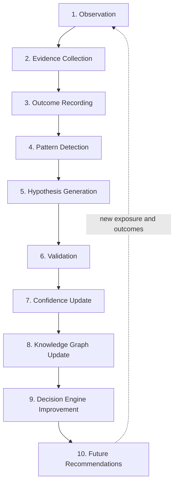
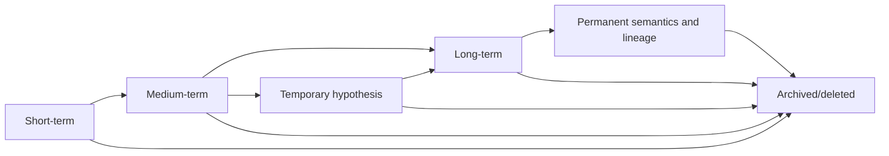
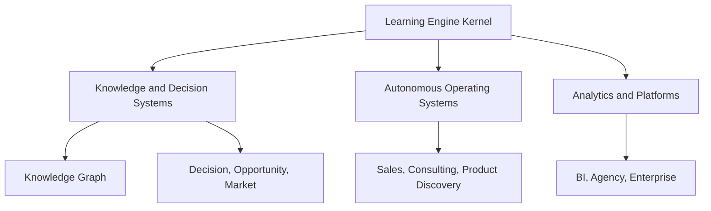

# UBERBOND Learning Engine

> Formal learning architecture — Version 1.0.0  
> Status: Structurally validated baseline; empirical calibration pending  
> Effective date: 2026-07-14  
> Companion specifications: UBERBOND Knowledge Graph v1.0.0 and UBERBOND Decision Engine v1.0.0  
> Scope: Outcome learning, memory, confidence evolution, knowledge evolution, discovery, reflection, human feedback, model contribution, and governed promotion

## Document contract

This is the canonical human-readable learning policy for UBERBOND. It is not application code. It defines what the company may learn, how evidence becomes a candidate change, how that change is validated and approved, and how every historical decision remains explainable after the system evolves.

The terms **MUST**, **MUST NOT**, **SHOULD**, **SHOULD NOT**, and **MAY** are normative:

- **MUST/MUST NOT:** required for a conforming learning process.
- **SHOULD/SHOULD NOT:** expected unless a documented exception is approved.
- **MAY:** optional within an approved policy and learning purpose.

### Compatibility contract

This engine consumes without redefining:

- Knowledge Graph entities `IND-###`, `ARC-##`, `PRB-CCC-###`, `SRV-CCC-###`, `OFR-###`, `OUT-###`, evidence sources `EV-01` through `EV-18`, and their graph relationships;
- Decision Engine artifacts `DEC-YYYY-NNNNNN`, `SCR-CCC`, `EST-CCC`, `GATE-CCC-###`, `REV-YYYY-NNNNNN`, `PRA-YYYY-NNNNNN`, `OUTR-YYYY-NNNNNN`, `PROP-YYYY-NNNNNN`, and `MOD-YYYY-NNNNNN`;
- evidence confidence `EC`, decision confidence `DC`, confidence bands, attribution grades A–E, Human Review levels R0–R4, reason codes, hard gates, and immutable decision lineage;
- the rule that an accepted proposal is commercial evidence, not proof that a diagnosis or intervention was correct;
- the rule that production changes require replay, champion–challenger evaluation, approval, monitoring, expiry, and rollback.

If this specification conflicts with a non-waivable Decision Engine gate, the gate wins. A future major version may change that relationship only through joint governance of both specifications.

### Learning artifacts introduced or specialized here

| Artifact | ID pattern | Purpose |
|---|---|---|
| Learning Event | `LRN-YYYY-NNNNNN` | Immutable normalized occurrence eligible for learning evaluation |
| Learning Event Type | `LET-CCC-NNN` | Versioned semantic definition of an event and its permitted effects |
| Learning Case | `LCS-YYYY-NNNNNN` | Joined evidence, exposure, outcome, context, and attribution for one evaluable unit |
| Hypothesis | `HYP-YYYY-NNNNNN` | Falsifiable proposition with mechanism, scope, alternatives, and validation plan |
| Validation Study | `VAL-YYYY-NNNNNN` | Reproducible test of one or more hypotheses |
| Experiment | `EXP-YYYY-NNNNNN` | Prospective, authorized intervention with allocation, guardrails, and stop rules |
| Memory Item | `MEM-YYYY-NNNNNN` | Governed retained fact, state, hypothesis, or summary with tier and expiry |
| Reflection | `RFL-YYYY-NNNNNN` | Structured post-decision or post-project learning review |
| Knowledge Change Proposal | `KCP-YYYY-NNNNNN` | Candidate node, edge, property, confidence, status, or retirement change |
| Decision Change Proposal | `DCP-YYYY-NNNNNN` | Candidate rule, score, threshold, normalization, or workflow change |
| Calibration Profile | `CAL-CCC-NNN` | Versioned parameters for a defined score, outcome, cohort, and period |
| Learning Release | `LRE-YYYY-NNNNNN` | Approved set of compatible graph, decision, calibration, and model versions |

### Learning state machine

| State | Meaning | Production effect |
|---|---|---|
| OBSERVED | Raw occurrence recorded with provenance | None |
| VALIDATED | Identity, schema, timing, source, and meaning pass | May enter an eligible Learning Case |
| QUARANTINED | Suspected error, poisoning, conflict, or policy issue | None; investigation only |
| INELIGIBLE | Valid occurrence cannot be reused for the proposed learning purpose | None for that purpose |
| HYPOTHESIS | Pattern has a falsifiable candidate explanation | Inspection and validation only |
| TESTING | Approved replay, study, experiment, or shadow evaluation is active | No unapproved production influence |
| SUPPORTED | Validation supports the scoped hypothesis | Candidate change may be proposed |
| REFUTED | Validation contradicts the scoped hypothesis | Candidate is rejected or opposing evidence increases |
| INCONCLUSIVE | Study cannot discriminate among alternatives | Request evidence; no directional production update |
| PROPOSED | Versioned graph, rule, calibration, or model change exists | None |
| APPROVED | Authorized owners accept the candidate and release controls | Eligible for a Learning Release |
| PROMOTED | New version is active for named future decisions | Influences only its approved scope and effective period |
| ROLLED_BACK | Promotion was reversed under rollback policy | Prior approved champion restored; affected decisions reviewed |
| RETIRED | Knowledge remains historical but is no longer active | Excluded from current decisions unless explicitly requested |
| REJECTED | Candidate failed evidence, safety, quality, or value requirements | None; rejection remains auditable |

Transitions are explicit. No aggregate metric, model output, or human preference may skip directly from OBSERVED to PROMOTED.

### Deterministic learning record

Every Learning Event and derived artifact MUST freeze:

- tenant, authorized purpose, reuse scope, data class, jurisdiction, and retention policy;
- event type and semantic version;
- subject entities, assets, markets, people/roles where permitted, and identity confidence;
- `occurred_at`, `observed_at`, `recorded_at`, effective interval, and knowledge interval;
- originating decision, recommendation, offer, price, proposal, outreach, project, subscription, model, and review references;
- exposure or action actually taken, implementation fidelity, deviations, and comparison condition;
- baseline, outcome definition, observation window, censoring, guardrails, and units;
- raw evidence references, provenance, independence cluster, quality, freshness, coverage, and contradictions;
- context profile including industry, archetype, company size, maturity, country, channel, service, problem, and customer status where valid;
- attribution grade, event confidence, learning weight, sample contribution, transportability, and eligibility;
- generated hypotheses, validation results, proposed changes, reviewers, decisions, expiry, and supersession lineage.

Given the same eligible event snapshot, event definitions, context taxonomy, priors, aggregation profile, and learning-policy version, UBERBOND MUST generate the same structured Learning Cases, sufficient statistics, hypotheses eligible for testing, confidence updates, and change candidates. Natural-language summaries may vary; the structured learning result may not.

---

# 1. Core Learning Philosophy

## 1.1 Learning objective

Improve the calibration and expected durable customer value of future UBERBOND decisions while reducing avoidable harm, unsupported certainty, wasted work, and decision regret.

Learning optimizes, in order:

1. preservation of authority, safety, legality, privacy, security, accessibility, fairness, and truth;
2. accuracy and calibration of observations, diagnoses, estimates, rankings, and predictions;
3. realized customer outcomes and guardrail protection;
4. correct service, offer, sequence, price corridor, proposal, outreach, and follow-up selection;
5. lower false-positive, false-negative, abstention, delivery, and measurement error;
6. faster time from reliable evidence to approved improvement;
7. reusable knowledge that transfers safely across comparable contexts;
8. sustainable UBERBOND delivery quality, margin, capacity, and learning economics.

Learning is not maximizing acceptance, revenue, contact volume, automation, or model accuracy in isolation.

## 1.2 What UBERBOND is allowed to learn

Subject to purpose, evidence, privacy, and governance, UBERBOND MAY learn:

- entity-resolution patterns, source reliability, evidence freshness, and detector error modes;
- problem prevalence, indicators, baselines, severity distributions, persistence, and natural history;
- service suitability, prerequisites, contraindications, effort, delivery variance, failure modes, adoption, time to value, and outcome distributions;
- which problem–service–outcome relationships are supported in which contexts;
- opportunity size, half-life, dependency, competition, market attractiveness, and realized-versus-expected value;
- score calibration, normalization, feature usefulness, rank stability, uncertainty, abstention, and review thresholds;
- offer relevance, proposal comprehension, decision friction, procurement patterns, and supported proof;
- price-corridor acceptance, value realization, cost, margin, terms, discount give-get, and package fit without learning exploitative willingness-to-pay proxies;
- recipient-role relevance, channel fit, response timing, respectful cadence, and suppression effectiveness;
- subscription activation, usage, continuing value, renewal, churn, expansion, support, and cost-to-serve patterns;
- market, country, industry, archetype, maturity, company-size, and channel differences supported by valid samples;
- human expertise, review disagreement, correction patterns, process bottlenecks, and where automation should abstain;
- new candidate industries, problems, services, offers, outcomes, pricing structures, strategies, market gaps, and recurring-value mechanisms;
- threats, incidents, near misses, unfair feedback loops, data leakage, manipulation, and controls that prevent recurrence.

The unit of learning is an evidence-qualified proposition in a named context—not an unscoped correlation.

## 1.3 What UBERBOND is never allowed to change automatically

The Learning Engine MUST NOT autonomously change:

- constitutional objectives, lexicographic optimization order, or non-waivable hard gates;
- legal interpretations, consent requirements, data rights, suppression, safety limits, accessibility obligations, or protected-trait policy;
- canonical entity or relationship meaning, severity meaning, outcome direction, or historical facts;
- collection authority, credential scope, external-action permission, budgets, recipients, or approval authority;
- production score meaning, weights, thresholds, confidence formulas, price policy, discount authority, review levels, or action classes;
- production Knowledge Graph nodes, edges, aliases, merges, retirements, or confidence values;
- production models, prompts, tools, training-data scope, feature permissions, or autonomy;
- customer goals, reported preferences, contracts, prices, commitments, or outcome claims;
- raw event history, audit logs, prior explanations, prior versions, incidents, corrections, or reviewer identity;
- cross-tenant reuse rights, retention periods, data-residency rules, or de-identification standards;
- an Unknown, censored, non-response, or missing measurement into a favorable label;
- a correlation into a causal relationship or an OOD pattern into a general rule.

It may create a versioned proposal for these changes. Only the required human owners may approve promotion.

## 1.4 Human approval philosophy

- Human approval is required when a learning candidate changes semantics, production behavior, customer-facing claims, material price logic, regulated processing, safety controls, or autonomous action.
- Review authority follows Decision Engine levels R0–R4; learning impact and irreversibility determine the minimum level.
- Reviewers inspect evidence quality, causal validity, segment coverage, fairness, privacy, security, compatibility, replay results, downside, monitoring, and rollback—not only aggregate lift.
- The proposer and sole approver MUST be different for R4 changes.
- An expert assertion may create a prior or hypothesis. It becomes production knowledge only after evidence and validation appropriate to the claim.
- A manual override does not become a preferred rule merely because a senior person made it. Its eventual outcome and reasoning determine learning value.
- Repeated human disagreement triggers adjudication and rule review; it never silently makes a bypass normal.

## 1.5 Safety philosophy

Learning is safe only when the data, method, use, and resulting action are all safe.

- Learn from negative, neutral, censored, withdrawn, harmed, refunded, churned, do-nothing, and failed cases to avoid survivorship bias.
- Treat sensitive, vulnerable, regulated, or high-impact contexts as separate approval domains.
- Never optimize persuasion against a person’s vulnerability, distress, protected traits, information asymmetry, or inability to exit.
- Prevent feedback loops by distinguishing who was eligible, who was exposed, who was observed, and who produced an outcome.
- Preserve holdouts, exploration budgets, and counterfactual evidence only when ethical and authorized.
- Quarantine suspected poisoning, prompt injection, fraud, synthetic engagement, instrumentation corruption, and identity mismatch.
- A harmful outlier is never discarded merely because it hurts average performance.
- Scale or commercial value never lowers evidence, privacy, fairness, or review requirements.

## 1.6 Confidence philosophy

Learning confidence answers: “How strongly does eligible evidence support this scoped proposition and its transfer to the intended decision context?” It remains separate from effect size, business impact, severity, popularity, and approval.

The engine retains five confidence dimensions:

| Dimension | Question |
|---|---|
| Evidence confidence | Are the underlying observations authentic, independent, fresh, covered, and correctly matched? |
| Outcome confidence | Was the outcome measured with valid definition, window, denominator, and instrumentation? |
| Attribution confidence | How strongly can the observed difference be attributed to the action or condition? |
| Generalization confidence | Does the result transport to the named industry, country, maturity, company, channel, service, and time context? |
| Safety confidence | Is there sufficient evidence that promotion will not create unacceptable guardrail harm? |

The overall confidence for promotion is constrained by the weakest mandatory dimension. More events increase confidence only when they add independent, eligible information. Repeated low-quality observations do not become high-quality knowledge through volume.

## 1.7 Knowledge preservation philosophy

- Learning is append-only. Corrections create superseding facts or relationships; they do not rewrite history.
- Knowledge is bitemporal: the engine records when a fact was true and when UBERBOND knew it.
- Every promoted artifact retains its source snapshot, definition, method, reviewer, release, effective period, and rollback target.
- Raw evidence and personal data follow lawful minimization and deletion. When deletion is required, UBERBOND retains only permitted tombstones, non-identifying aggregates, version lineage, and proof of deletion.
- Retired knowledge remains available for audit and historical replay but is excluded from current decisions by default.
- Conflicting evidence remains represented; a newer or more popular claim does not erase a valid minority context.
- Canonical semantics change only through versioned migration. Aliases preserve backward resolution.
- Long-lived aggregate knowledge must remain reproducible from retained sufficient statistics or approved source snapshots.

---

# 2. Learning Loop

## 2.1 Loop topology

## 2.2 Universal stage contract

Every stage emits:

- stage ID, semantic version, tenant, purpose, actor, and processing authority;
- frozen input references, point-in-time cutoff, cohort definition, and eligibility filter;
- output status, confidence dimensions, missingness, contradictions, and reason codes;
- privacy, security, fairness, safety, review, retention, and aggregation decisions;
- next permitted stages, expiry, reviewer requirement, and replay information.

A stage fails closed when required authority, identity, exposure, outcome definition, provenance, causal validity, or safety evidence is unresolved. Partial analysis may be retained as a hypothesis, but it may not create a stronger production claim.

## 2.3 Stage 1 — Observation

**Purpose:** detect and normalize a potentially learnable occurrence without interpreting it as success, failure, causality, or general truth.

| Required element | Specification |
|---|---|
| Inputs | Decision, evidence, audit, outreach, proposal, project, support, subscription, market, finance, review, model, incident, customer, or system events; event-type registry; entity graph; collection authority |
| Outputs | Immutable OBSERVED `LRN-*`; candidate event type; subject and context links; occurrence and knowledge times; deduplication key; sensitivity and eligibility flags |
| Required evidence | Source identity; event timestamp; entity match; raw artifact or authoritative reference; schema and unit; actor/system; authorization; direct versus inferred label |
| Failure conditions | Duplicate or replayed event; wrong entity; fabricated timestamp; derived label presented as direct; missing authority; ambiguous meaning; untrusted content executed as instruction; corrupted payload |
| Human review triggers | Sensitive personal or regulated event; suspected fraud or poisoning; customer dispute; S5 harm; identity confidence below 80; event type not in the registry |

**Stage gate:** an observation states what occurred or was reported. “No reply,” “churn,” “success,” and “false positive” require their exact governed definitions before they may be recorded.

## 2.4 Stage 2 — Evidence Collection

**Purpose:** collect the minimum authorized evidence needed to establish the event, its context, exposure, denominator, outcome, and alternatives.

| Required element | Specification |
|---|---|
| Inputs | Observed event; event-type evidence requirements; entity/assets; source registry; data classification; purpose and reuse scope; freshness and observation-window policy |
| Outputs | Evidence bundle; collection manifest; coverage matrix; excluded and unavailable sources; source independence clusters; collection confidence; expiry |
| Required evidence | Provenance, method, timestamp, entity/asset match, sampling frame, permission for private sources, and raw reference; independent corroboration for material claims where feasible |
| Failure conditions | Unauthorized collection; excessive data; source terms conflict; material coverage bias; altered target state; sensitive credential/content exposure; source identity unknown; data joined outside approved purpose |
| Human review triggers | Health, financial, employee, minor, credential, communication, vulnerability, or restricted data; intrusive testing; cross-border transfer; bulk copyrighted material; required coverage below 80 |

**Stage gate:** evidence collection follows the declared learning question. The convenience of available data never expands the permitted purpose.

## 2.5 Stage 3 — Outcome Recording

**Purpose:** construct an evaluable Learning Case by joining the action or exposure to the correct baseline, outcome, guardrails, window, denominator, and comparison condition.

| Required element | Specification |
|---|---|
| Inputs | Validated event evidence; originating decision; eligibility and exposure logs; implementation record; baseline; outcome registry; comparison method; customer and market context |
| Outputs | `LCS-*`; exposure status; outcome value/distribution; guardrail values; attribution grade candidate; censoring status; fidelity; confounders; measurement confidence |
| Required evidence | Who or what was eligible and exposed; action timing; dose/scope; valid pre-period or comparator; outcome definition and unit; observation window; denominator; implementation fidelity; material concurrent changes |
| Failure conditions | Proposal acceptance labeled as project success; exposure unknown; outcome window cherry-picked; denominator changed; future information leaks into baseline; implementation never occurred; duplicate outcome; missing censoring treatment |
| Human review triggers | Causal claim; material revenue, safety, compliance, security, health, employment, finance, or reputation outcome; attribution below B for external claim; outcome disputed by customer |

**Stage gate:** a case with no reliable outcome may teach effort, process, or measurement failure, but it cannot teach intervention effectiveness.

## 2.6 Stage 4 — Pattern Detection

**Purpose:** identify reproducible structure across eligible Learning Cases without converting correlation, exposure bias, or data density into a recommendation.

| Required element | Specification |
|---|---|
| Inputs | Point-in-time Learning Case snapshot; event eligibility rules; context hierarchy; independence clusters; existing priors; metric definitions; known interventions and selection policies |
| Outputs | Candidate pattern; affected cohort; support and contradiction sets; effect or association distribution; novelty, stability, heterogeneity, and potential-bias report |
| Required evidence | Named population and denominator; adequate independent entities; time-safe features; exposure propensity or selection context; negative and censored cases; multiple windows or robustness views where appropriate |
| Failure conditions | Target leakage; post-outcome features; Simpson’s paradox ignored; repeated events treated as independent companies; survivorship bias; multiple testing hidden; arbitrary segmentation; data-quality artifact mistaken for behavior |
| Human review triggers | New sensitive segment; unexpected disparity; large effect with sparse sample; pattern contradicts hard policy or established causal evidence; potential manipulation; material harm cluster |

**Stage gate:** pattern detection creates a candidate association with scope and uncertainty. It does not create a causal edge or production rule.

## 2.7 Stage 5 — Hypothesis Generation

**Purpose:** convert a useful pattern, contradiction, anomaly, expert observation, or unmet need into a falsifiable and decision-relevant proposition.

| Required element | Specification |
|---|---|
| Inputs | Candidate pattern; current graph; prior studies; domain theory; customer feedback; counterexamples; alternative explanations; unmet problems and outcomes |
| Outputs | `HYP-*` with proposition, mechanism, scope, expected direction/magnitude, null, alternatives, discriminating evidence, validation plan, guardrails, stop rule, owner, and expiry |
| Required evidence | Traceable pattern or expert evidence; explicit target population; decision that could change; known contradictions; semantic duplicate search; feasible ethical validation path |
| Failure conditions | Unfalsifiable claim; outcome or context undefined; circular explanation; novelty asserted from missing search; protected trait or unlawful proxy proposed; validation would be deceptive, unsafe, or unauthorized |
| Human review triggers | New service, industry, price structure, outreach strategy, autonomous action, causal claim, vulnerable population, regulated domain, or hypothesis that could materially alter customer treatment |

**Stage gate:** a hypothesis must specify what result would support it, refute it, or remain inconclusive.

## 2.8 Stage 6 — Validation

**Purpose:** test the hypothesis using the strongest ethical, feasible, time-safe design proportional to the decision impact.

| Required element | Specification |
|---|---|
| Inputs | Approved hypothesis; analysis plan; data snapshot or experiment; comparison design; outcome and guardrail registry; power/precision target; stop and rollback rules |
| Outputs | `VAL-*`; SUPPORTED, REFUTED, or INCONCLUSIVE result; effect distribution; calibration; subgroup and fairness results; robustness tests; limitations; reproducible evidence package |
| Required evidence | Predeclared question and eligibility; independent evaluation data; exposure and outcome integrity; appropriate control/comparator; missingness and censoring treatment; robustness and negative controls where applicable |
| Failure conditions | Training/evaluation leakage; p-hacking or metric switching; underpowered certainty; unrecorded exclusions; invalid comparator; experiment policy breach; guardrail harm; result cannot be reproduced |
| Human review triggers | Prospective customer experiment; material price or outreach test; safety/fairness difference; high-impact negative result; causal claim; model promotion; unexpected incident; conflict with authoritative evidence |

**Stage gate:** failing to reject a null is not proof of no effect. Inconclusive results remain inconclusive and inform the next evidence request.

## 2.9 Stage 7 — Confidence Update

**Purpose:** update the evidence ledger and scoped confidence deterministically while preserving the prior, contradictions, uncertainty, and context boundaries.

| Required element | Specification |
|---|---|
| Inputs | Validation result; eligible evidence ledger; prior version; attribution grades; event confidence; independence clusters; context similarity; time decay; contradiction and novelty assessments |
| Outputs | Updated posterior or governed sufficient statistics; evidence, outcome, attribution, generalization, and safety confidence; effective sample size; sensitivity; candidate confidence change and reason codes |
| Required evidence | Exact prior; included and excluded events; weight components; result direction and magnitude; independence; sample diversity; decay profile; contextual target; contradiction treatment |
| Failure conditions | Double-counted event; silent prior change; repeated company treated as independent; unknown converted to neutral success; unsupported transport; confidence increased only by volume; failed safety dimension averaged away |
| Human review triggers | Confidence crosses a production or review threshold; large change from one study; reversal of established knowledge; substantial cohort disparity; generalization to a new country/industry; safety confidence below required level |

**Stage gate:** an update changes a candidate belief state. It does not mutate the Knowledge Graph or Decision Engine.

## 2.10 Stage 8 — Knowledge Graph Update

**Purpose:** propose a semantically valid, versioned knowledge change with complete evidence and dependency impact.

| Required element | Specification |
|---|---|
| Inputs | Confidence update; supported/refuted hypothesis; current graph version; ontology rules; duplicate/overlap search; dependency and migration analysis |
| Outputs | `KCP-*`; proposed node, edge, property, alias, confidence, status, scope, effective date, expiry, conflict, supersession, migration, and rollback plan |
| Required evidence | Validation package; semantic definition; provenance; scope and exclusions; edge direction; cardinality; confidence dimensions; affected decisions/products; reviewer requirements |
| Failure conditions | Duplicate entity; ambiguous meaning; dangling relationship; incompatible cardinality; causal edge from association; unbounded scope; missing migration; hidden deletion; evidence reuse not permitted |
| Human review triggers | Canonical node or relationship change; merge/split; retirement; causal or contraindication edge; S4–S5 knowledge; regulated/sensitive semantics; cross-product dependency; confidence threshold change |

**Stage gate:** the output is a proposal. Promotion requires graph stewardship, domain review, validation gates, and a Learning Release.

## 2.11 Stage 9 — Decision Engine Improvement

**Purpose:** translate approved evidence into a candidate decision change without duplicating or bypassing deterministic decision logic.

| Required element | Specification |
|---|---|
| Inputs | Approved or provisionally admitted graph evidence; current Decision Engine; score registry; policy gates; historical replay set; action classes; risk and fairness requirements |
| Outputs | `DCP-*`; candidate normalization, weight, threshold, feature, rule, abstention, explanation, workflow, or model contribution; champion–challenger results; rollout and rollback plan |
| Required evidence | Decision error being corrected; before/after semantics; time-safe replay; calibration; false-positive/false-negative effects; downstream value; fairness, privacy, security, stability, capacity, and explanation results |
| Failure conditions | Candidate optimizes proxy rather than customer value; hard gate becomes score penalty; rule meaning changes silently; affected segments omitted; replay leakage; no fallback; explanation unavailable; model receives final authority |
| Human review triggers | Any production rule/score change; pricing, outreach, review, regulated, safety, or autonomous behavior; material review-volume change; cross-tenant calibration; rollback target absent |

**Stage gate:** candidate improvements begin in offline or shadow status and follow Decision Engine promotion governance.

## 2.12 Stage 10 — Future Recommendations

**Purpose:** apply an approved Learning Release to future, in-scope decisions and measure whether the improvement works safely in production.

| Required element | Specification |
|---|---|
| Inputs | Approved `LRE-*`; effective graph, score, policy, calibration, and model versions; eligible new decision; rollout segment; monitor and rollback policy |
| Outputs | Version-pinned future decision; explanation of learned drivers; champion/challenger assignment where authorized; exposure record; monitoring signals; new observation events |
| Required evidence | Release approval; applicability match; current inputs; version compatibility; action authority; safety and capacity gates; explanation and outcome-measurement plan |
| Failure conditions | Release outside approved scope; stale or incompatible version; context OOD; missing monitor; retroactive rewrite; customer-facing claim exceeds evidence; rollback cannot be executed |
| Human review triggers | Canary anomaly; calibration or fairness breach; customer complaint; harm; major distribution shift; release affects an R3/R4 action; learned rationale cannot be explained |

**Stage gate:** learning affects only decisions created under the new effective version. Historical decisions preserve their original outputs and point to later corrections where relevant.

## 2.13 Failure propagation and recovery

| Condition | Required result |
|---|---|
| Invalid observation | Reject or quarantine; no downstream Learning Case |
| Missing outcome or exposure | Preserve process facts; mark effectiveness ineligible |
| Censored decision window | Retain as censored until closure; do not label failure |
| Evidence conflict | Preserve both sides, reduce confidence, generate discriminating evidence request |
| Validation inconclusive | No directional production update; revise hypothesis or collect evidence |
| Harm or incident | Stop study/release, contain, notify, investigate, and preserve evidence |
| Knowledge proposal rejected | Retain proposal and reasons; current graph remains active |
| Decision challenger underperforms | Reject or roll back; analyze failure by segment and action class |
| Production drift | Restrict scope, fall back, expire affected confidence, and revalidate |
| Required audit write failure | Stop material learning promotion or action; no unaudited continuation |

Recovery creates new events and versions. It never edits the failed record in place.

# 3. Events

## 3.1 Event semantics

An event is an immutable observation about a state transition or outcome. It is not automatically a success, failure, reward, label, causal result, or permission to change production.

The registry below is the initial canonical event vocabulary. New event types are additive minor-version changes unless they alter an existing meaning, in which case a major semantic version and migration are required.

For every registered event:

- **Meaning** is the only permitted semantic interpretation.
- **Stored data** supplements the universal event envelope; it does not replace it.
- **Confidence effect** identifies the beliefs the event may affect and the beliefs it must not affect.
- **Knowledge Graph effect** is an eligible candidate effect, never a direct mutation.
- **Decision Engine effect** is an eligible calibration, rule, or review proposal, never a live rewrite.
- **Future recommendation effect** applies only after validation, approval, and promotion.

## 3.2 Universal event envelope

Every `LRN-*` stores:

1. event type and version;
2. immutable ID, tenant, source, actor/system, and authorized purpose;
3. subject entity IDs and entity-resolution confidence;
4. occurrence, observation, record, effective, and expiry times;
5. originating decision and related artifact IDs;
6. prior state, new state, payload, units, and schema version;
7. eligibility, exposure, implementation fidelity, denominator, baseline, comparator, outcome window, and censoring where applicable;
8. evidence IDs, quality, independence, coverage, freshness, contradictions, and event confidence;
9. industry, archetype, size, maturity, country, channel, problem, service, offer, outcome, and customer-state context where authorized;
10. data classification, consent/authority, reuse scope, residency, retention, de-identification, and deletion state;
11. validation, review, correction, supersession, and incident lineage;
12. permitted learning domains and explicit prohibited inferences.

Event-specific tables use “candidate” to mean eligible for the Learning Loop, not approved for production.

## 3.3 Business, evidence, and audit events

| Event type | Meaning | Stored data | Confidence effect | Knowledge Graph effect | Decision Engine effect | Future recommendation effect |
|---|---|---|---|---|---|---|
| `LET-BIZ-001` Business discovered and classified | A verified company or operating unit entered the intelligence scope with an initial industry/archetype classification | Entity evidence, domains, locations, industry shares, archetypes, revenue model, size, maturity, country, authority, classifier version | Adds evidence to entity and classification confidence; sparse classification remains a prior | Candidate Company node and `CLASSIFIED_AS` edges with scope and confidence | May improve discovery/classification calibration after confirmed outcomes | Use verified classification to select applicable inspections; never infer a problem from industry alone |
| `LET-BIZ-002` Business classification changed | New valid evidence changes an industry, archetype, size, maturity, country, or revenue-model classification | Before/after classification, evidence, effective dates, cause, reviewer, impacted decisions | Decreases prior classification confidence and increases superseding confidence in proportion to evidence | Candidate versioned property/edge supersession; prior classification retained historically | Candidate changes to classifier features, decay, ambiguity, and review rules | Recompute open in-scope recommendations under the approved classification; preserve old decisions |
| `LET-BIZ-003` Entity corrected, split, or merged | A company, asset, location, domain, person-role, or account identity was wrongly resolved or duplicated | Candidate identities, match features, correction type, affected records, authoritative evidence, reviewer | Lowers confidence in implicated entity rule/source; raises corrected identity confidence after validation | Candidate alias, merge, split, or identity-edge correction with migration map | Candidate entity-resolution, deduplication, and recipient-review changes | Freeze affected actions; use corrected entity only after migration and replay |
| `LET-EVD-001` Evidence collected | An authorized source produced an observation relevant to a defined question | Source, method, scope, sample, asset, raw reference, timestamp, collection result, quality and freshness inputs | Updates only the supported claim’s evidence ledger; volume from one origin is not independence | Candidate `EVIDENCED_BY` relationship or observation link | May calibrate source reliability and detector coverage after later truth labels | Improves future evidence requests and confidence when the same source/context remains valid |
| `LET-EVD-002` Evidence collection failed | An authorized collection attempt did not produce valid evidence | Source, requested scope, failure class, attempt count, partial coverage, policy/rate state, next eligible retry | Reduces coverage/completeness, not the underlying problem probability unless absence itself is valid evidence | No factual edge; candidate source availability/freshness metadata | Candidate retry, fallback, abstention, and source-selection calibration | Request alternate evidence or abstain; never interpret inaccessible as healthy |
| `LET-EVD-003` Evidence expired | A volatile observation passed its governed freshness window | Evidence ID, expiry rule, volatility class, dependent claims/decisions, refresh status | Applies explicit time decay or makes the claim Unknown; never changes historical confidence | Candidate edge/property validity-end timestamp; historical edge retained | Candidate refresh cadence and expiry-policy calibration | Block current claims or recommend refresh before material action |
| `LET-EVD-004` Evidence contradicted | Valid evidence supports materially incompatible values or interpretations | Conflicting evidence IDs, independence, timestamps, contexts, possible resolutions, materiality | Reduces scoped confidence and increases uncertainty; does not average incompatible facts silently | Candidate conflict relationship and contextual split; no winner without resolution | Candidate contradiction, review, source-quality, or context-disambiguation rule | Present alternatives, request discriminating evidence, and avoid strong recommendations |
| `LET-AUD-001` Audit completed | An authorized audit reached a terminal status with known coverage, findings, hypotheses, and unknowns | Audit scope, assets, sources, coverage, findings, rejected findings, confidence, reviewer, completion status | Teaches audit process and coverage immediately; finding accuracy only after later confirmation | Candidate links among audit, observations, Problem Occurrences, and evidence | Candidate audit duration, coverage, detector, and review calibration | Prefer evidence plans that achieved reliable coverage; do not reward finding volume |
| `LET-AUD-002` Audit finding confirmed | Independent or authoritative later evidence supports a previously detected Problem Occurrence | Finding and occurrence IDs, confirmation evidence, time lag, severity/scope check, context | Positively reinforces the detector/source for the exact problem and context, weighted by independence | Candidate increase to problem-indicator or source relationship confidence | Candidate precision, threshold, confidence-cap, and inspection-priority update | Raise future inspection/recommendation confidence only in validated comparable contexts |
| `LET-AUD-003` Audit finding disputed | A customer, expert, or source contests a finding without yet resolving truth | Dispute claim, evidence offered, finding, reviewer, response, status, affected action | Creates contradiction and review need; does not automatically lower or raise truth confidence | Candidate dispute/contradiction link; no canonical mutation | Candidate explanation, evidence-request, and review rule if disputes reveal ambiguity | Pause unsupported external use; explain dispute and seek discriminating evidence |
| `LET-AUD-004` False positive confirmed | A finding or opportunity asserted beyond what later valid evidence supports | Original finding, affected decisions/claims, disproof evidence, root-cause class, harm, correction | Negative reinforcement to implicated detector/source/context; severity meaning remains unchanged | Candidate `DISPROVEN` status and superseding evidence; historical occurrence retained | Candidate threshold, feature, source, review, abstention, or incident-control change | Reduce similar unsupported recommendations, increase verification, and correct affected customers |
| `LET-AUD-005` False negative confirmed | A material problem or opportunity existed within scope but the audit/engine failed to detect or prioritize it | Missed occurrence, discoverability at decision time, evidence availability, impact, root cause, delay | Negative reinforcement to coverage/recall for eligible cases; no penalty when evidence was genuinely unavailable | Candidate missed-occurrence link and detector coverage metadata | Candidate evidence requirement, detector, threshold, source, prioritization, or review update | Inspect similar cases more effectively while controlling any false-positive increase |

## 3.4 Opportunity and recommendation events

| Event type | Meaning | Stored data | Confidence effect | Knowledge Graph effect | Decision Engine effect | Future recommendation effect |
|---|---|---|---|---|---|---|
| `LET-OPP-001` Opportunity detected | A validated condition produced a time-bounded, measurable candidate for value creation or protection | Trigger, affected pool, problem, proposed outcome, P10/P50/P90 value, urgency, half-life, evidence and score versions | Adds no outcome confidence; records forecast confidence for later calibration | Candidate Company/Problem/Opportunity/Outcome path | Establishes prediction cohort for Opportunity Score and revenue-impact evaluation | Makes the opportunity eligible for prioritization, not automatic recommendation |
| `LET-OPP-002` Opportunity prioritized | An eligible opportunity ranked above alternatives under a frozen decision context | Candidate set, scores, constraints, rank, sensitivity, tie-break, selected/deferred reasons | No truth update until outcome; records ranking exposure | No canonical change; links decision to ranked opportunity | Provides future ranking-regret and NDCG evaluation population | Future ranking may improve after realized outcomes, including deferred alternatives where observable |
| `LET-OPP-003` Opportunity missed or acted on late | A retrospectively valid opportunity was discoverable in time but absent, deprioritized, or delayed until material value decayed | Discovery deadline, available evidence, decision path, value lost/protected, cause, counterfactual confidence | Lowers recall, urgency, or half-life calibration where discoverability is proven | Candidate relationship/indicator or market-signal gap | Candidate detector, freshness, queue, capacity, urgency, or escalation change | Surface similar expiring opportunities earlier with bounded review |
| `LET-OPP-004` Opportunity expired | A valid opportunity window closed without intervention or further useful action | Expiry basis, action/exposure, current value, cause, owner, whether avoidable | Calibrates half-life and follow-up timing; does not imply rejection or poor lead quality | Candidate validity-end on Opportunity relationship | Candidate expiry, cadence, urgency, and stale-decision rules | Close or monitor; prevent obsolete proposals and outreach |
| `LET-REC-001` Recommendation issued | An approved recommendation was presented to a decision maker or became active for an internal workflow | Exact recommendation, alternatives, explanation, recipient/owner, versions, time, review | Creates exposure for later learning; no correctness change | Links decision, problem, service, offer, and expected outcome snapshot | Establishes denominator for acceptance, delivery, and outcome evaluation | Future effects occur only after acceptance and outcome evidence |
| `LET-REC-002` Recommendation accepted | The authorized customer or owner chose the recommendation or next step | Accepted scope, alternatives, reason, authority, conditions, elapsed time | May reinforce relevance and decision clarity; does not prove diagnosis or effectiveness | Candidate evidence for offer/service eligibility in context, not effectiveness | Candidate Recommendation/Proposal Strength and sequencing calibration | Present similar options more clearly in comparable contexts after validation |
| `LET-REC-003` Recommendation rejected | The authorized decision maker explicitly declined the recommendation | Controlled rejection reason, accepted problem status, alternatives, timing, capacity, price, trust, authority | Updates only reason-relevant beliefs; unknown reasons receive near-zero weight | Candidate contraindication, eligibility, or context evidence when validated | Candidate fit, sequencing, explanation, capacity, or commercial rule—not service effectiveness by default | Avoid or alter similar recommendations only for the validated reason/context |
| `LET-REC-004` Recommendation deferred or held | The recommendation remains potentially valid but timing, dependency, capacity, or approval blocks it | Deferral reason, unblock condition, owner, date, expected decay, follow-up permission | Updates urgency/timing and capacity evidence; not negative fit | Candidate prerequisite, dependency, or temporal relationship | Candidate follow-up timing, hold, and capacity calibration | Reopen only when the named condition changes; do not treat silence as intent |
| `LET-REC-005` Recommendation manually overridden | A human selected a materially different recommendation, rank, or status | Engine output, human alternative, authority, reason, evidence, risk, expiry, eventual outcome plan | Creates challenger evidence; no confidence direction until adjudication/outcome | No immediate graph change; potential contradiction link | Candidate rule review if repeated; eventual outcome compares engine and override | May route similar cases for review before any rule changes |
| `LET-REC-006` Do-nothing selected | The approved decision was to avoid intervention until a defined trigger or expiry | Reasons, rejected actions, expected natural history, monitoring, reopen trigger, review date | Records a valid policy choice; no assumption of zero opportunity | Links decision to no-action counterfactual and monitored outcome | Creates comparison evidence for intervention burden and natural history | Recommend inaction more confidently only when matched outcomes support it |
| `LET-REC-007` Do-nothing outcome observed | The monitored result after an approved do-nothing decision became measurable | Baseline, outcome, external changes, window, avoided effort/cost, harm, trigger status, attribution | Updates natural-history, decay, and intervention-necessity confidence | Candidate persistence, self-correction, or opportunity-decay relationship | Candidate ROI, urgency, prioritization, and do-nothing threshold calibration | Improve when to intervene, monitor, or leave a condition alone |

## 3.5 Outreach and engagement events

| Event type | Meaning | Stored data | Confidence effect | Knowledge Graph effect | Decision Engine effect | Future recommendation effect |
|---|---|---|---|---|---|---|
| `LET-OUTR-001` Outreach approved | A reviewer approved a specific recipient, purpose, message, channel, cadence, and send window | Candidate, reviewer, evidence, permission, suppression check, claim set, window, versions | Records review agreement; no response confidence change | No canonical edge; links approval to company, role, opportunity, and claim evidence | Candidate review-agreement and approval-latency calibration | Similar drafts may need less review only after outcome and safety validation |
| `LET-OUTR-002` Outreach rejected before send | A reviewer rejected or changed a candidate before external contact | Rejection reason, corrected recipient/claim/channel/timing, risk, reviewer | Negative evidence for the implicated generator/resolution/rule; no market-demand effect | Candidate recipient-role, channel, or contraindication evidence if generalizable | Candidate generation, recipient resolution, claim, channel, or review-rule change | Prevent similar unsafe or irrelevant candidates before they reach review |
| `LET-OUTR-003` Outreach sent | An approved message was actually transmitted once to the verified target | Exact content hash, recipient, channel, provider, send time, idempotency, campaign, approval | Creates exposure denominator; no response or relevance inference | Links outreach event to opportunity, offer, recipient role, and evidence snapshot | Enables response, complaint, delivery, and cadence evaluation | Future strategy learns only after the observation window and outcome |
| `LET-OUTR-004` Delivery failed | A message was not delivered according to authoritative channel evidence | Failure class, provider response, address/number, transient/permanent status, retry result | Lowers deliverability confidence, not recipient interest or offer fit | Candidate contact-channel validity update with privacy controls | Candidate contact freshness, channel, retry, and provider calibration | Use verified alternate contact/channel or stop; never label rejection |
| `LET-OUTR-005` Engagement signal observed | A low-commitment interaction such as an open, click, visit, download, or view occurred and passed bot/privacy filters | Signal type, measurement reliability, identity certainty, time, bot/shared-device flags, consent | Weak, decaying evidence of attention only; cannot establish intent alone | Candidate temporal engagement link, normally noncanonical | Small candidate contribution to Buying Intent/Response models only after calibration | May adjust timing modestly; never justify pressure or sensitive personalization |
| `LET-OUTR-006` No reply window closed | No meaningful response was observed by the predeclared, deliverability-qualified deadline | Delivery proof, window, channel, cadence, recipient validity, censoring, subsequent late replies | Negative evidence for response probability only; not automatic rejection, bad lead, or service failure | No canonical relationship change | Candidate response/cadence calibration with censored survival treatment | Reduce or stop follow-up according to value and cadence; never manufacture intent |
| `LET-OUTR-007` Positive reply | A verified recipient expressed relevant interest or requested a legitimate next step | Reply classification, exact text reference, role, requested action, timing, sentiment confidence | Reinforces response relevance and role/channel fit; not purchase or outcome proof | Candidate recipient-role and channel evidence | Candidate Response Probability, Buying Intent, message, and timing calibration | Prefer comparable respectful outreach and requested next steps |
| `LET-OUTR-008` Negative reply | A verified recipient explicitly declined, corrected relevance, or requested no further pursuit without a formal opt-out | Reason code, text reference, scope of decline, timing, recipient role, future permission | Updates reason-specific relevance/timing; does not globally lower lead quality | Candidate contraindication, recipient-role, or timing evidence if repeated and validated | Candidate Response Probability, relevance, cadence, and close-state rule | Stop or defer exactly as requested; avoid extrapolating beyond scope |
| `LET-OUTR-009` Opt-out or consent withdrawal | A verified person or organization revoked permission for a channel or purpose | Identity, scope, channel, time, source, legal basis, propagation confirmation | No predictive confidence effect; this is authoritative permission state | Candidate suppression/consent relationship and effective interval | Hard-block update to suppression and contact eligibility; never a learnable persuasion target | Prevent all prohibited future contact immediately and test propagation |
| `LET-OUTR-010` Outreach complaint | A recipient alleged irrelevance, deception, excess frequency, privacy concern, harm, or other unacceptable contact | Complaint content, channel, campaign, approvals, contact history, severity, resolution | Negative safety/relevance evidence; material events may invalidate a strategy regardless of response lift | Candidate channel/strategy contraindication or incident link | Candidate gate, cadence, claim, review, training, or suspension change | Reduce or stop similar outreach; prioritize remediation over optimization |
| `LET-OUTR-011` Meeting booked | A verified recipient committed to a relevant meeting or equivalent high-intent step | Meeting type, attendees/roles, source outreach, scheduled time, agenda, elapsed time | Reinforces intent and response path; not purchase proof | Candidate buying-center and journey-step evidence | Candidate Buying Intent and sequence calibration | Use the proven next-step format for comparable willing recipients |
| `LET-OUTR-012` Meeting attended and qualified | The relevant stakeholder attended and the need, authority, timing, or constraints were verified | Attendance, roles, qualification evidence, needs, objections, next decision, notes authority | Stronger intent/fit evidence limited to verified facts | Candidate decision-maker, problem, constraint, and buying-process edges | Candidate Lead Quality, Intent, opportunity, and proposal-input calibration | Tailor future recommendations to verified needs rather than inferred personalization |
| `LET-OUTR-013` Meeting cancelled or no-show | A scheduled meeting did not occur or was cancelled under a known/unknown reason | Cancellation source, notice, reason, reschedule, reminder path, attendance history | Updates attendance/timing probability; not automatically negative need or fit | Usually no canonical change; candidate scheduling preference if explicit | Candidate meeting timing, reminder, friction, and follow-up calibration | Offer one proportionate reschedule when relevant; close when value or permission expires |

## 3.6 Proposal, pricing, purchase, and finance events

| Event type | Meaning | Stored data | Confidence effect | Knowledge Graph effect | Decision Engine effect | Future recommendation effect |
|---|---|---|---|---|---|---|
| `LET-PROP-001` Proposal presented | A reviewed proposal reached an authorized buyer with known scope, range/quote, terms, and validity | Proposal version, claim-evidence map, offer/services, price position, recipient roles, delivery proof, expiry | Creates proposal exposure; no acceptance or effectiveness update | Links proposal snapshot to problems, services, offer, outcomes, and buying center | Establishes Proposal Strength and price-response evaluation denominator | Learn only after buyer decision and later delivery outcomes |
| `LET-PROP-002` Proposal accepted | The authorized buyer accepted, signed, or issued an equivalent commitment | Accepted version, authority, scope, price, terms, date, conditions, elapsed time | Reinforces proposal/offer/price-context fit; not diagnosis, delivery, renewal, or outcome proof | Candidate offer and buying-process eligibility evidence | Candidate Proposal Strength, price acceptance, timing, and procurement calibration | Present similarly clear, supported structures in matched contexts after validation |
| `LET-PROP-003` Proposal rejected | The authorized buyer explicitly rejected the proposal or chose no purchase | Controlled reason, accepted problem, scope, price, terms, competitor/internal alternative, authority, time | Updates only identified commercial/relevance dimensions; unknown receives little weight | Candidate offer contraindication or alternative edge only with verification | Candidate proposal, offer, price, trust, timing, or qualification change | Avoid repeating the validated mismatch; do not infer service ineffectiveness |
| `LET-PROP-004` Proposal expired or withdrawn | Proposal validity ended or UBERBOND/customer withdrew before a definitive commercial decision | Expiry/withdrawal reason, last status, exposure, capacity, changed evidence, late decision | Treated as censored or company-withdrawn, not rejection unless explicitly declined | Candidate validity-end and withdrawal relationship | Candidate validity window, capacity, follow-up, and pipeline-state calibration | Close stale proposals and regenerate only from current evidence |
| `LET-PROP-005` Proposal negotiated or materially changed | Scope, sequence, price, terms, responsibilities, service levels, or risk allocation changed during evaluation | Before/after terms, initiator, reasons, affected value/cost/risk, approval, final outcome | Adds evidence on decision friction and acceptable structure; no outcome proof | Candidate offer/package/prerequisite evidence | Candidate proposal clarity, packaging, pricing, and procurement calibration | Start future proposals closer to validated buyer and delivery constraints |
| `LET-PRA-001` Price accepted | The buyer accepted the commercial range or exact approved quote for frozen scope | Price scenario, quote, corridor position, alternatives, terms, scope, decision authority | Reinforces price-context viability, not optimality, fairness, or realized value | Candidate WTP/offer-context evidence with restricted reuse | Candidate price-acceptance and package calibration; cost floor unchanged | Use as one weighted comparable after scope, country, date, and terms matching |
| `LET-PRA-002` Pricing objection | The buyer explicitly states price, affordability, value, budget, or comparison as a barrier | Exact objection category, scope acceptance, value understanding, budget authority, alternative, corridor position | Updates pricing only when objection meaning and authority are credible; not automatic demand failure | Candidate market-comparable, affordability, or offer evidence | Candidate corridor, value explanation, scope, package, or qualification change | Offer valid lower scope/terms or decline; never learn exploitative individual pricing |
| `LET-PRA-003` Commercial-terms objection | Payment schedule, contract, cancellation, liability, SLA, procurement, security, or other terms block progress | Objected term, required alternative, cost/risk consequence, authority, jurisdiction, final result | Updates term/procurement fit, not base service value | Candidate prerequisite or procurement relationship | Candidate terms, enterprise routing, timeline, risk, or review calibration | Anticipate legitimate requirements for matched organizations |
| `LET-PRA-004` Discount requested | A buyer asks for a lower commercial amount without yet changing scope or terms | Requested change, reason, authority, competitor evidence, budget, scope, timing | No confidence change by itself; request volume is not WTP truth | No graph change | Candidate negotiation-path analysis only after final outcome | Do not discount automatically; evaluate governed give-get alternatives |
| `LET-PRA-005` Discount granted | An approved give-get reduced the valid corridor or quote | Undiscounted range, effective reduction, reason, give-get, approvals, floor/margin, expiry, outcome | Teaches discount economics and acceptance only after matched comparison; never resets list anchor silently | Candidate package/term evidence, not service value | Candidate discount-policy, conversion, margin, and CLV calibration | Use only when the same measurable give-get exists and customer treatment remains fair |
| `LET-PRA-006` Pricing correction | Review found a material scope, cost, market, value, currency, tax, or policy error in a price scenario | Original and corrected scenario, root cause, affected quote/customer, approval, remediation | Lowers implicated pricing-input or rule confidence; corrected version gains evidence through review | Candidate source/comparable correction if graph-based | Candidate price-input, QA, review, floor, or error-control change | Require stronger verification for similar quotes and correct open proposals |
| `LET-PUR-001` Customer purchased | Payment, signed order, or equivalent authoritative transaction began the commercial relationship | Order/contract, payer, scope, price, terms, source proposal, start conditions, cancellation rights | Confirms purchase outcome; not project success, satisfaction, or retention | Candidate customer–offer/service transaction relationship | Calibrates proposal-to-purchase and purchase timing | Improve commercial sequencing while retaining outcome and safety separation |
| `LET-PUR-002` Purchase cancelled before delivery | An accepted purchase was rescinded before material service exposure | Cancellation right, reason, refund, work performed, timing, proposal/terms, responsibility | Negative evidence for commitment durability or process; not service effectiveness without exposure | Candidate cancellation and commercial-friction relationship | Candidate terms, onboarding, confirmation, capacity, and purchase-quality calibration | Clarify commitments and prerequisites; avoid treating cancelled orders as wins |
| `LET-FIN-001` Payment delayed or failed | An owed payment missed its due or processing condition | Invoice, amount, currency, terms, failure reason, retries, dispute, resolution, customer context | Updates payment/credit and operational confidence; not service fit or human worth | Candidate payment-risk state with strict access | Candidate payment terms, deposit, capacity, and CLV cost calibration | Use fair risk controls; never infer protected or personal characteristics |
| `LET-FIN-002` Refund or credit issued | UBERBOND returned or credited value because of cancellation, dissatisfaction, error, guarantee, or goodwill | Amount, reason, linked scope/outcome/incident, responsibility, approval, customer resolution | Negative or neutral evidence according to reason; severe quality failures reduce delivery/safety confidence | Candidate service-risk, failure, or resolution evidence | Candidate pricing, QA, expectation, guarantee, review, and support change | Prevent repeated causes and explain risk; do not hide refunds from success metrics |

## 3.7 Delivery, technical, support, and outcome events

| Event type | Meaning | Stored data | Confidence effect | Knowledge Graph effect | Decision Engine effect | Future recommendation effect |
|---|---|---|---|---|---|---|
| `LET-PRJ-001` Project started | The approved intervention entered material delivery with prerequisites and responsibilities acknowledged | Project, decision, services, scope, baseline, start date, owners, prerequisite status, planned effort/outcomes | Confirms exposure initiation; no effectiveness or completion confidence | Links actual project exposure to service/problem/outcome snapshot | Establishes delivery and outcome cohort denominator | Future learning distinguishes accepted-but-never-started from implemented work |
| `LET-PRJ-002` Milestone achieved | A predefined, accepted intermediate deliverable or capability passed its criteria | Milestone, acceptance criteria, evidence, date, effort, defects, dependencies, approver | Reinforces delivery predictability and prerequisite completion; limited outcome evidence | Candidate service-stage and prerequisite evidence | Candidate effort, sequence, timeline, and delivery-risk calibration | Recommend more realistic sequencing and intermediate proof points |
| `LET-PRJ-003` Scope changed | Approved project scope, units, deliverables, responsibilities, or outcomes materially changed | Before/after scope, initiator, reason, value/cost/risk, change approval, schedule, price scenario | Updates scope uncertainty and requirement quality; outcome comparisons use final exposure | Candidate prerequisite, bundle, or complexity evidence | Candidate complexity, proposal clarity, price, contingency, and change-control calibration | Surface likely dependencies and scope ranges earlier |
| `LET-PRJ-004` Project paused | Delivery temporarily stopped because of dependency, capacity, approval, customer, UBERBOND, or external conditions | Pause reason, owner, state, incurred effort, risk, restart condition/date, customer impact | Updates dependency and cycle-time confidence; not failure unless terminal | Candidate blocking dependency or temporal constraint evidence | Candidate capacity, prerequisite, timeline, and escalation calibration | Recommend pause-safe phases and realistic restart conditions |
| `LET-PRJ-005` Project cancelled | Delivery ended before accepted completion | Cancellation reason, exposure/fidelity, work delivered, refund, value realized, responsibility, alternatives | Updates reason-specific delivery/commercial risk; effectiveness only for delivered exposure | Candidate contraindication, dependency, or cancellation evidence | Candidate qualification, scope, sequencing, terms, capacity, or service-risk change | Avoid similar failure conditions; do not label unexposed service ineffective |
| `LET-PRJ-006` Project completed | All governed completion and handoff criteria were accepted or the project closed with explicit exceptions | Completion status, deliverables, acceptance, effort, time, cost, defects, exceptions, handoff, measurement plan | Reinforces completion/effort confidence; customer outcome remains separate | Candidate service-delivery evidence and actual effort properties | Candidate effort, timeline, complexity, QA, and capability calibration | Recommend delivery ranges and prerequisites from matched completed work |
| `LET-PRJ-007` Implementation fidelity assessed | Actual intervention dose, quality, sequence, coverage, and deviations were measured | Planned versus actual components, adoption, exposure, deviations, reason, assessor, evidence | Multiplies outcome learning weight; low fidelity weakens service-effectiveness inference | Candidate implementation-context evidence | Candidate prerequisite, delivery, adoption, and attribution rules | Prefer interventions that can be implemented faithfully in the target context |
| `LET-PRJ-008` Effort, cost, or schedule variance recorded | Actual delivery distribution differed materially from the approved estimate | Planned/P50/P75/P90 and actual role effort, elapsed time, cost, rework, cause, scope-normalized variance | Updates effort/cost forecast confidence and bias by matched context | Candidate service effort and complexity metadata | Candidate cost-floor, complexity, capacity, timeline, and risk calibration | Produce better ranges and recommend discovery where variance remains high |
| `LET-PRJ-009` Technical issue detected | A technical dependency, failure, incompatibility, outage, security concern, or performance problem affected delivery or operation | System, environment, severity, reproduction, root cause status, impact, workaround, resolution, recurrence | Negative reliability evidence scoped to affected technology/service/context | Candidate technical prerequisite, incompatibility, or risk relationship | Candidate implementation complexity, QA, review, fallback, and service suitability | Warn, phase, test, or avoid affected combinations until controlled |
| `LET-PRJ-010` Delivery defect or rework occurred | Delivered work failed acceptance or required avoidable correction | Defect type, severity, escaped stage, cause, affected customer/outcome, effort, resolution, prevention | Lowers delivery-quality confidence and increases expected effort/risk | Candidate service failure-mode or QA relationship | Candidate QA, capability, estimate, review, and automation-threshold change | Include stronger controls and realistic rework allowance for similar delivery |
| `LET-SUP-001` Support request opened | A customer requested assistance, clarification, correction, or service recovery after or during delivery | Category, severity, product/service, channel, customer state, response target, linked defect/outcome | Adds evidence to usability, adoption, reliability, or expectation friction according to category | Candidate problem occurrence or service-support relationship | Candidate onboarding, documentation, service level, complexity, and cost-to-serve calibration | Recommend enablement or support only where recurring need produces value |
| `LET-SUP-002` Support request resolved | The support need reached a verified resolution or documented terminal state | Resolution, time, effort, customer confirmation, root cause, recurrence, workaround, linked changes | Reinforces resolution capability; repeated root causes remain negative product/service evidence | Candidate remediation and support-outcome evidence | Candidate support effort, SLA, knowledge, and prevention calibration | Improve self-service, staffing, service levels, and preventive recommendations |
| `LET-SUP-003` Customer delivery complaint | A customer alleged unmet expectation, quality defect, delay, harm, poor communication, or unfair treatment | Complaint, contract/scope, evidence, severity, responsibility, response, remedy, closure, reviewer | Negative evidence for implicated delivery/expectation dimension; unverified claims remain disputes | Candidate failure, contraindication, or trust relationship after validation | Candidate proposal clarity, QA, capacity, review, support, and incident controls | Correct the customer first; reduce recurrence before optimizing growth |
| `LET-OUTC-001` Outcome exceeded expectation | A predeclared customer outcome surpassed the approved expected range with adequate measurement | Baseline, target, actual, window, exposure, comparator, attribution, guardrails, sustainability | Positively updates effect magnitude and service fit in proportion to attribution; outlier controls apply | Candidate increase to `EXPECTED_TO_PRODUCE` context confidence or new enabling relationship | Candidate Revenue Impact, ROI, service fit, and outcome calibration | Recommend in matched contexts while preserving uncertainty and non-guarantee language |
| `LET-OUTC-002` Outcome met expectation | A predeclared outcome fell within the approved success range without unacceptable guardrail harm | Baseline, success band, actual, window, exposure, attribution, guardrails, customer acceptance | Reinforces calibrated outcome expectation and implementation fit | Candidate support for service–outcome edge and context | Candidate ROI, time-to-value, sequencing, and recommendation calibration | Prefer the intervention for comparable eligible cases |
| `LET-OUTC-003` Outcome partially met | Some target value was realized but the result fell below the success band or varied by segment | Component outcomes, segments, baseline, exposure, attribution, blockers, guardrails | Updates distribution and heterogeneity; neither full success nor full failure | Candidate contextual edge qualifiers and prerequisite evidence | Candidate scope, segmentation, sequence, adoption, and estimate calibration | Recommend narrower targets, prerequisites, or variants where supported |
| `LET-OUTC-004` Outcome missed | A validly measured outcome fell below the approved minimum after material implementation | Baseline, target, actual, exposure/fidelity, attribution, alternatives, causes, guardrails | Negative effect evidence proportional to attribution; separates selection, delivery, adoption, shock, and measurement causes | Candidate lower edge confidence, contraindication, or context qualifier | Candidate service fit, ROI, prerequisite, abstention, or delivery rule | Avoid, redesign, or review similar recommendations based on confirmed failure class |
| `LET-OUTC-005` Guardrail harm or near miss | An intervention produced or nearly produced unacceptable safety, privacy, security, accessibility, fairness, trust, legal, or operational harm | Harm type, severity, exposure, affected parties, cause, detection, containment, remedy, reporting, recurrence | Materially lowers safety confidence; one severe event may trigger suspension independent of average benefit | Candidate contraindication, risk, review, or retired-edge proposal | Candidate hard gate, HRR, action-class suspension, rollback, or incident control | Stop or tightly constrain similar recommendations until independent safety approval |
| `LET-OUTC-006` Success story validated | A customer outcome is sufficiently supported and permissioned for internal learning or external proof | Claims, evidence, attribution, customer approval, permitted audience/channel, expiry, redactions, guardrails | Reinforces outcome and proof confidence only to the approved claim scope | Candidate proof/case relationship and service–outcome support | Candidate Trust and Proposal Strength proof selection | Use precise, permissioned claims; never generalize beyond context or attribution |

## 3.8 Subscription, retention, expansion, and account events

| Event type | Meaning | Stored data | Confidence effect | Knowledge Graph effect | Decision Engine effect | Future recommendation effect |
|---|---|---|---|---|---|---|
| `LET-SUB-001` Subscription activated | Recurring service began after setup and required authority | Contracted recurring scope, setup state, service levels, usage terms, price, start, baseline, outcomes | Confirms recurring exposure; no retention or continuing-value proof | Links customer to recurring offer/service and expected outcome | Establishes subscription cohort and activation timing | Learn only after usage, value, cost, and retention observations |
| `LET-SUB-002` Subscription onboarding completed | The customer reached the defined readiness state for recurring value | Tasks, data/integration, training, acceptance, time, effort, blockers, activation metric | Reinforces onboarding effort and prerequisite confidence | Candidate subscription prerequisite and onboarding evidence | Candidate setup scope, effort, activation, and customer-capability calibration | Recommend realistic setup and hybrid structures for matched customers |
| `LET-SUB-003` Healthy usage and value observed | Usage and recurring outcomes met the declared healthy range | Active users/assets, frequency, features/services, outcome, support, period, seasonality, customer confirmation | Positively reinforces continuing-value and retention hypotheses; usage alone is insufficient | Candidate recurring-value and service-outcome relationship | Candidate Subscription Probability, CLV, renewal, and capacity calibration | Continue or expand only where value, capacity, and satisfaction support it |
| `LET-SUB-004` Underuse or adoption decline | Valid usage or outcome fell below the declared healthy threshold | Usage trend, eligible population, outcome, friction, customer goal/capacity, seasonality, support, outreach permission | Negative adoption/value evidence; does not equal churn until terminal state | Candidate adoption problem and prerequisite evidence | Candidate churn, onboarding, resize, pause, and support rules | Recommend recovery, resizing, or cancellation before expansion |
| `LET-SUB-005` Service level met | A contractual recurring service level was satisfied in a defined period | SLO/SLA, measurement, exceptions, incidents, credits, customer impact, period | Reinforces operational reliability; does not prove customer value alone | Candidate service-reliability evidence | Candidate support reserve, cost, renewal, and delivery-capability calibration | Maintain proven service level without manufacturing unnecessary scope |
| `LET-SUB-006` Service level breached | A contractual service level was missed | Metric, target, actual, duration, cause, affected customers, credit/remedy, recurrence | Lowers reliability and safety confidence according to severity | Candidate failure-mode, risk, or capability relationship | Candidate pricing reserve, capacity, QA, review, and suspension changes | Remediate before renewal or expansion recommendations |
| `LET-SUB-007` Subscription renewed | The authorized customer continued recurring scope for another term | Renewal scope, price, terms, value evidence, usage, outcomes, satisfaction, alternatives, authority | Reinforces retention and continuing-value confidence; reason and realized outcome matter | Candidate recurring suitability evidence | Candidate Subscription Probability, CLV, price, and renewal timing calibration | Recommend renewal in comparable value-producing contexts |
| `LET-SUB-008` Renewal rejected | The customer explicitly declined the next term | Reason, value/usage, price, service quality, budget, strategy, alternative, authority, timing | Negative reason-specific retention evidence; not all cancellations mean service failure | Candidate subscription contraindication or alternative relationship after validation | Candidate churn, price, value reporting, service recovery, and renewal rules | Address validated cause; do not pressure customers without continuing value |
| `LET-SUB-009` Subscription cancelled | Active recurring scope was terminated under contractual terms | Initiator, reason, effective date, usage/value, incidents, price, transition, data return, refund | Updates churn/retention and continuing-value confidence by reason | Candidate end date and cancellation-context evidence | Candidate subscription eligibility, cancellation, CLV, and service-risk calibration | Recommend recurring work less often where the need is not durable |
| `LET-SUB-010` Customer churn confirmed | The governed churn definition and observation window are satisfied | Last value/usage/contact, reason, cohort, tenure, revenue/contribution, alternatives, preventability | Negative retention evidence with censoring and competing-risk treatment | Candidate customer-lifecycle and context evidence | Candidate CLV, churn, onboarding, support, price, and account-fit calibration | Improve early warning and recovery without manipulative retention |
| `LET-SUB-011` Subscription downgraded or resized | The customer reduced recurring scope, tier, volume, or service level | Before/after scope/price/usage, reason, outcome, customer capacity, margin, future condition | Updates right-sizing and willingness/ability to sustain scope; not full churn | Candidate package and volume-fit evidence | Candidate plan, usage-band, price, and renewal calibration | Recommend the smallest sustainable recurring scope |
| `LET-SUB-012` At-risk subscription recovered | A validated churn/underuse condition resolved and healthy value resumed | Risk trigger, intervention, customer consent, time, value/usage recovery, cost, attribution | Supports the specific recovery action proportional to attribution; avoids selection bias | Candidate remediation and retention relationship | Candidate churn intervention, support, ROI, and timing calibration | Use recovery only for matched customers who benefit and permit it |
| `LET-UPS-001` Upsell accepted | An existing customer bought deeper capacity, tier, volume, or scope within the same service family | Baseline value, expansion need, offer, price, timing, capacity, accepted scope | Reinforces expansion fit after baseline value; no proof of expanded outcome | Candidate service-tier or capacity eligibility evidence | Candidate Upsell Probability, sequencing, CLV, and price calibration | Offer expansion after verified value and capacity in matched contexts |
| `LET-UPS-002` Upsell rejected | A customer explicitly declined deeper scope in the same service family | Reason, baseline value, timing, capacity, price, current satisfaction, authority | Updates reason-specific upsell propensity; not renewal or service-effectiveness by default | Candidate tier contraindication or timing evidence | Candidate Upsell Probability, sequence, package, and follow-up rule | Stop, defer, or resize according to validated reason |
| `LET-CRS-001` Cross-sell accepted | An existing customer bought a different service family for a separately validated need | New problem, problem confidence, service family, offer, price, buying center, baseline relationship | Reinforces cross-service fit only when the need is independently valid | Candidate adjacency among problem, service, archetype, and customer context | Candidate Cross-sell Probability, adjacency, CLV, and sequencing calibration | Recommend adjacent services only after separate diagnosis and fit |
| `LET-CRS-002` Cross-sell rejected | A customer declined a different service family | Rejection reason, problem acceptance, current service state, buying center, capacity, price, timing | Updates cross-sell relevance/timing; does not reduce current-service value | Candidate adjacency contraindication or buyer-role evidence | Candidate Cross-sell Probability, qualification, and offer sequence | Avoid leveraging the relationship where independent need is absent |

## 3.9 Customer, human, governance, and model events

| Event type | Meaning | Stored data | Confidence effect | Knowledge Graph effect | Decision Engine effect | Future recommendation effect |
|---|---|---|---|---|---|---|
| `LET-CUS-001` Positive customer feedback | A verified customer reports a favorable experience or result | Exact response reference, prompt, respondent role, timing, service/outcome, solicitation method, permission | Qualitative support weighted by evidence and response bias; not causal proof | Candidate service, experience, or proof evidence when scoped | Candidate satisfaction, support, proposal proof, and qualitative hypothesis input | Preserve strengths but validate before generalizing |
| `LET-CUS-002` Negative customer feedback | A verified customer reports dissatisfaction, confusion, unmet need, or harm | Exact response, prompt/channel, respondent role, service/outcome, severity, requested remedy, resolution | Negative qualitative evidence; material or repeated themes increase review priority | Candidate problem, failure-mode, or contraindication evidence after validation | Candidate service, support, explanation, QA, or incident-control change | Correct the issue and reduce recurrence before selling more |
| `LET-CUS-003` Customer satisfaction measure recorded | A governed satisfaction, effort, trust, or advocacy metric completed its window | Metric version, sampling frame, response rate, score/distribution, segment, nonresponse analysis | Updates experience confidence only with valid sampling; raw promoter volume is insufficient | Candidate outcome measurement and context evidence | Candidate customer-health, service-quality, and renewal calibration | Use alongside behavioral and outcome evidence, never alone |
| `LET-HUM-001` Manual correction | An authorized human corrects a factual field, label, evidence match, outcome, or explanation | Original/corrected value, authority, evidence, reason, affected artifacts, effective time | Lowers implicated source/rule confidence and raises corrected fact confidence after validation | Candidate superseding fact/edge or alias correction | Candidate input validation, UI, detector, explanation, and review change | Future decisions use the corrected version and expose the lineage |
| `LET-HUM-002` Manual override approved | An authorized reviewer intentionally changes a recommendation, price status, outreach status, review level, or action within waivable policy | Engine decision, override, scope, evidence, authority, reason, risk, expiry, outcome plan | No directional learning until outcome; records disagreement and review confidence | No direct graph mutation; possible hypothesis/contradiction link | Creates champion-versus-human challenger case | Route comparable cases for review until evidence determines the better rule |
| `LET-HUM-003` Override request rejected | An approver denies a proposed override because evidence, authority, safety, or policy is insufficient | Requested change, requester, gate, reason, evidence, reviewer, appeal | Reinforces gate/review operation only if later audit confirms correctness | No graph effect unless factual dispute exists | Candidate training, explanation, or workflow improvement; hard gate remains | Clarify requirements and avoid repeated invalid override requests |
| `LET-HUM-004` Expert feedback submitted | A qualified expert provides a proposition, critique, causal mechanism, exception, or domain interpretation | Expert identity/role, domain, conflict disclosure, statement, evidence, scope, confidence, expiry | Creates a weighted prior or hypothesis; never production truth by authority alone | Candidate node/edge/property hypothesis with expert provenance | Candidate rule/feature/review hypothesis | Influence future inspection or validation priority before production use |
| `LET-HUM-005` Reviewer disagreement | Two or more authorized reviewers reach materially different judgments | Decisions, evidence viewed, roles, reasons, policy interpretation, confidence, impact | Lowers decision/review consistency confidence; does not average incompatible judgments | Candidate conflict link or semantic ambiguity evidence | Candidate policy clarification, reviewer calibration, or evidence requirement | Require adjudication for affected cases and explain uncertainty |
| `LET-HUM-006` Review adjudicated | An independent authorized process resolves reviewer disagreement for a scoped case or policy | Competing views, adjudicator, controlling evidence/policy, decision, scope, expiry, appeal | Raises confidence in the scoped resolution; general rule still requires repeated evidence/change approval | Candidate clarification or superseding relationship where factual | Candidate policy/explanation/training proposal | Apply only to equivalent cases within the approved scope |
| `LET-GOV-001` Consent or reuse scope changed | The permitted processing, reuse, sharing, contact, or retention scope changed | Subject/entity, old/new scope, source, authority, effective time, propagation, dependent artifacts | No predictive update; authoritative eligibility state changes | Candidate permission relationship and validity interval | Blocks or narrows learning datasets, contact, model use, and explanations | Exclude prohibited data/actions immediately and recalculate affected artifacts |
| `LET-GOV-002` Data deletion or restriction completed | Required data was deleted, restricted, anonymized, or made unavailable | Request/legal basis, fields/artifacts, execution proof, retained lawful lineage, downstream invalidation | May reduce future confidence/coverage; never recreate deleted data from memory | Candidate tombstone and validity end; no prohibited raw value | Expire or recompute affected models, scores, decisions, and learning sets | Abstain or request new permitted evidence where needed |
| `LET-GOV-003` Policy violation detected | A collection, learning, review, decision, or action breached an approved policy | Policy/gate, actor/system, scope, evidence, affected parties, severity, containment, root cause | Lowers safety/process confidence; may invalidate affected learning regardless of performance | Candidate incident/risk/contraindication relationship | Candidate hardening, suspension, review, access, and monitoring change | Prevent recurrence; do not use unlawfully obtained advantage as learning |
| `LET-GOV-004` Security, privacy, fairness, or safety incident/near miss | Material harm, exposure, unfair treatment, or credible near miss occurred in the learning system | Incident class, affected data/people/tenants, decision/release, timeline, containment, impact, obligations, remediation | Safety confidence falls; severe incidents trigger immediate restriction independent of sample averages | Candidate risk, contraindication, source, or retired relationship | Candidate rollback, hard gate, access, model, review, and action-class suspension | Stop affected recommendations/actions until independent recovery approval |
| `LET-MOD-001` Model contribution outcome observed | A prior admitted model prediction can be compared with its defined label/outcome | Model/version, features snapshot, prediction/interval, decision use, actual label, window, segment | Updates calibration, discrimination, abstention, and utility evidence for that use | No canonical graph change by prediction alone | Candidate model calibration, admission scope, fallback, or retirement | Use models only where current calibration and utility remain valid |
| `LET-MOD-002` Out-of-distribution case detected | Current input materially differs from the model/rule’s validated domain | Distance/novelty features, context, model/profile, threshold, outcome if later known | Reduces generalization confidence; novelty is not negative or positive evidence | Candidate new context/hypothesis after review | Triggers abstention, fallback, review, or new validation cohort | Avoid extrapolation; request evidence or apply deterministic baseline |
| `LET-MOD-003` Model or calibration drift detected | Input, label, performance, calibration, or outcome distribution crossed a governed drift threshold | Drift metric, baseline/current windows, segment, model, data-quality controls, materiality | Lowers current calibration/generalization confidence; historical validity remains | Candidate market/context change hypothesis | Candidate restriction, recalibration, shadow challenge, or rollback | Use safer fallback until revalidation passes |
| `LET-MOD-004` Model–rule disagreement | An admitted model and deterministic rule/champion materially disagree on the same frozen case | Inputs, outputs, explanations, confidence, context, policy, eventual outcome plan | Creates discriminating evidence opportunity; no automatic winner | No direct graph effect | Routes review or shadow comparison; policy rule retains authority | Improve future routing after adjudicated outcomes identify context-specific strength |
| `LET-MOD-005` Model or learning release rolled back | An active contribution or release was restored to a prior champion | Trigger, affected scope, prior/new versions, exposure, failures, actions, replay, approvals | Lowers confidence in failed release and records rollback effectiveness | Candidate retirement/suspension metadata; graph lineage preserved | Restores prior approved behavior and opens correction proposal | Future decisions avoid the failed version until revalidated |

## 3.10 Market, discovery, experiment, and learning-governance events

| Event type | Meaning | Stored data | Confidence effect | Knowledge Graph effect | Decision Engine effect | Future recommendation effect |
|---|---|---|---|---|---|---|
| `LET-MKT-001` Demand or customer-language signal changed | Valid market evidence shows material change in demand, search, purchase, need, objection, or terminology | Source, measure, cohort, geography, period, baseline, magnitude, cause hypothesis, freshness | Updates market-signal confidence with source and seasonality controls | Candidate market signal, term/alias, or demand relationship | Candidate opportunity, content, offer, and market-score calibration | Reprioritize only while the signal is current and applicable |
| `LET-MKT-002` Competitor or substitute changed | A verified competitor/substitute entered, exited, repositioned, repriced, gained capability, or changed availability | Entity, change, source, market, date, comparability, customer evidence | Updates Competition Risk and alternative confidence; public claims remain scoped | Candidate competitor, substitute, capability, price, or market relationship | Candidate competition, offer, market, price, and urgency calibration | Adjust positioning and alternatives without copying unsupported claims |
| `LET-MKT-003` Regulation or policy changed | An authoritative rule, interpretation, enforcement posture, or applicability changed | Authority, citation, jurisdiction, effective date, affected industries/actions/data, specialist review | Supersedes legal-applicability confidence after expert validation; not learned from popularity | Candidate policy node/edge and validity interval | Candidate hard gate, evidence, review, service, and action-class change | Block, require review, or recommend compliance work under approved interpretation |
| `LET-MKT-004` Platform or technology changed | A material external platform, API, algorithm, standard, capability, or deprecation changed | Provider/standard, authoritative source, date, affected services/assets, migration, observed impact | Updates technical applicability and freshness; speculative impacts remain hypotheses | Candidate platform, dependency, prerequisite, or obsolescence relationship | Candidate service, effort, risk, audit, and opportunity rule | Recommend migration, testing, or monitoring when impact is validated |
| `LET-MKT-005` Market price comparable observed | A sufficiently scoped external price/term observation became available | Provider, service/scope, country, currency, date, terms, source, quality, comparability, privacy | Adds market-corridor evidence with similarity weighting; never sets price alone | Candidate comparable-price evidence, normally restricted | Candidate market corridor and pricing-confidence calibration | Use only for matched scope/date/context with cost and value anchors |
| `LET-MKT-006` Market gap observed | Repeated unmet demand, underserved segment, missing capability, or poor alternative is evidenced | Need, affected cohort, alternatives, frequency, value, willingness/capacity, sources, contradictions | Creates opportunity hypothesis confidence; not proof of viable market | Candidate market-gap, problem, segment, or outcome relationship | Candidate market-attractiveness and discovery prioritization | Investigate before creating a service or market recommendation |
| `LET-MKT-007` Industry or country pattern shifted | A previously calibrated context shows a stable material change in outcomes, behavior, costs, or constraints | Context, prior/current periods, measures, source coverage, structural causes, drift tests | Decays old context calibration and raises change hypothesis confidence | Candidate context qualifier, validity end, or new market relationship | Candidate industry/country calibration, freshness, and review update | Use recent valid profiles; preserve historical regime for replay |
| `LET-DSC-001` New industry candidate discovered | Multiple companies exhibit a materially distinct operating and decision pattern not represented by existing industry plus archetypes | Companies, common pattern, semantic gap, archetype map, exclusions, samples, steward | Provisional confidence capped until admission criteria pass | Candidate `IND-*` node, aliases, classification edges, and priors | Candidate industry-specific profile only after validation | Use archetype priors and manual review while provisional |
| `LET-DSC-002` New service candidate discovered | Repeated validated problems remain inadequately addressed by existing atomic services | Problems, companies, unmet outcomes, alternatives, capability, risk, effort, candidate scope | Creates provisional service hypothesis; no effectiveness confidence before pilots | Candidate `SRV-*`, `REMEDIATED_BY`, prerequisites, and outcome edges | Candidate manual recommendation, pilot, effort, and pricing rules | Offer only as approved pilot with explicit uncertainty |
| `LET-DSC-003` New opportunity class discovered | A recurring value mechanism or risk pattern does not fit existing opportunity types | Triggers, value pool, timing, affected contexts, actionability, counterexamples | Creates taxonomy hypothesis; magnitude and prevalence remain uncertain | Candidate Opportunity subtype and relationship paths | Candidate detection/prioritization profile after replay | Investigate and rank under provisional review |
| `LET-DSC-004` New pricing model candidate discovered | Existing one-time, recurring, usage, outcome, or hybrid structures repeatedly misalign value, cost, risk, or customer adoption | Cases, scope, value/cost timing, risk allocation, objections, margin, legal/accounting implications | Creates commercial-structure hypothesis; acceptance is not fairness or value proof | Candidate offer/commercial-form property or relationship | Candidate pricing scenario and manual pilot policy | Test transparent alternatives without fixed-price or exploitative inference |
| `LET-DSC-005` New proposal strategy candidate discovered | A repeated evidence-backed way of structuring scope, proof, alternatives, or decision support may improve buyer comprehension and fit | Proposal variants, contexts, buyer roles, outcomes, objections, claims, accessibility, guardrails | Creates proposal hypothesis; superficial engagement receives little weight | Usually no canonical graph change; possible offer/buyer-process relationship | Candidate Proposal Strength component or template experiment | Use only after claim grounding, accessibility, and matched validation |
| `LET-DSC-006` New outreach strategy candidate discovered | A potentially more relevant, respectful, permitted channel/message/timing pattern is observed | Recipient role, purpose, channel, cadence, content strategy, response, complaint, suppression, context | Creates outreach hypothesis; response lift cannot outweigh complaint or fairness harm | Candidate channel/role/market relationship after validation | Candidate outreach policy experiment under manual approval | Test within strict permission, frequency, and safety budgets |
| `LET-DSC-007` New subscription opportunity discovered | A one-time or ad hoc problem repeatedly returns and continuing service could produce measurable recurring value | Recurrence, state volatility, ongoing outcome, service tasks, cost, customer capacity, exit, alternatives | Creates recurring-value hypothesis; recurring revenue to UBERBOND is not sufficient | Candidate service subscription potential and recurring-outcome relationship | Candidate Subscription Probability, hybrid sequence, and monitoring policy | Recommend only after continuing customer value and T3/T4 evidence |
| `LET-DSC-008` New recurring-revenue opportunity discovered | A repeatable capability, assurance, monitoring, support, data, or usage model may sustain customer value across accounts | Need frequency, outcome persistence, unit economics, operations, retention evidence, risks, market | Creates business-model hypothesis with separate customer-value and UBERBOND-economics confidence | Candidate offer/service commercial-form evidence | Candidate CLV, subscription, pricing, delivery-capacity, and risk profiles | Pilot the smallest recurring scope with fair exit and outcome monitoring |
| `LET-EXP-001` Experiment launched | An authorized prospective validation began under a frozen protocol | Hypothesis, allocation, eligibility, sample plan, intervention, control, metrics, guardrails, consent, stop/rollback | No directional confidence change; records exposure and precommitment | No production graph mutation | Creates experiment cohort; may affect only approved experimental decisions | Future recommendations wait for valid completion unless safety requires stop |
| `LET-EXP-002` Experiment completed or stopped | A prospective study reached sample/window completion or a predeclared stop condition | Assignment, exposure, outcome, guardrails, attrition, protocol deviations, stopping reason, analysis | Updates hypothesis according to valid design; harm stops may dominate efficacy | Candidate evidence package for KCP | Candidate DCP, rejection, or safety change | Promote only after independent validation and approval |
| `LET-LRN-001` Hypothesis supported | A validation study met the predeclared support criterion within scope | Hypothesis, study, effect, interval, robustness, subgroups, limitations, reviewers | Raises scoped hypothesis confidence; does not imply universal truth | Candidate KCP or confidence increase | Candidate DCP or calibration challenger | Influence future decisions only after approved release |
| `LET-LRN-002` Hypothesis refuted | Valid evidence met the refutation criterion or supported a named alternative | Hypothesis, study, result, alternative, scope, limitations, affected candidates | Lowers or reverses scoped hypothesis confidence | Candidate rejection, lower edge confidence, or contrary relationship | Reject or revise affected challenger/rule | Avoid the refuted strategy in scope; preserve evidence and context |
| `LET-LRN-003` Hypothesis inconclusive | Validation could not discriminate among the hypothesis, null, and alternatives | Study, precision, power, missingness, conflicts, next evidence, expiry | May narrow uncertainty bounds but gives no directional reinforcement | No directional graph update; candidate evidence-gap metadata | No directional decision change; may adjust evidence request | Continue current champion and collect discriminating evidence if valuable |
| `LET-LRN-004` Learning candidate promoted | An approved KCP, DCP, CAL, or MOD became active in a named Learning Release | Candidate, champion, approvals, versions, scope, effective date, canary, monitors, rollback | Establishes production evidence baseline; does not prove improvement | Activates approved graph version where applicable | Activates approved decision/calibration/model version | New decisions use it only within scope and generate monitored exposures |
| `LET-LRN-005` Knowledge or rule retired | An active fact, edge, calibration, strategy, or model left current use because of obsolescence, supersession, risk, or poor validity | Retired artifact, reason, evidence, replacement, effective date, affected decisions, archive, reviewer | Sets current applicability to zero while preserving historical confidence context | Adds validity end and `SUPERSEDES`/retirement lineage | Removes current production eligibility and routes fallback | Future recommendations use the approved replacement or abstain |

## 3.11 Event-effect boundaries

The following non-equivalences are mandatory:

- no reply ≠ rejection;
- positive reply ≠ qualified lead;
- meeting booked ≠ purchase;
- proposal accepted ≠ correct diagnosis;
- customer purchased ≠ successful delivery;
- project completed ≠ outcome achieved;
- outcome improved after intervention ≠ causal effect without attribution;
- renewal ≠ optimal value or price;
- cancellation ≠ service failure without a reason and exposure analysis;
- one expert correction ≠ universally correct rule;
- one severe harm event ≠ ignorable outlier;
- model accuracy ≠ decision utility, safety, or permission;
- commercial revenue ≠ customer value;
- event frequency ≠ independent sample size.

## 3.12 Product-specification event crosswalk

| Required example | Canonical event type |
|---|---|
| Audit completed | `LET-AUD-001` |
| Proposal accepted | `LET-PROP-002` |
| Proposal rejected | `LET-PROP-003` |
| No reply | `LET-OUTR-006` |
| Positive reply | `LET-OUTR-007` |
| Negative reply | `LET-OUTR-008` |
| Customer purchased | `LET-PUR-001` |
| Customer churned | `LET-SUB-010` |
| Upsell accepted | `LET-UPS-001` |
| Upsell rejected | `LET-UPS-002` |
| Subscription renewed | `LET-SUB-007` |
| Subscription cancelled | `LET-SUB-009` |
| False positive | `LET-AUD-004` |
| False negative | `LET-AUD-005` |
| Pricing objection | `LET-PRA-002` |
| Technical issue | `LET-PRJ-009` |
| Manual correction | `LET-HUM-001` |
| Customer feedback | `LET-CUS-001`, `LET-CUS-002`, and `LET-CUS-003` |
| Support request | `LET-SUP-001` and `LET-SUP-002` |
| Refund | `LET-FIN-002` |
| Success story | `LET-OUTC-006` |

# 4. Learning Memory

## 4.1 Memory principles

Learning memory is a governed system of record, not an unbounded transcript and not an AI model’s hidden state.

Every Memory Item has:

- a memory tier and permitted purpose;
- subject, context, source, event, and decision lineage;
- fact, hypothesis, aggregate, policy, or historical classification;
- effective time, record time, last validation, next review, and expiry;
- evidence and confidence dimensions;
- data class, tenancy, jurisdiction, residency, access, reuse, and retention policy;
- status, supersession, deletion, and archive lineage;
- retrieval audience and redaction rules.

The most restrictive applicable retention rule wins. Longer analytical usefulness never overrides a deletion right, contract, consent boundary, or legal limit.

## 4.2 Short-term memory

**Purpose:** support active observations, investigations, reviews, experiments, decisions, projects, support cases, and outcome windows without treating incomplete state as lasting knowledge.

**Retention policy:** retain for the active workflow plus the shortest approved operational buffer. The v1 default review window is up to 30 days for ordinary transient state; security, support, project, channel, and regulated policies may require shorter or longer named windows.

**Update rules:**

- append events and superseding state transitions;
- refresh volatile entity, contact, permission, evidence, delivery, and opportunity state;
- join only within the authorized tenant and purpose;
- promote a Learning Case to medium-term memory only after validation and eligibility checks;
- minimize raw prompts, message content, credentials, and personal data.

**Expiration rules:** expire on workflow closure plus policy buffer, evidence expiry, consent withdrawal, identity correction, or purpose completion. Preserve only allowed audit references, aggregates, and tombstones.

**Human review requirements:** R2 or higher for restricted data, identity conflict, external claim dispute, poisoning, security evidence, cross-border transfer, or a request to extend retention.

## 4.3 Medium-term memory

**Purpose:** support open learning cases, project/outcome evaluation, proposal and sales windows, subscription cohorts, seasonal comparisons, calibration studies, and unresolved hypotheses.

**Retention policy:** retain through the longest legitimate measurement, censoring, attribution, and dispute window plus the approved audit buffer. The ordinary v1 planning range is 31 days to 24 months, but event/data policies determine the exact term.

**Update rules:**

- record outcome maturation, censoring, attribution, implementation fidelity, corrections, and reviews;
- maintain point-in-time cohort membership and sufficient statistics;
- replace raw content with structured features or approved summaries when detail is no longer needed;
- prohibit cross-customer pooling unless reuse scope and de-identification pass;
- move supported aggregate knowledge to long-term memory only after validation.

**Expiration rules:** close and minimize when outcome windows, claims, disputes, and validation studies end; expire unresolved hypotheses at their declared date; archive rather than keep operationally active when historical value remains.

**Human review requirements:** R2 for cross-customer aggregation, extension beyond the declared study, use of customer communications, or a confidence update crossing a customer-facing threshold; R3 for sensitive/regulated data or causal external claims.

## 4.4 Long-term memory

**Purpose:** preserve validated patterns, calibrated distributions, service performance, effort/cost history, market regimes, source reliability, model evaluation, and decision-quality evidence across years.

**Retention policy:** retain approved de-identified aggregates, sufficient statistics, validation packages, release records, and necessary pseudonymized case references for the governed business, scientific, contractual, and audit period. Raw personal/customer content is not retained merely because an aggregate is useful.

**Update rules:**

- add new time-stamped cohorts and regime-specific calibration rather than overwriting prior periods;
- apply partial pooling, independence, time decay, and context transport rules;
- retain supporting and contradictory evidence;
- review high-impact knowledge on a scheduled cadence and after drift, incidents, or authoritative change;
- promote only through a Learning Release.

**Expiration rules:** deprecate when validation expires, market regime changes, source comparability breaks, sample support falls below policy, or a superior version is approved. Archive the old version with its effective interval.

**Human review requirements:** R2 for ordinary calibration/profile promotion; R3 for new problem/service/industry relationships, cross-country generalization, pricing or outreach strategy; R4 for safety, policy, regulated, autonomous, or cross-tenant semantic changes.

## 4.5 Permanent knowledge

**Purpose:** retain the minimum knowledge required to preserve canonical semantics, governance, accountability, historical reproducibility, and the integrity of the company’s scientific record.

Permanent knowledge includes:

- approved ontology definitions and semantic versions;
- immutable decision, review, learning-release, correction, incident, and rollback lineage subject to lawful minimization;
- policy and model cards, validation summaries, release decisions, reason-code meanings, and migrations;
- cryptographic/integrity metadata and proof that required deletion or restriction occurred;
- durable non-personal scientific conclusions whose continued validity is periodically reviewed.

**Retention policy:** indefinite only where lawful, necessary, proportionate, and contractually permitted. “Permanent” never means permanent raw personal data, customer secrets, credentials, communications, or unrestricted tenant content.

**Update rules:** never mutate in place. Add a new semantic version, correction, superseding release, or validity interval.

**Expiration rules:** semantic history does not expire, but active applicability can end. Restricted underlying evidence may be deleted while permitted non-identifying lineage remains.

**Human review requirements:** R4 for creation, semantic replacement, exceptional retention, or deletion that could impair audit/reproducibility; privacy/legal approval governs personal-data exceptions.

## 4.6 Temporary hypotheses

**Purpose:** retain falsifiable ideas, anomalies, provisional edges, proposed strategies, and unresolved explanations long enough to validate or refute them without polluting production knowledge.

**Retention policy:** every `HYP-*` has an owner, decision relevance, evidence budget, next test, review date, and expiry. Ordinary hypotheses should expire within one appropriate business/market cycle unless a reviewer approves extension.

**Update rules:** append support, contradiction, alternative explanations, studies, protocol changes, and status. Changing the proposition materially creates a new hypothesis rather than moving the goalposts.

**Expiration rules:** expire when no discriminating test is feasible or valuable, the target decision is obsolete, scope/authority disappears, or the deadline passes. Supported, refuted, and inconclusive hypotheses move to the corresponding historical record.

**Human review requirements:** R1 for low-risk internal hypotheses; R2 for customer-facing research; R3 for price, outreach, sensitive, regulated, or new-service tests; R4 for safety-policy or autonomous-action hypotheses.

## 4.7 Archived knowledge

**Purpose:** preserve retired, superseded, invalidated, historically scoped, or cold knowledge for audit, replay, longitudinal research, and avoidance of repeated mistakes without allowing it to influence current decisions by default.

**Retention policy:** retain according to the originating artifact, data class, contract, jurisdiction, incident, and audit policy. Use cold, access-controlled storage and minimize searchable personal content.

**Update rules:** archive is append-only. Add correction, access, legal-hold, deletion, restore, or migration events. Restoring to active use requires revalidation and a new release.

**Expiration rules:** delete or further aggregate when the lawful retention basis ends. Maintain permitted deletion proof and non-sensitive version lineage.

**Human review requirements:** approval for restoration, bulk access, cross-tenant research, legal hold, exceptional retention, or any re-identification risk.

## 4.8 Memory movement rules

Movement is eligibility-driven, not age-driven alone:

1. Validate provenance, identity, meaning, and permitted purpose.
2. Minimize fields before moving to a longer-lived tier.
3. Reassess whether raw, pseudonymous, aggregate, or semantic form is necessary.
4. Preserve bitemporal validity and source lineage.
5. Apply the destination tier’s access, review, and expiry policy.
6. Record the movement decision and rejected alternatives.

## 4.9 Retrieval and forgetting

- Retrieval is tenant-, purpose-, role-, context-, and time-scoped.
- Current decisions retrieve only active knowledge valid at the decision’s effective time unless a historical replay is requested.
- A model or agent receives the minimum relevant fields and must not infer missing restricted details.
- Retrieval logs the query purpose, fields, versions, and result IDs.
- Forgetting means deletion, irreversible aggregation, restriction, or exclusion from active use according to policy; it is not a model instruction to “ignore” retained raw data.
- Derived artifacts affected by deletion are invalidated, recomputed, or proven sufficiently non-identifying.

---

# 5. Confidence Evolution

## 5.1 Confidence objects and separation

UBERBOND never stores a single unexplained “confidence” value. Every confidence object identifies:

- proposition, target population, context, period, units, and decision use;
- prior and prior source;
- evidence included/excluded and independence clusters;
- event confidence and learning contribution weights;
- support, contradiction, missingness, censoring, outliers, and novelty;
- effective sample size and diversity;
- effect estimate or calibrated probability separately from confidence;
- evidence, outcome, attribution, generalization, and safety dimensions;
- sensitivity, expiry, reviewer, and version.

## 5.2 Event confidence and learning weight

The inherited evidence formula remains authoritative:

`EC = clamp(100 × Q × A × C × F × M − X, 0, 100)`

For a Learning Case, event-level confidence is:

`LEC = clamp(GMᵥ(EC_identity, EC_event, EC_exposure, EC_outcome, EC_context) × D − P, 0, 100)`

Where:

- `GMᵥ` is the weighted geometric mean of mandatory evidence confidences;
- `D` is data/instrumentation integrity from 0.00–1.00;
- `P` is the explicit unresolved conflict, censoring, or applicability penalty from 0–30 points.

If a dimension is not applicable to the event type, the registry omits it before calculation. If a mandatory dimension is missing, the case is ineligible for that learning purpose rather than receiving a neutral value.

The contribution of eligible case `i` is:

`wᵢ = (LECᵢ / 100) × AFᵢ × IFᵢ × INᵢ × CMᵢ × TDᵢ`

| Factor | Meaning |
|---|---|
| `AF` | Attribution factor: A 1.00, B 0.75, C 0.40, D 0.15, E 0.00 |
| `IF` | Implementation fidelity from 0.00–1.00 |
| `IN` | Independence factor after source/company/experiment clustering |
| `CM` | Context match to the target decision from 0.00–1.00 |
| `TD` | Time relevance under the governed decay profile from 0.00–1.00 |

The raw event, all factor values, and unweighted outcome remain visible. Weighting never deletes inconvenient evidence.

## 5.3 Effective sample size

Nominal event count is reported but never used as independent sample size. The weighted effective sample size is:

`N_eff = (Σwᵢ)² / Σ(wᵢ²)`

`N_eff` is additionally capped by the number of independent companies, customers, time blocks, experiments, markets, or source-origin clusters appropriate to the claim. Ten thousand events from one company, one campaign, or one upstream data source cannot create the confidence of ten thousand independent businesses.

When all eligible weights are zero, `N_eff = 0`, the proposition receives no directional update, and the engine returns insufficient evidence rather than dividing by zero.

Publish:

- nominal events;
- unique companies and tenants;
- independent clusters;
- effective sample size;
- concentration by largest tenant/company/source;
- country, industry, maturity, size, channel, and time coverage;
- censored and excluded counts with reasons.

## 5.4 Hypothesis confidence

Each hypothesis retains five 0–100 dimensions:

1. **Evidence sufficiency:** quality, independence, coverage, sample support, and reproducibility.
2. **Outcome validity:** measurement definition, instrumentation, window, denominator, and missingness.
3. **Attribution strength:** causal or directional validity appropriate to the claim.
4. **Generalization strength:** transport to the exact target context and current regime.
5. **Safety strength:** evidence that promotion respects guardrails and does not create unacceptable harm.

`Promotion Confidence = minimum of all mandatory dimensions`

The minimum prevents strong commercial or statistical evidence from averaging away weak safety, attribution, or transport evidence. A separate effect estimate or probability distribution states magnitude.

## 5.5 Proposition-specific update families

The proposition registry selects one approved update family before seeing results:

| Proposition type | Governed update | Required output |
|---|---|---|
| Binary outcome or probability | Hierarchical beta-binomial or calibrated equivalent with weighted sufficient statistics | Posterior mean, interval, calibration, `N_eff`, prior contribution |
| Count or rate | Exposure-adjusted count/rate model with overdispersion and seasonality controls | Rate distribution, denominator, interval, context |
| Continuous outcome, effort, cost, or value | Robust hierarchical distribution that limits undue outlier influence without deleting cases | P10/P50/P90, mean where appropriate, dispersion, tail and outlier report |
| Time to event, renewal, churn, or response | Survival/competing-risk method retaining censoring | Survival/hazard distribution, time window, censoring and competing events |
| Ranking or prioritization | Pairwise/rank evaluation with counterfactual coverage where available | Rank stability, NDCG/regret, confidence, exposure caveat |
| Causal intervention effect | Causal design-specific effect model with attribution grade | Effect distribution, assumptions, diagnostics, transport limits |
| Semantic relationship | Weighted supporting/contradicting evidence ledger plus domain adjudication | Relationship status, confidence dimensions, contexts, provenance |

Changing the update family after observing results creates a new validation study and must disclose the prior analysis.

## 5.6 Evidence accumulation

Evidence increases confidence only when it is:

- eligible for the stated purpose;
- semantically comparable;
- independent or correctly clustered;
- correctly time-ordered;
- measured under a valid outcome/denominator;
- accompanied by negative, neutral, censored, and missing cases;
- within or explicitly transportable to the target context;
- consistent with safety and fairness requirements.

Each update publishes the prior, incremental evidence, posterior, and amount of change attributable to new information. Duplicate or common-origin evidence contributes once.

## 5.7 Positive reinforcement

Positive reinforcement occurs when a predeclared prediction, relationship, or intervention result is supported within its scope.

- Proposal acceptance reinforces commercial fit, not service effectiveness.
- Correct detection reinforces detector precision, not severity.
- Outcome realization reinforces a service–outcome relationship in proportion to attribution and fidelity.
- Renewal reinforces continuing value only when usage/outcome and reason evidence support it.
- A correct abstention may reinforce review/unknown handling when harm or error was avoided.
- Repeated support yields diminishing confidence gains as the posterior becomes established.
- No single ordinary event may move a production threshold or semantic relationship materially by itself.

## 5.8 Negative reinforcement

Negative reinforcement is failure-class specific:

- false positive updates diagnosis/source/threshold confidence;
- false negative updates coverage/recall/evidence planning;
- recommendation rejection updates only the validated rejection reason;
- outcome miss updates selection, delivery, adoption, shock, or measurement logic according to attribution;
- refund updates the responsible commercial, quality, expectation, or incident dimension;
- churn updates retention logic after censoring, exposure, and reason analysis;
- complaint or harm can lower safety confidence and trigger suspension even with a small sample.

Negative evidence never reduces the canonical severity of a problem merely because the detector was wrong.

## 5.9 Contradictory evidence

Contradiction is represented, not averaged away.

1. Verify semantic equivalence, context, units, time, and entity identity.
2. Separate genuine conflict from subgroup, regime, or measurement differences.
3. Retain independent supporting and opposing evidence ledgers.
4. Lower confidence or split the proposition by a prevalidated context only when evidence supports the split.
5. Generate the smallest discriminating study or evidence request.
6. Mark `CONTESTED` when material conflict remains.
7. Require human adjudication before a high-impact semantic or policy change.

A larger volume of lower-quality evidence does not automatically defeat a smaller body of authoritative evidence.

## 5.10 Outlier handling

- Retain every valid outlier and its context.
- First test data error, entity mismatch, duplicated event, instrumentation change, adversarial manipulation, and unit error.
- If valid, report its influence, tail risk, leverage, and whether it represents a new subgroup/regime.
- Robust estimators may limit its effect on the typical-case estimate but may not erase it from safety, incident, or worst-case analysis.
- Harmful outliers are assessed under guardrail severity, not winsorized into acceptability.
- Exceptional success creates a mechanism hypothesis; it does not become the default forecast.

## 5.11 Data quality adjustment

Data quality affects confidence and eligibility, not the underlying outcome value:

| Quality failure | Required treatment |
|---|---|
| Missing provenance or entity match | Ineligible for production learning |
| Partial coverage | Reduce coverage confidence; expose selection bias |
| Stale volatile data | Apply decay or expire |
| Instrumentation change | Split regimes and recalibrate |
| Duplicate/common-origin records | Cluster or deduplicate |
| Label ambiguity | Route review or probabilistic label; never force favorable class |
| Missing outcome not at random | Model/describe missingness; do not drop silently |
| Suspected poisoning or synthetic activity | Quarantine and security review |
| Schema/unit error | Reject until corrected and replayed |

## 5.12 Sample-size adjustment

- Confidence intervals and posterior uncertainty remain wide for small `N_eff` even when point estimates are extreme.
- Sparse segments shrink toward the closest valid parent prior.
- A segment may override its parent only after minimum effective sample, diversity, stability, and safety requirements pass.
- Threshold crossing uses the conservative interval bound, not point estimate alone.
- Repeated looks, multiple hypotheses, and subgroup searches use the predeclared correction/control policy.
- Report practical significance and decision value in addition to statistical evidence.

## 5.13 Industry adjustment

Industry learning uses a hierarchy:

`Global → Archetype → Industry → Industry × maturity/size → company`

- Begin with the closest approved archetype/industry prior.
- Update a local profile through partial pooling proportional to `N_eff`, diversity, and stability.
- Preserve multi-industry companies with revenue/operating-share context.
- Do not create a new industry to explain ordinary variance already captured by archetype, maturity, size, country, or revenue model.
- Industry wealth, prestige, or historical sales exposure is not a permitted proxy for customer value or price.
- Industry-specific safety, regulation, and terminology require domain review.

## 5.14 Country adjustment

Country learning may use validated differences in regulation, language, currency, payment, market structure, platform availability, procurement, cost, channel, support, and observed outcomes.

- Use a hierarchy such as global → region → country → country-context, with partial pooling.
- Compare equivalent scope, period, and customer context.
- Separate legal applicability from learned behavioral patterns.
- Never use nationality, ethnicity, religion, protected traits, vulnerability, or unlawful proxies.
- Do not learn individualized exploitative pricing from perceived wealth.
- Sparse countries inherit broader valid priors and higher review; they do not receive fabricated certainty.

## 5.15 Time decay

For time-sensitive evidence, relevance is:

`TD = 2 ^ (−age / governed half-life)`

Half-life is versioned by knowledge type and context:

- fast-changing platform, price, contact, intent, competitor, and market evidence decays quickly;
- service effort/outcome evidence decays when tooling, delivery method, market, or customer behavior changes;
- stable semantic definitions and historical facts do not decay, but their current applicability is reviewed;
- authoritative regulation uses effective and supersession dates rather than popularity-based decay;
- severe incidents remain in safety history even when operational mitigations reduce current risk.

Decay lowers current applicability, not historical truth. A refresh creates a new observation.

## 5.16 Novelty detection

Novelty is the distance between a new case and the validated support of the current graph, calibration, rule, or model.

The novelty record includes:

- which features/context are new;
- nearest valid cohorts and distance;
- whether novelty comes from missing data, instrumentation, market regime, industry, country, service, or customer state;
- confidence cap, fallback, review level, and evidence request;
- whether a new hypothesis, industry, service, or relationship candidate is warranted.

Novel cases default to broader priors, abstention, or human review. They are not treated as failures or automatically forced into the nearest known category.

## 5.17 Confidence threshold transitions

| Transition | Minimum requirement |
|---|---|
| Exploratory → hypothesis | Valid provenance, named scope, falsifiable claim, no prohibited use |
| Hypothesis → supported candidate | Approved validation meets predeclared criterion and limitations are acceptable |
| Candidate → shadow | Sufficient confidence dimensions, replay, privacy/security/fairness, owner approval |
| Shadow → advisory | Improvement or non-inferiority on decision utility and guardrails; stable explanation |
| Advisory → bounded production | Conservative threshold, segment coverage, rollback, monitoring, R3/R4 approval as applicable |
| Production → expanded scope | Independent evidence in the new scope; no silent transport |
| Any state → restricted/retired | Drift, contradiction, harm, invalid authority, poor calibration, obsolescence, or superior replacement |

Crossing a numeric confidence band is necessary but never sufficient for promotion.

---

# 6. Knowledge Graph Evolution

## 6.1 Evolution principles

- The graph is versioned knowledge, not a mutable bag of model outputs.
- Event occurrences and evidence live separately from canonical definitions.
- Priors guide inspection; observations establish company-specific facts.
- Association, prediction, causation, eligibility, prerequisite, contraindication, and commercial bundling remain distinct relationship types.
- Every change is a `KCP-*` with semantic diff, evidence, confidence, migration, impact, review, effective date, expiry, and rollback.
- No learning process deletes a historical node or edge to improve apparent accuracy.

## 6.2 Node and relationship lifecycle

| Status | Meaning | Current-decision use |
|---|---|---|
| PROVISIONAL | Candidate has defined semantics and early evidence but admission is incomplete | Inspection/pilot with confidence cap and review |
| ACTIVE | Approved and valid for named contexts | Permitted under its version and decision policy |
| CONTESTED | Material unresolved evidence conflict exists | Expose conflict; restrict high-impact use |
| DEPRECATED | Still resolvable but a successor is preferred | No new default use; migration warning |
| RETIRED | No longer valid/current for active decisions | Historical replay only |
| SUPERSEDED | A named version replaces it | Successor used after effective date |
| REJECTED | Candidate failed admission | No active use; evidence and reason retained |

## 6.3 How industries evolve

An industry change may be:

- **property calibration:** size, revenue model, goals, problems, urgency, decision maker, maturity, WTP prior, or recurring opportunities change without changing identity;
- **alias/localization:** a verified term maps to the same industry in a country or market;
- **context profile:** a country, maturity, archetype, or company-size modifier becomes supported;
- **split:** one industry contains two materially different operating/decision systems that create systematic error;
- **merge:** two industries are semantically indistinguishable for intended decisions;
- **new industry:** existing industries plus archetypes cannot represent the operating model;
- **retirement:** the industry is obsolete, absorbed, or no longer decision-useful.

Admission or structural change requires semantic duplicate review, verified company examples, archetype mapping, exclusions, steward, migration, and domain approval. A new industry remains provisional and inherits archetype priors until at least the Decision Engine’s required validation sample and calibration gates pass.

## 6.4 How services evolve

Services evolve through:

- calibrated effort, difficulty, automation, margin, subscription, AI suitability, prerequisites, risks, and outcome evidence;
- new delivery variant under the same atomic scope;
- scope split when one service contains independently purchasable accountable interventions;
- merge when services differ only by naming or delivery tactic;
- new service for a distinct unmet problem–intervention–outcome path;
- contraindication or review requirement after failure/harm evidence;
- deprecation when capability, technology, regulation, economics, or outcome evidence changes;
- retirement when no safe, viable, distinct customer value remains.

Proposal acceptance may calibrate commercial fit. Only delivered, adequately attributed outcomes calibrate `EXPECTED_TO_PRODUCE`. Effort and outcome confidence evolve independently.

## 6.5 How problems evolve

Problems may evolve through:

- clearer definition, aliases, scope, exclusions, evidence requirements, or detection method;
- context-specific prevalence and severity distributions;
- new causal hypotheses or alternative explanations;
- split when one definition combines materially different conditions/remediations;
- merge when records are semantic duplicates;
- new problem when a distinct harmful or opportunity-limiting condition is repeatedly evidenced;
- deprecation when measurement or terminology is obsolete;
- retirement when the condition no longer exists or is subsumed.

Detector accuracy changes do not change canonical severity. Industry prevalence changes do not create a company-specific `HAS_PROBLEM` edge without current evidence.

## 6.6 How relationships evolve

Every relationship stores type, direction, source/target versions, scope, confidence dimensions, evidence ledger, effective interval, status, and provenance.

| Relationship evolution | Minimum evidence |
|---|---|
| Add inspection prior such as `SUSCEPTIBLE_TO` | Repeated valid prevalence evidence with context and no company-level assertion |
| Add observed `HAS_PROBLEM` | Company/asset-specific evidence meeting the canonical problem rule |
| Add `REMEDIATED_BY` | Defined intervention mechanism, prerequisites, and at least directional outcome evidence |
| Strengthen `EXPECTED_TO_PRODUCE` | Delivered outcomes with attribution, fidelity, context coverage, and guardrails |
| Add prerequisite/dependency | Repeated delivery or outcome failure when prerequisite is absent, or authoritative mechanism |
| Add contraindication/conflict | Valid harm, failure, incompatibility, or policy evidence proportional to severity |
| Add bundle eligibility | Atomic service stability plus buyer/delivery evidence; bundling does not prove effectiveness |
| Add country/industry qualifier | Sufficient local evidence and transport analysis |
| Retire edge | Obsolescence, supersession, refutation, unacceptable risk, or no current applicability |

## 6.7 Confidence propagation

Confidence propagates only through registered decision paths and never creates evidence recursively.

For a path, the engine reports:

- each node/edge confidence and context applicability;
- the weighted geometric mean for substitutable evidence;
- the minimum confidence of mandatory prerequisite or identity links;
- common-origin clusters counted once;
- contradiction and novelty penalties;
- final path confidence and the weakest link.

Rules:

1. A high-confidence industry prior cannot raise a low-confidence company finding above its direct evidence.
2. A high-confidence Problem Occurrence cannot raise a weak service–outcome edge.
3. Multiple paths sharing one source do not create artificial corroboration.
4. Cycles do not feed their own derived confidence back as new evidence.
5. Negative/contraindication paths are retained and evaluated before commercial rank.
6. Downstream confidence cannot exceed the lowest mandatory upstream confidence unless new independent evidence directly supports the downstream proposition.

## 6.8 Retiring obsolete knowledge

Retirement triggers include:

- authoritative replacement or legal/policy supersession;
- platform, technology, market, terminology, or operating-model obsolescence;
- repeated refutation or unacceptable calibration;
- service capability withdrawn or risk no longer controllable;
- relationship no longer transports to any supported current context;
- duplicate consolidation;
- evidence source permanently unavailable with no support remaining.

Retirement process:

1. identify active dependencies and affected decisions;
2. freeze new use where risk requires;
3. propose successor, fallback, or abstention;
4. replay open decisions;
5. approve validity-end and migration;
6. preserve IDs, aliases, evidence, reasons, and historical resolution;
7. monitor residual references.

## 6.9 Conflicting knowledge

When graph propositions conflict:

- confirm that subject, predicate, object, context, time, and units truly overlap;
- represent contextual qualifiers or time regimes when evidence supports them;
- retain both propositions and evidence in `CONTESTED` state when unresolved;
- prevent a model-generated summary from choosing the winner;
- prefer authoritative evidence only for domains where authority is legitimately controlling;
- use discriminating validation for empirical conflict;
- require domain and knowledge-steward adjudication for semantic conflict;
- expose the conflict and conservative consequence in downstream explanations.

## 6.10 Graph release and compatibility

A Knowledge Change Proposal passes only when:

- semantic lint and duplicate/overlap review pass;
- all references resolve and cardinality is valid;
- evidence and confidence are sufficient for status;
- affected Decision Engine paths and products are enumerated;
- historical IDs and aliases remain resolvable;
- migration and rollback are tested;
- privacy, security, fairness, legal, and domain reviews pass;
- historical replays retain their pinned graph version;
- release notes identify added, changed, deprecated, retired, and contested knowledge.

---

# 7. Discovery Engine

## 7.1 Discovery objective

Discover evidence-backed ways to create or protect customer value that the current Knowledge Graph and Decision Engine do not represent adequately, while minimizing duplicate concepts, speculative expansion, customer experimentation risk, and commercial bias.

Discovery produces hypotheses and controlled pilots. It never creates a production service, industry, price model, outreach policy, or subscription merely because a pattern appears profitable.

## 7.2 Discovery inputs

Discovery may consume:

- validated unmet Problem Occurrences and rejected service candidates;
- false positives, false negatives, abstentions, do-nothing outcomes, and human overrides;
- project failures, scope changes, technical issues, support themes, and guardrail events;
- outcome overperformance and heterogeneous response;
- proposal objections, lost alternatives, price-corridor failures, and procurement friction;
- churn, underuse, renewal, expansion, and recurring support/monitoring demand;
- market demand, customer language, competitor, platform, regulation, country, and price signals;
- graph conflicts, low-confidence paths, disconnected nodes, duplicate candidates, and stale knowledge;
- expert feedback and permissioned customer research;
- model novelty/OOD clusters used only as inspection signals.

## 7.3 Candidate-generation rules

1. Define the unmet customer outcome or decision error before naming a solution.
2. Identify the smallest semantic gap in existing nodes, edges, profiles, offers, and rules.
3. Search aliases, variants, archived knowledge, rejected candidates, and adjacent industries before claiming novelty.
4. Require multiple independent cases unless one S5/regulated case justifies a safety capability.
5. State the mechanism, target context, counterexamples, viable alternatives, and do-nothing case.
6. Separate customer value, UBERBOND economics, feasibility, and learning value.
7. Specify an ethical validation path, guardrails, cost, owner, expiry, and kill criteria.
8. Reject candidates whose only advantage is manipulation, lock-in, surveillance, obfuscation, deceptive urgency, protected-trait targeting, or hidden transfer of risk.

## 7.4 Discovery prioritization

Eligible candidates receive an internal Discovery Priority Index:

| Component | Initial weight | Meaning |
|---|---:|---|
| Conservative potential customer value | 25% | Plausible value or harm reduction if the hypothesis is correct |
| Evidence of unmet need | 20% | Independent frequency, severity, persistence, and current alternative failure |
| Decision/knowledge gap | 15% | Degree to which existing graph/rules systematically fail to represent the need |
| Validation feasibility | 15% | Ability to test ethically, affordably, and within a useful window |
| Strategic capability adjacency | 10% | Reuse of legitimate UBERBOND knowledge, delivery, data, or relationships |
| Reversibility and downside containment | 10% | Ability to pilot without unacceptable harm or lock-in |
| Reusable learning value | 5% | Expected value of reducing uncertainty across future comparable decisions |

Hard authority, safety, privacy, fairness, capability, and policy gates are evaluated first. The index ranks validation work only; after validation, commercial opportunities use the Decision Engine’s Opportunity Score.

## 7.5 Discovering new services

**Signals:** repeated high-confidence problems lack an adequate `REMEDIATED_BY` path; existing services require recurring out-of-scope work; customers use ineffective substitutes; delivery teams repeatedly assemble the same distinct intervention; one material safety/regulated need requires accountable capability.

**Candidate definition:** atomic problem, intervention, deliverable, non-scope, prerequisites, contraindications, owner, difficulty, effort distribution, automation, AI suitability, QA, security, review, expected outcomes, guardrails, and commercial form.

**Validation:** semantic duplicate review; mechanism evidence; capability and risk assessment; at least the Decision Engine’s required controlled pilots with baseline, fidelity, outcome, guardrails, cost, customer feedback, and attribution.

**Admission:** PROVISIONAL with manual recommendation/pricing; ACTIVE only after delivery quality, outcome evidence, sustainable economics, documentation, review, and rollback/exit controls pass.

**Rejection:** renamed bundle, tactic without accountable outcome, unmeasurable promise, unavailable capability, unacceptable risk, no distinct need, or lower-scope existing service is sufficient.

## 7.6 Discovering new industries

**Signals:** verified companies repeatedly produce semantic or decision error when represented by existing industries plus archetypes, maturity, size, country, and revenue-model modifiers.

**Candidate definition:** operating model, inclusion/exclusion, aliases, archetypes, company size, revenue model, website goals, problem priors, buying urgency, decision maker, maturity, WTP prior, recurring opportunities, jurisdictions, and differentiating decision paths.

**Validation:** at least three distinct verified companies to create a candidate; duplicate/overlap and multi-industry review; domain steward; at least 30 distinct companies before local calibration may replace archetype priors.

**Admission:** PROVISIONAL classification with confidence cap and manual customer-facing review until validation and migration pass.

**Rejection:** marketing label, geography-only label, company-size-only distinction, duplicate of an industry/alias, or difference already explained by existing modifiers.

## 7.7 Discovering new opportunities

**Signals:** repeated time-bounded value patterns are missed by existing remediation, growth, retention, pricing, market, partner, reputation, compliance, security, or operational opportunity types.

**Candidate definition:** trigger, affected value pool, mechanism, beneficiary, time window/half-life, actionability, intervention path, counterfactual, dependencies, risks, evidence, and outcome.

**Validation:** historical replay with point-in-time discoverability; false-positive and missed-opportunity cost; prospective shadow detection; capacity and expiry analysis; customer-value verification.

**Admission:** add an Opportunity subtype or detector only when it improves recall/value without unacceptable false positives, surveillance, or review burden.

**Rejection:** untimed generic advice, UBERBOND revenue without customer value, non-actionable trend, duplicate affected pool, or opportunity visible only with future information.

## 7.8 Discovering new pricing models

**Signals:** cost, value, risk, adoption, utilization, or customer cash-flow timing repeatedly fails to align under existing one-time, subscription, usage, milestone, or hybrid structures.

**Candidate definition:** scope unit, cost/value timing, risk allocation, setup, recurring/usage components, floor, margin, measurement, cancellation, overage, renewal, customer responsibilities, and fairness implications.

**Validation:** finance/legal/accounting review; matched scenario analysis; customer comprehension; delivery economics; price-corridor viability; adverse selection; churn and value; transparent controlled pilot.

**Admission:** manual pricing and proposal approval until adequate matched outcomes, realized margin, customer value, complaints, and exit behavior support a governed policy.

**Rejection:** fixed universal price, hidden fee, dark pattern, exploitative individual pricing, artificial lock-in, risk shifted unfairly, unmeasurable outcome fee, or margin below floor.

## 7.9 Discovering new proposal strategies

**Signals:** repeated buyer confusion, unsupported proof, objection, delayed decision, scope change, or successful comprehension pattern suggests a better way to present the same governed decision.

**Candidate definition:** target buyer role/context, information order, scope representation, evidence/proof, alternatives, risk, price explanation, decision support, accessibility, and expected comprehension/decision outcome.

**Validation:** 100% claim grounding; accessibility and plain-language review; matched or randomized comparison where ethical; acceptance, comprehension, later scope change, complaint, and outcome—not opens or aesthetics alone.

**Admission:** template/strategy version with manual proposal approval until Proposal Strength, buyer comprehension, and downstream integrity improve without pressure or omission.

**Rejection:** deceptive anchoring, false scarcity, hidden alternatives, unsupported personalization, omission of material limits, or acceptance lift with worse complaints/outcomes.

## 7.10 Discovering new outreach strategies

**Signals:** validated role, channel, timing, language, or next-step patterns may improve relevant responses while respecting permission and reducing complaints or wasted contact.

**Candidate definition:** authorized purpose, eligible company, verified role, channel, message strategy, evidence claims, timing, cadence, stop conditions, suppression, expected response, and safety metrics.

**Validation:** privacy/legal/channel review; manual approval; small canary; deliverability, meaningful response, qualification, complaint, opt-out, fairness, frequency, and downstream customer value.

**Admission:** remains manually approved in v1; any future bounded autonomy requires action-class certification, conservative confidence, per-segment guardrails, idempotency, monitoring, and kill switch.

**Rejection:** scraped ambiguity, sensitive inference, volume-first optimization, engagement bait, harassment, evasion of suppression, deceptive personalization, or response gain that worsens complaints/fit.

## 7.11 Discovering new subscription opportunities

**Signals:** a customer state changes frequently; outcomes decay without monitoring/operation; incidents require readiness; repeated optimization produces value; customers repeatedly request support; annual/ad hoc work creates avoidable gaps.

**Candidate definition:** continuing customer outcome, state volatility, recurring tasks, cadence, service levels, usage, setup, customer responsibilities, monitoring, price logic, cancellation, transition, and completion condition.

**Validation:** recurrence and T3/T4 evidence; longitudinal outcome; customer capacity; cost-to-serve; activation, utilization, support, renewal, churn, and fair exit; comparison with periodic one-time review.

**Admission:** recommend only when `SCR-SUB`, continuing value, maturity, and commercial viability pass; use hybrid when foundation work is necessary.

**Rejection:** activity without continuing outcome, stable completed state, recurrence created by poor implementation, lock-in, hidden one-time work, or UBERBOND recurring revenue as sole rationale.

## 7.12 Discovering market gaps

**Signals:** repeated underserved problem, poor alternatives, unresolved complaints, demand/search mismatch, inaccessible offering, country/industry exclusion, capability scarcity, or price/value mismatch.

**Candidate definition:** affected population, unmet job/outcome, alternatives, frequency, magnitude, ability/willingness to adopt, reachability, regulation, competition, serviceability, and time horizon.

**Validation:** independent demand and customer evidence; alternatives and substitution; bottom-up addressable cohort; willingness/capacity without exploitative inference; competitive response; unit economics; pilot or partner evidence.

**Admission:** Market Attractiveness and Opportunity evaluation after evidence; never from market-size headlines alone.

**Rejection:** unreachable population, non-actionable need, prohibitive harm/regulation, weak value, unavailable capability, or gap explained by intentionally low demand.

## 7.13 Discovering new recurring-revenue opportunities

**Signals:** multiple customers obtain durable value from the same ongoing monitoring, assurance, optimization, support, data, workflow, response, or capability layer.

**Candidate definition:** beneficiary, recurring outcome, delivery unit, frequency/usage, setup, operating model, cost, margin, retention mechanism, risks, data rights, service levels, exit, and alternatives.

**Validation:** cohort-level continuing value, unit economics, delivery scalability, reliability, support load, churn, concentration, customer agency, security/privacy, and non-recurring substitute.

**Admission:** service and offer remain atomic and transparent; expansion follows customer value, not revenue smoothing.

**Rejection:** revenue recurrence without outcome recurrence, rent-seeking, avoidable manual dependency, forced bundling, exploitative switching cost, or unbounded service liability.

## 7.14 Discovery portfolio governance

The discovery portfolio reports:

- candidates by status, source, problem/outcome, context, owner, and age;
- customer-value potential and evidence—not projected UBERBOND revenue alone;
- exploration budget, customer exposure, risk, and review level;
- duplicate and archived-candidate checks;
- hypotheses supported, refuted, inconclusive, expired, and abandoned;
- time to discriminating evidence;
- discoveries promoted and their later realized value/harm;
- neglected industries, countries, customer types, and problems to detect exposure bias.

No team is rewarded for candidate count. A well-supported rejection is valuable learning.

---

# 8. Reflection Engine

## 8.1 Reflection triggers

Every project that starts and reaches a terminal state—completed, cancelled, failed, or otherwise closed—MUST create a Reflection. Reflections also trigger after:

- S4–S5 finding, false positive, false negative, guardrail harm, incident, refund, or material complaint;
- large effort/cost/schedule variance;
- recommendation override with observed outcome;
- outcome materially above or below range;
- subscription churn, unusual renewal/expansion, or recurring value failure;
- learning release rollback or major reviewer disagreement;
- approved do-nothing decision reaching its review window.

## 8.2 Reflection timing

| Reflection | Timing | Purpose |
|---|---|---|
| Operational reflection | At milestone/closure | Capture facts, deviations, defects, effort, immediate correction, and missing measurement |
| Outcome reflection | At predeclared outcome window | Compare actual outcomes, guardrails, attribution, and value with the decision forecast |
| Durability reflection | At renewal, retention, or long-term review | Test persistence, maintenance burden, unintended effects, and recurring value |
| Incident reflection | After containment and again after remediation verification | Identify system cause, affected knowledge/decisions, controls, and recurrence evidence |

## 8.3 Reflection record

Every `RFL-*` contains:

- linked decision, evidence, recommendation, offer, price, proposal, project, service, outcome, event, model, and review versions;
- expected versus actual scope, effort, time, cost, price, margin, adoption, outcome, and guardrails;
- facts known at decision time versus facts learned later;
- implementation fidelity and responsibility boundaries;
- customer, delivery, commercial, market, measurement, and external-shock perspectives;
- success, failure, surprise, near miss, contradiction, and unknowns;
- alternative explanations and counterfactuals;
- corrections, hypotheses, knowledge gaps, candidate KCP/DCP, and no-change decisions;
- owner, participants, dissent, evidence confidence, review, due dates, and closure criteria.

## 8.4 Core reflection questions

### Objective and context

1. What customer outcome and guardrails were we trying to affect?
2. Did the customer’s goal, capacity, environment, or constraints change?
3. Which facts were known at decision time, and which are hindsight?
4. Was the company, asset, recipient, industry, country, maturity, and buying context classified correctly?

### Evidence and diagnosis

5. Did the detected problem exist at the stated scope and severity?
6. Which evidence was decisive, weak, stale, duplicated, contradictory, or missing?
7. Did any source, benchmark, detector, reviewer, or model create bias or error?
8. Was there a false positive, false negative, or avoidable abstention?
9. What discriminating evidence would have changed the original decision?

### Opportunity and prioritization

10. Was the affected value pool correctly scoped?
11. Were impact, urgency, half-life, dependencies, and do-nothing consequences calibrated?
12. Did prioritization choose the right problem first?
13. What higher-value work was delayed or displaced?
14. Did the recommendation arrive early enough to preserve value?

### Recommendation and service

15. Was the selected service the smallest sufficient intervention?
16. Were prerequisites, contraindications, sequence, customer capacity, and delivery capability correct?
17. Which recommendation was incorrect, unnecessary, incomplete, or exceeded expectations?
18. Did a rejected alternative perform better or deserve further study?
19. Could a distinct new service, variant, prerequisite, or contraindication exist?

### Delivery and adoption

20. Was implementation faithful to the recommendation?
21. What scope, technical, staffing, approval, customer, or vendor issues changed delivery?
22. Were effort, cost, time, rework, support, and quality ranges calibrated?
23. Could the customer adopt and sustain the result?
24. What delivery knowledge should become documentation, QA, automation, or a capability limit?

### Outcomes and causality

25. Did the named outcome improve, remain unchanged, or worsen?
26. What happened to every guardrail and affected subgroup?
27. How strong is attribution, and what alternative explanations remain?
28. Was the observation window long enough, and is the effect durable?
29. Which result exceeded expectations and why might it be an outlier?
30. What did the do-nothing or alternative counterfactual likely produce?

### Pricing and commercial structure

31. Did the price scenario reflect actual scope, effort, risk, market, and customer value?
32. Were cost floor, margin, currency, terms, discount give-get, and change control accurate?
33. Did price or terms create avoidable friction, unfairness, or delivery risk?
34. Could a different package, milestone, usage, subscription, or one-time structure improve alignment?
35. Did realized customer value and realized UBERBOND economics both remain viable?

### Proposal and outreach

36. Did the proposal explain evidence, alternatives, uncertainty, scope, price, and responsibilities accurately?
37. Which claims or proof helped understanding, and were they properly supported?
38. Was the correct decision maker engaged through a permitted, relevant channel?
39. Could message, timing, cadence, next step, or follow-up improve without increasing pressure or privacy risk?
40. Were no reply, rejection, objection, and delay classified correctly?

### Safety, trust, and governance

41. Did any person, customer, tenant, system, or third party experience harm or unfair treatment?
42. Did review, override, permission, suppression, data minimization, access, logging, and rollback work?
43. What near miss or weak control deserves action before another event occurs?
44. Would we be comfortable explaining the full decision and learning process to the customer and an auditor?

### Learning and discovery

45. What should become a correction, hypothesis, validation study, KCP, DCP, training update, or no-change decision?
46. Which learning is company-specific, and which may transport to a broader cohort?
47. What evidence would refute the proposed lesson?
48. Is there a new industry, problem, service, opportunity, pricing model, proposal strategy, outreach strategy, subscription, or market gap?
49. What should expire, be contested, deprecated, retired, or restored?
50. Who owns validation, by when, with what success, safety, and stop criteria?

## 8.5 Reflection classification

Every lesson is assigned exactly one primary class:

| Class | Meaning | Eligible next action |
|---|---|---|
| Confirmed operating fact | Directly measured effort, time, cost, defect, or state | Update eligible operational distribution after quality checks |
| Outcome evidence | Customer outcome with exposure and measurement | Enter attribution and confidence update |
| Correction | Prior fact, entity, label, or explanation was wrong | Supersede, replay, and remediate |
| Hypothesis | Plausible but unvalidated explanation or opportunity | Create `HYP-*` and validation plan |
| Incident/control gap | Harm, near miss, policy, security, privacy, fairness, or safety failure | Contain, investigate, and propose controls |
| Knowledge candidate | Supported semantic node/edge/property change | Create `KCP-*` |
| Decision candidate | Supported score/rule/workflow/calibration change | Create `DCP-*` |
| Documentation/process improvement | Operational clarity or repeatability change | Owner-reviewed procedure update |
| No transferable lesson | Outcome is unique, unmeasured, or confounded | Preserve case; no production update |

## 8.6 Anti-rationalization rules

- Start from frozen expectations and evidence; do not rewrite the original rationale.
- Separate facts, stakeholder reports, inferences, and predictions.
- Include customer and dissenting perspectives.
- Compare successful and unsuccessful cases using the same template.
- Do not blame “customer adoption” without evidence of enablement, capacity, and responsibility.
- Do not claim strategy success when delivery quality or an external shock explains the result.
- Do not infer price optimality from acceptance.
- Do not infer no demand from unqualified or undelivered outreach.
- Record unknown when causal classification cannot be supported.
- A reflection facilitator cannot approve their own R4 change proposal alone.

## 8.7 Reflection outputs and closure

A Reflection closes only when:

- factual corrections and customer remediation are assigned;
- outcome and attribution eligibility is decided;
- every lesson has a class, owner, due date, evidence need, and expiry;
- affected open decisions are identified;
- material safety/incident obligations are complete or tracked;
- hypotheses and change proposals have explicit next gates;
- “no change” is recorded where evidence does not justify a change.

Reflection completion rate is not a success metric unless lessons are accurate, closed, and later useful.

---

# 9. Human Learning

## 9.1 Human input categories

Human input enters as one of:

- factual correction;
- missing evidence or source interpretation;
- domain expert hypothesis;
- policy/legal interpretation by an authorized owner;
- recommendation, price, proposal, outreach, or action override;
- delivery or customer-context observation;
- outcome/attribution assessment;
- review disagreement or adjudication;
- customer feedback, dispute, complaint, or appeal;
- proposed semantic, rule, model, or process change.

The category determines its evidence requirements and permitted learning effect.

## 9.2 How human corrections affect learning

| Correction type | Required support | Immediate effect | Eligible learned effect |
|---|---|---|---|
| Entity/factual value | Authoritative source or direct accountable confirmation | Supersede affected fact; freeze/replay dependents | Improve entity/source/schema validation |
| Event/outcome label | Outcome definition, raw evidence, window, authority | Correct label with lineage | Recalculate calibration and affected studies |
| Evidence interpretation | Source expertise, method, competing reading | Add reviewed interpretation/contradiction | Improve evidence rubric or hypothesis |
| Domain semantic | Steward and domain evidence | No direct canonical change | KCP with migration and review |
| Decision reasoning | Named rule/input/error and evidence | Review or supersede decision | DCP/challenger after outcome validation |
| Explanation wording | Meaning-preserving correction and audience need | Update presentation version | Improve explanation template, not structured decision |
| Policy/legal | Authorized owner, citation, jurisdiction, effective date | Apply approved policy process | Versioned policy change; never empirical majority vote |

Corrections never overwrite the original record. The correction stores who changed what, why, from which evidence, when it became effective, what it invalidated, and whether customers must be notified.

## 9.3 Manual override record

Every override request and decision stores:

- original structured decision and versions;
- requested replacement and exact changed fields;
- whether each relevant gate is waivable;
- requester, reviewer, authority, separation of duties, and conflicts;
- evidence, rationale, customer objective, downside, and uncertainty;
- scope, effective period, expiry, and rollback;
- affected artifacts/actions and notification;
- expected outcome, guardrails, and measurement plan;
- eventual result and engine-versus-human comparison.

Non-waivable gates cannot be overridden. Approved overrides expire when evidence, scope, recipient, price, jurisdiction, policy, or material conditions change.

## 9.4 Expert feedback and confidence

Expert feedback weight depends on:

| Factor | Question |
|---|---|
| Domain relevance | Is the expert qualified for this exact subject and context? |
| Evidence grounding | Does the feedback cite inspectable evidence or a clear mechanism? |
| Specificity | Is the proposition scoped, falsifiable, and decision-relevant? |
| Independence | Is the view independent of other counted evidence and commercial pressure? |
| Calibration history | How accurate and appropriately uncertain has this expert been in comparable reviewed cases? |
| Conflict disclosure | Are financial, organizational, customer, or authorship interests explicit? |
| Recency/applicability | Is the expertise current for the country, industry, technology, and regime? |

Expert input may raise hypothesis priority and context confidence. It cannot alone raise empirical outcome or safety confidence to production level unless the domain is legitimately authoritative, such as a binding policy decision by the authorized owner.

## 9.5 Reviewer calibration

UBERBOND measures reviewers by:

- agreement after accounting for genuinely ambiguous cases;
- factual correction rate;
- false-positive and false-negative outcomes;
- confidence calibration;
- policy-gate consistency;
- escalation appropriateness;
- customer harm, complaint, and remediation;
- outcome of approved/rejected overrides;
- review latency without rewarding superficial speed;
- documented conflicts and evidence quality.

Reviewer metrics are used for training, routing, and quality improvement—not retaliation, automatic authority removal, or hidden employment decisions. Human performance use requires separate employment/privacy policy.

## 9.6 Disagreement and adjudication

1. Preserve each independent judgment and rationale.
2. Identify factual, semantic, policy, value, or risk disagreement.
3. Request evidence that could resolve factual disagreement.
4. Route policy disagreement to the authorized policy owner.
5. Route scientific/semantic disagreement to domain and knowledge stewards.
6. Use independent adjudication for high impact.
7. Record a scoped resolution, dissent, expiry, and appeal path.
8. Measure eventual outcome when ethically observable.

Consensus does not manufacture truth. A persistent minority view with valid evidence remains visible.

## 9.7 How human learning improves future recommendations

Human input may improve future recommendations by:

- correcting identities, contexts, evidence, and labels;
- adding discriminating evidence requirements;
- discovering missing prerequisites, contraindications, services, and alternatives;
- clarifying customer capacity, decision process, language, and constraints;
- improving explanation, review routing, abstention, and escalation;
- challenging a rank, service, price, or strategy under observed outcomes;
- identifying unfairness, harm, security, privacy, accessibility, or policy gaps;
- creating better hypotheses and validation designs.

It influences production only after the appropriate correction, KCP, DCP, policy, model, or documentation path is approved. The explanation of a future recommendation identifies which learned human evidence materially influenced it.

## 9.8 Customer correction and appeal

Customers and affected people receive an appropriate path to:

- inspect material factual claims and evidence provenance;
- correct identity, business, contact, permission, and contextual errors;
- dispute a finding, recommendation, outcome, or outreach classification;
- withdraw consent or exercise applicable data rights;
- request human review for a material decision;
- receive a correction, explanation, and remediation where justified.

Appeals are not treated as negative commercial signals. Retaliatory scoring, reduced service quality, or increased price is prohibited.

---

# 10. Learning Metrics

## 10.1 Metric contract

Every KPI defines:

- decision question and accountable owner;
- numerator, denominator, eligible population, exclusions, and censoring;
- outcome and prediction window;
- unit of independence and confidence interval;
- segment views by relevant industry, country, size, maturity, service, problem, channel, action class, and time;
- target, warning, and stop thresholds;
- data quality, latency, and missingness;
- potential gaming, fairness, and feedback-loop risks;
- source, version, effective date, and review cadence.

No KPI may be optimized alone. Customer value and hard guardrails are reported alongside commercial and learning speed metrics.

## 10.2 Recommendation and decision quality

| KPI | Definition | Required interpretation |
|---|---|---|
| Recommendation validity rate | Implemented or independently reviewed recommendations whose problem, eligibility, prerequisites, and scope were confirmed divided by evaluable recommendations | Separates diagnosis/fit from outcome; excludes censored cases |
| Recommendation outcome attainment | Evaluable implemented recommendations meeting the predeclared outcome band without guardrail breach divided by eligible implemented recommendations | Segmented by attribution and fidelity; not a causal rate by itself |
| Recommendation regret | Difference between realized conservative utility and the best feasible alternative supported by counterfactual evidence | Report only where alternatives are observable or credibly modeled |
| Recommendation precision | Confirmed valuable recommendations divided by all recommendations in the defined class | High precision cannot hide missed opportunities |
| Recommendation recall | Detectable valuable cases recommended divided by all detectable valuable cases | Requires audits of false negatives and exposure-independent sampling |
| False-positive rate | Confirmed unsupported findings/recommendations divided by evaluable positive assertions | Report harm-weighted rate and correction latency |
| False-negative rate | Confirmed detectable missed findings/opportunities divided by evaluable true cases | Report opportunity/harm cost and discoverability at decision time |
| Abstention quality | Abstentions that correctly avoided unsupported/risky decisions plus productive evidence requests divided by evaluable abstentions | Too much safe-looking abstention can still create missed value |
| Decision stability | Share of decisions unchanged under the governed perturbation/sensitivity grid | Instability near true ambiguity is explained, not hidden |
| Deterministic replay rate | Historical structured decisions exactly reproduced from pinned snapshots divided by replayed decisions | Must remain 100% for valid preserved inputs |
| Explanation completeness | Decisions with all mandatory evidence, drivers, alternatives, uncertainty, counterfactual, policy, and version fields divided by decisions | Completeness does not measure truth; grounding is separate |
| Explanation grounding | Material factual/explanatory claims resolving to eligible evidence or deterministic derivation divided by all material claims | Customer-facing target is 100% |

## 10.3 Proposal, pricing, opportunity, and revenue prediction

| KPI | Definition | Required interpretation |
|---|---|---|
| Proposal acceptance calibration | Predicted acceptance probability versus observed accepted/rejected/censored outcome by probability band and window | Uncalibrated scores remain propensities |
| Proposal integrity rate | Presented proposals with correct scope, price, terms, evidence, capability, and claim grounding divided by presented proposals | A rejected but accurate proposal can still be high quality |
| Proposal decision efficiency | Time and buyer effort from qualified proposal to informed terminal decision | Never improved through coercion, hidden limits, or false urgency |
| Pricing corridor coverage | Realized viable quote/negotiated price falling within the approved scenario corridor divided by evaluable quotes | Also report corrected pricing errors and out-of-corridor approvals |
| Delivery-cost calibration | Actual scope-normalized cost relative to P50/P75/P90 forecast coverage | Underestimation and excessive contingency are both errors |
| Realized-margin calibration | Realized gross margin versus approved distribution after refunds, rework, support, and pass-through | Margin is a guardrail, not proof of customer value |
| Price acceptance calibration | Predicted price-acceptance probability versus observed decision for matched scope/context | Separate objection, budget, terms, no decision, and unknown |
| Customer value-to-price realization | Attributed customer contribution/avoided loss relative to total customer cost over the named horizon | Report range, attribution, nonfinancial outcomes, and guardrails |
| Opportunity precision | Valid opportunities producing or protecting material value divided by acted-on opportunities | Include expired and do-nothing comparisons |
| Opportunity recall | Detectable material opportunities surfaced before expiry divided by all retrospectively detectable material opportunities | Prevent future-information leakage |
| Opportunity timing accuracy | Error between predicted half-life/deadline and observed value decay/window | Segment by opportunity type and market regime |
| Opportunity rank quality | NDCG, pairwise ordering, or regret against realized/validated value among eligible alternatives | Correct for exposure and missing counterfactuals |
| Revenue prediction calibration | Share of realized attributable revenue/contribution outcomes within P10/P50/P90 forecast intervals | Report interval coverage and bias, not a single accuracy number |
| Revenue prediction error | Weighted absolute/signed error on attributable revenue and contribution, normalized to the affected pool | Do not divide by unstable near-zero actuals without governed treatment |

## 10.4 Customer and delivery outcomes

| KPI | Definition | Required interpretation |
|---|---|---|
| Customer outcome attainment | Predeclared outcome measures reaching target without unacceptable guardrail harm | Report by attribution grade and implementation fidelity |
| Time to first verified value | Time from authorized start to first validated customer outcome | Milestone completion alone is not value |
| Outcome durability | Share of achieved outcomes retained at the defined follow-up window | Include maintenance effort and external regime change |
| Customer satisfaction | Governed satisfaction/effort/trust distribution with response and nonresponse analysis | Never report only average or promoter share |
| Complaint rate | Valid complaints per eligible customer/action/project exposure | Segment by severity; one severe issue can trigger stop |
| Refund/credit rate | Refund or credit events and value divided by eligible revenue/projects, by reason | Do not conceal goodwill, quality, cancellation, or error distinctions |
| Delivery completion quality | Projects meeting acceptance, quality, documentation, and handoff criteria divided by started eligible projects | Cancellations and partial delivery remain visible |
| Effort forecast error | Scope-normalized actual effort minus predicted distribution by service/context | Use to improve ranges, capability, and discovery routing |
| Rework and defect escape | Avoidable rework/escaped defects per deliverable or effort unit | Severity and customer impact accompany volume |
| Support burden | Support effort, severity, recurrence, and resolution per customer/service/usage unit | High support can indicate value, complexity, defect, or expectation gap; classify cause |
| Subscription activation | Subscriptions reaching defined readiness/value state within window divided by started subscriptions | Setup payment alone is not activation |
| Healthy recurring value | Active subscriptions meeting usage, outcome, satisfaction, and service guardrails | Required alongside renewal and recurring revenue |
| Retention and churn | Survival/competing-risk distributions by cohort and reason | Avoid simple retained-logo rate without censoring/tenure |
| Expansion quality | Upsell/cross-sell producing incremental customer value without degrading current service | Acceptance alone is insufficient |

## 10.5 Confidence and learning quality

| KPI | Definition | Required interpretation |
|---|---|---|
| Confidence calibration | Observed correctness/outcome frequency versus stated confidence or probability bands | Report ECE, Brier/log score where valid, and cohort worst cases |
| Interval coverage | Share of outcomes falling inside declared P10/P50/P90 or credible intervals | Wide intervals can cover well but be unhelpful; report sharpness |
| Confidence resolution | Ability of confidence to separate reliable from unreliable cases | Must not reward unjustified certainty |
| Confidence drift | Change in calibration by source, cohort, time, and release | Triggers expiry/revalidation thresholds |
| Evidence coverage | Required evidence fields valid and current divided by required fields for each decision class | Missingness is segmented and explained |
| Effective sample support | `N_eff`, independent entities, diversity, and concentration behind active knowledge | Nominal records never substitute |
| Validation yield | Supported, refuted, and decision-relevant inconclusive hypotheses divided by completed valid studies | Refutation and useful inconclusion count as value |
| Learning velocity | Median time from qualifying signal to validated, approved, monitored change | Report separately by stage; speed never bypasses gates |
| Safe learning throughput | Validations completed within authority, quality, time, and safety limits per period | Candidate count and raw experiments are not throughput |
| Learning adoption | Approved improvements actually used in eligible decisions with correct version/explanation | Adoption without benefit is not success |
| Post-promotion lift | Difference in decision utility/calibration versus champion under approved comparison | Guardrails and review burden accompany lift |
| Rollback effectiveness | Share of rollback tests/incidents restoring safe champion state within target | Includes affected-decision identification and replay |

## 10.6 Knowledge growth and health

| KPI | Definition | Required interpretation |
|---|---|---|
| Validated knowledge growth | Net new ACTIVE supported nodes, relationships, profiles, and calibrations after duplicates, retirements, and rejections | Raw graph size is not knowledge |
| Knowledge evidence density | Active propositions with sufficient current evidence and provenance divided by active propositions | More edges with weak evidence lower health |
| Knowledge freshness | Active time-sensitive propositions within freshness policy divided by active time-sensitive propositions | Historical facts remain separately valid |
| Conflict rate | Active material propositions in CONTESTED state divided by active propositions | High visibility can increase initially as hidden conflicts are found |
| Conflict resolution time | Time from material conflict detection to scoped resolution, split, or approved continued contest | Never force false consensus for speed |
| Retirement hygiene | Obsolete/deprecated knowledge retired or migrated within target divided by identified obsolete knowledge | Retired history remains resolvable |
| Reuse with validity | Decisions reusing existing knowledge within its approved context divided by eligible decisions | Reuse outside context is a failure, not efficiency |
| Transfer success | New-context performance of transported knowledge relative to local validation and parent expectation | Segment by industry/country/maturity and report negative transfer |
| Discovery conversion | Valid candidates reaching supported/admitted status divided by eligible candidates by source and class | Low rate can be healthy; customer value matters |
| Duplicate avoidance | Candidate semantic duplicates detected before admission divided by all later-confirmed duplicates | Review false merges and false splits |

## 10.7 Governance, safety, fairness, and human learning

| KPI | Definition | Required interpretation |
|---|---|---|
| Human review agreement | Agreement on independently reviewed cases after ambiguity adjustment | High agreement can reflect shared bias; outcomes and fairness also matter |
| Override rate and value | Overrides per reviewed decision plus comparative outcome/guardrail result | Low override is not inherently good |
| Correction latency | Time from confirmed error to affected-artifact freeze, correction, customer remedy, and replay | Report by severity |
| Incident and near-miss rate | Valid safety/privacy/security/fairness/policy events per relevant exposure | Severity and recurrence dominate averages |
| Guardrail breach rate | Decisions/actions violating predeclared safety/customer guardrails divided by exposed decisions/actions | Critical target may be zero |
| Fairness disparity | Matched performance, error, abstention, review, price, outreach, or harm difference across legally/ethically relevant groups | Requires feature legality, context, uncertainty, and causal caution |
| Proxy leakage | Prohibited/protected information recoverability or influence in features, models, outcomes, and decisions | Any material finding triggers remediation |
| Consent/suppression enforcement | Prohibited uses/contacts successfully blocked divided by all prohibited attempts/events | Required 100%; misses are incidents |
| Tenant isolation | Cross-tenant access or influence violations in tests/production | Required zero disclosure and unauthorized influence |
| Expert calibration | Expert confidence versus later validated correctness by domain/context | Used for feedback quality, not unapproved employment decisions |
| Reviewer learning improvement | Change in reviewer calibration, factual accuracy, and escalation after training | Monitor subgroup and workload effects |

## 10.8 Decision-quality dashboard rule

UBERBOND does not collapse all learning KPIs into one company score. The executive view is lexicographic:

1. authority, safety, privacy, security, fairness, and critical incidents;
2. truth, evidence, confidence calibration, and explanation grounding;
3. customer outcome and guardrail value;
4. recommendation, opportunity, proposal, price, delivery, retention, and prediction quality;
5. sustainable margin, capacity, and operational quality;
6. learning velocity, validated knowledge growth, and scalable reuse.

A lower layer cannot offset failure in a higher layer.

---

# 11. Future AI Integration

## 11.1 Deterministic governance boundary

Future ML and generative models may improve perception, pattern detection, estimation, hypothesis generation, retrieval, and explanation. They remain replaceable contributors inside the deterministic Learning Loop.

The deterministic kernel retains authority over:

- data and event eligibility;
- permissions, purpose, tenancy, retention, and feature policy;
- point-in-time snapshots and outcome definitions;
- confidence factors, caps, thresholds, and state transitions;
- hard gates, review routing, and promotion authority;
- Knowledge Graph and Decision Engine version changes;
- production action classes, rollout, monitoring, rollback, and kill switch;
- final structured explanation and audit lineage.

A model may propose; it may not approve its own proposal.

## 11.2 Permitted AI contributions

| Capability | Permitted contribution | Deterministic control |
|---|---|---|
| Entity resolution | Rank candidate companies, assets, people/roles, aliases, and duplicates | Identity threshold, authoritative source, ambiguity and review rules |
| Evidence extraction | Extract typed claims, units, dates, entities, and source passages | Schema, provenance, claim verification, untrusted-content isolation |
| Data-quality detection | Flag anomalies, missingness, duplicates, instrumentation breaks, or likely poisoning | Quarantine, eligibility, correction, and incident policy |
| Pattern discovery | Surface clusters, associations, heterogeneity, temporal shifts, and candidate features | Point-in-time data, multiple-testing, bias, sample, and hypothesis rules |
| Novelty/OOD | Estimate distance from validated contexts and identify emerging regimes | Confidence cap, fallback, evidence request, and review |
| Hypothesis generation | Draft falsifiable mechanisms, alternatives, counterexamples, and tests | Semantic duplicate check, safety, feasibility, owner, and approval |
| Causal estimation | Estimate treatment effects under an approved causal design | Design assumptions, diagnostics, attribution grade, and external claim rules |
| Forecasting | Predict demand, value, effort, outcome, response, churn, or timing distributions | Calibration, interval, OOD, feature, and decision-use policy |
| Active learning | Rank cases whose labels could reduce important uncertainty | Permission, representative coverage, fairness, customer burden, and budget |
| Experiment support | Suggest sample, stratification, monitoring, or stopping analysis | Human-approved protocol, ethical constraints, guardrails, and final decision |
| Graph completion | Suggest missing nodes, aliases, properties, and edges | Ontology, provenance, evidence, status, duplicate, steward, and KCP gates |
| Retrieval and synthesis | Retrieve relevant evidence/studies and summarize agreements/conflicts | Authorized corpus, source fidelity, citation, redaction, and no hidden mutation |
| Reflection support | Draft factual comparison, questions, and candidate lessons | Frozen record, participant review, classification, and change approval |
| Explanation | Convert structured results into audience-appropriate language | Claim labels, evidence grounding, uncertainty, alternatives, and redaction |

## 11.3 Prohibited model authority

No model may autonomously:

- create a production truth label from its own prediction or generated rationale;
- select, change, or conceal the learning objective, outcome, denominator, eligibility, or study window;
- grant permission, infer consent, remove suppression, expand reuse scope, or extend retention;
- create or promote production nodes, relationships, rules, weights, thresholds, prices, strategies, or action classes;
- convert correlation into causation or novelty into a new industry/service;
- use protected traits, restricted data, secrets, deleted data, or unauthorized cross-tenant features;
- alter historical evidence, exclude inconvenient cases, or rewrite prior explanations;
- decide that a safety/fairness failure is acceptable because aggregate performance improved;
- send outreach, change price, publish claims, execute customer work, or conduct an experiment outside the Decision Engine action policy;
- train recursively on its unverified synthetic outputs as if they were external evidence.

## 11.4 Model contribution contract

Every model output enters as a `MOD-*` that records:

- model identity, immutable version, provider, owner, and approved use;
- input feature definition versions, exact point-in-time values, missingness, and provenance;
- tenant/reuse authority, data class, region, and retention;
- training/evaluation snapshot lineage and label definition;
- output, unit, interval/distribution, calibration, and decision horizon;
- OOD/novelty, subgroup support, fairness, and safety state;
- explanation features and known non-causal limitations;
- latency, cost, failure, fallback, expiry, and monitor thresholds;
- whether the contribution was hidden shadow, advisory, or production-visible;
- final deterministic accept/reject result and reason.

Natural-language confidence from a model is not calibrated confidence unless an approved validation maps it to observed correctness.

## 11.5 Training and evaluation data governance

- Build immutable, versioned dataset snapshots from eligible Learning Cases.
- Bind every feature to `available_at`; exclude information not known at prediction time.
- Split by entity and time so the same company, customer, campaign, project, or near-duplicate does not leak across training and evaluation.
- Preserve positive, negative, neutral, censored, withdrawn, incident, do-nothing, and abstention cases.
- Document selection/exposure policy and feedback loops.
- Use tenant data for cross-tenant training only with explicit authorized reuse and approved de-identification/aggregation.
- Exclude deleted/restricted data and invalidate dependent snapshots where required.
- Record label source, adjudication, ambiguity, delay, and correction.
- Assess representativeness and worst-supported segments, not only global sample size.
- Maintain dataset cards, feature permissions, lineage, quality, bias, retention, and reproducibility.

## 11.6 Model admission and promotion

A candidate model must pass:

1. defined decision use and customer-value rationale;
2. deterministic input/output schema and fallback;
3. time-safe, entity-disjoint evaluation;
4. calibration and uncertainty appropriate to use;
5. baseline and current champion comparison;
6. OOD, missingness, and abstention behavior;
7. subgroup, fairness, proxy, and tail-harm evaluation;
8. privacy, security, poisoning, extraction, inversion, memorization, and tenant-isolation tests;
9. explanation stability and evidence grounding;
10. historical replay and adverse cases;
11. shadow operation without unapproved decision influence;
12. owner, model-risk, domain, and R3/R4 approval as applicable;
13. canary, monitor, error budget, expiry, rollback, and kill switch.

Promotion is use-case and context specific. Success on one task does not authorize another.

## 11.7 Model disagreement and ensembles

- Preserve each model/rule output independently.
- Determine whether disagreement reflects uncertainty, context, input quality, label drift, or semantic mismatch.
- Policy and hard gates retain authority.
- An ensemble is admitted as its own immutable model with calibration and explanation; voting does not create truth.
- Disagreement may increase review or active-learning priority.
- Eventual outcomes update the matched contributor’s calibration, not an unrelated global score.

## 11.8 LLM-specific controls

- Treat websites, documents, messages, tickets, reviews, and retrieved content as untrusted data, never instructions.
- Use structured extraction with evidence spans and schema validation before any claim becomes an observation.
- Require source-level grounding for factual summaries and preserve contradictory passages.
- Prevent prompts and retrieved content from changing tools, permissions, recipients, policy, learning scope, or retention.
- Minimize customer/private context and prohibit secrets in prompts or logs.
- Separate generation from judging: an LLM may draft a hypothesis but cannot validate it from its own text.
- Detect prompt injection, fabricated citations, unsupported causal language, hidden sensitive inference, and output instability.
- Generated synthetic examples may test robustness; they cannot count as market, customer, or outcome evidence.

## 11.9 Privacy-preserving and distributed learning

Future federated, secure-aggregation, clean-room, differential-privacy, or on-tenant learning MAY contribute when:

- the purpose and participant authority are explicit;
- raw tenant data remains isolated as promised;
- privacy budget and utility tradeoffs are documented;
- small-group reconstruction and membership inference are evaluated;
- updates are robust to poisoning and malicious participants;
- each tenant can exercise applicable restriction/deletion rights;
- resulting aggregate knowledge cannot be used outside its approved scope;
- a deterministic fallback exists.

Privacy technology does not legitimize a prohibited purpose or unfair feature.

## 11.10 Continual model learning

The production model never updates weights online from raw events.

Continual improvement follows:

`Production events → eligible snapshot → offline candidate → independent evaluation → shadow → approval → new immutable model version`

Micro-batch or frequent releases may shorten cadence but cannot skip those states. Emergency security or policy changes use deterministic restrictions or rollback first; retraining follows later.

## 11.11 Autonomous science boundary

Future AI may autonomously generate candidate analyses, detect anomalies, schedule approved read-only evaluations, and assemble reproducible validation packages within a fixed research budget. It may not autonomously expose customers to experiments, change production, expand data use, or publish causal claims.

The scientific owner remains accountable for:

- question and value;
- data rights and design;
- assumptions and confounders;
- result interpretation;
- promotion or rejection;
- customer and societal impact.

---

# 12. Expansion

## 12.1 Shared learning kernel

All future UBERBOND systems consume the same:

- event vocabulary and immutable Learning Event envelope;
- memory tiers, retention, deletion, and bitemporal semantics;
- outcome, exposure, fidelity, attribution, confidence, sample, decay, and novelty rules;
- hypothesis, validation, reflection, KCP, DCP, CAL, MOD, and Learning Release lifecycle;
- Knowledge Graph/Decision Engine compatibility and champion–challenger governance;
- human review, explanation, reason code, logging, security, privacy, fairness, and rollback contracts;
- metric registry and lexicographic decision-quality dashboard.

A product may add domain-specific event types and validation profiles. It may not fork an existing event meaning, treat a commercial event as an outcome, or bypass promotion governance.

## 12.2 Knowledge Graph

**Learning role:** convert validated, explainable propositions into versioned industry, problem, service, offer, outcome, evidence, context, and relationship knowledge.

**Inputs:** supported/refuted hypotheses; source and detector quality; outcome/effort evidence; semantic corrections; market/regulatory changes; conflicts; retired knowledge.

**Governed improvements:** calibrated priors, aliases, properties, context profiles, edge confidence, prerequisites, contraindications, new candidates, deprecation, and retirement through KCPs.

**Outputs:** release-pinned graph versions, contested knowledge, migrations, provenance, confidence dimensions, and current/historical views.

**Guardrails:** no company problem from industry prior; no causal edge from association; no direct model mutation; no hidden deletion; all historical IDs resolve.

## 12.3 Decision Engine

**Learning role:** improve score calibration, evidence requirements, ranking, abstention, review, explanation, and action-class reliability.

**Inputs:** false positives/negatives, recommendation validity/outcomes, overrides, price/proposal/outreach events, review agreement, incidents, model results, and graph releases.

**Governed improvements:** DCPs for normalization, weights, thresholds, features, confidence caps, reason codes, workflows, models, and review—subject to replay and approval.

**Outputs:** new versioned deterministic decision profiles and monitored Learning Releases.

**Guardrails:** hard gates remain unweighted; outcome, commercial, and confidence signals remain separate; historical decisions never change in place.

## 12.4 Opportunity Engine

**Learning role:** improve detection, value range, half-life, priority, intervention fit, and missed-opportunity control.

**Inputs:** detected, acted, expired, missed, do-nothing, realized-value, market, capacity, and counterfactual events.

**Governed improvements:** opportunity-type hypotheses, detector/source coverage, revenue-impact calibration, urgency/decay, ranking, and evidence requests.

**Outputs:** earlier, better-calibrated, time-bounded opportunities with explicit uncertainty and expiry.

**Guardrails:** no future leakage; total-company revenue is not the affected pool; commercial attractiveness cannot override customer value or safety.

## 12.5 Market Intelligence

**Learning role:** maintain time-aware demand, competition, price, regulation, technology, channel, customer-language, and market-regime knowledge.

**Inputs:** authoritative changes, market observations, customer decisions, competitor/substitute evidence, price comparables, forecasts, alerts, and missed changes.

**Governed improvements:** source reliability, freshness/half-life, peer cohorts, Competition Risk, Saturation, Market Attractiveness, country/industry profiles, and alert rules.

**Outputs:** versioned market regimes, calibrated alerts, comparables, forecasts, conflicts, and opportunity triggers.

**Guardrails:** sources and terms respected; private competitor claims excluded; country/industry inference scoped; alerts optimized for decision value, not volume.

## 12.6 Autonomous Sales

**Learning role:** improve eligible account selection, recipient resolution, message/proposal relevance, channel/timing, respectful cadence, and follow-up under action-class controls.

**Inputs:** eligibility/exposure, delivery, no reply, positive/negative reply, opt-out, complaint, meeting, proposal, purchase, outcome, churn, and capacity events.

**Governed improvements:** Lead Quality, Intent, Response Probability, Outreach Priority, proposal strategies, recipient-role graph, cadence, and stop rules.

**Outputs:** better reviewed queues and, only after certification, bounded autonomous actions with complete explanations.

**Guardrails:** permission and suppression before priority; no vulnerability targeting; response is not customer value; all sends manual in v1; complaint/opt-out can stop a strategy despite conversion lift.

## 12.7 Autonomous Consulting

**Learning role:** improve business discovery, audit plans, diagnosis, prioritization, intervention design, implementation guidance, reflection, and outcome monitoring.

**Inputs:** audit findings, recommendation and override outcomes, project scope/fidelity, delivery variance, customer feedback, outcomes, guardrails, reflections, and expert corrections.

**Governed improvements:** evidence plans, problem/service fit, prerequisites, sequence, effort, outcome ranges, explanation, playbooks, and abstention.

**Outputs:** context-aware consulting recommendations, evidence requests, delivery plans, measurement plans, and reflections with human approval appropriate to impact.

**Guardrails:** no invented private facts; no regulated/specialist advice beyond authority; no recommendation justified by UBERBOND revenue; customer-specific facts remain tenant-isolated.

## 12.8 Autonomous Product Discovery

**Learning role:** identify repeatable unmet needs and convert them into hypotheses for services, offers, data products, tools, assurance, monitoring, and recurring-value systems.

**Inputs:** unmet problems, rejected candidates, recurring support, manual work, outcome overperformance, market gaps, churn, integrations, technical issues, and customer research.

**Governed improvements:** discovery candidates, problem–solution mechanisms, pilot designs, minimum evidence, capability maps, unit economics, recurring value, and retirement decisions.

**Outputs:** ranked discovery portfolio, validated/refuted hypotheses, provisional graph candidates, pilot recommendations, and product evidence packages.

**Guardrails:** no feature factory; no customer experiment without authority; no candidate promoted from engagement alone; security/privacy/accessibility built into admission.

## 12.9 Business Intelligence

**Learning role:** make decision, learning, customer-value, commercial, capacity, risk, and knowledge-health performance visible without leaking future or cross-tenant information.

**Inputs:** governed metrics, point-in-time decisions, events, projects, finance, outcomes, incidents, reviews, releases, and graph versions.

**Governed improvements:** metric definitions, data-quality rules, cohort logic, anomaly alerts, forecast calibration, capacity planning, and executive decision support.

**Outputs:** lexicographic dashboards, confidence/coverage views, exception queues, portfolio scenarios, learning velocity, and release impact.

**Guardrails:** no vanity composite; booked/billed/collected/attributed value separated; privacy-safe aggregation; metrics cannot silently become reward functions.

## 12.10 Agency Platform

**Learning role:** improve delivery across many client workspaces while preserving client ownership, isolation, approvals, and explainability.

**Inputs:** per-client events, capabilities, reviews, projects, outcomes, policies, and explicitly approved aggregated features.

**Governed improvements:** agency capability, effort, QA, playbook portability, review calibration, and privacy-safe cohort knowledge.

**Outputs:** client-specific recommendations and learning, agency portfolio quality, controlled reusable playbooks, and evidence-backed capability profiles.

**Guardrails:** no raw cross-client learning by default; no transfer of one client’s price, contacts, secrets, or performance; client-specific policy wins; agency overrides remain separate from client approvals.

## 12.11 Enterprise Platform

**Learning role:** operate governed learning across subsidiaries, brands, regions, business units, data zones, policies, and decision authorities.

**Inputs:** enterprise hierarchy, data contracts, region/tenant events, identity, policies, controls, reviews, models, incidents, outcomes, and local/global graph profiles.

**Governed improvements:** hierarchical partial pooling, local-versus-global calibration, policy inheritance, model admission, review routing, data residency, reliability, and audit evidence.

**Outputs:** enterprise learning ledger, approved shared/local knowledge, model and decision releases, portfolio intelligence, policy exceptions, and regulator/auditor packages.

**Guardrails:** separation of duties; SSO/SCIM and least privilege; residency and retention; no incompatible business-unit pooling; local legal policy can restrict global learning; rollback and legal hold supported.

## 12.12 Expansion sequence

| Phase | Learning capability | Required exit evidence |
|---|---|---|
| 1 | Event, outcome, reflection, and memory foundation | Event accuracy, lineage, consent, retention, outcome integrity, deterministic replay |
| 2 | Knowledge and Decision Engine challengers | Calibration, false-positive/negative control, graph integrity, human agreement, rollback |
| 3 | Opportunity, market, proposal, pricing, and subscription learning | Time-safe value/price/outcome evidence, cohort coverage, commercial/customer-value separation |
| 4 | Autonomous Sales and Consulting advisory systems | Recipient/diagnosis accuracy, explanation, complaint/harm limits, manual review performance |
| 5 | Product Discovery, BI, and Agency platform | Validated discovery yield, metric governance, tenant isolation, playbook portability |
| 6 | Enterprise learning and bounded autonomy | Policy inheritance, data residency, model risk, action reliability, canary, rollback, kill switch |

No phase is unlocked by event volume, model benchmark, or feature completion alone. It is unlocked by measured learning quality and control effectiveness.

---

# Appendix A. Learning Governance

## A.1 Governance roles

| Role | Accountability |
|---|---|
| Chief Scientist | Scientific validity, hypothesis/validation standards, causal claims, learning portfolio, release recommendation |
| Chief AI Officer | Learning objectives, model/agent governance, autonomy boundary, organizational accountability |
| Chief AI Architect | Deterministic interfaces, Decision Engine compatibility, scale, replay, action boundary |
| Chief Knowledge Architect | Ontology, graph semantics, KCP review, duplicate/overlap, migrations, historical resolution |
| Outcome Science Owner | Outcome registry, baselines, counterfactuals, attribution, measurement validity, causal design |
| Data Steward | Event definitions, lineage, quality, point-in-time features, retention execution, dataset cards |
| Model-Risk Owner | Admission, calibration, OOD, drift, fairness, robustness, champion–challenger, rollback |
| Privacy Owner | Purpose, consent/authority, minimization, reuse, rights, deletion, residency, de-identification |
| Security Owner | Threat model, access, poisoning, prompt injection, supply chain, incident, integrity |
| Legal/Compliance Owner | Jurisdiction, policy applicability, regulated learning, records, claims, experiments |
| Accessibility/Fairness Owner | Accessible research/product outcomes, bias/proxy evaluation, affected-group safeguards |
| Domain Steward | Industry/service/problem interpretation, applicability, terminology, expert evidence |
| Commercial Owner | Offer, price, proposal, outreach, subscription, margin, and commercial-event semantics |
| Delivery Owner | Capability, effort, fidelity, QA, technical risk, service levels, operational learning |
| Customer Advocate | Customer agency, feedback, complaints, appeals, harm, value, and fair exit |
| Independent Reviewer | R4 change, conflict, high-impact experiment, incident, fairness, rollback, release approval |

No one person may both propose and solely approve an R4 Learning Release. Model developers may not independently certify their own model-risk, security, fairness, or causal validity.

## A.2 Versioning

| Artifact | Version rule |
|---|---|
| Learning Engine | Major for incompatible semantics; minor for additive stages/events/policies; patch for non-semantic correction |
| Event type | New semantic version for meaning, required data, eligibility, or permitted effect change |
| Outcome/metric | New version for numerator, denominator, window, unit, eligibility, censoring, or direction change |
| Memory policy | New version for tier, purpose, retention, access, aggregation, deletion, or archive behavior |
| Confidence/update profile | New version for factor, prior, model family, decay, transport, sample, cap, or threshold change |
| Knowledge Graph | Follows companion graph major/minor/patch policy and preserves historical resolution |
| Decision Engine | Follows companion engine policy; DCP promotion creates a new pinned version |
| Dataset snapshot | Immutable version for event set, labels, features, eligibility, corrections, and reuse rights |
| Model | Immutable version for architecture, weights, training data, features, calibration, and approved use |
| Learning Release | Immutable manifest of compatible active artifact versions and effective scope |

## A.3 Change proposal

Every KCP, DCP, CAL, MOD, event, metric, memory, or policy proposal includes:

- problem, intended customer/decision improvement, and no-change alternative;
- exact semantic and structured before/after diff;
- affected artifacts, products, tenants, segments, decisions, and owners;
- data purpose, eligibility, lineage, sample, and evidence package;
- scientific design, result, uncertainty, contradictions, and limitations;
- privacy, security, fairness, accessibility, legal, safety, and customer impact;
- compatibility, migration, historical replay, capacity, and cost;
- champion–challenger result and human review effect;
- monitoring, thresholds, expiry, canary, rollback, kill switch, and remediation;
- approvals, dissent, release notes, and external communication where required.

## A.4 Review levels for learning changes

| Level | Typical learning use |
|---|---|
| R0 | Deterministic retention/expiry action already approved; no semantic or production behavior change |
| R1 | Low-risk internal hypothesis, documentation correction, or quality triage |
| R2 | Ordinary calibration, source profile, low-impact graph property, or advisory workflow change |
| R3 | New industry/service/problem/relationship, customer-facing recommendation, price/proposal/outreach strategy, cross-country transport, or model admission |
| R4 | Hard policy, safety, regulated, sensitive, autonomous action, cross-tenant learning, causal public claim, major ontology migration, or high-blast-radius release |

Any missing authority, prohibited purpose, opt-out/suppression, unlawful use, or uncontained critical risk is a block—not an R4 approval opportunity.

## A.5 Learning Release

Every `LRE-*` manifest freezes:

- compatible Knowledge Graph, Decision Engine, Learning Engine, event, outcome, metric, memory, calibration, model, explanation, and action-policy versions;
- approved tenants/contexts/actions and explicit exclusions;
- evidence and validation packages;
- migration and replay results;
- canary and rollout sequence;
- guardrail and performance thresholds;
- review and approval record;
- effective date, expiry, monitors, rollback target, and kill switch;
- affected customer/auditor communication.

A partial release may activate graph knowledge without a decision change, or a decision calibration without a model. Hidden version coupling is prohibited.

## A.6 Rollback and correction

Rollback triggers include:

- safety, privacy, security, fairness, legal, or policy breach;
- calibration, false-positive/negative, abstention, or utility threshold failure;
- unexplained segment harm or negative transfer;
- model/feature/data drift beyond support;
- graph incompatibility or broken historical resolution;
- explanation grounding or deterministic replay failure;
- excessive review, capacity, latency, or operational failure;
- customer complaint/incident threshold;
- invalid reuse rights or deletion dependency.

Rollback restores the prior approved champion where safe, restricts affected scope, identifies exposed decisions/actions, replays open cases, preserves evidence, communicates/remediates, and opens a correction study. Rollback is not deletion of the failed learning.

## A.7 Research and experiment governance

Prospective research requires:

- legitimate customer/scientific purpose;
- ethical and legal authority;
- minimal risk and data;
- informed consent or other valid basis where applicable;
- predeclared eligibility, assignment, outcomes, guardrails, analysis, and stopping;
- customer support and remediation;
- independence/conflict disclosure;
- registration, versioning, and auditable result publication internally, including negative/inconclusive results.

Customers are not involuntary test subjects. Ordinary product delivery cannot conceal an experiment that materially changes treatment or risk.

## A.8 Long-horizon stewardship

At least on the governed cadence, owners review:

- whether objectives, metrics, data rights, context taxonomies, and customer needs remain valid;
- whether old cohorts, countries, industries, platforms, and services still transport;
- whether repeated automation changes the population and creates feedback loops;
- whether knowledge concentration favors historically over-observed customers;
- whether active knowledge is reproducible and appropriately retained;
- whether models or rules create path dependence, homogenization, or blind spots;
- whether archival formats, migrations, and ownership preserve decades-long auditability.

---

# Appendix B. Learning Reason Code Registry

Reason codes are stable, composable, and audience-redactable. A Learning Event or candidate may have multiple codes but one primary code.

| Reason code | Meaning |
|---|---|
| `LRN-AUTH-MISSING` | Required collection, processing, experimentation, reuse, or promotion authority is absent |
| `LRN-PURPOSE-MISMATCH` | Data or learning is requested for a purpose outside the approved scope |
| `LRN-REUSE-PROHIBITED` | Valid delivery data is not eligible for the proposed cross-case or model reuse |
| `LRN-RETENTION-EXPIRED` | The permitted retention period ended |
| `LRN-DELETE-REQUIRED` | Applicable right, policy, or contract requires deletion/restriction and propagation |
| `LRN-TENANT-BOUNDARY` | Retrieval, aggregation, feature, model, or output would cross a tenant boundary without authority |
| `LRN-IDENTITY-AMBIGUOUS` | Business, asset, account, person/role, event, exposure, or outcome identity is unresolved |
| `LRN-EVENT-DUPLICATE` | Event is a duplicate, replay, or repeated representation of one occurrence |
| `LRN-EVENT-SCHEMA` | Event fields, units, version, time, or state transition are invalid |
| `LRN-EVENT-MEANING` | Occurrence cannot be mapped unambiguously to a registered event meaning |
| `LRN-EVENT-STALE` | Event/evidence is too old for the proposed current use |
| `LRN-SOURCE-UNVERIFIED` | Source identity, authority, provenance, or integrity is insufficient |
| `LRN-SOURCE-CONFLICT` | Valid sources provide materially incompatible evidence |
| `LRN-SOURCE-COMMONORIGIN` | Purported independent observations share an upstream origin |
| `LRN-EVIDENCE-MISSING` | Required evidence is unavailable |
| `LRN-EVIDENCE-LOWQUALITY` | Evidence quality, coverage, freshness, independence, or match is insufficient |
| `LRN-EVIDENCE-POISONED` | Manipulation, prompt injection, fraud, synthetic activity, or poisoning is suspected |
| `LRN-EXPOSURE-UNKNOWN` | It is unknown whether or how the action/intervention occurred |
| `LRN-OUTCOME-MISSING` | Required outcome has not been observed |
| `LRN-OUTCOME-INVALID` | Outcome definition, unit, instrumentation, denominator, or window is invalid |
| `LRN-OUTCOME-CENSORED` | Outcome window has not closed or terminal state is not yet observable |
| `LRN-BASELINE-MISSING` | Required pre-intervention state or benchmark is absent |
| `LRN-COMPARATOR-INVALID` | Control, matched cohort, or alternative is not comparable |
| `LRN-DENOMINATOR-CHANGED` | Population/exposure denominator changed incompatibly |
| `LRN-FIDELITY-LOW` | Intervention implementation was insufficient for the intended effectiveness inference |
| `LRN-ATTRIBUTION-WEAK` | Causal/directional attribution is too weak for the proposed claim or update |
| `LRN-CONFOUNDER-UNRESOLVED` | A material alternative explanation remains uncontrolled |
| `LRN-TIME-LEAKAGE` | Training, feature, baseline, or replay uses information unavailable at decision time |
| `LRN-SELECTION-BIAS` | Eligibility, exposure, observation, or response selection distorts inference |
| `LRN-SURVIVORSHIP-BIAS` | Failed, withdrawn, censored, harmed, or missing cases are improperly excluded |
| `LRN-SAMPLE-SPARSE` | Effective independent sample is insufficient |
| `LRN-SAMPLE-CONCENTRATED` | Evidence is overly concentrated by tenant, company, source, period, or context |
| `LRN-MULTIPLE-TESTING` | Search or repeated analysis lacks the required error-control policy |
| `LRN-OUTLIER-UNRESOLVED` | Extreme observation may be error, new regime, or material tail risk and needs review |
| `LRN-CONTRADICTION` | Material supporting and opposing evidence remains unresolved |
| `LRN-OOD-NOVEL` | Case is outside the validated distribution or taxonomy |
| `LRN-TIME-DECAY` | Current applicability fell because the evidence or regime aged |
| `LRN-TRANSPORT-UNSUPPORTED` | Evidence does not support transfer to the target industry, country, company, channel, or period |
| `LRN-FAIRNESS-RISK` | Candidate may create unjustified disparity or protected-proxy influence |
| `LRN-SAFETY-RISK` | Safety or customer-harm evidence is insufficient or adverse |
| `LRN-PRIVACY-RISK` | Privacy, minimization, rights, reconstruction, or data-use risk is unacceptable |
| `LRN-SECURITY-RISK` | Security, credential, isolation, poisoning, or supply-chain risk is unacceptable |
| `LRN-POLICY-PROHIBITED` | Non-waivable policy prohibits the learning or change |
| `LRN-SEMANTIC-DUPLICATE` | Candidate duplicates existing or archived knowledge |
| `LRN-SEMANTIC-AMBIGUOUS` | Candidate definition, scope, direction, or exclusions are not precise |
| `LRN-GRAPH-DANGLING` | Proposed graph change references an unresolved entity/version |
| `LRN-GRAPH-CYCLE` | Proposed dependency or confidence path creates an unapproved cycle |
| `LRN-CAUSAL-UNSUPPORTED` | Candidate causal relationship exceeds its evidence/attribution |
| `LRN-HYPOTHESIS-UNFALSIFIABLE` | Proposed hypothesis lacks a discriminating support/refutation condition |
| `LRN-VALIDATION-INCONCLUSIVE` | Valid study cannot resolve the hypothesis within required precision |
| `LRN-VALIDATION-FAILED` | Study design, execution, data, reproducibility, or guardrail requirements failed |
| `LRN-EXPERIMENT-STOPPED` | Predeclared safety, futility, efficacy, integrity, or operational stop condition fired |
| `LRN-NO-DECISION-VALUE` | Proposed learning cannot materially improve an approved decision or knowledge need |
| `LRN-MODEL-UNCALIBRATED` | Model prediction lacks valid calibration for this use/context |
| `LRN-MODEL-DRIFT` | Model input, label, performance, or calibration drift exceeded policy |
| `LRN-MODEL-UNEXPLAINED` | Model contribution lacks required explanation, provenance, or stability |
| `LRN-CHALLENGER-UNDERPERFORM` | Candidate fails champion comparison or guardrail requirements |
| `LRN-REVIEW-REQUIRED` | Named human review level is required before continuation |
| `LRN-OVERRIDE-NONWAIVABLE` | Override attempts to change a non-waivable gate or prohibition |
| `LRN-APPROVAL-MISSING` | Required accountable approval is absent or expired |
| `LRN-ROLLBACK-MISSING` | Safe rollback or fallback is absent for the proposed release |
| `LRN-MONITOR-MISSING` | Required production monitoring, threshold, owner, or kill switch is absent |
| `LRN-RELEASE-INCOMPATIBLE` | Artifact versions or migrations are incompatible |
| `LRN-KNOWLEDGE-RETIRED` | Knowledge is historical/retired and not valid for current default use |
| `LRN-CORRECTION-PENDING` | Confirmed error has unresolved propagation, replay, or remediation |
| `LRN-INCIDENT-ACTIVE` | Active incident blocks learning, promotion, or affected action |
| `LRN-AUDIT-WRITE-FAILED` | Required immutable audit record could not be committed |
| `LRN-ARCHIVE-ONLY` | Artifact may be retained for history but not active learning/use |
| `LRN-NO-LEARNING` | Event is valid but supplies no eligible update for the stated proposition |

---

# Appendix C. Validation and Test Framework

## C.1 Structural and compatibility tests

| Test | Name | Pass condition |
|---|---|---|
| `LE-001` | Required sections | Sections 1–12 and operational appendices exist in order |
| `LE-002` | Learning-loop coverage | All 10 stages contain inputs, outputs, required evidence, failure conditions, and human-review triggers |
| `LE-003` | Event registry coverage | Every registered `LET-*` row defines meaning, stored data, confidence, graph, decision, and future-recommendation effects |
| `LE-004` | Example-event coverage | Every event named in the v1 product specification maps to a unique registered event type |
| `LE-005` | Memory coverage | Short-, medium-, long-term, permanent, hypothesis, and archive tiers define purpose, retention, updates, expiry, and review |
| `LE-006` | Confidence coverage | Accumulation, reinforcement, contradiction, outlier, quality, sample, industry, country, decay, and novelty rules exist |
| `LE-007` | Graph-evolution coverage | Industry, service, problem, relationship, propagation, retirement, and conflict rules exist |
| `LE-008` | Discovery coverage | All nine required discovery classes have signal, candidate, validation, admission, and rejection rules |
| `LE-009` | Expansion coverage | All ten target systems consume the shared learning kernel without semantic forks |
| `LE-010` | Companion compatibility | Learning artifacts, confidence, attribution, review, and release semantics resolve to pinned Knowledge Graph and Decision Engine versions |

## C.2 Event, outcome, and causal tests

| Test | Name | Pass condition |
|---|---|---|
| `LE-011` | Event determinism | Same raw occurrence and event-definition version produce the same normalized Learning Event |
| `LE-012` | Event semantic version | Meaning or permitted-effect change creates a new version and migration |
| `LE-013` | Bitemporal correctness | Occurrence/effective and observed/recorded knowledge times remain distinct and queryable |
| `LE-014` | Duplicate/replay control | Idempotent duplicate contributes exactly once and remains traceable |
| `LE-015` | Event-state transition | No invalid or skipped transition reaches PROMOTED |
| `LE-016` | No-reply semantics | Closed no-reply window affects response evidence only; never becomes rejection, low lead quality, or service failure |
| `LE-017` | Proposal-acceptance separation | Accepted proposal cannot update diagnosis or intervention effectiveness |
| `LE-018` | Project-completion separation | Completed delivery cannot update customer outcome without valid outcome evidence |
| `LE-019` | Renewal separation | Renewal cannot prove optimal value, price, or service effectiveness without supporting evidence |
| `LE-020` | Exposure integrity | Effectiveness update fails when actual intervention exposure/dose is unknown |
| `LE-021` | Baseline integrity | Required baseline uses only pre-exposure valid data and correct units |
| `LE-022` | Outcome-window integrity | Predeclared window/denominator is used; post-result window switching is rejected |
| `LE-023` | Censoring | Open, late, withdrawn, and competing outcomes retain correct censoring rather than forced labels |
| `LE-024` | Implementation fidelity | Learning weight reflects actual fidelity and preserves planned/actual differences |
| `LE-025` | Attribution grade | Maximum learning use and factor match grades A–E exactly |
| `LE-026` | Causal claim | Causal edge/claim requires an eligible design, diagnostics, attribution, and review |
| `LE-027` | Counterfactual | Intervention result identifies a valid comparator or states causal limitation |
| `LE-028` | Outcome/guardrail pairing | Benefit is always evaluated with all predeclared guardrails |
| `LE-029` | Negative-case retention | Rejected, cancelled, churned, refunded, harmed, no-action, and failed cases remain eligible where lawful |
| `LE-030` | Unknown outcome | Missing or unresolvable outcome produces ineligible/inconclusive, never neutral success |

## C.3 Data, memory, and lineage tests

| Test | Name | Pass condition |
|---|---|---|
| `LE-031` | Provenance | Every learnable value resolves to source, method, entity, time, and schema |
| `LE-032` | Purpose binding | Data is used only for its authorized delivery/research/aggregation/model purpose |
| `LE-033` | Tenant isolation | No raw data, feature, memory, event, price, model context, or output crosses tenant without authority |
| `LE-034` | Retention enforcement | Memory tier and data class expire, archive, restrict, or delete on policy |
| `LE-035` | Deletion propagation | Required deletion invalidates/recomputes dependent snapshots, models, confidence, and memory as applicable |
| `LE-036` | Minimal permanent knowledge | Permanent tier rejects unnecessary raw personal/customer content |
| `LE-037` | Memory promotion | Longer-lived tier requires validation, minimization, purpose, access, and expiry checks |
| `LE-038` | Archive exclusion | Archived/retired knowledge cannot influence current default decisions |
| `LE-039` | Historical retrieval | Replay retrieves knowledge valid for the historical effective and knowledge time |
| `LE-040` | Source independence | Duplicate/common-origin sources contribute once to agreement/sample support |
| `LE-041` | Point-in-time feature | Feature `available_at` precedes prediction/decision cutoff |
| `LE-042` | Entity-disjoint split | Company/customer/campaign/project duplicates do not cross training/evaluation splits |
| `LE-043` | Instrumentation regime | Material schema/instrumentation change splits regimes and triggers recalibration |
| `LE-044` | Label correction | Corrected label creates lineage and recomputes affected evaluations without rewriting history |
| `LE-045` | Synthetic-data boundary | Synthetic/generated data tests robustness but never counts as customer/market/outcome evidence |

## C.4 Confidence and statistical tests

| Test | Name | Pass condition |
|---|---|---|
| `LE-046` | Event-confidence bounds | `LEC` components, penalty, and result remain within defined bounds; missing mandatory input fails eligibility |
| `LE-047` | Learning-weight factors | `AF`, `IF`, `IN`, `CM`, and `TD` are visible, bounded, and multiplied once |
| `LE-048` | Effective sample size | `N_eff` matches weighted formula and is capped by independent clusters |
| `LE-049` | Concentration | Large tenant/company/source concentration is reported and prevents false generalization |
| `LE-050` | Prior visibility | Every posterior publishes exact prior, source, and new-evidence contribution |
| `LE-051` | Sparse shrinkage | Sparse local segment moves toward approved parent rather than an unstable local extreme |
| `LE-052` | Positive reinforcement scope | Positive event updates only eligible proposition/context and shows diminishing gains |
| `LE-053` | Negative reinforcement scope | Failure class updates the responsible detector, selection, delivery, adoption, market, or measurement logic |
| `LE-054` | Contradiction preservation | Supporting and opposing ledgers remain visible; conflict is not silently averaged away |
| `LE-055` | Outlier integrity | Valid outlier remains in tail/safety analysis even when robust typical estimate limits leverage |
| `LE-056` | Harmful outlier | Severe harm triggers review/restriction regardless of sample-average benefit |
| `LE-057` | Data-quality adjustment | Quality changes confidence/eligibility, not the raw observed outcome |
| `LE-058` | Missing-not-at-random | Outcome/response missingness is modeled/reported and not silently dropped |
| `LE-059` | Multiple-testing control | Hypothesis search and repeated looks follow predeclared error-control policy |
| `LE-060` | Update-family lock | Proposition update family is declared before results; change creates a new study |
| `LE-061` | Time decay | Current applicability follows the versioned half-life/effective-date policy without altering historical truth |
| `LE-062` | Industry pooling | Industry calibration uses archetype hierarchy, valid sample, and no wealth/protected proxy |
| `LE-063` | Country pooling | Country calibration uses lawful operational context and no nationality/protected/exploitative proxy |
| `LE-064` | Novelty/OOD | Unsupported context receives cap/fallback/review, not forced nearest-class certainty |
| `LE-065` | Promotion confidence | Weak mandatory evidence/outcome/attribution/generalization/safety dimension cannot be averaged away |

## C.5 Knowledge, discovery, reflection, and human tests

| Test | Name | Pass condition |
|---|---|---|
| `LE-066` | KCP-only mutation | Learning produces a KCP; no event/model directly mutates production graph |
| `LE-067` | Semantic duplicate | New industry/problem/service/relationship searches active, archived, aliases, variants, and rejected candidates |
| `LE-068` | Graph referential integrity | KCP references resolve, direction/cardinality pass, and no unapproved dependency cycle exists |
| `LE-069` | Graph history | Merge, split, correction, deprecation, retirement, and supersession preserve old IDs and effective intervals |
| `LE-070` | Confidence non-recursion | Derived path confidence never feeds a graph cycle as independent evidence |
| `LE-071` | Prior/finding separation | `SUSCEPTIBLE_TO` cannot create company `HAS_PROBLEM` without direct evidence |
| `LE-072` | Service/outcome separation | Commercial acceptance cannot strengthen `EXPECTED_TO_PRODUCE`; delivered attributed outcome can |
| `LE-073` | Discovery minimum need | Candidate starts from unmet customer outcome and semantic gap, not solution or revenue target |
| `LE-074` | Industry admission | Three-company candidate, semantic gap, archetype map, steward, and 30-company calibration gate pass |
| `LE-075` | Service admission | Distinct atomic scope, capability, controlled pilots, QA, outcome, risk, and manual controls pass |
| `LE-076` | Pricing-model discovery | Candidate preserves cost floor, fairness, clarity, customer agency, and no fixed universal price |
| `LE-077` | Subscription discovery | Continuing customer value, recurrence, T3/T4, fair exit, cost, and longitudinal evidence pass |
| `LE-078` | Reflection trigger | Every started terminal project and every material exception creates required Reflection(s) |
| `LE-079` | Reflection hindsight | Facts available at decision time remain separate from later facts |
| `LE-080` | Reflection classification | Every lesson has one primary class, evidence, owner, expiry, and next gate/no-change |
| `LE-081` | Manual correction | Correction supersedes facts with authority/evidence and propagates to affected artifacts |
| `LE-082` | Override lineage | Override preserves engine decision, changed fields, authority, expiry, outcome plan, and result |
| `LE-083` | Non-waivable override | Missing authority, opt-out, unlawful use, or critical risk cannot be approved |
| `LE-084` | Expert feedback | Expertise creates weighted prior/hypothesis and cannot alone become empirical production truth |
| `LE-085` | Reviewer disagreement | Independent judgments, evidence, adjudication, dissent, and eventual outcome remain visible |

## C.6 Model, promotion, and production tests

| Test | Name | Pass condition |
|---|---|---|
| `LE-086` | Model contribution boundary | Model output enters as `MOD-*` and cannot decide eligibility, policy, promotion, or action |
| `LE-087` | Model data rights | Training/evaluation snapshots contain only authorized eligible data and valid reuse scope |
| `LE-088` | Model calibration | Probability use meets context-specific calibration; otherwise output is labeled propensity/estimate |
| `LE-089` | Model OOD/abstention | OOD, missingness, and low-support cases invoke approved abstention/fallback |
| `LE-090` | Model fairness/proxy | Candidate passes subgroup, proxy leakage, tail harm, and feature-legality tests |
| `LE-091` | Model security | Poisoning, injection, extraction, inversion, memorization, supply-chain, and isolation tests pass |
| `LE-092` | LLM grounding | Extracted/generated factual statements map to sources; generated rationale is never evidence |
| `LE-093` | Champion–challenger | Candidate comparison uses time-safe data, same outcome definitions, utility, and guardrails |
| `LE-094` | Shadow isolation | Shadow candidate cannot affect production decision, action, customer, or label |
| `LE-095` | Approval separation | Required domain/model-risk/privacy/security/fairness/independent approvals are present and unexpired |
| `LE-096` | Learning Release compatibility | Manifest versions, migrations, scope, exclusions, effective date, and rollback target are compatible |
| `LE-097` | Canary and monitoring | Production exposure stays within canary and monitor thresholds with accountable owner |
| `LE-098` | Rollback | Fault tests restore prior safe champion and identify/replay affected open decisions |
| `LE-099` | Production explanation | Learned driver, release, evidence, confidence, alternatives, and limitations are explainable |
| `LE-100` | Continual-learning isolation | Raw production event cannot update live model/rule/graph without offline versioned promotion |

## C.7 Security, governance, metrics, and scale tests

| Test | Name | Pass condition |
|---|---|---|
| `LE-101` | Consent/suppression | Withdrawal or opt-out blocks prohibited data use/contact and propagates to learning artifacts |
| `LE-102` | Restricted-data minimization | Prompts, features, memory, logs, and datasets exclude unnecessary sensitive data/secrets |
| `LE-103` | Membership/reconstruction | Approved aggregate/model meets re-identification and small-group leakage thresholds |
| `LE-104` | Poisoned event | Suspected manipulation is quarantined and cannot contribute to confidence/promotion |
| `LE-105` | Feedback-loop audit | Exposure and observation policy are modeled; historical contact does not become inherent lead quality |
| `LE-106` | Metric gaming | Improving a commercial/velocity KPI while harming higher-order guardrails fails release |
| `LE-107` | Fairness matched test | Comparable cases show no unexplained material disparity in error, abstention, review, price, outreach, or harm |
| `LE-108` | Customer appeal | Valid correction/dispute receives review, lineage, response, and no retaliatory learning |
| `LE-109` | Incident containment | Material incident restricts affected study/release, preserves evidence, and triggers remediation |
| `LE-110` | Audit completeness | Every material learning transition, review, access, promotion, action, and rollback is logged |
| `LE-111` | Audit-write failure | Material promotion/action stops when required audit commit fails |
| `LE-112` | Metric versioning | Numerator, denominator, window, censoring, and source changes create a new metric version |
| `LE-113` | KPI segmentation | Aggregate success cannot hide material worst-cohort failure or missing coverage |
| `LE-114` | Bounded traversal | Graph/confidence propagation follows registered bounded paths and terminates deterministically |
| `LE-115` | Incremental recomputation | Only changed dependencies recompute; result equals full replay for affected artifacts |
| `LE-116` | Long-horizon reproducibility | Archived formats, migrations, versions, and sufficient statistics reproduce historical conclusions |
| `LE-117` | Capacity fail-closed | Insufficient compute/review/delivery capacity delays or narrows learning rather than lowering controls |
| `LE-118` | Disaster recovery | Approved backups restore lineage, graph/releases, audit integrity, and deletion restrictions |
| `LE-119` | No-placeholder release | No unresolved authoring marker, unregistered ID, undefined metric, or temporary test semantic remains |
| `LE-120` | End-to-end trace | Future recommendation traces through release, DCP/KCP, validation, hypothesis, Learning Cases, events, and evidence |

## C.8 Quantitative release gates

| Gate | Initial v1 requirement |
|---|---|
| Structural and referential integrity | 100% pass |
| Deterministic event normalization and replay | 100% exact structured match |
| Bitemporal correctness | 100% on release and migration test sets |
| Unauthorized-purpose or cross-tenant reuse | 0 events/artifacts |
| Required deletion/restriction propagation | 100% within policy target; zero prohibited residual use |
| Event semantic-effect boundary | 100% pass for all registered event types |
| Customer-facing factual/learning claim grounding | 100% |
| Hard policy and suppression enforcement | 100%; zero unauthorized action |
| Critical harmful false positives in release set | 0 |
| Causal claim attribution compliance | 100% |
| Probability calibration | Overall expected calibration error ≤ 0.05 and no material cohort above 0.10; otherwise label as propensity |
| Promotion decision quality | Precision ≥ 95% with lower 95% confidence bound ≥ 90% for each approved automatic class |
| Fairness/proxy release test | No unexplained material disparity above the approved domain threshold; zero prohibited feature/proxy use |
| Security/privacy/adversarial release suite | 100% required controls pass; no critical open finding |
| Knowledge migration and historical ID resolution | 100% |
| Rollback and fallback fault tests | 100% successful for every mutable production release |
| Explanation completeness and evidence lineage | 100% |
| Audit-event completeness | 100% for material state transitions and external effects |
| Production canary guardrails | All approved thresholds pass before scope expansion |
| Incident kill-switch readiness | 100% successful pre-production exercise |

Statistical gates use time-safe, entity-disjoint evaluation, effective sample size, confidence bounds, and worst-supported cohort analysis. A small sample cannot pass by favorable point estimate alone.

## C.9 Evaluation cadence

- Pre-merge/specification: structural, semantic, reference, reason-code, test-ID, and policy checks.
- Pre-release: full replay, migration, model/data, fairness, security/privacy, explanation, rollback, and incident exercise.
- Canary: real-time integrity/safety plus frequent calibration, drift, complaint, and outcome checks.
- Production: scheduled metrics by volatility/action class and immediate alert for hard guardrails.
- Periodic: domain, country/industry transport, retention, archive, expert/reviewer, and knowledge-health review.
- Incident: immediate restriction, scoped replay, and post-remediation revalidation.

---

# Appendix D. Logging, Error Handling, Security, and Operations

## D.1 Audit logging

Every log event carries tenant, actor/service, authorized purpose, correlation ID, timestamp, region, data class, event/artifact ID, semantic versions, result, reason codes, reviewer/action, and integrity metadata.

| Event family | Required audit detail |
|---|---|
| Learning Event ingestion | Raw source reference, type/version, entity candidates, occurrence/record times, schema, deduplication, authority, sensitivity |
| Evidence collection | Source, method, scope, permission, sample, coverage, freshness, exclusions, failure, raw artifact reference |
| Outcome/Exposure | Eligibility, assignment/exposure, baseline, denominator, window, censoring, fidelity, outcome, guardrails, attribution |
| Learning Case | Joined event IDs, context, data quality, confidence, weight factors, eligibility, missingness, confounders |
| Pattern analysis | Snapshot, cohort, features, method, multiple-testing policy, support/contradiction, stability, bias, result |
| Hypothesis | Proposition, mechanism, scope, alternatives, evidence, validation, guardrails, owner, expiry, state transitions |
| Validation/Experiment | Protocol/version, allocation, data snapshot, deviations, analysis, effect, uncertainty, subgroup/fairness, stop, reviewers |
| Confidence update | Prior, included/excluded cases, weights, `N_eff`, support/conflict, decay, posterior, dimensions, sensitivity |
| Memory | Create/read/move/minimize/expire/archive/delete/restrict, purpose, fields, actor, policy, proof |
| Knowledge proposal | Semantic diff, evidence, confidence, duplicate check, references, impact, migration, approval, release/rollback |
| Decision proposal | Rule/score diff, replay, utility, guardrails, review impact, champion comparison, approval, release |
| Model contribution | Model, features, output, calibration, OOD, explanation, admission, latency, fallback, decision use |
| Human input | Correction, expert feedback, review, disagreement, override, authority, evidence, scope, expiry, outcome |
| Reflection | Trigger, participants, frozen expectations, actuals, lessons, dissent, actions, closure |
| Learning Release | Manifest, compatibility, approvals, canary, monitors, thresholds, exposures, expansion, rollback |
| Customer rights | Consent/reuse change, access/correction/appeal, suppression, deletion, response, propagation |
| Security/Privacy incident | Detection, scope, affected tenants/people/artifacts, containment, obligations, remedy, recovery, lesson |
| Access/Export | Actor, purpose, tenant, resource/fields, query, destination, volume, decision |
| Configuration/change | Before/after semantic diff, proposer, tests, approvals, effective date, rollback |

Logs are append-only, integrity-protected, time-synchronized, access-controlled, monitored, and retained by event/data/jurisdiction policy. Logs minimize or tokenize sensitive values and never become an ungoverned copy of customer content, contacts, credentials, prompts, or raw training data.

## D.2 Deterministic error handling

| Error condition | Required behavior |
|---|---|
| Invalid event schema/type/version/state | Reject; name exact field/transition; preserve safe diagnostic metadata |
| Duplicate/replayed event | Return canonical event ID; do not add learning weight |
| Entity ambiguity | HOLD/QUARANTINE; preserve candidates and request discriminating evidence |
| Missing authority or prohibited purpose | Reject collection/use/promotion; no workaround or fallback to broader consent |
| Cross-tenant scope anomaly | Deny, contain, preserve evidence, trigger security review |
| Source unavailable/rate-limited | Bounded permitted retry; report partial coverage and expiry; no healthy inference |
| Evidence corruption/poisoning/injection | Quarantine; stop dependent learning; security/data-quality escalation |
| Evidence contradiction | Preserve both; reduce confidence; request discriminating evidence/review |
| Exposure unknown | Preserve process event; effectiveness learning ineligible |
| Outcome missing/censored | Retain censored/unknown status; no forced label |
| Outcome schema/unit/window invalid | Reject outcome for learning; identify correction required |
| Point-in-time leakage | Reject dataset/study/model and all dependent results |
| Sample or independence insufficient | Keep exploratory/hypothesis; cap confidence; no production promotion |
| Statistical/causal validation failure | INCONCLUSIVE/REJECTED; no directional update |
| Confidence calculation invalid | Reject candidate; do not clip or impute to conceal definition error |
| Graph dangling/duplicate/cycle | Reject KCP before production; current graph remains active |
| Model unavailable | Approved deterministic/champion fallback or abstention |
| Model OOD/uncalibrated | Reject contribution; fallback/review; no probability claim |
| Review/approval missing or expired | HOLD; no promotion or external effect |
| Release incompatibility | Reject manifest and identify incompatible versions/migration |
| Monitor or rollback unavailable | Block production promotion/expansion |
| Audit write failure | Stop material transition/action; no unaudited continuation |
| Partial promotion | Freeze expansion, reconcile actual active versions, restore compatible champion, incident review |
| Deletion propagation failure | Restrict affected artifacts/models immediately; privacy/security incident as applicable |
| Capacity exceeded | Queue, narrow, or defer by governed priority; never reduce validation/safety quality |

Retries are classified. Read-only transient operations may use bounded retries. Dataset creation, event ingestion, promotion, deletion, release, and external actions require idempotency and state reconciliation before retry.

## D.3 Learning data classification

| Class | Examples | Minimum handling |
|---|---|---|
| Public evidence | Public website, listing, regulation, market observation | Source/terms, provenance, integrity, rate and freshness controls |
| UBERBOND internal | Policies, costs, capacity, reviews, research, models, incidents | Least privilege, encryption, purpose, audit, retention |
| Customer confidential | Analytics, CRM, commerce, project, proposal, outcome, support, strategy | Tenant isolation, contract purpose, encryption, field access, retention/deletion |
| Restricted personal | Contact identity, communication, employee/customer feedback, behavior | Minimization, lawful basis, rights, access, redaction, no hidden sensitive inference |
| Highly restricted | Health, finance, credentials, secrets, minors, regulated records | Explicit authority, specialist controls, strongest isolation, short retention, no broad learning |
| Security sensitive | Vulnerability, architecture, incident, exploit/poisoning evidence | Need-to-know, secure channel, restricted model use, incident handling |
| De-identified aggregate | Approved sufficient statistics with evaluated reconstruction risk | Minimum group/support, purpose, leakage tests, no re-identification |

The highest applicable class governs unless fields are safely separated. Pseudonymous data remains personal/confidential where re-identification is reasonably possible.

## D.4 Threat model and controls

| Threat | Required controls |
|---|---|
| Cross-tenant leakage/influence | Tenant-scoped authorization at retrieval and feature creation, isolated credentials, aggregation approval, isolation tests |
| Unauthorized secondary use | Purpose binding, dataset eligibility, reuse policy, lineage, access review, deletion propagation |
| Prompt/content injection | Untrusted-data isolation, schema extraction, allowlisted tools/fields, no evidence-supplied instructions |
| Evidence/label poisoning | Provenance, source independence, anomaly detection, quarantine, robust aggregation, human review, raw preservation |
| Event replay/duplication | Idempotency, event hashes, canonical IDs, signed/time-bounded callbacks, state reconciliation |
| Point-in-time leakage | `available_at`, bitemporal joins, entity/time split, replay tests |
| Feedback-loop amplification | Eligibility/exposure/observation logging, holdouts where ethical, inverse propensity/selection analysis, exploration audits |
| Survivorship and reporting bias | Required negative/censored/incident ingestion, missingness dashboards, customer/sample audits |
| Metric gaming/reward hacking | Lexicographic guardrails, multiple metrics, adversarial review, no single autonomous reward |
| Protected-proxy discrimination | Feature policy, proxy tests, matched fairness, explanation, appeal, removal/mitigation |
| Individual exploitation | No vulnerability/sensitive pricing or persuasion, fairness review, customer agency and exit |
| Membership inference/reconstruction | Data minimization, aggregation thresholds, privacy evaluation, access limits, output controls |
| Model inversion/memorization | Restricted context/training, de-identification, evaluation, filtering, deletion/retraining policy |
| Model extraction or malicious query | Rate/field limits, output minimization, monitoring, access control |
| Supply-chain compromise | Component/model/data inventory, trusted sources, integrity signatures, sandboxing, patch and rollback |
| Credential/secret exposure | Managed short-lived secrets, scoped access, secret scanning, no secrets in prompts/logs/datasets |
| Audit tampering | Append-only integrity, dual control, restricted deletion, independent backups, access monitoring |
| Insider misuse | Purpose-bound least privilege, separation of duties, anomaly detection, periodic review, sanctions/process |
| Unsafe experiment | Protocol approval, consent/authority, canary, guardrails, stop, support, remediation |
| Harm hidden as outlier | Severity-based incident path and tail analysis independent of average performance |
| Stale/obsolete knowledge | Validity intervals, decay, drift, scheduled review, retirement, dependency replay |
| Release/config manipulation | Signed manifest, version compatibility, independent approval, canary, rollback, kill switch |
| Denial/resource exhaustion | Quotas, bounded graph traversal, job isolation, backpressure, priority, capacity fail-closed |
| Long-term format/owner loss | Open documented schemas, migrations, checksums, stewardship succession, restore exercises |

## D.5 Access, privacy, and data rights

- Access is least-privilege, tenant-, role-, purpose-, field-, region-, and time-scoped.
- Research/model roles do not automatically receive customer-delivery content.
- Bulk export, cross-tenant aggregate, re-identification, and archive restore require explicit approval and enhanced logging.
- Customers receive applicable access, correction, restriction, deletion, and appeal processes.
- Consent/authority changes propagate to datasets, Memory Items, active studies, model eligibility, explanations, and outreach.
- Where an artifact cannot be practically unlearned immediately, it is restricted from use, risk-assessed, replaced/retrained according to policy, and documented.
- Training or evaluation vendors receive only approved minimized data under contractual and technical controls.
- Data residency follows tenant/jurisdiction policy through collection, processing, storage, model, backup, and deletion.

## D.6 Integrity and reproducibility

- Immutable content hashes and version manifests protect source snapshots, datasets, models, graph releases, decision releases, and validation results.
- Randomized studies record allocation seed/mechanism and assignment before exposure.
- Analyses record environment/method version, but this specification does not prescribe implementation code.
- Reproducibility includes input eligibility, exclusions, corrections, and rights state—not only a numeric result.
- Historical replay uses preserved sufficient statistics when lawful raw evidence no longer exists and discloses the limitation.
- Backups preserve tenant and deletion boundaries and are tested for restoration and purge behavior.

## D.7 Incident response

Material learning, data, model, graph, decision, experiment, fairness, security, privacy, or autonomous-action incidents follow:

1. detect, classify, and assign severity;
2. stop or restrict the affected study, release, model, knowledge, retrieval, or action class;
3. protect customers, people, tenants, data, and systems;
4. preserve evidence, lineage, versions, and actual exposure;
5. identify affected events, memories, datasets, hypotheses, models, graph/decision versions, recommendations, and actions;
6. invoke champion fallback/rollback and replay open decisions;
7. notify accountable owners and fulfill customer/legal obligations;
8. correct, retract, delete/restrict, restore, refund, or remediate as required;
9. determine root cause across data, method, model, human, policy, integration, and governance;
10. propose controls through the governed Learning Loop;
11. independently verify recovery before re-enablement;
12. monitor recurrence and publish an internal auditable incident lesson.

## D.8 Operations at million-business scale

Scale is achieved through:

- append-only partitioned event and decision records;
- immutable point-in-time feature and dataset definitions;
- sufficient statistics and hierarchical aggregates that preserve lineage;
- incremental dependency recomputation with full-replay equivalence tests;
- bounded registered graph paths and deterministic candidate limits;
- tenant/region/source/entity/time partitioning and data residency;
- asynchronous validation separated from real-time decision authorization;
- context-specific freshness tiers and source budgets;
- priority queues based on safety, customer value, expiry, evidence, and capacity;
- privacy-safe cohort minimums and concentration controls;
- tiered storage with lifecycle, archive, and deletion automation;
- champion fallback independent of experimental/model availability;
- audit sampling plus complete material-transition logs;
- backpressure that delays low-priority learning before degrading controls.

Millions of events may arrive; only eligible independent information changes confidence.

---

# Appendix E. Documentation and Release Control

## E.1 Required documentation set

1. Learning Engine specification and semantic-version history.
2. Knowledge Graph and Decision Engine compatibility matrix.
3. Learning Event registry, schemas, meanings, evidence, effects, and owners.
4. Outcome, exposure, baseline, guardrail, censoring, and attribution handbook.
5. Memory, retention, deletion, archive, residency, and data-rights policy.
6. Confidence, priors, update families, effective sample, decay, transport, and novelty registry.
7. Hypothesis, validation, experiment, causal inference, and scientific-review handbook.
8. KCP, DCP, calibration, model, Learning Release, migration, monitor, and rollback handbook.
9. Discovery portfolio and candidate admission/retirement policies.
10. Reflection templates, facilitation, lesson taxonomy, closure, and customer remediation process.
11. Human correction, expert feedback, override, disagreement, adjudication, and appeal policy.
12. Metric registry, data contracts, dashboards, thresholds, gaming risks, and owners.
13. Dataset cards, model cards, evaluation reports, fairness/privacy/security tests, and lineage.
14. Access, purpose, tenant isolation, encryption, logging, threat, incident, and disaster-recovery runbooks.
15. Product-specific Learning Engine integration contracts for all expansion systems.
16. Long-horizon format, migration, stewardship succession, and archival-reproducibility plan.

## E.2 Initial release inventory

| Component | Count |
|---|---:|
| Core required sections | 12 |
| Learning-loop stages | 10 |
| Canonical event types | 126 |
| Memory classes | 6 |
| Confidence-evolution topics requested | 11 |
| Required discovery classes | 9 |
| Core project-reflection questions | 50 |
| Learning KPIs | 73 |
| Expansion systems | 10 |
| Stable learning reason codes | 69 |
| Validation tests | 120 |
| Quantitative release gates | 20 |

## E.3 Release acceptance checklist

- [x] Sections 1–12 and appendices validate.
- [x] All 10 Learning Loop stages contain the five required fields.
- [x] All 126 event types contain all seven required definitions/effects.
- [x] Every example event from the product specification maps to the registry.
- [x] Memory tiers define purpose, retention, updates, expiry, and review.
- [x] Confidence evolution preserves magnitude, confidence, attribution, generalization, and safety separation.
- [x] Effective sample size, independence, partial pooling, decay, and novelty rules validate.
- [x] Knowledge evolution preserves IDs, history, conflicts, semantics, migration, and rollback.
- [x] All nine discovery classes have deterministic admission/rejection paths.
- [x] Every completed/terminated project triggers a governed Reflection.
- [x] Human corrections, overrides, expert feedback, disagreement, and appeal remain auditable.
- [x] Metrics define denominators, windows, segmentation, uncertainty, and gaming risks.
- [x] Models cannot replace deterministic governance or update production online.
- [x] Companion Knowledge Graph and Decision Engine references remain compatible.
- [x] Event, reason-code, test, metric, and artifact IDs are unique.
- [x] Logging, error, security, privacy, fairness, rights, incident, and scale controls validate.
- [x] Markdown tables, diagrams, references, and authoring tokens validate.
- [ ] Domain, scientific, legal, security, privacy, fairness/accessibility, knowledge, decision, model-risk, commercial, delivery, and customer owners approve calibration before production use.

## E.4 Release limitations

Version 1 establishes deterministic semantics, controls, priors, and validation requirements. It does not claim that initial thresholds, half-lives, priors, weights, cohort hierarchies, effect distributions, or models are empirically calibrated for production. Until owner approval and release evidence exist:

- all learned production changes remain proposal/shadow/advisory according to risk;
- customer-facing causal claims require appropriate attribution and human review;
- external outreach remains manually approved under Decision Engine v1;
- new industries/services/pricing models remain provisional/manual;
- cross-tenant learning is prohibited by default;
- models cannot receive autonomous mutation or action authority.

## E.5 Structural validation record

Validation completed on 2026-07-14 against UBERBOND Knowledge Graph v1.0.0 and UBERBOND Decision Engine v1.0.0.

| Validation item | Result |
|---|---|
| Required core sections | PASS — Sections 1–12 are present in order |
| Learning Loop | PASS — 10/10 stages contain inputs, outputs, evidence, failure conditions, and review triggers |
| Event registry | PASS — 126/126 unique event types contain all required meanings and bounded effects |
| Required event examples | PASS — 21/21 examples map to canonical event types |
| Learning memory | PASS — 6/6 required classes contain purpose, retention, updates, expiry, and review |
| Confidence evolution | PASS — 11/11 requested evolution mechanisms are governed |
| Discovery Engine | PASS — 9/9 requested discovery classes contain deterministic validation and admission rules |
| Reflection Engine | PASS — 50/50 core project-reflection questions are present and sequential |
| Learning metrics | PASS — 73 KPI definitions include governed interpretation |
| Expansion | PASS — 10/10 target systems use the shared learning kernel |
| Learning reason codes | PASS — 69/69 identifiers are unique |
| Validation tests | PASS — 120/120 identifiers are unique and sequential |
| Quantitative release gates | PASS — 20 defined |
| Formula integrity | PASS — the weighted discovery profile sums to 100 and zero-weight sample behavior is defined |
| Markdown integrity | PASS — table arity, section order, identifiers, links, and fenced diagrams validate |
| Companion compatibility | PASS — inherited IDs, confidence, attribution, review, version, and promotion semantics match both companion specifications |
| Authoring residue | PASS — no unresolved authoring marker or append sentinel remains |
| Production calibration | PENDING — owner approvals, empirical priors, thresholds, half-lives, cohort profiles, and model validation remain outside structural v1 approval |
